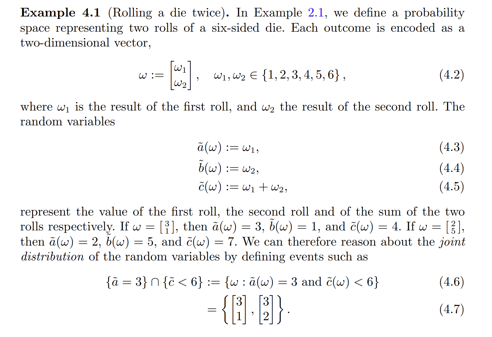
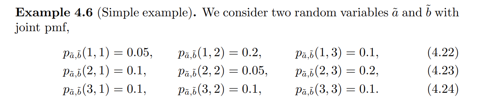
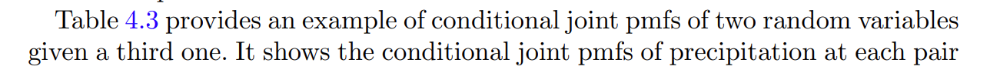

# Discrete Random Vectors
[probability_3.pdf](https://www.yuque.com/attachments/yuque/0/2023/pdf/12393765/1696534109786-dd73ec1c-6330-414d-b4b4-8f47e38d1a67.pdf)
## Defintion
> 
> 注意这里`Outcome`也是`Vector`。

## Joint PMF
### Defintion
> 

### Properties
> 

**Proof of dimension-2 case**

## Joint Events
### Definition
> $\{\omega \in \Omega: \tilde{a}(\omega)=a\cap \tilde{b}(\omega)=b\}$, 记作 $\{\tilde{a}=a, \tilde{b}=b\}$，想象$\{\tilde{a}=a, \tilde{b}=b\}$对应的是一系列的$w=\begin{bmatrix} w_1\\w_2\end{bmatrix}\in \Omega$(二维格点)。
> 

**Graphical Explanation**
**Proof of dimension 2**

### Example
> 

## Empirical Joint PMF
### Definition
> 

### Moviedata Example - 2d example
> 

### Precipitation - 3d Example
> Sample Space 可以想象成$\{000,001,010,011,100,101,110,111\}$, 其中$011$代表`Coos Bay`没下雨，`Corvallis`和`John Day`下雨。
> 观察到的数据格式是$(1,0,1),(0,1,1),(1,1,0),(1,1,1),(1,1,1),(1,0,1),(0,0,1)...$
> 

## Marginal PMF
### Definition
> 

**Proof of 2d case**

### Simple Example
> 

### Precipitation - 3d Example
> 
> 假设我们知道$\tilde{x}[1],\tilde{x}[2],\tilde{x}[3]$的联合分布，但是我们只关心$\tilde{x}[1],\tilde{x}[2]$的联合分布，我们可以求`Marginal Distribution`:
> 
> 于是我们对每一个气象站组合`(Coos Bay, Corvallis),(Coos Bay, John Day), (John Day, Corvallid)`求一个边缘分布可得:
> 
> 又或许我们只想知道$\tilde{x}[1],\tilde{x}[2],\tilde{x}[3]$各自的分布，我们可以:
> 
> 对每个气象站求边缘分布可得:
> 

## Empirical Marginal PMF
### Definition
> 

**Proof**

## Conditional PMF
### Definition
> 

### Chain Rule
> 

### Simple Example - Conditioning
> 

### Moviedata -2d Example
> 

### Precipitation - 3d Example
> 

## Independence
> 
> $(4.71)$这个式子其实已经暗含了`Pairwise Independence`(By chain rule).

## Conditional Independence
### Definition
> 

### Precipitation - 3d Example
> 在不知道`Corvallis`的情况下，`Coos Bay`和`John Day`是`Dependent`的，如下图所示:
> 
> 但是在知道`Corvallis`的情况下，`Coos Bay`和`John Day`是`Independent`的(至少比上面的更加`independent`), 如下图所示:
> 
> Once we know Corvallis, John Day gives us less information about Coos Bay.
> **Coos Bay and John Day are conditionally indepedent given Corvallis.**

# Causual Inference
> 

# Continuous Random Vectors
## CDF/PDF
> **CDF for Random Vector:**
> 由于$X_1,\cdots, X_n$都是连续的，换句话说就是$X_i$的样本空间就是一些`Intervals`的`Unions`或者`Intersections`, 而$X_1,\cdots, X_n$共同组成的高维样本空间就是所有$X_i$的一维样本空间的笛卡尔积。
> 
> **PDF for continuous Random Vector:**
> 求`PDF`按照国际惯例就是求导:
> 

# 
## Subvectors
### Definition
> 
> 举个例子: 假设我们有一个随机向量$\bf X=\begin{bmatrix} X_1\\X_2\\\vdots\\X_n\end{bmatrix}$, 他的一个`Subvector`就是$\bf X_{\mathcal{I}}=\begin{bmatrix} X_1\\X_3\\X_5\end{bmatrix}$, 换句话说就是取了$X_1,\cdots, X_n$中的$3$个元素出来。此时: $\mathcal{I}=\{1,3,5\}\subseteq \{1,2,\cdots,n\}$

### Summing/Integrating over vectors
> 下面定义的概念主要是为了方便后续阐述`Marginal Distribution of Random Vector` 做铺垫的。
> 
> 其实上述定义就是在表达我如果要求一个`Marginal Distribution`怎么用数学语言表达，其实没那么难。如果觉得抽象，可以看后面的`Integrating Example`来熟悉这一套数学语言。

## Joint/Marginal Distribution
> 假设$X_1,X_2,\cdots, X_n$都是离散的随机变量，则此时如果我们要求`Random Vector`$\bf X$取到$\bf x$的概率, 相当于要求$\mathbb{P}(\mathbf{X=x})=\mathbb{P}(X_1=x_1,X_2=x_2,\cdots, X_n=x_n)$。
> 
> 要注意: 我们不确定$X_1,\cdots X_n$是否是彼此独立的。于是不能将$\mathbb{P}(X_1=x_1,X_2=x_2,\cdots, X_n=x_n)$写成$\mathbb{P}(X_1=x_1)\mathbb{P}(X_2=x_2)\cdots \mathbb{P}(X_n=x_n)$的形式，我们需要依赖协方差矩阵判断。

### Axiom of Probability
> 

### Marginal Distribution
> 

**Proof**

## Conditional Distribution
### Definition
> 

> 

**Proof**
### 

## Integrating Example
### Lemma
> 

**Proof**

### Problem Setting
> 

### Joint Distribution
> 

### Conditional Distribution
> 
> 首先我们求$X_1,X_3$的联合分布，也就是对所有的$X_2$求和，得到下面的式子：
> 之后我们可以求解边缘分布($X_2|X_1,X_3$): 

**Graph**

## Independence
### Jointly Independent
> 

### Conditionally Independent
> 

### Pairwise doesn't imply Joint
> 

