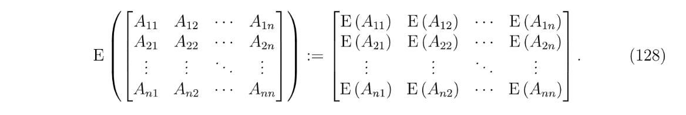

# Random Matrices
# Square-root Matrix
## Preliminaries
> 假设$\bf A$是一个$k\times k$的正定矩阵，则首先我们可以知道:
> 1. $\bf A$是一个对称矩阵，$\bf A^T=A$
> 2. $\bf A$可以正交对角化，也就是可以找到$k$个线性无关且正交的单位特征向量组成正交矩阵$\bf U$(满足$\bf U^{-1}=U^T$, )使得$\bf A=U\Lambda U^T$, 其中$\bf \Lambda$的对角线上是$\bf A$的所有特征值。
> 3. $\bf A$的所有特征值都大于零，即$\lambda_1,\lambda_2,\cdots, \lambda_n>0$
> 4. $\bf A$是一个可逆矩阵, 因为所有特征值大于零。
> 
所以$\bf A^{-1}$存在且$\bf A^{-1}=(U\Lambda U^T)^{-1}=(U^T)^{-1}\Lambda^{-1}U^{-1}=U\Lambda^{-1}U^T$, 我们可以看到矩阵$\bf A$的特征向量其实没有改变，只是所有特征值取了一个倒数。而我们知道对于任何可以正交对角化的矩阵来说，它都可以写成进行谱分解的形式:$\bf A=\sum_{i=1}^n \lambda_iu_iu_i^T$, where $\bf U=\begin{bmatrix} \bf u_1&\bf u_2&\cdots&\bf u_n\end{bmatrix}$，同时我们有$\bf A^{-1}=\sum_{i=1}^n \frac{1}{\lambda_i}u_iu_i^T$

## Definition
> 现在我们想对$\bf A_{k\times k}$这个正定矩阵做一个平方根的操作， 就是使得存在一个矩阵$\bf S$使得$\bf S^2=A$。
> 因为$\bf A=U\Lambda U^T$, 且$\bf U^TU=UU^T=I$, 所以我们可以构造一个$\bf S=U\Lambda^{\frac{1}{2}}U^T$, 其中$\bf \Lambda^{\frac{1}{2}}=\begin{bmatrix} \sqrt{\lambda_i}&\cdots&0\\\vdots&\ddots&\vdots\\0&\cdots&\sqrt{\lambda_k}\end{bmatrix}$。
> 于是我们可以将$\bf A^{\frac{1}{2}}=U\Lambda^{\frac{1}{2}}U^T$称为`Square Root Matrix`(特指正交矩阵开根后的矩阵):

## Properties
> 我们总结一下上述性质：
> 1. $\bf (A^{\frac{1}{2}})^T=A^{\frac{1}{2}}$
> 2. $\bf A^{\frac{1}{2}}A^{\frac{1}{2}}=A$
> 3. $\bf A^{\frac{1}{2}}$是可逆的，$(\bf A^{\frac{1}{2}})^{-1}=\sum_{i=1}^n\frac{1}{\sqrt{\lambda_i}}u_iu_i^T=U\Lambda^{-\frac{1}{2}}U^T$, 其中$\bf \Lambda^{-\frac{1}{2}}$是一个对角矩阵$\begin{bmatrix} \frac{1}{\sqrt{\lambda_i}}&\cdots&0\\\vdots&\ddots&\vdots\\0&\cdots&\frac{1}{\sqrt{\lambda_k}}\end{bmatrix}$
> 4. $\bf A^{\frac{1}{2}}A^{-\frac{1}{2}}=A^{-\frac{1}{2}}A^{\frac{1}{2}}=I$且$\bf A^{-\frac{1}{2}}A^{-\frac{1}{2}}=A^{-1}$, 其中$\bf A^{-\frac{1}{2}}=(A^{\frac{1}{2}})^{-1}$

## Mean and Variance 
### Expected Value of RV Function
> 

### Mean Vector
> 

## Random Matrix
> 

## Linear Transformation
> 

## Covariance Matrix
### Definition
> 
> 

### Theorem
> 

**Proof**

