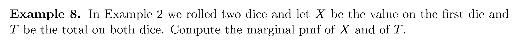
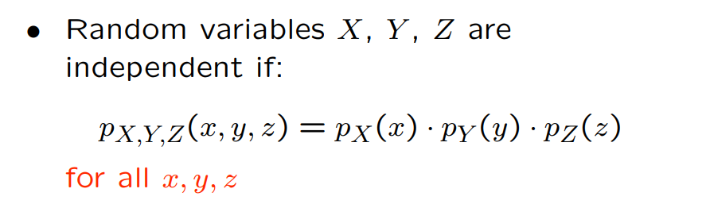

[Joint Distributions, Independence.pdf](https://www.yuque.com/attachments/yuque/0/2022/pdf/12393765/1661243791765-d2b7ec93-f076-4c1b-b0f0-77c49793c46d.pdf)
# 1  联合概率密度函数
## 1.1 Joint PMF
### 1.1.1 定义
> 假设$X,Y$是两个离散的随机变量，$X\in\{x_1,x_2,...,x_n\}$, $Y\in \{y_1,y_2,...,y_m\}$。那么$(X,Y)$就是$\{x_1,x_2,...,x_n\}$和$\{y_1,y_2,...,y_m\}$这两个集合的笛卡尔积，也就是说$(X,Y)\in \{(x_1,y_1),(x_1,y_2),...,(x_n,y_m)\}$。
> 所以`Joint Probability Mass Function`给出了$X=x_i,Y=y_i$的联合概率。下面是标准定义。
> 
> 

### 1.1.2 图解
> 我们可以看到，联合概率密度函数$p_{X,Y}(x,y)$给每一个$(x_i,y_j)$对定义了一个概率。
> 
> 

### 1.1.3 性质
> 如果$p_{X,Y}(x,y)$想成为一个合法的概率密度函数，则它必须满足概率公理, 也就是:
> 

## 1.2 Marginal PMF
### 1.2.1 定义
> 
> 

**Derivation**
可以使用上文提到的`Tabular View`来理解。

### 1.2.2 图解
> 
> 

## 1.3 Function of Joint PMF
### 1.3.1 定义
> 假设$Z=g(X,Y)$, 则$Z$的`PMF`是:
> 

### 1.3.2 算例
> 
> 
> 求$Z$的`PMF`和$E(Z)$

**Z 的 PMF**

**E(Z)**
1. **解法一（从定义出发）:**

2. **解法二（从期望的性质出发）:**

## 1.4 多元函数的期望
### 1.4.1 定义与推导
> 

**推导方法一(从定义出发)**假设二维样本空间是$\Omega$
$E(g(X,Y))=E(Z)=\sum_{z}zp_Z(z)\newline=\sum_{z}z\sum_{\{(x,y)|g(x,y)=z\}}p_{X,Y}(x,y)\newline=\sum_{z}\sum_{\{(x,y)|g(x,y)=z\}}zp_{X,Y}(x,y)\newline\newline=\sum_{z}\sum_{\{(x,y)|g(x,y)=z\}}g(x,y)p_{X,Y}(x,y)\newline=\sum_{z}\sum_{\{(x,y)|g(x,y)=z\}}g(x,y)p_{X,Y}(x,y)\newline=\sum_{\{(x,y)\in \Omega\}}g(x,y)p_{X,Y}(x,y)\newline=\sum_{x}\sum_{y}g(x,y)p_{X,Y}(x,y)$, 证毕。
**推导方法二(使用全概率公式)**

### 1.4.2 运算性质
> 

**推导**

### 1.4.3 易错点
> **但是要注意:**
> 
> 其实对于一个非线性函数$g(x,y)$上述关系就不成立, 上述关系只对线性函数成立，比如$Z=X+Y$，因为期望本身有线性运算性质。

## 1.5 多于两个变量的联合分布
### 1.5.1 联合概率密度函数
> 
> 此时样本空间是$\{(x_1,y_1,z_1),(x_1,y_1,z_2),...,(x_m,y_n,z_k)\}$, 也就是$X,Y,Z$各自样本空间的笛卡尔积。可视化出来之后样本空间是一个长方体。

### 1.5.2 边缘概率
> 

### 1.5.3 期望
> 

**推广到n个变量**

## 1.6 总结
> 

# 2 多元条件概率
## 2.1 Conditional PMF
### 2.1.1 定义
> 
> 换句话说，如果我知道了$Y=y$, 我对$X$的取值的信仰将发生变化，如果$X,Y$不独立，则我们需要使用一个全新的概率密度函数$p_{X|Y}(x|y)$来描述。
> 
> 

### 2.1.2 解读
> 在定义了多元条件概率密度函数$p_{X|Y}(x|y)$后，我们要看看这个概率密度函数是不是合法，也就是，他是否符合概率公理。
> 因为$p_Y(y)>0,p_{X,Y}(x,y)\geq 0$, 所以$p_{X|Y}(x|y)\geq 0$满足概率公理$1$
> 另外$\sum_{x}p_{X|Y}(x|y)=\frac{\sum_{x}p_{X,Y}(x,y)}{p_Y(y)}=\frac{p_Y(y)}{p_Y(y)}=1$满足概率公理$2,3$
> 其中$p_Y(y)$是一个`Normalization Factor`, 为的是让$Y=y$时$\{X=x\}$的事件的概率和为$1$, 符合概率公理

**可视化**

### 2.1.3 运算性质
> 
> 

### 2.1.4 总结
> 

## 2.2 条件期望
### 2.2.1 定义及推导
> 

**推导**我们可以将$Y=y$看成是一个事件$A$
$E(X|A)=\frac{\sum_xxP(\{X=x\}\cap A)}{P(A)}=\frac{\sum_xxP(\{X=x\}\cap \{Y=y\})}{P(A)}=\frac{\sum_xxp(X=x,Y=y)}{P(Y=y)}=\sum_x x\frac{p_{X,Y}(x,y)}{p_Y(y)}=\sum_x xp_{X|Y}(x|y)$, 证毕。

### 2.2.2 衍生运算性质及推导
> 
> 这三个公式的推导如下:

**(1)****我们先给出引理（可以将**$X=x$**看成事件**$B$**来理解, 推导参考:**[Conditional PMF](https://www.yuque.com/alexman/kziggo/dqmnqy#tKwJg)**和**[条件全概率公式](https://www.yuque.com/alexman/kziggo/dqmnqy#yaUUQ)**）**

**使用全概率公式可以推导:**

**(2)**对于$X$我们根据全概率公式有$p_X(x)=P(A_1)p_{X|A_1}(x)+\cdots +P(A_n)p_{X|A_n}(x)$
现在我们在事件$B$发生后的样本空间中重写上述算式(本质上只是缩减一下样本空间):
对于$p_{X|B}(x)=P(A_1)p_{X|A_1\cap B}(x)+\cdots +P(A_n)p_{X|A_n\cap B}(x)$
我们在等式两边作如下变化:$\sum_x xp_{X|B}(x)=\sum_x P(A_1)xp_{X|A_1\cap B}(x)+\cdots +P(A_n)xp_{X|A_n\cap B}(x)\newline=P(A_1)E(X|A_1\cap B)+\cdots +P(A_n)E(X|A_n\cap B)\newline=\sum_{i}P(A_i)E(X|A_i\cap B)$
证毕。
**(3)**和$(1)$中类似，只是把事件$A_i$换成事件$Y=y$，证明略。

# 3 多元变量独立性
## 3.1 变量和事件的独立性
### 3.1.1 定义
> 

### 3.1.2 判断变量和事件是否独立
> 假设$X$的样本空间是$\Omega$, 且事件$A$满足$P(A)>0$, 则：
> 

> 
> 因为$p_{X|A}(x)$和$p_X(x)$不一致，所以随机变量$X$的取值和事件$A$不独立。

## 3.2 变量和变量的独立性
### 3.2.1 定义
> 回顾一下事件的独立性的定义，假设有两个事件$A$和$B$, 如果他们独立，则有:
> $P(A\cap B)=P(A)P(B)$
> 类比这个定义，我们知道$X=x(X\leq x,X\geq x)$和$Y=y(Y\leq y,Y\geq y)$都可以表示特定的事件，比如$X\leq 2$和$Y\geq 5$。
> 所以如果任何由$X$和$Y$定义的事件都是独立的，则我们有如下多元变量独立性的定义:
> 
> **This is the same as requiring that the two events **$\{X = x\}$** and **$\{Y = y\}$** be in­**
> **dependent for every **$x$** and **$y$**. **

### 3.2.2 变量独立的链式法则
> 如果我们有三个变量$X,Y,Z$, 则链式法则告诉我们:
> $P(\{X=x\}\cap \{Y=y\}\cap \{Z=z\})=P(A\cap B\cap C)\newline=P(A|B\cap C)P(B|C)P(C)=p_{X|Y,Z}(x|y,z)p_{Y|Z}(y|z)p_Z(z)$
> 也可以写成下面的形式:
> 
> **如果他们独立，则:**
> 

### 3.2.2 判断变量之间独立性
#### 方法一: 使用条件概率密度函数
> 我们也可以使用条件概率密度函数来判断变量$X$和$Y$独立性, 也就是说知道了$Y$的值对我$X$的分布没有任何影响:
> 
> 

#### 方法二 使用概率表
> 假设我们有两个随机变量$X,Y$, 满足$\sum_{x}\sum_{y}p_{X,Y}(x,y)=1$, 我们可以画出二维概率表:
> 
> 我们当然可以对所有$(x,y)\in \Omega$, 验证$p_{X,Y}(x,y)=p_{X}(x)p_{Y}(y)............(0)$都成立。
> 但是如果因为某种原因我们的某些$p_{ij}$的值不知道。我们怎么快速判断独立性呢?
> 我们知道，如果$X$和$Y$要想独立，必须满足$(0)$中的条件。也就是$\begin{cases} p_X(x_1)p_Y(y_1)=p_{X,Y}(x_1,y_1)=p_{11}..................................(1)\\p_X(x_i)p_Y(y_1)=p_{X,Y}(x_i,y_1)=p_{i1}..................................(2)\\p_X(x_1)p_Y(y_j)=p_{X,Y}(x_1,y_j)=p_{1j}..................................(3)\\p_X(x_i)p_Y(y_j)=p_{X,Y}(x_i,y_j)=p_{ij}..................................(4)\end{cases}$
> $(1),(2),(3),(4)$必须同时成立，假设$p_{11},p_{1j},p_{i1}$都存在, $p_{ij}$不存在
> 则$\frac{(1)}{(2)}=\frac{(3)}{(4)}$必须成立，也就是$\frac{p_{11}}{p_{i1}}=\frac{p_{1j}}{p_{ij}}$必须成立，才可能有$X,Y$独立。

### 3.2.3 算例
#### 算例1
> 简单来说，如果我们能够画出二维概率表，我们只要保证每一个单元格中的数值等于这个单元格所在行的边缘概率的乘积，那么就可以判断变量独立。
> 
> 

#### 算例2
> 
> 第一问，我们采用算例$1$中的方法，可知$X,Y$不独立
> 第二问，我们找出新的样本空间:
> 然后采用算例$1$中的方法，发现$X,Y$条件独立

## 3.3 变量间条件独立性
### 3.3.1 定义
> 和事件的条件独立性类似，变量$X$和$Y$在事件$A$发生的情况下独立, 有如下定义：
> 

### 3.3.2 判断条件独立性
> 我们也可以使用条件概率密度函数来判断变量$X|A$和$Y|A$独立性:
> 
> $A$是我们的新的样本空间。

## 3.4 随机变量函数的独立性
> 对于多个变量$X_1,X_2,...,X_n$, 如果他们独立，则$f_1(X_1),f_2(X_2),...,f_n(X_n)$独立。

## 3.5 期望和独立性
> 
> 

**推导第一个式子**

## 3.6 更多变量间的独立性
> 对于$X,Y,Z$来说，如果他们独立，则:
> 
> **注意**$for\space all\space x,y,z$**这个条件**

 

## 3.7 方差与独立性
> 

## 3.8 Derangement 问题
### 3.8.1  期望分析
> 这里我们对于`Derangement`问题中的$n$个变量的独立性进行分析：
> 
> 

### 3.8.2 方差分析
> 
> $X^2=(\sum_i X_i)^2=\sum_{i}X_i^2+\sum_{i,j:i\neq j}X_iX_j$(因为最高是二次，所以不会出现$X_iX_jX_k...$这种)
> **第一部分: **因为$X_i\in \{0,1\}$, 所以$E(X_i^2)=E(X_i)=\frac{1}{n}$, 所以$E(\sum_i X_i^2)=\sum_i E(X_i^2)=n\cdot \frac{1}{n}=1$
> **第二部分: **从期望分析我们知道，$X_i$之间不是独立的，于是$P(X_1X_2=1)=P(X_1=1)P(X_2|X_1=1)=\frac{1}{n}\cdot \frac{1}{n-1}$
> 所以$E(X_iX_j)=1\cdot P(X_iX_j=1)+0\cdot P(X_iX_j=0)=\frac{1}{n}\cdot \frac{1}{n-1}$
> 所以$E(X^2)=E(\sum_{i,j:i\neq j}X_iX_j)=\sum_{i,j:i\neq j}E(X_iX_j)=\frac{1}{n}\cdot \frac{1}{n-1}\cdot(n^2-n)$
> 所以最终的结果是: $Var(X)=2-1=1$

## 3.9 多项分布
### 3.9.1 多项分布函数
:::info
多项分布作为二项分布的延伸，他说的是我们有$n$个`trials`, 每个`trial`都有$r$个结果$r\geq 2$, 每种结果的概率是$p_i,i=1,2,\cdots, r$。
假设在$n$次`trials`中，结果$i$出现了$N_i$次(一个随机变量)，则为了计算这种情况出现的概率，我们定义一个联合分布:
$p_{N_1,N_2,\cdots, N_r}(n_1,n_2,\cdots, n_r)={n\choose{n_1,n_2,\cdots, n_r}}p_1^{n_1}p_2^{n_2}\cdots p_r^{n_r}$

:::
**Proof 1: 组合视角**There are ways to choose the objects for the first class. Having done that, there are ways of choosing the objects for the second class. Continuing in this manner,
there are:

**Proof 2: 排列视角**

### 3.9.2 边缘分布
:::info
上述多项分布实际上是$N_1, N_2,\cdots, N_r$的联合概率分布，所以自然而然我们会想求$N_i$的边缘概率函数，如果我们从定义出发，我们可能会这样计算：
$p_{N_i}(n_i)=\sum_{N_1,i=1}^{\infty}\cdots\sum_{N_{i-1},i=1}^{\infty}\sum_{N_{i+1},i=1}^{\infty}\cdots\sum_{N_r,i=1}^{\infty} {n\choose{n_1,n_2,\cdots, n_r}}p_1^{n_1}p_2^{n_2}\cdots p_r^{n_r}$
但这非常的繁琐，实际上我们可以从另一个角度切入，既然每次实验都有$r$种结果，且每种结果的概率是$p_1,p_2,\cdots, p_r$(满足$\sum_{i=1}^r p_i=1$), 那么$\mathbb{P}(N_i=n_i)=p_i$, 于是$N_i$实际上是一个二项分布，且:
$p_{N_i}(n_i)={n\choose n_i}p_i^{n_i}(1-p_i)^{n-n_i}$。
:::

### 3.9.3 加总
> 我们用$M(n,p)$表示`Multinomial Distribution`.
> 则$\sum_i M(1,p)=M(n,p), where~~n:i.i.d ~~copy$, and $M(n,p)$is random vector. 

