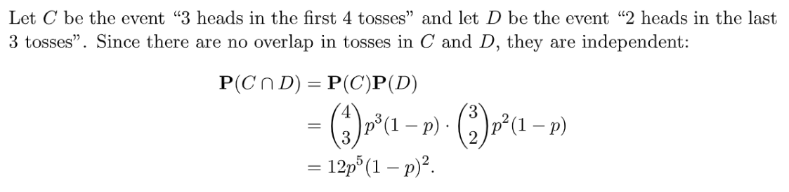

# 1 Recitation Problems
[Recitation 6.pdf](https://www.yuque.com/attachments/yuque/0/2022/pdf/12393765/1661243100153-45cadcce-6c77-4e1a-9e92-bf0c388a78ac.pdf)
[Recitation 6 Solutions.pdf](https://www.yuque.com/attachments/yuque/0/2022/pdf/12393765/1661243100135-865ef2fb-8684-4415-af3b-cdbc3f1661c3.pdf)
[Recitation 7.pdf](https://www.yuque.com/attachments/yuque/0/2022/pdf/12393765/1661259650266-df1fccac-2a34-4ab7-8e49-1e3b0d2c6642.pdf)
[Recitation 7 Problems.pdf](https://www.yuque.com/attachments/yuque/0/2022/pdf/12393765/1661259650300-4b1950bb-1e62-40f2-ab07-042a3a059ee9.pdf)

## P1 条件PMF**⭐⭐**
> 

**(a)**
**(b)**本质就是要计算$P(N=n,K=k)$，并对于每一个$(N,K)$对画出一个表。
$P(N=n,K=k)=\frac{1}{4}\cdot C_n^k(\frac{1}{2})^n$, 所以：

**(c) ⭐**根据$(b)$中得到的表，我们取条件概率，有:

**(d)⭐**和$(c)$问中的方法一样:

## P2 条件期望**⭐⭐⭐**
> 

**(a)**
**(b)**
**(c) ⭐⭐**
**(d)⭐⭐**

## P3 几何分布的期望与方差**⭐⭐**
> 
> 参考: [常见分布的期望与方差](https://zhuanlan.zhihu.com/p/145615691)

**解法一: 无穷级数**
1. **等比数列求和公式:**

2. **期望的推导:**

3. **方差的推导:**

**解法二: 几何分布无记忆性⭐⭐**
1. **期望**

假设事件$A=\{X=1\}$, $A^c=\{X>1\}$
我们知道$E(X|X=1)=1\cdot \frac{P(X=1)}{P(X=1)}=1$
对于$E(X|X>1)$, 因为几何分布的无记忆性, 所以$P(X=k|X>1)=P(X=k-1)$
因为$E(X|X>1)=\sum_{k=2}^\infty k\cdot P(X=k|X>1)=\sum_{k=2} ^ \infty k\cdot P(X=k-1)$
且我们有$\sum_{k=2}^\infty (k-1)\cdot P(X=k-1)=E(X)$
**于是我们有如下推导:**
$E(X|X>1)=\sum_{k=2} ^ \infty k\cdot P(X=k-1)\newline=\sum_{k=2}^\infty (k-1)\cdot P(X=k-1)+\sum_{k=2}^\infty 1\cdot P(X=k-1) =E(X)+1$
**当然我们也可以直观地理解这个等式:**

**所以：**

2. **方差**

## P4 推导多元期望公式**⭐⭐**
> 

**Part 1**参考:[多元函数的期望](https://www.yuque.com/alexman/kziggo/ng8x7t#pc9Ki)

**Part 2**

## P5 比值判断独立性**⭐⭐⭐⭐⭐**
> 
> 

**(a)**
**(b)**
**(c)**
**(d) 比值判断法⭐⭐⭐⭐**如果我们想要$X,Y$独立，则必须满足:$\begin{cases} p_X(1)p_Y(1)=p_{X,Y}(1,1)............(1)\\p_X(1)p_Y(3)=p_{X,Y}(1,3)............(2)\\p_X(2)p_Y(1)=p_{X,Y}(2,1)............(3)\\p_X(2)p_Y(3)=p_{X,Y}(2,3)............(4)\end{cases}$
我们发现$(1)/(2)=(3)/(4)$, 所以$\frac{p_{X,Y}(1,3)}{p_{X,Y}(1,1)}=\frac{p_{X,Y}(2,3)}{p_{X,Y}(2,1)}=\frac{p_Y(3)}{p_Y(1)}$必须成立才行。但是本题中这一关键等式不满足，所以$X,Y$不独立。
**(e) 比值计算法⭐⭐⭐⭐**首先我们知道，$X$和$Y$在事件$B$上是条件独立的，也就是说:$p_{X|B}(x)p_{Y|B}(x)=p_{X,Y|B}(x,y)$对$(x,y)\in B$成立
所以我们有如下的条件成立:$\begin{cases} p_{X|B}(1)p_{Y|B}(1)=p_{X,Y|B}(1,1).....................(1)\\p_{X|B}(1)p_{Y|B}(2)=p_{X,Y|B}(1,2).....................(2)\\p_{X|B}(2)p_{Y|B}(1)=p_{X,Y|B}(2,1)
.....................(3)\\p_{X|B}(2)p_{Y|B}(2)=p_{X,Y|B}(2,2).....................(4) \end{cases}$
于是$(1)/(2)=(3)/(4)$, 所以$\frac{p_{X,Y|B}(1,1)}{p_{X,Y|B}(1,2)}=\frac{p_{X,Y|B}(2,1)}{p_{X,Y|B}(2,2)}$
上下同时乘以$P(B)$, 所以$\frac{p_{X,Y|B}(1,1)P(B)}{p_{X,Y|B}(1,2)P(B)}=\frac{p_{X,Y|B}(2,1)P(B)}{p_{X,Y|B}(2,2)P(B)}$
所以$\frac{p_{X,Y}(1,1)}{p_{X,Y}(1,2)}=\frac{p_{X,Y}(2,1)}{p_{X,Y}(2,2)}$
而$p_{X,Y}(2,2)=\frac{\frac{2}{12}\frac{2}{12}}{\frac{1}{12}}=\frac{1}{3}$
**(f)⭐⭐**因为$P(B)=P(\{X\leq 2\}\cap \{Y\leq 2\})=P(X\leq 2,Y\leq 2)$, 因为$p_{X,Y}$是合法的概率密度函数，所以根据概率公理$2$:
$P(B)=p_{X,Y}(1,1)+p_{X,Y}(1,2)+p_{X,Y}(2,1)+p_{X,Y}(2,2)\newline =\frac{2}{12}+\frac{2}{12}+\frac{1}{12}+\frac{1}{3}=\frac{3}{4}$
于是$p_{X,Y|B}(2,2)=\frac{p_{X,Y}(2,2)}{P(B)}=\frac{\frac{1}{3}}{\frac{3}{4}}=\frac{4}{9}$

## P6 几何分布无记忆性**⭐⭐⭐⭐⭐**
> 

**解法(几何分布的无记忆性)⭐⭐⭐⭐**如果直接去求$X$(停止时投掷的硬币数)的`PMF`, 运算会非常的繁琐，所以我们采用几何分布的特性:
假设事件$H_k$: 第$k$次扔硬币是`Head`；事件$T_k$: 第$k$次扔硬币是`Tail`

1. 首先注意到$H_1$和$T_1$将硬币投掷的结果序列的样本空间划分成了`Disjoint`的两个部分(第一次是`Head`的一部分和第一次是`Tail`的一部分)，所以$E(X)=E(X|H_1)P(H_1)+E(X|T_1)P(T_1)$

我们知道$P(H_1)=p,P(T_1)=1-p=q$, 所以	
$E(X)=pE(X|H_1)+qE(X|T_1)$

2. **然后对于**$E(X|H_1)$**, 我们使用全概率公式, 因为**$H_2$**和**$T_2$**将第一次投掷结果为**$H_1$**的样本空间进一步划分成了**`**Disjoint**`**的两部分，所以: **$E(X|H_1)=E(X|H_1\cap H_2)P(H_2)+E(X|H_1\cap T_2)P(T_2)$

**对于**$E(X|T_1)$**, 因为**$H_2$**和**$T_2$**将第一次投掷结果为**$H_1$**的样本空间进一步		划分成了**`**Disjoint**`**的两部分，所以: **
$E(X|T_1)=E(X|T_1\cap H_2)P(H_2)+E(X|T_1\cap T_2)P(T_2)$

3. 然后我们开始迭代，因为$H_1\cap H_2$或者$T_1\cap T_2$都会导致实验立刻停止，所以$E(X|H_1\cap H_2)=2,E(X|T_1\cap T_2)=2$。那么如果前两次的结果是$H_1\cap T_2$或者$T_1\cap H_2$呢？ 
4. 根据几何分布的特性，我们知道如果是$H_1\cap T_2$的情况，那么我们的实验不会停止，而且最后一次抛掷的结果是`Tail`, 所以根据几何分布的无记忆性: $P(X=k|H_1\cap T_2)=P(X=k-1|T_1)$。怎么理解呢？假设我们开始实验，发现第一次的结果是`Head`, 那么实验将继续，我手头已经有一个`Head`了，我期待着下一次还是`Head`来终止实验，但是不巧的是，第二次结果是个`Tail`, 这说明我将**重置**我的期望，也就是说我手头现在已经有一个`Tail`了，我期待下次还是`Tail`来结束实验。重点在于重置和无记忆性。于是我们会有一个本题中最重要的等式: $E(X|H_1\cap H_2)=1+E(X|T_1)$, 我们给出推导:

首先因为$P(X=k|H_1\cap T_2)=P(X=k-1|T_1)$, 所以我们等式两边对$X$	的不同取值求和，得到$\sum_2^\infty P(X=k|H_1\cap T_2)=\sum_2^\infty kP(X=k-1|T_1)\newline=\sum_2^\infty (k-1)P(X=k-1|T_1)+\sum_2^\infty P(X=k-1|T_1)$, 

   - 因为$\sum_2^\infty (k-1)P(X=k-1|T_1)=E(X|T_1)$
   - 且因为$p_{X|T_1}$是一个合法的概率密度函数，所以$\sum_2^\infty P(X=k-1|T_1)=1$,  	所以$E(X|H_1\cap H_2)=1+E(X|T_1)$
5. $E(X|H_1)=2p+q(1+E(X|T_1))$, $E(X|T_1)=2q+p(1+E(X|H_1))$
6. 由$p+q=1$, 结合$5$中的两个式子组成的线性方程组我们得到:$\begin{cases}E(X|H_1)=\frac{2+q^2}{1-pq} \\E(X|T_1)=\frac{2+p^2}{1-pq}\end{cases}$, 所以

# 2 Tutorial Problems
[Tutorial 3 Problems.pdf](https://www.yuque.com/attachments/yuque/0/2022/pdf/12393765/1661254425597-c2b4083d-24de-4395-ab75-735a05f26f46.pdf)
[Tutorial 3 Solutions.pdf](https://www.yuque.com/attachments/yuque/0/2022/pdf/12393765/1661254444596-4891e22a-7fe8-4c0f-9ef8-e5438218aedc.pdf)
## P1 集卡问题**⭐⭐⭐⭐⭐**
> 

**集卡问题**参考：[https://zhuanlan.zhihu.com/p/140537355](https://zhuanlan.zhihu.com/p/140537355)
相信大家小时候都收集过干脆面里面各种各样的卡片，比如小浣熊干脆面的“水浒卡”$108$将，白象干脆面的”三国卡“，还有魔法士的“火影卡”等等，这些卡片成了我们这一代人的童年记忆。前几天收拾旧东西的时候，在抽屉里翻到了当年收集的各种卡片，突然想到这样一个问题：要集齐$108$将，平均需要买多少包小浣熊？
这个问题我们就把它叫做“集卡问题”吧。对于“集卡问题”，我们可以抽象出这样一个数学模型：假设卡池里总共有 $N$ 种卡片，每种卡片出现的概率均等，我们每次抽卡只能随机获得一张卡片，直到集齐为止，我们共抽了 $X$张卡，求 $X$ 的期望。
**思路**题中出现了`Expect`, 说明是和期望相关的问题。
这道题有很多种变形，其中一种变形就是集卡问题，假设卡池中有$N$**种**不同的卡, 且卡池中的卡的数量是无限的，也就是说从卡池中随机抽取一张卡是第$i$类的概率都是$\frac{1}{N}$。问我期望要抽取多少张卡才能集齐所有的卡至少一张。
可以假设随机变量$X$表示：**我集齐所有种类的卡各至少一张期望需要抽取多少张卡。**
根据抽屉原理，我们知道: $X\geq N$, 所以$E(X)=\sum_{\{x|x\geq N\}}x\cdot p_X(x)$，然后我们求对应的$p_X(x)$。
但是直接求解 $X$ 的概率分布将非常繁琐， $X$ 的取值从 $N$ 到 $∞$ , 每个 $X$ 的取值的概率计算都是复杂的排列组合运算，这样求解看来有点行不通。
我们来换个思路，给 $X$ 加上角标，用 $X_m$ 表示还差 $m$ 种卡片没有收集的时候，需要抽取的卡数，显然 $0≤m≤n$ , 原问题转化为求 $X_n$ 的期望 $E(X_n)$，我们希望能构造出 $E(X_m)$ 的递推关系式，从而求解出最后的$E(X_n)$ 。首先我们知道 $E(X_0)=0$ , 这是显然的，因为已经集齐了各个种类的卡片，自然不需要再抽卡了。当还差 $m>0$ 种卡片没有集齐的时候，抽下一张卡的时候有两种情况发生，一种是获得了新的卡片，概率为 $\frac{m}{n}$ ，另一种是得到了重复的卡片，概率为 $\frac{n−m}{n}$ ，因此期望的递推关系式可以由此建立：
$E(X_m)=\frac{m}{n}E(X_{m−1})+\frac{n−m}{n}E(X_m)$
整理可得到前后项差：
$E(X_m)−E(X_{m−1})=\frac{n}{m}$
所以集齐所有卡片需要抽卡数量的期望为：
$E(X_n)=E(X_0)+∑_{i=1}^n(E(X_{i}-E(X_{i-1})))=n\sum_{m=1}^n\frac{1}{m}$
我们知道，调和级数和对数函数同阶：
$\sum_{m=1}^n \frac{1}{m}\sim ln(n)$
因此 $E(X_n)$ 是与 $nln(⁡n)$ 同阶的，代入 $n=108$ 可以得到集齐“水浒卡”$108$将平均大概需要抽$568.51$张卡。

**注意事项**当然，以上的**所有结果都是基于每一张卡片的概率是均等的前提**，如果商家故意改变卡片的概率，让某些卡片十分稀有，那么要想集齐所有卡片则需要购买更多的干脆面。比如当年的“大刀关胜”在我的省份就非常稀有，因此我和我的小伙伴买空了小卖部也没有集齐$108$将，恨自己当年没有早点学会概率论，否则也不会中了这些无良商家的圈套。
**解法一(递推)**有了上面的铺垫，我们可以很快求出结果，就是$6(1+\frac{1}{2}+\frac{1}{3}+\frac{1}{4}+\frac{1}{5}+\frac{1}{6})=14.7$
**解法二(几何分布)**
令$K=6$, 表示我们有$6$类成绩要集齐。
令$Y_i$: 在我们获得第$i$个新的成绩时已经批改过的卷子总数，换句话说，我们假设：

- 第$1$张给了$A$(第一个之前没出现过的等第), 那么$Y_1=1$。
- 第$2$张给了$A^-$(第二个之前没出现过的等第), 那么$Y_2=2$。
- 第$3$张又给了$A$(之前已经出现过了, 我们跳过) 。
- 第$4$张我们给了$B$(第三个之前没出现过的等第), 那么$Y_3=4$。

**我们要求的是**$E(Y_i)$**, 但是直接求很难，我们将问题转换一下：**
令$X_i=Y_{i+1}-Y_i$, 表示我获得第$i$个新的等第经历了多少张试卷的批改。
我们对$X_i$的分布情况进行分析，我们可以发现$X_i$其实服从几何分布，参数是$\frac{6-i}{6}$, 所以$X_i\sim Geo(\frac{6-i}{6})$。
为什么呢? 如果我们观察$X_1$这个变量，这表明我已经获得了一个等第，那么获得剩下的不同的等第的概率就是$\frac{5}{6}$，于是我们有$\frac{6-i}{6}$的出现。
于是$E(X_i)=\frac{1}{\frac{6-i}{6}}=\frac{6}{6-i}$
因为$Y_i=\sum_{i=0}^{K-1}X_i$, 所以$E(Y_6)=E(\sum_{i=0}^5 X_i)=\sum_{i=0}^5 E(X_i)=6(1+\frac{1}{2}+\cdots+\frac{1}{6})=14.7$

## P2 条件期望和方差**⭐⭐**
> 

**(a)**
**(b)**
**(c)**
**(d)**我们可以验证，在$X\neq 2$的新的样本空间下：

$P(X=x|X\neq 2)P(Y=y|X\neq 2)=P(\{X=x\}\cap \{Y=y\}|X\neq 2)$
**(e)**

# 3 Assignment
[Assignment 4.pdf](https://www.yuque.com/attachments/yuque/0/2022/pdf/12393765/1661259650307-20989ee6-7e32-4ef2-a5a7-f1381419bc4f.pdf)
[Assignment 4 Solutions.pdf](https://www.yuque.com/attachments/yuque/0/2022/pdf/12393765/1661259650300-d74fe9d9-5343-4909-af23-67d6f59fe9c5.pdf)

## P1 联合PMF**⭐**
> 

**(a)~(e)**

**(f) 边缘概率**
**(g)**
**(h)**
**(i) 变量对事件的条件概率⭐⭐⭐⭐(容易错)**首先计算$P(A)$, $P(A)=\frac{1}{72}(2+5+17+25)=\frac{49}{72}$
**如果我们要求**$E(X|A)$**, 实际上我们要求**$p_{X|A}(x)$**, 而根据定义:**
$p_{X|A}(x)=\frac{P(\{X=x\}\cap A)}{P(A)}$。所以$\frac{P(\{X=x\}\cap \{X\geq Y\})}{P(A)}=\frac{P(X=x, X\geq Y)}{P(A)}=\frac{p_{X,Y}(X=x,X\geq Y)}{P(A)}\newline=\frac{p_{X,Y}(1,1)}{P(A)}=\frac{\frac{2}{72}}{\frac{49}{72}}=\frac{2}{49}$
**所以**$p_{X|A}(x)=\frac{2}{49}$**, 同理可得:**

注意，我们在求$p_{X|A}(x)$的时候，不能简单粗暴的用$X$的边缘概率$p_X(x)$去除以$P(A)$, 因为$p_X(x)=\sum_{y}p_{X,Y}(x,y)$, 是已经求和过的概率，除以$P(A)$没有实际意义，也不符合定义。

## P2 Unfair Die**⭐⭐⭐**
> 

**(a) 二项分布概率⭐**
**(b)**假设事件$A$: 第一次是$1$, 事件$B$：六次里面至少两次是$1$
要求的是$P(A|B)=\frac{P(A\cap B)}{P(B)}=\frac{\frac{1}{2}\cdot C_5^1 \cdot\frac{1}{2}\times (\frac{1}{2})^4}{C_6^2 \cdot (\frac{1}{2})^2\cdot (\frac{1}{2})^4}=\frac{5}{15}=\frac{1}{3}$
**(c)**$C_6^3$的目的是将长度为$6$的序列分成两组，也就是$C_6^3C_3^3$(分成两个子集)

**(d) 条件概率+二项分布⭐⭐⭐⭐⭐**

## P3 利用几何分布推导**⭐**
> 

**Key**对于$P(X=i|X+Y=n)=\frac{P(X=i\cap X+Y=n)}{P(X+Y=n)}$
对于分子来说$P(X=i\cap X+Y=n)=p_X(i)p_Y(n-i)$
对于分母来说$P(X+Y=n)=\sum_{i=1}^{n-1}p_X(i)p_Y(n-i)$
所以$\frac{P(X=i\cap X+Y=n)}{P(X+Y=n)}=\frac{p_X(i)p_Y(n-i)}{\sum_{i=1}^{n-1}p_X(i)p_Y(n-i)}$
因为$X\sim Geo(p),Y\sim Geo(p)$, $p_X(i)=(1-p)^{i-1}p, p_Y(i)=(1-p)^{i-1}p$
所以$\frac{p_X(i)p_Y(n-i)}{\sum_{i=1}^{n-1}p_X(i)p_Y(n-i)}=\frac{(1-p)^{n-2}p^2}{\sum_{i=1}^{n-1}(1-p)^{n-2}p^2}=\frac{1}{n-1}$
 

## P4 事件和独立性**⭐⭐⭐**
> 

**(a) 事件独立性**
**(b)**
**(c) 分组视角解决序列问题⭐⭐⭐⭐⭐****解法一(二项分布):**

**解法二(组合视角,counting)**：
这里使用组合的思路是这样:

- 我们知道$C_n^k$相当于从$n$个元素组成的集合中选出$k$个来组成一个子集。子集中的元素无论怎么打乱顺序都只算一种选法。
- 于是这里我们的`7次里面四个heads`的事件就相当于我从$7$个元素中选取$4$个作为我的`heads`, 不管顺序如何，剩下的$3$个作为`tails`, 不管顺序如何， 写成数学语言就是$C_7^4C_3^3=C_7^4$我们常常省略$C_3^3=1$这一项。
- 回到本题，$C_7^4C_3^3$说的就是我有多少种安排`4个heads和3个tails`的分组方式, $C_7^4$是`head`组，$C_3^3$就是`tail`组。详见: [分组问题](https://www.yuque.com/alexman/kziggo/fa1dd9#jTfee)

接着我们可以使用计数来完成这道题:

- 我们知道，如果我们想要使用`Counting`来计算概率，那么每一个事件必须是等可能的才行，而这道题中我们实际上是在序列的构成已经确定了的情况下(`4 heads 和 3 tails`)计算概率的, 而这种情况下，不确定性仅仅存在于我们的序列中哪些构成了`4 heads`这个子集，哪些构成了`3 tails`这个子集，所以我们可以仅仅使用`Counting`来计算结果。

**(d) 条件概率（值得反复练习）⭐⭐⭐⭐⭐**

## P5 硬币和奖励**⭐⭐⭐⭐⭐**
> 
> 注意$R$的意思，是不同的时间步的`Reward`累加的总收益。也就是说每个时间步的收益都是$0$或者$1$, 于是我们可以令$R=\sum_{i=1}^k I_k$, $I_k$是一个伯努利分布的随机变量。
> 下面我们开始求解:

**求期望⭐⭐⭐**首先是求$R$的期望$E(R)$, $E(R)=E(\sum_{k=1}^n I_k)=\sum_{k=1}^nE(I_k)$
而$P(I_k=1)=P(head\space at\space k-1\cap head\space at\space k)=p(1-p)$
所以$E(I_k)=1\cdot P(I_k=1)+0\cdot P(I_k=0)=P(I_k=1)=p(1-p)$
所以$I_k\sim Bernoulli(p(1-p))$, 于是$E(R)=np(1-p)$
**求方差⭐⭐⭐⭐⭐**我们知道$I_k$彼此之间不是独立的，因为假设我在$k$时间步获得了一个单位的奖励，也就是$I_k=1$, 这就说明$I_{k+1}\neq 1$, 因为第$k$个时间步一定是`tail`, 那么第$k+1$个时间步一定不可能产生奖励。所以求方差没有想象地那么容易, 因为没法通过$I_k$之间的独立性来求方差。方差表达式是$Var(R)=E(R^2)-(E(R))^2$
 但是我们知道一点: 因为 $R=\sum_{k=1}^nI_k$, 则有$R^2=\sum_{k=1}^nI_k^2+\sum_{i,j:i\neq j} I_iI_j$(二次项展开, 思路类似于: [Derangement问题](https://www.yuque.com/alexman/kziggo/ng8x7t#sHzng))

1. **首先求**$E(\sum_{k=1}^nI_k^2)$

所以$E(\sum_{k=1}^nI_k^2)=\sum_{k=1}^nE(I_k^2)$, 而对于一个服从伯努利分布的变量$I_k$来说，$I_k^2$也服从伯努利分布(因为取值范围一样，概率密度函数也一样，归根结底是因为函数$y=f(x)=x^2$在$x\geq 0$上是单调递增的, 于是$f$是一个双射, 所以有了上面的一一对应的关系)。于是$\sum_{k=1}^nE(I_k^2)=np(1-p)$

2. **然后求**$E(\sum_{i,j:i\neq j} I_iI_j)$

现在难点来了, 因为$E(\sum_{i,j:i\neq j} I_iI_j)=\sum_{i,j:i\neq j}E(I_iI_j)$, 我们要求$E(I_iI_j)$
我们知道$I_k$和$I_{k+1}$一定是不独立的，但是$I_{k}I_{k+1}$的值一定为$0$, 因为如果$I_k=0$，则第$k$次是`Tail`,那么$I_{k+1}$无论如何只能是$0$
而对于$I_k$和$I_{k+l},l\geq 2$, 他们一定是独立的，所以我们有:
$\begin{cases} E(I_kI_{k+1})=0 \\E(I_kI_{k+l})=E(I_k)E(I_{k+l})\end{cases}$, 但是怎么求$E(I_k)E(I_{k+l})$呢?

3. **求**$\sum_{i,j:i\neq j}E(I_i)E(I_{j}),|j-i|\geq 2$

我们由$(a)$问中得知: $E(I_k)=E(I_{k+l})=p(1-p)$, 所以
$E(I_k)E(I_{k+l})=p^2(1-p)^2$。,现在我们只要计算有多少个满足$|j-i|\geq 2$的
$I_i,I_j$， 我们知道有$n^2-3n+2$个

4. **得出最终答案:**

## P6 指示随机变量**⭐⭐⭐⭐⭐**
> 

**(a)**
我们需要理清楚一件事: $P(I_A=1)$的实际上是$P(\{I_A=1\})$的简写，表示的是$P(\{w|w\in A\})$, 而这其实就是$P(A)$。

1. **证明正方向**

所以如果$A$和$B$独立，则$P(A\cap B)=P(A)P(B)$,
所以$\begin{cases}P(A\cap B)=P(A)P(B)\Rightarrow p_{I_A,I_B}(1,1)=p_{I_A}(1)p_{I_B}(1)\\P(A^c\cap B)=P(A^c)P(B)\Rightarrow p_{I_A,I_B}(0,1)=p_{I_A}(0)p_{I_B}(1)\\P(A\cap B^c)=P(A)P(B^c)\Rightarrow p_{I_A,I_B}(1,0)=p_{I_A}(1)p_{I_B}(0)\\P(A^c\cap B^c)=P(A^c)P(B^c)\Rightarrow p_{I_A,I_B}(0,0)=p_{I_A}(0)p_{I_B}(0)\end{cases}$
于是$I_A$和$I_B$独立。

2. **证明反方向**

如果$I_A$和$I_B$独立，则$p_{I_A,I_B}(i_A,i_B)=p_{I_A}(i_A)p_{I_B}(i_B)$对于$\forall (i_A,i_B)\in \{(0,0),(0,1),(1,0),(1,1)\}$都成立, 所以：
$\begin{cases}P(A\cap B)=P(A)P(B)\Leftarrow p_{I_A,I_B}(1,1)=p_{I_A}(1)p_{I_B}(1)\\P(A^c\cap B)=P(A^c)P(B)\Leftarrow p_{I_A,I_B}(0,1)=p_{I_A}(0)p_{I_B}(1)\\P(A\cap B^c)=P(A)P(B^c)\Leftarrow p_{I_A,I_B}(1,0)=p_{I_A}(1)p_{I_B}(0)\\P(A^c\cap B^c)=P(A^c)P(B^c)\Leftarrow p_{I_A,I_B}(0,0)=p_{I_A}(0)p_{I_B}(0)\end{cases}$
于是证毕。
**(b)**

