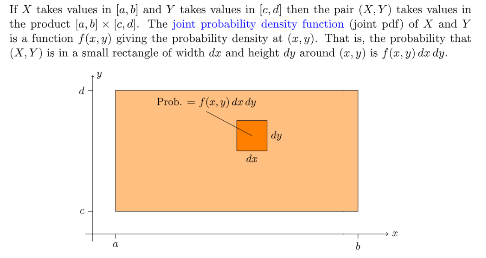
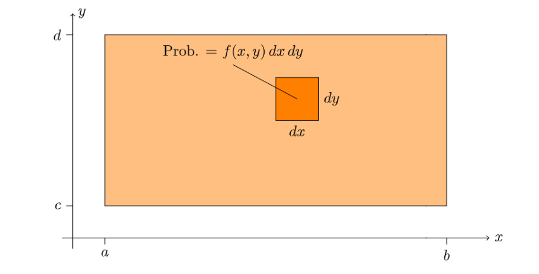
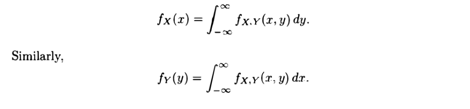
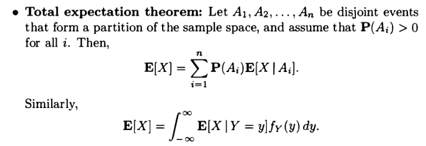
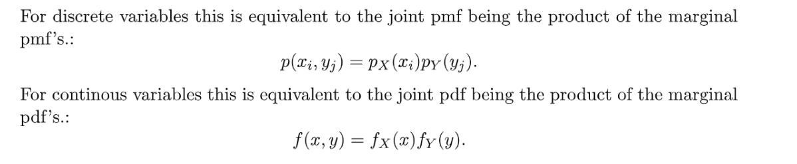

[L09 Slides.pdf](https://www.yuque.com/attachments/yuque/0/2022/pdf/12393765/1661482260808-4bfac4dd-66f2-4529-9475-44e2bfd8823e.pdf)
[Joint Distributions, Independence.pdf](https://www.yuque.com/attachments/yuque/0/2022/pdf/12393765/1661482355799-b063c2e8-7e61-46bd-8112-8442bb4d1720.pdf)

# 1 Joint PDF定义与性质⭐⭐⭐⭐⭐
## 1.1 定义
:::info

:::
**图解**

## 1.2 性质
:::info

**我们还有如下的性质:**

1. **对于一个定义在**`**real line**`**上的连续子集**$A$**, 我们有:**

2. **对于整个二维平面, 我们有:**

这是就是$f_{X,Y}(x,y)$这个概率函数满足概率公理$2,3$的佐证。
:::

## 1.3 解读⭐⭐⭐
:::info

对于连续型变量，如果我们想描述$X=a,Y=c$事件的概率，实际上是不行的，因为$P(X=a,Y=c)=P(a\leq X\leq a,c\leq Y\leq c)=
\int_a^a\int_c^cf_{X,Y}(x,y)dxdy=0$
所以我们有$P(a\leq X\leq a+\delta,c\leq Y\leq c+\delta)\approx f_{X,Y}(a,c)\cdot \delta^2$来估算$X=a,Y=c$附近的$(x,y)$的概率值。
:::
**图解**

## 1.4 算例
### 算例1 积分区域1
:::info

:::
**Key**

### 算例2 积分区域2
:::info

:::
**Key**

### 算例3: Buffon's Needle
:::info

当然我们也可以使用统计学的思想(蒙特卡罗模拟)
:::
**Key**思路就是: 

1. 确定随机变量， $X$是距离平行线最近的距离，$\Theta$是`needle`与平行线的夹角, 如图所示。
2. 确定待研究的事件, $X\leq \frac{l}{2}sin(\Theta)$
3. 计算事件的概率

# 2 Marginal PDF ⭐⭐⭐⭐⭐
## 2.1 定义
:::info

更一般的：

:::
**推导**假设我们现在想求$X$在$X=x_0$处的边缘概率, 对应的是$X=x_0,Y\in \Omega_Y$这个事件的概率。

1. 在离散的情况下，我们可以使用$\sum_{\{x|x=x_0\}}\sum_{y\in \Omega_Y}p_{X,Y}(x,y)=\sum_{y\in \Omega_Y}p_{X,Y}(x_0,y)$求解。
2. 但是对于连续性变量，我们$P(x_0\leq X\leq x_0+\delta)$概率是$\int_{x_0}^{x_0}\int_{y\in \Omega_Y}f_{X,Y}(x,y)dxdy=0$(因为积分面积是零),  所以我们可以转而考虑$x_0$附近的$x$的概率值：

$\int_{-\infty}^\infty\int_{x_0}^{x_0+\delta}f_{X,Y}(x,y)dxdy$($\delta$很小的时候), 因为我们在对$x$积分的时候，$y$的值是固定的, 于是$\int_{x_0}^{x_0+\delta}f_{X,Y}(x,y)dx=f_{X,Y}(x_0,y)\cdot \delta$
所以$P(x_0\leq X\leq x_0+\delta)=\int_{-\infty}^\infty\int_{x_0}^{x_0+\delta}f_{X,Y}(x,y)dxdy=\int_{-\infty}^{\infty}f_{X,Y}(x_0,y)\cdot \delta dy$, 而我们知道$P(x_0\leq X\leq x_0+\delta)=\int_{x_0}^{x_0+\delta}f_X(x)dx\approx f_X(x_0)\cdot \delta$
 所以$f_X(x)=\int_{-\infty}^{\infty}f_{X,Y}(x,y)\cdot dy$。
同理: $f_Y(y)=\int_{-\infty}^{\infty}f_{X,Y}(x,y)dy$。

## 2.2 解读⭐⭐⭐
> 还记得我们之前在描述`Joint PDF`的时候使用`Probability per unit area`来类比，而`Marginal PDF`则可以使用`Probability per unit length`来类比，因为我们是固定了某个$x$的取值而得到的$f_X(x)$或者固定了$y$的取值而得到的$f_Y(y)$，而固定了的$x$或者$y$的值表明我们实际上求得是沿着$X=x$的一个切面的形状。
> 

## 2.3 算例
### 算例1
:::info

:::
**Key**

### 算例2 
:::info

:::
**Key**

# 3 Joint CDF定义与性质⭐⭐⭐⭐⭐
## 3.1 定义
:::info

:::

## 3.2 性质
:::info

:::

## 3.3 解读
> 

### 
## 3.4 算例
:::info

:::
**Key**

# 4 Marginal CDF⭐⭐
## 4.1 定义
:::info

:::

## 4.2 算例
:::info

:::
**Key**

# 5 条件概率⭐⭐⭐⭐⭐
## 5.1 Condition on Events⭐⭐
:::info
和离散状况下的区别仅仅是将`PMF`替换成了`PDF`。

:::

## 5.2 Condition on Random Variables⭐⭐⭐
### 定义
:::info
和离散状况下的区别仅仅是将`PMF`替换成了`PDF`。

:::

### 解读⭐⭐⭐
> 回忆一下在一元连续型随机变量的时候，我们有$P(x\leq X\leq x+\delta)=\int_x^{x+\delta}f_X(x)dx\approx f_X(x)\cdot \delta$
> 如果我们想定义$X\approx x$在$Y\approx y$的条件下的条件概率（这里使用约等于符号是想让$P(X),P(Y)>0$）, 则有:
> $P(x\leq X\leq x+\delta_1|y\leq Y\leq y+\delta_2)=\frac{P(x\leq X\leq x+\delta_1,y\leq Y\leq y+\delta_2)}{P(y\leq Y\leq y+\delta_2)}\approx \frac{f_{X,Y}(x,y)\delta_1\delta_2}{f_Y(y)\delta_2}=\frac{f_{X,Y}(x,y)\delta_1}{f_Y(y)}=f_{X|Y}(x|y)\delta_1,\space if\space f_Y(y)>0$
> 

## 5.3 Stick Example⭐⭐⭐⭐⭐
> 
> 求$f_{X,Y}(x,y)$， ，和$E(Y)$

**求联合概率函数**我们知道$f_{X,Y}(x,y)=f_{Y|X}(y|x)f_X(x)$
因为$Y|X$服从$Uniform(0,X)$分布，$X$服从$Uniform(0,L)$分布，所以:
$f_{X,Y}(x,y)=f_{Y|X}(y|x)f_X(x)=\frac{1}{x}\frac{1}{L}=\frac{1}{Lx}$  
定义域和积分区域的确定类似，因为$X\in [0,L],Y\in [0,X]$, 所以：

**求E(Y|X=x)**因为在$X=x$的条件下，$Y$服从$[0,X]$上的均匀分布，所以：
$\int yf_{Y|X}(y|X=x)dy=\int_{0}^{x}y\cdot \frac{1}{x}dy=\frac{x}{2}$
**求E(Y)**
`fix y, compute the portion of x` 

# 6 随机变量函数的期望与方差
:::info

:::

# 7 条件期望⭐⭐⭐⭐⭐
## 7.1 定义
:::info

:::

## 7.2 性质
> 

## 7.3 全期望公式
> 

**第一个公式推导**
1. **首先，有全概率公式**

2. **两边同乘以**$x$**然后积分：**

$E(X)=\int xf_X(x)=\sum_{i=1}^n\int_{x}x\cdot f_{X|A_i}(x)dx\cdot P(A_i)=\sum_{i=1}^n E(X|A_i)P(A_i)$
**第二个公式推导**

## 7.4 推广到更多变量
> 

## 
# 8 更多随机变量⭐⭐
## 8.1 (Marginal)PDF
:::info

:::

## 8.2 Conditional PDF
> 

## 8.3 期望
:::info

:::

# 9 利用PDF/CDF判断独立性⭐⭐⭐
:::info

如果连续型随机变量$X,Y$独立， 则我们还有:
$P(X\in A,Y\in B)=P(X \in A)P(Y\in B)=\int_{\{x|x\in A\}}f_X(x)dx\int_{\{y|y\in B\}}f_Y(y)dx$ 
:::

