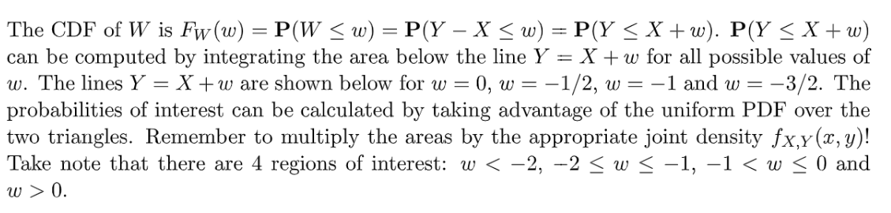

> 本章练习中会涉及到$X,Y$联合均匀分布所导出的$f_{X|Y}(x|y),f_{Y|X}(y|x)$**在给定**$y$**或者**$x$**的情况下也是均匀分布**这个性质，我们可以给出简单证明。
> 注意$f_{X|Y}(x|y)$函数本身可能是关于$y$的函数，$f_{Y|X}(y|x)$函数本身可能是关于$x$的函数，但是一旦$y$或者$x$的值确定了，那么得到的$X$或者$Y$的分布就是均匀分布。
> 如果$f_{X,Y}(x,y)$的概率密度大于零的区域的上下边界均与$x$轴平行，则$f_{Y|X}(y|x)$是常数(均匀分布), 反之则$f_{Y|X}(y|x)$是一个关于$x$的函数。
> 如果$f_{X,Y}(x,y)$的概率密度大于零的区域的左右边界均与$y$轴平行，则$f_{X|Y}(x|y)$是常数(均匀分布)，反之则$f_{X|Y}(x|y)$是一个关于$y$的函数。

**简单推导**假设$X,Y$成联合均匀分布，其概率密度函数是$f_{X,Y}(x,y)=c$, 则$f_{X}(x)=f(x)$,$f_Y(y)=f(y)$, 所以给定$Y=y_0$, 我们有$f_{X|Y}(x|y)=\frac{f_{X,Y}(x,y)}{f_Y(y)}=\frac{c}{f_Y(y_0)}=C是常数$
同理给定$X=x_0$, 我们有: $f_{Y|X}(y|x)=\frac{f_{X,Y}(x,y)}{f_X(x)}=\frac{c}{f_X(x_0)}=C是常数$
所以我们看到$X|Y=y_0$和$Y|X=x_0$都是均匀分布。

# 1 Recitation Problems
[Recitation 09.pdf](https://www.yuque.com/attachments/yuque/0/2022/pdf/12393765/1661493992978-c03ea6f6-5062-4bee-96eb-bd108b024be0.pdf)
[Recitation 09_sol.pdf](https://www.yuque.com/attachments/yuque/0/2022/pdf/12393765/1661493993064-0c12d2bd-ee13-4f32-93a7-db9a5f33b1ed.pdf)

## P1 指数分布/无穷级数
> 

**Key**根据题意，我们有:
$\sum_{0}^{\infty} \int_{2k+1}^{2k+2}\lambda e^{-\lambda x}dx=\sum_{0}^{\infty}e^{-\lambda x}\big|^{2k+2}_{2k+1}=\sum_{0}^{\infty}e^{\lambda(2k+1)}(1-e^{-\lambda})\newline=(e^{-\lambda}+e^{-3\lambda}+\cdots)(1-e^{-\lambda})=\frac{e^{-\lambda}}{1-e^{-2\lambda}}(1-e^{-\lambda})=\frac{e^{-\lambda}}{1+e^{-\lambda}}$

## P2 指数分布的无记忆性⭐⭐⭐⭐⭐
> 

**Key**根据题意: $f_T(t)=\begin{cases} \lambda e^{-\lambda t},t\geq 0\\0,otherwise\end{cases}$
$F_{X|A}(x)=P(X\leq x|T>t)$, 根据指数分布的无记忆性，$P(X\leq x|T>t)=P(T\leq x+t|T>t)=P(T\leq x)$
而$F_T(t)=\begin{cases} 1-e^{-\lambda t},t\geq 0\\0,otherwise\end{cases}$, 所以$P(T\leq x)=F_T(x)=1-e^{-\lambda x}$
所以$F_{X|A}(x)=1-e^{-\lambda x}$

## P3 联合均匀分布⭐⭐⭐⭐
> 
> 假设$X,Y$都是连续型随机变量

**(a)**因为连续型随机变量$X,Y$成联合均匀分布，
所以$f_{X,Y}(x,y)=\begin{cases} 2, x+y\leq 1, x\geq 0,y\geq 0\\0,otherwise\end{cases}$
**(b)**$f_Y(y)=\int_0^1f_{X,Y}(x,y)dx=\int_0^{1-y} 2dx=\begin{cases}2(1-y),0\leq y<1\\0,otherwise\end{cases}$, 要注意积分区域(白色箭头的方向)

**(c)**$f_{X|Y}(x|y)=\frac{f_{X,Y}(x,y)}{f_Y(y)}=\frac{2}{2(1-y)}=\frac{1}{1-y}$
所以$f_{X|Y}(x|y)=\begin{cases}\frac{1}{1-y}, 0\leq x\leq 1-y\leq 1\\0,otherwise\end{cases}$
**(d)**$E[X|Y=y]=\int_{0}^{1-y}x\cdot f_{X|Y}(x|y)dx=\int_{0}^{1-y}x\cdot \frac{1}{1-y}dx=\frac{1-y}{2}$

**(e)**因为$X,Y$的分布是对称的，所以$E(X)=E(Y)$, 所以$E[X]=\frac{1}{2}-\frac{1}{2}E[X]$, 所以$E[X]=\frac{1}{3}$  

## P4 Stick Breaking 3⭐⭐⭐⭐⭐
> 

**Key**这是一个典型的[多个随机变量](https://www.yuque.com/alexman/kziggo/ls1oxg#Kn72u)的运算:
我们假设棒子的两个分割点长度分别是$X,Y$且$X,Y\sim Uniform(0,1)$, 则根据题意, 有下列两种情况：

1. 三边的长度分别是$X,Y-X,1-Y$:

此时，有$\begin{cases} 1-X\geq X\\Y\geq 1-Y\\ X+1-Y\geq Y-X\end{cases}$, 也就是$\begin{cases} X\leq \frac{1}{2}\\Y\geq \frac{1}{2}\\ X-Y\geq -\frac{1}{2}\end{cases}$

2. 三边的长度分别是$Y,X-Y,1-X$:

此时，有$\begin{cases} 1-X\geq X\\Y\geq 1-Y\\ Y+1-X\geq X-Y\end{cases}$, 也就是$\begin{cases} X\leq \frac{1}{2}\\Y\geq \frac{1}{2}\\ X-Y\leq \frac{1}{2}\end{cases}$
所以综上两种情况，我们要求的概率实际上是$P(X\leq \frac{1}{2},Y\geq \frac{1}{2})$($X-Y\leq \frac{1}{2}\space or\space X-Y\geq -\frac{1}{2}$等同于我对于$X-Y$的值没有限制)。
由于$X,Y$都服从均匀分布，且互相独立，所以$f_{X,Y}(x,y)=f_X(x)f_Y(y)=1,0\leq x\leq 1,0\leq y\leq1$, 于是$P(X\leq \frac{1}{2},Y\geq \frac{1}{2})=\frac{1}{4}$

# 2 Assignment Problems
[Assignment 05.pdf](https://www.yuque.com/attachments/yuque/0/2022/pdf/12393765/1661493993074-7f5ee196-b7e7-4f48-bdcc-4f783df93e81.pdf)
[Assignment 05_sol.pdf](https://www.yuque.com/attachments/yuque/0/2022/pdf/12393765/1661493993086-dde4ad7e-5242-4628-981a-c8a55b4e3c1f.pdf)
## P1 综合题1
> 

**(a)**根据概率公理，我们有$\int_1^2\int_x^2   axdydx=\frac{2}{3}a=1$, 所以$a=\frac{3}{2}$
**(b)**

**(c) 条件期望**因为一旦$y$的值确定了，我们的积分区域就能够被确定。所以$y=\frac{3}{2}$时，$1\leq x\leq \frac{3}{2}$
利用: [条件期望性质](https://www.yuque.com/alexman/kziggo/ls1oxg#a14Me)

## P2 条件概率/期望⭐⭐⭐⭐⭐
> 

**(a) 条件概率**
**(b) 条件概率**既然我们已经求出了$f_{X,Y} (x,y)$, 则我们可以直接求出$Y>X$的概率:

比如$P(Y>X)=\int_0^{40}P(Y>X|X=x)f_X(x)dx\newline =\int_0^{40}\int_x^{2x}f_{Y|X}(y|x)dyf_X(x)dx\newline=\int_0^{40}\int_x^{2x}f_{X,Y}(x,y)dydx=\frac{1}{2}$
**(c) 条件期望-方法一**⭐⭐⭐如果我们使用以前的`Two Step Procedure`去求$Z$的概率密度函数的话，我们得先画出$f_{X,Y}(x,y)$的有效区域, 如下图所示:

然后我们先求$F_Z(z)=P(Y-X\leq z)=\iint_Rf_{X,Y}(x,y)dxdy$

1.  当$-40<z<0$时，$y-x=z$落在黄色的区域内(黄色区域就是$f_{X,Y}(x,y)$的值不为零的地方, 橙色区域就是我们要积分的区域$R$)

于是$P(Y-X\leq z)=\int_{-z}^{40}\int_{0}^{x+z}\frac{1}{1600}dydx=\frac{40+z}{1600}$

2. 当$-40<z<0$时，$y-x=z$落在黄色的区域内(黄色区域就是$f_{X,Y}(x,y)$的值不为零的地方, 橙色区域就是我们要积分的区域$R$)

于是$P(Y-X\leq z)=1600-\int_{z}^{40}\int_{x+z}^{2x}\frac{1}{1600}dydx=\frac{40-z}{1600}$
于是综上:
$f_Z(z)=\begin{cases} \frac{40-|z|}{1600},|z|<40\\0,otherwise\end{cases}$
**(c) 条件期望-方法二**⭐⭐⭐

## P3 综合题2⭐⭐⭐⭐⭐
> 

**(a) 独立性**我们可以仅仅通过观察图像就知道$X,Y$不是独立的。因为如果$X,Y$独立，则:
这两条线的交点处的概率应该等于$f_X(0.2)f_Y(0.4)>0$而图中给出的$f_{X,Y}(0.2,0.4)$, 所以$f_X(0.2)f_Y(0.4)\neq f_{X,Y}(0.2,0.4)$, 所以$X,Y$不是独立的。
**(b) 条件概率**⭐⭐
1. $f_X(x)=\int_yf_{X,Y}(x,y)dy=\begin{cases} \int_{0}^x \frac{1}{2}dx=\frac{1}{2}x,0\leq x\leq 1\\\int_{0}^{-x+2} \frac{3}{2}dx=\frac{3}{2}(2-x),1\leq x\leq 2\\0,otherwise\end{cases}$

2. $f_{Y|X}(y|0.5)=\frac{f_{X,Y}(0.5,y)}{f_X(0.5)}=\frac{\frac{1}{2}}{\frac{1}{4}}=2$

3. $f_Y(y)=\int_xf_{X,Y}(x,y)dx\newline=\begin{cases} \int_y^{1}\frac{1}{2}dx+\int_1^{2-y}\frac{3}{2}dx=2(1-y),0\leq y< 1\\0,otherwise\end{cases}$

$f_{X|Y}(x|0.5)=\frac{f_{X,Y}(x,0.5)}{f_Y(0.5)}=\begin{cases}\frac{1/2}{1}=\frac{1}{2},0\leq x\leq1\\\frac{3/2}{1}=\frac{3}{2},1\leq x<2\\0,otherwise\end{cases}$

**(c) 衍生随机变量的期望**⭐⭐⭐⭐首先我们要求出$f_{X,Y|A}(x,y)$
我们可以很快得到$f_{X,Y|A}(x,y)=\frac{f_{X<0.5,Y}(x,y)}{P(X<0.5)}=\frac{\frac{1}{2}}{\frac{1}{16}}=8$
$E[R|A]=\int_0^{0.5}\int_{0}^y xy\cdot f_{X,Y|A}(x,y)dydx=\int_0^{0.5}\int_{0}^y 8xydydx=\frac{1}{16}$
**(d) 衍生随机变量的CDF**⭐⭐⭐

## P4 信号分类⭐⭐⭐
> 

**图解**
**(a) 条件概率**⭐⭐
**(b) 二项分布**⭐⭐⭐

## P5 联合均匀分布

**(a) 独立性**很简单，还是画两条竖线，发现$f_X(x)f_Y(y)\neq f_{X,Y}(x,y)$对至少一个$(x,y)$不满足, 所以$X,Y$不是独立的

**(b) 边缘概率**⭐首先求出$f_{X,Y}(x,y)=1$
然后分别计算$X,Y$的边缘概率分布:
$f_X(x)=\int_y f_{X,Y}(x,y)dy=\begin{cases}\int_{x}^{x+1}dy=1,0\leq x\leq 1\\0,otherwise\end{cases}$
$f_Y(y)=\int_xf_{X,Y}(x,y)dx=\begin{cases} \int_0^y dx=y,0\leq y\leq 1\\ \int_{y-1}^1dx=2-y,1\leq y\leq 2\\0,otherwise\end{cases}$

**(c) 期望**
**(d) 方差**
**(c)和(d)的简便解法**⭐⭐⭐⭐⭐这个方法的关键在于能够得到$f_{Y-X|X}(y-x|x)=f_{Y-X}(y-x)$的关系, 也就是$Y-X$与$X$独立(给定任何$X$,$Y-X$的概率密度函数都和没有给定$X$是一致的)，且$Y-X$和$X$均为$[0,1]$上的均匀分布，

## P6 全概率公式/条件概率⭐⭐⭐⭐⭐
> 

**(a) 全概率公式**⭐
**(b) 贝叶斯公式**⭐⭐⭐⭐⭐本小问涉及到了一些后面的[贝叶斯推断](https://www.yuque.com/alexman/kziggo/ei1b29#ivp5P)的内容。
$\frac{P(A|P=p)}{P(A)}$可以理解为权重，$f_P(p)$可以理解为我们要加权的因子

**(c) 条件全概率公式**⭐⭐⭐⭐⭐题目中说了相邻两次的硬币投掷是独立的，而且在概率随机变量$P$的条件下这个独立性不会被破坏，也就是相邻两次硬币也是条件独立的(虽然我们缺少一些必要的代数信息来证明这个结论，但是凭借常识应该能得出这个结论)， 于是$P(B|P=p,A)=P(B|P=p)$, 也就是$A,B$在$P=p$下条件独立

## P7 Buffon's Circle⭐⭐⭐⭐⭐
> 
> 本题是经典问题[Buffon's Needle](https://www.yuque.com/alexman/kziggo/ls1oxg#JMfRQ)的变体, 也是将概率和几何学结合在一起的案例， 非常重要

**(a)****这类题一般的做法分为下列三步:**

1. **设置随机变量:**

规定点$a$: $(cos(\Theta),sin(\Theta)),\Theta\sim Uniform(0,2\pi)$
点$b$: $(b_x,b_y)$， $b_x,b_y$满足$f_{b_x,b_y}(b_x,b_y)=\begin{cases}\frac{1}{\pi},b_x^2+b_y^2\leq 1\\0,otherwise\end{cases}$

2. **规定事件：**

$A$: `No point of R lies outside of C`
我们只要保证长方形$R$的另外两个点都在圆内即可，也就是说必须满足：
$\begin{cases} cos^2(\theta)+b_y^2\leq 1\\ sin^2(\theta)+b_x^2\leq 1\end{cases}$, 也就是必须有$\begin{cases} |b_x|\leq |cos(\theta)|\\  |b_y|\leq |sin(\theta)|\end{cases}$成立
所以我们要求的事件概率是$P(A)=\int_{\theta}P(|b_x|\leq |cos(\theta)|\cap|b_y|\leq |sin(\theta)||\Theta=\theta)f_{\Theta}(\theta)$

3. **求出事件概率**

$P(A)=\int_0^{2\pi}[\iint_{R}f_{b_x,b_y}(b_x,b_y)dydx ]d\theta$, $Area(R)=2|cos(\theta)|\cdot 2|sin(\theta)|$, 所以$\iint_{R}f_{b_x,b_y}(b_x,b_y)dydx=\frac{2|cos(\theta)|\cdot 2|sin(\theta)|}{\pi}$
所以$P(A)=\int_0^{2\pi}\frac{2|cos(\theta)|\cdot 2|sin(\theta)|}{\pi}d\theta=\frac{4}{\pi^2}$

