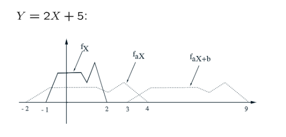

# 1 贝叶斯公式变体⭐⭐⭐
[L10 Slides.pdf](https://www.yuque.com/attachments/yuque/0/2022/pdf/12393765/1661497209542-b1c613e1-cf67-4c55-b5ab-eeb424ff251d.pdf)

## 1.0 Inference Problem
> 在[贝叶斯定理](https://www.yuque.com/alexman/kziggo/ci9rgz#GEqD5)中，我们了解到，他可以用于根据观测到的结果推断最有可能的，但未观测到的原因，在下面的流程中，$Y$是我们实际观测到的结果,$X$是我们待推断的原因变量, $Y$和$X$之间可能存在一些关系, 我们虽然观测不到实际的$X$, 但是我们知道$X$的分布和可能的取值，于是我们可以假设$X\in\{x_1,x_2,...,x_n\}$($X$是离散的，有$p_X(x)$存在) 或者$X\in [x_1,x_n]$($X$是连续的, 有$f_X(x)$存在)， 最终要求的就是$p_{X|Y}(y|x)$或者$f_{X|Y}(x|y)$, 也就是通过$Y$的取值来推断最可能的自变量$X$的取值范围。
> 现在我们可以假设$X$取了某个特定的值，由于我们知道$X$的分布函数，于是我们可以假设一个模型$p_{Y|X}(y|x)$或者$f_{Y|X}(y|x)$, 我们的目标就是要优化这个模型（也叫**似然**）的参数（比如$\theta$），使得这个似然函数值最大化。然后使用这个模型结合我们的贝叶斯公式求得$p_{X|Y}(x|y)$或者$f_{X|Y}(x|y)$（**后验概率**）。我们会在数理统计中详细介绍贝叶斯推断法则，并将使用代码实现这一过程。
> 


## 1.1 Discrete Infers Discrete
> 


## 1.2 Continuous Infers Continuous 
> 
> 


## 1.3 Continuous Infers Discrete
> 
> 比如$X=0,1$,$Y=X+W,W\sim N(0,1)$
> $X$是我们发送的潜在的位信号，$Y$是观测到的模糊信号，我们要去推断哪个位信号是最可能的。
> 
> 假设先验的$X$的`PMF`是：$f_X(x)=\begin{cases}\frac{1}{2},x=0\\ \frac{1}{2},x=1\end{cases}$
> 并且假设我现在观测到了一个$y$:
> 
> 在不同的$X$取值下的$f_{Y|X}(y|x)$的概率密度是不同的。一般我们会选择概率密度较大的那个$X$作为我们的推断。

**推导公式**这个例子中，$X$是离散变量，$Y$是连续变量，所以：$P(X=x, y\leq Y\leq y+\delta)=P(X=x)P(y\leq Y\leq y+\delta|X=x)\newline=p_X(x)f_{Y|X}(y|x)\cdot \delta...............................(1)$
$P(X=x, y\leq Y\leq y+\delta)=P(y\leq Y\leq y+\delta)P(X=x|y\leq Y\leq y+\delta)\newline=f_Y(y)\cdot \delta \cdot p_{X|Y}(y|x).................(2)$
所以结合$(1),(2)$, 我们有: $p_X(x)f_{Y|X}(y|x)\cdot \delta=f_Y(y)\cdot \delta \cdot p_{X|Y}(y|x)$
两边消去$\delta$，得到：$p_X(x)f_{Y|X}(y|x)=f_Y(y)p_{X|Y}(x|y)$, 这就得到了上面的公式。


## 1.4 Discrete Infer Continuous 
> 


# 2 一元衍生随机变量
[Manipulating Continuous Random Variables.pdf](https://www.yuque.com/attachments/yuque/0/2022/pdf/12393765/1661696853235-a94fd60e-a101-4e10-96b1-9d33c93a194c.pdf)
## 2.0 前言
> 本小节我们将介绍如何从一个随机变量的`PDF(PMF)/CDF`得到另一个与之有函数映射关系的随机变量的`PDF/PMF`


## 2.1 离散变量⭐⭐
> 

**图解**

## 2.2 连续变量⭐⭐⭐
> 
> 
> 给定一个$X,Y$之间的映射，则蓝色的部分和橙色的部分的概率值是相同的。

**算例1**⭐⭐
**注意这个公式仅仅对**$Y\in [0,8]$**成立**，也就是说$f_Y(y)=\begin{cases} \frac{1}{6y^{\frac{2}{3}}},y\in [0,8]\\0,otherwise\end{cases}$

**算例2**⭐⭐⭐⭐

我们要求$F_T(t)=P(T\leq t)$, 但是不知道$T$的分布函数，所以我们转而通过$V$来求。$F_T(t)=P(T\leq t)=P(\frac{200}{V}\leq t)=P(V\geq \frac{200}{t})$, 因为$V$是如图所示的均匀分布，所以$P(V\geq \frac{200}{t})=\frac{1}{30}(60-\frac{200}{t})$(右上图的面积)
所以$F_T(t)=\begin{cases}1,t\geq \frac{200}{60} \\\frac{1}{30}(60-\frac{200}{t}), \frac{200}{60} \leq t\leq  \frac{200}{30} \\0,otherwise \end{cases}$
所以$f_T(t)=\begin{cases} \frac{200}{30}\cdot \frac{1}{t^2}, \frac{200}{60} \leq t\leq  \frac{200}{30} \\0,otherwise \end{cases}$

## 2.3 线性函数⭐⭐⭐⭐
> 

**算例1(Geometric Procedure)**⭐⭐⭐
我们发现，如果某两个随机变量之间存在线性关系，假设$Y=2X+5$,则$Y$的概率分布函数图像， 只是将$X$的概率分布函数图像进行伸缩变换的结果，伸缩变换可以分成下列几步：

1. 我们先求将$X\to 2X$，这样带来的结果就是$f_X(x)$的图像在水平方向被拉伸成了两倍, 竖直方向没有变化，但是这样我们在求$\int_{-\infty}^{\infty}f_X(x)dx$的时候, 结果就不是$1$了，也就不满足概率公理了，所以我们需要将函数再除以$2$, 所以得到一个$\frac{1}{2}f_X(\frac{x}{2})$
2. 我们将$2X\to 2X+5$, 相当于将函数图像向右移动$5$, 于是根据左加右减原则，我们有$\frac{1}{2}f_X(\frac{x-5}{2})$
**算例1(Two Step Procedure)**⭐⭐⭐⭐⭐
1. **当**$a>0$**时：**$F_Y(y)=P(Y\leq y)=P(aX+b\leq y)=P(X\leq \frac{y-b}{a})=F_X(\frac{y-b}{a})$

所以$f_Y(y)=\frac{dF_X}{dy}=\frac{dF_x}{dx}\frac{dx}{dy}=f_X(\frac{y-b}{a})\frac{1}{a}$
所以$f_Y(y)=\frac{1}{a}f_X(\frac{y-b}{a})$

2. **当**$a<0$**时:**$F_Y(y)=P(aX+b\leq y)=P(X\geq \frac{y-b}{a})=1-F_X(\frac{y-b}{a})$

所以$f_Y(y)=\frac{dF_X}{dy}=\frac{dF_x}{dx}\frac{dx}{dy}=-f_X(\frac{y-b}{a})\frac{1}{a}$
所以$f_Y(y)=\frac{1}{|a|}f_X(\frac{y-b}{a})$

## 2.4 单调递增函数的衍生概率⭐⭐⭐⭐⭐
> 对于$Y=g(X)$这个严格单调的函数:
> 
> 我们会有如下的关系:
> 
> 下面我们以一个简单的例子给出推导过程


## 2.5 推导过程⭐⭐⭐
> 对于下图中的这个**严格单调递增的函数**来说，
> 
> 我们知道事件$x\leq X\leq x+\delta$的概率应该和事件$g(x)\leq Y\leq g(x+\delta)$的概率一致(因为概率本质上是可以加和的，对于连续型变量$X,Y$之间的映射关系，$pre-image$和$image$在各自的概率空间中对应的概率应该是相同的)。
> 所以我们应该就有$f_X(x)\cdot \delta=f_Y(y)\cdot length$, $length$就是图中$y$轴上橙色的小段，也是我们要通过函数的斜率信息求得的量。
> 因为我们可以近似的认为，橙色的小段长度$length$应该近似等于$(x,y)$处的斜率乘以$\delta$, 所以我们必须对这个函数$Y=g(X)$求导，所以有$slope_{(x,y)}=\frac{dg}{dx}(x)$。所以$length = \frac{dg}{dx}(x)\cdot \delta$, 所以事件$g(x)\leq Y\leq g(x+\delta)$可以写成$g(x)\leq Y\leq g(x)+\frac{dg}{dx}(x)\cdot \delta$。
> 因为$P(x\leq X\leq x+\delta)=P(g(x)\leq Y\leq g(x)+\frac{dg}{dx}(x)\cdot \delta)$, 所以$f_X(x)\cdot \delta=f_Y(y)\frac{dg}{dx}(x)\cdot \delta$

:::success
**如果函数是严格单调递减呢?**

其实我们的分析框架都不变，只是在$slope_{x,y}$的正负性上要多一些判断和考量:
此时$P(x\leq X\leq x+\delta)=P(g(x)-\frac{dg}{dx}(x)\cdot \delta\leq Y\leq g(x))$, 所以$f_X(x)\cdot \delta=f_Y(y)|\frac{dg}{dx}(x)|\cdot \delta$, 也就是加上一个绝对值的事。
:::


## 2.6 算例⭐⭐⭐
### 算例1 严格单调函数
> 假设现在我们有一个映射$Y=X^{3}$($X,Y$都是连续型变量), 我们该如何求得$f_Y(y)$

> 因为$g(x)=x^{3}$是严格单调递增的，所以$g^{-1}(x)=x^{\frac{1}{3}}=y$
> 因为$f_X(x)=f_Y(y)\cdot 3x^2$（根据`2.5`中的公式）, 所以$f_Y(y)=f_X(x)\cdot \frac{1}{3x^2}= f_X(y^{\frac{1}{3}})\cdot\frac{1}{3y^{\frac{2}{3}}}$(因为$f_Y(y)$必须是关于$y$的函数，所以我们需要使用$x^{\frac{1}{3}}=y$转换一下)


### 算例2 均匀分布的衍生变量
> 

**Key**


### 算例3 指数分布的衍生变量
#### 指数分布的平方
> 

**Key**


#### 独立指数分布的和
:::info

:::


### 算例4 高斯分布的衍生变量1
> 

**Key**


### 算例4 高斯分布的衍生变量2
> 

**Key**


## 2.7 直观解释⭐⭐⭐⭐⭐
> 对于一个这样的函数映射：
> 我们如何直观的给出$f_Y(y)$的概率密度函数呢?
> $f_X(x)\cdot \delta=f_Y(y)|\frac{dg}{dx}(x)|\cdot \delta$
> 我们知道，对于$g(x)$中比较平坦的区域(斜率较小的区间), $\frac{dg}{dx}(x)$的值会很小，对应的$f_Y(y)$的值就会很大，于是$f_Y(y)$在下列橙色区域对应的值会很大，也就是$Y=0,2$附近的概率值会很大，斜率较大的地方，也就是蓝色的区间对应的$0<Y<2$的概率都很小，如下图所示:
> 
> 最终我们会得到类似的$f_Y(y)$函数图像:
> 


# 3 二元衍生随机变量和卷积公式⭐⭐⭐⭐⭐
[L11 Slides.pdf](https://www.yuque.com/attachments/yuque/0/2022/pdf/12393765/1661509107957-98b05a28-d21c-455d-bb7a-6748009f2730.pdf)
> 本小节我们探究**随机变量的和**构成的**衍生随机变量**，比如$Z=X+Y$， 对于这类衍生随机变量，我们将介绍卷积公式用于计算$Z$的概率密度函数。


## 3.0 前言⭐⭐
> 我们从一个简单的例子出发, 仍然使用之前介绍的`Two Step Procedure`方法来求解
> 
> 1. 求$Z$的`CDF`表达式：$P(Z\leq z)=P(\frac{Y}{X}\leq z)$
> 2. 分情况讨论：
>    1. $0\leq z\leq 1$时, 我们有, 此时我们有$\int_{0}^1\int_{0}^{xz} dydx=\frac{z}{2}$
>    2. $z>1$时，我们有, 此时我们有$1-\int_0^1\int_0^{\frac{y}{z}}dxdy=1-\frac{1}{2z}$
> 3. 画出$F_Z(z)=\begin{cases} 0,z<0\\ \frac{z}{2},0\leq z\leq 1\\ 1-\frac{1}{2z},z>1\end{cases}$的图像：
> 

> 4. 画出$f_Z(z)=\begin{cases}0,z<0\\\frac{1}{4}z^2,0\leq z\leq 1 \\z-\frac{1}{2}ln(z),z>1\end{cases}$的图像:
> 

> 5. 求出$E(Z)=\int_0^1 z\cdot \frac{1}{2}dz+\int_1^{\infty}z\cdot \frac{1}{2z^2}dz=+\infty$

> $E(Z)\neq \frac{E(Y)}{E(X)}\neq E(Y)E(\frac{1}{X})$, 在[期望的线性性质](https://www.yuque.com/alexman/kziggo/ng8x7t#Hzny7)中有介绍。一般而言$E(g(X,Y))\neq  g(E(X),E(Y))$, 只有当$g$是线性函数的时候这个关系才成立，比如$Z=X+Y$。


## 3.1 独立随机变量的和/卷积公式⭐⭐⭐⭐⭐
> 对于$Z=X+Y$来说，我们可以使用常规的`Two Step Procedure`求解$f_Z(z)$, 也就是先计算$P(Z\leq z)$, 但是计算$Z\leq z$的概率的时候，我们往往需要借助$f_{X,Y}(x,y)$以及$\iint_{X+Y\leq z}$这个二重积分，在分类讨论情况较多时求解将非常的复杂。
> 而如果$X,Y$是独立的随机变量，我们就可以免受二重积分之苦，转而求一个一重积分即可。而且也不用像二重积分那样还要费力找积分面积，我们只要找具体的某一根直线方程$Y=-X+Z$即可，将$\iint_{X+Y\leq z}f_{X,Y}(x,y)dydx$转化成$\int_{x} f_X(t)f_Y(z-t)dt$即可，积分区域就是直线$y=-x+z$上的所有定义在$f_{X,Y}(x,y)$的概率区间内的满足条件的$x$的坐标。


### 3.1.1 离散卷积⭐⭐⭐
> **给定下列离散二元函数映射， 我们要求**$p_W(w)$
> 
> **求解过程:**
> , 这里$x\in\{0,1,2,3\}$
> **求解思路:**
> 

**算例**假设$p_X(x)=\frac{1}{4}, x=1,2,3,4$
假设$p_Y(y)=\begin{cases}\frac{2}{3},y=2\\\frac{1}{3},y=4\end{cases}$
假设我们只要计算$P(W=0)=p_W(0)$
则根据离散卷积公式: $\sum_x p_X(x)p_Y(0-x)=0$, 因为$p_X(x)$和$p_Y(-x)$的图像没有重叠的部分。


### 3.1.2  连续卷积⭐⭐⭐⭐⭐
> **给定下列离散二元函数映射， 我们要求**$p_W(w)$
> , 
> **求解过程:**
> 
> 这里积分区域是直线$y=-x+w$上所有的点的$x$坐标
> 要注意$x,w-x$必须分别在随机变量$X,Y$的概率区间内。
> **一般情况下，我们需要对**$w$**的值进行分段讨论，因为**$X,Y$**的概率区间(积分区域)是不规则的，所以不同的**$w$**下**$X$**的积分区域也是不同的。**


### 3.1.3 卷积的推导 - 连续型
> 假设存在两个连续随机变量$X,Y$服从$f_X(x)$和$f_Y(y)$概率密度函数，则:
> $Z=X+Y$的概率密度函数为:
> $\begin{aligned} \frac{d}{dz}F_Z(z)&= \frac{d}{dz}P(Z\leq z)\\&=\frac{d}{dz}P(X+Y\leq z)\\&=\frac{d}{dz}\int_{-\infty}^{\infty}P(x+Y\leq z|X=x)f_X(x)dx\\&=\frac{d}{dz}\int_{-\infty}^{\infty}F_{Y|X}(z-x|x)f_X(x)dx\\&=\frac{d}{dz}\int_{-\infty}^{\infty}F_{Y}(z-x)f_X(x)dx\\&=\int_{-\infty}^{\infty}\frac{d}{dz}F_{Y}(z-x)f_X(x)dx\\&=\int_{-\infty}^{\infty}f_X(x)f_{Y}(z-x)dx\end{aligned}$
> 离散的使用求和符号即可。


### 3.1.4 推广 - CLT
> 

**Graphics - Repeated Convolution**


## 3.2 独立随机变量的差
> 如果$Z=X-Y$, 乍一看我们似乎无法使用卷积公式，但是实际上我们只要将$-Y$看成$+(-Y)$, 然后继续使用卷积公式即可。

> 
> 
> 


## 3.3 图解卷积计算过程
> 假设我们有两个独立的连续型随机变量$X,Y$, 其概率密度函数分别是$f_X(x)$和$f_Y(y)$, 则对于$Z=X+Y$, 我们有:
> 
> **下面我们给出直观计算卷积的几个步骤：**
> 
> 


## 3.4 独立随机变量的商
> 假设我们有两个独立的随机变量$X,Y$, 则令$Z=\frac{X}{Y}$, 我们要计算$Z$的`PDF`:
>  $\begin{aligned}F_Z(z)=\mathbb{P}(\frac{X}{Y}\leq z)&=\iint_Rf_{X,Y}(x,y)dxdy\\&=\iint_{\{(x,y):x\leq yz\}}f_X(x)f_Y(y)dxdy\\&=\iint_{\{(x,y):x\geq yz,y<0\}}f_X(x)f_Y(y)dxdy+\iint_{\{(x,y):x\leq yz,y>0\}}f_X(x)f_Y(y)dxdy\\&=\int_{-\infty}^{0}\int_{yz}^{\infty}f_X(x)f_Y(y)dxdy+\int_{0}^{\infty}\int_{-\infty}^{yz}f_X(x)f_Y(y)dxdy\\&=-\int_{-\infty}^{0}\int_{\infty}^{yz}f_X(x)f_Y(y)dxdy+\int_{0}^{\infty}\int_{-\infty}^{yz}f_X(x)f_Y(y)dxdy\end{aligned}$
> $\begin{aligned}\frac{d}{dz}F_Z(z)&=-\frac{d}{dz}\int_{-\infty}^{0}\int_{yz}^{\infty}f_X(x)f_Y(y)dxdy+\frac{d}{dz}\int_{0}^{\infty}\int_{-\infty}^{yz}f_X(x)f_Y(y)dxdy\\&=-\int_{-\infty}^{0}\frac{d}{dz}\int_{yz}^{\infty}f_X(x)f_Y(y)dxdy+\int_{0}^{\infty}\frac{d}{dz}\int_{-\infty}^{yz}f_X(x)f_Y(y)dxdy\\&=\int_{-\infty}^{0}(-y)\cdot f_X(yz)f_Y(y)dy+\int_{0}^{\infty}y\cdot f_X(yz)f_Y(y)dy\\&=\int_{-\infty}^{\infty}|y|\cdot f_X(yz)f_Y(y)dy
\end{aligned}$
> 本推导使用了微积分第二定律，推导过程在本章节结尾。


## 3.5 常用卷积公式总结
> 


# 4 协方差和相关系数
[Covariance and Correlation.pdf](https://www.yuque.com/attachments/yuque/0/2022/pdf/12393765/1661693001924-908e51ca-8917-4445-ac16-c3744583be0e.pdf)
[Covariance Properties.pdf](https://www.yuque.com/attachments/yuque/0/2022/pdf/12393765/1664888632805-1ee2b018-50e4-4eb7-ac9a-687ed4663913.pdf)
## 4.1 协方差
:::success
协方差测量了两个随机变量变化时的内在线性关系。比如说: 长颈鹿的身高和体重有正的协方差，因为这两个物理量总是同时增大或同时减小。
:::
### 4.1.1 协方差定义⭐⭐⭐
> 假设随机变量$X,Y$的期望分别是$E[X]$和$E[Y]$, 则$Cov(X,Y)=E[(X-E[X])(Y-E[Y])]$
> 协方差的单位是$X$的单位乘以$Y$的单位
> 


### 4.1.2 协方差性质与证明⭐⭐⭐
> 1. $Cov(aX+b,cY+d)=acCov(X,Y)$, $a,b$是常数
> 2. $Cov(X_1+X_2,Y)=Cov(X_1,Y)+Cov(X_2,Y)$， 这个**线性性质**可以推广到任意多个随机变量的和，$Cov(\sum_{i}X_i, \sum_{j}Y_j)=\sum_i\sum_jCov(X_i,Y_j)$
> 3. $Cov(X,X)=Var(X)$
> 4. $Cov(X,Y)=E(XY)-E(X)E(Y)$, 当$X=Y$时，就是方差公式。
> 5. $Var(X+Y)=Var(X)+Var(Y)+2Cov(X,Y)$
> 6. $If\space X\space and\space Y\space are \space independent\space then\space Cov(X,Y)=0$(但是其逆命题一般是错的)

**Proof for (1)**$\begin{aligned}Cov(aX+b,cY+d)&=E[(aX+b-E[aX+b])(cY+d-E[cY+d])]\\&=E[(aX-aE[X]+b-E[b])(cY-cE[Y])+d-E[d])]\\&=E[(aX-aE[X])(cY-cE[Y])]\\&=E[ac(X-E[X](Y-E[Y]))]\\&=acE[(X-E[X](Y-E[Y]))]\\&=acCov(X,Y)\end{aligned}$
**Proof for (2)**$\begin{aligned}Cov(X_1+X_2,Y)&=E[(X_1+X_2-E[X_1+X_2])(Y-E[Y])]\\&=E[(X_1-E[X_1]+X_2-E[X_2])(Y-E[Y])]\\&=E[(X_1-E[X_1])(Y-E[Y])+(X_2-E[X_2])(Y-E[Y])]\\&=E[(X_1-E[X_1](Y-E[Y]))]+E[(X_2-E[X_2](Y-E[Y]))]\\&=Cov(X_1,Y)+Cov(X_2,Y)\end{aligned}$
**Proof for (3)**$Cov(X,X)=E[(X-E(X))(X-E(X))]=E[(X-E[X])^2]=Var[X]$
**Proof for (4)**$\begin{aligned}Cov(X,Y)&=E[(X-E(X))(Y-E(Y))]\\&=E[XY-XE[Y]-E[X]Y+E[X]E[Y]]\\&=E[XY]-E[X]E[Y]-E[X]E[Y]+E[X]E[Y]\\&=E[XY]-E[X]E[Y]\end{aligned}$
**Proof for (5)**使用性质$2$和性质$3$, 我们有:
$\begin{aligned}Var(X+Y)&=Cov(X+Y,X+Y)\\&=Cov(X,X)+2Cov(X,Y)+Cov(Y,Y)\\&=Var(X)+Var(Y)+2Cov(X,Y)\end{aligned}$
**Proof for (6)**如果$X$和$Y$是独立且连续的的，$f(x,y)=f_X(x)f_Y(y)$, 所以根据期望公式$\begin{aligned}Cov(X,Y)&=E[(X-E[X])(Y-E[Y])]\\&=\int\int(X-E[X])(Y-E[Y])f_X(x)f_Y(y)dxdy\end{aligned}$


### 4.1.3 协方差的计算
> 因为根据协方差的定义$Cov(X,Y)=E((X-E[X])(Y-E[Y]))$, 协方差实际上是随机变量$(X-E[X])(Y-E[Y])$的期望, 所以我们可以利用期望的定义来计算协方差。
> 1. $X,Y$均为离散随机变量的情况:
> 
$Cov(X,Y)=\sum_{i=1}^n\sum_{j=1}^m p_{X,Y}(x_i,y_j)(x_i-E(X))(y_i-E(Y))\newline=(\sum_{i=1}^n\sum_{j=1}^mp_{X,Y}(x_i,y_j)x_iy_j)-E[X]E[Y]$
> 2. $X,Y$均为连续随机变量的情况:
> 
$\begin{aligned}Cov(X,Y)&=\int_{c}^d\int_{a}^b f_{X,Y}(x,y)(x-E(X))(y-E(Y))dxdy\\&=\int_{c}^d\int_{a}^b f_{X,Y}(x,y)xydxdy-\int_{c}^d\int_{a}^b f_{X,Y}(x,y)xE[Y]dxdy-\int_{c}^d\int_{a}^b f_{X,Y}(x,y)E[X]ydxdy+\int_{c}^d\int_{a}^b f_{X,Y}(x,y)E[X]E[Y]dxdy\\&=\int_{c}^d\int_{a}^b f_{X,Y}(x,y)xydxdy-\int_{c}^d f_{Y}(y)E[Y]dy-\int_{a}^b f_{X}(x)E[X]dx+E[X]E[Y]\\&=\int_{c}^d\int_{a}^b f_{X,Y}(x,y)xydxdy-E[X]E[Y]-E[X]E[Y]+E[X]E[Y]\\&=(\int_{c}^d\int_{a}^bf_{X,Y}(x,y)xydxdy)-E[X]E[Y]\\&=E[XY]-E[X]E[Y]\end{aligned}$


### 4.1.4 算例
#### 算例1
> 

**Key**


#### 算例2
> 

**Key**


## 4.2 相关系数
### 4.2.1 相关系数定义
> 由于协方差的单位是$X$的单位乘以$Y$的单位, 在比较协方差的时候是非常困难的， 于是我们需要对协方差的单位进行缩放，使得其单位为$1$(**无量纲的**)。
> 
> 
> 


### 4.2.2 相关系数的性质与部分证明
> 
> 

**性质3的证明**


## 4.3 随机变量的和的方差⭐⭐⭐⭐⭐
:::info

:::
**推导**


## 4.4 高阶运用
[Covariance Applications.pdf](https://www.yuque.com/attachments/yuque/0/2022/pdf/12393765/1664888069214-68974e16-57ac-46c6-bc8e-aa19c80db7fd.pdf)
> 设想一下这个问题:
>  Show that if the correlation $\rho$ of two random variables $X$ and $Y$ equals $1$, then $Y - \mu_Y = \alpha (X - \mu_X)$ for some $\alpha>0$. Here $\rho$ is $\rho = \frac{E (X- \mu_X)(Y-\mu_Y)}{\sigma_X\sigma_Y}$
> ** We can define a function **
> $\begin{aligned} h(t)&=E[((X-\mu_X)t+(Y-\mu_Y))^2]\nonumber\\&=\sigma_X^2t^2+2Cov(X,Y)t+\sigma_Y^2 \nonumber\end{aligned}$
> **Since **$h(t)\geq 0$** and it is a quadratic function, we have**
> $\begin{aligned}(2Cov(X,Y))^2-4\sigma_X^2\sigma_Y^2&\leq 0\nonumber\\-\sigma_X\sigma_Y\leq Cov(X,Y) &\leq \sigma_X\sigma_Y\\-1\leq \rho \leq &1\end{aligned}$
> **When **$\rho=1$**, the equality holds, which means **$h(t)$** has a single root. However, **$((X-\mu_X)t+(Y-\mu_Y))^2\geq 0$, $h(t)=0$ iff.
> $\begin{aligned}\mathbb{P}((X-\mu_X)t+(Y-\mu_Y)=0)=1\end{aligned}$
> Thus, when $t=\frac{-2Cov(X,Y)\pm\sqrt{4Cov(X,Y)^2-4\sigma_X^2\sigma_Y^2}}{2\sigma_X^2}=-\frac{Cov(X,Y)}{\sigma_X^2}<0$:
> $\begin{aligned}Y-\mu_Y=-t(X-\mu_X), \alpha=-t\nonumber>0\end{aligned}$
> Actually, since $\rho=1, \frac{Cov(X,Y)}{\sigma_X\Sigma_Y}=1$, thus, $t=\alpha=-\frac{\sigma_Y}{\sigma_X}>$0.
> This ends our derivations.


## 4.5 总结
> 

# 
# 5 Generating RVs from Uniform RV
## 5.0 Intro
> 有时候，我们需要随机产生一个在某范围的数，`C/C++`提供了一个库函数`rand()`来产生随机数。
> 由于电脑只能储存有限精度的数字，它产生的**随机数必然出现循环周期**，自然是伪随机数了。
> 而电脑生成的**伪随机数**就不一样了，它可以高效地生（伪）产（造）随机数，而且可以被再利用。
> **生产伪随机数的原理是非常非常简单的：**
> **第一步：**假设我们手头已经有一串数字，我们称它们为种子。对这些种子用递归法，“随机地(其实并不是)”生成一连串$0$到某个自然数$N$之间的自然数。
> **第二步**：把这些随机生成的自然数**转换成**$0$**到**$1$**之间的**实数 (比如通过除以$N$来得到, 也叫归一化)。
> **第三步**：利用这串“从零到一均匀分布的随机数”，把它们**用某些算法**来**转换成其他分布的随机数**。


## 5.1 Quantile Function
> 


## 5.2 Probability Integral Transform
> 假设我们有一个随机变量$X$, 它的`CDF`是$F_X(x)$, 假设我们定义$Y=F_X(X)$, 则$Y$服从$[0,1]$均匀分布。
> 我们试求$Y$的`CDF`: 
> **对于**$0\leq y\leq 1$**来说:**
> $\begin{aligned}F_Y(y)&=P(Y\leq y)\\&=P(F_X(X)\leq y)\\&=P(X\leq F_X^{-1}(y))\\&=F_X(F_X^{-1}(y))\\&=y\end{aligned}$	
> **对于**$y<0$**来说:** $P(Y\leq y<0)=0$, 因为$F_X(X)\in [0,1]$
> **对于**$y>1$**来说:** $P(Y\leq y)=1$, 因为$F_X(X)\in [0,1]$
> **所以: **
> $F_Y(y)=\begin{cases} 0&y<0\\y&0\leq y\leq 1\\1&y>1\end{cases}$
> 求导可得: $f_Y(y)=y,0\leq y\leq 1$, 于是$Y$服从$[0,1]$均匀分布。


## 5.3 Inverse CDF Method
> 对于$X$的`CDF`$F_X(x)$来说，如果$F_X^{-1}(x)$不存在，则我们定义`Generalized Inverse CDF`:
> $F_X^{-1}(y)=\inf\{x:F_X(x)\geq y\}$
> **本小节我们讨论如何从一个服从**$[0,1]$**上的均匀分布的随机变量如何产生其他随机变量的方法。**
> 在详细讨论之前，我们先来看这个问题: 假设$U\sim Uniform(0,1)$, 证明$F_X^{-1}(U)\sim F_X$。
> 这说的是假设有一个随机变量, 其`CDF`是, 其`Inverse CDF`是。如果我们对输入一个均匀分布的随机变量，输出的随机变量的分布函数就服从。
> **证明:**
> 首先我们拆分一下，左侧的表示一个随机变量（记为）, , 如果成立，则， 而我们知道, 所以
> **所以我们转而证明, 即**
> 首先根据(`Quantile Function`)的定义: 
> 我们有$F_X^{-1}(F_X(x))\leq x$且$F_X(F_X^{-1}(\alpha))\geq \alpha$(不等号在$F_X(x)$的图像有`Flat`的区间时出现,读者课自行验证)。
> **因为和**$F_X^{-1}$**都是**`**Non-decreasing function**`**, 所以:**
> $\{F_X^{-1}(U)\leq x\}=\{F_X(F_X^{-1}(U))\leq F_X(x)\}\subseteq \{U\leq F_X(x)\}$
> **同时:**
> $\{U\leq F_X(x)\}=\{F_X^{-1}(U)\leq F_X^{-1}(F_X(x))\}\subseteq \{F_X^{-1}(U)\leq x\}$
> 所以, $\{F_X^{-1}(U)\leq t\}=\{U\leq F_X(t)\}$且$\mathbb{P}(F_X^{-1}(U)\leq t)=\mathbb{P}(U\leq F_X(t))=F_X(t)$
> **证明完毕。**
> **另一种证明更加简单:**
> 


### 

## 5.4 生成指数分布
> 上面介绍的方法被称为`Inverse CDF`法，比如我们想要生成一个指数分布的随机变量$X\sim exp(\lambda)$, 其`CDF`为$F_X$, 我们可以先计算出$F_X(x)=\begin{cases} 1-e^{-\lambda x}&x\geq0\\0&x<0\end{cases}$ , 然后计算$F_X^{-1}(x)=-\frac{ln(1-x)}{\lambda}$, 此时只要把输入改成$U\sim Uniform(0,1)$, 经过$F_X^{-1}(U)$输出的随机变量就服从一个参数为$\lambda$的指数分布。

```c
def inv_cdf_exp(u, lam):
    return np.log(1 - u) / -lam

lam = 1

x_transformed = inv_cdf_exp(u, lam)
x_real = rng.exponential(scale=lam, size=n)

plot_samples(x_transformed, x_real)
```

## 5.5 生成泊松分布
> 由于泊松分布是一个离散分布，于是我们不能直接使用`Inverse CDF`法来通过`0-1`分布得到泊松分布的`PMF`, 但是我们可以使用黎曼和表示积分的思想来模拟。
> 假设我们要生成的泊松变量是$Y\sim F_Y$, 我们可以从$y=0$开始，顺序生成:
> $p_Y(0);p_Y(0)+p_Y(1);p_Y(0)+p_Y(1)+p_Y(2)\cdots$
> 此时$F_Y(k)$是一个离散的函数，所以我们无法直接求导(只能使用`Generalizaed Derivative`的形式，但是这里不做深入)，所以我们只要找到那个满足:
> 
> 的最小的作为满足的, 也就是(尽管这不存在)的输出。
> 所以我们只要对每个, 都找到一个这样的, 这些就服从泊松分布。
> 另一方面, 我们有递归公式: , , $p_Y(0)=e^{-\lambda}$, 于是我们可以得到所有的, 也就达到了模拟泊松分布的目的。

```python
def generatePossion(self,Lambda):
    xList = []

    def possion(Lambda):
        k = 0
        p = math.exp(-Lambda)
        s = p
        U = random.random()
        # When k=0
        if U <= math.exp(-Lambda):
            return 0
        # When k>0
        else:
            while U > s:
                # Use recursion formula for Possion PMF
                p = Lambda * p / (k + 1)
                # Calculate the possion probability
                s = s + p
                # Iterate
                k += 1
            return k-1

    for i in range(1000):
        x = possion(Lambda)
        xList.append(x)

    return xList
```
> 这里提供另一种思路。我们知道，泊松过程是一个离散的随机过程，于是我似乎不能直接从`0-1`均匀分布产生泊松分布，但是，我们知道，每一次泊松事件(`Arrival Time`)都服从一个参数为的指数分布。
> **于是我们可以:**
> 1. 先从`0-1`均匀分布出发，使用`Inverse CDF`产生一系列独立的指数分布(参数为)的伪随机数
> 2. 记。如果, 则停止，输出；若否，则继续生成, 直到为止。
> 3. 重复过程。


## 5.6 生成任意分布
> 假设我们有一个随机变量$X$满足 $f_w(x)= \begin{cases}\frac{2 x}{w^2}, & \text { for } 0 \leq x \leq w \\ 0, & \text { otherwise }\end{cases}$, 其中$w=2$, 现在我们要通过上面的方法利用$[0,1]$均匀分布的随机变量产出这个随机变量$X$。
> **第一步: **计算目标随机变量的`CDF`(这个`CDF`可能已知，也可由已知的`PDF`推得)
> 
> **第二步: **计算`CDF`的逆函数:
> 
> **第三步: **将服从$[0,1]$均匀分布的随机变量的实现(`Data Point`)带入这个逆函数，得到的就是服从$f_w$的一个数据样本。
> 


## 5.7 参考资料
> [从零构建统计随机变量生成器之离散基础篇](https://mp.weixin.qq.com/s?__biz=MzA4NzkxNzM3Nw%3D%3D&chksm=87bc98c7b0cb11d1bc6faec5a0281a0bff4230effe0574b82796c0ffc6874b7f64ffe990ebcf&idx=1&mid=2457480937&scene=21&sn=df9d4a62b516133f58afebde1d58a1a0#wechat_redirect)
> [用逆变换采样方法构建随机变量生成器](https://blog.csdn.net/abcdefg90876/article/details/113667428)


# 6 Overlapping Uniform Distributions
> 


# 7 微积分第二定理及其证明
**参考:** [https://www.cnblogs.com/bigmonkey/p/7761358.html](https://www.cnblogs.com/bigmonkey/p/7761358.html)
## 7.1 定理及证明
:::info
微积分第二定律将被积函数和导数结合在一起:
如果函数是连续的 ，且,(), 那么, 也可以写作。
这里需要注意和的关系，它的意思是一个函数能够找到一个积分方式去表达。如果,则

:::
:::info

:::
**示例1**
**示例2**


## 7.2 微积分第二定理的链式法则
:::info

:::


## 7.3 超越函数
:::info

:::
