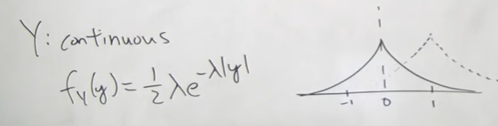
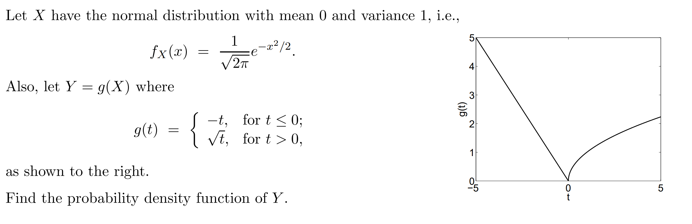
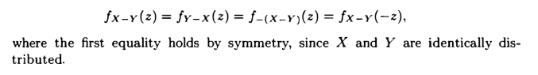
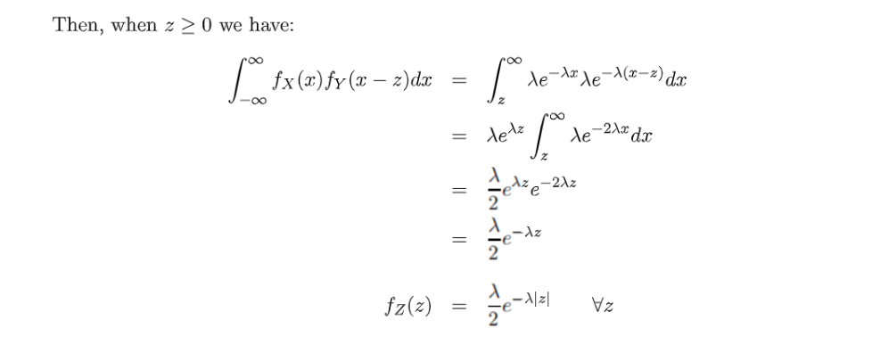
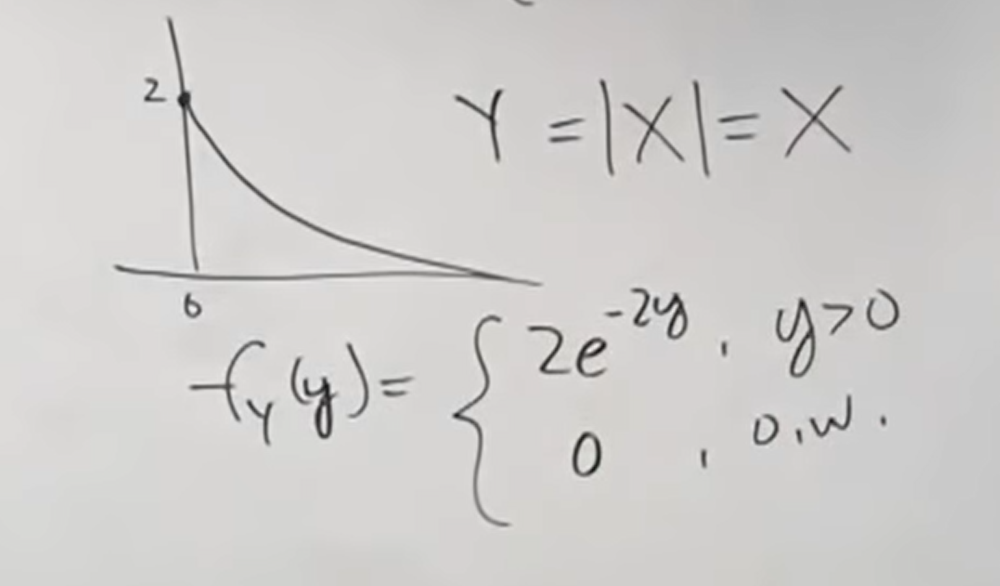

# 1 Recitation Problems
[Recitation 11.pdf](https://www.yuque.com/attachments/yuque/0/2022/pdf/12393765/1661508859059-a773b23b-ea84-4eab-952e-5ce23dc07560.pdf)
[Recitation 11_sol.pdf](https://www.yuque.com/attachments/yuque/0/2022/pdf/12393765/1661508859111-e71809a1-5d80-48cf-b640-9919e4244d39.pdf)
[Recitation 12.pdf](https://www.yuque.com/attachments/yuque/0/2022/pdf/12393765/1661766069064-bbf73676-3d53-48ec-87e9-572e4054193e.pdf)
[Recitation 12_sol.pdf](https://www.yuque.com/attachments/yuque/0/2022/pdf/12393765/1661766069131-3ad04854-f9bf-498f-a464-29bc56c28549.pdf)

## P1 贝叶斯推断(Continuous Infers Discrete)⭐⭐⭐⭐⭐
> 
> 本题涉及到拉普拉斯分布，需要留意一下。
> （拉普拉斯分布的图像是指数分布关于$x$轴对称的图像）

**Key**$P(X=1|Z=z)$, $Z$是我们实际观测到的连续型变量，$X$是我们需要推断的变量， 所以我们需要使用贝叶斯公式的变体: [Continuous Infers Discrete](https://www.yuque.com/alexman/kziggo/ei1b29#gLpxX)。

**在求分母上的**$f_{Z|X}(z|k)$**时：**

- 当$k=1$时，$Z=Y+1$, 此时$Z$的$f_Z(z)$的图像就是$f_Y(y)$的图像向右平移$1$, 所以$f_Z(z)=\frac{1}{2}\lambda e^{-\lambda|y-1|}$
- 当$k=-1$时，$Z=Y-1$, 此时$Z$的$f_Z(z)$的图像就是$f_Y(y)$的图像向左平移$1$, 所以$f_Z(z)=\frac{1}{2}\lambda e^{-\lambda|y+1|}$
- 

**然后我们开始求各种极限:**

对于$\lambda\to \infty$的情况，拉普拉斯分布会趋近于一个`Spike`, 使得$Y$的概率趋近于零。

## P2 贝叶斯推断(Discrete Infers Continuous)⭐⭐⭐⭐⭐
> 
> 
> 本题我们通过$X$(硬币抛掷的结果)来推断$Q$（硬币朝上的概率(不确定)）
> 本题的变量$Q$服从`Beta Distribution`, 在数理统计中会有介绍。

**Key**
$f_{Q|X}(q|0)$意味着:  我抛掷硬币得到$X=0$的观测结果，那么$Q|X$的分布会向硬币朝上概率更小的方向偏移。

$f_{Q|X}(q|1)$意味着: 我抛掷硬币得到$X=1$的观测结果，那么$Q|X$的分布会向硬币朝上概率更大的方向偏移。

## P3 衍生随机变量⭐⭐⭐
> 

**解法一: 偏重代数**首先根据全概率公式：
$F_Y(y)=P(Y\leq y)=P(g(X)\leq y)\newline=P(g(X)\leq y\cap X\leq 0)+P(g(X) \leq y\cap X>0)\newline=P(X\in[-y,0])+P(X\in(0,y^2])\newline=(F_X(0)-F_X(-y))+(F_X(y^2)-F_X(0))\newline=(F_X(y^2)-F_X(-y))$
然后我们两边求导得到:
$f_Y(y)=f_X(y^2)\cdot 2y+f_X(y)\cdot 1=\frac{1}{\sqrt{2\pi}}e^{-\frac{y^4}{2}}\cdot 2y+\frac{1}{\sqrt{2\pi}}e^{-\frac{y^2}{2}}$
**解法二: 偏重几何**$F_Y(y)=P(Y\leq y)$
根据上图中的几何性质，我们知道$P(Y\leq y)=P(-y\leq X\leq y^2)=P(X\leq y^2)-P(X\leq -y)\newline=F_X{(y^2)}-F_X(-y)$
然后求导即可。

## P4 相关系数性质推导
> 

**Key**根据[协方差的性质](https://www.yuque.com/alexman/kziggo/ei1b29#EV4F3)，我们有$Cov(aX+b,Y)=aCov(X,Y)$
而$\rho(aX+b,Y)=\frac{Cov(aX+b,Y)}{\sqrt{Var(aX+b)}\sqrt{Var(Y)}}=\frac{aCov(X,Y)}{a\sqrt{Var(X)}\sqrt{Var(Y)}}\newline=\frac{Cov(X,Y)}{\sqrt{Var(X)}\sqrt{Var(Y)}}=\rho(X,Y)$

## P5 独立指数分布变量的差⭐⭐⭐⭐⭐
> 
> 我们可以使用[独立随机变量的差](https://www.yuque.com/alexman/kziggo/ei1b29#AtBgl)中的方法和性质来计算`PDF`
> $f_X(x)=\begin{cases} \lambda e^{\lambda x},x\geq 0\\0,otherwise\end{cases}$, $f_Y(y)=\begin{cases} \lambda e^{\lambda y},y\geq 0\\0,otherwise\end{cases}$

**(a) 卷积公式**⭐⭐⭐因为$X$和$Y$的取值范围都是大于等于零的，所以在二维笛卡尔坐标系中，$X,Y$有概率密度的地方实际上是整个第一象限。于是我们有:
$Z=X+(-Y)$
$f_Z(z)=\int_{-\infty}^\infty f_X(x)f_{-Y}(z-x)dx$
而$f_{-Y}(z-x)=f_Y(x-z)$(因为$P(-Y=-1)=P(Y=1)$)

1. 对于$z<0$(因为要保证$x-z>0$来使用指数分布的`PDF`而不用分类讨论$f_Y(x-z)$的不同区间上的概率密度取值) , 我们有:

所以$\int_{-\infty}^\infty f_X(x)f_{-Y}(z-x)dx=\int_{-\infty}^\infty f_X(x)f_{Y}(x-z)dx\newline=\int_{-\infty}^\infty\lambda e^{-\lambda x}\lambda e^{-\lambda(x-z)}dx=\lambda e^{\lambda z}\int_0^\infty\lambda e^{-2\lambda x}dx=\lambda e^{\lambda z}(-\frac{1}{2}e^{-2\lambda x})\big|^\infty_0\newline=\frac{\lambda}{2}e^{\lambda z},z<0$

2. 对于$z\geq 0$, 因为$Z$和$-Z$的分布形状相同(原因在下面)，只是关于$y$轴对称, 所以:

$f_Z(z)=\frac{\lambda}{2}e^{\lambda |z|}$， $f_Z(z)=f_Z(-z)$
**本题讨论**$z$**大小的目的有两个:**

1. $X,Y$都是指数分布，只在第一象限有概率密度，于是我们最好要保证我们的被积函数都在第一象限内，也就是$x>0$且$x-z>0$, 所以$z<0$最保险
2. $Z=X-Y$，$-Z=Y-X$, 因为$X,Y$是$i.i.d$(`Independent and **Identically Distributed**`), 所以$X-Y$和$Y-X$的分布是完全相同的（对称性），所以，于是$Z$和$-Z$的分布关于$y$轴对称。所以我们只需要计算$z<0$的部分，然后$z\geq 0$的部分根据对称性可以快速得出。
**(b) 全概率公式**我们有$f_Z(z)=\int_{-\infty}^\infty f_{Z|X}(z|x)f_X(x)dx=\int_{-\infty}^\infty f_{Y|X}(x-z|x)f_X(x)dx\newline=\int_{-\infty}^\infty f_X(x)f_Y(x-z)dx$

$z\geq 0$时，$x-z$小于零的部分$f_Y(x-z)$是零，所以积分区域是$\int_z^\infty$而不再是$\int_{-\infty}^\infty$

## P6 证明独立性⭐⭐
> 

**(a)**⭐⭐我们知道$X^2+Y^2=R^2$, $R=\sqrt{X^2+Y^2}$
所以$F_R(r)=\iint_{X^2+Y^2\leq r^2}f_{X,Y}(x,y)dydx=\iint_{X^2+Y^2\leq r^2}f_{X}(x)f_Y(y)dydx\newline=\int_{0}^{2\pi}\int_{0}^rf_X(rcos(\theta))f_Y(rsin(\theta))rdrd\theta$
因为$X,Y$都是标准高斯分布，所以$\int_{0}^{2\pi}\int_{0}^rf_X(rcos(\theta))f_Y(rsin(\theta))rdrd\theta\newline=\int_{0}^{2\pi}\int_{0}^r\frac{1}{2\pi}e^{-\frac{r^2}{2}}rdrd\theta$
于是我们有$\int_{0}^{2\pi}\int_{0}^r\frac{1}{2\pi}e^{-\frac{r^2}{2}}rdrd\theta=\frac{1}{2\pi}\int_{0}^re^{-\frac{r^2}{2}}rdr\int_{0}^{2\pi}d\theta\newline=\frac{1}{2\pi}\int_{0}^re^{-\frac{r^2}{2}}\frac{1}{2}dr^2\int_{0}^{2\pi}d\theta$
所以$F_R(r)=\begin{cases} 1-e^{-\frac{r^2}{2}},r\geq 0\\0,r<0\end{cases}, f_R(r)=\begin{cases} re^{-\frac{r^2}{2}},r\geq 0\\0,r<0\end{cases}$
**(b)**⭐⭐因为$\frac{Y}{X}=tan(\theta)$, 所以$F_\Theta(\theta) = P(\Theta\leq \theta)=P(\frac{Y}{X}\leq tan(\theta))$
于是$P(\frac{Y}{X}\leq tan(\theta))=\int_{0}^\theta\int_{0}^\infty f_X(rcos\theta)f_Y(rsin\theta)rdrd\theta$
所以

**(c)**⭐⭐

## P7 证明期望柯西不等式⭐⭐⭐⭐⭐
> 

**方法一: 代数构造法**
**方法二: 最优化视角**⭐⭐⭐⭐⭐

# 2 Tutorial Problems
[Tutorial 05.pdf](https://www.yuque.com/attachments/yuque/0/2022/pdf/12393765/1661508859081-2d73a423-9065-40fc-90cd-4a147c1df685.pdf)
[Tutorial 05_sol.pdf](https://www.yuque.com/attachments/yuque/0/2022/pdf/12393765/1661508859104-9c909efc-b66d-4c2d-995e-8ca32433ba7a.pdf)
[Tutorial 06.pdf](https://www.yuque.com/attachments/yuque/0/2022/pdf/12393765/1661766068937-2d902f6c-fa46-477a-a990-bcefbce1a39a.pdf)
[Tutorial 06_sol.pdf](https://www.yuque.com/attachments/yuque/0/2022/pdf/12393765/1661766068949-67ae9a32-47e9-48ed-95e5-51f23c2789cd.pdf)

## P1 条件概率/贝叶斯公式⭐⭐⭐⭐
> 

**(a) 条件概率**根据题意:$f_Q(q)=\begin{cases} 1,0\leq x\leq 1\\0,otherwise\end{cases}$
假设事件$A$是: 机器正常工作
由全概率公式:
则$P(A)=\int_0^1 P(A|Q=q)f_Q(q)dq=\int_0^1 q\cdot f_Q(q)dq=\int_0^1 qdq\newline=\frac{1}{2}q^2\big|^1_0=\frac{1}{2}$
**(b) 贝叶斯公式**假设事件$B$: 机器在最后的$n$天中有$m$天是正常工作的。
则根据贝叶斯公式: $f_{Q|B}(q)=\frac{P(B|Q=q)f_Q(q)}{\int_0^1 P(B|Q=q)f_Q(q)dq}$
因为题目说了在$Q$已知的条件下，$m$天正常工作的时间是条件独立的，于是
$\frac{P(B|Q=q)f_Q(q)}{\int_0^1 P(B|Q=q)f_Q(q)dq}=\frac{C_n^mq^m(1-q)^{n-m}\cdot f_Q(q)}{\int_0^1 C_n^mq^m(1-q)^{n-m}\cdot f_Q(q)dq}$
根据题中的公式，我们有$\frac{C_n^mq^m(1-q)^{n-m}\cdot f_Q(q)}{\int_0^1 C_n^mq^m(1-q)^{n-m}\cdot f_Q(q)dq}= \frac{q^m(1-q)^{n-m}\cdot f_Q(q)}{\int_0^1 q^m(1-q)^{n-m}\cdot f_Q(q)dq}$
因为$f_Q(q)$是一个常数(均匀分布)，所以$\frac{q^m(1-q)^{n-m}\cdot f_Q(q)}{\int_0^1 q^m(1-q)^{n-m}\cdot f_Q(q)dq}=\frac{q^m(1-q)^{n-m}}{\frac{m!(n-m)!}{(n+1)!}},0\leq q\leq 1,n\geq m$
**注意: 上述等式成立当且仅当**$f_Q(q)$**是均匀分布的概率密度函数**

## P2 绝对值衍生随机变量⭐⭐⭐
> 
> 遇到带有绝对值的衍生随机变量，我们都可以通过$(a)$问中的几何法进行解题，而无需使用各种代数性质。

**(a) 衍生随机变量1**⭐⭐⭐⭐
1. **代数法: **

$F_Y(y)=P(Y\leq y)=P(|X|\leq y)=P(-y\leq X\leq y)$
所以$F_Y(y)=\begin{cases} 1,y\geq 2\\ \int_{-y}^y\frac{1}{3}dy=\frac{2}{3}y, 0\leq y<1\\\int_{-y}^1 \frac{1}{3}dy=\frac{1}{3}(y+1),1\leq y< 2\\0,otherwise \end{cases}$
于是我们对$F_Y(y)$求导， 得到$f_Y(y)=\begin{cases}\frac{2}{3}, 0\leq y<1\\\frac{1}{3},1\leq y< 2\\0,otherwise \end{cases}$

2. **几何法:**

$Y=|X|$意味着我$X=-1$和$X=1$的概率加起来等于$P(Y=1)$的概率，因为$P(Y=1)=P(|X|=1)=P(X=1)+P(X=-1)$
所以$Y=|X|$的过程相当于我把$X$的`PDF`沿着$y$轴负方向的图像镜像反转之后和$y$轴正方向原有的图像叠加，于是我们得到下面的过程：

得到$f_Y(y)=\begin{cases}\frac{2}{3}, 0\leq y<1\\\frac{1}{3},1\leq y< 2\\0,otherwise \end{cases}$
**(b) 衍生随机变量2**⭐⭐⭐⭐
1. **代数法**

由于我们的定义域中的$X$全都是大于零的，所以我们在计算$Y=|X|$的时候可以只考虑$Y=X$的部分，于是$f_Y(y)=\begin{cases} 2e^{-2y},y>0\\0,otherwise\end{cases}$
我们也可以利用$Y=g(X)$中$g(x)$单调递增的性质，于是利用[单调递增函数映射的衍生随机变量](https://www.yuque.com/alexman/kziggo/ei1b29#vQGbm)我们有$f_X(x)\delta=f_Y(y)\frac{dg}{dx}\cdot \delta$, 所以$f_X(x)=f_Y(y)\frac{dg}{dx}=f_Y(y)$
所以$f_Y(y)=f_X(y)=\begin{cases} 2e^{-2y},y>0\\0,otherwise\end{cases}$

2. **几何法**

**(c) 推广**⭐⭐⭐$F_Y(y)=P(Y\leq y)=P(|X|\leq y)=P(|X|\leq y\cap X\geq 0)+P(|X|\leq y\cap X<0)\newline=P(0\leq X\leq y)+P(-y\leq X\leq 0)=F_X(y)-F_X(0)+F_X(0)-F_X(-y)\newline=F_X(y)-F_X(-y)$
于是我们可以对两边求导: $f_Y(y)=f_X(y)+f_X(-y)$

## P3 Ambulance Travels
> 

**Key**

## P4 独立随机变量的和(卷积公式)⭐⭐
> 

**Key**

