[L12 Slides.pdf](https://www.yuque.com/attachments/yuque/0/2022/pdf/12393765/1661569386538-427e536f-3e95-4fc7-9e01-04c25decea1e.pdf)
# 1 条件期望/迭期望公式
## 1.0 引子
> 在[Stick Example](https://www.yuque.com/alexman/kziggo/ls1oxg#Gvgxw)中，我们探究了如下的问题：
> 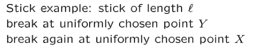，求$E(X|Y=y)$的值
> 我们知道$X$在$Y=y$时的条件概率密度函数$f_{X|Y}(x|y)=\begin{cases}\frac{1}{y},0\leq x\leq y\\0,otherwise \end{cases}$
> 且$E(X|Y=y)=\int_{0}^y\frac{x}{y}dx=\frac{1}{2}\cdot\frac{x^2}{y}=\frac{y}{2}$
> 但我们$E(X|Y=y)$这样写实际上是假定了我们知道了$Y$这个随机变量的具体取值，而$Y$的值实际上是随机的。
> 所以$X$在$Y$取值下的期望最好写成$W=E(X|Y)=\frac{Y}{2}=g(Y)$, 也就是$X$在$Y$下的期望$W$实际上也是一个随机变量，其大小总是是随机变量$Y$的一般
> **既然**$E(X|Y)$**是一个随机变量，我们自然可以对其求期望值，所以**$E(E(X|Y))=E(X)=E(\frac{Y}{2})=\frac{l}{4}$

## 1.1 迭代期望法则和推导
> 有了上面的铺垫，我们可以定义出迭代期望公式如下：
> 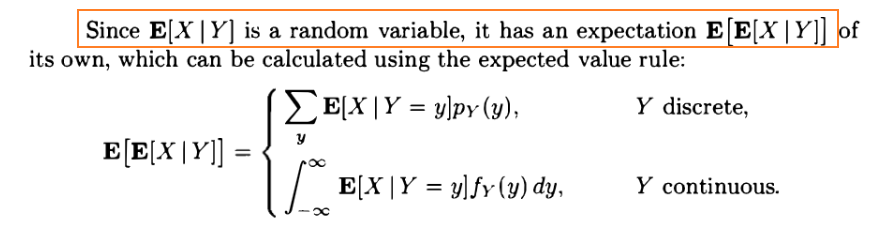
> 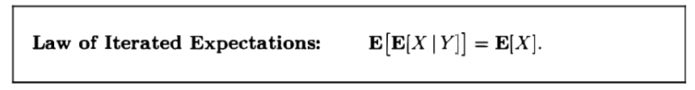
> 对于$E[X|Y]$来说，我们可以这样理解: $E[X|Y]$是关于$Y$的函数，因为$Y$的值改变会导致$E[X|Y]$的值发生改变，于是$E[E[X|Y]]$实际上可以写成$E[g(Y))]$, $g(y)=E[X|Y=y]$的形式，所以计算$E[g(Y)]$的时候可以使用$\sum_{y}g(y)p_Y(y)$公式。

**推导**我们在离散的框架下推导，连续的几乎一样, 只需要把$\sum$变成$\int$即可:
首先$E(X|Y)$是一个**随机变量的函数**$E(X|Y)=g(Y)$, 且$E(X|Y=y)=g(y)$
所以$E(E(X|Y))=E(g(Y))=\sum_{y}g(y)p_Y(y)=\sum_{y}E(X|Y=y)p_Y(y)=\sum_y\sum_xx\cdot P(X|Y=y)p_Y(y)=\sum_x\sum_y x\cdot P(X|Y=y)p_Y(y)\newline =\sum_x x\cdot p_X(x)=E(X)$

## 1.2 运算性质
> 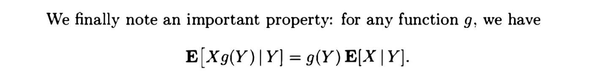
> 因为$Y$的值已知，所以$g(Y)$的值就是一个常数，可以提到期望符号的外面去。

# 2 条件方差/方差分解公式
## 2.1 定义
> 1. **写成一个常数的形式:**
> 
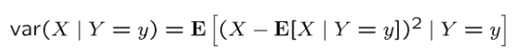
> 2. **写成一个随机变量的形式:**
> 

> 其中$\tilde{X}=\hat{X}-X$， $\hat{X}=E[X|Y]$，在`3.2`小节给出。
> 3. **方差分解法则：**
> 

## 2.2 迭代方差法则和推导
> 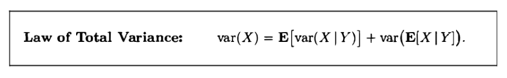

**推导**我们知道：$var(X)=E(X^2)-(E(X))^2$
所以在$Y$的条件下：$var[X|Y]=E[X^2|Y]-(E[X|Y])^2$
由于$var[X|Y]$是一个随机变量，所以由期望的线性性质：$E(var[X|Y])=E(E[X^2|Y])-E(E[X|Y]^2)....................................(1)$
根据迭代期望性质: $E(X^2)=E(E[X^2|Y])$, 代入$(1)$中我们有:
$E(var[X|Y])=E(X^2)-E(E[X|Y]^2).............................................(2)$
同时我们有$var(E(X|Y))=E[(E[X|Y])^2]-(E[X])^2$(把$E[X|Y]$看成一个整体), 然后联立$(2)$式, 得到:
$E(var[X|Y])=E(X^2)-(var(E(X|Y))+(E[X])^2)\newline=E(X^2)-var(E[X|Y])-(E[X])^2\newline=var(X)-var(E[X|Y])$
所以$var(X)=E(var[X|Y])+var(E[X|Y])$, 证毕。

# 3 迭期望/方差分解公式应用
## 3.1 分部期望与方差
### 3.1.1 Sections of mean and variance
> **我们从一个较为特殊的例子入手:**
> 假设我们有一个班级，共$30$名学生，被分为两个`Sections`, 假设`Section 1`中有$10$个学生，`Section 2`中有$20$个学生, 用随机变量$Y\in \{1,2\}$表示, $Y=1$表示某个学生在`Section 1`中，概率为$\frac{10}{30}=\frac{1}{3}$成绩总和是$900$, $Y=2$表示某个学生在`Section 2`中，概率为$\frac{2}{3}$, 成绩总和是$1200$。
> 每个`Section`的某个学生的成绩用随机变量$X$表示，则$E(X|Y=1)$表示`Section 1`中学生的成绩的期望, $E(X|Y=2)$表示`Section 2`中学生的成绩的期望。
> **我们要求**$Var(X)$**, 也就是所有**$30$**名学生的成绩的方差:**
> **我们要利用迭方差公式**$Var[X]=Var[E[X|Y]]+E[Var[X|Y]]$
> 1. **求**$Var[E(X|Y)]$
> 
我们想要利用`Law of Total Expectation`: $E[E[X|Y]]$, 则根据题意我们有:
> `Section 1`中的学生的期望成绩$\frac{1}{10}\sum_{i=1}^{10} x_i=90$
> `Section 2`中的学生的期望成绩$\frac{1}{20}\sum_{i=11}^{30} x_i=60$
> 所以$E[X|Y]=\begin{cases} 90,p=\frac{1}{3}\\ 60,p=\frac{2}{3} \end{cases}$, $p_Y(y)=\begin{cases}\frac{1}{3},Y=1\\\frac{2}{3},Y=2\end{cases}$
> 则整个班级的学生的成绩的期望是$E[X]=E[E[X|Y]]=\frac{1}{30}\sum_{i=1}^{30} x_i=\frac{90\cdot 10+60\cdot 20}{30}=70$
> **然后我们计算**$Var[E(X|Y)]=\sum_{y}E[(E[X|Y]-E[E[X|Y]])^2]p_Y(y)\newline=\frac{1}{3}(90-70)^2+\frac{2}{3}(60-70)^2=\frac{600}{3}=200$
> 2. **求**$E[Var[X|Y]]$
> 
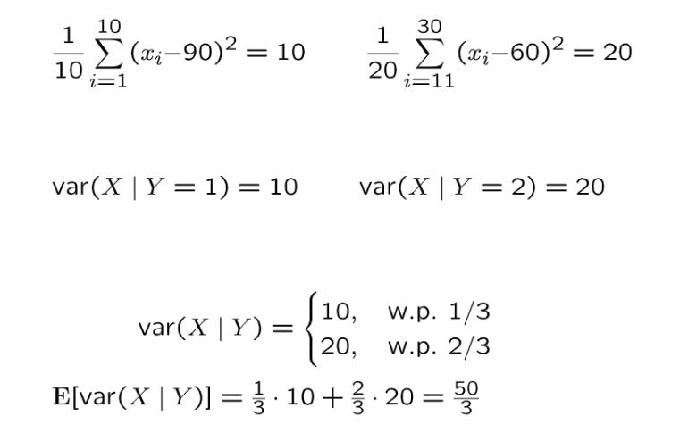
> 3. **求**$Var[X]$
> 
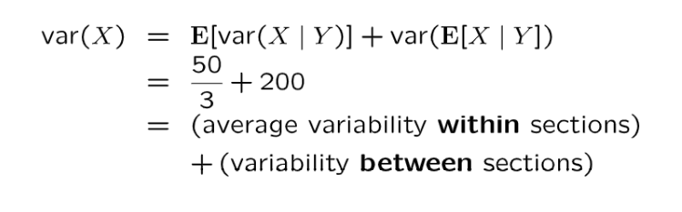

### 3.1.2 方差分解公式完整过程
> 假设现在有这样两个随机变量$X,Y$满足如下关系:
> 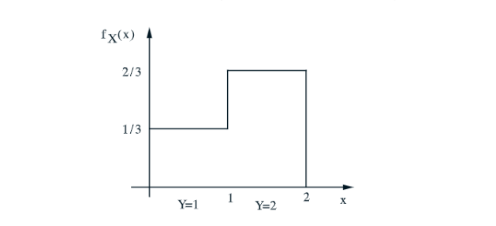
> 表示:
> - 在$Y=1$(概率是$\frac{1}{3}$)的条件下, $X$是$[0,1]$上的均匀分布
> - 在$Y=2$(概率是$\frac{2}{3}$)的条件下，$X$是$[1,2]$上的均匀分布
> 
现在我们要求$X$的方差$Var(X)$， 如果我们直接从公式$E(X^2)-(E[X])^2$入手，$E[X]$还算好求，我们使用全概率公式的期望变形即可，但是直接计算$E(X^2)$比较繁琐，于是我们可以考虑使用迭方差公式$Var[X]=E[Var(X|Y)]+Var(E[X|Y])$来求方差。
> 下面我们开始计算:
> 1. 首先计算$Var(E[X|Y])$
> 
因为$E[X|Y]=\begin{cases} \int_{0}^1x\cdot\frac{1}{1-0}dx=\frac{1}{2}, 当Y=1, p=\frac{1}{3}\\ \int_{1}^2x\cdot \frac{1}{2-1}dx=\frac{3}{2}, 当Y=2,p=\frac{2}{3}\end{cases}$, 因为$E[X|Y]$是一个随机		变量(**看成**$g(Y)$)，所以$E[E[X|Y]]=\sum_y f_Y(y)g(Y)=\frac{1}{3}\cdot \frac{1}{2}+\frac{2}{3}\cdot \frac{3}{2}=\frac{7}{6}$。
> 同时我们有:  	$Var(E[X|Y])=\frac{1}{3}\cdot (E[X|Y=1]-E[E[X|Y]])^2\newline+\frac{2}{3}(E[X|Y=2]-E[E[X|Y]])^2$, 
> 于是$Var[E[X|Y]]=\frac{1}{3}\cdot (\frac{1}{2}-\frac{7}{6})^2+\frac{2}{3}\cdot (\frac{3}{2}-
\frac{7}{6})^2=\frac{2}{9}$
> 2. 然后计算$E[Var[X|Y]]$
> 
因为$Var[X|Y]=\begin{cases} \frac{(1-0)^2}{12}=\frac{1}{12}, 当Y=1, p=\frac{1}{3}\\ \frac{(2-1)^2}{12}=\frac{1}{12}, 当Y=2,p=\frac{2}{3}\end{cases}$(均匀分布在$[a,b]$上的连续型变		量的方差是$\frac{(b-a)^2}{12}$), 因为$Var[X|Y]$是一个随机变量，
> 所以我们有$E[Var[X|Y]]=\frac{1}{3}\cdot \frac{1}{12}+\frac{2}{3}\cdot \frac{1}{12}=\frac{1}{12}$。
> 3. 计算$Var(X)$
> 
我们有$Var[X]=E[Var(X|Y)]+Var(E[X|Y])=\frac{9}{12}+\frac{1}{12}=\frac{5}{6}$

 

### 3.1.3 推广到n组
> 
> 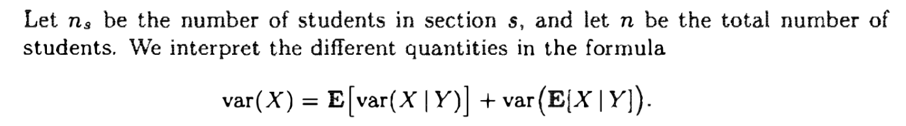
> 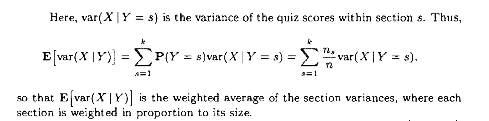
> 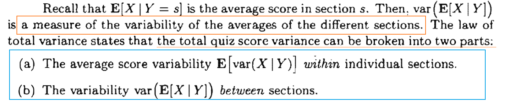
> **换句话说:**
> - 组内波动率$E[var(X|Y)]$表示先求出每个`Section`的方差，然后对这些方差求期望，表示不同的`Section`的成绩波动程度的中心值， 把$E[var(X|Y)]$理解为波动率的均值会好一些。**也可以理解为**`**Center of the variability across sections**`**(波动率的平均值)**
> - 组间波动率$var(E[X|Y])$表示先求出每个`Section`的期望，然后对这些期望求方差，表示不同的`Section`的平均成绩的波动率, **也可以理解为**`**Variability of the center of **`
> 
`**different sections**`**(平均值的波动率)**

## 3.2 用于估计随机变量
> 假设现在我们观测到的随机变量是$Y$, 观测到的$Y$会给$X$提供一些信息，则我们可以通过$\hat{X}=E[X|Y]$来估算随机变量$X$的值：
> -  $\hat{X}$**称为**`**The estimator of**`$X$`**given**`$Y$
> - `**Estimation Error**`**是**$\tilde{X}=\hat{X}-X$

:::success
同时这个随机变量$\hat{X}$满足:$E[\tilde{X}|Y]=E[\hat{X}-X|Y]=E[\hat{X}|Y]-E[X|Y]=\hat{X}-\hat{X}=0$
换句话说，随机变量$\tilde{X}$需要满足$E[\tilde{X}|Y=y]=0,\forall y$
**因此我们得到一个**$\tilde{X}$**的重要性质：**$E[E[\tilde{X}]]=E(\tilde{X})=0$
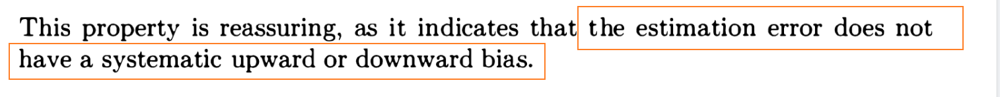
:::
> $\tilde{X}$**还有一个重要性质，就是**$E[\tilde{X}X]=0$**, 也就是**$\tilde{X}$**和**$X$**是线性无关的。**
> 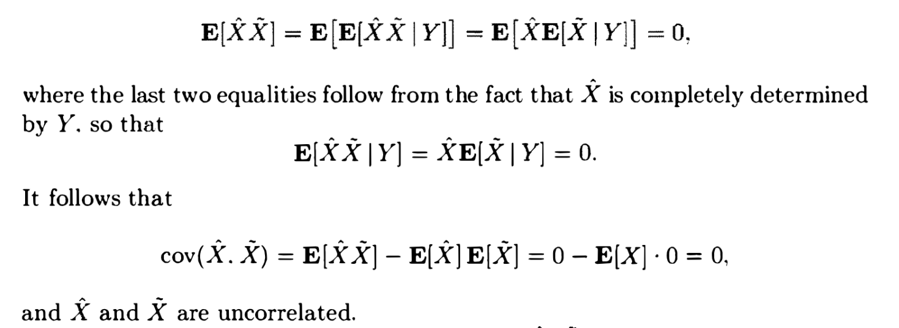
> 我们还有以下的重要性质:
> 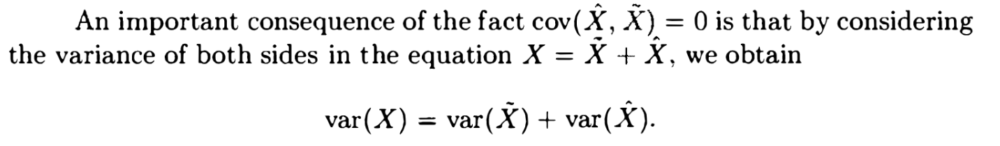

## 3.3 性质总结
> 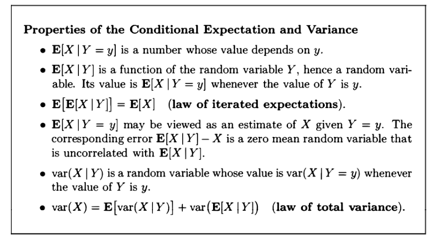

# 4 独立的随机变量的和 - Random Walk
> 假设$S_n=X_1+X_2+\cdots+X_n$, 其中$P_{X_i}(x)=\begin{cases}\frac{1}{2}&x=1\\\frac{1}{2}&x=-1 \end{cases}$，也就是说$P(X_i=1)=P(X_i=-1)=\frac{1}{2}$(Symmertric Random Walk)。
> 1. $\mathbb{E}[S_n]=\mathbb{E}[X_1+\cdots +X_N]=0$, 并没有告诉我们什么信息。
> 2. $\mathbb{E}[S_n^2]=\mathbb{E}[(X_1+\cdots+X_n)^2]=\mathbb{E}[\sum_{i=1}^nX_i^2+2\sum_{i<j}X_iX_j]=\sum_{i=1}^n\mathbb{E}[X_i^2]+2\sum_{i<j}\mathbb{E}[X_iX_j]$
> 
其中$\begin{aligned}P(X_iX_j=1)&=P(X_i=1\land X_j=1)+P(X_i=-1\land X_j=-1)\\&=P(X_i=1)P(X_j=1)+P(X_i=-1)P(X_j=-1)\\&=\frac{1}{2}\cdot\frac{1}{2}+\frac{1}{2}\cdot\frac{1}{2}\\&=\frac{1}{2}\end{aligned}$
> 所以$P(X_iX_j=-1)=1-P(X_iX_j=1)=\frac{1}{2}$, 所以$\mathbb{E}[X_iX_j]=\frac{1}{2}(1-1)=0$
> $\mathbb{E}[X_i^2]=1\cdot 1=1$, 所以$\mathbb{E}[S_n^2]=n$
> 3. $\mathbb{E}[|S_n|]$比较难求。

# 5 随机数量的独立随机变量之和
## 5.0 前言
> 本小节我们将介绍$N$个独立变量的和$Y=X_1+X_2+\cdots +X_N$，之前我们一直假定$N$是一个固定的常数，也就是我们的随机变量的数量是固定的。但是现在我们将不会假定$N$是一个常数，而是一个随机变量， 且$N$是非负整数。
> 所以当$N=0$时，$Y=0$。
> 但是**这里我们需要做另一个假设，就是**$N,X_1,X_2,\cdots,X_N$**是独立的, 且**$X_i$**是独立同分布的。**

## 5.1 变量拆分
> [!important]
> 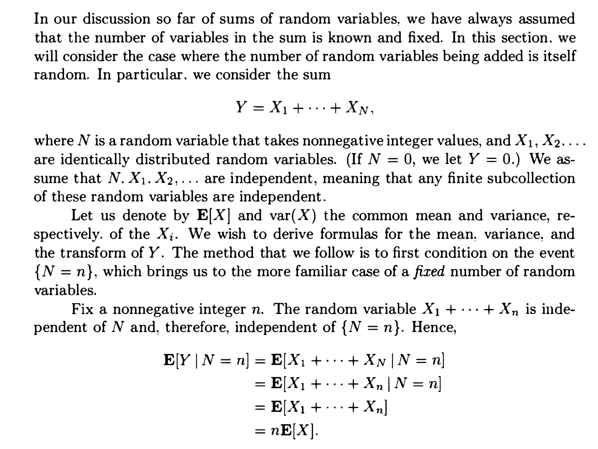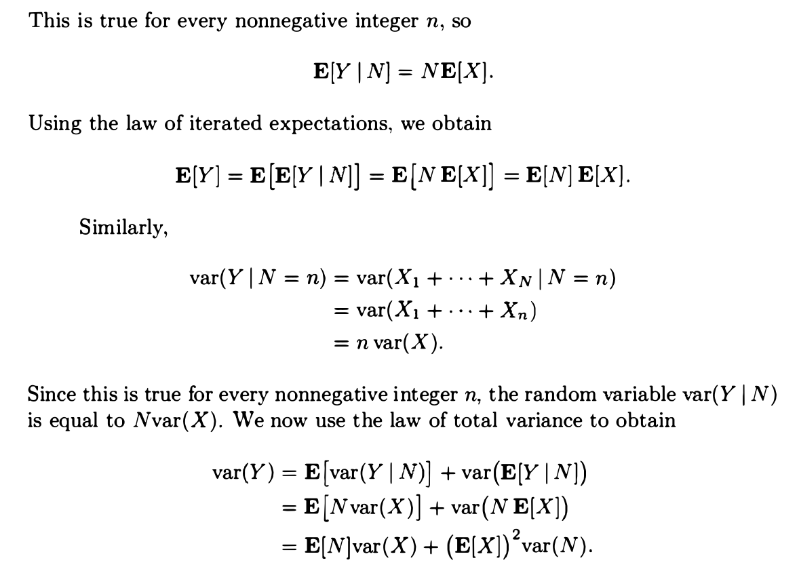

## 5.2 独立性
> 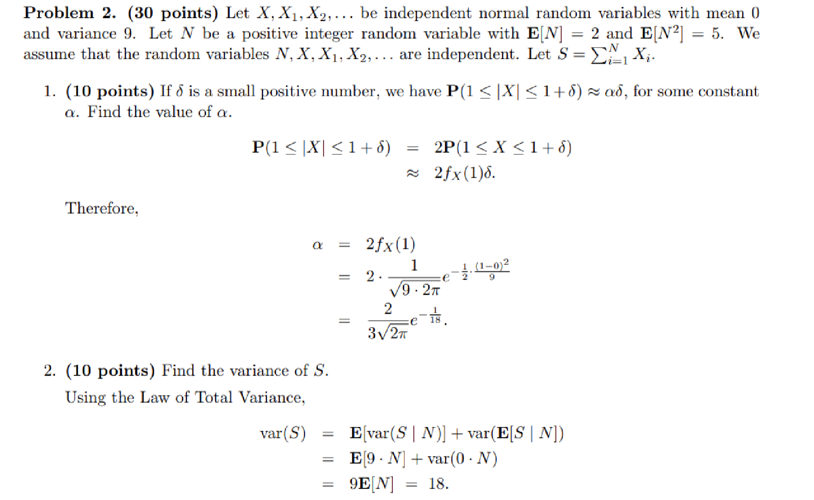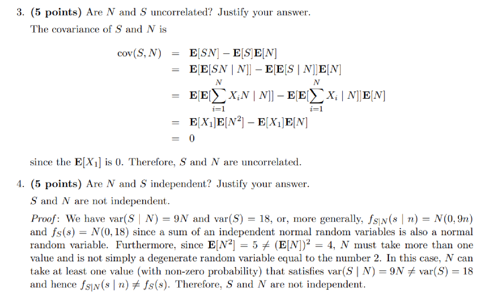

