# 1 Recitation Problems
[Recitation 13.pdf](https://www.yuque.com/attachments/yuque/0/2022/pdf/12393765/1661569634485-d55ff151-e790-4e36-aa98-d6265aee5d54.pdf)
[Recitation 13_sol.pdf](https://www.yuque.com/attachments/yuque/0/2022/pdf/12393765/1661569634771-890c5e45-a0f6-497b-81b7-9e10b3c5cb07.pdf)
> 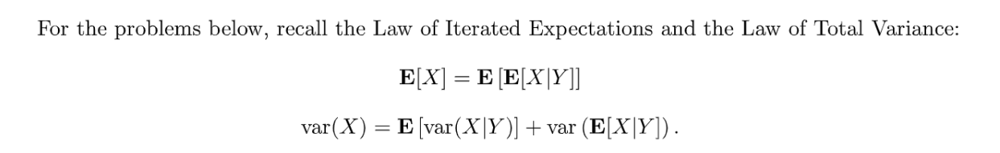

## P1 迭期望公式推广推导⭐⭐⭐⭐⭐
> 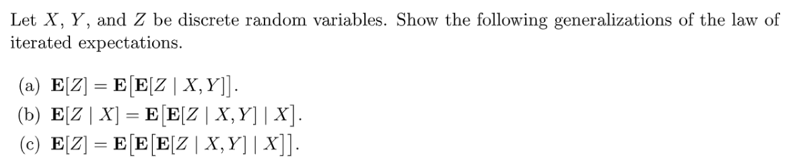

**(a)**⭐⭐⭐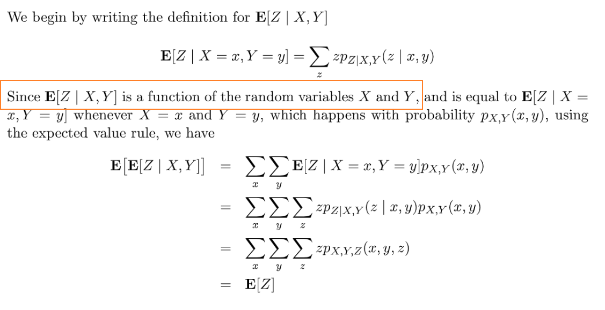
最后一个等式$\sum_x \sum_y\sum_z z\cdot p_{X,Y,Z}(x,y,z)=\sum_z z\cdot \sum_x \sum_yp_{X,Y,Z}(x,y,z)\newline=\sum_z z\cdot \sum_x \sum_yp_{X,Y,Z}(x,y,z)=\sum_z z\cdot p_{Z}(z)=E(Z)$
**(b)**⭐⭐⭐⭐⭐我们可以这样理解: $E[Z]=\sum_xE[Z|X]p_X(x)$, 且$E[E[X|Y,Z]]=\sum_xE[E[X|Y,Z]|X]p_X(x)$
所以$\sum_xE[Z|X]p_X(x)=\sum_xE[E[X|Y,Z]|X]p_X(x)$, 于是$E[Z|X]=E[E[X|Y,Z]|X]$
当然这样推导不够严谨:
我们从定义出发:
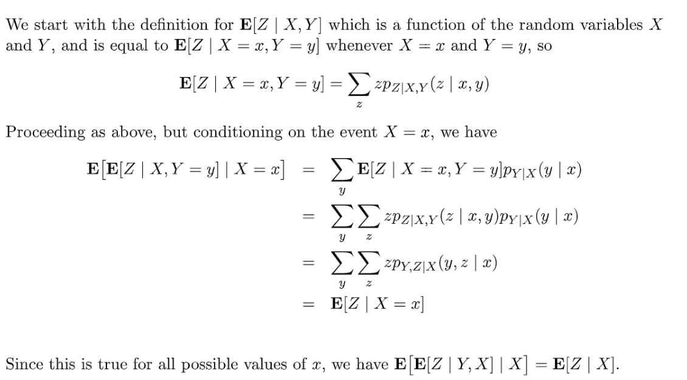
对于$E[E[Z|X,Y=y]|X=x]=\sum_xE[Z|X=x,Y=y]p_{Y|X}(y|x)$来说，我们可以这样理解: $E[Z|X=x,Y=y]$是一个关于$X,Y$的二元随机变量的函数$g(X,Y)$, 所以$E[E[Z|X,Y]]=E[g(X,Y)]=\sum_{x}\sum_yg(x,y)p_{X,Y}(x,y)$
而现在是$E[g(X,Y)|X=x]=\sum_{y}g(x,y)P(X=x,Y=y|X=x)\newline=\sum_{y}g(x,y)\frac{P(X=x,Y=y)}{P(X=x)}=\sum_{y}g(x,y)\frac{p_{X,Y}(x,y)}{p_{X}(x)}\newline=\sum_{y}g(x,y)p_{Y|X}(y|x)$
所以$E[g(X,Y)|X=x]=\sum_y E[Z|X=x,Y=y]p_{Y|X}(y|x)$
**(c)**⭐⭐⭐⭐⭐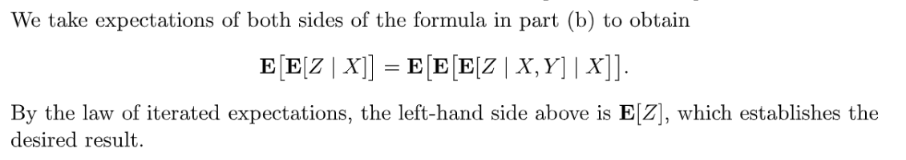

## P2 Stick Example Again⭐⭐⭐⭐⭐
> 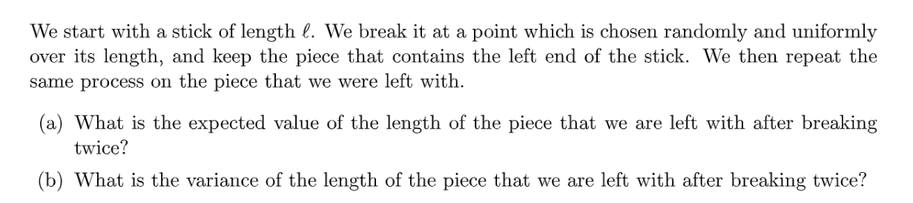
> 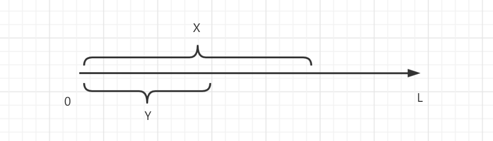

**(a) 迭期望公式**⭐⭐⭐根据题意，我们知道$X\sim Uniform(0,l)$, $Y\sim Uniform(0,X)$
于是根据迭期望公式：$E[Y]=E[E[Y|X]]$
我们知道$Y$在给定$X$的时候是$[0,X]$上的均匀分布
于是$E[Y|X]=\frac{X}{2}$，所以$E[E[Y|X]]=E[\frac{X}{2}]=\frac{1}{2}E[X]=\frac{l}{4}$
**(b) 方差分解公式**⭐⭐⭐根据方差分解公式，我们有: $Var[Y]=Var[E[Y|X]]+E[Var[Y|X]]$
$Var[E[X|Y]]=Var[\frac{X}{2}]=\frac{1}{4}Var[X]=\frac{1}{4}\cdot\frac{l^2}{12}=\frac{l^2}{48}$
$E[Var[X|Y]]=E[\frac{X^2}{12}]=\frac{1}{12}E[X^2]=\frac{1}{12}\cdot \frac{1}{l}\int_{0}^l x^2dx=\frac{l^2}{36}$
所以$Var[Y]=\frac{l^2}{48}+\frac{l^2}{36}=\frac{7}{144}l^2$

## P3 Widgets and Crates⭐⭐⭐⭐⭐
> 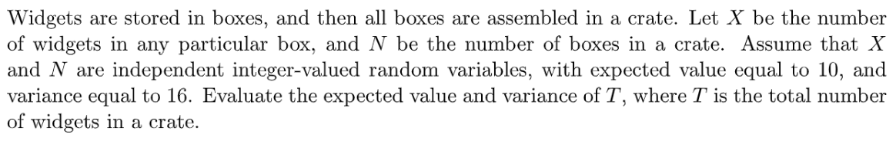

**Key**
1. **计算期望**

$T=\sum_{i=1}^{N} X_i$, 所以$E[T]=E[E[T|N]]=E[E[\sum_{i=1}^N X_i|N]]=E[\sum_{i=1}^NE[X_i|N]]\newline=E[\sum_{i=1}^NE[X_i]]=E[N\cdot E[X_i]]=E[N]\cdot E[X_i]=100$

2. **计算方差**

$Var[T]=Var[E[T|N]]+E[Var[T|N]]$
$Var[E[T|N]]=Var[E[\sum_{i=1}^N X_i|N]]=Var[\sum_{i=1}^N E[X_i|N]]=Var[N\cdot E[X_i]]=E[X_i]^2Var[N]=100\cdot 16=1600$
$E[Var[T|N]]=E[Var[\sum_{i=1}^N X_i|N]]=E[NVar[X_i]]=Var[X_i]E[N]\newline=16\cdot 10=160$
所以$Var[T]=1600+160=1760$

# 2 Tutorial Problems
[Tutorial 06.pdf](https://www.yuque.com/attachments/yuque/0/2022/pdf/12393765/1661569689023-612b3159-e8df-4cc2-8cb1-0f9a132bbe3b.pdf)
[Tutorial 06_sol.pdf](https://www.yuque.com/attachments/yuque/0/2022/pdf/12393765/1661569689159-a9c69fcc-c195-4ef9-9bd6-aa0c61d20ec3.pdf)
[BonVid.pdf](https://www.yuque.com/attachments/yuque/0/2022/pdf/12393765/1661569634364-b6d83e66-8799-4ca2-b866-9f0b356c1065.pdf)
[BonVidSol.pdf](https://www.yuque.com/attachments/yuque/0/2022/pdf/12393765/1661569634610-52de197d-5351-411a-a686-74db899970ac.pdf)

## P1 Law of Total Variance⭐⭐⭐
> 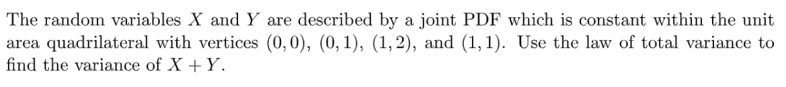

**Key**$Var(X+Y)=E[Var(X+Y|X)]+Var(E[X+Y|X])$
因为$X,Y$满足: $f_{X,Y}(x,y)=c, (x,y)\in R$, $R$就是$(0,0),(0,1),(1,2),(1,1)$围城的面积为$1$的平行四边形。
于是$c=1$
注意到: 当$X$的值确定为$x$以后，$Y-x$是一个$[0,1]$上的均匀分布， 于是$Y\sim uniform(x,x+1)$
所以$Var(X+Y|X)=Var(Y|X)=\frac{1}{12}$
$E[X+Y|X]=x+E[Y|X]=x+\int_{x}^{x+1}ydy=x+x+\frac{1}{2}=2X+\frac{1}{2}$
所以$E[Var(X+Y|X)]=\frac{1}{12},Var(E[X+Y|X])=Var(2X+\frac{1}{2})$
所以$Var(X+Y)=\frac{1}{12}+4Var(X)$
下一步就是求出$Var(X)$, 因为$f_X(x)=\int_{x}^{x+1}dy=1,0\leq x\leq 1$, 所以$X\sim Uniform(0,1)$
因此$Var(X)=\frac{1}{12}$, 所以$Var(X+Y)=\frac{1}{12}+\frac{4}{12}=\frac{5}{12}$

## P2 A Random Number of Coin Flips⭐⭐⭐⭐⭐
> 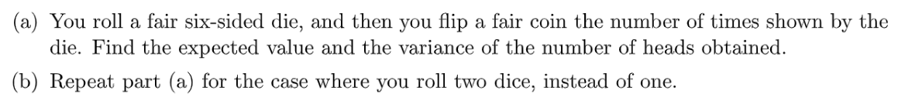

**(a) 独立同分布**⭐⭐⭐⭐⭐令$X$是我抛硬币得到的正面朝上的次数， $Y$是筛子投掷的结果
则我们要求$E[X]$和$Var(X)$
我们考虑使用`Total Law of Iterated Expectation`和`Law of total variance`
我们知道在$Y=y$的条件下，$X$是一个二项分布，但是因为我们要求$E(X)$和$Var(X)$, 直接通过期望或方差的定义来求会比较复杂，因此我们考虑将二项分布拆分成$y$个互相独立的伯努利随机变量$X_i$的和。于是, 根据[独立随机变量之和](https://www.yuque.com/alexman/kziggo/pgd0q0#gbuia)中的方法:
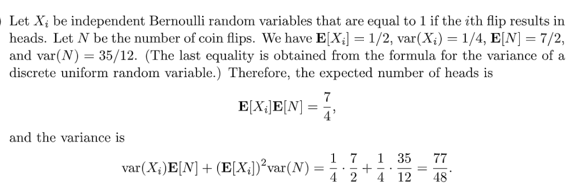
**(b) 独立实验**⭐⭐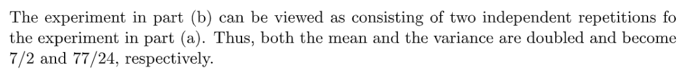

## P3 Coin with random Bias⭐⭐⭐⭐⭐
> 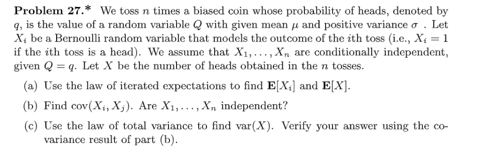

**(a)**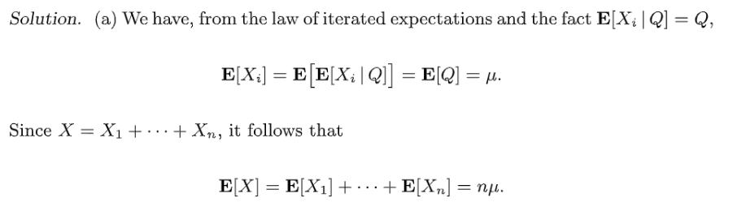
**(b)**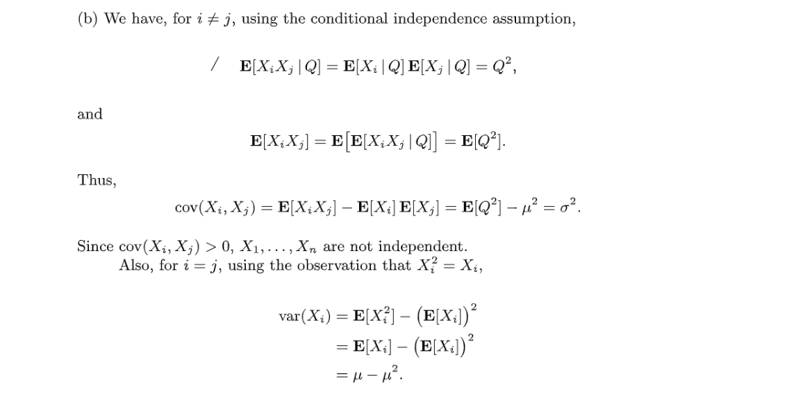
**(c)**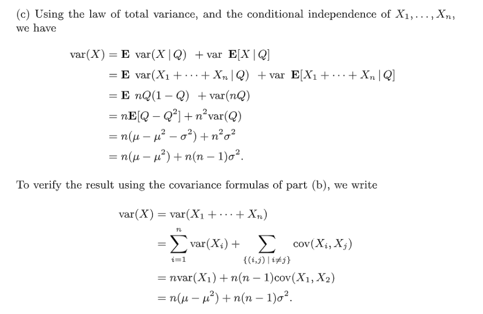

# 3 Assignment Problems
[Assignment 06.pdf](https://www.yuque.com/attachments/yuque/0/2022/pdf/12393765/1661569634070-fbaec08b-4b51-49b1-b801-6b8e193a7c85.pdf)
[Assignment 06_sol.pdf](https://www.yuque.com/attachments/yuque/0/2022/pdf/12393765/1661569634360-d6f7fdee-09a6-4786-873a-24d1bb718361.pdf)

## P1 PDF基础⭐⭐
> 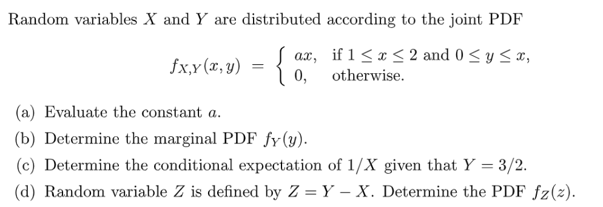

**(a)**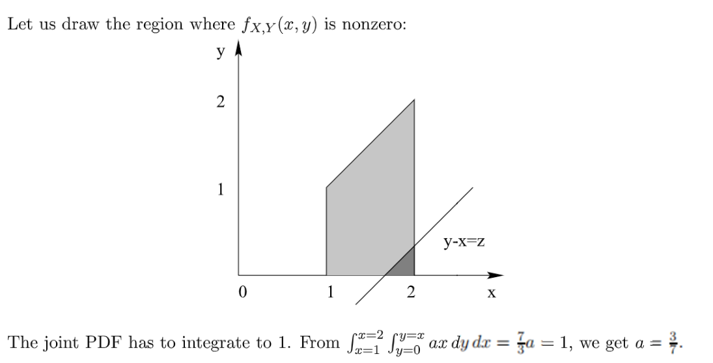
**(b)**分两类讨论
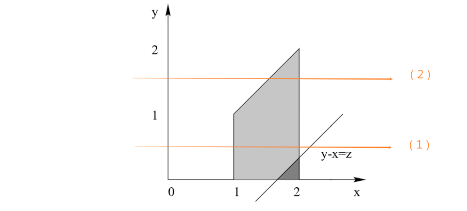

**(c)易错**⭐⭐⭐⭐⭐**注意**$Y=\frac{3}{2}$**时**$X$**的积分范围， **$X$**此时只能取**$[\frac{3}{2},2]$
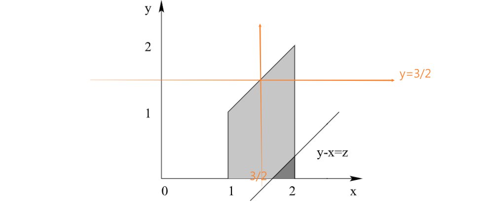
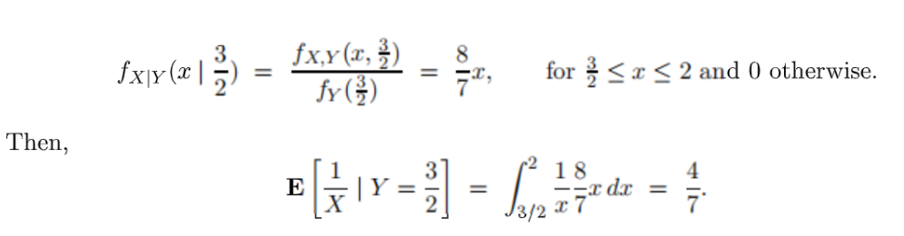
**(d)易错**⭐⭐⭐求$Z$就讨论$z$的大小。然后给定$z$求关于$X,Y$的二重积分。
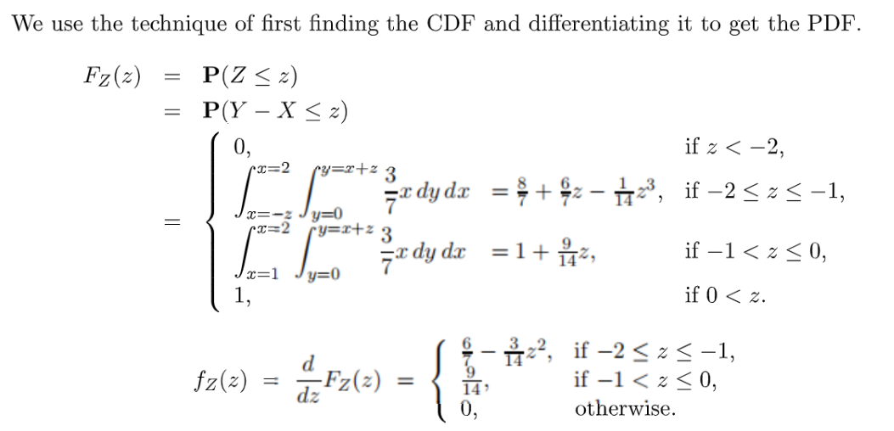

## P2 卷积公式⭐⭐⭐⭐⭐
> 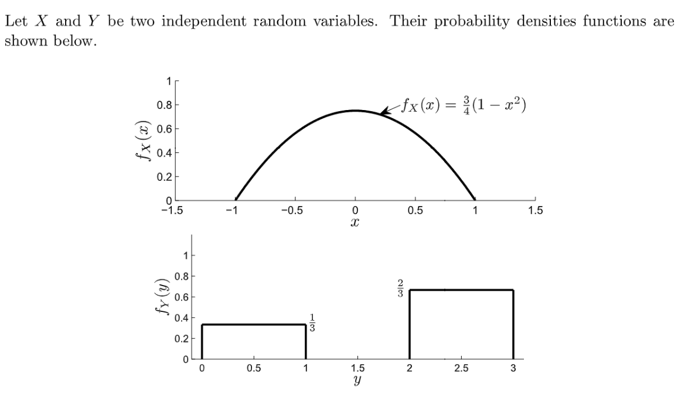
> 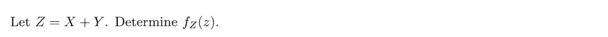
> **看到随机变量的和就要反应过来可以使用卷积公式简化积分运算，从多元积分转化为单元积分**

**分类讨论较繁琐**⭐⭐⭐⭐确定分类讨论边界的方法就是把$f_{X,Y}(x,y)$的积分区域画出来：
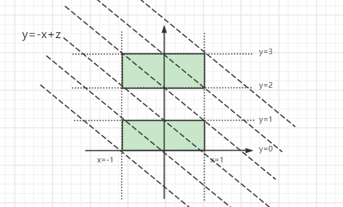
详见[卷积公式](https://www.yuque.com/alexman/kziggo/ei1b29#FxNNL)中的思路，我们有:
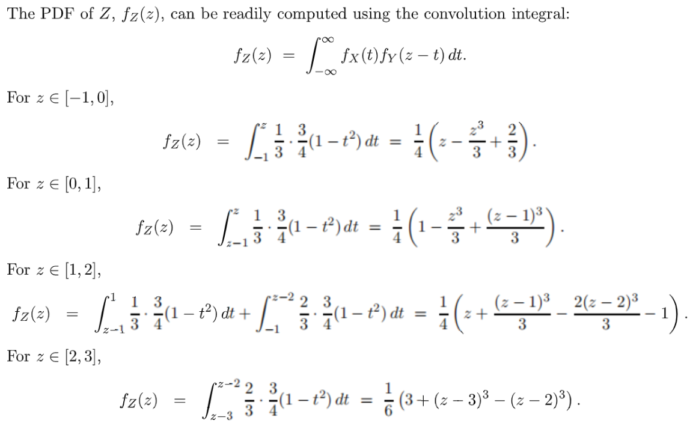
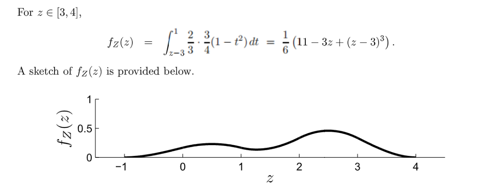

## P3 相关性与协方差⭐⭐⭐
> 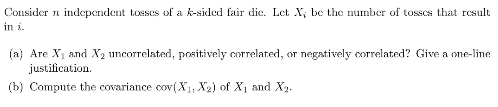

**(a) 相关性**⭐⭐⭐总的投掷次数是固定的，那么投掷的$1$数量越多，对应的投掷的$2$的数量一定就会越少。
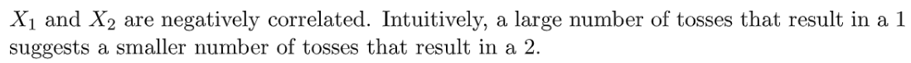
**(b) 协方差(伯努利分解)**⭐⭐⭐⭐⭐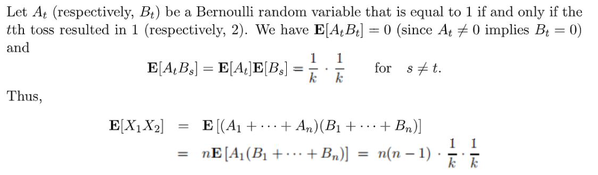
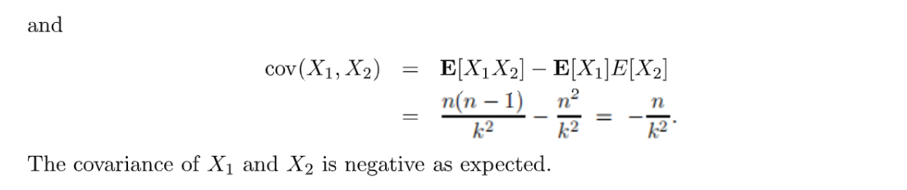

## P4 联合均匀分布性质⭐⭐⭐⭐⭐
> 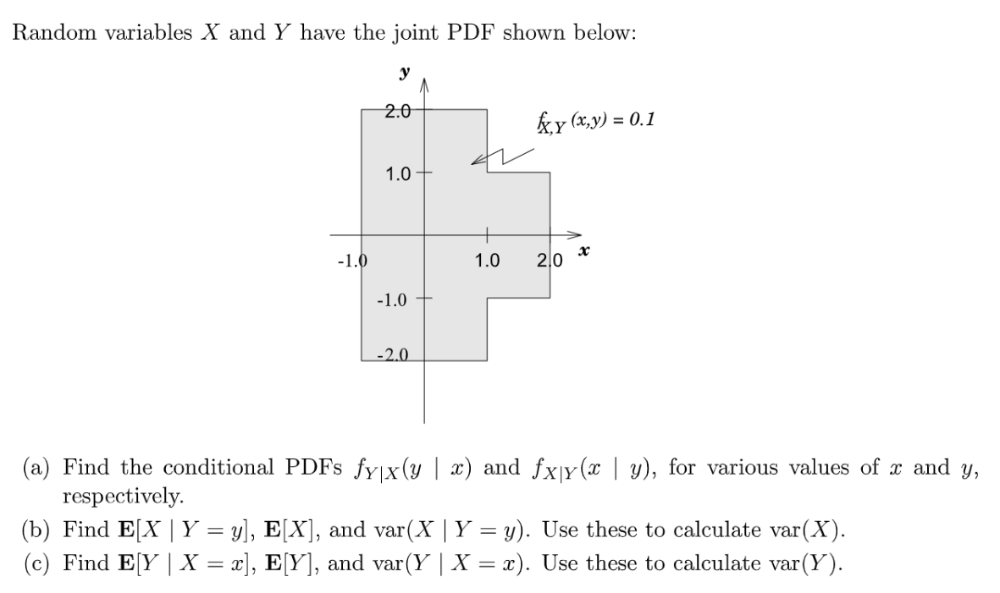

**(a) 联合均匀分布的条件概率**⭐⭐⭐对于一个联合均匀分布$X,Y\sim Uniform$来说$X,Y$各自的条件概率$f_{X|Y}(x|y)$和$f_{Y|X}(y|x)$都是均匀分布的`PDF`。读者可以参考上一章练习中的[联合均匀分布的条件概率](https://www.yuque.com/alexman/kziggo/iknmdr)的推导。
因为$f_{X,Y}(x,y)$概率密度大于零的区域是规则长方形的，所以$f_{Y|X}(y|x)$和$f_{X|Y}(x|y)$是均匀分布的概率密度函数, 且为常数，所以:

- $f_{X|Y}(x|y)=\begin{cases}0.5,1\leq|Y|\leq2 \\\frac{1}{3},|Y|\leq 1\end{cases}$,$f_{Y}(y)=\begin{cases}0.2,1\leq|Y|\leq2 \\\frac{3}{10},|Y|\leq 1\end{cases}$
- $f_{Y|X}(y|x)=\begin{cases}0.25,|X|\leq 1 \\0.5,1<X\leq2\end{cases}$ , $f_{X}(x)=\begin{cases} 0.4,|X|\leq 1\\0.2,1<X\leq 2\end{cases}$
**(b) 要牢记定义**⭐⭐⭐⭐⭐$E[X|Y]=\begin{cases} \int_{-1}^2x\cdot \frac{1}{3}dx=\frac{1}{2},|Y|\leq 1\\0,1\leq|Y|\leq2\end{cases}$
$Var[X|Y]=\begin{cases}\frac{(1--1)^2}{12}=\frac{1}{3},1\leq|Y|\leq2 \\\frac{(2--1)^2}{12}=\frac{3}{4},|Y|\leq 1\end{cases}$
$E[X]=E[E[X|Y]]=\int_{-1}^1\frac{1}{2}\cdot f_Y(y)dy=\int_{-1}^1\frac{1}{2}\cdot \frac{3}{10}dy=\frac{3}{10}$
$Var[X]=E[Var[X|Y]]+Var[E[X|Y]]\newline=E[Var[X|Y]]+E[(E[X|Y]-E[E[X|Y]])^2]\newline=(\int_{-1}^1 \frac{3}{4}\cdot \frac{3}{10}dy+\int_{-2}^{-1}\frac{1}{5}\cdot \frac{1}{3}dy+\int_{1}^{2}\frac{1}{5}\cdot \frac{1}{3}dy)\newline+(\int_{-1}^1 (\frac{1}{2}-\frac{3}{10})^2\cdot\frac{3}{10}dy+\int_{-2}^{-1}(\frac{1}{2}-\frac{3}{10})^2\cdot 0.2dy+\int_{1}^{2}(\frac{1}{2}-\frac{3}{10})^2\cdot 0.2dy)\newline=\frac{193}{300}$
**(c) 要牢记定义**⭐⭐⭐⭐⭐和上面类似步骤，我们有:
$E[Y|X]=\begin{cases} \int_{-2}^2 0.25ydy=0,|X|\leq 1\\0,1<X\leq2\end{cases}$
$Var[Y|X]=\begin{cases}\frac{(2--2)^2}{12}=\frac{4}{3},|X|\leq1 \\\frac{(1--1)^2}{12}=\frac{1}{3},1< X\leq 2\end{cases}$
$E[Y]=E[E[Y|X]]=\int_{-1}^10\cdot f_X(x)dx+\int_{1}^20\cdot f_X(x)dx=0$
$Var[Y]=E[Var[Y|X]]+Var[E[Y|X]]\newline=E[Var[Y|X]]+0=\int_{-1}^1 \frac{4}{3}\cdot \frac{2}{5}dx+\int_{1}^2\frac{1}{3}\cdot \frac{1}{5}dx=\frac{17}{15}$

## P5 独立随机变量的和⭐⭐⭐
> 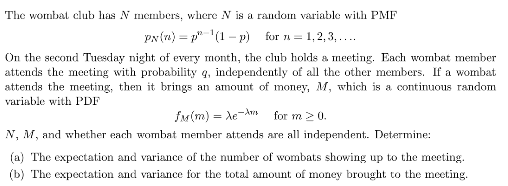

**(a) 伯努利随机变量的和(易错)**⭐⭐⭐设$X=X_1+X_2+...+X_N$, 其中$X_i$表示第$i$个人是否参加`Wombat`, $p_{X_i}(x)=\begin{cases}q,X_i=1\\1-q,X_i=0 \end{cases}$, $X$表示参加`Wombat`的总人数，所以问题转化为求$E[X]$的大小。
根据迭期望公式，我们有$E[X]=E[E[X|N]]=E[NE[X_i]]=E[N]E[X_i]$
$Var[X]=E[Var[X|N]]+Var[E[X|N]]=E[N]Var[X_i]+(E[X_i])^2Var[N]$
所以我们需要计算$X$和$N$的期望和方差:
**注意**$N$**不是几何分布：**
** **$E[N]=\sum_{n=1}^{\infty}n\cdot p^{n-1}(1-p)=\frac{1}{1-p}$**, **$Var[N]=\frac{p}{(1-p)^2}$
$E[X_i]=q, Var[X_i]=q(1-q)$
所以$E[X]=\frac{q}{1-p},Var[X]=\frac{q(1-q)}{1-p}+\frac{pq^2}{(1-p)^2}$
**(b) 伯努利随机变量的和**⭐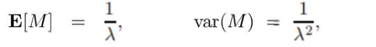
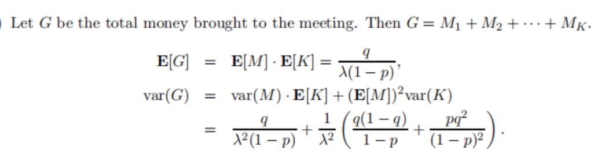

## P6 拓展思维⭐⭐⭐⭐⭐
> 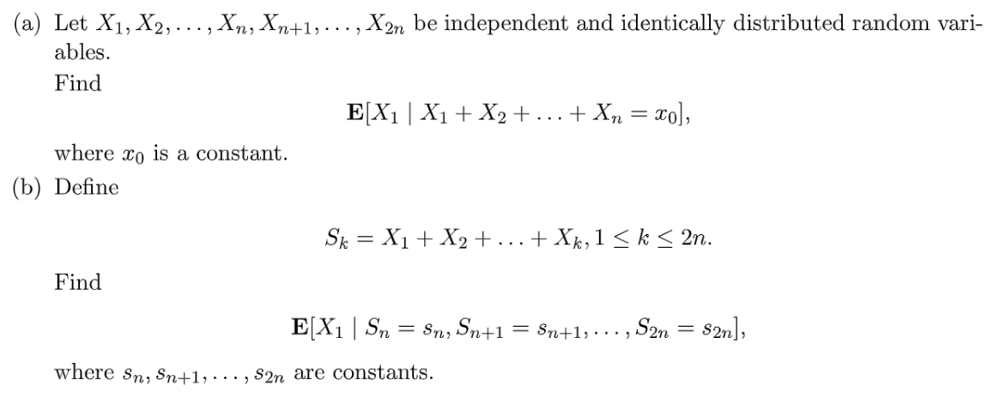

**(a) 条件期望**⭐⭐⭐⭐⭐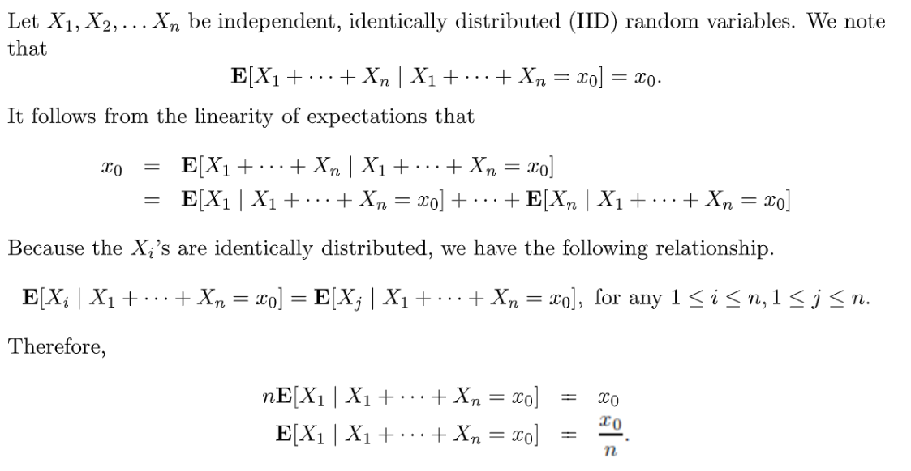
**(b) 条件期望/独立性**⭐⭐⭐⭐⭐$E[X_1|S_n=s_n,S_{n+1}=s_{n+1},\cdots,S_{2n}=s_{2n}]$就相当于:
$E[X_1|X_{n+1}=s_{n+1}-s_n,X_{n+2}=s_{n+2}-s_{n+1},\cdots,X_{2n}=s_{2n}-s_{2n-1}]\newline=E[X_1|X_{n+1}+X_{n+2}+\cdots+X_{2n}=s_{2n}-s_n,S_{2n}=s_{2n}]\newline =E[X_1|S_{2n}-(X_{n+1}+X_{n+2}+\cdots+X_{2n})=s_{2n}-(s_{2n}-s_n)=s_n]\newline =E[X_1|X_{1}+X_{2}+\cdots+X_{n}=s_{n}]$
然后就和$(a)$问中的方法一样：
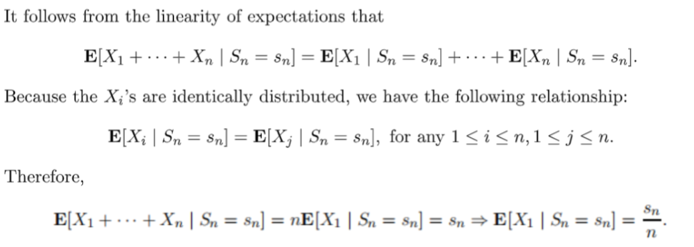
