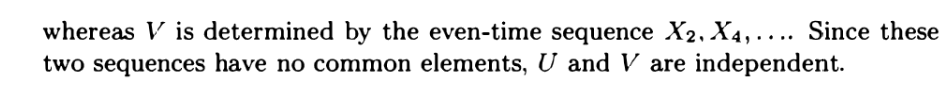
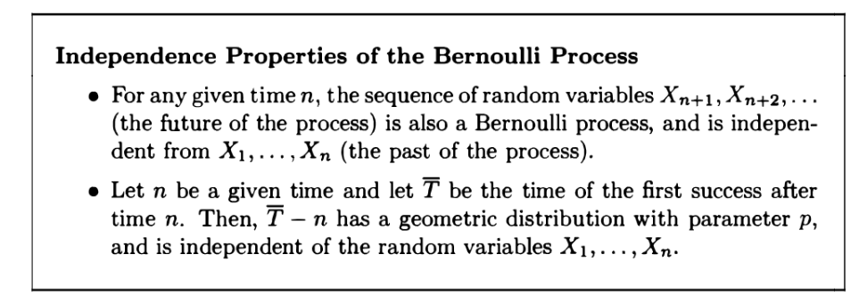

[L13 Slides.pdf](https://www.yuque.com/attachments/yuque/0/2022/pdf/12393765/1661837411180-88fe7ef1-9721-4273-8453-8666abd81470.pdf)

# 1 伯努利随机变量
> 
> 

# 2 伯努利随机过程
> 本小节我们从两个角度介绍伯努利过程。

## 2.1 看成随机变量的序列
> 对于伯努利过程，我们可以视其为一个由独立伯努利变量$X_1,X_2,...$组成的序列。 我们会想去求出这个序列的期望和方差，但是要求出这个序列的期望和方差，我们需要知道这个序列中任意数量的随机变量的组合的联合概率密度函数，比如$p_{X_2,X_5,X_7}(x_2,x_3,x_7)$, $p_{X_1,X_2,X_3,...}(x_1,x_2,x_3,...)$等等, 假设我们规定序列长度小于等于$n$, 则理论上我们需要$2^n$个这样的联合概率密度函数才能描述这个伯努利序列。因为$X_i$是独立的，所以我们可以通过连乘这些独立的伯努利随机变量的概率密度函数得到联合概率密度函数。但是还是太复杂，毕竟有$2^n$个联合概率密度函数要求。

## 2.2 看成一个随机变量
> 我们可以把整个伯努利过程序列看成是变长序列，样本空间是$\{(00111111....),(10000011....),(10101010.....),.... \}$(可以是任意长度)。**(看成是一系列二进制数的序列，可以无限延伸)**
> 一旦我们这样定义了样本空间，一个相关的问题是，我们如何求得无限长度的，全为$1$的序列的概率，用$P(X_t=1,\forall t)$表示。
> 因为$P(X_t=1,\forall t)\leq P(X_1=...=X_{k}=1)=p^{k}$($k\leq t$)
> 当$k\to \infty$时, 因为$|p|<1$, 所以$\lim_{k\to \infty}P(X_t=1,\forall t)\leq P(X_1=...=X_{k}=1)=\lim_{k\to \infty}p^{k}=0$
> 于是我们得到了一个反直觉的结论，就是对于无限长的伯努利过程序列，他全为$1$的概率趋近于零。

# 3 独立性和无记忆性**⭐⭐⭐⭐⭐**
## 3.1 独立性⭐⭐
> 假设我们有一个随机变量$Z=(X_1+X_3)X_6X_7$, $X_i\sim Bernoulli(p)$, 这个随机变量$Z$是由$X_1,X_3,X_6,X_7$四个独立的随机变量组成的，如果$Y=(X_2+X_4)X_9X_{10}$是由$X_2,X_4,X_9,X_{10}$这四个独立的随机变量组成的，注意到$Z,Y$的构成变量是没有重叠的。根据[独立随机变量的函数也是独立的](https://www.yuque.com/alexman/kziggo/ng8x7t#sFWqH) 这个性质，我们知道$Z=g(X_1,X_3,X_6,X_7)，Y=h(X_2,X_4,X_9,X_{10})$, 所以$Z$和$Y$是独立的。
> 我们还有很多类似的例子: 

## 3.2 无记忆性⭐⭐⭐
> 假设伯努利过程运行了$n$步，我们已经观察到$X_1, X_2,…,X_n$，我们注意到
> 来试验序列$X_{n+1}, X_{n+2}，…$是独立的伯努利试验形成的一个伯努利过程。此外，这些未来的试验是独立于过去的。我们可以得出结论，从任意给定的时间点开始，这个时间点的未来也是一个伯努利过程的，它是独立于过去的。
> 我们把它形象地称为伯努利过程的`Refresh-Start`性质。
> 现在让我们回忆一下，直到第一次`success`的时间$T_1$是一个几何分布的随机变量。即$P(T_1=t)=(1-p)^{t-1}p, p\in (0,1)$(注意是$t-1$, 因为$t$代表的是在第一次`success`出现前`failures`出现的总次数)。
> 现在假设我们已经观察到$n$次实验的结果了, 那么对于剩下的$T_1-n$次伯努利实验，我们能够推断出什么呢?
> 实际上，在$n$次实验后的$T_1-n$次剩余试验序列组成的过程是独立于过去的，并构成一个全新的伯努利过程，在从$n+1$次实验开始直到第一次成功的次数服从几何分布（和$T_1$服从的几何分布是相同的）， 数学上我们有:
> 
> **推导过程如下：**
> $\begin{align}P(T-n=t|T>n)&=\frac{P(T=n+t, T>n)}{P(T>n)}\\&=\frac{(1-p)^{n+t-1}p}{\sum_{k=n}^{\infty}(1-p)^{k}p}\\&=\frac{(1-p)^{n+t-1}}{\frac{(1-p)^n}{p}}\\&=(1-p)^{t-1}p\\&=P(T=t) \end{align}$
> 可以看到，以任意时间点为起点往未来看，在第$t$个时间步观测到`first success`的概率都是一样的，是独立于起始的时间点的，上面的例子中，我们站在$0$时间点往未来看和站在$n$时间点往未来看，经过$t$时间步得到的`first success`的概率都是一致的，我们称这种性质为无记忆性。

## 3.3 无记忆性应用⭐⭐⭐⭐⭐
### 硬币序列1 - 求期望
> 我们回顾一下这个例子: [几何分布无记忆性](https://www.yuque.com/alexman/kziggo/atsy9r#ZPMLx)
> 
> **这是一个典型的利用几何分布的无记忆性来简化期望的求值过程的例子。**
> 首先，令投掷次数为$X$, 我们要求$E[X]$。每一次投掷的结果无外乎两种，$H$或$T$, 因为不同的投掷是互相独立的，于是我们令$H_k$为第$k$次正面朝上，$T_k$为第$k$次背面朝上。
> 根据**全期望公式**，我们有: $E[X]=\sum_{i}E[X|A_i]P(A_i)$
> 我们从第一次抛掷硬币的结果开始划分样本空间，如果第一次正面朝上，则$E[X]=E[X|H_1]P(H_1)+E[X|T_1]P(T_1)$
> - 对于$E[X|H_1]$来说，又可以进一步划分，$E[X|H_1]=E[X|H_1\cap H_2]P(H_2|H_1)+E[X|H_1\cap T_2]P(T_2|H_1)$。而$H_i, T_i$互相独立，所以$P(H_2|H_1)=P(H_2)=\frac{1}{2},P(T_2|H_1)=P(T_2)=\frac{1}{2}$
>    - 对于$E[X|H_1\cap H_2]$来说，因为连续两次硬币投掷均为正面朝上，所以实验停止，于是$E[X|H_1\cap H_2]=2$
>    - 对于$E[X|H_1\cap T_2]$来说，第一次和第二次朝向不同，于是根据**几何分布的无记忆性**，$E[X|H_1\cap T_2]=1+E[X|T_1]$
> - 对于$E[X|T_1]$来说，同理
> 
所以$E[X|H_1]=2p+q(1+E[X|T_1])$, $E[X|T_1]=2q+p(1+E[X|H_1])$
> 然后我们有：
> 

### 硬币序列2 - 求概率
> 
> 本题和上面的思路类似，由于伯努利分布的无记忆性，我们可以简化我们的概率表达式。
> 我们令$H_k$表示第$k$次掷硬币的结果是`Head`, $T_k$表示第$k$次掷硬币的结果是`Tail`，则我们可以从第一次掷硬币的结果开始对样本空间$\{(w_1,w_2,\cdots)|w_n\in \{H,T\}\}$进行划分。
> 我们标记事件$A$: $HHT$出现在$HTT$之前，则我们要求的就是$P(A)$。
> 现在我们在第一次抛掷的结果上对样本空间进行划分:
> 1. 如果第一次抛掷硬币的结果是$H$, 则$A$发生的概率是$P(A|H_1)$
> 2. 如果第一次抛掷硬币的结果是$T$, 则$A$发生的概率是$P(A|T_1)$, 此时相当于没有告诉我们任何$A$的信息，序列被重置，即$P(A|T_1)=P(A) \tag{1}$
> 
根据全概率公式我们有: 
> $P(A)=P(A|H_1)P(H_1)+P(A|T_1)P(T_1)=\frac{1}{2}P(A|H_1)+\frac{1}{2}P(A|T_1)\tag{2}$
> 根据$(1)$我们有:
> $\frac{1}{2}P(A|H_1)=P(A)-\frac{1}{2}P(A|T_1)=P(A)-\frac{1}{2}P(A)=\frac{1}{2}P(A)\tag{3}$
> $P(A|H_1)=P(A)\tag{4}$
> 所以我们的目标就是要求出$P(A|H_1)$, 进而得到$P(A)$的值，我们对$H_1$继续进行样本空间划分:
> 1. 如果第二次抛掷硬币的结果是$H$, 则$A$发生的概率是$P(A|H_1\cap H_2)=1$, 因为如果连续出现了两次$H$, 那么$HHT$肯定比$HTT$先出现，概率为$1$。
> 2. 如果第二次抛掷硬币的结果是$T$, 则$A$发生的概率是$P(A|H_1\cap T_2)$
>    1. 如果第三次是$H$, 则序列被重置, 也就是$P(A|H_1\cap T_2\cap H_3)=P(A|H_1)$
>    2. 如果第三次是$T$, 则事件$A$发生，$P(A|H_1\cap T_2\cap T_3)=0$
> 
根据全概率公式，我们有$P(A|H_1\cap T_2)=P(A|H_1\cap T_2\cap H_3)P(H_3)+P(A|H_1\cap T_2\cap T_3)P(T_3)=\frac{1}{2}P(A|H_1)=\frac{1}2{P(A)}$
> 对$P(A|H_1)$使用全概率公式我们有: $P(A|H_1)=P(A|H_1\cap H_2)P(H_2)+P(A|H_2\cap T_2)P(T_2)=\frac{1}{2}+\frac{1}{2}\times\frac{1}{2}P(A)=P(A)$
> 所以$P(A)=\frac{2}{3}$

## 3.4 总结
> 

# 4 Interarrival/Kth Arrival Time**⭐⭐⭐⭐⭐**
## 4.1 Interarrival Time(Geo)
> 我们探究一个由伯努利过程相关的随机变量称为`Interarrival Time`, 用$T_k$表示，表示第$k$次出现$1$和第$k-1$次出现$1$之间的时间间隔, 令$Y_k=T_1+T_2+...$, 表示伯努利序列中第$k$个$1$出现时候的时间。于是我们有:
> $T_1=Y_1$, $T_k=Y_k-Y_{k-1},k=2,3,...$,$T_k$。 如下图所示:
> 
> 实际上，$T_k$**服从几何分布**。 当我们观测到第一个$1$的时候，记录下$T_1=some\space number$, 从$T_1+1$开始又是一个新的伯努利过程序列，当观测到第二个$1$时，记录下$T_2$, $T_2$和$T_1$是独立的两个几何分布($T_1$序列的结果和不影响$T_2$序列的结果)，参数都是$p$。推广到一般，$T_1,T_2,T_3,...$是独立，同分布的随机变量，描述着不同的伯努利过程。
> 

## 4.2 Kth Arrival Time(Pascal)
> 一个由`Interarrival Time`推得的随机变量是`Kth Arrival Time`, 标记为$Y_k$，下面是一些$Y_k$的性质。
> 
> 因为我们在$t$时间步的时候达到$k-th$arrival, 则我们在$t-1$时间步内有$k-1$次`Arrivals`, 所以本质上这就是一个二项分布的问题，就是$t-1\choose{k-1}$$p^{k-1}(1-p)^{t-1-k+1}p$

**Pascal PMF的推导**

## 4.3 一个关于独立性的问题
> 
> 
> 我们来讨论为什么图中蓝色的部分不是几何分布。
> 首先假设图中红色的部分$L$表示`String of Losing Days`（连续为$0$的序列的长度, 就是我们要求的分布）。根据定义，是取不到零的，毕竟根据，其长度必须大于等于$1$否则任何两个相邻的$1$之间都可以认为是一个`string of Losing days`, 这显然很奇怪。既然$L>0$, 那么 那么$L+1>1$, 也就是说这个随机变量就取不到$1$, 而几何分布是能取到$1$的，所以$L+1$不可能是几何分布。
> 另一个直观的解释是，按理说，我是不知道$0$的序列是什么时候开始的，所以要想知道我的全零序列从$L$的左侧开始， 我必须从未来得到一些信息。也就是说，我似乎是知道了全零序列会从哪里开始，这就表明这个序列不是独立的伯努利序列了，因为我确定全零序列会从$L$的左侧开始。
> 而如果我们将$L$序列向后滑动一个时间步，这个$L$实际上是几何分布，因为我们可以确定$0$序列在前一个时间步已经开始。如果当前时间步的结果为$1$, 则终止这个过程，记当前的`length of string of losing days`为$1$，如果不是，那么继续观察直到结果为$1$，并记录长度。

 

## 4.4 集卡问题**⭐⭐⭐**
> 参考: [集卡问题](https://www.yuque.com/alexman/kziggo/atsy9r#QPuns)
> 相信大家小时候都收集过干脆面里面各种各样的卡片，比如小浣熊干脆面的“水浒卡”$108$将，白象干脆面的”三国卡“，还有魔法士的“火影卡”等等，这些卡片成了我们这一代人的童年记忆。前几天收拾旧东西的时候，在抽屉里翻到了当年收集的各种卡片，突然想到这样一个问题：要集齐$108$将，平均需要买多少包小浣熊？
> 这个问题我们就把它叫做“集卡问题”吧。对于“集卡问题”，我们可以抽象出这样一个数学模型：假设卡池里总共有 $N$ 种卡片，每种卡片出现的概率均等，我们每次抽卡只能随机获得一张卡片，直到集齐为止，我们共抽了 $X$张卡，求 $X$ 的期望。
> 现在在学习了`Kth Arrival Time`之后，集卡问题就变得非常简单了，请看下面的问题:
> 

**几何分布视角**令$K=6$, 表示我们有$6$类成绩要集齐。
令$Y_i$: 在我们获得第$i$个新的成绩($i^{th}\space arrival$)时已经批改过的卷子总数。(K-th arrival time)
**我们要求的是**$E(Y_i)$**, 但是直接求很难，我们将问题转换一下：**
令$X_i=Y_{i+1}-Y_i$, 表示我获得第$i$个新的等第和第$i-1$个等第之间经历了多少张试卷的批改。那么$Y_i=X_1+X_2+\cdots +X_i$, 其中$X_i$是参数不同的几何分布(Interarrival Time)。
我们对$X_i$的参数进行分析，我们可以发现$X_i$其实服从几何分布，参数是$\frac{6-i-1}{6}$, 所以$X_i\sim Geo(\frac{6-i-1}{6})$。
为什么呢? 如果我们观察$X_1$这个变量，这表明我们获得第一个等第所要经历的时间步，这说明我们认为获得任何等第，则获得一个等第的概率是$1$。$X_2$表明我已经获得了一个等第，那么获得剩下的不同的等第的概率就是$\frac{5}{6}$，于是我们有$\frac{6-i-1}{6}$的出现。
于是$E(X_i)=\frac{1}{\frac{6-i-1}{6}}=\frac{6}{6-i-1}$
因为$Y_i=\sum_{i=0}^{K-1}X_i$, 所以$E(Y_6)=E(\sum_{i=1}^6 X_i)=\sum_{i=1}^6 E(X_i)=6(1+\frac{1}{2}+\cdots+\frac{1}{6})=14.7$

# 5 Interarrival Time 的应用**⭐⭐⭐**
## 5.1 几何分布
> 上文我们介绍了`Interarrival Time`$T_k$, 现在我们可以研究$T_1$的`PMF`， 也就是第一次出现`Arrival`的时间(包括`Arrival`)，这是一个几何分布。
> 
> 注意这里这里的$t\geq 1$, 因为序列长度至少为$1$，否则不能确定这个序列的长度，或者不能确定这个序列的真实存在。
> **注意关于几何分布的**`**PMF**`**, 往往有两种写法, 都是合法的, 且均值和方差结果都是一样的:**
> 1. 一种是将随机变量$T$看做是`first success`之前`failure`的长度(不包括`success`), 此时随机变量$T\geq 0$(可以取零)，此时的`PMF`: $p_T(t)=(1-p)^tp,t=0,1,2,\cdots$
> 2. 另一种是将随机变量$T$看做是到`first success`的长度(包括`success`), 此时随机变量$T\geq 1$(因为需要包括这次`success`)，此时的`PMF`: $p_T(t)=(1-p)^{t-1}p,t=1,2,\cdots$

**推导过程**

## 5.2 二项分布
> 

## 

# 5 Merging and Splitting**⭐⭐⭐⭐⭐**
## 5.1 Splitting of Bernoulli Process
> 
> 
> 分裂的结果就是产生了两个参数不同的独立的伯努利过程。

**推导**每次伯努利过程$B$都有$p$的 概率发生，每次发生都有$q$的概率落入其中一个子伯努利过程$B_1$，$1-q$的概率落入另一个伯努利过程$B_2$, 所以分裂出的伯努利过程分别是$B_1\sim Bernoulli(pq)$, $B_2\sim Bernoulli(p(1-q))$

## 5.2 Merging of Bernoulli Process
> 
> 

**推导**在任意时刻，$Bernoulli(p)$和$Bernoulli(q)$合起来的参数是$1-(1-p)(1-q)=p+q-pq$(表示至少有一个伯努利过程发生的概率)

## 5.3 Merge和Split的意义
> 

