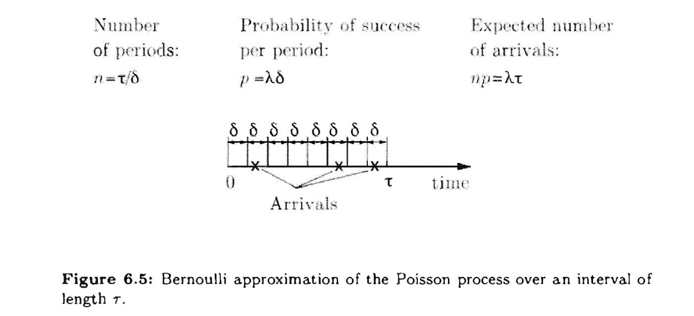
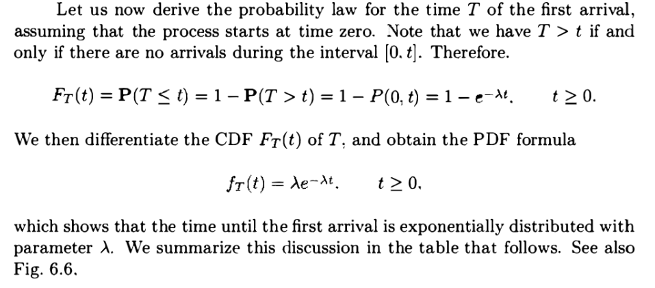
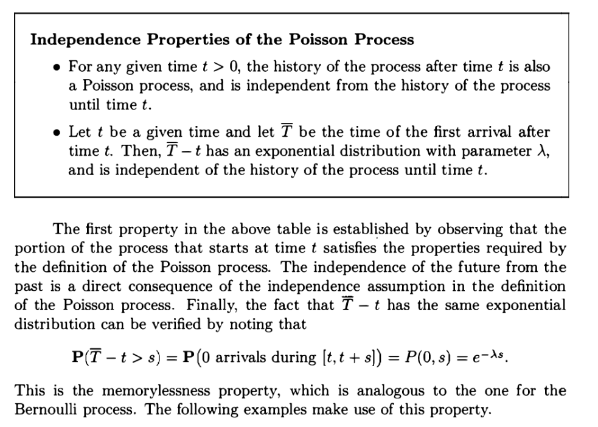
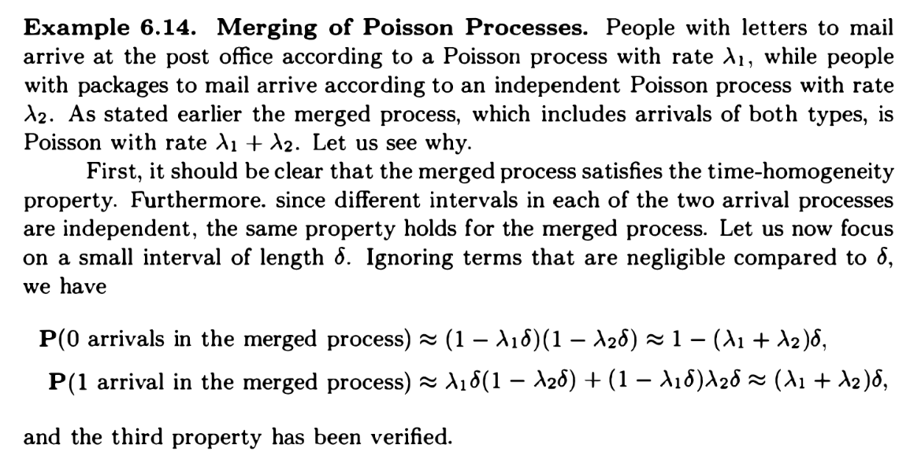
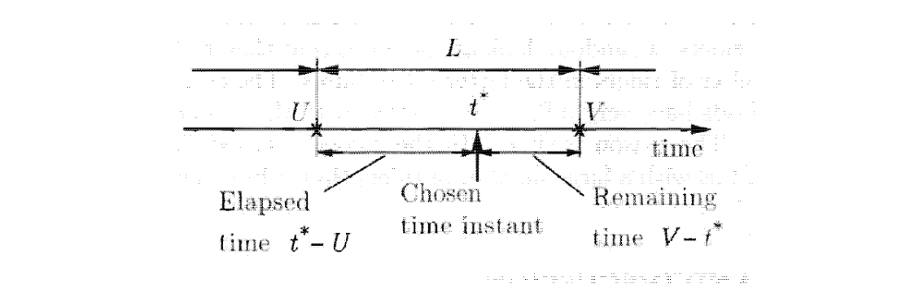

[L14 Slides.pdf](https://www.yuque.com/attachments/yuque/0/2022/pdf/12393765/1661849950905-ec227165-197d-4c7b-8a51-23931209e116.pdf)
[L15 Slides.pdf](https://www.yuque.com/attachments/yuque/0/2022/pdf/12393765/1661865855334-a3cef066-672c-4390-91ca-bdb157baf41b.pdf)

# 0 前言
> 泊松过程是伯努利过程在时间步长度趋近无穷小的一种分布序列。适用于没有常规方法将时间划分为离散时间小段的情况。
> 我们为什么需要一个连续时间小段的泊松过程呢？
> 让我们尝试对一个城市内发生的交通事故建立一个模型。首先我们可以把时间分成一分钟的时间小段，如果一个时间小段中至少发生过一次交通事故, 那么当前时间小段记录一次“`success`”。假设交通堵塞发生率是恒定的，那么每个时间段小段中的事故发生的概率应该是一样的。我们假设在不同的时间小段是独立的。那么由`success`组成的序列就是一个伯努利过程。而在现实生活中。在同一时间小段内完全可能发生两次或两次以上的事故，但伯努利变量不能记录时间小段中事故发生的确切数字而只能记录事件小段内事故发生与否。所以我们也不能计算出在某个时间小段中事故数量的期望。
> 解决这个困难的方法是**让每个时间小段的时间跨度尽可能的小**, 小到在一个事件小段内两起或两起以上事故发生的概率可以忽略不计。但具体应该有多小呢? 一秒?一毫秒? 此时我们应该类比我们在定义连续随机变量时的方法，让时间小段成为一个微元，然后将离散的伯努利过程转变为一个连续的伯努利过程，成为泊松过程。

# 1 标准定义与性质**⭐⭐⭐**
> 我们考虑一个在连续的`Interarrival Time`过程。这种情况下任何实数$t$都是可能的到达时间。我们定义
> $P (k, \tau)$ = $P(在长度为\tau的区间内正好有k次到达)$
> 假设这个概率对于相同长度$\tau$的时间小段都是相同的。
> 我们还引入一个正参数$\lambda$(`Arrival/unit time`)，称为`Arrival Rate`或`Intensity`(类比`Probability Density`, 需要乘以$\tau$(极小的区间长度微元)才能得到概率)。于是我们有了下面的定义:
> 
> 
> 实际上$P(k,\delta)=\begin{cases} 1-\lambda \delta,if\space k=0\\\lambda \delta, if \space k=1\\0,if\space k>1\end{cases}+O(\delta^2)$

**性质(a) Time Homogeneity**第一个性质说明，在任何时候到达都是等可能的, 即在任何时间间隔$\tau$到达的概率在统计学上是相同的。这和伯努利过程中每一个时间步上成功的概率都是$p$是相同的逻辑。
同时，这个概率满足性质: $\sum_{k}P(k,\tau)=1$($\tau$是固定的), 也就是在任意长度为$\tau$的时间段上，到达次数为$k=0,1,2,...$的所以可能性概率加起来是$1$。
**性质(b) 独立性**为了解释第二个性质，我们考虑一个特定的区间$[t, t']$,长度是$t' - t$。在该区间内到达$k$次的概率根据定义是$P(k, t' - t)$，假设我们现在已知除了这个时间间隔以外的到达情况的全部或部分信息。属性(b)表明这些信息对我了解在$[t'-t]$这个区间上到达几次没有提供任何帮助。换句话说, 在$[t, t']$期间到达$k$次的条件概率$P(k,t'-t|其他区间的信息)$和无条件概率$P(k, t' - t)$是一致的，这个性质类似于伯努利过程中不同时间步上的独立性。
**性质(c) Small Interval Probabilities**第三个属性非常关键。当$\tau$很小时，$o(\tau)$和$o_k(\tau)$与时间间隔$\tau$相比是无穷小量，因此可以忽略不计。这和我们在对$P(k,\tau)$的泰勒展开中的$O(\tau^2)$项是类似的。
对于极小的区间长度$\tau$上，到达率是$\lambda \tau+o_k(\tau)$, $o_k(\tau)$是忽略不计的，可以省略。因此，极小的区间长度$\tau$上，没有到达发生的概率大约是是$1-\lambda \tau$。另外，当$\tau$很小时, 两次或两次以上到达的概率与到达一次的概率$P(1,\tau)$相比也是忽略不计的。

# 2 泊松分布**⭐⭐⭐⭐⭐**
## 2.1 泊松随机变量**⭐⭐⭐**
> 
> 此时$\tau=1$, $\lambda$表示`Arrival/unit time`，推导详见`2.3`

**期望与方差**$E[Z]=\sum_{k=0}^{\infty}k\cdot \frac{e^{-\lambda}\cdot \lambda^k}{k!}=\sum_{k=1}^{\infty}\frac{e^{-\lambda}\cdot \lambda^{k+1}}{k!}$

## 2.2 泊松分布PMF推导**⭐⭐⭐⭐⭐**
> 
> 
> $\sum_{k}P(k,\tau)=1$, $E[N_{\tau}]=\lambda \tau=np, Var(N_{\tau})=\lambda \tau=np$
> 

**引理**假设我们有一个长度为**$\tau$**的时间段，并将其分割成为**$n=\frac{\tau}{\delta}$**个长度为**$\delta$**的时间段, **$\delta$**很小，使得任意长度为**$\delta$**的区间上大于两次**`**Arrivals**`**的概率都是零**。根据泊松过程的性质, 在每一段长度为$\delta$的时间段上，`Arrival`的概率是$\lambda \delta$, 没有`Arrival`的概率是$1-\lambda \delta$。且这些时间段上`Arrival`的事件彼此独立。
因此，泊松过程可以近似为一个伯努利过程，$\delta$越小，这个近似就越准确。

**PMF推导**$P(k,\tau)$: 在$\tau$的时间段中发生$k$次`Arrivals`的概率可以近似为$n=\frac{\tau}{\delta}$次伯努利实验中$k$次`success`的概率，且每次伯努利实验`success`的概率为$p=\lambda \delta=\frac{\lambda \tau}{n}$
然后我们固定$\tau$不动，使$\delta$的值无限趋近于零，此时$n\to \infty$, 而$np$的值仍然等于$\lambda \tau$。
有了以上的条件，我们可以写出泊松过程的`PMF`(通过`Binomial`来近似)：
$P(k \space arrivals)=(_k^n)(\frac{\lambda \tau}{n})^k\cdot (1-\frac{\lambda \tau}{n})^{n-k},\delta\to 0,n\to \infty,\lambda \tau=np$
根据$2.2$中的近似公式: $(1-\frac{\lambda \tau}{n})^{-k}\to 1,(1-\frac{\lambda \tau}{n})^n\to e^{-\lambda\tau}$
所以$(1-\frac{\lambda \tau}{n})^{n-k}\to 1\cdot e^{-\lambda\tau}=e^{-\lambda\tau}$
同时因为$(_k^n)(\frac{\lambda \tau}{n})^k=\frac{n!}{k!(n-k)!}\frac{(\lambda \tau)^k}{n^k}=\frac{n(n-1)\cdots(n-k+1)}{k!}\cdot\frac{(\lambda \tau)^k}{n^k}\newline=\frac{n}{n}\cdot \frac{(n-1)}{n}\cdots\frac{(n-k+1)}{n}\cdot\frac{(\lambda \tau)^k}{k!}$
因为$k$固定时，$n\to \infty$会导致$\frac{(n-1)}{n},\frac{(n-2)}{n},\cdots \frac{(n-k+1)}{n}$都会收敛于$1$。所以最终$P(k,\tau)=e^{-\lambda \tau}\frac{(\lambda \tau)^k}{k!},k=0,1,....$
注意到$e^{-\lambda \tau}$的泰勒展开会得到:
$\begin{cases}P(0,\tau)=e^{-\lambda \tau}=1-\lambda \tau +o(\tau)\\P(1,\tau)=\lambda \tau e^{-\lambda \tau}=\lambda \tau-\lambda^2\tau^2 +O(\tau^3)=\lambda \tau+o_1(\tau)\end{cases}$
根据上面的定义$E[N_\tau]=\lambda \tau, Var(N_\tau) = \lambda \tau$, 其中$N_\tau$是在$\tau$的时间段内到达的次数。
**期望与方差**$E[N_{\tau}]=np=\lambda \tau$, $Var[N_{\tau}]=np(1-p)\to np=\lambda \tau$(因为$1-p=1-\frac{\lambda \tau}{n}\to 1, if\space n\to \infty$)
方差和$\tau$成正比意味着我们的时间段选的越大，我们在这个时间段上记录到的`Arrival`的次数就越多。

## 2.3 经典算例**⭐⭐⭐**
### 2.3.1 Email Receiving**⭐**
> 
> 

**Key**首先求出参数$\lambda t=5\cdot \frac{1}{2}=2.5$
然后求概率$\begin{cases} P(0,\frac{1}{2})=\frac{(\lambda t)^0}{0!}e^{-\lambda t}=e^{-2.5}=0.08\\ P(1,\frac{1}{2})=\frac{(\lambda t)^1}{1!}e^{-\lambda t}=2.5\ \cdot e^{-2.5}=0.2\end{cases}$

### 2.3.2 Possion Fishing**⭐⭐⭐⭐⭐**
> 
> 

**(a)**可以理解为我在$2$小时内没有钓到鱼。
$P(0,2)=\frac{(0.6\cdot 2)^0}{0!}e^{-0.6\cdot 2}=e^{-0.6\cdot 2}$
也可以理解为我钓到的第一条鱼的时间大于两小时
$P(T_1>2)=\int_{2}^\infty p_{T_1}(t)dt$
**(b)**可以理解为我在前两个小时内没有钓到鱼，在$[2,5]$小时之间钓到了至少一条鱼, 有:$P_{N_T}(0,2)(1-P_{N_T}(0,3))$
也可以理解为我钓到的第一条鱼时的时间在$[2,5]$之间, 于是答案是$\int_2^5 f_{T_1}(t)dt$
**(c)**可以理解为我在两小时内钓到了至少两条鱼，所以对于钓到$k$条鱼的所有情况的概率相加：
$\sum_{k}^{\infty} P(k,2)=1-P(0,2)-P(1,2)$
也可以理解为我钓到第二条鱼的时候花了不到两小时：
$P(Y_2\leq 2)$
**(d)**$E[number\space of\space fish]=E[\#\space fish\space within\space 2\space hour]+E[\# \space fish\space beginning \space at \space hour\space 2]$
所以$E[number\space of\space fish]=(\lambda\tau)+(P(1,2)\cdot 0+P(0,2)\cdot 1)=0.6\cdot 2+P(0,2)$
**(e)**这就是一个无记忆性的应用，已经钓了$4$小时不能告诉我什么，于是期望就是我从零小时开始钓鱼的数量的期望，就是$\frac{1}{\lambda}=\frac{1}{0.6}$
**(f)**我们可以这样想。因为我们至少要钓两小时，所以总时间的期望就是$2$小时加上$2$小时之后才钓到第一条鱼($2$小时内没有钓到鱼)所花的时间的期望，用数学语言表示就是:
$2+P(0,2)\cdot E[\#fish \space after\space hour\space 2]=2+P(0,2)\cdot \frac{1}{0.6}$

# 3 Interarrival/Kth Arrival Time**⭐⭐⭐⭐⭐**
> 在伯努利过程中，我们已经介绍过`Interarrival Time`在离散时间段中的定义，现在我们在连续的时间微元段中探究`Interarrival Time`，并将介绍其和指数分布二项分布的关系。

## 3.1 Possion Approximation**⭐⭐**
### 3.1.1 指数分布
> 

### 3.1.2 二项分布
> 

**Proof**

## 3.2 Interarrival Time(Geo)
> 我们探究一个由泊松过程相关的随机变量称为`Interarrival Time`, 用$T_k$表示，表示第$k$次出现$1$和第$k-1$次出现$1$之间的时间间隔, 令$Y_k=T_1+T_2+...$, 表示泊松序列中第$k$个$1$出现时候的时间。
> 实际上，$T_k$**服从指数分布**。 当我们观测到第一个$1$的时候，记录下$T_1=some\space number$, 从$T_1+1$开始又是一个新的泊松过程序列，当观测到第二个$1$时，记录下$T_2$, $T_2$和$T_1$是独立的两个指数分布($T_1$序列的结果和不影响$T_2$序列的结果)，参数都是$\lambda$。推广到一般，$T_1,T_2,T_3,...$是独立，同分布的随机变量，描述着指数分布。
> 
> 

**推导过程**

## 3.3 Kth Arrival Time(Gamma/Erlang)
:::success
一个由`Interarrival Time`推得的随机变量是`Kth Arrival Time`, 标记为$Y_k$，下面是一些$Y_k$的性质。

`Erlang`分布通过一个多参数`PDF`来描述(`from wiki`):

下面我们给出两种`Erlang PDF`的推导：
:::
**方法一: Approximation**

**方法二: Two Step Procedure**
> 而这个`Erlang`分布其实就是$Gamma(k,\lambda)$(因为是$k$个独立的指数分布相加), 后续我们会看到。

# 4 独立性和无记忆性**⭐⭐⭐⭐⭐**
> 和伯努利分布的独立性和无记忆性类似，我们有:
> 
> **无记忆性体现在：**
> 1. 概率方面: $P(T>t+s|t~~has~~passed) = P(T>s)$
> 2. 期望方面: $E[T|t~~has~~passed] = t + E[T]$

# 5 和伯努利过程的比较**⭐⭐⭐**
> 
> 几何分布的就是离散化的指数分布，图像也差不多(左图为几何分布， 右图为指数分布):
> 
> 泊松分布是$p\to 0, n\to \infty$状态下的二项分布，图像如下（左图为泊松分布，右图为二项分布）:
> 

# 6 Splitting and Merging**⭐⭐⭐⭐⭐**
## 6.1 Merging
### 6.1.1 独立泊松随机变量的加和
> 两个泊松变量相加仍然是泊松变量
> 
> 

### 6.1.2 两个泊松过程的叠加
> 
> 两个独立的泊松过程，参数分别是$\lambda_1$和$\lambda_2$
> 将这两个泊松过程叠加，得到一个参数为`Arrival Rate`是$\lambda_1+\lambda_2$的泊松过程, 原因如下:
> **首先我们需要将泊松过程分割成一个个长度很小的，长度为**$\delta$**的段，然后研究每一段上的**`**merged possion process**`（实际上是伯努利分布）, 而根据泊松分布的性质: 一个长度为$\delta$的段上最多只能有一个事件发生。所以任何同时发生的概率（也就是带有$o(\delta^2)$的项都会趋近于零，可以忽略不计）。于是对于两个泊松过程叠加的情况:

|  | **Green flashes** | **Green doesn't flash** |
| --- | --- | --- |
| **Red flashes** | $\lambda_1\delta\lambda_2\delta$ | $\lambda_1\delta(1-\lambda_2\delta)$ |
| **Red doesn't flash** | $(1-\lambda_1\delta)\lambda_2\delta$ | $(1-\lambda_1\delta)(1-\lambda_2\delta)$ |

> 当$\delta \to 0$的时候, 我们保留$\delta$的一次项，丢掉$o(\delta^2)$的所有项, 表中的概率值变为:

|  | **Green flashes** | **Green doesn't flash** |
| --- | --- | --- |
| **Red flashes** | $0$ | $\lambda_1\delta$ |
| **Red doesn't flash** | $\lambda_2\delta$ | $1-(\lambda_1+\lambda_2)\delta$ |

> 所以`Arrival Rate`就是$\lambda_1+\lambda_2$(对角线)。
> 类似的我们可以推广到多个泊松过程相加的联合泊松过程。
> 假设我们有三个独立的泊松过程，参数分别为$\lambda_1,\lambda_2,\lambda_3$, 于是我们按照上面的方法，首先计算在某一小段上事件不发生的概率，也就是$(1-\lambda_1 \delta)(1-\lambda_2 \delta)(1-\lambda_3 \delta)=1-(\lambda_1+\lambda_2+\lambda_3)\delta +o(\delta)$, $o(\delta )$可以省略。于是在每一个长度为$\delta$的区间上没有`Arrival`出现的概率就是$1-(\lambda_1+\lambda_2+\lambda_3)\delta$。而对于出现`Arrival`的概率，我们知道因为$\delta \to 0$,我们保留$\delta$的一次项。假设:
> 事件$A$: 灯泡$A$`Arrival`了
> 事件$B$: 灯泡$B$`Arrival`了
> 事件$C$: 灯泡$C$`Arrival`了
> 于是我们要求的实际上是（三个灯泡里至少有一个亮的概率）$P(A\cup B\cup C)=P(A)+P(B)+P(C)-P(AB)-P(BC)-P(AC)+P(ABC)=\lambda_1\delta+\lambda_2\delta+\lambda_3\delta-\lambda_1\lambda_2\delta^2-\lambda_2\lambda_3\delta^2-\lambda_1\lambda_3\delta^2+\lambda_1\delta\lambda_2\delta\lambda_3\delta\newline=(\lambda_1+\lambda_2+\lambda_3)\delta+o(\delta)\approx (\lambda_1+\lambda_2+\lambda_3)\delta$
> 于是这个联合泊松分布的参数就是$(\lambda_1+\lambda_2+\lambda_3)$

 

## 6.2 Splitting(Thinning out)
### Definition
> 泊松过程的分解主要用于探究`Arrival`是从何而来的问题。
> 
> 

### 
### Examples
> 

## 6.3 Competing Exponentials
### 6.3.1 Two Light Bulbs
> 

### 6.3.2 Three Light Bulbs
> 
> 假设三个灯泡的寿命是$X,Y,Z$, 三个独立的指数分布的变量，我们实际上要求$E[max\{X,Y,Z\}]$, 如下图所示:
> 

**Key**根据图中的描述，我们要求的是$E[Z]$, 但是直接求需要运用大量积分公式和全概率公式，非常繁琐，我们考虑利用泊松分布的独立性和`Merged`泊松分布来解题。
首先$E[Z]$可以看成三段$Z_1,Z_2,Z_3$, 如下图中的标号:

首先是第一段，我们将三个泊松过程合并(表示至少有一个灯泡烧毁了的最早时间), 这是一个指数分布，于是我们有$E[Z_1]=\frac{1}{\lambda+\lambda+\lambda}=\frac{1}{3\lambda}$。
然后是第二段，由于第一个灯泡已经烧毁，且根据泊松分布的时间段之间的独立性，于是我们只关心第二个灯泡和第三个灯泡合并而成的泊松过程，直到有一个灯泡烧毁。这也是一个指数分布，$E[Z_2]=\frac{1}{\lambda+\lambda}=\frac{1}{2\lambda}$
最后一段，由于前两个灯泡已经烧毁，我们只关心第三个灯泡的泊松过程，这也是一个指数分布，于是$E[Z_3]=\frac{1}{\lambda}$。
所以$E[Z]=E[Z_1]+E[Z_2]+E[Z_3]=\frac{1}{3\lambda} +\frac{1}{2\lambda}+\frac{1}{\lambda}$
 

### 6.3.3 Generalized Problems
> 

**Solution (a)**
**Solution (b)**

# 7 Random Incidence**⭐⭐⭐⭐⭐**
## 7.1 前言
> `Random Incidence`究竟意味着什么呢？
> 
> 这是`Random Incidence`探究的问题，也就是我任意选定一个时间$t^*$, 然后探究所有包括了这个$t^*$时刻的`Interarrival Interval`$L$的分布情况。
> 这个问题和我们之前在第三小节中探究的`Interarrival Interval`的$L$的分布情况很像, 但是有一些细微的差别。
> - `Interarrival Time`意味着我选定某个公交车到达的时刻$t^*$, 然后测量从$t^*$开始的直到下一次公交车到站中间间隔的一段时间$L$, 这个$L$的期望是什么。这就是一个指数分布的问题。换句话说，这个问题的研究对象是所有`Interval Length`本身。
> - 但是`Random Incidence`意味着我选定了任意一个时间$t^*$(不一定要是公交车到达的时刻)，然后探究所有包括了这个$t^*$时刻的`Interarrival Interval`$L$的分布情况。所以$L$会有很多种可能性，$L$的分布自然也不是一个指数分布能够概括的。换句话说，这个问题研究的对象是一个包含$t^*$的所有`Interval Length`。也可以说我是从$t^*$的视角出发去探究他的归属问题。
> 
下文我们将分析`Random Incidence`背景下的$L$满足什么分布的问题。

## 7.2 解读**⭐⭐⭐⭐**
> 泊松过程将时间轴划分为一系列`Interarrival`时间段; 每个`Interarrival Time Interval`从某一个到达开始，直到到下一次`Arrival`结束。我们已经知道这些`Interarrival Time Interval`的区间长度是参数为$\lambda$的独立指数分布的随机变量，其中$\lambda$是整个泊松过程的`Arrival Rate`。更准确地说，对于每一个$k$，第$k$个`Interarrival Time Interval `的长度是指数分布。在这个小节中，我们将从不同的角度来看待`Interarrival Intervals`。
> 让我们固定一个时刻$t^*$，假设有一个`Interarrival Interval`的长度为$L$且包含时刻$t^*$。我们可以结合实际来想，假设有一个人来到公交车站等车,  此时距离上一班公交走后已经过了$t^*$时间。这个人的`Arrival`是常被称为“`Random Incidence`”，但其实这个术语有误导性: $t^*$只是一个确定的时刻，而不是一个随机变量。
> 现在我们假设$t^*$比整个公交车到站的泊松过程的开始时间要大得多。这样我们就可以相当确定在此之前已经有人来过公交车站了， 且$L$是可以被定义的， 如下图所示。
> 
> **我们可能会认为**$L$**服从指数分布, 但实际上这个论断是错的，实际上**$L$**服从二阶**`**Erlang**`**分布, 我们会给出论证过程。**
> 这就是所谓的`Random Incidence Phenomenon or Paradox`。
> 下面我们开始论证

**论证Erlang PDF**
设$[U, V]$为的包含$t^*$时刻的`Interarrival Interval`使得$L = U - V$，$U$是$t^*$时刻之前的一次公交车到达的时刻，$V$是$t^*$时刻之后的一次公交车到达的时刻。 于是，我们可以把$L$分成两部分$L = (t^* - U) + (V - t^*)$，其中$t^* - U$是自上次公交车到达以来经过的时间，$V - t^*$是距离下一次公交车到来剩余的时间。根据泊松分布的独立性，$t^* - U$和$V - t^*$这两个随机变量是独立的。同时由泊松分布的无记忆性，泊松过程在时刻$t^*$开始就好像是从零时刻开始一样。因此随机变量$V - t^*$是一个参数为$\lambda$的指数分布, 同时随机变量$t^* - U$也是参数为$\lambda$的指数分布(因为泊松过程正向看或者反向看都是泊松过程)。于是我们有:

## 7.3 Renewal Processes**⭐⭐⭐**
> `Renewal Processes`作为`Random Incidence`问题的延伸，探究的是：假定我现在的`Interarrval Interval Length`有$L=5$或者$L=10$两种，出现的概率分别为$p$和$1-p$(下图中$p=\frac{2}{3}$, 注意不是$\frac{1}{2}$, 因为$L=10$在整个泊松过程中占有的区间长度更大，下图中的$x$轴上会有$\frac{2}{3}$的区域属于$L=10$的`Interval`, 有$\frac{1}{3}$的区域属于$L=5$的`Interval`, 所以实际上$L=5$和$L=10$出现的概率不是一致的，是有偏差的。)
> 
> 那么我选定任意时刻$t^*$，落入不同的$L$的期望是多少？
> 
> $E[T]=\frac{2}{3}\cdot 10+\frac{1}{3}\cdot 5=\frac{25}{3}$而不是$E[T]=\frac{1}{2}\cdot(5+10)=7.5$

## 7.4 总结**⭐⭐⭐⭐⭐**
> 综上，我们在探究`Interarrival Time`相关的问题的时候，我们一定要弄清楚问题背景，到底是探究像第三小节中的`Interarrival Time`还是本小节中的`Random Incidence`问题。
> 所以当我们遇到以下陈述的时候，要意识到这是两个不同的问题:
> 1. 一个家庭平均有$4$个人。研究对象是家庭整体。`Pick family at random`
> 2. 平均上一个人会生活在有$6$个人的家庭。研究对象是一个特定的人。`Pick a person at random` 
> 
另一个能够说明研究对象不同导致的结果不同的例子是:
> 我随机采访一个人，问他城市公交拥挤吗？这个人可能会说是的。因为他可能坐的是这个城市最拥挤的公交车。但是其他的空的公交车上的人我们没有去采访他们，这就会导致不同的实验结果。所以我们一定要特别注意`Sampling Procedure`的把控。

# 8 Packet Routing
> [!example] Fa21 HW3 P3
> 

