[L16 Slides.pdf](https://www.yuque.com/attachments/yuque/0/2022/pdf/12393765/1661916287575-0d2abfc6-104a-4bba-b1f9-91482487ac97.pdf)
# 0 前言
> 
>  我们会探究一种模型，他将过去的影响总结成一个`State`, 且这个`State`根据给定的概率随时间变化。本章我们将这个模型限制在只能取有限数量的状态，且状态转移的概率和时间是独立的。我们想要探究`State Value`序列的概率性质。
> 本章描述的模型类型的应用范围非常广的。它包括几乎所有包含不确定性的动力系统，只要系统的**状态**被适当地定义。这样的系统出现在各种各样的领域，例如通信，自动控制，信号处理。制造、经济学和行为研究。

# 1 Discrete Time Markov Chain
## 1.0 前言
> 我们从离散伯努利分布出发来引出马尔科夫链的概念，假设我们有如下的伯努利序列:
> 
> 则我们有如下的状态和其转移概率。
> 
> 下面我们将正式介绍马尔科夫过程。

## 1.1 标准定义
> 
> 随机变量$X_n$描述了马尔科夫状态，样本空间是离散的$S=\{1,\cdots m\}$($m$是正整数), 称为状态空间。马尔科夫链由状态转移概率$p_{ij}$组成，表示从状态$i$变成状态$j$的概率。

## 1.2 Markov Property**⭐⭐⭐⭐⭐**
:::info
马尔科夫链的一个重要性质/假设就是:

这个性质说的是，我知道了在$n$时刻我在状态$i$, 那么在$n$时刻之前我的状态序列对我在$n+1$时刻我的状态没有任何关系。也就是我不关心我是怎么在$n$时刻到达状态$i$的。
:::

## 1.3 n-step transition probability**⭐⭐⭐**
### 1.3.1 Definition
:::info
我们知道，在马尔科夫过程进行状态转移$i\to j$的过程中，有可能我们经历了一步，也可能经历了很多步。现在我们定义:
使用$n$步从状态$i$到状态$j$的概率是: $P_{ij}^{(n)}=P\{X_{m+n}=j|X_m=i\}$
:::

### 1.3.2 Recursion Formula
> 那么我们怎么计算这个`n-step transition probability`呢?
> 因为从状态$i$出发所能到达的状态$j$是可以列举出来的，所以$\sum_{j}P_{ij}^{(n)}=\sum_{j}P(X_n=j|X_0=i)=1$(因为$P$是一个合法的概率密度函数)。
> $n-step\space transition\space probability$探究的是从某个状态$i$开始, **在**$n$**次状态转移之后**的状态为$j$的概率。
> 我们可以从第$n$次状态转移开始反向考虑建立递归关系，如下图所示:
> 
> 意思就是我经过了$n-1$步有可能转移到$1,2,...,m$这$m$种状态，用$k$表示具体转移到的某种状态，其概率是$P_{ik}^{(n-1)}$, 然后从第$n-1$步由状态$k$转移到第$n$步的状态$j$的概率是$p_{kj}$, 根据乘积法则相乘得到经过$n$步状态转移从$i\to k\to j$的转移概率， 然后将所有的$\to k\to j$的转移概率相加得到$r_{ij}(n)$, 就有了下面的递归公式:
> 
> 上面的推导是基于`Initial State`是状态$i$的情况，那么如果我们考虑所有的初始状态，则有:
> 
> 根据全概率公式: $P(X_n=j)=\sum_{i=1}^m P(X_n=j|X_0=i)P(X_0=i)=\sum_{i=1}^m P(X_0=i)r_{ij}(n)$。

### 1.3.3 Chapman-Kolmogorov Equations
:::info

:::
**Proof**

### 1.3.4 Probability of a Path⭐⭐⭐
> 
> 总的来说我们只要沿着`Path`将沿途的所有状态转移概率相乘即可。
> 
> $P(X_1=2,X_2=6,X_3=7|X_0=1)=p_{12}p_{26}p_{67}$
> $P(X_4=7|X_0=2)=p_{26}p_{67}p_{76}p_{67}+p_{26}p_{66}p_{66}p_{67}+p_{21}p_{12}p_{26}p_{67}$
> 但是如果$X_n$中的$n$很大的话，用这种方式会得到非常长的概率连乘，此时我们会转而使用$1.3$中的`Recursion Formula`来求解

## 1.4 Matrix Perspective**⭐⭐⭐⭐⭐**
### Markov Matrix
> 上面的推导略显繁琐，我们在矩阵的框架下进行阐述。
> 
> 其中$P_{ij}=P(X_{m+1}=j|X_{m}=i)$, 也就是`One-step transition probability`。
> 令$P=\begin{bmatrix} P_{11}&P_{12}&\cdots &P_{1m}\\P_{21}&P_{22}&\cdots&P_{2m}\\\vdots&\vdots&\ddots&\vdots\\P_{m1}&P_{n2}&\cdots&P_{mm}\end{bmatrix}$, 则我们想证明$P^n=\begin{bmatrix} P_{11}^{(n)}&P_{12}^{(n)}&\cdots &P_{1m}^{(n)}\\P_{21}^{(n)}&P_{22}^{(n)}&\cdots&P_{2m}^{(n)}\\\vdots&\vdots&\ddots&\vdots\\P_{m1}^{(n)}&P_{m2}^{(n)}&\cdots&P_{mm}^{(n)}\end{bmatrix}$
> 我们使用数学归纳法: 
> 1. **Base Step: **$n=1$, 因为$P_{ij}^{(1)}=P_{ij}$by definition, 表示`1-step transition probability`
> 2. **Inductive Hypothesis: **假设$n=k\geq 1$, $P^k=\begin{bmatrix} P_{11}^{(k)}&P_{22}^{(k)}&\cdots &P_{1m}^{(k)}\\P_{21}^{(k)}&P_{22}^{(k)}&\cdots&P_{2m}^{(k)}\\\vdots&\vdots&\ddots&\vdots\\P_{m1}^{(k)}&P_{m2}^{(k)}&\cdots&P_{mm}^{(k)}\end{bmatrix}$成立。
> 3. **Inductive Step:** 对于$P^{k+1}$中的一项$P_{ij}^{(k+1)}$, 根据`Chapman-Kolmogorov Equation`可知: $P_{ij}^{(k+1)}=\sum_{k=1}^mP_{ik}^{(k)}P_{kj}$, 而$\sum_{k=1}^mP_{ik}^{(k)}P_{kj}$表示的正是$P^k$中的第$i$行和$P$中第$j$列向量的乘积。
> 
所以$\begin{aligned}P^{k+1}=P^kP&=\begin{bmatrix} P_{11}^{(k)}&P_{22}^{(k)}&\cdots &P_{1m}^{(k)}\\P_{21}^{(k)}&P_{22}^{(k)}&\cdots&P_{2m}^{(k)}\\\vdots&\vdots&\ddots&\vdots\\P_{m1}^{(k)}&P_{m2}^{(k)}&\cdots&P_{mm}^{(k)}\end{bmatrix}\begin{bmatrix} P_{11}&P_{22}&\cdots &P_{1m}\\P_{21}&P_{22}&\cdots&P_{2m}\\\vdots&\vdots&\ddots&\vdots\\P_{m1}&P_{n2}&\cdots&P_{mm}\end{bmatrix}\\&=\begin{bmatrix} P_{11}^{(k+1)}&P_{22}^{(k+1)}&\cdots &P_{1m}^{(k+1)}\\P_{21}^{(k+1)}&P_{22}^{(k+1)}&\cdots&P_{2m}^{(k+1)}\\\vdots&\vdots&\ddots&\vdots\\P_{m1}^{(k+1)}&P_{m2}^{(k+1)}&\cdots&P_{mm}^{(k+1)}\end{bmatrix}\end{aligned}$, 成立。
> 证毕。

### State Probability Distribution
> 假设我们有一个初始状态向量$\vec{\pi}_0=\begin{bmatrix} \pi_0(1)\\\pi_0(2)\\\vdots\\\pi_0(m)\end{bmatrix}\in \mathbb{R}^{m}$，状态空间是$\{1,2,\cdots, m\}$(也就是有$m$个状态)。
> 其中$\sum_{k=1}^m\pi_0(k)=1$, $\pi_0(k)$表示在`Time 0`的时候我们位于状态$k$的概率大小。
> 对于任意时刻$k$, $\vec{\pi}_k=\begin{bmatrix} \pi_k(1)\\\pi_k(2)\\\vdots\\\pi_k(m)\end{bmatrix}\in \mathbb{R}^{m}$, $\pi_k(i)=P(X_{k}=i)$, 表示在第$k$个时间步到达State k 的概率。
> 根据全概率公式我们有:
> $\begin{aligned}\pi_k(j)&=\sum_{i=1}^mP(X_k=j|X_{k-1}=i)P(X_{k-1}=i)\\&=\sum_{i=1}^mP(X_k=j|X_{k-1}=i)\pi_{k-1}(i)\\&=\sum_{i=1}^m\pi_{k-1}(i)P_{ij}\end{aligned}$
> 所以:
> $\vec{\pi}_{k+1}^{\top}=\pi_{k}^{\top}P$
> 所以我们有:
> $\pi_n^{\top}=\pi_0^{\top}P^n,n\geq 0$

## 1.5 Classification of States
### 1.5.1 Accessible States
> 状态$j$是`Accessible from`状态$i$如果$\exists n,P_{ij}^{(n)}>0$。
> 更详细的，there is a possible state sequence $i,i_1,\cdots, i_{n-1},j$, that starts at $i$and ends at $j$, in which the transitions $(i,i_1),(i_1.i_2),\cdots, (i_{n-2},i_{n-1}), (i_{n-1}, j)$all have positive probability. 

### 1.5.2 Recurrent/Transient States⭐⭐⭐⭐⭐
#### Definition
> 主要有两类: `Recurrent`和`Transient`
> 
> 总的来说，`recurrent class`就是一个`class`进去了就出不去了。

#### Examples
> 

#### Markov Decomposition
> 
> 上图中，状态$5,6,7,8$都是`Recurrent`的。
> 状态$1,2,3,4$都是`Transient`的(因为$1\to 5$或者$2\to 6$总是有可能会发生，导致我们永远无法回到$1,2,3,4$)。
> 于是我们可以将这个马尔科夫过程中的状态分成两类:
> 蓝色的部分是`Recurrent Class`, 红色的部分是`Transient Class`, 一旦马尔科夫过程进入了`Recurrent Class`, 就卡在里面出不去了，和其他的`Class`之间就没有交流的通道了。
> 
> 所以如果我们从一个`Recurrent State`开始马尔科夫过程，我们在$n\to \infty$步之后会收敛在`Recurrent Class`中。而如果我们从一个`Transient State`开始马尔科夫过程，我们不会收敛在`Transient Class`中。这也进一步验证了`Initial State`的选取确实会对马尔科夫的收敛性与否产生影响。
> 这种分类被称为`Markov Decomposition`:
> 
> 
> 我们再看一个例子:
> 

### 1.5.3 Periodic Class⭐⭐
> `Periodicity`描述了一个`Reucurrent Class`内部的马尔科夫过程的状态转移方式。
> 对于一个`Recurrent Class`来说：
> 
> $d=1\space or\space 2$**的情况:**
> 
> $d=3$**的情况**
> 
> 再看一个特殊的例子，对于下列的`Recurrent Class`:
> 
> 红色的为$S_1$,白色的是$S_2$, $S_1$和$S_2$是`Disjoint`的， 所以这个`Recurrent Class`是周期性的。

**更严格的Periodicity的定义**

# 2 State Stability
[L17 Slides.pdf](https://www.yuque.com/attachments/yuque/0/2022/pdf/12393765/1661923129939-79a4a155-e893-4388-84ae-617dc3d4d127.pdf)

## 2.1 Steady State Probability**⭐⭐⭐⭐⭐**
### 2.1.1 Definition
> 本小节我们将探究马尔科夫过程的一个重要性质，也就是$\lim_{n\to \infty}P_{ij}^{(n)}=constant,\forall i,given\space j$所代表的转移概率收敛性。
> 本质上说，我们想要找到一个状态$j$, 使得无论初始状态$i$是什么，$\lim_{n\to \infty}P_{ij}^{(n)}$等于相同的值。
> **定义**`**Steady State Probability**`**为:**
> $\pi(i)=P(X_n=i), n\to \infty$
> 写成向量的形式就是:
> $\pi=\begin{bmatrix}\pi(1)&\pi(2)&\cdots&\pi(m)\end{bmatrix}$
> `**Steady State Probability**`**的一个重要性质就是:**
> 如果对于状态$j$, 有`Steady State Probability`$\pi_j$存在，则$\lim_{n\to \infty}(X_n=j|X_0=i)=\pi_j$, 因为$\pi_j$和初始状态无关，所以$\lim_{n\to \infty}P(X_n=j|X_0=i)=\lim_{n\to \infty}P(X_n=j)=\pi_j$($X_n$和$X_0$在$n\to \infty$的时候是独立的)。也就是最终的稳态和初始状态是什么是无关的。
> **如果一个马尔科夫链含有两个**`**Recurrent Classes**`，很明显$\lim_{n\to\infty}P_{ij}^{(n)}$的极限值和初始状态是有关的，比如下图中，初始状态是$5$ 那么$\pi_6=0$, 初始状态为$6$, 则$\pi_6\neq 0$。
> 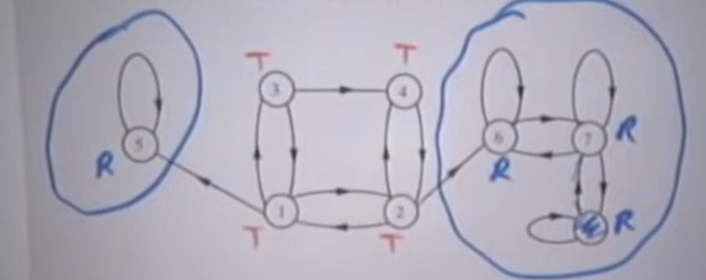
> 所以我们会研究那些**仅仅由一个**`**Recurrent Class**`**和其他的一些**`**Transient States**`**构成的马尔科夫链(1)**。但即使只有一个`Recurrent Class`，$\lim_{n\to \infty}r_{ij}(n)$也可能不收敛，比如`1.6`小节中的第一个例子, 我们有:
> 
> 原因是这个`Recurrent Class`是`Periodic`的，所以此时的$\lim_{n\to\infty}r_{ij}(n)$会在$0$和$1$之间震荡。所以我们需要`**Recurrent Class**`**都是**`**Aperiodic**`**的(2)。**
> 所以如果我们满足上述两个条件, 即：
> 1. **仅由一个**`**Recurrent Class**`**构成。**
> 2. **这个**`**Recurrent Class**`**是**`**Aperiodic**`**的。**
> 
则我们可以求`Steady-State Prbability`:
> 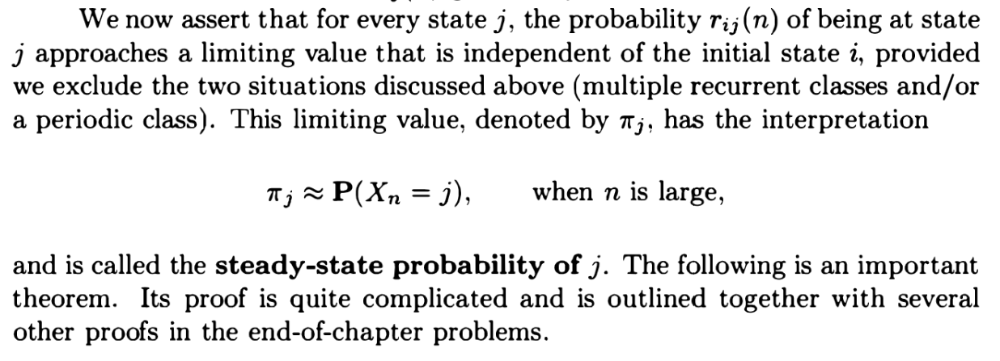
> 所以下文要介绍的`Steady State Convergence Theorem`主要回答了上面的问题:
> 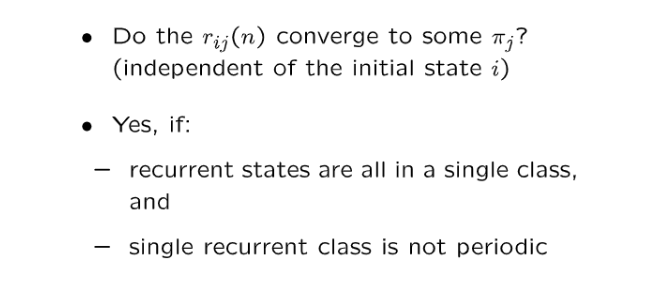

### 2.1.2 Method 1 - Balance Equation
> 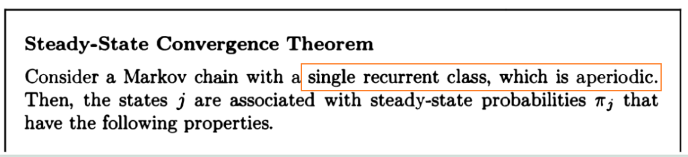
> 我们知道一个马尔可夫过程的`State Transition Matrix`是:
> $P=\begin{bmatrix} P_{11}&P_{22}&\cdots &P_{1m}\\P_{21}&P_{22}&\cdots&P_{2m}\\\vdots&\vdots&\ddots&\vdots\\P_{m1}&P_{n2}&\cdots&P_{mm}\end{bmatrix}$,$P^n=\begin{bmatrix} P_{11}^{(n)}&P_{22}^{(n)}&\cdots &P_{1m}^{(n)}\\P_{21}^{(n)}&P_{22}^{(n)}&\cdots&P_{2m}^{(n)}\\\vdots&\vdots&\ddots&\vdots\\P_{m1}^{(n)}&P_{m2}^{(n)}&\cdots&P_{mm}^{(n)}\end{bmatrix}$
> **Definition: **A distribution $\pi$ is invariant for the transition probability matrix $P$ if it satisfies the following balance equations:
> $\begin{cases}\pi=\pi P\\\sum_{i=1}^m \pi_m=1\end{cases}$
> 这个例子中，我们有:
> 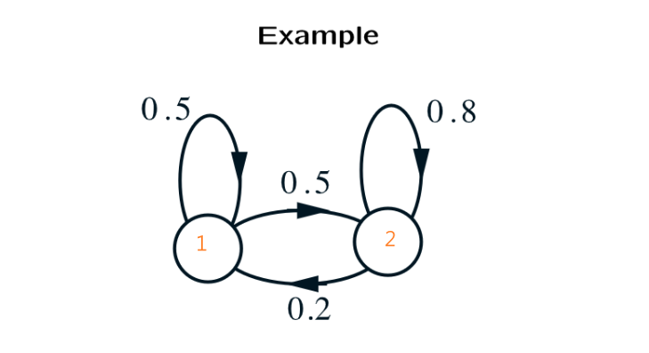
> $P=\begin{bmatrix} 0.5 &0.5\\0.2&0.8\end{bmatrix}$, 使用上面的公式可得:
> $\begin{cases} \pi(1)=0.5\pi(1)+0.2\pi(2)\\\pi(2)=0.5\pi(1)+0.8\pi(2)\\\pi(1)+\pi(2)=1\end{cases}$
> 可以计算出$\pi(1)=\frac{2}{7}, \pi(2)=\frac{5}{7}$，得到$\lim_{n\to \infty}P(X_n=1)=\frac{2}{7}$, $\lim_{n\to \infty}P(X_n=2)=\frac{5}{7}$, 和初始状态无关。

### 2.1.3 Method 2 - Matrix Limit
> 我们也可以通过求状态转移矩阵$P^n$并观察每一列的值是否在$n\to \infty$时全部相同或接近，比如下面的例子:
> 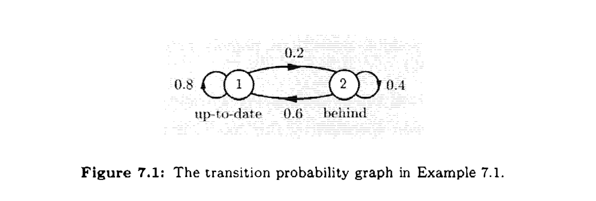
> 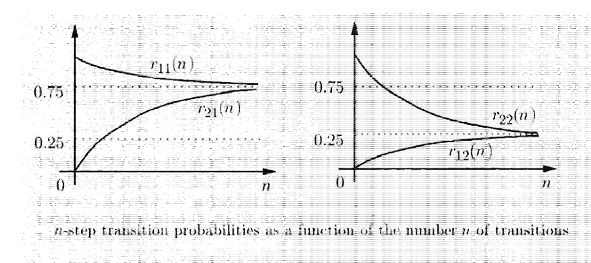
> 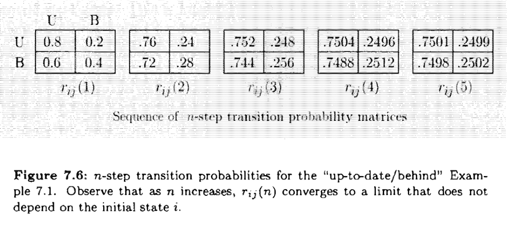
> 我们有$\lim_{\to\infty} P(X_n=1)=0.75, \lim_{n\to \infty}P(X_n=2)=0.25$，即$\pi(1)=0.75, \pi(2)=0.25$。

:::warning
再看下面的例子:
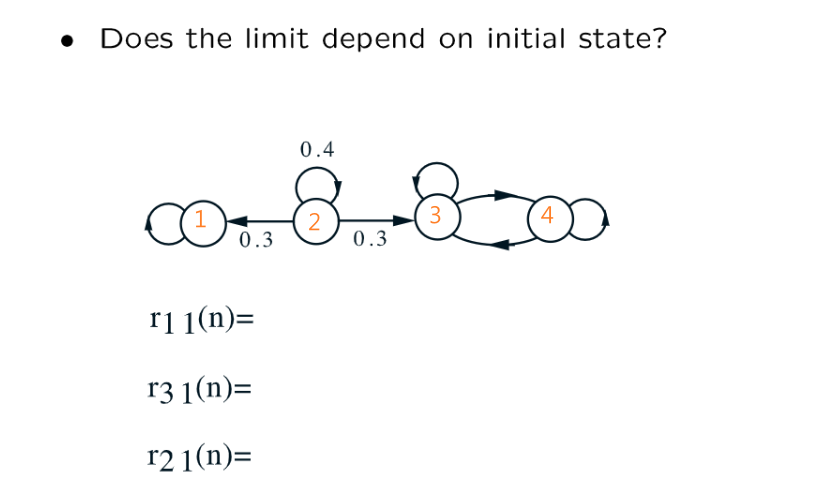

- $P_{11}^{(n)}=1,\forall n$, 所以如果我们从状态$1$开始，那么就会一直在状态$1$, $P_{11}^{(n)}$收敛于$1$
- $P_{31}^{(n)}=0,\forall n$, 所以如果我们从状态$3$开始，那么就会一直在状态$3$和$4$之间转移，永远不可能到达状态$1$, $r_{31}(n)$收敛于$0$
- $P_{21}^{(n)}=\frac{1}{2},n\to \infty$， 如果我们从状态$2$开始，那么有一半的可能到达状态$1$, 即$P_{21}^{(n)}$收敛于$\frac{1}{2}$

可见，对于状态$1$来说，$\lim_{n\to \infty}P_{k1}^{(n)}$在不同的初始状态$k$的选取下得到的极限值也是不同的。这说明极限不是独立于初始状态选取的，所以这个马尔科夫过程也不是我们想要的收敛。
**下面是**`Textbook`**上的一个例子:**
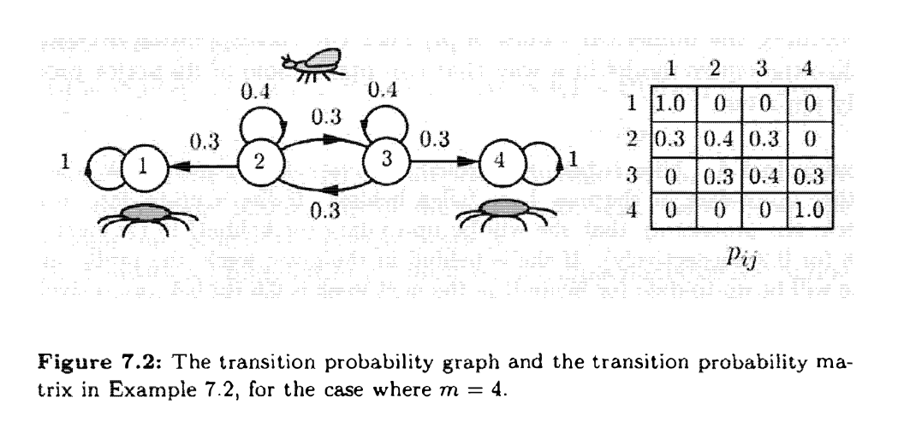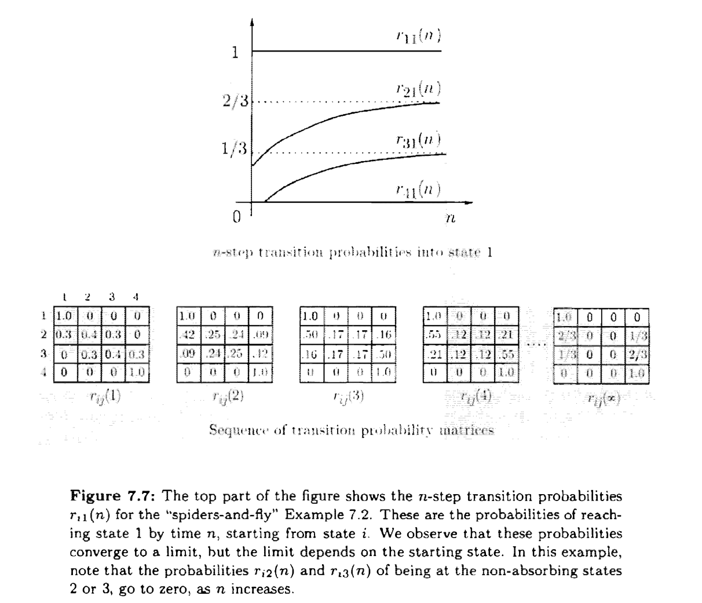
:::
> 观察下面的马尔科夫链:
> 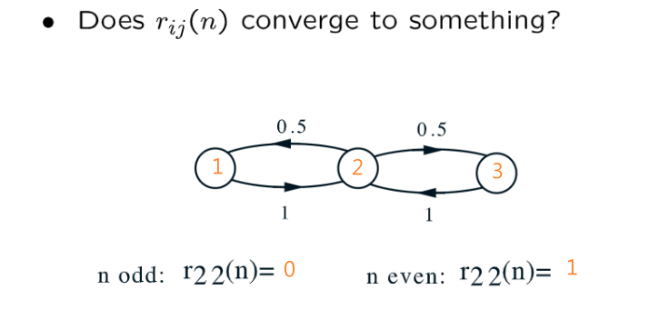
> 从$2$状态开始，经过偶数步转移之后一定会落在$2$, 所以$P_{22}^{(2k)}=1$, 经过奇数步转移之后一定会落在$1$或者$3$, 所以$P_{22}^{(2k+1)}=0, k\to \infty$, 所以我们在这个马尔科夫过程推进时，$P_{22}^{(n)}$这个转移概率会在$0$和$1$之间来回波动，而不会收敛。
> **所以并不是所有的马尔科夫过程都会收敛。**

# 3 Irreducibility
## Fraction of Time in States
> 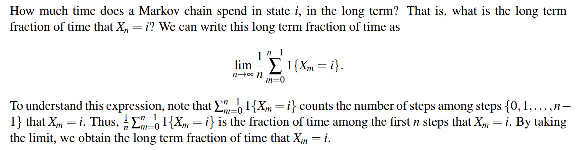

## Definition
> 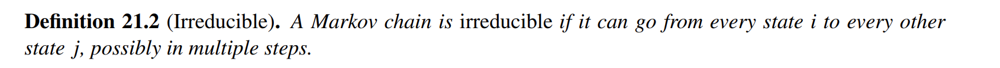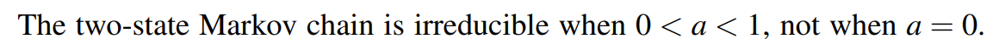

## Theorem
> 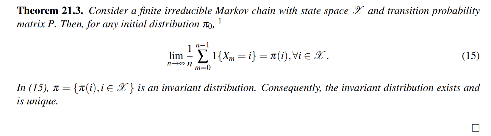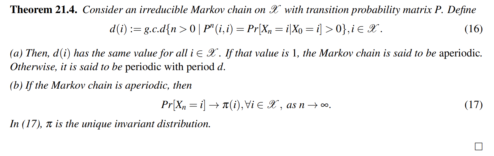

## 2.2 Frequencies Perspective
> 我们可以在频率的视角下理解`Balance Equation`
> 1. 

> 
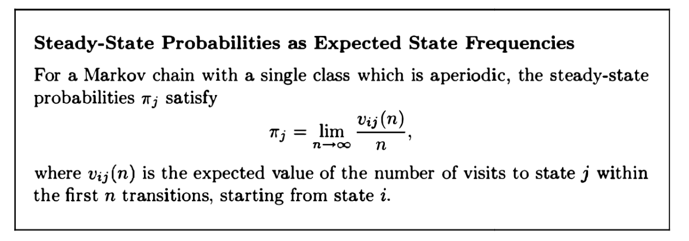
> 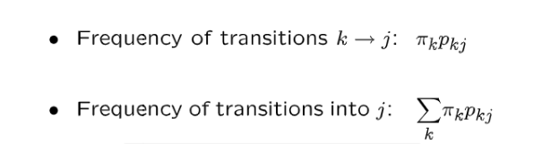
> 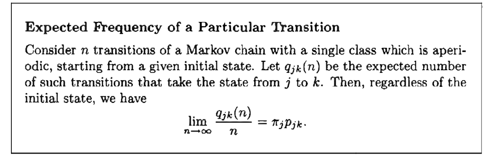
> 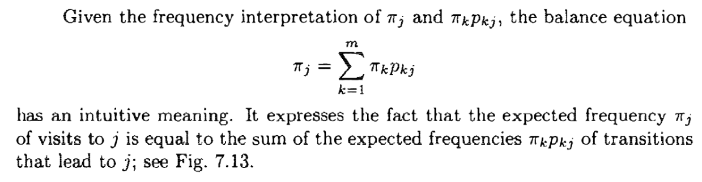
> 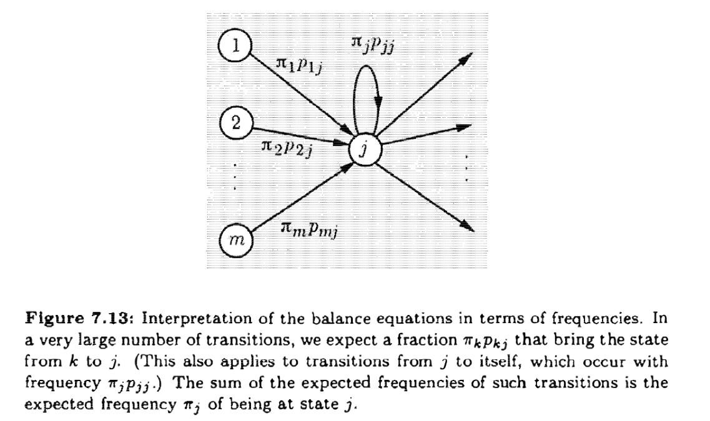

### 2.2.2 收敛概率的应用**⭐⭐⭐⭐⭐**
> 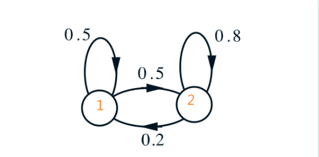
> 对于这个马尔科夫过程我们可以探究以下的问题:
> 1. 使用`Steady State Probability`估算概率
>    - 假设我们从状态$1$开始, **我们要计算**$P(X_1=1,X_{100}=1|X_0=1)$, 则根据条件概率公式:$P(X_1=1,X_{100}=1|X_0=1)\newline=P(X_{100}=1|X_1=1,X_0=0)P(X_1=1|X_0=1)$, 而根据`Markov Property`$P(X_{100}=1|X_1=1,X_0=1)=P(X_{100}=1|X_1=1)$，所以$P(X_1=1,X_{100}=1|X_0=1)=P(X_{100}=1|X_1=1)P(X_1=1|X_0=1)=r_{11}(99)p_{11}\approx\pi_1p_{11}$
>    - **我们要计算**$P(X_{100}=1,X_{101}=2)$, 则根据条件概率公式:$P(X_{101}=2|X_{100}=1)P(X_{100}=1)\approx p_{12}r_{11}(100)\approx p_{12}\pi_{1}$
>    - **我们要计算**$P(X_{100}=1,X_{200}=1)$, 则根据条件概率公式:$P(X_{200}=1|X_{100}=1)P(X_{100}=1)\approx r_{11}(100)r_{11}(100)\approx \pi_1\cdot \pi_{1}$
> 
那么我们什么时候可以使用稳态概率估计呢？换句话说，$r_{ij}(n)$中的$n$至少需要多大		才算是一个较好的估计呢？再换句话说，$n$要多大才能让我们彻底忘记初始状态$i$对		$r_{ij}(n)$的影响呢? 
> 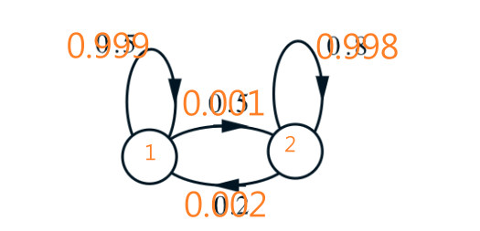
> 对于这个马尔科夫过程，我们发现即使$n$很	大，如果我的初始状态是$1$, 那我最后还是		很可能在$1$上，初始状态是$2$的话，我最后在$1$上的概率会很小，所以这个马尔科		夫过程可能需要很长时间才能收敛或者根本不收敛。
> 2. 利用`Balance/Normalization Equation`计算`Steady State Probability`
> 
对于这个马尔科夫过程，我们有线性方程组(`Balance/Normalization Equation`):
> $\begin{cases}\pi_1=\pi_1\cdot 0.5+\pi_2\cdot 0.2\\\pi_2=\pi_1\cdot 0.5+\pi_2\cdot 0.8\\\pi_1+\pi_2=1\end{cases}$, 所以解得$\pi_1=\frac{2}{7},\pi_2=\frac{5}{7}$

## 2.3 Birth-Death Processes**⭐⭐**
### 2.3.1 定义
> 一种特殊的马尔科夫过程称为`Birth-Death Process`, 这个过程中，每次状态转换只能在相邻的两个状态之间发生，也就是假设我有两个相邻的状态$i,i+1$, 那么我在从$i\to i+1$之前必须有$i+1\to i$发生。
> 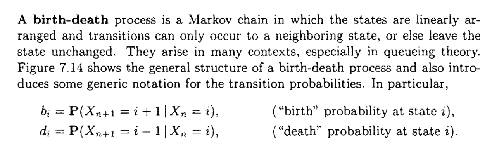
> 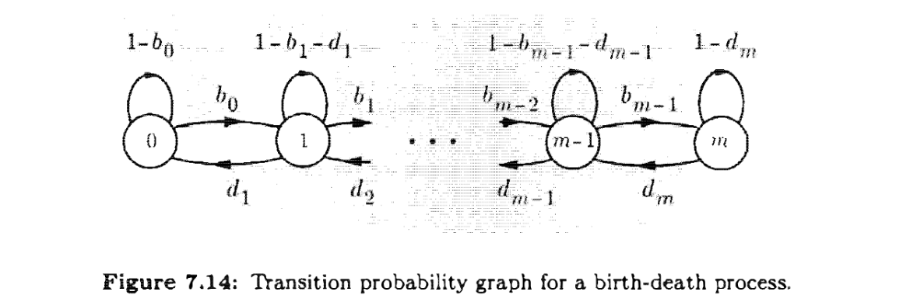

### 2.3.2 Balance/Normalization Equation
> 在这个特殊的马尔科夫过程中，`Balance Equation`可以被简化，因为这个`Birth-Death Process`只允许状态转移发生在相邻的状态中，所以从状态$i$转移到$i+1$的频率应该和从状态$i+1$转移到状态$i$的频率相等，根据这个条件就能得到我们的简化的`Balance Equation`。
> 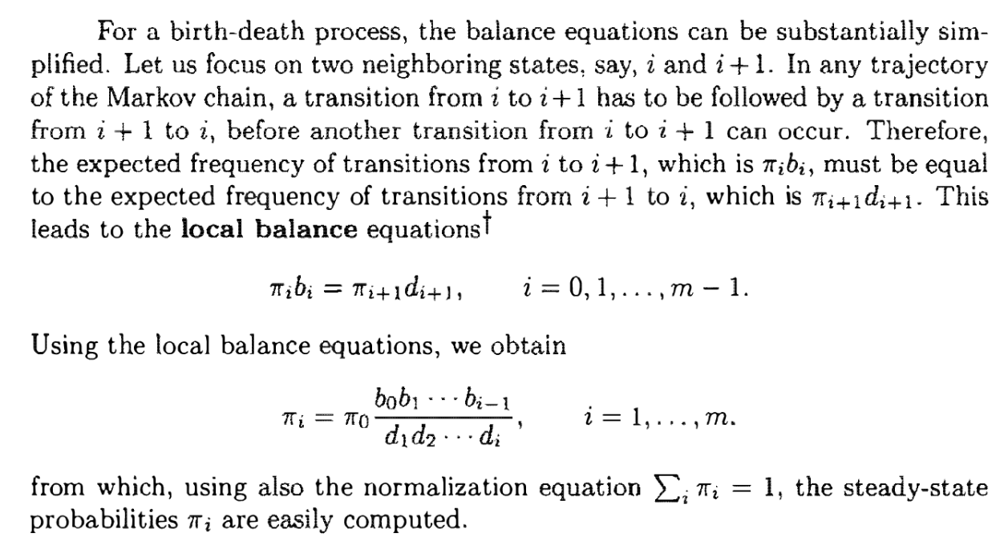

**一个简化的例子(Queuing Theory)**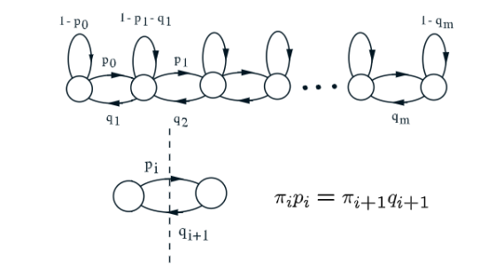
如果我们要求这个例子中的`Steady State`, 我们需要建立`Balanace/Normalization Equation`, 为了简化考虑，我们假设所有的正向状态转移概率都是一致的，为$p$。反向状态转移概率也都是一致的，为$q$。
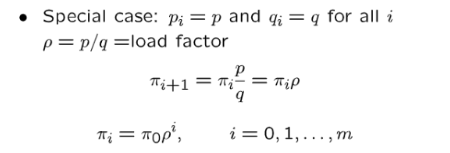
此时我们有:
$\begin{cases}\pi_1=\pi_0\cdot\rho\\ \pi_2=\pi_1\cdot \rho=\pi_0\cdot \rho^2\\\sum_{i=0}^m \pi_{0}\rho ^i=1\end{cases}$, 解得$\pi_0=\frac{1}{\sum_{i=0}^m \rho^i}$
如果在$p_i=p,q_i=q$的情况下，还有这个$p<q$这个条件，则$0<\rho<1$, 此时$\sum_{i=0}^m \rho^i=\frac{1}{1-\rho}$, 所以$\pi_0=1-\rho$, $\pi_i=(1-\rho)\rho^i$
联系实际生活的话，假设$X_n$代表经过$n$次状态转移(有一个人来没有人走($p$)，有一个人人走没有人来$q$，有人来的同时有一个人走 或者 没有人来和走$pq+(1-p)(1-q)$)后排队的人数， 则$E[X_n]=\frac{\rho}{1-\rho}$
我们可以将$\pi_i$的图像画出:

$\rho$被称为`Load Factor`, 如果$\rho$很接近$1$的话，比如$0.99$, 我们的$E[X_n]$就会很大。
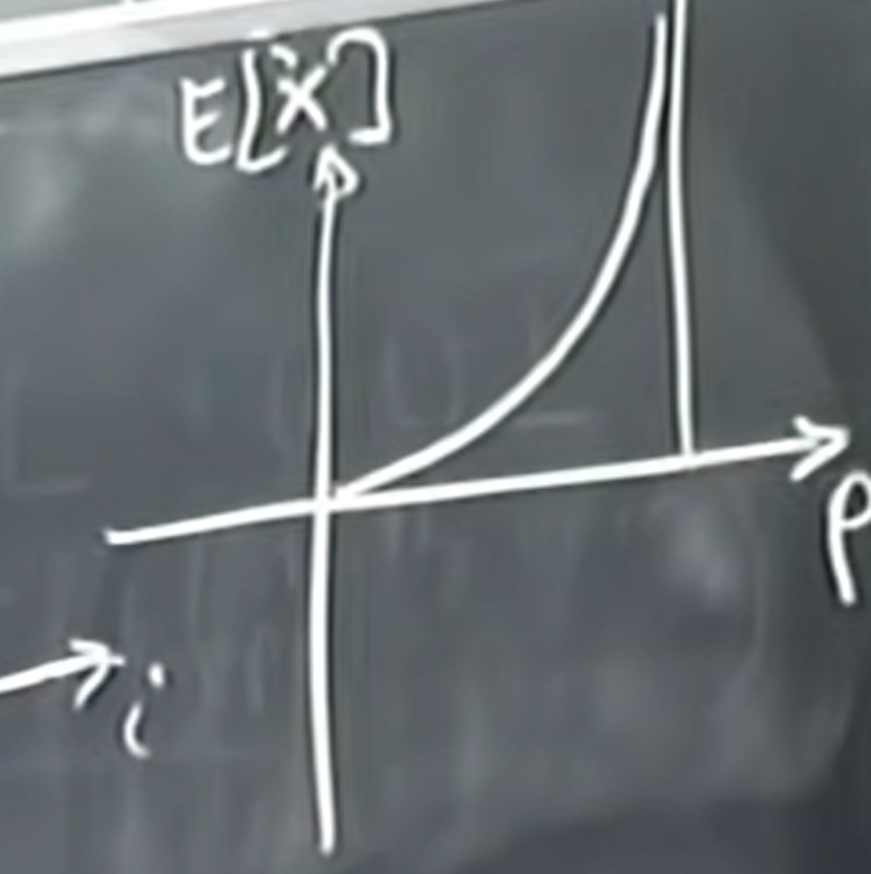
 

## 2.4 Applications
:::info
这个例子中我们将探究马尔科夫链在实际生活中的应用。
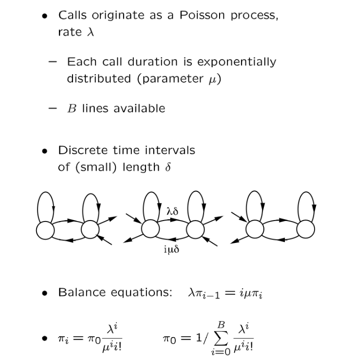
:::

# 3 Absorption Probabilities 
[L18 Slides.pdf](https://www.yuque.com/attachments/yuque/0/2022/pdf/12393765/1662007434991-b5b17f9a-b086-428a-8b13-84a409332c6f.pdf)
## 3.1 什么是Absorption Probability
> 前文中我们探索了马尔科夫链的长期行为，而在本节中，我们研究马尔可夫链的短期行为。
> **我们将从一个**`**Transient State**`**开始，想要找到第一次进入的**`**Recurrent State**`**以及进入这个**`**Recurrent State**`**的时候经历的转移次数。**
> 其实当马尔科夫链在进入`Recurrent State`之后，后续的行为都是无足轻重的了。
> 因此我们可以关注`Recurrent State` $k$ 是`Absorbing`的情况(也就是卡在$k$不动了)，比如下图中的状态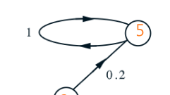，一旦到达了$5$就会卡着不动。用数学语言表示这些`States`就是:
> 
> 如果一个马尔科夫链中只有唯一的`Absorbing State` $k$，则其`Steady-State Probability`为$1$（因为所有其他状态都是`Transient`的，且`Steady-State Probability`都为零），并且从任何初始状态开始最终都会以概率$1$ 到达状态$k$。
> 如果有多个`Absorbing States`，最终达到其中任意一个状态的概率都是 1，但是要进入`Absorbing State`的路线是随机的，并且`Absorbing Probability`也可能取决于起始状态。
> **对于任意一个特定的**`**Absorbing State**`$s$**，**`**Absorption Probability**`**定义为**$a_i$**(从**$i$**开始最终停在**$s$**的概率)**
> 
> 这个$a_i$可以通过一系列线性方程组得到。
> 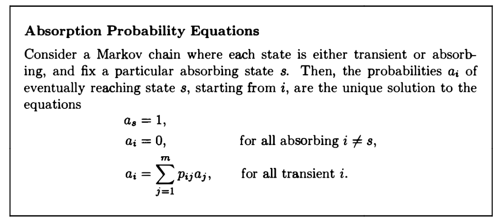
> 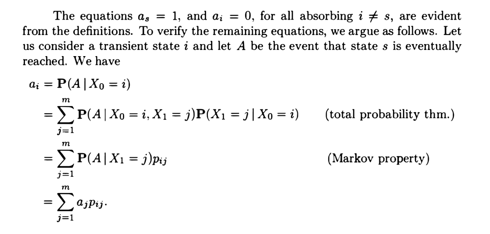
> **如果我们有多个**`**Absorbing State**`**, 我们想要计算我们到达任意一个**`**Absorbing State**`**所用的时间的期望。我们可以将这些**`**Absorbing States**`**划为一类。然后采用之前的方法计算马尔科夫过程到达这个类的时间的期望即可。**

## 3.2 Calculating Absorption Probability
:::info

上图中$a_2=0.2+0.8\cdot a_1$
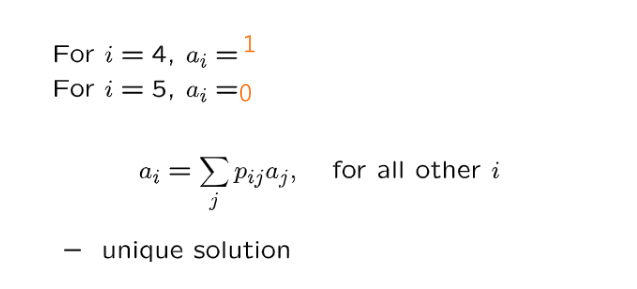
:::

## 3.3 Expected Time to Absorption
### 3.3.1 定义
:::info
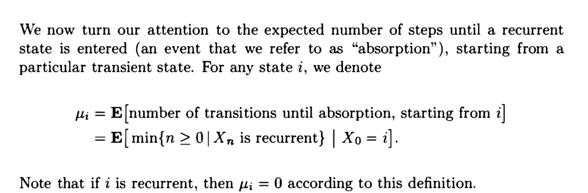
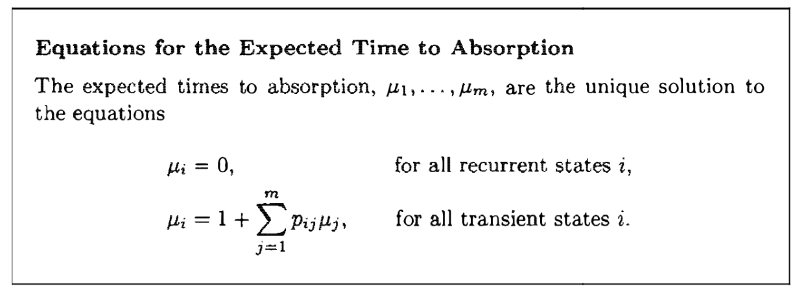
:::

### 3.3.2 算例
:::info
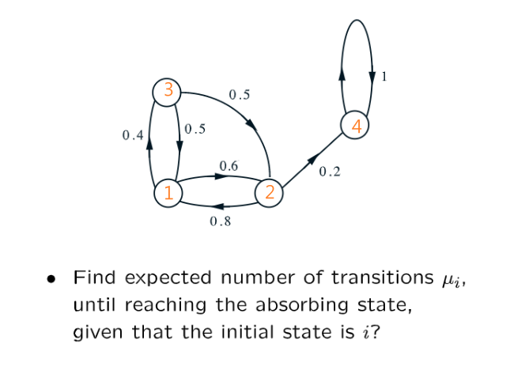
假设我们从状态$1$开始，$0.4$的概率转移到状态$3$, $0.6$的概率转移到状态$2$。
从状态$3$到`Absorbing State`$4$的期望时间是$\mu_{3}$, 从状态$2$到`Absorbing State`$4$的期望时间是$\mu_{2}$
所以$\mu_{1}=0.4\cdot \mu_3+0.6\cdot \mu_2+1(第一步转移也需要时间)$
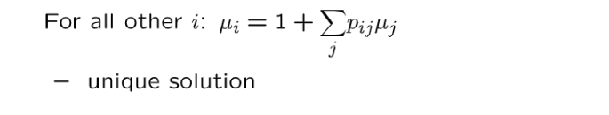
:::
 
## 3.4 Mean First Passage and Recurrence Time
### 3.4.1 定义
:::info
假设我们的马尔科夫链中一个`Absorbing State` 也没有，而是只有一个`Recurrent Class State`, 我们从状态$i$(`Recurrent State`)开始，到另一个`Reucurrent State`$s$的时间的期望， **这是**`**Mean First Passage Time**`。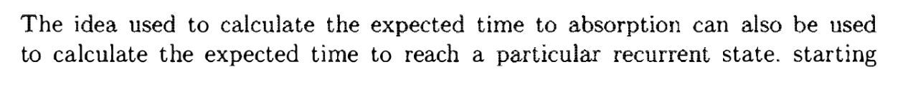
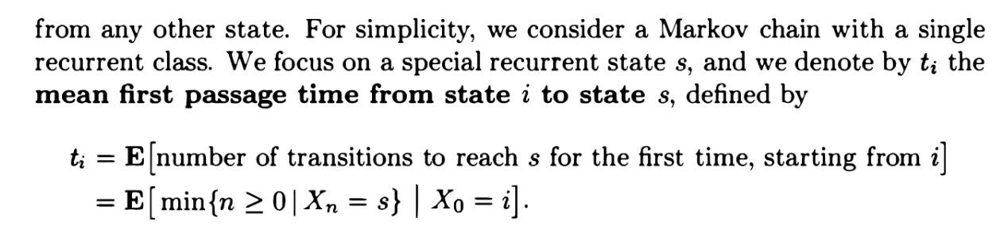
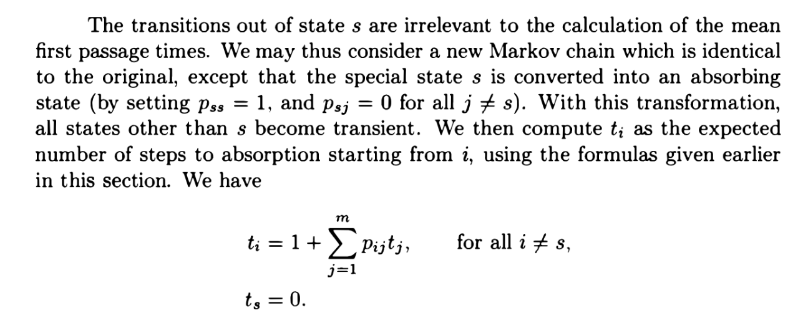
这是`Mean Recurrence Time`, 表示我从一个`Recurrent State`$s$经过一系列转移后回到自己的平均步数。
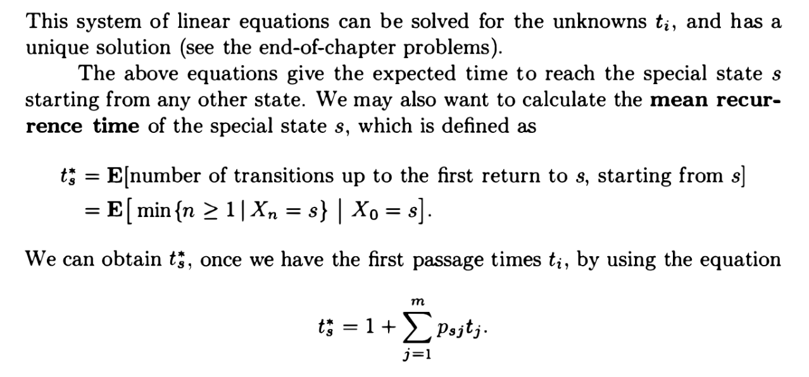
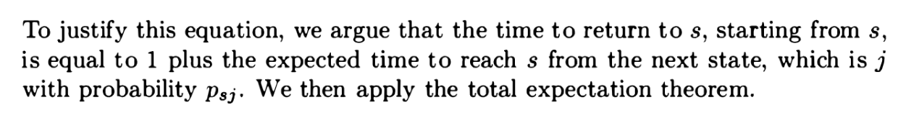
:::

### 3.4.2 算例
:::info
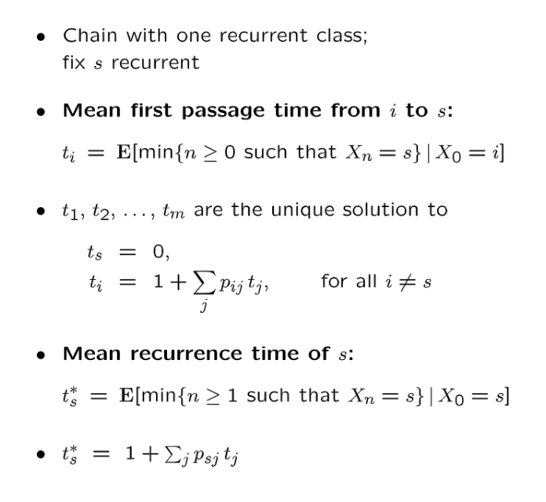
:::
