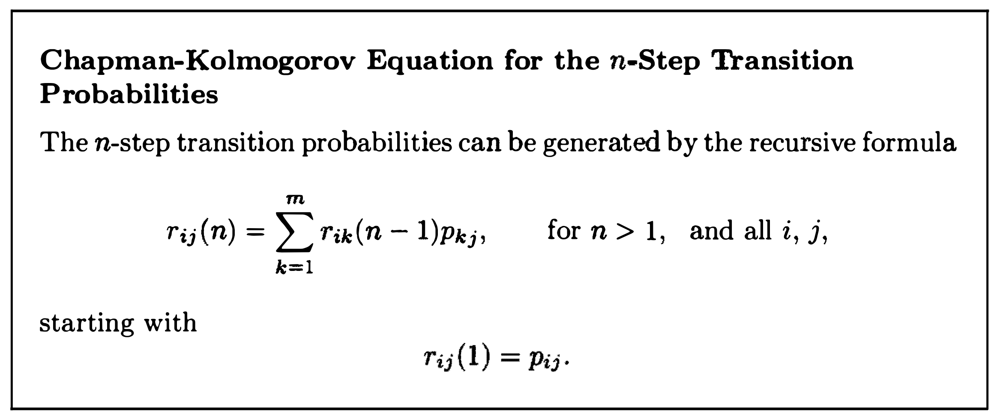
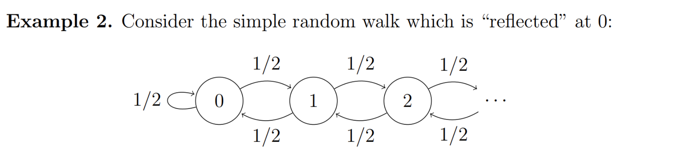
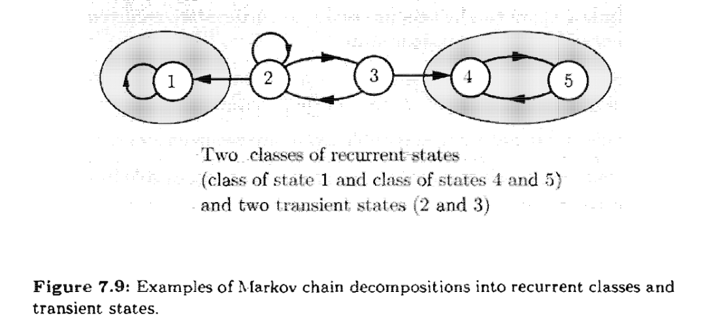
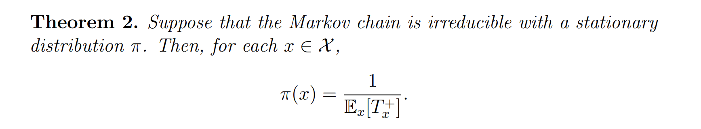
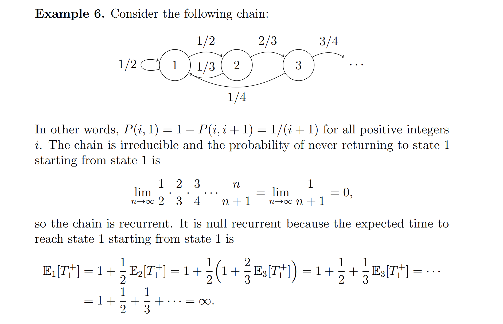
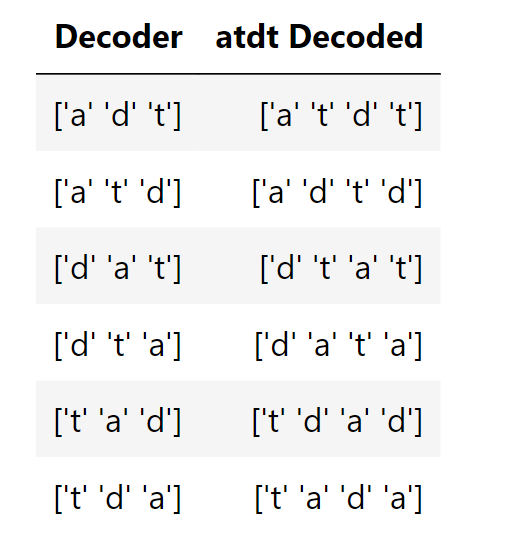
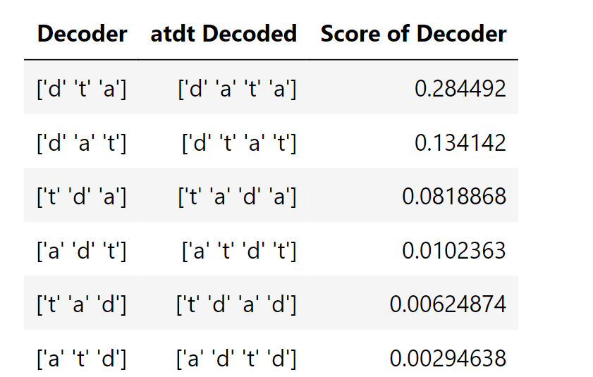

# 0 Preface
> 
>  我们会探究一种模型，他将过去的影响总结成一个`State`, 且这个`State`根据给定的概率随时间变化。本章我们将这个模型限制在只能取有限数量的状态，且状态转移的概率和时间是独立的。我们想要探究`State Value`序列的概率性质。
> 本章描述的模型类型的应用范围非常广的。它包括几乎所有包含不确定性的动力系统，只要系统的**状态**被适当地定义。这样的系统出现在各种各样的领域，例如通信，自动控制，信号处理。制造、经济学和行为研究。


# 1 Discrete Time Markov Chain
## 1.0 前言
> 我们从离散伯努利分布出发来引出马尔科夫链的概念，假设我们有如下的伯努利序列:
> 
> 则我们有如下的状态和其转移概率。
> 
> 下面我们将正式介绍马尔科夫过程。


## 1.1 标准定义
> 
> 随机变量$X_n$描述了马尔科夫状态，样本空间是离散的$S=\{1,\cdots m\}$($m$是正整数), 称为状态空间。马尔科夫链由状态转移概率$p_{ij}$组成，表示从状态$i$变成状态$j$的概率。


## 1.2 Markov Property**⭐⭐⭐⭐⭐**
:::info
马尔科夫链的一个重要性质/假设就是:

这个性质说的是，我知道了在$n$时刻我在状态$i$, 那么在$n$时刻之前我的状态序列对我在$n+1$时刻我的状态没有任何关系。也就是我不关心我是怎么在$n$时刻到达状态$i$的。
:::


## 1.3 n-step transition probability**⭐⭐⭐**
### 1.3.1 Definition
:::info
我们知道，在马尔科夫过程进行状态转移$i\to j$的过程中，有可能我们经历了一步，也可能经历了很多步。现在我们定义:
使用$n$步从状态$i$到状态$j$的概率是: $P_{ij}^{(n)}=P\{X_{m+n}=j|X_m=i\}$
:::


### 1.3.2 Recursion Formula
> 那么我们怎么计算这个`n-step transition probability`呢?
> 因为从状态$i$出发所能到达的状态$j$是可以列举出来的，所以$\sum_{j}P_{ij}^{(n)}=\sum_{j}P(X_n=j|X_0=i)=1$(因为$P$是一个合法的概率密度函数)。
> $n-step\space transition\space probability$探究的是从某个状态$i$开始, **在**$n$**次状态转移之后**的状态为$j$的概率。
> 我们可以从第$n$次状态转移开始反向考虑建立递归关系，如下图所示:
> 
> 意思就是我经过了$n-1$步有可能转移到$1,2,...,m$这$m$种状态，用$k$表示具体转移到的某种状态，其概率是$P_{ik}^{(n-1)}$, 然后从第$n-1$步由状态$k$转移到第$n$步的状态$j$的概率是$p_{kj}$, 根据乘积法则相乘得到经过$n$步状态转移从$i\to k\to j$的转移概率， 然后将所有的$\to k\to j$的转移概率相加得到$r_{ij}(n)$, 就有了下面的递归公式:
> 
> 上面的推导是基于`Initial State`是状态$i$的情况，那么如果我们考虑所有的初始状态，则有:
> 
> 根据全概率公式: $P(X_n=j)=\sum_{i=1}^m P(X_n=j|X_0=i)P(X_0=i)=\sum_{i=1}^m P(X_0=i)r_{ij}(n)$。


### 1.3.3 Chapman-Kolmogorov Equations
:::info

:::
**Proof**


### 1.3.4 Probability of a Path⭐⭐⭐
> 
> 总的来说我们只要沿着`Path`将沿途的所有状态转移概率相乘即可。
> 
> $P(X_1=2,X_2=6,X_3=7|X_0=1)=p_{12}p_{26}p_{67}$
> $P(X_4=7|X_0=2)=p_{26}p_{67}p_{76}p_{67}+p_{26}p_{66}p_{66}p_{67}+p_{21}p_{12}p_{26}p_{67}$
> 但是如果$X_n$中的$n$很大的话，用这种方式会得到非常长的概率连乘，此时我们会转而使用$1.3$中的`Recursion Formula`来求解


## 1.4 Matrix Perspective**⭐⭐⭐⭐⭐**
### Markov Matrix
> 上面的推导略显繁琐，我们在矩阵的框架下进行阐述。
> 
> 其中$P_{ij}=P(X_{m+1}=j|X_{m}=i)$, 也就是`One-step transition probability`。
> 令$P=\begin{bmatrix} P_{11}&P_{12}&\cdots &P_{1m}\\P_{21}&P_{22}&\cdots&P_{2m}\\\vdots&\vdots&\ddots&\vdots\\P_{m1}&P_{n2}&\cdots&P_{mm}\end{bmatrix}$, 则我们想证明$P^n=\begin{bmatrix} P_{11}^{(n)}&P_{12}^{(n)}&\cdots &P_{1m}^{(n)}\\P_{21}^{(n)}&P_{22}^{(n)}&\cdots&P_{2m}^{(n)}\\\vdots&\vdots&\ddots&\vdots\\P_{m1}^{(n)}&P_{m2}^{(n)}&\cdots&P_{mm}^{(n)}\end{bmatrix}$
> 我们使用数学归纳法: 
> 1. **Base Step: **$n=1$, 因为$P_{ij}^{(1)}=P_{ij}$by definition, 表示`1-step transition probability`
> 2. **Inductive Hypothesis: **假设$n=k\geq 1$, $P^k=\begin{bmatrix} P_{11}^{(k)}&P_{22}^{(k)}&\cdots &P_{1m}^{(k)}\\P_{21}^{(k)}&P_{22}^{(k)}&\cdots&P_{2m}^{(k)}\\\vdots&\vdots&\ddots&\vdots\\P_{m1}^{(k)}&P_{m2}^{(k)}&\cdots&P_{mm}^{(k)}\end{bmatrix}$成立。
> 3. **Inductive Step:** 对于$P^{k+1}$中的一项$P_{ij}^{(k+1)}$, 根据`Chapman-Kolmogorov Equation`可知: $P_{ij}^{(k+1)}=\sum_{k=1}^mP_{ik}^{(k)}P_{kj}$, 而$\sum_{k=1}^mP_{ik}^{(k)}P_{kj}$表示的正是$P^k$中的第$i$行和$P$中第$j$列向量的乘积。
> 
所以$\begin{aligned}P^{k+1}=P^kP&=\begin{bmatrix} P_{11}^{(k)}&P_{22}^{(k)}&\cdots &P_{1m}^{(k)}\\P_{21}^{(k)}&P_{22}^{(k)}&\cdots&P_{2m}^{(k)}\\\vdots&\vdots&\ddots&\vdots\\P_{m1}^{(k)}&P_{m2}^{(k)}&\cdots&P_{mm}^{(k)}\end{bmatrix}\begin{bmatrix} P_{11}&P_{22}&\cdots &P_{1m}\\P_{21}&P_{22}&\cdots&P_{2m}\\\vdots&\vdots&\ddots&\vdots\\P_{m1}&P_{n2}&\cdots&P_{mm}\end{bmatrix}\\&=\begin{bmatrix} P_{11}^{(k+1)}&P_{22}^{(k+1)}&\cdots &P_{1m}^{(k+1)}\\P_{21}^{(k+1)}&P_{22}^{(k+1)}&\cdots&P_{2m}^{(k+1)}\\\vdots&\vdots&\ddots&\vdots\\P_{m1}^{(k+1)}&P_{m2}^{(k+1)}&\cdots&P_{mm}^{(k+1)}\end{bmatrix}\end{aligned}$, 成立。
> 证毕。


### State Probability Distribution
> 假设我们有一个初始状态向量$\vec{\pi}_0=\begin{bmatrix} \pi_0(1)\\\pi_0(2)\\\vdots\\\pi_0(m)\end{bmatrix}\in \mathbb{R}^{m}$，状态空间是$\{1,2,\cdots, m\}$(也就是有$m$个状态)。
> 其中$\sum_{k=1}^m\pi_0(k)=1$, $\pi_0(k)$表示在`Time 0`的时候我们位于状态$k$的概率大小。
> 对于任意时刻$k$, $\vec{\pi}_k=\begin{bmatrix} \pi_k(1)\\\pi_k(2)\\\vdots\\\pi_k(m)\end{bmatrix}\in \mathbb{R}^{m}$, $\pi_k(i)=P(X_{k}=i)$, 表示在第$k$个时间步到达State k 的概率。
> 根据全概率公式我们有:
> $\begin{aligned}\pi_k(j)&=\sum_{i=1}^mP(X_k=j|X_{k-1}=i)P(X_{k-1}=i)\\&=\sum_{i=1}^mP(X_k=j|X_{k-1}=i)\pi_{k-1}(i)\\&=\sum_{i=1}^m\pi_{k-1}(i)P_{ij}\end{aligned}$
> 所以:
> $\vec{\pi}_{k+1}^{\top}=\pi_{k}^{\top}P$
> 所以我们有:
> $\pi_n^{\top}=\pi_0^{\top}P^n,n\geq 0$


# 2 Classification of States
## Recurrent/Transient States⭐⭐⭐⭐⭐
### Definition 1: Verbal
> [!def]
> The first key insight about Markov chains is that, while some states will be visited by the chain over and over again, other states will only be visited a few times and then never seen again.
> 
> 主要有两类: `Recurrent`和`Transient`
> 
> 
> 
> 总的来说，`recurrent class`就是一个`class`进去了就出不去了。


### Definition 2: Hitting Time
> [!def]
> For each $x ∈ X$ , the random variable $T_x$ represents the first time that the chain visits state $x$, i.e., $T_x := min\{n ∈ N : X_n = x\}$ (this is called the hitting time of state $x$). 
> 
> We will also need the random variable $T_x^+:=min\{n ∈ Z_+ : X_n = x\}$ , which is the hitting time for state $x$ except that we do not let $T_x^+$ equal $0$ when the chain starts at $x$.
> 
> Also, the notations $P_x$ and $E_x$ mean that the chain is started at state $x$, that is:
> 

> [!example]
> 


### Finite DTMC has at least one recurrent state
> [!important]
> 


### Optional: Positive/Null Recurrence
> [!def]
> 


## Irreducibility
### Accessible States
> [!def]
> 


### Communicating Class
> [!def]
> 
> That is to say, if we view the markov chain as a directed graph, then irreducibility means there is only one SCC in the di-graph.
> 
> 


### Irreducible Markov Chain
> [!def]
> 


## Periodicity
### Periodic States
> [!def]
> 
> When d > 1, state i is periodic.
> When d = 1, state i is aperiodic.

> [!example]
> 

> [!bug] Important
> 
> So normally we assume all states in our markov chain are aperiodic(having period 1).


### Aperiodic Markov Chain
> [!def]
> A Markov chain is said to be aperiodic if all of its states are aperiodic.
> 

> [!proof] Proof Sketch: Aperiodicity means d=1 for all states
> 


### Check Aperiodicity
> [!lemma] 
> All states in an irreducible Markov Chain have the same period.

> [!thm]
> 


### Periodic Class⭐⭐
> [!def]
> A class is said to be periodic if its states are periodic.
> 
> 
> `Periodicity`描述了一个`Reucurrent Class`内部的马尔科夫过程的状态转移方式。
> 对于一个`Recurrent Class`来说：
> 
> $d=1\space or\space 2$**的情况:**
> 
> $d=3$**的情况**
> 
> 再看一个特殊的例子，对于下列的`Recurrent Class`:
> 
> 红色的为$S_1$,白色的是$S_2$, $S_1$和$S_2$是`Disjoint`的， 所以这个`Recurrent Class`是周期性的。

**更严格的Periodicity的定义**


### Examples
> [!example]
> 


## Recurrent/Transient Class
### Definition
> [!def]
> A communicating class is called recurrent if at least one (equivalently, every) state in this class is recurrent. 
> 
> A communicating class is transient if at least one (equivalently, every) state in this class is transient.
> 


### Recurrent and Transient Class Example
> [!example]
> 


## Markov Decomposition
> [!def]
> 
> 
> 上图中，状态$5,6,7,8$都是`Recurrent`的。
> 状态$1,2,3,4$都是`Transient`的(因为$1\to 5$或者$2\to 6$总是有可能会发生，导致我们永远无法回到$1,2,3,4$)。
> 于是我们可以将这个马尔科夫过程中的状态分成两类:
> 蓝色的部分是`Recurrent Class`, 红色的部分是`Transient Class`, 一旦马尔科夫过程进入了`Recurrent Class`, 就卡在里面出不去了，和其他的`Class`之间就没有交流的通道了。
> 
> 所以如果我们从一个`Recurrent State`开始马尔科夫过程，我们在$n\to \infty$步之后会收敛在`Recurrent Class`中。而如果我们从一个`Transient State`开始马尔科夫过程，我们不会收敛在`Transient Class`中。这也进一步验证了`Initial State`的选取确实会对马尔科夫的收敛性与否产生影响。
> 这种分类被称为`Markov Decomposition`:
> 
> 
> 我们再看一个例子:
> 

> [!example]
> 

> [!example] Decomposing a Markov Chain with Transition Matrix
> 


# 3 Steady State Analysis
> [!important] When we have stationary distribution
> 
> When the markov chain is irreducible and aperiodic, we have stationary distribution.

## Stationarity of Sequential R.V.
> [!def]
> 


## Initial Distribution
> [!def]
> 


## Invariant Distribution
> [!def]
> 对于一个`Single Aperiodic Class`的`Markov Process`来说，我们可以使用`Balance Equation`$\begin{cases}\pi=\pi P\\\sum\limits_{i=1}^n\pi_i=1\end{cases}$, 求出收敛概率, 其中$P$是`Transition Matrix`, 每一行的和为$1$。
> 
> 如果`Transition Matrix` 的每一列和为一，则`Balance Equation` 是 $P\pi=\pi$
> 


## Steady-State Convergence Theorem
### Theorem 1: N-Step Transition Probability
> [!thm]
> 
> 例如, 在$n\to\infty$时，`Markov Chain`已经收敛，此时$P(X_0=j)=\pi_j$, 则:
>  $\begin{align}P(X_2=j)&=\sum\limits_{t=1}^m\sum\limits_{k=1}^mP(X_2=j|X_1=k,X_0=t)P(X_1=k|X_0=t)P(X_0=t)\\&=\sum\limits_{t=1}^{m}\sum\limits_{k=1}^{m}p_{kj}\times p_{tk}\times\pi_t\\&=\sum\limits_{k=1}^{m}p_{kj} \sum\limits_{t=1}^{m}p_{tk}\times\pi_t\\&=\sum\limits_{k=1}^mp_{kj}\pi_k\\&=\pi_j\end{align}$ 
>  以此类推可以证明$P(X_n=j)=\pi_j$
>  所以$\lim_{n\to \infty}P(X_n=j|X_0=i)=\lim_{n\to \infty}P(X_n=j)=\pi_j$, 即$X_n$和$X_0$在$n\to \infty$时近似独立。

> [!example] 
> 


### Theorem 2: Portion of Time Converges
> [!thm]
> 
> Note that this convergence doesn't rigorously hold since the LHS is a random variable and the RHS is a constant. But we won't go into the detail of this.


### Theorem 3: Expected Proportion of Time 
> [!thm]
> 

> [!corollary] 
> 


### Theorem 4: Hitting Time Version
> [!thm]
> 

> [!proof]
> 


## Existence and Uniqueness of Stationary Dsitribution
### Existence
> [!thm]
> 


### Uniqueness
> [!thm]
> You should just be aware that an irreducible, aperiodic, finite state Markov Chain has exactly one stationary distribution.
> 
> **This is particularly helpful if you happen to guess a solution to the balance equations.** If the solution that you have guessed is a probability distribution, you have found the stationary distribution of the chain.
> 


### Examples
> [!example]
> 


> [!example]
> 


## Periodicity and Stability
### Definition
> [!important]
> 


### Theorem 4: Aperiodic Convergence
> [!thm]
> 
> The fact that periodic markov chain's stationary distribution depends on initial distribution and initial states, like in the following example:
> 
> 
> where we have many communicating classes(SCC)。
> 
> This means if we start at the left SCC, we will get stuck in there and find an invariant distribution for that SCC. The same holds if we starts at the right SCC. 
> 
> Here is another example:
> 
> Depending on our initial states, the stationary distribution will be different.


### Perron-Frobenius Theorem
[Stochastic Matrices](../../../../Computer_Science/Machine_Learning/Optimization_EECS127AB/1_Linear_Algebra_Review/Structured_Matrices.md#Stochastic%20Matrices)


## Phone Call Process
> [!summary]
> 


# 4 Reversibility


# 5 Markov Chain Monte Carlo(MCMC)
## Balance
> [!def]
> As before, assume that we have an irreducible, aperiodic Markov chain on a finite state space, with transition matrix $\mathbb{P}$. We have seen that such a chain has a unique stationary distribution $\pi$, and that $\pi$ solves the balance equations $\pi \mathbb{P}=\pi$.
> 
> To see what is being "balanced" in these equations, imagine a large number of independent replications of this chain. For example, imagine a large number of particles that are moving among the states 1 through 5 according to the transition probabilities of the sticky reflecting walk, and suppose all the particles are moving at instants $1,2,3, \ldots$ independently of each other.
> 
> Then at any instant and for any state $j$, there is some proportion of particles that is leaving $j$, and another proportion that is entering $j$. The balance equations say that those two proportions are equal.
> 
> Let's check this by looking at the equations again. For each state $j$, the balance equation is
> $$\pi(j)=\sum_{k \in S} \pi(k) P(k, j)$$
> 
> For every $k \in S$ (including $k=j$ ), **think of $\pi(k)$ as the proportion of particles leaving state $k$ after the chain has been run a long time.**
> - The left hand side is the proportion of particles leaving $j$.
> - The generic term in the sum on the right is the proportion of particles that left $k$ at the previous instant and are moving to $j$. The sum is the proportion of all the particles entering $j$.
> 
> When the two sides are equal, the chain is balanced.


## Detailed Balance
> [!def]
> The left hand side of the equation above is just the proportion of particles leaving $j$. There is no information about where the particles are going.
> 
> The detailed balance equations take both directions into account. They are given by
> $$\pi(i) P(i, j)=\pi(j) P(j, i) \text { for all states } i \neq j$$
> 
> The detailed balance equations say that for every pair of states $i$ and $j$, the proportion of particles that leave $i$ and move directly to $j$ is the same as the proportion that leave $j$ and move directly to $i$.
> 
> In the case $i=j$ the two sides of the equation are identical and hence carry no information. So they are not included.
> 
> Detailed balance turns out to be a stronger condition than balance.


## Detailed Balanace Implies Balance
> [!proof]
> Suppose there is a probability distribution $\pi$ that solves the detailed balance equations. Then $\pi$ also solves the balance equations.$$\begin{aligned}\sum_{k \in S} \pi(k) P(k, j) & =\sum_{k \in S} \pi(j) P(j, k) \quad \text { (detailed balance) } \\& =\pi(j) \sum_{k \in S} P(j, k) \\& =\pi(j) \cdot 1 \quad \text { (sum of } j \text { th row of transition matrix) } \\& =\pi(j)\end{aligned}$$
> 
> From now on, when we say "solution" we will mean a solution that is a probability distribution.
> 
> <font color="#ff0000">**What we learn from this is that if we can find a solution to the detailed balance equations, we will also have solved the balance equations.**</font>
> 
> **This is helpful for two reasons:**
> - The detailed balance equations are simple.
> - There are lots of them; indeed if there are $s$ states then there are $\left(\begin{array}{l}s \\ 2\end{array}\right)$ detailed balance equations in $s$ unknowns. This gives us lots of ways to try to solve them.
> 
> Of course all the $\left(\begin{array}{l}s \\ 2\end{array}\right)$ equations need not be consistent, in which case there will no solution to the detailed balance equations. In such situations we'll have to slog our way through solving the balance equations directly.
> 
> But there is an important class of Markov chains for which it is easy to see that the detailed balance equations must have a solution. Therefore for those chains we have an easy way at finding the stationary distribution.


## Birth-Death Process
### Definition
> [!def]
> A birth-and-death chain is a Markov chain on the integers, with one-step transitions restricted to going up by 1 , going down by 1 , or staying in place. A birth is a move up, and a death is a move down.
> 
> Such chains are used to model many different random quantities such as gamblers' fortunes or population sizes. Look through the chains you have worked with thus far. Many of them, including the **sticky reflecting random walk and the Ehrenfest chain, are birthand-death chains.** In the Ehrenfest example, we were modeling the size of the population of gas particles in a container.
> 
> **For all irreducible birth-and-death chains, the detailed balance equations have a solution.** This is because the only possible moves are between consecutive integers, so the only detailed balance equations that have to be solved are
> $$\pi(i) P(i, j)=\pi(j) P(j, i), \quad|i-j|=1$$
> 
> For $i$ and $j$ separated by 1 , both $P(i, j)$ and $P(j, i)$ are strictly positive because the birthand-death chain is irreducible. For all other pairs $i \neq j$, the equation becomes $0=0$ because $P(i, j)=0=P(j, i)$.
> 
> Thus for example$$\pi(i) P(i, i+1)=\pi(i+1) P(i+1, i) \quad \text { so } \pi(i+1)=\pi(i) \frac{P(i, i+1)}{P(i+1, i)}$$
> 
> This gives us an easy way to write each $\pi(j)$ in terms of the same element of $\pi$, and hence find $\pi$ as before.
> 
> 


### Sticky Reflectling Walk
> [!def]
> 
> This chain is **irreducible** since there is only one communicating class(i.e. only one SCC, all the states communicates with each other, there is a positive probability path between any two states $i$ and $j$).
> 
> The chain is **recurrent** since there is at least one recurrent state(for example state 2) in this unique communicating class.
> 
> The chain is **aperiodic** since there is self-transition in the transition diagram. (For state 2, if we start at state 2 at time 0, then we can reach state 2 in step $1,2,\cdots, n$, where $gcd(1,2,\cdots, n)=1$).
> 
> This chain is birth-death **process** and has a solution to the detailed balance equation:
> Let's do this starting at the state 1 .
> $$\begin{aligned}\pi(1) 0.5=\pi(2) 0.25 & \Longrightarrow \pi(2)=2 \pi(1) \\\pi(2) 0.25=\pi(3) 0.25 & \Longrightarrow \pi(3)=\pi(2)=2 \pi(1) \\\pi(3) 0.25=\pi(4) 0.25 & \Longrightarrow \pi(4)=\pi(3)=2 \pi(1) \\\pi(4) 0.25=\pi(5) 0.5 & \Longrightarrow \pi(5)=(1 / 2) \pi(4)=\pi(1)\end{aligned}$$
> 
> So $\pi=[\pi(1), 2 \pi(1), 2 \pi(1), 2 \pi(1), \pi(1)]$.
> 
> Now use the fact that the probabilities have to sum to 1 , to get $\pi(1)=1 /(1+2+2+2+1)=1 / 8$. The stationary distribution is
> $$\pi=\left[\frac{1}{8}, \frac{2}{8}, \frac{2}{8}, \frac{2}{8}, \frac{1}{8}\right]$$
> 
> as we have seen earlier numerically and also by solving the balance equations. The method used here is easier than both of those ways.

> [!example] Generalization Examlpe
> 

> [!summary]
> 
> 如果$\rho=1$, 则每个`State`的`Steady State Probability`是Equally likely的。
> 如果$\rho<1$且$m\to \infty$, 则：$p_{X_n}(i)=\rho^i(1-\rho)$, 所以$\mathbb{E}[X_n]=\sum\limits_{k=0}^{\infty}k\times (1-\rho)\times \rho^k=\frac{\rho}{1-\rho}$, 当$\rho\to 0$时，$\mathbb{E}[X_n]$是`Finite`的，但是当$\rho\to 1$时，图像就朝着`Infinity`进发了。


### Ehrenfest Chain
> [!def]
> 
> **The transition probability is derived as follows:**
> 1. If $j = i+1$, we select the second container and then select uniformly one particle from it, move it to the first container. 
> 	1. Selecting the second container has probabilty $\frac{1}{2}$.
> 	2. Selecting a random particle(independently from container) from container 2 has probability $\frac{N-i}{N}$ since there is $N-i$ particles in container 2 and $i$ particles in container 1 right now.
> 2. If $j=i$, we have two scenarios:
> 	1. We select first container and select a particle from it. This has probability $\frac{1}{2}\times\frac{i}{N}$.
> 	2. We select second container and select a particle from it. This has probability $\frac{1}{2}\times \frac{N-i}{N}$
> 	3. Adding them up we get $\frac{1}{2}$
> 3. Similar to the case 1.

> [!Solution] Solution with Balance Equation
> 

> [!solution] Solution with Detailed Balance Equation
> 

> [!code]
> 
```python
N = 100

states = np.arange(N+1)

def transition_probs(i, j):
    if j == i:
        return 1/2
    elif j == i+1:
        return (N-i)/(2*N)
    elif j == i-1:
        return i/(2*N)
    else:
        return 0

ehrenfest = MarkovChain.from_transition_function(states, transition_probs)
Plot(ehrenfest.steady_state(), edges=True)
```


### Sticky Random Walk on a Circle
> [!def]
> For an finite space irreducible and aperiodic markov chain, the stationary distribution always exist, but the solution to detailed balanace equation may not, depending on whether your chain is birth-and-death process or not. 
> 


## Absorption Probability
> [!def]
> 
> 更进一步，我们有$a_i=P(A|X_n=i),\forall n\in \mathbb{N}$
> 
> 

> [!example]
> 


## Expected Time to Absorption
> [!def]
> 

> [!example]
> 


## Mean First Passage and Recurrence Time
> [!def]
> 

> [!example]
> 


# 6 Metropolis Algorithm
## Code Breaking
### Decoder Structure
> [!def]
> Suppose we have a message of length 3 to encode and decode, and we focus on the decoder, which takes the encoded text and output the plaintext.
> 
> For simplicity, suppose we have a piece of texts that has an alphabet `a`, d, `t`
> , which means the plain text, encoded text and decoded text can only be constructed from the letters in our alphabet.
> 
> Now suppose our decoder is a permutation function of the alphabet, which means that it maps a letter in the alphabet uniquely to a letter in the alphabet. For the length 3 text, we have six such decoder:
> 


### Bigrams Model - Metric
> [!important]
> We want to evaluate the performance of decoder so as to decide which one to use. One metric is to use `bigrams` transition matrix, which means we treat encoded text(i.e. `atdt`) as a sequence of letter that corresponds to 4 states in a markov chain and the transition matrix is:
> 
> This transition matrix is row-wise summable to one. Thus $p(X_{n+1}=a|X_{n}=a)=0.018099$, $p(X_{n+1}=d|X_{n}=a)=0.219458$ and $p(X_{n+1}=t|X_{n}=a)=0.762443$
> 
> Thus if the decoder spits out `t d a` as decoded text, the score of this decoder is $0.653477 * 0.219458 * 0.570995=0.081887$.
```python
# Compute the probability of the decoded text x
def score(x):
    return bigrams.prob_of_path(x[0], x[1:])

# bigrams
aa = 1913489177
dd = 6513992572
tt = 19222971337
ad = 23202347740
da = 23279747379
at = 80609883139
ta = 42344542093
dt = 10976756096
td = 3231292348

row1 = make_array(aa, ad, at)/sum([aa, ad, at])
row2 = make_array(da, dd, dt)/sum([da, dd, dt])
row3 = make_array(ta, td, tt)/sum([ta, td, tt])
rows = np.append(np.append(row1, row2), row3)
bigrams = MarkovChain.from_table(Table().states(alph).transition_probability(rows))

# Add a column whose values are computed by the function
decoding = decoding.with_column('Score of Decoder', decoding.apply(score, 1))
decoding.sort('Score of Decoder', descending=True)
```
> [!code] Output
> 


### Drawback
> [!bug] Caveats
> What we have been able to do with an alphabet of three characters becomes daunting when the alphabet is larger. The 52 lower case and upper case letters, along with a space character and all the punctuations, form an alphabet of around 70 characters. That gives us 70! different decoders to consider. In theory, we have to find the likelihood of each of these 70! candidates and sort them.
> 
> **What we really want our sampling procedure to do is to choose good decoders with high probability.** 
> 
> **A good decoder is one that generates text that has higher probability in our language than text produced by almost all other decoders. In other words, a good decoder is one that has a high score.**
> 
> Even when the alphabet is large, for any particular decoder $j$ we can find its score by multiplying transition probabilities sequentially, as we did in our small example. But **we can't list all the decoders** because there are too many of them. So we can't list all the scores.
> 
> **So it seems we have a problem.**
> - For an individual decoder, we can calculate the score.
> - We want to find the decoder that has the highest score.
> - We can't list all the decoders (and their scores) because there are too many of them.
> 
> 


## Metropolis Algorithm
### Motivations
> [!motiv] Motivation for Code Breaking
> Imagine a large state space $S$. In our code-breaking example it is the space of all decoders, that is, all permutations of the alphabet.
> 
> Now suppose we are interested in a particular probability distribution on this space. We are going to call this probability distribution $\pi$. In the code-breaking example, $\pi$ is the distribution of scores of the decoders. Remember that while we can find the score of any particular decoder, we can't list them all, so we don't have a computational formula for $\pi$.
> 
> In the code-breaking setting, we are interested in the mode of $\pi$. That is, we are looking for the decoder that has the highest score.
> 
> Since can't compute $\pi$, the idea is to see if we can instead simulate a random variable that has distribution $\pi$.
> 
> **That is what MCMC does. The procedure relies on a few observations.**
> - Suppose we can create a Markov Chain $\left\{X_n\right\}$ that has our specified distribution $\pi$ as its stationary distribution. Then for large $n$ the distribution of $X_n$ will be approximately $\pi$.
> - Suppose we can construct such a chain. By the definition of a mode, $X_n$ is most likely to be at or near the mode of $\pi$, when $n$ is large. So by running the chain for a long time we will be able to identify the mode of $\pi$.
> - Creating a chain involves creating a transition matrix. To create a transition matrix that results in $\pi$ as the stationary distribution, the easiest way is to try to ensure that the detailed balance equations are solved.
> - The detailed balance equations are equivalent to$$\frac{\pi(j)}{\pi(i)}=\frac{P(i, j)}{P(j, i)}, \quad i \neq j$$


### Algorithm Procedures
> [!algo] Algorithm
> **The goal is to create a transition matrix $\mathbb{P}$ so that $\pi$ and $\mathbb{P}$ together solve the detailed balance equations.**
> 
> The algorithm **starts with any symmetric, irreducible** transition matrix $\mathbb{Q}$ on the state space. For example, if the state space is numerical you could start with, "Wherever the chain is, it picks one of the three closest values (including itself) with probability $1 / 3$ each." For a pair of states $i$ and $j$, the transition probability $Q(i, j)$ is called the proposal probability.
> 
> The algorithm then introduces additional randomization to **create a new chain that is irreducible and aperiodic** and has $\pi$ as its stationary distribution. In other words, we are constructing a sample $\mathbb{P}$ that has the same stationary distribution as $\mathbb{Q}$'s.
> 
> Here are the rules that determine the transitions of the new chain.
> - Suppose the chain is at $i$ at time $n$, that is, suppose $X_n=i$. Pick a state $j$ according to the proposal probability $Q(i, j)$. This $j$ is the candidate state to which your chain might move.
> - Define the acceptance ratio$$r(i, j)=\frac{\pi(j)}{\pi(i)}$$
> - If $r(i, j) \geq 1$, set $X_{n+1}=j$.
> - If $r(i, j)<1$, **toss a coin that lands heads with chance** $r(i, j)$.
> 	- If the coin lands heads, set $X_{n+1}=j$.
> 	- If the coin lands tails, set $X_{n+1}=i$.
> - Repeat all the steps, with $X_{n+1}$ as the starting value.
> 
> Thus the new chain either moves to the state picked according to $\mathbb{Q}$, or it stays where it is. We say that it accepts a move to a new state based on $\mathbb{Q}$ and $r$, and otherwise it doesn't move.
> 
> **The new chain $P$ is irreducible because the proposal chain is irreducible**. It is **aperiodic** because it can stay in place. So it has a steady state distribution.
> 
> The alogrithm says that this steady state distribution is the same as the distribution $\pi$ that was used to define the ratios $r(i, j)$.


### Intuition about Algorithm
> [!important]
> Before we prove that the algorithm works, let's examine what it is doing in the context of decoders.
> 
> First notice that we are requiring $\mathbb{Q}$ to be symmetric as well as irreducible. The symmetry requirement makes sense as each detailed balance equation involves transitions $i \rightarrow j$ as well as $j \rightarrow i$.
> 
> Fix any starting decoder and call it $i$. Now you have to decide where the chain is going to move next, that is, what the next decoder is going to be. The algorithm starts this process off by picking a decoder $j$ according to $\mathbb{Q}$. We say that $\mathbb{Q}$ proposes a move to $j$.
> 
> To decide whether or not the chain should move to $j$, remember that the distribution $\pi$ contains the likelihoods of all the decoders. You want to end up with decoders that have high likelihood, so it is natural to compare $\pi(i)$ and $\pi(j)$.
> 
> **The algorithm does this by comparing the acceptance ratio $r(i, j)=\pi(j) / \pi(i)$ to 1 .**
> - If $r(i, j) \geq 1$, the likelihood of $j$ is at least as large that of $i$, so you accept the proposal and move to $j$.
> - If $r(i, j)<1$, the proposed decoder $j$ has less likelihood than the current $i$, so it is tempting to stay at $i$. But this risks the chain getting stuck at a local maximum. The algorithm provides a chance to avoid this, by tossing a **biased coin**. If the coin lands heads, the chain moves to $j$ even though $j$ has a lower likelihood than the current decoder $i$. The idea is that from this new position there might be paths to decoders that have the highest likelihoods of all.


### Proof Sketch of Algorithm
> [!proof]
> We will now show that the detailed balance equations are solved by the desired limit distribution $\pi$ of $\mathbb{Q}$ and the transition matrix $\mathbb{P}$ of the chain created by the Metropolis algorithm. 
> 
> In other words, we want to prove that the stationary distribution $\pi$ of $\mathbb{Q}$ satisfies the detailed balance equation of newly created chain $\mathbb{P}$
> as $\mathbb{\pi}=\pi\mathbb{P}$
> 
> Take any two distinct states $i$ and $j$.
> **Case 1: $\pi(i)=\pi(j)$**
> 
> Then $r(i, j)=1$. By the algorithm, $P(i, j)=Q(i, j)$ and also $P(j, i)=Q(j, i)=Q(i, j)$ by the symmetry of $Q$.
> 
> Therefore $P(i, j)=P(j, i)$ and the detailed balance equation $\pi(i) P(i, j)=\pi(j) P(j, i)$ is satisfied.
> 
> **Case 2: $\pi(j)<\pi(i)$**
> 
> Then $r(i, j)<1$, so $P(i, j)=Q(i, j) r(i, j)=Q(j, i) \frac{\pi(j)}{\pi(i)} \quad$ by the symmetry of $Q$ and definition of $r$
> 
> Now $r(j, i)>1$, so the algorithm says $P(j, i)=Q(j, i)$. 
> 
> Therefore$$P(i, j)=P(j, i) \frac{\pi(j)}{\pi(i)}$$which is the same as$$\pi(i) P(i, j)=\pi(j) P(j, i)$$
> 
> **Case 3: $\pi(j)>\pi(i)$**
> 
> Reverse the roles of $i$ and $j$ in Case 2 .


## Implementation of Code Breaking
### Choice of Proposed Transition Matrix Q
> [!important]
> The Metropolis algorithm starts by creating an essentially arbitrary transition matrix on decoders. Given that we have just tried out decoder $i$, we will pick another decoder to try out, using a probability distribution that just satisfies a couple of simple conditions. Think of this as a possibly dumb starting point. We'll use it as a base to create a smarter process.
> 
> The starting point is a transition matrix $Q$ on the space of all decoders, satisfying some conditions needed for the Metropolis algorithm. 
> - Is a transition matrix.
> - Is symmetric
> - The chain it represents should be irreducible.
> 
> The purpose of $Q$ is to propose a decoder $j$ for us to try out next, given that we have just tried out decoder $i$. 
> 
> Define $Q$ as follows: given that the chain is at decoder $i$, pick another decoder by randomly swapping two elements of $i$. For any two decoders $i$ and $j$, let $$\begin{equation}Q(i, j) =\begin{cases}\frac{1}{\binom{26}{2}} & \text{if } i \text{ and } j \text{ differ in exactly two places} \\0 & \text{otherwise}\end{cases}\end{equation}$$
> 
> Two decoders differ in exactly two places when two letters have "switched" positions. For example, in a 3 letter alphabet the decoders `abc` and `bac` differ in exactly two places because `a` and `b` have "switched" positions.
> 
> We will show below that **$Q$ satisfies the conditions for the proposal transition matrix used in the Metropolis algorithm.**
> - **Transition Matrix:** Since each row sums up to 1.
> - **Symmetric:** This is true since swap is a symmetric operator/commutivity.
> - **Irreducible:** Since permutation is reversible, which means starting from any state i, we move in the chain by swapping any two indices. Thus there is always ways to swap the indices back to the starting state. This means starting from any state i, we will finally get back to this state by swap indices back until we reach the original state.


### Algorithm Details
> [!important]
> Remember that we are looking for the decoder that has the highest score. So, given that we have just tried out one decoder, we would like to move on to not just any other random decoder but a *better* decoder. That is, we'd like a process that is likely to move us to a decoder with a higher score.
> 
> The proposal matrix $Q$ won't do this, because $Q$ doesn't involve the scores at all. The Metropolis algorithm uses $Q$ *as well as the scores* to help us reach our destination. You will now implement the details.
> 
> Imagine a probability distribution $\pi$ with entries proportional to the scores. This distribution can be thought of as consisting of the likelihood of each decoder given the text. Suppose we can create a Markov chain in which Decoder $i$ appears among our randomly selected decoders with target probability $\pi(i)$ in the long run. Then the decoder we are most likely to see in the long run is the one with the highest likelihood.
> 
> The trouble is that there are too many decoders for us to list, so we can't normalize all the scores to get a probability distribution. But we don't actually need the entire distribution $\pi$. We are just looking for the mode of $\pi$.
> 
> For this, we are going to use the fact that for any two decoders $i$ and $j$, we can easily see which one has the higher score. One way to capture this information is to calculate the **acceptance ratio**:
> $$r(i, j) = \frac{\pi(j)}{\pi(i)} = \frac{s(j)}{s(i)}$$
> 
> **The Metropolis algorithm starts with the proposal transition matrix $Q$ and uses these ratios to create a new chain that has our target $\pi$ as its limit distribution.**
> 
> Recall that if the new chain is at $i$, then the decision about whether or not to accept a transition to a new state $j$ depends on comparing the ratio $r(i, j)$ to the value $1$.
> 
> Because we are working with log scores and not the scores themselves, every statement that we made in class about scores has to be rewritten in terms of log scores. For example, the ratio can be written as$$r(i,j)=\frac{s(j)}{s(i)} = e^{\log\left(\frac{s(j)}{s(i)}\right)} = e^{\log(s(j)) - \log(s(i))}$$
> 
> As we can see $r(i,j)<1$ when $log(s(i))<log(s(j))$.
> 
> In summary, the final decoder that is chosen by $\mathbb{P}$ is not the decoder with the highest value in $\pi$, maybe it's $0.25$, but it should be the decoder with the highest scores(Even if it is not the mode). In other words, we are just utilizing the convergence fact of the $\pi=\pi P$ not the actual value of $\pi$.


### Full Implementations
> [!code] Full Implementation
```python
from datascience import *
from prob140 import *     
import numpy as np
from scipy import special
import pickle


# To keep the calculations manageable, we will restrict ourselves to a 27-character alphabet, 
consisting of the 26 lower case letters and a space. The cell below places all 27 in a list.
allowable_letters = list("abcdefghijklmnopqrstuvwxyz ")


# bigram, used to calculate log probabilty of a path
wp_bigrams = bigram_from_file("Lab_04_data/warandpeace.txt")

# bigram transition matrix
def wp_transition(a, b):
    if (a, b) in wp_bigrams:
        return wp_bigrams[(a, b)]
    return 0

wp_bigram_mc = MarkovChain.from_transition_function(allowable_letters, wp_transition)


# We don't operate on spaces
decoder_letters = np.array(list("abcdefghijklmnopqrstuvwxyz")) 

# Set up a dictionary with one entry for each letter
identity_decoder = {letter:letter for letter in decoder_letters}

# Random starting decoder
def random_decoder():
    """ Random decoder """
    new_letters = decoder_letters.copy()
    np.random.shuffle(new_letters)
    return {orig:new for orig ,new in zip(decoder_letters, new_letters)}

def decode_text(string, decoder):
    new_string = ""
    
    for char in string:
        if char in decoder:
            new_letter = decoder[char]
        else:
            new_letter = " "
        
        # Now we append the letter to the back of the new string
        new_string = new_string + new_letter
        
    return new_string
	
	
def log_prob_path(string, bigram_mc):
    start = string[0]
    
    path = list(string)[1:]
    
    return bigram_mc.log_prob_of_path(start, path)
	
	
def log_score(string, decoder, bigrams):
    decoded_text = decode_text(string, decoder)
    return log_prob_path(decoded_text, bigrams)
	
	
	
def generate_proposed_decoder(decoder):
    new_decoder = decoder.copy()
    
    letters = np.random.choice(
        decoder_letters, size = 2, replace = False)
    
    letter1 = letters[0]
    letter2 = letters[1]
    
    
    new_value_of_letter1 = new_decoder[letter2]
    new_value_of_letter2 = new_decoder[letter1]

    # This code replaces the value of letter1 and letter2 
    # with new_value_of_letter1 and new_value_of_letter2
    new_decoder[letter1] = new_value_of_letter1
    new_decoder[letter2] = new_value_of_letter2
    return new_decoder
	
import time

def p_coin(p):
    """
    Flips a coin that comes up heads with probability p
    and returns 1 if Heads, 0 if Tails
    """
    return np.random.random() < p

# Main algorithm
def metropolis(string_to_decode, bigrams, reps):
    decoder = random_decoder() # Starting decoder
    
    best_decoder = decoder
    best_score = log_score(
        string_to_decode,
        best_decoder,
        bigrams
    )
    
    last_score = best_score
    
    for rep in np.arange(reps):
        
        # This will print out our progress
        if rep*10%reps == 0: # Repeat every 10%
            time.sleep(.01)
            decoded_text = decode_text(
                string_to_decode,
                best_decoder
            )[:40]
            print('Score: %.00f \t Guess: %s'%(best_score, decoded_text))

        # Generate new decoder based on the current one
        proposed_decoder = generate_proposed_decoder(decoder)
        # Decoder i
        log_s_orig = last_score
        # Decoder j
        log_s_new = log_score(string_to_decode, proposed_decoder, bigrams)
        
        # If better than before or p-coin flip works
        if log_s_new > log_s_orig or p_coin(log_s_new-log_s_orig): 
            
            decoder = proposed_decoder
            last_score = log_s_new
            
            if log_s_new > best_score:
                best_score = log_s_new
                best_decoder = decoder
        # Otherwise stay at current decoder
    return best_decoder
	
	
if __name__ == "__main__":
	ogtext = """
	I have, myself, full confidence that if all do their duty, if nothing is neglected,
	and if the best arrangements are made, as they are being made, we shall prove ourselves 
	once again able to defend our Island home, to ride out the storm of war, and to outlive 
	the menace of tyranny, if necessary for years, if necessary alone. At any rate, that is
	what we are going to try to do. That is the resolve of His Majesty’s Government-every man
	of them. That is the will of Parliament and the nation.
	"""
	original_string = clean_string(ogtext)
	encoding_cipher = random_decoder()
	string_to_decode = decode_text(original_string,encoding_cipher)
	string_to_decode
	
	new_decoder = metropolis(string_to_decode, wp_bigram_mc, 10000) 
	print(decode_text(string_to_decode, new_decoder))

```


# 7 Other Applications

## Hidden Markov Model
> [!example]
> 


