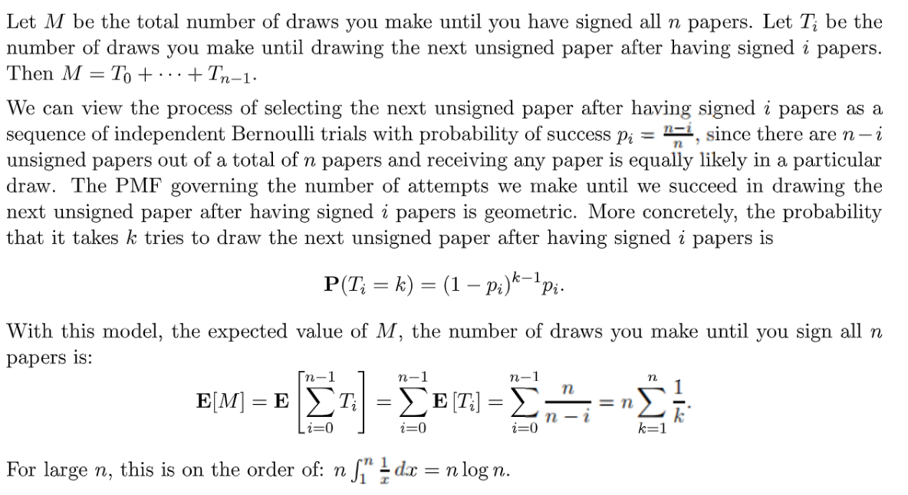
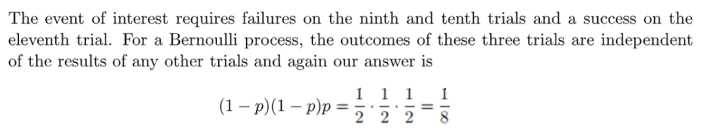
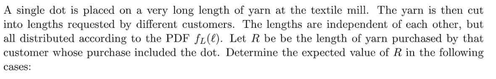
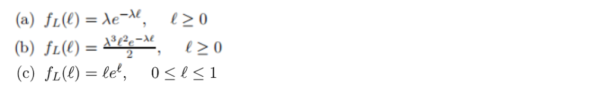
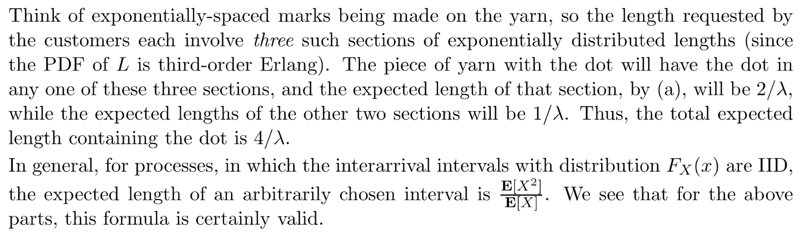
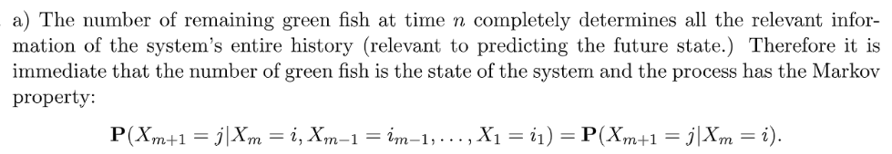
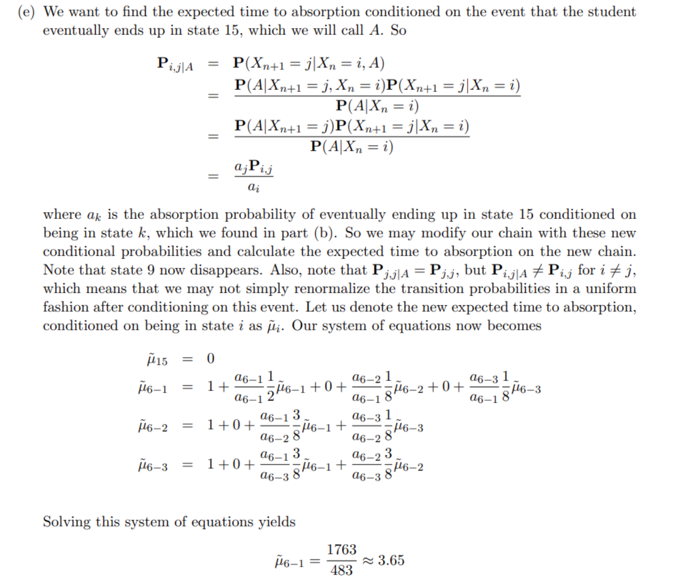
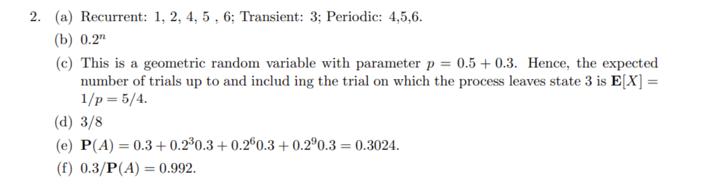

# 1 伯努利过程和泊松过程
## 1.1 Recitation Problems
[Recitation 14.pdf](https://www.yuque.com/attachments/yuque/0/2022/pdf/12393765/1661849479388-4eda8d68-e65c-4344-b9c5-fca6ee9c9762.pdf)
[Recitation 14_sol.pdf](https://www.yuque.com/attachments/yuque/0/2022/pdf/12393765/1661849479414-7d90c93f-7d66-49dd-902f-5cc6a298cb22.pdf)
[Recitation 15.pdf](https://www.yuque.com/attachments/yuque/0/2022/pdf/12393765/1661849584896-5290c0b8-a930-4329-9301-49fd587515c3.pdf)
[Recitation 15_sol.pdf](https://www.yuque.com/attachments/yuque/0/2022/pdf/12393765/1661849584954-6f0fe13e-dbb9-4786-a73f-931f0b486aae.pdf)
[Recitation 17.pdf](https://www.yuque.com/attachments/yuque/0/2022/pdf/12393765/1661849811614-28b53af8-1b67-4b61-82b2-4dc2905e9c8f.pdf)
[Recitation 17_sol.pdf](https://www.yuque.com/attachments/yuque/0/2022/pdf/12393765/1661849811651-6a7f9cf7-d478-4158-8e61-4a6456639ee4.pdf)

### P1 伯努利Interarrival Time
> 
> $(b)$问中的`tick`是跳蚤的意思

**(a) Interarrival Time**`Expected Time Between`其实就是我们的`Expected Interarrival Time`, 而我们知道`Interarrival Time`服从几何分布。
而几何分布又可以理解为若干个伯努利过程组成的分布，于是我们首先研究单个伯努利过程的`PMF`情况。由题意可知，我们可以将每一秒看成一次伯努利过程，记为随机变量$X$, 所以$X=\begin{cases} 1,bites\\0,no \space bites\end{cases}$, 而根据题意$P(X=1)=0.5\cdot 0.2=0.1$, $P(X=0)=0.5+0.5\cdot 0.8=0.9$, 于是$p_X(x)=\begin{cases} 0.1,X=1\\0.9,X=0\end{cases}$, 所以$X\sim Bernoulli(0.1)$。那么`Interarrival Time`记为$T$, $T=\sum_iX_i$, 所以$T\sim Geo(0.1)$, 所以$E[T]=\frac{1}{0.1}=10, Var(T)=\frac{1-0.1}{0.1^2}=90$
**(b) Merged Bernoulli **本题我们将蚊子和跳蚤这两个伯努利过程融合起来。跳蚤的伯努利过程的参数是$0.1*0.7=0.07$, 于是合成的伯努利过程参数是$0.07+0.1-0.07*0.1=0.163$
令$Y$为`Interarrival Time`, 所以:

### P2 伯努利和Pascal**⭐⭐⭐⭐⭐**
> 

**(a) Bernoulli**$P(3\space tails)=\frac{1}{8}$, 所以:

**(b) Pascal Distribution/Shifted Distribution⭐⭐⭐⭐⭐**
1. 假设随机变量$N$表示第$2$次`success`时总共经历的`Trials`, 这就是一个`2th Arrival Time`, 服从二阶`Pascal Distribution`。令$m=2$, 我们有:

而$p_{N}(k)=C_{k-1}^{m-1}p^{m-1}(1-p)^{k-m}p=C_{k-1}^{2-1}(\frac{1}{4})(\frac{3}{4})^{k-2}(\frac{1}{4})=C_{k-1}^{1}(\frac{1}{4})^{2}(\frac{3}{4})^{k-2}$, 而随机变量$K$表示第$2$次`success`前总共经历的`Trials`, 也就是说$K=N-1$, 所以$N$的函数图像要往左移动$1$个单位，于是$p_{K}(k)=C_{(k+1)-1}^{1}(\frac{1}{4})^{2}(\frac{3}{4})^{(k+1)-2}=p_{K}(k)=C_{k}^{1}(\frac{1}{4})^{2}(\frac{3}{4})^{k-1}$

2. 假设每次`Unsuccessful Trial`中`Tails`的数量是$X_i$, 则$M=X_1+\cdots+X_N$, $N$是第一次成功之前的`Trial`个数。所以$N=R-1$, 其中$R$满足几何分布$Geo(\frac{1}{4})$

根据: [随机数量的独立随机变量之和的期望与方差](https://www.yuque.com/alexman/kziggo/pgd0q0#gbuia)中的期望方差公式:
所以$E[M]=E[E[X_1+\cdots+X_N|N]]=E[NE[X]]=E[N]E[X]$
因为$E[R]=\frac{1}{\frac{1}{4}}=4$, 所以$E[N]=E[R]-1=3$
同时$E[X]=\sum_{i=1}^2 i\cdot P(X_i=i)=1\cdot \frac{1}{2}+2\cdot \frac{1}{2}=\frac{3}{2}$(注意是条件概率, 条件是`Unsuccessful trial`, 也就是至多两枚`Tails`, 每种情况的概率是$\frac{1}{2}$), 于是$E[M]=\frac{9}{2}$
方差的求法详见[方差分解公式](https://www.yuque.com/alexman/kziggo/pgd0q0#gbuia)：

**(c) 几何分布的和⭐⭐⭐**主要思路和[集卡问题](https://www.yuque.com/alexman/kziggo/qlp769#tZnuc)类似, 都是将几何分布相加。

### P3 集卡问题**⭐⭐⭐**
> 

**Key**主要思路和[集卡问题](https://www.yuque.com/alexman/kziggo/qlp769#tZnuc)类似, 都是将几何分布相加。

### P4 指数分布和Erlang **⭐⭐⭐⭐⭐**
> 
> 注意本题中我们需要决定使用$A$灯泡还是使用$B$灯泡。

**(a) 指数分布的期望**
**(b) 指数分布的CDF**令$D$是事件: 没有灯泡在$t$时间之前过期，于是
$P(D)=P(D|A)P(A)+P(D|B)P(B)$
假设灯泡$A$的寿命用随机变量$T_A$表示，灯泡$B$的寿命用随机变量$T_B$表示。
$P(D|A)=P(T_A>t)=\int_t^{\infty}e^{-x}dx=e^{-x}$, $P(D|B)=P(T_B>t)=\int_{t}^{\infty}3e^{-3x}dx=e^{-3x}$。
$P(D)=\frac{1}{2} \cdot e^{-x} + \frac{1}{2}\cdot e^{-3x}=\frac{1}{2}(e^{-x}+e^{-3x})$。
**(c) 条件概率**
**(d) Joint PDF ⭐⭐⭐⭐⭐**
**(e) 随机数量的独立随机变量之和⭐⭐⭐⭐⭐**这道题的理解是: 我们有很多灯泡，灯泡种类有等可能的两种, $A$和$B$。则整个过程从一个灯泡开始，当这个灯泡`Failure`了之后马上换下一个灯泡继续这个过程，直到`Failure`了$12$只灯泡。于是总照明时长$T=X_1+X_2+\cdots+X_{12}$, 其中$X_i$表示`Interarrival Time`，服从**不同参数的指数分布**。
题目让我们求的是这整个过程中由$B$种灯泡提供的总照明时长，不妨记为$I$, 题目中的`Failure`可以理解成`Arrival Time`, 每盏灯的照明时长可以理解为`Interarrival Time`。
于是假设$I=Y_1+\cdots+Y_N$, 其中$Y_i$表示$i^{th}$个$B$种灯泡的照明时长, 服从指数分布$Exp(3)$。注意这里$N$表示的是$12$只灯泡中$B$种灯泡的数量，所以$N\sim Binomial(12,\frac{1}{2})$。
于是$E[I]=E[E[I|N]]=E[N]E[Y_i]=6\cdot \frac{1}{3}=2$
同时$Var[I]=E[N]Var[Y_i]+(E[Y_i])^2Var[N]=6 \cdot \frac{1}{9}+(\frac{1}{3})^2(12\cdot \frac{1}{2}\cdot \frac{1}{2})=1$
**(f) 递归期望+无记忆性 ⭐⭐⭐⭐⭐**

### P5 Merge/Split Possion **⭐⭐⭐⭐**
> 
> 本题研究的对象有两个，一个是`Jobs`的`Arrival`(泊松过程), 另一个是`Jobs`的滞留时间。

**(a) Merged Possion Process**
**(b) Splitting Possion Process(Binomial)**
**(c) Splitting Possion Process(Geometric)**

### P6 Competing Exponentials**⭐⭐⭐⭐⭐**
> 

**Merged Possion Process以及泊松过程的独立性**思路参考[Light Bulb Example](https://www.yuque.com/alexman/kziggo/axmnmf#GUnjX)
因为$X,Y,Z$是独立的指数分布随机变量, 于是可以看成是三个独立的泊松分布（表示`First Arrival Time`）。

## 1.2 Tutorial Problems
[Tutorial 07.pdf](https://www.yuque.com/attachments/yuque/0/2022/pdf/12393765/1661849479426-548ed264-60d8-426e-a7ec-71ec45527b4d.pdf)
[Tutorial 07_sol.pdf](https://www.yuque.com/attachments/yuque/0/2022/pdf/12393765/1661849479477-52f8bbae-8028-4e8d-af88-a92dde5c588a.pdf)
[Tutorial 08.pdf](https://www.yuque.com/attachments/yuque/0/2022/pdf/12393765/1661849811671-a9050168-9c33-4115-b2d2-24a225068aca.pdf)
[Tutorial 08_sol.pdf](https://www.yuque.com/attachments/yuque/0/2022/pdf/12393765/1661849811936-266335ba-2ebe-46f3-b062-79afc0afef54.pdf)

### P1 Geo/Pascal分布/递归期望**⭐⭐⭐⭐⭐**
> 

**(a) Geometric Distribution**假设总共玩了$N$轮(每一轮都是Alice先Bob后, 总共两次)，则$P(N=n)=(1-\frac{1}{3}\cdot \frac{1}{3})^{n-1}\cdot(\frac{1}{3}\cdot \frac{1}{3})=(\frac{8}{9})^{n-1}\cdot (\frac{1}{9})$ 
所以`PMF`是$p_{N}(n)=(\frac{8}{9})^{n-1}\cdot (\frac{1}{9}),n=1,2,\cdots$
**(b) Shifted Pascal Distribution⭐⭐⭐⭐**令$Z=2T$,$T$服从三阶`Pascal Distribution`, 所以$p_T(t)=C_{t-1}^{3-1}(\frac{1}{3})^{3}(\frac{2}{3})^{t-3}$
于是$p_{Z}(z)=C_{\frac{1}{2}z-1}^{3-1}(\frac{1}{3})^{3}(\frac{2}{3})^{\frac{1}{2}z-3},z=6,8,10,12,...$
**(c) 无记忆性递归简化几何分布期望⭐⭐⭐⭐⭐**方法参考: [https://www.yuque.com/alexman/kziggo/qlp769#sqeCX](https://www.yuque.com/alexman/kziggo/qlp769#sqeCX)
我们可以使用递归的思想, 先定义如下四个互不相容的事件:

于是$E[N]=E[N|A_1]P(A_1)+E[N|A_2]P(A_2)+E[N|A_3]P(A_3)+E[N|A_4]P(A_4)$
$P(A_1)=\frac{2}{3}\cdot \frac{2}{3}=\frac{4}{9}$, $P(A_2)=\frac{2}{3}\cdot \frac{1}{3}=\frac{2}{9}$, $P(A_3)=\frac{1}{3}\cdot \frac{2}{3}=\frac{2}{9}$,$P(A_4)=\frac{1}{3}\cdot \frac{1}{3}=\frac{1}{9}$
$E[N|A_1]=1,E[N|A_4]=1+E[N]$
对于$E[N|A_2]$也就是在`Alice won the first round`的情况下，我们只需要等待`Bob wins`即可，所以$N|A_2\sim Geo(\frac{2}{3})$,于是$E[N|A_2]=\frac{1}{\frac{2}{3}}=\frac{3}{2}$。同理$E[N|A_3]=\frac{3}{2}$
所以$E[N]=1\cdot \frac{4}{9}+\frac{3}{2}\cdot \frac{2}{9}+\frac{3}{2}\cdot\frac{2}{9}+(1+E[N])\cdot \frac{1}{9}$
所以可以解得$E[N]=\frac{15}{8}$

### P2 Splitting Bernoulli Trials**⭐⭐⭐⭐**
> 

**使用Split Bernoulli Trial**几何分布随机变量的数值可以理解成伯努利过程的`Arrival Times`(伯努利变量取$1$的时间点)。

$Y$代表着`Arrival`的总次数，而$N$记录着我不接受`Arrival`的最长序列。$N$说白了就是即使`Arrival`发生了我也拖着不接受(概率为$1-q$，效果是$X_1+\cdots+X_N$的长度不断变长), 直到我觉得序列长度差不多了我才接受(概率为$q$)并终止伯努利过程。

### P3 **泊松过程的独立性⭐⭐⭐**
> 

**(a) 泊松过程的独立性**由于`Interarrival Time`彼此之间是独立的随机过程，所以在`day 0`有火车到达对于`day 1,2,3`有没有火车到达是没有影响的，用数学语言描述就是:
$P(no\space train\space on\space day\space 1,2,3|1\space train\space on \space day\space 0)=P(no\space train\space on\space day\space 1,2,3)\newline=P(0,3)=\frac{e^{-3\cdot 3}\cdot (3\cdot 3)^0}{0!}=e^{-9}$
**(b) 泊松过程的独立性**
**(c) 泊松过程的独立性**
**(d) 转换**

## 1.3 Assignment Problems
[Assignment 07.pdf](https://www.yuque.com/attachments/yuque/0/2022/pdf/12393765/1661849811579-c7346726-3d87-41ff-a13a-aac3abba29f4.pdf)
[Assignment 07_sol.pdf](https://www.yuque.com/attachments/yuque/0/2022/pdf/12393765/1661849811721-03323050-239e-4d94-9246-724125f47ec0.pdf)

### P1 Success before failure**⭐⭐⭐⭐⭐**
> 

**(a) ⭐⭐⭐⭐⭐**也就是必须在$jth$`failure`之前有多于$i$次的`success`(毕竟题目只说了$ith$`success`出现在$jth$`failure`之前，但没说第$i+1,i+2,\cdots$次`success`有没有出现在$jth$之前)，但有一点可以肯定，就是`success`次数不能超过当前总`trials`次数，也就是$i+j-1$。

**(b) ⭐⭐⭐**
**(c) 脑筋急转弯⭐⭐⭐**

### P2 Fred and Dog **⭐⭐⭐⭐⭐**
> 

**(a)**
**(b) 伯努利过程的无记忆性⭐⭐⭐**[伯努利过程的无记忆性](https://www.yuque.com/alexman/kziggo/qlp769#E4rt2)

**(c)**
**(d)**
**(e) ⭐⭐⭐**
**(f) ⭐⭐⭐⭐⭐**

### P3 Merge and Split Possion Process
> 

**Key**
> 本题也是非常经典，当出现$min$和指数分布结合的问题，我们都可以将其看做是`Merged/Splitted Possion`的问题，从而简化做法。

### P4 Random Incidence⭐⭐⭐⭐⭐
> 

**(a)**
**(b)**
**(c)**
> **这里我们可以记住一个重要的公式:**
> 对于`Random Incidence`的问题来说，假设`Interarrival Time`的分布$F_X(x)$已知，则给定一个时间点$t^*$, 包含这个时间点的区间长度的期望是$\frac{E[X^2]}{E[X]}$

### P5 Multinomial⭐⭐⭐⭐⭐
> 

**Key**

### P6 Conditional Possion⭐⭐⭐
> 

**(a)**
**(b)**
我们也可以从另一个角度想:
就是$P(M=m, N=n)$实际上就是在$(0,t]$上有$n$次到达，然后在$(t, t+s]$上有额外的$m-n$次到达，且这两个区间是互相独立的泊松分布。于是:
$p_{N,M}(n,m)=\frac{(\lambda t)^n e^{-\lambda t}}{n!}\times \frac{(\lambda s)^{m-n}e^{-\lambda s}}{(m-n)!}=\frac{\lambda^m s^{m-n}t^ne^{-\lambda(s+t)}}{(m-n)!n!}$
**(c)**
$p_{N,M}(n,m)=\frac{(\lambda t)^n e^{-\lambda t}}{n!}\times \frac{(\lambda s)^{m-n}e^{-\lambda s}}{(m-n)!}=\frac{\lambda^m s^{m-n}t^ne^{-\lambda(s+t)}}{(m-n)!n!}$
$P_M(m)=\frac{(\lambda(t+s))^{m}e^{-\lambda(t+s)}}{m!}$
$\begin{align}P_{N|M}&=\frac{\lambda^m s^{m-n}t^ne^{-\lambda(s+t)}}{(m-n)!n!}\times \frac{(\lambda(t+s))^{m}e^{-\lambda(t+s)}}{m!}\\&=\frac{s^{m-n}t^nm!}{(m-n)!n!} \times\frac{1}{(t+s)^m}\\&=C_m^n\frac{s^{m-n}t^n}{(t+s)^m}\end{align}$
**(d) 利用P5中的结论**⭐⭐⭐⭐⭐
**(e)**⭐⭐⭐

### P7 Erlang Distribution
> 

**(a) Erlang PDF**
**(b) Memoryless Property of Poisson**
**(c) 36-th order Erlang**
**(d) Erlang&Random Incidence**

# 2 马尔科夫过程
## 2.1 Recitation Problems 
[Recitation 18.pdf](https://www.yuque.com/attachments/yuque/0/2022/pdf/12393765/1661922769466-86fae530-97a6-4181-a79f-f47ab815c80c.pdf)
[Recitation 18_sol.pdf](https://www.yuque.com/attachments/yuque/0/2022/pdf/12393765/1661922769479-100c5ef9-84ef-4afb-9b84-87c19dfffa81.pdf)
[Recitation 19.pdf](https://www.yuque.com/attachments/yuque/0/2022/pdf/12393765/1661923063152-f766113f-069a-4a38-9bb5-17107c37eea9.pdf)
[Recitation 19_sol.pdf](https://www.yuque.com/attachments/yuque/0/2022/pdf/12393765/1661923063191-0410eb14-765e-4a88-a52c-f07d63188d20.pdf)

### P1 Setting up the Markov Chain
> 
> **Helper Video:**

[Helper Video 1.mp4](https://www.yuque.com/attachments/yuque/0/2023/mp4/12393765/1677231143782-2bbf0cc7-e381-4450-8b6b-3d561f237915.mp4)
**Setting Up the Markov Chain**
**(a)**
**(b) Transition Probability**
$p_{ij}=p_{ij}^{(1)}$表示一个时间步的跨度上，从`State i`到`State j`的概率是多少。
**(c)**

### P2 Walking Through Markov Chain
> 

> [!solution]
> **(a)**
> **(b)**
> **(c)**
> **(d)**
> **(e)**

### P3 Absorption Probability
> [!important]
> 

> [!solution]
> **(a) Set up Markov Chain**
> 
> **(b)** Absorption Probablity
> 
> 
> (c) Expected Time Until Absorption
> 
> 
> (d) Recursion in Expected Time Until Absorption
> 
> (e) Conditional Expected Time Until Absorption
> 
> (f) 

## 2.2 Tutorial Problems
[Tutorial 09.pdf](https://www.yuque.com/attachments/yuque/0/2022/pdf/12393765/1661922769484-aeba6569-0ee3-439d-9da0-3e7d624700f9.pdf)
[Tutorial 09_sol.pdf](https://www.yuque.com/attachments/yuque/0/2022/pdf/12393765/1661922769460-565a4a1e-e602-4ed8-8880-f1365e851d78.pdf)
[Tutorial 10.pdf](https://www.yuque.com/attachments/yuque/0/2022/pdf/12393765/1661923053972-0d3e31cc-ecdc-49f4-8ebb-d8bcc80463e2.pdf)
[Tutorial 10_sol.pdf](https://www.yuque.com/attachments/yuque/0/2022/pdf/12393765/1661923053870-d157e7eb-ebdb-46c8-8d10-148232b32092.pdf)

### Setting Up Markov Chain
> [!problem]
> 

> [!solution]
> 

### Classification of States
> [!problem]
> 

> [!solution]
> 

### Birth-Death Process
> [!problem]
> 

> [!Solution]
> 

## 2.3 Assignment Problems
[Assignment 08.pdf](https://www.yuque.com/attachments/yuque/0/2022/pdf/12393765/1661923041805-8ccfd154-45ee-4f2b-9f56-c788a01b7e67.pdf)
[Assignment 08_sol.pdf](https://www.yuque.com/attachments/yuque/0/2022/pdf/12393765/1661923041836-7a423078-01ea-4f0b-8f08-3a2c375001cf.pdf)
[Assignment 09.pdf](https://www.yuque.com/attachments/yuque/0/2022/pdf/12393765/1662189381143-d0077390-a006-4bab-913d-744be22a0e9d.pdf)
[Assignment 09_sol.pdf](https://www.yuque.com/attachments/yuque/0/2022/pdf/12393765/1662189381233-3c9f43dc-5e8e-48ad-a42d-92b350f5eaa1.pdf)
