# 1 Inequalities for Probability
## 1.1 One-sided Chebyshev Inequality
:::info
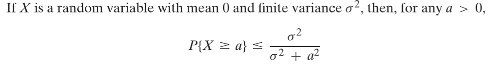
:::
**Proof**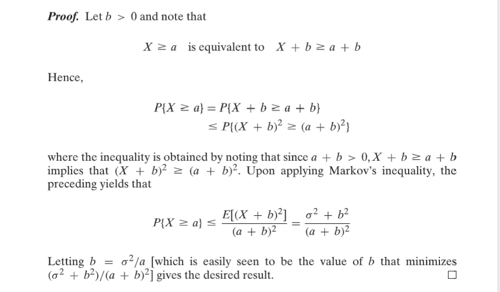
**Items Producing**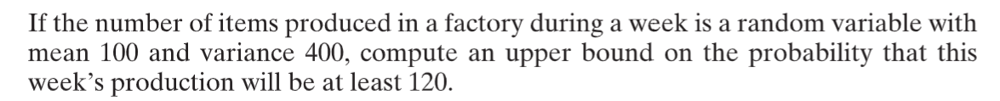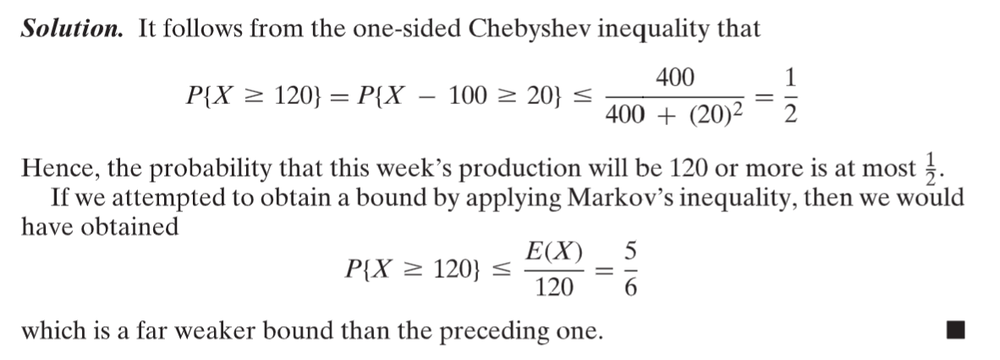
:::info
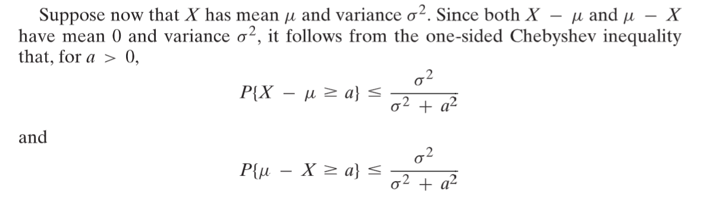
:::
> 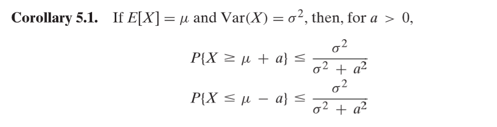

**Pairing Man and Woman**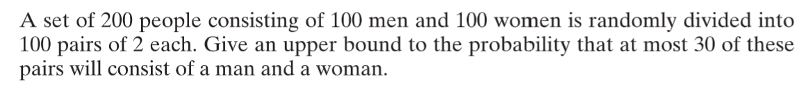
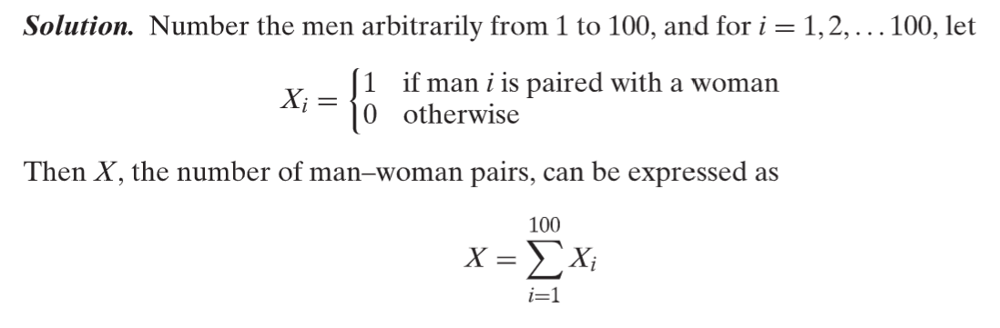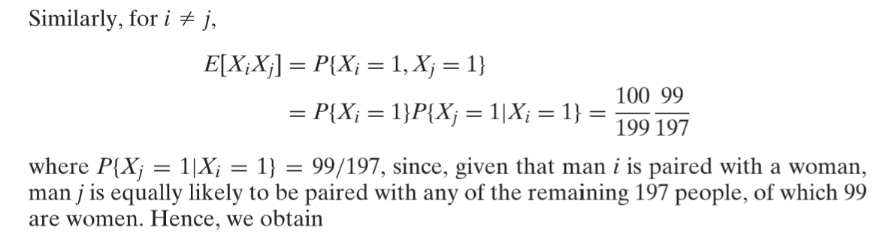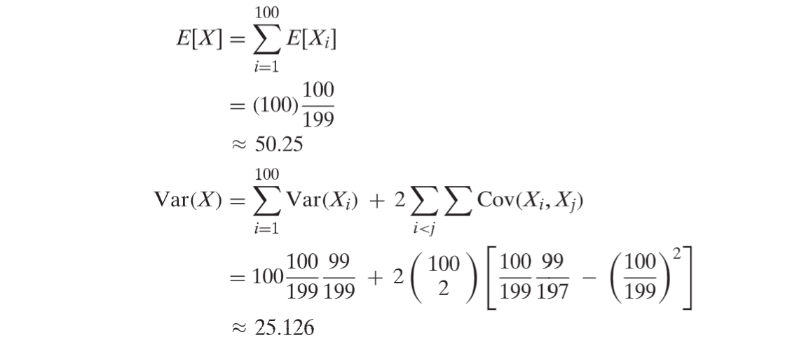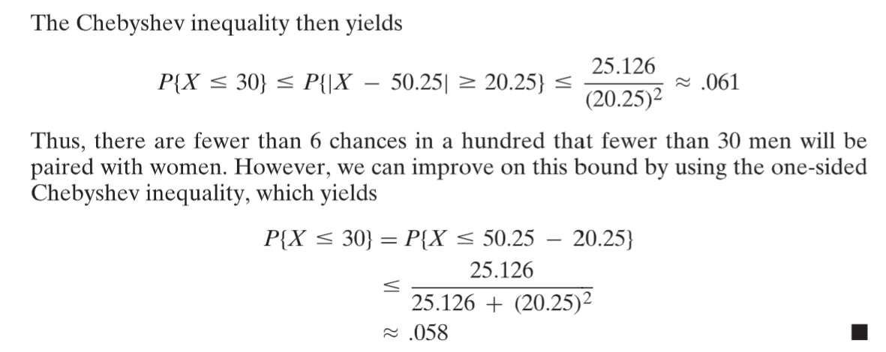

## 1.2 Chernoff Bounds Intro
> 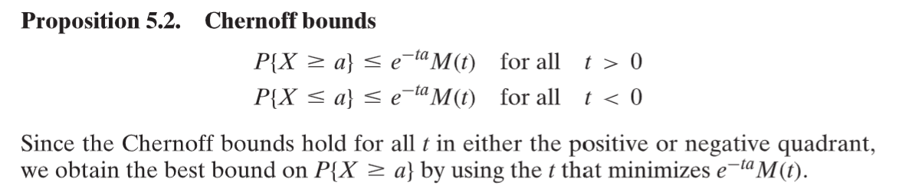

**Proof**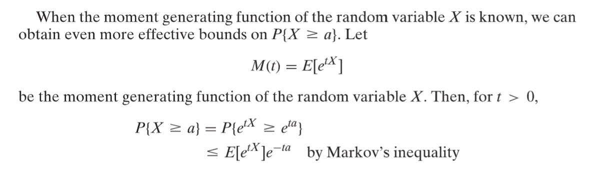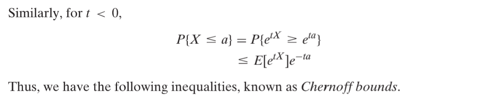
**Chernoff bounds for the standard normal random variable**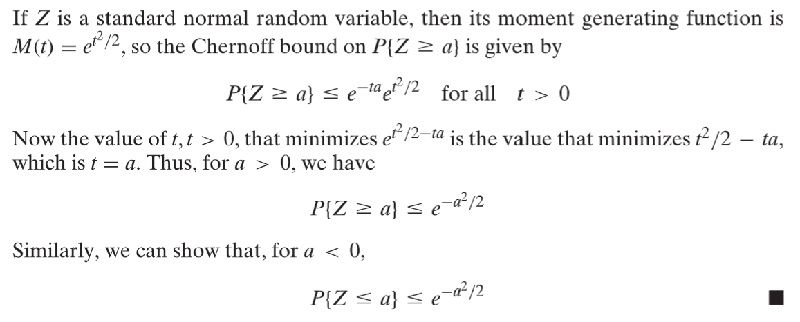
**Chernoff bounds for the Poisson random variable**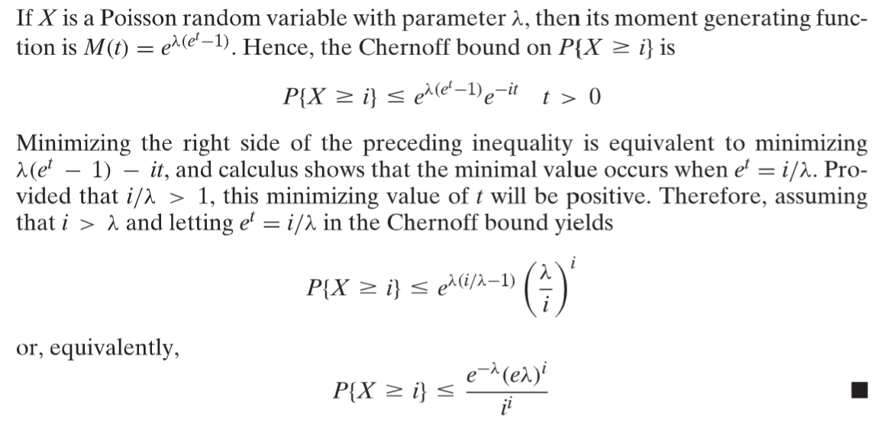
**Gambler(Symmetric Bernoulli, 麦克劳林级数)**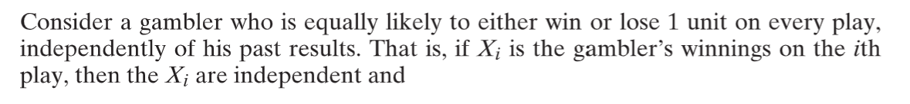
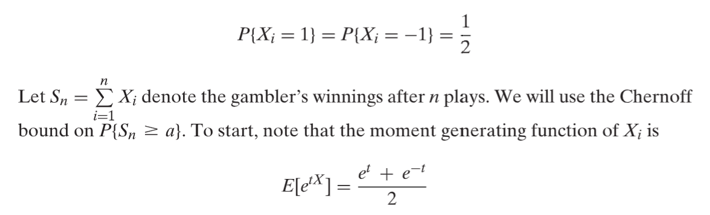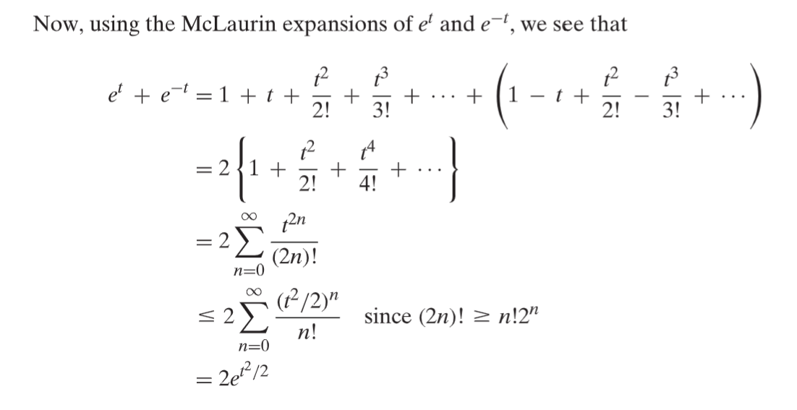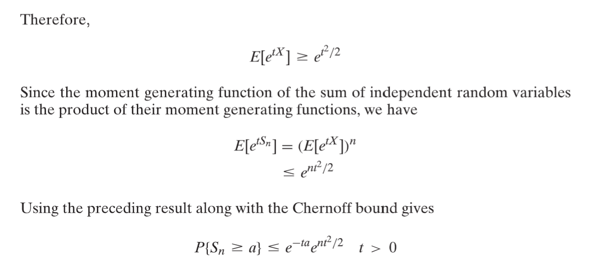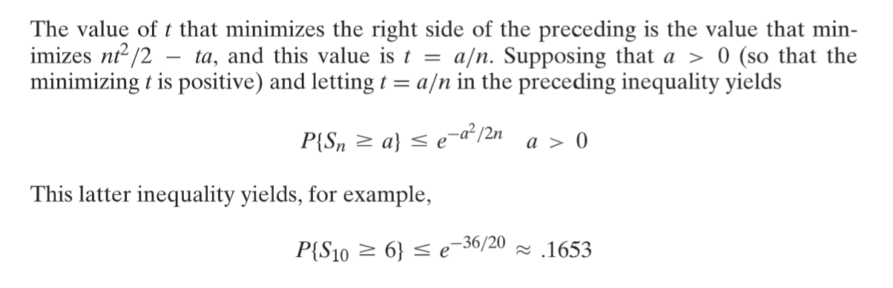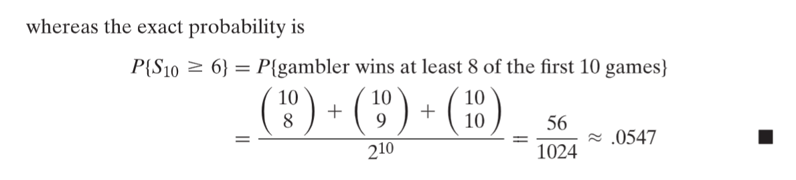

## 1.3 Hoeffding's Inequality
> 霍夫丁不等式和马尔科夫不等式在原理上是类似的，但是是一个更严格的不等式。
> 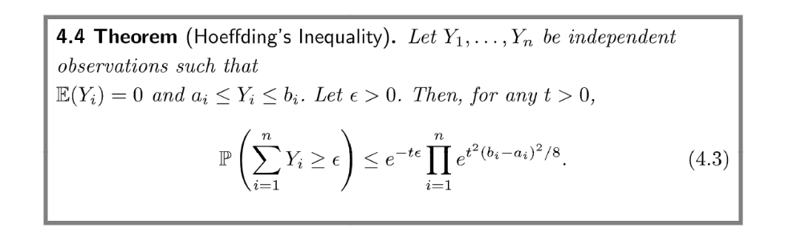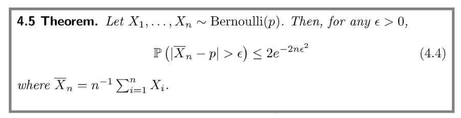

**Example**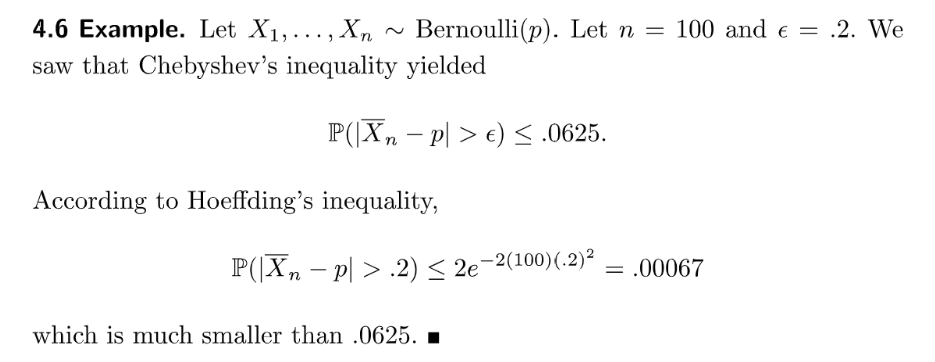

## 1.4 Mill's Inequality
> 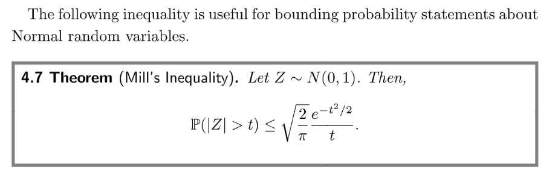

# 2 Inequalities for Expectation
## 2.1 Cauchy-Schwartz inequality
> 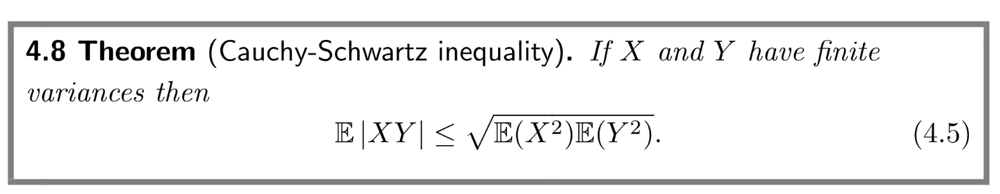

## 2.2 Jensen's Inequality
:::info
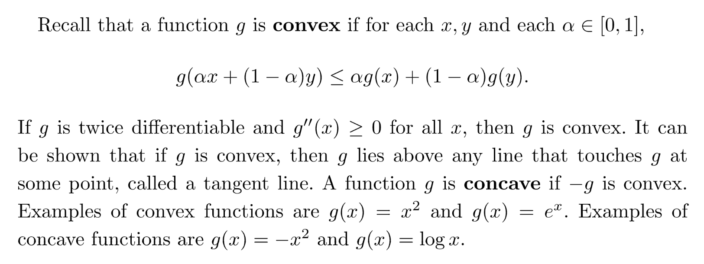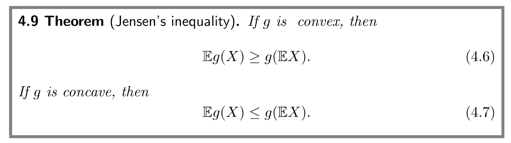
:::
**Proof -  Taylor Expansion**
**Proof - Tangent Function**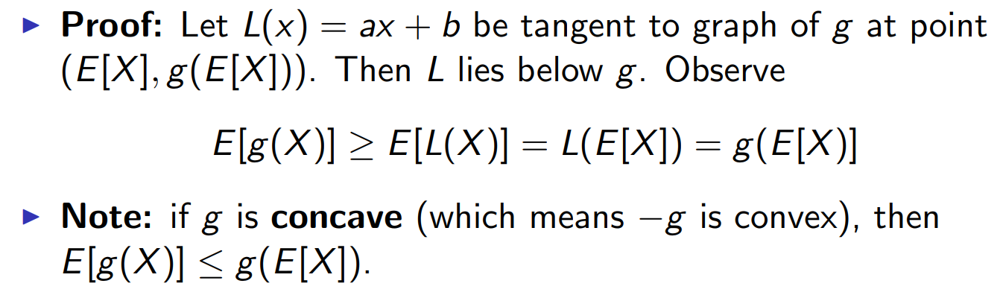
**Investor - Risk Neutral**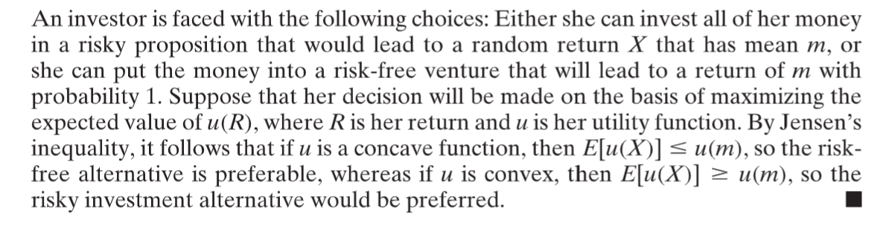

- 风险厌恶曲线是向上凸的(`Concave Function`)
- 风险喜好曲线是向下凸的(`Concise Function`)

# 3 More on Chernoff Bounds
[Chernoff bounds, and some applications.pdf](https://www.yuque.com/attachments/yuque/0/2022/pdf/12393765/1664435833600-b7e0c25a-b4bd-4c6c-b82a-4c044833d4db.pdf)

