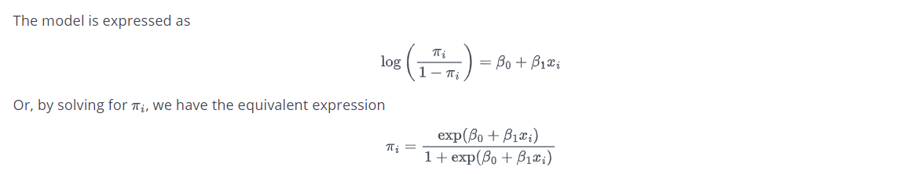
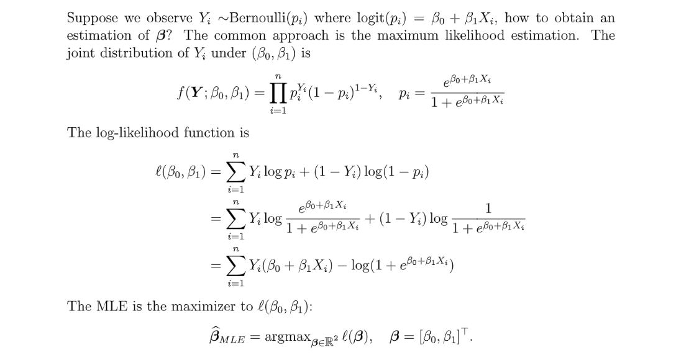

# 1 GLM- Concepts
## Components**⭐⭐⭐⭐⭐**
> 

## Model Assumptions
> 

## Examples of GLMs
### SLR
> 

### Binary Logistic Regression
> 

### Possion Regression
> 

# 2 Binary Logistic Regression
## O-Ring Shuttle Challenges
### Problem Setting
> 

**Visualization of the table**

### How to Model
> 
> 注意到这里的`Response` $Y_i$都是`Discrete`的数据。于是我们不能直接使用`Linear Regression`中的$Y=X\beta+\epsilon$的模型。
> **Remarks:**
> $\mathbb{P}[Y_i=1|X_i]$can be seen as $\mathbb{E}[Y|X=x]$, 本质上在用一个关于$x$的函数对某个概率建模。

## Model & Assumptions
> 
> **Model:**
> 
> **Assumptions:**
> 

## Logistic Function
> 
> **Remarks:**
> 1. The distribution of the response is dependent on $x$(data points)

## Link Function
> 
> 我们可以选择不同的`Link Function`来建立不同的`Generalized Linear Model`, 比如`Possion Regression`:

**Link Function Graph**

## MLE for beta
> 

### Loss Function
> 
> **Remarks:**
> 1. $Y_i\stackrel{i.i.d}\sim Bernoulli(p_i)$
> 2. $p_i$is dependent on $x_i$and $\beta$, namely $p_i=p(x_i,\beta)$。
> 3. No closed form solution, may use numerical methods like gradient descent.
> 4. $l(\theta)$ is concave. ($-l(\theta)$is convex, so that all local minimizers are global minimizer.)

### Hessian
> 

**Proof of its positive semi-definite**

### Parameter Updating
> 

### Odds
> Odds = $\frac{p_i}{1-p_i}=e^{\beta_0+\beta_1X_i}$

> 
> 1. $\beta_1>0$, odds increases as $X$increases.
> 2. $\beta_1<0$, odds decreases as $X$decreases.
> 
本质上`Odds`将`Input`和`Parameter`联系了起来。

## CI For Beta
### Sampling Distribution
> 
> 因为这里数据点不是`i.i.d.`的，所以这里的$I(\beta)$实际上是将所有的样本点看成是一个大样本点，也就是只有一条数据，但这个数据里面有$n$个数据点。

### Confidence Interval
> $\frac{\widehat{\beta_i}-\beta_i}{\sqrt{(I(\beta)^{-1})_{i+1,i+1}}}\rightsquigarrow \mathcal{N}(0,1)$
> $CI$for $\beta_i$is $\widehat{\beta_i}\pm z_{1-\alpha/2}\cdot \sqrt{[I(\hat{\beta})^{-1}]_{i+1,i+1}}$

> 

## Repeated Observation
> 

**Solution**
> 1. **Is the model sufficient?**
> 
$\begin{aligned}p_i=\frac{e^{\beta_0+\beta_1X_i}}{1+e^{\beta_0+\beta_1X_i}}&\implies \beta_0+\beta_1X_i=logit(p_i)\\&=log\frac{p_i}{1-p_i}\end{aligned}$
> $log\frac{p_i}{1-p_i}$
> 2. **How to find the MLE?**
> 

## Sufficient Statistics
> We say $T(\overline{X})$, $\overline{X}=\{X_1,\cdots, X_n\}$is sufficient statistic if $\mathbb{P}(X_1,\cdots, X_n|\theta)$is proportional to $\mathbb{P}(T(\overline{X})|\theta)$.

