> 详见`Lecture Notes`

> ERM is an approximation of risk minimization since $F$is not known, we estimate $F$by $F_n$

# 1 Basic Concepts
## What is Regression
:::info

$X_i$被称为`Predictor`, $Y_i$被称为`Response`。$X_i$可以是多维的向量。
:::

## Population Risk& Properties
### Basics
:::info
现在我们关注$X_i\in \mathbb{R}$的情况，此时$(X_i,Y_i)\in \mathbb{R}^2$。
我们可以将$(X_i,Y_i)$视为$(X,Y)$的`Realization`, 也就是说$(X,Y)$服从`Bivariate Distribution`, 其`PDF`为$f_{X,Y}(x,y)$。
我们的目标是基于$X$来预测$Y$, 而这种预测我们使用$g(X)$来表示。

:::

### Conditional Expectation
> 假设我们尝试基于数据$X$预测一个随机变量$Y$的值，一个常见的做法就是如果我们观测到一个$X=x$的样本点，我们去求$E[Y|X=x]$的值作为$Y$在这个样本点下的预测，而如果恰好$f_{Y|X}$是一个均匀分布的话，$E[Y|X=x]$实际上得到的结果就是在$X=x$的情况下所有$Y$的值的均值，如下图所示，如果我们对每个$X=x$都去求$E[Y|X=x]$, 则:
> 

### Properties of Conditional Expectation
> 

### Prediction Error
> 条件概率$E[Y|X]$是一个关于随机变量$X$的函数:
> $b(X)=\mathbb{E}[Y|X]$
> 这里我们使用$b$表示在观测到数据点$X=x$的情况下对$Y$的最佳估计(`Best Guess`)。那么对于这个`Guess`来说，如果我们要衡量其好坏，其中一种方法就是计算`Error`。
> 对于一组$(X,Y)$, $X$是数据，$Y$是真实值, $\mathbb{E}[Y|X]$是基于数据的预测值, 则`Error`的定义为:
> $D_w=Y-\mathbb{E}[Y|X]=Y-b(X)$
> 下标$w$提示我们这个`Error is a deviation _within_ a vertical strip-the difference between`$Y$and the center of the strip at the given value of $X$。

### Unbiasedness of Error
> 对于$D_w$我们有如下性质:
> $E(D_w|X)=E[Y|X]-E[b(X)|X]=b(X)-b(X)=0\tag{1}$
> $E[Y|X]=E[b(X)|X]\tag{2}$
> **换句话说，**`**deviations within the strip is**`$0$
> 对$(1),(2)$使用根据迭期望公式，我们有:
> $E[D_w]=0$, $E[b(X)]=E[Y]$
> 这两个重要性质。

### Prediction 和 Error 线性无关
> 这个结论不怎么显然，我们从定义出发，我们知道$D_w=Y-E[Y|X]$
> $\begin{aligned}Cov(g(X),D_w)&=E[g(X)D_w]-E[g(X)]E[D_w]\\&=E[E[g(X)D_w|X]]-0\\&=E[g(X)E[D_w|X]]\\&=E[0]\\&=0\end{aligned}$
> 所以我们证明了$g(X)$和$D_w$是不相关的事实。
> 而事实上，对于所有的`Prediction Functions` $h(X)$, 都有$h(X)\perp D_w$的事实。 
> **这个性质非常重要，我们称为**`**Orthogonality Property**`**。**

### Best Estimator
> 假设我们手头有数据$X$, 令$g(X)$是$X$的函数，我们想使用$g(X)$去预测$Y$, 于是我们定义这个`Predictor`$g(X)$的`Mean squared error`是:
> $MSE(g)=E[(Y-g(X))^2]$
> 下面我们将证明$b(X)=E[Y|X]$是最好的`Estimator`:
> $\begin{aligned} MSE(g)&=E[(Y-g(X))^2]\\&=E[(Y-b(X)+b(X)-g(X))^2)\\&=E[(D_w+h(X))^2]\\&=E[D_w^2]+E[h(X)^2]+2E[D_wh(X)]\\&=E[D_w^2]+E[h(X)^2]\\&\geq E[D_w^2]\\&=E[(Y-b(X))^2]\\&=MSE(b) \end{aligned}$
> 其中第三个等式我们令$h(X)=b(X)-g(X)$, 同时根据`Prediction`和`Error`无关的结论，$E[D_wh(X)]=0$。
> **上面的步骤的关键**在于将$Y-g(X)$分解成$Y-b(X)$和$b(X)-g(X)$的和。
> 于是我们得到了一个重要结论，就是在我们对`Prediction Function`没有任何限制，单从概率的角度出发，那么$b(X)=E[Y|X]$就是基于$X$的 关于$Y$的最好的`Predictor`。

### Conditional MSE
> 

### 方差分解公式
> 

**Graph**
> 在[方差分解公式](https://www.yuque.com/alexman/kziggo/pgd0q0#jM0AJ)中，我们已经推导过如何将方差表示为一个期望加上一个方差的形式，这里我们复习一下：
> 

## Probablistic Model
:::info

:::
**Proof**We first prove that $U$ and $X$ are independent by finding the convariance matrix of $U$ and $X$.
First we can find the relationship as follows:
$\begin{align}\begin{bmatrix} U\\X\end{bmatrix}=\begin{bmatrix} -\frac{\rho \sigma_Y}{\sigma_X}&1\\1&0\end{bmatrix}\begin{bmatrix}X\\Y\end{bmatrix}+\begin{bmatrix}-\mu_Y+\frac{\rho \sigma_Y}{\sigma_X}\mu_X\\0\end{bmatrix} \nonumber\end{align}$
and denote $\begin{bmatrix} -\frac{\rho \sigma_Y}{\sigma_X}&1\\1&0\end{bmatrix}$ by $A\in \mathbb{R}^{2\times 2}$, and $\begin{bmatrix}-\mu_Y+\frac{\rho \sigma_Y}{\sigma_X}\mu_X\\0\end{bmatrix}$ by $b\in \mathbb{R}^2$ and that $\Sigma_{XY}=\begin{bmatrix}\sigma_X^2&\rho \sigma_X\sigma_Y\\ \rho\sigma_X\sigma_Y&\sigma_Y^2 \end{bmatrix}$
Thus by the linear invariance of joint Gaussian random variable, we have:
$\begin{align}\begin{bmatrix} U\\X\end{bmatrix}&\sim \mathcal{N}(\mathbf{A}\begin{bmatrix} \mu_X\\\mu_Y\end{bmatrix}, \mathbf{A}\Sigma_{XY}\mathbf{A}^T) \nonumber \\&\mathcal{N}(\begin{bmatrix} 0\\\mu_X \end{bmatrix}, \begin{bmatrix}(1\rho^2)\sigma_Y^2&0\\0&\sigma_X^2 \end{bmatrix})\nonumber\end{align}$
which shows that $Cov(U,X)=0$, which directly implies that $U$ and $X$ are independent.
We then proof that $\mathbb{E} (Y | X) = \mu_Y + \frac{\rho\sigma_Y}{\sigma_X}(X-\mu_X)$
Since $Y=\mu_Y+U+\frac{\rho \sigma_Y}{\sigma_X}$, we have the following derivation:
$\begin{align}E[Y|X]&=E[\mu_Y+U+\frac{\rho \sigma_Y}{\sigma_X}(X-\mu_X)|X] \nonumber \\ &= E[\mu_Y|X]+E[U|X]+E[\frac{\rho \sigma_Y}{\sigma_X}(X-\mu_X)|X]\tag{By the linearity of expectation} \\&=\mu_Y+E[U]+\frac{\rho \sigma_Y}{\sigma_X}(X-\mu_X) \tag{By the independence between U and X}\\&=\mu_Y+\frac{\rho \sigma_Y}{\sigma_X}(X-\mu_X) \nonumber \end{align}$

## Global Minimizer under L2-Loss
:::info
假设$(X,Y)\sim f_{X,Y}(x,y)$, 且我们的`Prediction Function`是$g(\cdot)$, 则我们的目标是要最小化:

那么怎么找到这个`Global Minimizer`呢? 我们先给出结论:

:::
**Proof of Theorem 6.1.1(Hard To Grasp, please refer to previous similar proof)**

## Empirical Risk Minimization
:::info
上面做的一系列关于`Best Estimator`是$\mathbb{E}[Y|X]$的推导，都是建立在我们知道$f_{X,Y}(x,y)$的联合概率分布，也就是有无数个样本的时候，才成立。显示生活中我们只能获取有限的$n$组$(X_i,Y_i)$数据点，可以看成是`Realization of a bivariate distribution`。于是我们的损失函数就不能简单的写成:
$\mathbb{E}[(Y-g(X))^2]$
下文我们就将给出统计学上的解决方案。
:::
> 如果有无数个样本，我们可以定义`Population Risk` $R(f)$:
> $R(f)=\mathbb{E}_{(X,Y)\sim F_n(x,y)}\mathbb{E}[Y-f(X)^2]$
> 如果我们只有$n$个样本点$(X_i,Y_i)$, 则我们可以通过之前学过的`ECDF`方法使用$F_n(x,y)$来估计$F_{X,Y}(x,y)$, 于是我们有:
> 
> 且我们的损失函数`Empirical Risk Function` $R_n(f)$可以定义为: 
> $R_n(f)=\frac{1}{n}\sum_{i=1}^n (Y_i-f(X_i))^2$
> 此时我们只要找到能够最小化这个损失的`Prediction Function` $g(x)$即可。
> 同时我们注意到$\mathbb{E}[R_n(f)]=R(f)$, 因为$(X_i,Y_i)\sim F_{X,Y}(x,y)$, 所以
> $\begin{aligned}\mathbb{E}[R_n(f)]&=\mathbb{E}[\frac{1}{n}\sum_{i=1}^n (Y_i-f(X_i))^2] \\&=\frac{1}{n}\sum_{i=1}^n\mathbb{E}[(Y_i-f(X_i))^2]\\&=\frac{1}{n}\sum_{i=1}^n
\iint_{(X_i,Y_i)\in R}(Y_i-f(X_i))^2f_{X,Y}(x_i,y_i)dxdy\\&=\frac{1}{n}\sum_{i=1}^n \mathbb{E}[(Y-f(X))^2]\\&=\mathbb{E}[(Y-f(X))^2]\\&=R(f)\end{aligned}$
> 但是问题是, 如果我们不对$f(X)$做任何限制，则如果我们选取一个$f(X)$使得$\forall X_i$ ,$f(X_i)=Y_i$, 则我们很容易使得`Training Error`为零，如下图:
>  
> 同时，在上图的情况中，这样的$f(X_i)$也是不唯一的。

## Occam's Razor
> **Principle:** Find the** simplest model **that fits the data.
> In practice, we restrict $f\in F$, $F$is a family of function and minimize $R_n(f)$
> $R_n(f)=\frac{1}{n}\sum_{i=1}^n (f(X_i)-Y_i)^2$
> 1. **Linear Functions:** $f(X)=\beta_0+\beta_1\cdot X$(Linear Regression)
> 2. **Polynomial:** $f(X)=\beta_0+\beta_1\cdot X+\cdots \beta_d X^d$(Polynomial Regression), if $d$increases, $F$gets larger.
> 3. If $F$becomes richer, **bias is smaller, and variance is larger**, If $F$becomes more sterile, bias is larger, and variance is smaller.

# 2 SLR-General
[ECON-SHU301-CH4.pdf](https://www.yuque.com/attachments/yuque/0/2022/pdf/12393765/1669355855347-01c83351-be54-4db3-8a9c-ed53d372ea55.pdf)
> Supplementals

## Definition&Notations
> 
> **Remarks:**
> 1. $Y$被称为`Response`或者`Dependent Variable`
> 2. $X$被称为`Predictor, explanatory`或者`Independent Variable`。`Predictor Variable`最为常用。
> 

## Model Assumptions
:::info
我们定义模型如下:
$Y_i=\beta_0+\beta_1\cdot X_i+\epsilon_i$, 写成矩阵形式就是$\mathbf{Y=X\beta+\epsilon}$
:::
### Assumptions on Error
:::info
$\epsilon\sim \mathcal{N}(0,\sigma^2)$, 即 $E[\epsilon_i]=0, \mathbb{V}[\epsilon]=\sigma^2$
Any pair of error terms are **uncorrelated: **$Cov(\epsilon_i,\epsilon_j)=E[\epsilon_i\epsilon_j]=0,~~\forall i\neq j$
注意，这里假设$\epsilon_i$之间是`Uncorrelated`, 但是没有说$\epsilon_i$是互相独立的。
:::

### Assumptions about Y and X
:::info

1. **所有**$X_i$**都是已知的常数**，而$Y_i$被表示成$\epsilon_i$的函数，且因为$\epsilon_i$是随机噪声，所以$Y_i$**是一个随机变量。**
2. **Expectation**

3. **Variance**

4. **Correlation: **因为`Error`是`Uncorrelated`的，所以$Cov(Y_i,Y_j)=0,~~\forall i\neq j$
:::

## Parameter Interpretations
> [https://www.joshuapkeller.com/page/introregression/slr.html](https://www.joshuapkeller.com/page/introregression/slr.html)

## Least Square Estimators
### Index Form
> 
> 注意这个`LSE`其实用不到我们的关于$\epsilon_i$的假设。

**Proof of Lemma 6.2.1**
观察$\widehat{\beta_1}$可知，分子实际上是$\{(X_i,Y_i)\}_{i=1}^n$这个样本集的`Sample Covariance`.

### Notations
:::info

:::

### Matrix Form
> **Basic Settings:**
> 
> **Empirical Loss:**
> $R_n(f)=\epsilon^T\epsilon=\mathbf{(Y-X\beta)^T(Y-X\beta)}$
> **Basic Matrix Caculus:**
> $\begin{align} f(x)=x^TAx\end{align}$, what is $\frac{df}{dx_i}$and $\frac{d^2}{dx_i} f$?
> 1. Jacobian: $2Ax$
> 2. Hessian: $2A$ 
> 
**Loss Minimization by matrix calculus:**
> $\begin{align} \nabla{\beta}&=\mathbf{\frac{\partial R_n(f)}{\partial \beta}}\mathbf{(Y-X\beta)^T(Y-X\beta)}\\&=\frac{\partial R_n(f)}{\partial \beta}\mathbf{Y^TY-Y^TX\beta-\beta^TX^TY+\beta^TX^TX\beta} \\&=\mathbf{-2X^TY+2X^TX\beta}=0 \end{align}$  (Normal Equation)
> Thus $\beta = \mathbf{(X^{T}X)^{-1}(X^{T}Y)}$if $\mathbf{X^TX}$exists.

### Unbiasedness
:::info
$\hat{\beta}=\mathbf{(X^TX)^{-1}X^TY}$, 我们知道$X_i$是已知的数据，$\epsilon_i$不能在数据中观测到，于是$Y_i$对我们来说就是一个随机变量，$\mathbb{E}[\hat{\beta}]=\mathbf{(X^{T}X)^{-1}X^T}\mathbb{E}[Y]=\mathbf{(X^{T}X)^{-1}(X^{T}X)\beta}=\beta$
:::

### (Co)variance
:::info
$Cov(\widehat{\beta_{OLS}})=\mathbb{E}[(\widehat{\beta_{OLS}}-\mathbb{E}[\widehat{\beta_{OLS}}])(\widehat{\beta_{OLS}}-\mathbb{E}[\widehat{\beta_{OLS}}])^T]$
$\widehat{\beta_{OLS}}-\beta=(X^TX)^{-1}X^TY-\beta=(X^TX)^{-1}X^T(X\beta+\epsilon)-\beta=(X^TX)^{-1}X^T\epsilon=\mathbb{E}[(X^TX)^{-1}X^T\epsilon\epsilon^TX(X^TX)^{-1}]=(X^TX)^{-1}X^T\mathbb{E}[\epsilon\epsilon^T]X(X^TX)^{-1}$
因为$\mathbb{E}[\epsilon\epsilon^T]=\sigma^2\mathbf{I_n}$, 于是最终结果是$\sigma^2 (X^TX)^{-1}X^TX(X^TX)^{-1}=\sigma^2(X^TX)^{-1}$，这经常被称为`Precision Matrix`
上述结果也可以推广到$\epsilon_i$之间是独立的情况。
:::
### R Code

## Mean Response
:::info
根据之前的`Model Assumption`中，我们知道$Y_i\sim \mathcal{N}(\beta_0+\beta_1X_i,\sigma^2)$
于是`Mean Response`在$x_0$可以定义为$\mathbb{E}[Y|X=x_i]=\beta_0+\beta_1*x_0$
:::

## B.L.U.E
[ECON-SHU301-CH6.pdf](https://www.yuque.com/attachments/yuque/0/2022/pdf/12393765/1669613181814-6d6e68b4-6877-43b0-8cfd-2bb3738959ec.pdf)
### BLUE for beta
> 上文中得到的`LSE`被称为基于$Y_1,\cdots, Y_n$的`Linear Functions`，换句话说，$\beta_0$和$\beta_1$都可以写成$Y's$的线性组合。
> **为什么**`**Estimator**`** **$\mathbf{\beta}$**可以被写成**$Y_i$**的线性组合?**
> 因为$Y_i=\beta_0+\beta_1\cdot X_i+\epsilon_i$含有关于$\beta_0$和$\beta_1$的信息。
> 
> **我们以寻找**$\beta_1$**为例，**$\beta_0$**的推导在逻辑上类似：**
> 
> **Variance:**
> 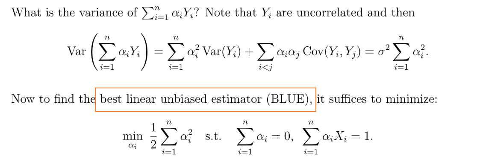
> **我们使用拉格朗日乘子法来求解：**
> 
> **详细求解步骤:**
> 
> 其中$S_{xx}=\sum_{i=1}^n(X_i-\overline{X}_n)^2$, 所以:
> $\hat{\beta_1}=\frac{\sum_{i=1}^n(X_I-\overline{X}_n)(Y_i-\overline{Y}_n)}{\sum_{i=1}^n(X_i-\overline{X}_n)^2}$，这和我们之前在`Simple Linear Regression`中解出的是一样的。

### BLUE for mean response
:::info
我们可以使用`Lease Squared Estimator`来估计`Mean Response`, 也就是用$\hat{\beta_0}+\hat{\beta_1}x_0$来估计$\beta_0+\beta_1x_0$
:::
**Proof**We first compute the $\widehat{\mathbb{E}[Y|X=x]}$(Estimator for $\mathbb{E}[Y|X=x]$). Note that the BLUE estimator for $\beta_0+\beta_1*x_0$ is the linear combination of $\mathbf{Y}$ and we will deduce the form of its estimator by the following optimization problem:
$\begin{align}\mathbb{E}[\sum_{i=1}^n \alpha_i Y_i]&=\beta_0*\sum_{i=1}^n \alpha_i+\beta_1*\sum_{i=1}^n \alpha_iX_i=\beta_0+\beta_1*x_0 \tag{Unbiasedness}\\\mathbb{V}(\sum_{i=1}^n \alpha_i Y_i)&=\sigma^2\sum_{i=1}^n \alpha_i^2 \tag{Minimize the variance}\\ \min \frac{1}{2}\sum_{i=1}^n \alpha_i^2,&~~s.t.~~ \sum_{i=1}^n \alpha_i=1,~\sum_{i=1}^n \alpha_iX_i=x_0 \nonumber\\ \min L(\alpha_i,\mu,\lambda)&= \frac{1}{2}\sum_{i=1}^n \alpha_i^2-\lambda\sum_{i=1}^n \alpha_i-\mu(\sum_{i=1}^n \alpha_iX_i-1) \nonumber\end{align}$
By taking the derivative and fitting in the constraints we could get:
$\begin{align}\alpha_i&=\lambda + \mu X_i \nonumber\\ \lambda+\overline{X}_n \mu&=\frac{1}{n} \nonumber\\n \overline{X}_n +\sum_{i=1}^n X_i^2\mu &=x_0 \nonumber\end{align}$
We let $S_{xx}=\sum_{i=1}^n (X_i\overline{X}_n)^2$ and solve the equation we get:
$\begin{align}\mu&=\frac{x_0-\overline{X}_n}{S_{xx}} \nonumber\\ \lambda &= \frac{1}{n}-\frac{(x_0-\overline{X}_n)}{S_{xx}} \nonumber\\ \alpha_i &= \frac{1}{n}-\frac{(x_0-\overline{X}_n)\overline{X}_n}{S_{xx}}+\frac{(x_0-\overline{X}_n)X_i}{S_{xx}} \nonumber\\ \sum_{i=1}^n \alpha_iY_i &= \sum_{i=1}^n (\frac{1}{n}-\frac{(x_0-\overline{X}_n)\overline{X}_n}{S_{xx}}+\frac{(x_0-\overline{X}_n)X_i}{S_{xx}}) \nonumber \\ &= \overline{Y}_n +\frac{x_0-\overline{X}_n}{S_{xx}}\sum_{i=1}^n (X_i-\overline{X}_n)(Y_i-\overline{Y}_n) \nonumber\\ &= \hat{\beta_0}+\hat{\beta_1}*x_0 \nonumber\end{align}$
Thus we can use $\hat{\beta_0}+\hat{\beta_1}*x_0$ as B.L.U.E for $\mathbb{E}[Y|X=x_i]$ 

# 3 SLR- Under Normal Error
## Model Assumptions
### Model Settings
> 之前的`Simple Linear Regression Model`中，我们讨论了一般化的情况，即$\epsilon_i$是`Uncorrelated`而不是一定是`Independent`的情况。而`Normal Error Model`假设$\epsilon_i$是`Normal Error`的。
> 

### Distribution of Y_i
:::info
$Y_i\sim \mathcal{N}(\beta_0+\beta_1X_i,\sigma^2)$
:::

## Estimators for Beta& Sigma
### LSE for beta
:::info
我们已经计算过:
$\mathbf{J(\beta)}=\sum_{i=1}^n \epsilon_i^2=\mathbf{(y-X\beta)^T(y-X\beta)}$ through derivative:
$\begin{align}\frac{\partial J}{\partial \mathbf{\beta}}& =\frac{\partial}{\partial \mathbf{\beta}}(\mathbf{y^Ty-y^TX\beta-\beta^{T}X^{T}y+\beta^{T}X^{T}X\beta}) \nonumber\\&=\mathbf{-2X^Ty+2X^TX\beta}=0 \nonumber \end{align}$
Thus the OLS for normal error model is
 $\mathbf{\hat{\beta}}_{OLS}=\mathbf{(X^TX)^{-1}X^Ty}=\mathbf{(X^TX)^{-1}X^T(\mathbf{X}\beta+\epsilon)}=I_n\beta+(X^TX)^{-1}X^T\epsilon$
:::

### MLE for beta matches LSE
:::info
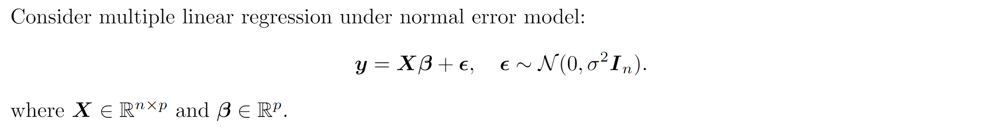
$\mathbf{Y=X\beta +\epsilon}$, $\hat{\beta}=\beta+\mathbf{(X^TX)^{-1}X^T\epsilon}$
:::
**Proof**We first calculate the least square estimator by minimizing $\mathbf{J(\beta)}=\sum_{i=1}^n \epsilon_i^2=\mathbf{(y-X\beta)^T(y-X\beta)}$ through derivative:
$\begin{align}\frac{\partial J}{\partial \mathbf{\beta}}& =\frac{\partial}{\partial \mathbf{\beta}} (\mathbf{y^Ty-y^TX\beta-\beta^{T}X^{T}y+\beta^{T}X^{T}X\beta}) \nonumber\\&=\mathbf{-2X^Ty+2X^TX\beta}=0 \nonumber \end{align}$
Thus the LSE for normal error model is $\mathbf{\hat{\beta}}_{LSE}=\mathbf{(X^TX)^{-1}X^Ty}$
We then compute the MLE for normal error model and we know the log-likelihood function looks like:
$\begin{align}    l(\mathbf{\beta},\sigma^2)&=-\frac{n}{2}log\sigma^2-\frac{n}{2\sigma^2}\mathbf{(y-X\beta)^T(y-X\beta)} \nonumber\end{align}$
And we notice that, $\forall \beta\in \mathbb{R}^p, \sigma^2\in \mathbb{R}$, we have the following relationship:
$\begin{align} l(\mathbf{\beta},\sigma^2)&=-\frac{n}{2}log\sigma^2-\frac{n}{2\sigma^2}\mathbf{(y-X\beta)^T(y-X\beta)} \nonumber\\ &\leq -\frac{n}{2}log\sigma^2-\frac{n}{2\sigma^2}\mathbf{(y-X\hat{\beta})^T(y-X\hat{\beta})} \nonumber\end{align}$, where $\mathbf{\hat{\beta}}=\hat{\beta}_{LSE}$
And under this condition we take the derivative w.r.t $\sigma^2$:
$\begin{align}\\ \frac{\partial l}{\partial \sigma^2}&=\frac{1}{2\sigma^2}(\mathbf{(y-X\hat{\beta})^T(y-X\hat{\beta})}-n\sigma^2)=0 \nonumber\\ \widehat{\sigma^2}&=\frac{\mathbf{(y-X\hat{\beta})^T(y-X\hat{\beta})}}{n} \nonumber\\ \frac{\partial^2 }{\partial (\sigma^2)^2}&=\frac{n}{2\sigma^4}-\frac{1}{\sigma^6}(\mathbf{(y-X\hat{\beta})^T(y-X\hat{\beta})}) \nonumber \\ \frac{\partial^2 }{\partial (\widehat{\sigma^2})^2}&=\frac{n^3}{2((\mathbf{y-X\hat{\beta}})^T(\mathbf{y-X\hat{\beta}}))^2}-\frac{n^3}{((\mathbf{y-X\hat{\beta}})^T(\mathbf{y-X\hat{\beta}}))^2} \nonumber\\&=-\frac{n^3}{2((\mathbf{y-X\hat{\beta}})^T(\mathbf{y-X\hat{\beta}}))^2}  <0 , \forall n\in \mathbb{R} \nonumber\end{align}$
Thus, we can safely conclude that $\begin{cases}\hat{\beta}_{MLE}=\hat{\beta}_{LSE}\\ \widehat{\sigma^2}=\frac{\mathbf{(y-X\hat{\beta}_{MLE})^T(y-X\hat{\beta}_{MLE})}}{n}\end{cases}$ above are the global maximizer for the log-likelihood function.
Thus, when $\epsilon\sim \mathcal{N}(0,\sigma^2\mathbf{I}_n)$, the LSE and MLE match.
:::info
`**MLE**`**for **$\mathbf{\beta}$**:**
$\frac{\partial l}{\partial \beta}=-\frac{1}{\sigma^2}\mathbf{X^T(X\beta-Y)}$
$\frac{\partial l}{\partial \beta^2}=-\frac{\mathbf{X^TX}}{\sigma^2}=-I(\beta)$
$\hat{\beta}-\beta\sim \mathcal{N}(0,I^{-1}(\beta))=\mathcal{N}(0,\sigma^2(\mathbf{X^{T}X})^{-1})$
$\hat{\beta}$achieves the Cramer-Rao Bound, no proof is provided.
:::

### MLE for sigma^2
> 

**Proof**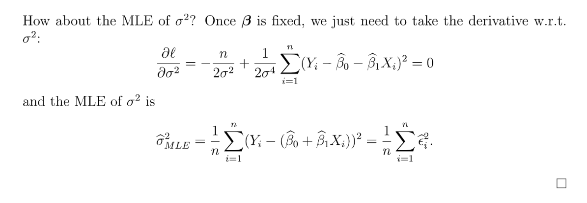
$\widehat{\sigma^2}=\frac{1}{n}||\mathbf{X\hat{\beta}}-Y ||^2$

### MLE for mean response
:::info
根据`Equivariance of MLE`, 我们可以选择$\hat{\beta_0}+\hat{\beta_1}x$作为`Mean Response`的`MLE`估计，前提是我们的模型具有`Normal Error Assumption`
:::

### Hat Matrix
:::info
我们使用$\hat{\beta}=\beta+\mathbf{(X^TX)^{-1}X^T\epsilon}$这个式子，左右同乘以$\mathbf{X}$得到:
$\mathbf{X}\hat{\beta}-\mathbf{Y}=\mathbf{X}\beta+\mathbf{X}\mathbf{(X^TX)^{-1}X^T\epsilon-\mathbf{X\beta}-\epsilon}=(\mathbf{(X(X^TX)^{-1})X^T}-\mathbf{I})\epsilon=\mathbf{(H-I)\epsilon}$
其中$\mathbf{H=X(X^TX)^{-1})X^T}$, 称为`Hat Matrix`。
关于`Hat Matrix`，我们有如下性质, Let $X:\mathbb{R}^{n\times p}$m $\mathbf{X^TX}$is invertible $iff$$X$is full column rank:

1. $\mathbf{H}$is symmetric.
2. $\mathbf{H}$is projection matrix. 我们可以很快证明这个结论，因为$\mathbf{H^2=H}$且$\mathbf{H^T=H}$
3. $Rank(\mathbf{H})$and Eigenvalue of $\mathbf{H}$?  

$Rank(\mathbf{H})=\mathbf{Tr(H)}=p$, 
$\mathbf{Tr(AB^T)=Tr(B^TA)}$, 因为$\mathbf{Tr(AB^T)}=\sum_{i,j} a_{ij}b_{ij}$, 因为$\mathbf{Tr(AB^T)}_{ii}=\sum_{j}\mathbf{A}_{ij}(\mathbf{B^T})_{ji}$
 Eigenvalue of $\mathbf{H}$: 0 and 1
注意这里的分布是`Exact`的(因为一般而言`MLE Estimator`的分布都是渐进的，但是我们的推导给出$\hat{\beta}$实际上是`Exact`的)。
这个定理也被称为`Gauss-Markov Theorem`, the most efficient estimator.
:::

### Goodness of beta_hat
:::info
**Claim: **$\hat{\beta}$is unbiased.
:::

### Goodness of sigma_hat
:::info
**Claim: **$\widehat{\sigma^2_{MLE}}$is biased and consistent.

:::

## Model Statistics
### Residuals
:::info

**Properties:**

1. $\sum_{i=1}^n\hat{\epsilon_i}=0$
2. $\sum_{i=1}^nX_i\hat{\epsilon_i}=0$
3. $\sum_{i=1}^n\hat{Y_i}\hat{\epsilon_i}=0$
4. $\sum_{i=1}^nY_i=\sum_{i=1}^n\hat{Y_i}$
:::
**Derivation of (1), (2) **We know that:
$\begin{align}\widehat{\beta_0}&=\overline{Y}_n-\widehat{\beta_1}\overline{X}_n \nonumber\\ \widehat{\beta_1}&=\frac{\sum_{i=1}^n(X_i-\overline{X}_n)(Y_i-\overline{Y}_n)}{\sum_{i=1}^n(X_i-\overline{X}_n)^2} \nonumber\end{align}$
We first compute the $\sum_{i=1}^n \widehat{\epsilon_i}$:
$\begin{align}\sum_{i=1}^n \widehat{\epsilon_i}&=\sum_{i=1}^n Y_i-(\widehat{\beta_0}+X_i\widehat{\beta_1}) \nonumber \\&=n\overline{Y}_n-\sum_{i=1}^n(\overline{Y}_n-\widehat{\beta_1}\overline{X}_n+X_i\widehat{\beta_1})\tag{Fit in the value of beta0 hat}\\&=n\overline{Y}_n-n\overline{Y}_n+\widehat{\beta_1}n\overline{X}_n-\widehat{\beta_1}n\overline{X}_n \nonumber\\&=0 \nonumber\end{align}$
Next we compute the $\sum_{i=1}^n X_i\widehat{\epsilon_i}$:
$\begin{align}\sum_{i=1}^n X_i\widehat{\epsilon_i}&=\sum_{i=1}^n X_i(Y_i-(\widehat{\beta_0}+X_i\widehat{\beta_1})) \nonumber \\&=\sum_{i=1}^n X_iY_i -\sum_{i=1}^nX_i\overline{Y}_n +\widehat{\beta_1}(\sum_{i=1}^nX_i\overline{X}_n-\sum_{i=1}^n X_i^2) \tag{Fit in the value of beta0 hat} \\&=\sum_{i=1}^n X_iY_i-\sum_{i=1}^n X_i\overline{Y}_n-\sum_{i=1}^n(X_i-\overline{X}_n)(Y_i-\overline{Y}_n) \tag{Fit in the value of beta1 hat}\\&=\sum_{i=1}^n X_iY_i-\sum_{i=1}^n X_i\overline{Y}_n-\sum_{i=1}^n(X_iY_i-X_i\overline{Y}_n-\overline{X}_nY_i+\overline{X}_n \overline{Y}_n) \tag{Expand the terms}\\&=0 \tag{Cancel out the terms}\end{align}$
**Derivation of (3), (4)**$\begin{aligned}\sum_{i=1}^n\hat{Y_i}\hat{\epsilon_i}&=\sum_{i=1}^n (\hat{\beta_0}+\hat{\beta_1}X_i)\hat{\epsilon_i}\\&=\hat{\beta_0}\sum_{i=1}^n \hat{\epsilon_i} +\hat{\beta_1}\sum_{i=1}^n X_i\hat{\epsilon_i}\\&=0\tag{By (1) and (2)} \end{aligned}$
$\begin{aligned}\sum_{i=1}^n\hat{Y_i}&=\sum_{i=1}^n\hat{\beta_0}+\hat{\beta_1}\sum_{i=1}^n X_i\\&=n\hat{\beta_0}+\hat{\beta_1}\sum_{i=1}^nX_i\\&=\sum_{i=1}^nY_i \end{aligned}$
其中最后一个等式是因为$\hat{\beta_0}=\overline{Y}_n-\hat{\beta_1}\overline{X}_n$, 然后两边加和$n\hat{\beta_0}=\sum_{i=1}^n Y_i-\hat{\beta_1}\sum_{i=1}^n X_i$

### SSE& MSE
:::info

`Generalized`证明如下：
:::
**Proof**We have just found that $\widehat{\sigma^2}=\frac{\mathbf{(y-X\hat{\beta}_{MLE})^T(y-X\hat{\beta}_{MLE})}}{n}$, and we first claim that it is biased and consistent and we prove them:

1. Biasedness, we denote $\mathbf{X(X^TX)^{-1}X^T}$ by $\mathbf{H}$, and that $\mathbf{\epsilon=y-X\beta}$.

    We have verified in the lecture and also 3(a) that $\mathbf{H}$ and $\mathbf{I-H}$ are both symmetric projection matrices and that $\mathbf{Rank(I-H)}=\mathbf{Tr(I-H)=n-p}$. Thus we diagonalize it as $\mathbf{I-H}=\mathbf{U\Lambda U^T}$, where $\mathbf{\Lambda}$ has $n-p$ eigenvalue $1$ and $p$ eigenvalue $0$. We also know from previous assignment that $\mathbf{U}\epsilon\sim \mathcal{N}(0,\sigma^2\mathbf{I_n})$ and $\mathbf{U^T}\epsilon \sim \mathcal{N}(0,\sigma^2\mathbf{I_n})$  Then we have $\epsilon^T(\mathbf{(I-H)^T(I-H)})\epsilon$ is the sum of the square of $n-p$ i.i.d Gaussian random variable of $\mathcal{N}(0,\sigma^2)$ and that $\epsilon^T\mathbf{(I-H)^T(I-H)}\epsilon\sim \chi_{n-p}^2$
    $\begin{align} \mathbb{E}[\widehat{\sigma^2}]&=\mathbb{E}[\frac{\mathbf{\epsilon^T(I-H)^T(I-H)\epsilon}}{n}] \nonumber\\&=\frac{1}{n}\mathbb{E}[\chi_{n-p}^2] \nonumber \\&=\frac{n-p}{n} \nonumber\end{align}$
    Thus, $\widehat{\sigma^2}$ is biased. 
    Consistency, suppose $\mathbf{\epsilon}=\begin{bmatrix}Z_1&Z_2\cdots &Z_{n-p} \end{bmatrix}$ where $Z_i\sim \mathcal{N}(0,\sigma^2)$
    Thus $\widehat{\sigma^2}=\frac{1}{n}\sum_{i=1}^{n-p}Z_{i}^2$, and by LLN, we have that $\widehat{\sigma^2}$ converges to $\mathbb{E}[Z_i^2]=\sigma^2$, which implies that it is consistent.

## Hypothesis Testing on Coefficients
> $H_0: \forall i,  \beta_i=\beta_{i,0}$
> $H_A: \exists i,\beta_i\neq \beta_{i,0}$

### Sampling Distribution
#### Beta
:::info

1. 当样本量很大的时候，我们有:

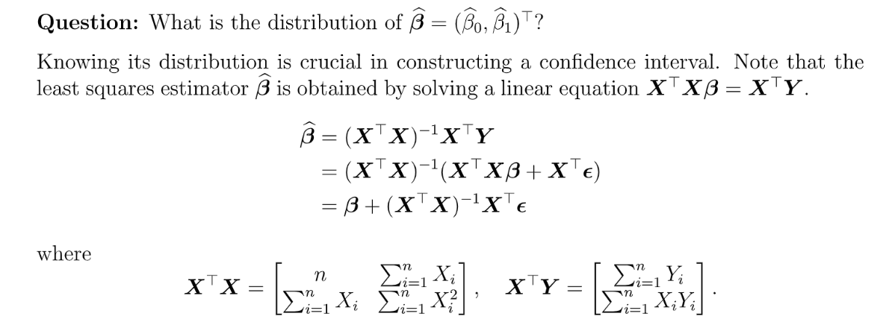

2. 当样本量很小的时候：

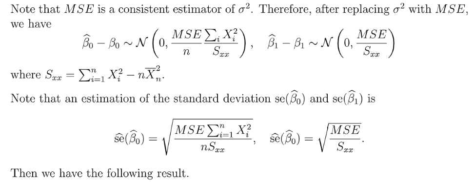
Recall$X_1,\cdots, X_n\sim \mathcal{N}(\mu,\sigma^2)$, 则$\frac{\sqrt{n}(\overline{X}_n-\mu)}{S_n}\sim t_{n-1}$

:::
**Proof of Lemma 6.3.3**

但问题是$\sigma^2$是未知的，所以我们可以使用`Slutsky Theorem`使用`MSE`($\frac{1}{n-2}SSE$, 因为$MSE$是`Consistent`的)来估计$\sigma^2$。
Why $Z$and $MSE$is independent?
我们只需要证明$\hat{\beta}$和$SSE$是独立的
$\hat{\beta}=\beta+(\mathbf{X^TX})^{-1}\mathbf{X^T\epsilon}$, randomness comes from $(\mathbf{X^TX})^{-1}\mathbf{X^T\epsilon}$
$SSE=\epsilon^T(I-H)\epsilon$, randomness comes from $(\mathbf{I-H})\epsilon$
It suffices to show $(\mathbf{I-H})\epsilon \in \mathbb{R}^n$and $(\mathbf{X^TX})^{-1}\mathbf{X^T\epsilon} \in \mathbb{R}^2$are indepedent.
$(\mathbf{I-H})\epsilon$and $(\mathbf{X^TX})^{-1}\mathbf{X^T\epsilon}$is jointly normal(By linear invariance)
$Cov((\mathbf{X^TX})^{-1}\mathbf{X^T\epsilon},(\mathbf{I-H})\epsilon)=\mathbb{E}[(\mathbf{X^TX})^{-1}\mathbf{X^T\epsilon}\cdot (\mathbf{I-H})\epsilon)^T]$(协方差矩阵的定义)
$\begin{aligned}\mathbb{E}[(\mathbf{X^TX})^{-1}\mathbf{X^T\epsilon}\cdot (\mathbf{I-H})\epsilon)^T]&=\sigma^2(\mathbf{X^TX})^{-1}\mathbf{X^T(I-H)}\\&=0 \end{aligned}$代入$\mathbf{H}$即可。
所以$t_{n-2}$的证明完成。

#### Mean Response
:::info

1. 当**样本量很大**的时候，我们可以使用下面的`Sampling Distribution`:

$\widehat{\mathbb{E}[Y|X=x]}=\hat{\beta_0}+\hat{\beta_1}x$(Point Estimation for $\mathbb{E}[Y|X=x]$at $X=x$).
$\widehat{\mathbb{E}[Y|X=x]}-\mathbb{E}[Y|X=x]=(\hat{\beta_0}-\beta_0)+(\hat{\beta_1}-\beta_1)x=\begin{bmatrix} 1&x\end{bmatrix}\begin{bmatrix} \hat{\beta_0}-\beta_0 \\ \hat{\beta_1}-\beta_1\end{bmatrix}$
因为$\hat{\beta}\sim \mathcal{N}(\beta,\sigma^2(X^TX)^{-1})$, 根据`Linear Invariance of Joint Gussian`, 我们有:
$\hat{\theta}(x)-\theta(x)\sim \mathcal{N}(0,\sigma^2\begin{bmatrix} 1&x\end{bmatrix}(X^TX)^{-1}\begin{bmatrix} 1\\x\end{bmatrix})=\sigma^2(\frac{1}{n}+\frac{(\overline{X}_n-x)^2}{S_{xx}})$
另一种推导：

2. 当**样本量很小**的时候，我们只能使用`MSE`来估计$\sigma^2$：

:::

### Confidence Interval 
#### Beta
:::info
**Hypothesis Test Setting:**
$H_0: \beta_1=0, H_1:\beta_1\neq 0$
**Model:** $H_0: Y_i=\beta_0+\epsilon_i, H_1:Y_i=\beta_0+\beta_1 X_i+\epsilon_i$, where $\epsilon\stackrel{i.i.d}\sim \mathcal{N}(0,\sigma^2)$
**Under Null Hypothesis:  **
$\frac{\hat{\beta_0}}{\hat{se}(\hat{\beta_0})}\sim t_{n-2}$, $\frac{\hat{\beta_1}}{\hat{se}(\hat{\beta_1})}\sim t_{n-2}$, reject $H_0$if $|\frac{\hat{\beta_i}}{\hat{se}(\hat{\beta_i})}|\geq t_{n-1,1-\alpha/2}$

**One sided Test is similar. LRT also applies here.**
:::

#### Mean Response
:::info

:::

## Exercises
### E1 Least Square Estimator
:::info
Observation $Y_1,\cdots, Y_n$
$Y_i=\theta X_i^2+\epsilon_i$, $\epsilon\sim \mathcal{N}(0,\sigma^2I_n)$

1. **Find **$g(X_i)$

We calculate $\mathbb{E}[Y_i|X_i]=\theta X_i^2$, 于是$g(X_i)=\theta X_i^2$

2. **Find the least square estimator of **$\theta$**.**

We calculate the $\frac{\partial }{\partial \theta} \sum_{i=1}^n (Y_i-\theta X_i^2)^2=-2\sum_{i=1}^n(Y_i-\theta X_i^2)X_i^2=0$, thus $\hat{\theta}_{OLS}=\frac{\sum_{i=1}^n Y_iX_i^2}{\sum_{i=1}^n X_i^4}$

2. **Find the MLE for **$\theta$**.**

We take the derivative $\begin{aligned}\frac{\partial }{\partial \theta} (-\frac{n}{2}log\sigma^2-\frac{n}{2\sigma^2}\sum_{i=1}^n (Y_i-\theta X_i^2)^2)&=-\frac{n}{\sigma^2}\sum_{i=1}^n(Y_i-\theta X_i^2)X_i^2=0\end{aligned}$
于是$\hat{\theta}_{MLE}=\frac{\sum_{i=1}^n Y_iX_i^2}{\sum_{i=1}^n X_i^4}$
所以在`Normal Error Model`的条件下，$\hat{\theta}_{MLE}$和$\hat{\theta}_{OLS}$是一致的。

3. Find the **best unbiased estimator of **$\theta$. ($\hat{\theta}=\sum_{i=1}^n\alpha_iY_i$)
   1. 先计算$\mathbb{E}[\hat{\theta}]=\sum_{i=1}^n \alpha_i\mathbb{E}[Y_i]=\sum_{i=1}^n\alpha_i\theta X_i^2=\theta$, which implies $\sum_{i=1}^n \alpha_iX_i^2=1$，作为最优化函数的`Constraint`。
   2. 计算$\mathbb{V}[\hat{\theta}]=\mathbb{V}[\sum_{i=1}^n\alpha_iY_i]=\sum_{i=1}^n \alpha_i^2\mathbb{V}[Y_i]=\sigma^2\sum_{i=1}^n\alpha_i^2$, 作为最小化的目标
   3. 确定最优化问题: $min \frac{1}{2}\sum_{i=1}^n \alpha_i^2,~~s.t.~~\sum_{i=1}^n \alpha_iX_i^2=1$, 目的是求出$\alpha_i$的值。然后得到`Estimator`

$L(\alpha_i,\lambda)=\frac{1}{2}\sum_{i=1}^n \alpha_i^2-\lambda(\sum_{i=1}^n \alpha_iX_i^2=1-1)$
$\frac{\partial }{\partial \alpha_i}=0\implies \alpha_i-\lambda X_i^2=0 \implies \alpha_i=\lambda X_i^2$  
$\frac{\partial L}{\partial \lambda}=0\implies \sum_{i=1}^n \alpha_iX_i^2-1=0 \implies \sum_{i=1}^n \alpha_iX_i^2=1$  
$\sum_{i=1}^n \lambda X_i^4=1\implies \lambda=\frac{1}{\sum_{i=1}^n X_i^4}, \alpha_i=\frac{X_i^2}{\sum_{i=1}^n X_i^4}$
于是$\hat{\theta}=\sum_{i=1}^n \alpha_iY_i =\frac{\sum_{i=1}^n X_i^2Y_i}{\sum_{i=1}^n X_i^4}$
:::

### E2 Possion Observation
:::info
Observation $(X_i,Y_i)$, n model $Y_i\sim Possion(\theta X_i)$, $Y_i$are i.i.d

1. **Show that the least equare estimator **$\theta$**is **$\frac{\sum_{i=1}^n X_iY_i}{\sum_{i=1}^n X_i^2}$**, calculate its variance and bias.**

我们先要选择合适的$g(X)$(Model):
$\begin{aligned}\mathbb{E}[Y|X]&=\argmin_{g}\mathbb{E}_{X,Y\sim f_{X,Y}}(Y-g(X))^2\\g(X_i)&=\mathbb{E}[Y|X=x_i]=\mathbb{E}[Possion(\theta X_i)] =\theta X_i\end{aligned}$
因此我们选择$g(X_i)=\theta X_i$
Risk Function: $\sum_{i=1}^n (Y_i-\theta X_i)^2$, taking derivatives w.r.t $\theta$and we get $\hat{\theta}=\frac{\sum_{i=1}^n X_iY_i}{\sum_{i=1}^n X_i^2}$
$Var(\hat{\theta})=\sum_{i=1}^n \frac{X_i^2}{\sum_{i=1}^n X_i^2}Var(Y_i)=\frac{\theta \sum X_i^3}{(\sum X_i)^2}$(因为$Y_i$是i.i.d的)
$Bias(\hat{\theta})=\frac{\sum_{i=1}^n X_i \mathbb{E}[X_i]}{\sum_{i=1}^n X_i^2}=\theta$

2. **验证MLE **$\hat{\theta}_{MLE}=\frac{\sum Y_i}{\sum X_i}$**:**

先求出`log-likelihood function`
$L(\theta) = \prod_{i=1}^n P(Y_i)=\prod_{i=1}^n e^{-\theta X_i}\frac{(\theta X_i)^{Y_i}}{Y_i!}$
$l(\theta)=\sum_{i=1}^n[-\theta X_i+Y_ilog\theta+Y_ilogX_i-log Y_i!]$
求出`Estimator`:
求偏导$\hat{\theta}=\frac{\sum Y_i}{\sum X_i}$

3. **验证BLUE **$\hat{\theta}_{BLUE}=\frac{\sum Y_i}{\sum X_i}$**:**

$\hat{\theta}=\sum_{i=1}^n \alpha_iY_i$
$E[\hat{\theta}]\implies \mathbb{E}[\alpha_iY_i]=\sum_{i=1}^n \alpha_i\theta X_i=\theta$, 所以`Constraint 1`: $\sum_{i=1}^n \alpha_iX_i=1$
$Var[\hat{\theta}]=\sum_{i=1}^n \alpha^2\cdot \theta X_i=\theta \sum_{i=1}^n \alpha_i^2X_i$, 所以我们要`minimize`$\sum_{i=1}^n \alpha_i^2X_i$
$min \frac{1}{2}\sum_{i=1}^n \alpha_i^2X_i,~~s.t.~~\sum_{i=1}^n \alpha_iX_i=1$
$L(\alpha_i,\lambda)= \frac{1}{2}\sum_{i=1}^n -\lambda(\sum_{i=1}^n \alpha_iX_i-1)$
求偏导:
$\frac{\partial L}{\partial \alpha_i}=\alpha_iX_i-\lambda X_i=0\implies \alpha_i=\lambda$
$\frac{\partial L}{\partial \lambda}=-(\sum \alpha_iX_i-1)=0\implies \sum \alpha_iX_i=1$
然后解得$\lambda$和$\alpha_i$然后求得`BLUE` $\hat{\theta}=\frac{\sum Y_i}{\sum X_i}$
:::

# 4 Multiple Linear Regression(MLR)
## Basic Concepts
:::info
上文我们介绍了只有一个`Predictor`的`Linear Model`, 但是很多情况下一个`Predictor`并不足够，于是我们会倾向于介绍更多的`Predictors`。
正如在`Simple Linear Regression`的小节中介绍的那样，我们也会假设：

1. `Models are linear in the parameters`($\beta_0$和$\beta_1$的线性组合)。
2. 如果`Model is linear in the predictor variables` (是$X_i$的线性组合), 则我们称这种模型为一阶模型`First Order Model`

本章中我们也将介绍那些`Linear in parameters`但不是`Linear in predictor variables`($X_iX_j$terms)的模型，这类模型被称为`General Linear Regression Model`.
:::

## Model Structure
### Model Definition&Assumptions
:::info

:::

### Mean Response
:::info

:::

### Matrix Notations
:::info
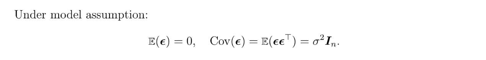
:::

## PolyRegression
### Risk Minimization
:::info

:::

### LSE
:::info

那么我们如何保证$\mathbf{X^TX}$是可逆的呢? 显然从前文我们知道$\mathbf{X}$必须是列满秩的，那么$\mathbf{X}$在何种情况下是列满秩的呢? 
**我们先给出结论:**

下面给出`Vandermonde Matrix`的介绍及证明。
:::

### Vandermonde Matrix
:::info

:::

## Estimation of parameters
### LSE for beta
#### Basic Matrix Calculus
:::info

:::
**Proof**

#### Estimator
:::info

:::
**Lemma: X^TX is strictly PSD**We first verify that $\mathbf{X^TX}$ is always PSD by its quadratic form.
 $\forall v\in \mathbb{R}^2$, we have $v^T\mathbf{X^TX}v=(\mathbf{X}v)^{\mathbf{T}}(\mathbf{Xv})$, where $\mathbf{X}v\in \mathbb{R}^n$.
 Also we know that $(\mathbf{X}v)^{\mathbf{T}}(\mathbf{X}v)=\sum_{i=1}^n (\mathbf{X}v)_i^2\geq 0$, which means $\mathbf{X^TX}$ is PSD.
 We then prove that when $\mathbf{X^TX}$ is invertible, $\mathbf{X^TX}$ is also strictly positive semi-definite(i.e $\forall v\neq \mathbf{0}\in \mathbb{R}^2$, $v^T \mathbf{X} v>0$)
First, since $\mathbf{X^TX}$ is symmetric, we can factorize it into $\mathbf{X^TX=U\Lambda U^T}$ where $\mathbf{U}$ and $\mathbf{U^T}$ are orthogonal matrix containing $\mathbf{X^TX}$'s eigenvectors and $\mathbf{\Lambda}$ is diagonal matrix containing the eigenvalues.
Also we know $\mathbf{Rank(X^TX)=Rank(\Lambda)}=2$, since $\mathbf{U}$ and $\mathbf{U^T}$ are invertible. Thus we immediately know that all the eigenvalues of $\mathbf{X^TX}$ are bigger than zero(Since PSD still holds). Thus by definition $v\mathbf{X^TX}v=v^T\mathbf{U\Lambda U^T}v=(\mathbf{U^T}v)^T \Lambda (\mathbf{U^T}v)$. Let $y=\mathbf{U^T}v$, we immediately conclude that $v\mathbf{X^TX}v>0,\forall v\neq \mathbf{0}\in \mathbb{R}^2$ and that $\mathbf{X^TX}$ is strictly positive semi-definite.
**Derivation**

#### SSE& MSE
:::info

**其中:**
$\begin{aligned}SSE=\sum_{i=1}^n\hat{\epsilon_i}&=\mathbf{(Y-X\hat{\beta})^T(Y-X\hat{\beta})}\\&=\mathbf{(Y-X(X^TX)^{-1}X^TY)^T(Y-X(X^TX)^{-1}X^TY)}\\&=\mathbf{((I-H)Y)^T((I-H)Y)}\\&=(\mathbf{(I-H)(X\beta+\epsilon)})^T(\mathbf{(I-H)(X\beta+\epsilon)})\\&=\mathbf{\epsilon^T(I-H)^T}(\mathbf{I-H})\epsilon\\&=\epsilon^T\mathbf{(I-H)}\epsilon\end{aligned}$
$SS_{Tol}$是数据的方差。
$SS_{Res}$就是我们的$SSE$，也就是`Sum of residual errors`
$SS_{Reg}$就是模型解释了多少的数据方差。
:::

### Geometric Interpretation of LSE
#### Basics
:::info

:::

#### Projection Matrix
> 

#### Hat Matrix
> 
> $(I-H)Y=(I-H)(X\beta +\epsilon)=(I-H)X\beta+(I-H)\epsilon=0+(I-H)\epsilon=(I-H)\epsilon$
> Given $z$, $Hz$is the vector in the column space of $X$that is closest to $z$, thus $HX=X$

#### Properties of Hat Matrix
> 假设$\mathbf{H=X(X^TX)^{-1}X^T}$, 我们说$\mathbf{H}$是$\mathbf{X}$的`Hat Matrix`, 他的作用就是将$z\in \mathbb{R}^n$投影到$Col(\mathbf{X})$ 。同时，我们令$\mathbf{X_S}$为$\mathbf{X}$的列向量的`Subset`按列构成的矩阵，并令$\mathbf{H_S}=\mathbf{X_S}(\mathbf{X_S}^T\mathbf{X_S})^{-1}\mathbf{X_S}^T$, 由此我们会有以下重要性质:
> 1. $\mathbf{H}$是投影矩阵，且将$\forall z\in \mathbb{R}^n$投影到$\mathbf{X}$的列空间。
> 
$\mathbf{I-H}$是投影矩阵，且将$\forall z\in \mathbb{R}^n$投影到$\mathbf{X}$的左零空间。
> $\mathbf{(I-H)X=0}$, 因为$\mathbf{HX=X,IX=X}$。
> 2. $\mathbf{HH_S=H_S}$
> 
首先我们声明$\forall z\in\mathbb{R}^n, \mathbf{HH_S}z=\mathbf{H}z$, 这是因为$\mathbf{H_S}z\in Col(\mathbf{X_S})\subset Col(\mathbf{X})$, 于是令$\mathbf{H_S}z=y\in \mathbb{R^n}$, 则$\mathbf{H}y=y$, 于是$\mathbf{HH_S}z=\mathbf{H}z,\forall z\in \mathbb{R}^n$, 于是我们可以选取$\mathbb{R}^n$空间的标准基$\{e_1,\cdots, e_n\}$, 且我们知道对于任意矩阵$\mathbf{M}\in \mathbb{R}^{m\times n}$来说，$\mathbf{M}e_i$就是矩阵$\mathbf{M}$的第$i$列。
> 于是$\mathbf{HH_S}e_i=\mathbf{H}e_i,\forall 1\leq i\leq n$, 这表明$\mathbf{HH_S=H}$
> 3. $\mathbf{H_SH=H_S}$
> 
我们只需要对上述等式的左右两边同时取转置，即$\mathbf{(HH_S)^T=H^T}$，得到$\mathbf{H_S^{T}H^T=H_S^T} \tag{1}$, 因为$\mathbf{H}$和$\mathbf{H_S}$是投影矩阵满足$\mathbf{H^T=H}$且$\mathbf{H_S^T=H_S}$， 于是$(1)$式变成$\mathbf{H_SH=H_S}$
> 3. $\mathbf{H-H_S}$是投影矩阵

### S.D. of beta
#### Sigma^2 is known
:::info

:::
**Proof**

#### Sigma^2 is unknown
:::info
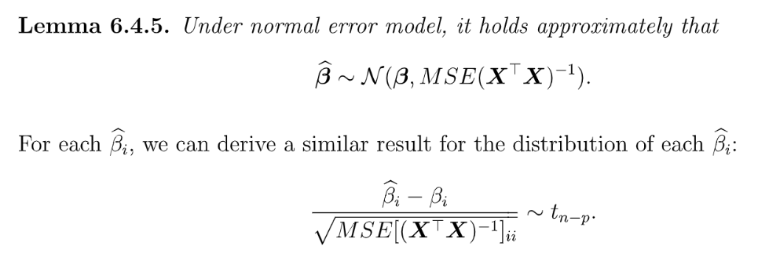
:::
**Proof**

### S.D for SSE& Indep of beta
:::info

:::
**Proof**

### S.D for sigma^2
:::info

:::

### S.D. for mean response
#### Sigma^2 is known
> $\theta(\beta)=X\beta$
> $\widehat{\theta(\beta)}=X\hat{\beta}$
> $\widehat{\theta(\beta)}-\theta(\beta)=X(\hat{\beta}-\beta)$
> Since $\hat{\beta}-\beta\sim \mathcal{N}(0, \sigma^2(X^TX)^{-1})$, thus by linear invariance, we have:
>  

#### Sigma^2 is unknown
> Since $\hat{\beta}-\beta\sim \mathcal{N}(0, \sigma^2(X^TX)^{-1})$, thus by linear invariance, we have:
>  , 其中

## Inference of parameters
[ECON-SHU301-CH7.pdf](https://www.yuque.com/attachments/yuque/0/2022/pdf/12393765/1669356104942-8d02e3a4-b8b0-48ff-a819-2bf381cb0ffe.pdf)
> 有了上面推导出的`Sampling Distribution`, 我们就可以构建一系列关于模型参数的假设检验。

### Hypothesis Testing for Beta
> 
> 其中$\hat{se}(\hat{\beta_j})=\sqrt{MSE(X^TX)^{-1}_{jj}}$, 这说明the correlation between predictor variables can impact the results of the hypothesis test (and the width of confidence intervals). 
> **Confidence Interval for beta：**
> 

### Test for Significance
#### Global F-Test
##### Test Settings
> **假设现在我们的线性模型模型是:**
> $\mathbf{Y=X\beta+\epsilon}$, 其中$\mathbf{X}\in \mathbb{R}^{n\times p}$且$\mathbf{Rank(X)=p}$
> 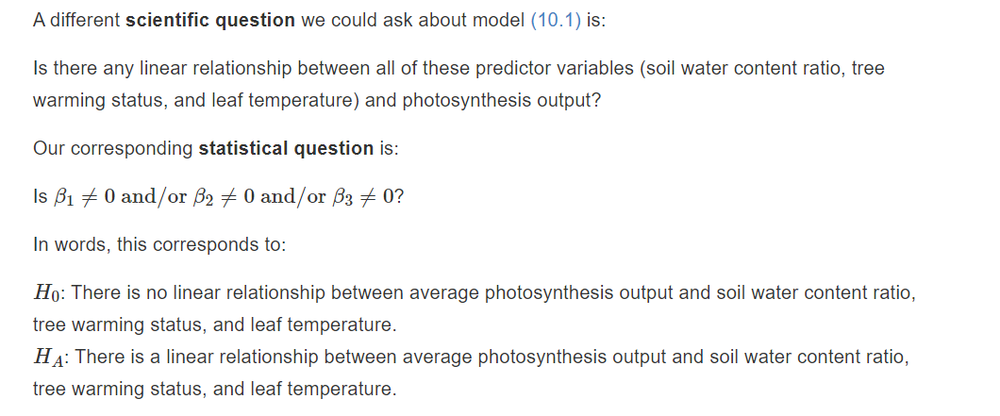
> $H_0: \beta_1=\beta_2=\cdots=\beta_p=0$, 注意这里没有限制$\beta_0=0$也不能限制$\beta_0=0$, 因为一旦限制了，那么$\mathbb{E}[\epsilon]=0$在`Null Hypothesis`下就不满足了。
> $H_A: \exists i,~~s.t.~~\beta_i\neq 0$

##### F Statistics
> 
> **其中：**
> - $SS_{Tol}$是数据的方差, 也记作$TSS$。
> - $SS_{Res}$就是我们的$SSE$，也就是`Sum of residual errors`, 记作$RSS$
> - $SS_{Reg}$就是模型解释了多少的数据方差, 记作$ESS$
> 
**F-statistics(When null hypothesis is true):**
> $f=\frac{\frac{SS_{Reg}}{df_{Reg}}}{\frac{SS_{Res}}{df_{Res}}}=\frac{\frac{TSS-RSS}{df_{Reg}}}{\frac{RSS}{df_{Res}}}=\frac{\frac{TSS-RSS}{p-1}}{\frac{RSS}{n-p}}$,$f\sim F_{p-1,n-p}$
> 

**Proof this distribution(Important)**$TSS=\sum_{i=1}^n (y_i-\overline{y}_n)^2=\sum_{i=1}^n y_i^2 -n(\overline{y}_n)^2=\mathbf{y^{\top}(I-\frac{1}{n}J)y}$, where $\mathbf{J}=\mathbf{1_{n\times n}}$(All entries are one)
$RSS=\sum_{i=1}^n(y_i-\hat{y_i})^2=\mathbf{(I-H)y}$, where $\mathbf{H=X(X^TX)^{-1}X^T}$
$ESS=\sum_{i=1}^n (\hat{y_i}-\overline{y}_n)^2=TSS-RSS=\mathbf{y^T(H-\frac{1}{n}J)y}$
Next we prove that $$

#### Partial F-Test
##### Test Settings
> 

##### F Statistics
> 假设我们的模型如下：
> 
> $SSE$表示完整的模型的`Residual Error`
> $SSE(S)$表示`Reduced Model`的`Residual Error`
> **Hypothesis Testing:**
> $H_0: \beta_i, i\in S^c$
> $H_A: \exists i\in S^c~~s.t.~~\beta_i\neq 0$
> 其中$S\subset \{1,\cdots, p\}$
> **F-statistics:**
> $f=\frac{\frac{SSE(S)}{s}}{\frac{SSE}{n-p}}$, $f\sim F_{s,n-p}$under null hypothesis
> 其中$s$就是$Rank(X_S)=s$

**Proof(Medium)**
利用$SSE(S)\sim \sigma^2\chi_{r}^2$且$SSE\sim \sigma^2\chi_{n-p}^2$, 我们可以证明上述结论。

### Measure of Model Fit
#### R^2
> $R^2=\frac{ESS}{TSS}=1-\frac{RSS}{TSS}$
> 

#### Adjusted R^2
>  It might be nice to use $R^2$ as a way to compare different models, but it suffers from one important drawback: adding a variable to a model cannot decrease $R^2$. 
> In fact, $R^2$ will almost always go up when a variable is added. This is a mathematical fact, and it doesn’t matter if the new variable is unrelated to the outcome or not.
> $R^2_{Adj}=1-\frac{\frac{RSS}{n-p}}{\frac{TSS}{n-1}}$
> 
> $SS_{Res}=RSS, SS_{tot}=TSS$

# 5 Assessing the model assumptions
> [https://www.joshuapkeller.com/page/introregression/modadequacy.html](https://www.joshuapkeller.com/page/introregression/modadequacy.html)

## Residuals
### Basics
> 

### Raw Residual
> 

### Scaled Residuals
> 
> `The magnitude of raw residuals depend on` $\sigma^2$是因为$\sum_{i=1}^n e_i^2=\epsilon^T(\mathbf{I-H})\epsilon$, 而$Var(\epsilon_i)=\sigma^2$。

### Standardized Residuals
> 

### Studentized Residuals
> 

## Assessing Model Assumptions
### E[e]=0
> 

**Violation Case**

### Equal Variance
> 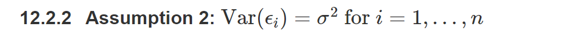

**Violation Case**

### Uncorrelation of error
> 

### X is full rank
> 

### Error is normally distributed
> 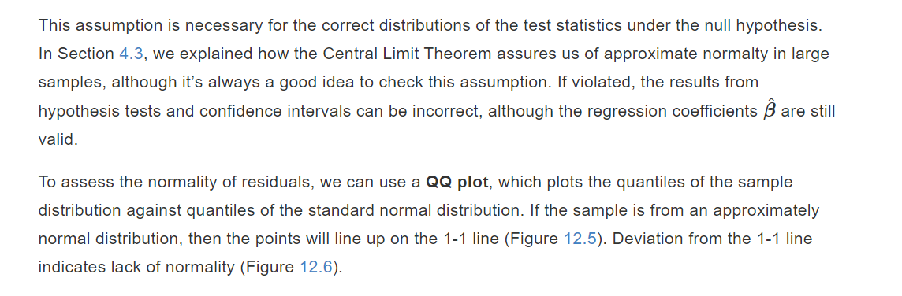

**QQ Plot**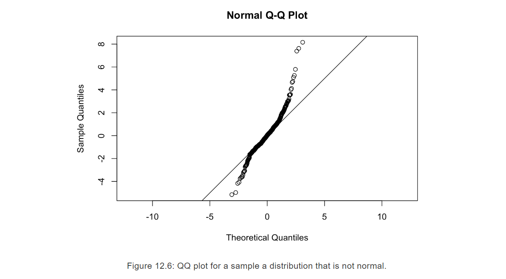

# 6 Unusual Observations
## High Leverage Points
### Concepts
> 

**Figure 13.1**

### Why it matters?
> 

### Quantification
> 
> **Some Properties:**
> 

## Influence
### Concepts
> 

**Figure 13.2**

### Quantification
> 
> **How to measure:**
> 

## What should we do?
> 

# 7 Summary 
> 现在我们来对本章学习的一些模型性质进行一些归纳总结。

## Model
> 对于线性模型$\mathbf{Y=X\beta+\epsilon}$
> 我们的$g(X)$是$\mathbb{E}[\mathbf{Y|X}]=\mathbf{X}\beta=\sum_{i=0}^p \beta_iX_i$, 其中$X_0=1$
> 我们的`Empirical Risk Function`是:
> $l(\beta)=\frac{1}{n}\mathbf{(Y-X\beta)^T(Y-X\beta)}=\frac{1}{n}\sum_{i=1}^n (Y_i-\sum_{i=0}^p\beta_iX_i)^2$, 其中$X_0=1$
> 我们关于模型有如下假设：
> 1. **Zero error expectation:**$\mathbb{E}[\epsilon_i]=0$, 这个假设通过在模型中引入截距项$\beta_0$就可以保证。
> 2. **Equal Variance:**$\mathbb{V}(\epsilon_i)=\sigma^2$且$\mathbb{E[\epsilon_i\epsilon_j]}=0,\forall i\neq j$, 即$\mathbb{E}[\epsilon \epsilon^T]=\sigma^2 \mathbf{I_n}$
> 3. $X_i$都是已知的数值量, 不是随机变量, $Y_i$和$\epsilon_i$都是随机变量
> 4. $\mathbb{E}[\mathbf{Y}]=\mathbf{X\beta}$,$Cov(\mathbf{Y})=\mathbb{E}[\mathbf{(Y-X\beta)(Y-X\beta)^T}]=\mathbb{E}[\epsilon \epsilon^T]=\sigma^2\mathbf{I_n}$
> 5. $\mathbf{X}\in \mathbb{R}^{n\times p}$, 且$\mathbf{Rank(X)}\in [1,p]$

## LSE
> 目标是最小化经验损失函数:
> $\mathbf{J(\beta)}=l(\beta)=\frac{1}{n}\mathbf{(Y-X\beta)^T(Y-X\beta)}=\frac{1}{n}\sum_{i=1}^n (Y_i-\sum_{i=0}^p\beta_iX_i)^2, 其中X_0=1$
> 我们通过矩阵求导术可以得到：
> $\hat{\beta}_{LSE}=\mathbf{(X^TX)^{-1}(X^TY)}$
> $\mathbf{X^TX}$可逆当且仅当$\mathbf{X}$列满秩。
> **对于这个**`**Estimator**`**，它有如下性质:**
> 1. 当$\mathbf{X}$满秩的时候， 这个`Estimator`是`**Unbiased and consistent**`的**。**
> 
不满秩的时候则不是`Unbiased`。
> 2. $\hat{\beta}$其实是$Y_i$的线性组合，这点非常重要，`B.L.U.E`就是这样来的。

**Proof of Unbiasedness& Consistency****Unbiasedness:**
$\mathbb{E}[\hat{\beta}]=\mathbf{(X^TX)^{-1}X^T}\mathbb{E}[Y]=\mathbf{(X^TX)^{-1}(X^TX)\beta}=\beta$
**Consistency(**$Var(\hat{\beta})$**gets close to zero when n is large ):**
$Cov(\widehat{\beta_{LSE}})=\mathbb{E}[(\widehat{\beta_{LSE}}-\mathbb{E}[\widehat{\beta_{LSE}}])(\widehat{\beta_{LSE}}-\mathbb{E}[\widehat{\beta_{LSE}}])^T]$
$\widehat{\beta_{LSE}}-\beta=(X^TX)^{-1}X^TY-\beta=(X^TX)^{-1}X^T(X\beta+\epsilon)-\beta=(X^TX)^{-1}X^T\epsilon=\mathbb{E}[(X^TX)^{-1}X^T\epsilon\epsilon^TX(X^TX)^{-1}]=(X^TX)^{-1}X^T\mathbb{E}[\epsilon\epsilon^T]X(X^TX)^{-1}$
因为$\mathbb{E}[\epsilon\epsilon^T]=\sigma^2\mathbf{I_n}$, 于是最终结果是$\sigma^2 (X^TX)^{-1}X^TX(X^TX)^{-1}=\sigma^2(X^TX)^{-1}$，这经常被称为`Precision Matrix`
$\sigma^2(X^TX)^{-1}$的项会随着$n$的增大而减小，所以`Consistency`可证。

## MLE 
> **当**$\epsilon_i\stackrel{i.i.d}\sim \mathcal{N}(0, \sigma^2\mathbf{I_n})$**时，即**$\epsilon_i$**是**`**Normal Error**`**的时候**，我们有:
> 1. $Cov(\epsilon_i,\epsilon_j)=0,\forall i\neq j$, 即$\epsilon_i \perp \epsilon_j$
> 2. $\mathbf{Y}\sim \mathcal{N}(\mathbf{X\beta}, \sigma^2\mathbf{I_n})$, 即$Y_i\stackrel{i.i.d}\sim \mathcal{N}(\sum_{i=0}^p \beta_iX_i,\sigma^2)$
> 
利用$Y_i$是`Normal Distribution`的事实我们有`MLE`损失函数: 
> $l(\beta, \sigma^2)=-\frac{n}{2}log \sigma^2-\frac{n}{2\sigma^2}\mathbf{(Y-X\beta)^T(Y-X\beta)}$
> 通过一系列算术运算我们知道`Under Normal Error`, $MLE$matches $LSE$:
> $\hat{\beta}_{MLE} = \hat{\beta}_{LSE}=\mathbf{(X^TX)^{-1}(X^TY)}$
> 
> **性质(和**`**LSE**`**一样)：**
> 1. 当$\mathbf{X}$满秩的时候， 这个`Estimator`是`**Unbiased and consistent**`的**。**
> 
不满秩的时候则不是`Unbiased`。
> 2. $\hat{\beta}$其实是$Y_i$的线性组合，这点非常重要，`B.L.U.E`就是这样来的。

## Hat Matrix
### Properties
> 假设$\mathbf{H=X(X^TX)^{-1}X^T}$, 我们说$\mathbf{H}$是$\mathbf{X}$的`Hat Matrix`, 他的作用就是将$z\in \mathbb{R}^n$投影到$Col(\mathbf{X})$ 。同时，我们令$\mathbf{X_S}$为$\mathbf{X}$的列向量的`Subset`按列构成的矩阵，并令$\mathbf{H_S}=\mathbf{X_S}(\mathbf{X_S}^T\mathbf{X_S})^{-1}\mathbf{X_S}^T$, 由此我们会有以下重要性质:
> **代数性质:**
> 1. $\mathbf{H^T=H}$, $\mathbf{H^2=H}$
> 2. $\mathbf{(I-H)^T=I-H}$, $\mathbf{(I-H)^2=I-H}$
> 3. 假设$\mathbf{X}\in \mathbb{R}^{n\times p}$且$\mathbf{Rank(X)}=p$,$\mathbf{Tr(H)}=\mathbf{Rank(H)=Rank(X)}=p$。
> 
$\mathbf{Rank(H)=Tr(H)}$恒成立, 运用特征值性质即可。
> 又因为$\mathbf{Tr(H)=Tr(X(X^TX)^{-1}X^T)=Tr((X^TX)(X^TX)^{-1})=Tr(I_p)}=p$, 于是$\mathbf{Rank(H)=Tr(H)=p=Rank(X)}$
> 4.  $\mathbf{Tr(I-H)}=n-p$, 如果$\mathbf{Rank(X)}=p$
> 
因为$\mathbf{Tr(I-H)=Tr(I)-Tr(H)}=n-p$
> **几何性质:**
> 1. $\mathbf{H}$是投影矩阵，且将$\forall z\in \mathbb{R}^n$投影到$\mathbf{X}$的列空间。
> 
$\mathbf{I-H}$是投影矩阵，且将$\forall z\in \mathbb{R}^n$投影到$\mathbf{X}$的左零空间。
> $\mathbf{(I-H)X=0}$, 因为$\mathbf{HX=X,IX=X}$。
> 2. $\mathbf{HH_S=H_S}$
> 
首先我们声明$\forall z\in\mathbb{R}^n, \mathbf{HH_S}z=\mathbf{H}z$, 这是因为$\mathbf{H_S}z\in Col(\mathbf{X_S})\subset Col(\mathbf{X})$, 于是令$\mathbf{H_S}z=y\in \mathbb{R^n}$, 则$\mathbf{H}y=y$, 于是$\mathbf{HH_S}z=\mathbf{H}z,\forall z\in \mathbb{R}^n$, 于是我们可以选取$\mathbb{R}^n$空间的标准基$\{e_1,\cdots, e_n\}$, 且我们知道对于任意矩阵$\mathbf{M}\in \mathbb{R}^{m\times n}$来说，$\mathbf{M}e_i$就是矩阵$\mathbf{M}$的第$i$列。
> 于是$\mathbf{HH_S}e_i=\mathbf{H}e_i,\forall 1\leq i\leq n$, 这表明$\mathbf{HH_S=H}$
> 3. $\mathbf{H_SH=H_S}$
> 
我们只需要对上述等式的左右两边同时取转置，即$\mathbf{(HH_S)^T=H^T}$，得到$\mathbf{H_S^TH^T=H_S^T} \tag{1}$, 因为$\mathbf{H}$和$\mathbf{H_S}$是投影矩阵满足$\mathbf{H^T=H}$且$\mathbf{H_S^T=H_S}$， 于是$(1)$式变成$\mathbf{H_SH=H_S}$
> 3. $\mathbf{H-H_S}$是投影矩阵

### Idempotent Matrices
> 前文我们知道，投影矩阵是幂等的(`Idempotent`, ), 而现在我们将会证明一个更加一般化且非常有用的结论：
> 

**Proof(Very Hard)**[https://stats.stackexchange.com/questions/258461/proof-that-f-statistic-follows-f-distribution](https://stats.stackexchange.com/questions/258461/proof-that-f-statistic-follows-f-distribution)

## BLUE
> 

## Residuals
> **定义：**
> 
> **性质:**
> 1. $\sum_{i=1}^n\hat{\epsilon_i}=0$
> 2. $\sum_{i=1}^nX_i\hat{\epsilon_i}=0$
> 3. $\sum_{i=1}^n\hat{Y_i}\hat{\epsilon_i}=0$
> 4. $\sum_{i=1}^nY_i=\sum_{i=1}^n\hat{Y_i}$
> 5. $\mathbb{E}[\hat{\epsilon}]=\mathbb{E}[\mathbf{Y-X\hat{\beta}}]=\mathbb{E}[\mathbf{(I-H)Y}]=\mathbb{E}[\mathbf{(I-H)(X\beta+\epsilon)}]=(\mathbf{I-H})\mathbb{E}[\epsilon]=0$
> 6. $\begin{aligned}Var(\hat{\epsilon})&=Var(\mathbf{(I-H)y})\\&=\mathbf{(I-H)}Var(\mathbf{y})\mathbf{(I-H)^T}\\&=\mathbf{(I-H)}\sigma^2\mathbf{I_n}\mathbf{(I-H)^T}\\&=\sigma^2(\mathbf{I-H})\end{aligned}$

## SSE&MSE 
> **定义:**
> $SSE=\sum_{i=1}^n \hat{\epsilon_i}^2$, $\epsilon_i=Y_i-\sum_{i=0}^p\hat{\beta_i}X_i$, 其中$X_0=1$
> $MSE = \frac{SSE}{n-p}$
> **写成**`**Hat Matrix**`**的形式:**
> $\begin{aligned}SSE=\sum_{i=1}^n\hat{\epsilon_i}&=\mathbf{(Y-X\hat{\beta})^T(Y-X\hat{\beta})}\\&=\mathbf{(Y-X(X^TX)^{-1}X^TY)^T(Y-X(X^TX)^{-1}X^TY)}\\&=\mathbf{((I-H)Y)^T((I-H)Y)}=\mathbf{Y^T(I-H)Y}\\&=(\mathbf{(I-H)(X\beta+\epsilon)})^T(\mathbf{(I-H)(X\beta+\epsilon)})\\&=\mathbf{\epsilon^T(I-H)^T}(\mathbf{I-H})\epsilon\\&=\epsilon^T\mathbf{(I-H)}\epsilon\end{aligned}$
> **性质(在**`**Normal Error**`**假设下):**
> 1. $MSE$是$\sigma^2$的`Unbiased and Consistent Estimator`
> 2. $SSE\sim \sigma^2\chi_{n-p}^2$
> 3. $SSE$和$\hat{\beta}$是独立的。(利用`Jointly Normal`加`Convariance`为零进行证明)

**Proof of 1 and 2**We have just found that $\widehat{\sigma^2}=\frac{\mathbf{(y-X\hat{\beta}_{MLE})^T(y-X\hat{\beta}_{MLE})}}{n}$, and we first claim that it is biased and consistent and we prove them:

1. Biasedness, we denote $\mathbf{X(X^TX)^{-1}X^T}$ by $\mathbf{H}$, and that $\mathbf{\epsilon=y-X\beta}$.

    We have verified in the lecture and also 3(a) that $\mathbf{H}$ and $\mathbf{I-H}$ are both symmetric projection matrices and that $\mathbf{Rank(I-H)}=\mathbf{Tr(I-H)=n-p}$. Thus we diagonalize it as $\mathbf{I-H}=\mathbf{U\Lambda U^T}$, where $\mathbf{\Lambda}$ has $n-p$ eigenvalue $1$ and $p$ eigenvalue $0$. We also know from previous assignment that $\mathbf{U}\epsilon\sim \mathcal{N}(0,\sigma^2\mathbf{I_n})$ and $\mathbf{U^T}\epsilon \sim \mathcal{N}(0,\sigma^2\mathbf{I_n})$  Then we have $\epsilon^T(\mathbf{(I-H)^T(I-H)})\epsilon$ is the sum of the square of $n-p$ i.i.d Gaussian random variable of $\mathcal{N}(0,\sigma^2)$ and that $\epsilon^T\mathbf{(I-H)^T(I-H)}\epsilon\sim \chi_{n-p}^2$
    $\begin{align} \mathbb{E}[\widehat{\sigma^2}]&=\mathbb{E}[\frac{\mathbf{\epsilon^T(I-H)^T(I-H)\epsilon}}{n}] \nonumber\\&=\frac{1}{n}\mathbb{E}[\chi_{n-p}^2] \nonumber \\&=\frac{n-p}{n} \nonumber\end{align}$
    Thus, $\widehat{\sigma^2}$ is biased. 
    Consistency, suppose $\mathbf{\epsilon}=\begin{bmatrix}Z_1&Z_2\cdots &Z_{n-p} \end{bmatrix}$ where $Z_i\sim \mathcal{N}(0,\sigma^2)$
    Thus $\widehat{\sigma^2}=\frac{1}{n}\sum_{i=1}^{n-p}Z_{i}^2$, and by LLN, we have that $\widehat{\sigma^2}$ converges to $\mathbb{E}[Z_i^2]=\sigma^2$, which implies that it is consistent.
**Proof of 3**

## Mean Response

## Hypothesis Testing& C.I
### beta_hat
> 给定$\epsilon_i\stackrel{i.i.d} \sim \mathcal{N}(0,\sigma^2\mathbf{I_n})$(`Under Normal Error`), 我们有：
> **Sampling Distribution: **
> $\hat{\beta}=\beta+\mathbf{(X^TX)^{-1}X^TY}=\beta+\mathbf{(X^TX)^{-1}X^T(X\beta+\epsilon)}=\beta+\mathbf{(X^TX)^{-1}X^T\epsilon}$
> 于是$\begin{aligned}Var(\hat{\beta})=\mathbb{E}[(\hat{\beta}-\beta)(\hat{\beta}-\beta)^T]&=\mathbb{E}[\mathbf{(X^TX)^{-1}X^T}\epsilon \epsilon^T\mathbf{X(X^TX)^{-1}}]\\&=\mathbf{(X^TX)^{-1}}\mathbb{E}[\epsilon\epsilon^T]\\&=\sigma^2\mathbf{(X^TX)^{-1}}\end{aligned}$
> 于是$\hat{\beta}-\beta\sim \mathcal{N}(\beta, \sigma^2\mathbf{(X^TX)^{-1}})$
> $\frac{\hat{\beta}_i-\beta_i}{\sqrt{\sigma^2*\mathbf{(X^TX)^{-1}_{ii}}}}\sim t_{n-p}$
> 如果$\sigma^2$未知，则使用$\hat{\beta}-\beta\sim \mathcal{N}(\beta, MSE*\mathbf{(X^TX)^{-1}})$:
> 且样本数量较少时:
> $\frac{\hat{\beta}_i-\beta_i}{\sqrt{MSE*\mathbf{(X^TX)^{-1}_{ii}}}}\sim t_{n-p}$
> 如果样本数量足够多，则:
> $\frac{\hat{\beta}_i-\beta_i}{\sqrt{MSE*\mathbf{(X^TX)^{-1}_{ii}}}}\rightsquigarrow\mathcal{N}(0,1)$
> $\frac{\hat{\beta}_i-\beta_i}{\sqrt{\widehat{\sigma^2}*\mathbf{(X^TX)^{-1}_{ii}}}}\rightsquigarrow \mathcal{N}(0,1)$
> $\widehat{\sigma^2}=\frac{1}{n}\sum_{i=1}^n (X_i-\overline{X}_n)^2$
> **Hypothesis_Testing&C.I:**
> $H_0: \beta_i=\beta_{i0},\forall i$
> $H_A: \beta_i\neq \beta_{i0}$for some $i$
> 

**Proof of Sampling Distribution**

## Significance Testing
> 

