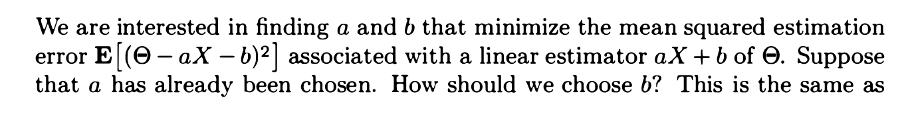

# Maximum Posterior Estimation
> [!summary]
> 求的是$argmax_{\theta}f_{\theta|x}(\theta|x)$

# Least Mean Square Estimation
## Definition
> [!def]
> `Bayesian LMS`优化的是$\mathbb{E}[(\hat{\theta}-\Theta)^2]$, 最优解是$\mathbb{E}[\Theta|X]$, 其中$\Theta$是一个随机变量。
> 
> - $\hat{\Theta} = E[\Theta | X]$ minimizes $E[(\Theta - g(X))^2]$ over all estimators $g(\cdot)$ 
> - For any $x$, $\hat{\Theta} = E[\Theta | X = x]$ minimizes $E[(\Theta - \hat{\Theta})^2 | X = x]$ over all estimates $\hat{\Theta}$

> [!proof] Iterated Law of Expectation
> 

## Properties
> [!property]
> - Estimator: $\hat{\Theta} = E[\Theta | X]$
> - Estimation Error: $\tilde{\Theta} = \hat{\Theta} - \Theta$ 
> - Conditional Mean Square Error: $\mathbb{E}[(\hat{\Theta} - \Theta)^2|X=x]=\mathbb{E}[Var(\Theta|X=x)]$
> - Mean Square Error: $\mathbb{E}[(\hat{\Theta} - \Theta)^2]=Var(\hat{\Theta}-\Theta)$
> - $E[\tilde{\Theta}] = 0$
> - $E[\tilde{\Theta} | X = x] = 0$ 
> - $E[\tilde{\Theta} h(X)] = 0$, for any function $h$
> - $\text{cov}(\hat{\Theta},\tilde{\Theta}) = 0$
> - Since $\Theta = \hat{\Theta} - \tilde{\Theta}: \text{var}(\Theta) = \text{var}(\hat{\Theta}) + \text{var}(\tilde{\Theta})$ 
> 

# Linear Least Mean Square Estimation
> [!def]
> `Bayesian LLMS`优化的是:
> - Consider estimators of $\Theta$, of the form $\hat{\Theta} = aX + b$
> - Minimize $E[(\Theta - aX - b)^2]$
> - Best choice of $a, b$; best linear estimator: $\hat{\Theta}_L = E[\Theta] + \frac{\text{Cov}(X, \Theta)}{\text{var}(X)} (X - E[X])$
> 

> [!proof]
> 

## Properties
> [!property]
> 本质上是一个特殊的`LMS`, 所以可以继承所有`LMS`的性质。

# Great Examples
## Example 1 - Calculation to the Rescue
> [!example]
> 

> [!solution]
> 

## Example 2 - Estimate Bernoulli Process
> [!example]
> 

> [!solution]
> 

## Example 3 - Independence
> [!example]
> 

> [!solution]
> 

