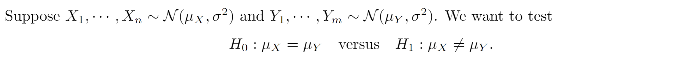
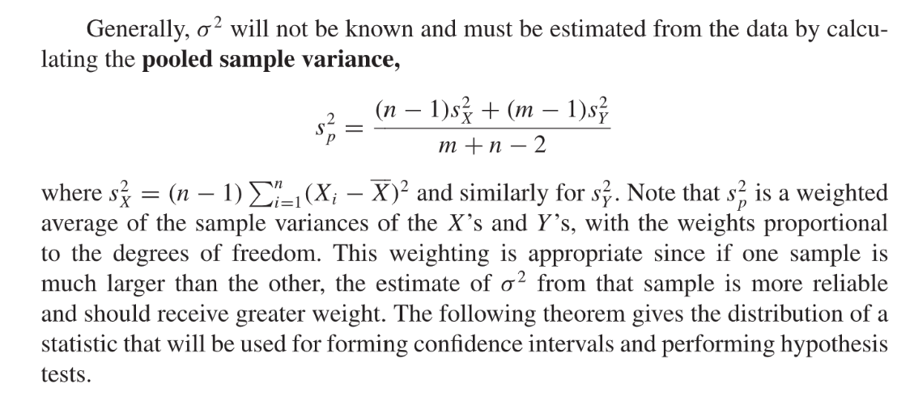
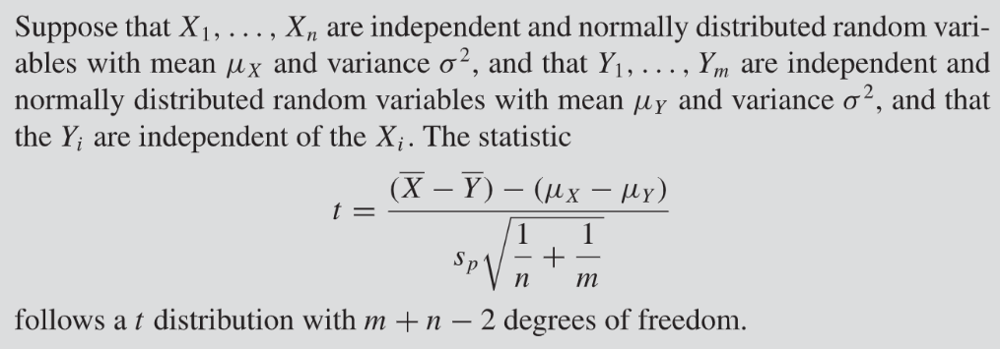
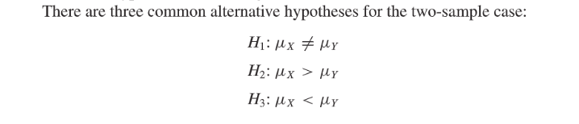
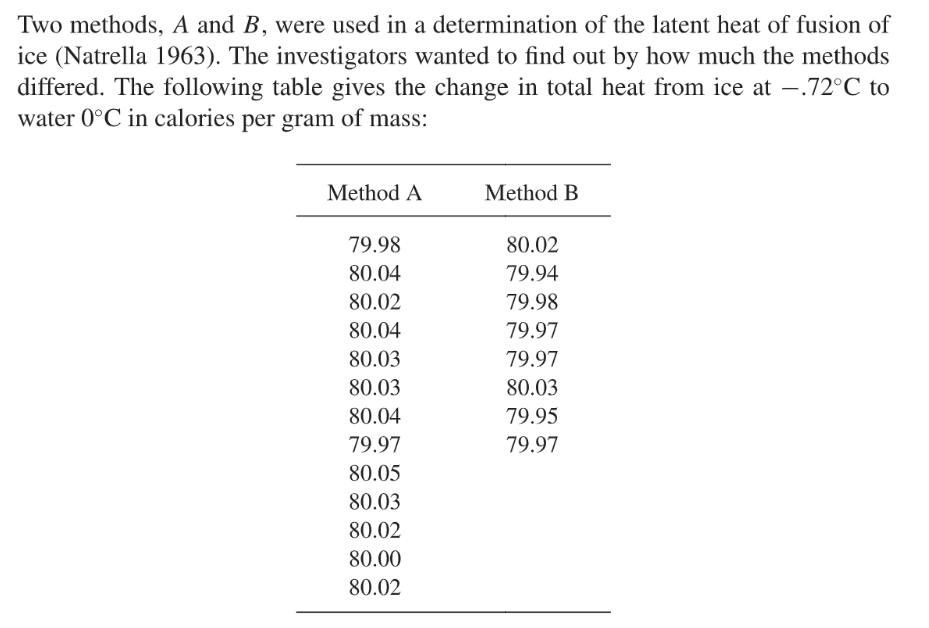
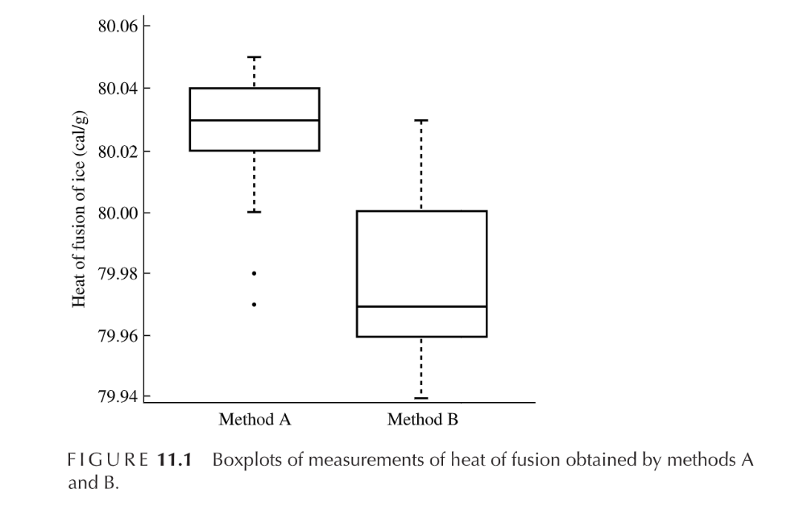
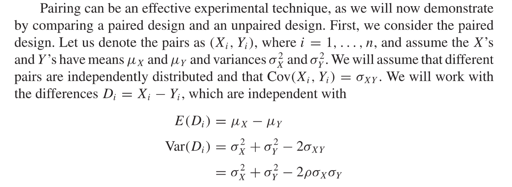
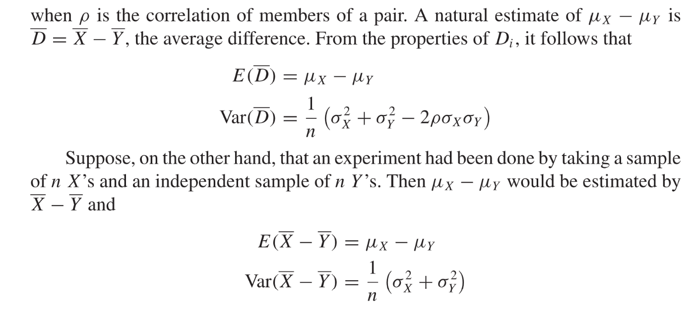

# 0 Intro
[Two Sample Tests.pdf](https://www.yuque.com/attachments/yuque/0/2022/pdf/12393765/1671285723191-c676d3b8-8e5c-448f-80c1-bcad76f0360f.pdf)
> 本小节我们将介绍**比较不同样本的分布**以及**分布有多不同**的方法。
> 在很多应用中，样本在从不同的条件下采集(某种特定人群，比如免疫力更强的人群)的，此时我们必须对这些条件带来的影响有一个大致的推断。
> We will be primarily concerned with effects that tend to increase or decrease the average level of response.
> **Response的定义: A decrease in the size of a tumor, or in the extent of cancer in the body, in response to treatment**
> 在很多实验条件下，两个样本常常被独立地看待。In a medical study, for example, a sample of subjects may be assigned to a particular treatment, and another independent sample may be assigned to a control (or placebo) treatment. This is often accomplished by **randomly assigning individuals to the placebo and treatment groups. **
> 我们会有如下问题: Many experiments are such that if they were repeated, the measurements would not be exactly the same. 为了解决这个问题，我们常常会使用如下的统计学模型: 
> `Control Group`的样本集会被建模成一个服从$F$的分布，`Treatment Group`的样本集会被建模成一个服从$G$的分布。于是数据分析师首先就会对于$F$和$G$之间的区别做一个统计学的推断。在很多实验中,`Treatment`的主要作用就是改变了实验对象的`Overall Response`，这个`Response`常常是通过样本均值或者其他一些反应样本的`Location`的一些统计量来衡量的。
> **当数据集较小时，我们不大可能完成较为严谨的数据分析。**

# 1 Test Difference in Means
## 1.1 独立同方差样本
### Hypothesis(Two-Sided)
> 

### Test Statistics
> 本小节中，我们假设样本集$X_1,X_2,\cdots, X_n$是从$N(\mu_x,\sigma^2)$分布中抽取的，而另一个独立的样本集$Y_1,Y_2,\cdots, Y_m$是从$N(\mu_Y,\sigma^2)$中抽取的。
> 如果我们将$X$'s 看做是`Treatment Group`的`Observation`, $Y$'s 看做是`Control Group`的`Observation`，所以`Treatment`带来的`Effect`由$\mu_X-\mu_Y$描述。
> **假设我们知道**$\sigma$**的值:**
> 则从之前的单元我们知道，我们可以使用`Plug-in Estimator`$\theta_{m+n}=T(X_1,X_2,\cdots,X_n)=\overline{X}-\overline{Y}$来估计$\mu_X-\mu_Y$。实际上对于这个统计量$\overline{X}-\overline{Y}$，我们可以计算其`Sampling Distribution`, $E[\overline{X}-\overline{Y}]=\mu_X-\mu_Y$, $Var(\overline{X}-\overline{Y})=Var(\overline{X})+Var(\overline{Y})=\sigma^2(\frac{1}{n}+\frac{1}{m})$, 因为正态分布的随机变量的线性组合仍然是正太分布，于是$\overline{X}-\overline{Y}\sim N(\mu_X-\mu_Y, \sigma^2(\frac{1}{n}+\frac{1}{m}))$
> 我们可以根据这个`Sampling Distribution`给出一个$\mu_X-\mu_Y$的`Confidence Interval`: 
> 根据中心极限定理, 我们有$[(\overline{X}-\overline{Y})-z_{\alpha/2}\sigma\sqrt{\frac{1}{n}+\frac{1}{m}} , (\overline{X}-\overline{Y})+z_{\alpha/2}\sigma\sqrt{\frac{1}{n}+\frac{1}{m}}]$
> **实际生活中, **$\sigma$**是未知的, 所以我们一般会使用样本方差来代替总体方差来估计**$Var(\overline{X}-\overline{Y})$**:**

**Proof**其实我们只要证明两件事:

1. $\frac{(\overline{X}-\overline{Y})-(\mu_x-\mu_Y)}{s_p\sqrt{\frac{1}{n}+\frac{1}{m}}}$可以写成$\frac{Z}{\sqrt{\frac{U}{m+n-2}}}$的形式，也就是一个标准正态分布的随机变量$Z$和一个卡方分布的随机变量$U$的函数的比值组合。$U\sim \chi_{m+n-2}^2$
2. $Z,U$是独立的。

首先我们由前文知道：$\chi_{n-1}=\frac{(n-1)s_X^2}{\sigma^2}$和$\chi_{m-1}=\frac{(m-1)s_Y^2}{\sigma^2}$分别是自由度为$n-1$和$m-1$的卡方分布随机变量。而且我们知道因为$s_X^2$是$X_i-\overline{X}$的函数, $s_Y^2$是$Y_i-\overline{Y}$的函数，而我们知道$X_i-\overline{X}$和$Y_i-\overline{Y}$是独立的(样本间是独立的)，于是$s_X^2$和$s_Y^2$是独立的，于是$\chi_{n-1}$和$\chi_{m-1}$是独立的。
而我们又知道，独立的卡方分布相加还是一个卡方分布，且自由度就是各自自由度的加和，于是$\frac{(n-1)s_X^2}{\sigma^2}+\frac{(m-1)s_Y^2}{\sigma^2}$的自由度就是$m+n-2$。
现在我们就可以将$\frac{(\overline{X}-\overline{Y})-(\mu_x-\mu_Y)}{s_p\sqrt{\frac{1}{n}+\frac{1}{m}}}$写成$\frac{Z}{\sqrt{\frac{U}{m+n-2}}}$, 其中$Z=\frac{(\overline{X}-\overline{Y})-(\mu_X-\mu_Y)}{\sigma\sqrt{\frac{1}{n}+\frac{1}{m}}}$, $U=\sqrt{\frac{(n-1)s_X^2}{\sigma^2}+\frac{(m-1)s_Y^2}{\sigma^2}}$，也就是说$Z\sim N(0,1)$, $U\sim \chi_{m+n-2}^2$
根据[样本均值和样本方差独立](https://www.yuque.com/alexman/kziggo/bxxml7#ABceC)的性质，我们知道$Z$(是样本均值的函数)和$U$(是样本方差的函数)是独立的。
于是我们不知道$\sigma$的值也无关紧要。

### One-sided Hypotheses
> 
> **Rejection Region:**
> 

### 案例
> 

**Box Plot**

## 1.2 Paired Samples
> 

