[statistics_1.pdf](https://www.yuque.com/attachments/yuque/0/2023/pdf/12393765/1676164448867-d507d284-12e3-4e35-bf76-23f231309691.pdf)
> **Reading: **John A. Rice - Mathematical Statistics and Data Analysis Chapter 6~7

# 1 Uni-Sample
## 1.1 Sample Mean&Variance
> 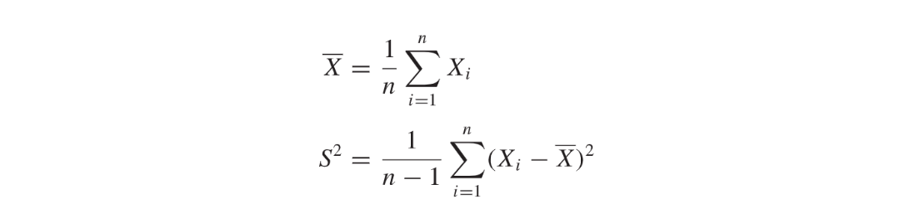

**Sample Mean - Unbiasedness and Consistency**Let $E[X]=\mu$

1. **Unbiasedness:** $\mathbb{E}[\overline{X_n}] = \frac{1}{n}\mathbb{E}[X_1+\cdots+X_n]=\frac{1}{n}\cdot n\times \mu =\mu$
2. **Consistency:** Easy to prove using CLT

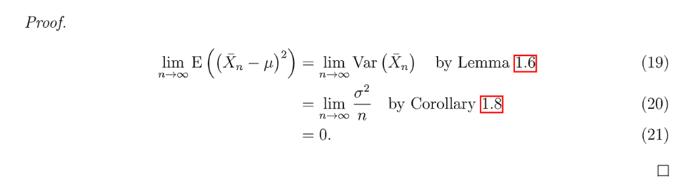
**Sample Variance - Unbiasedness and Consistency****首先证明无偏性:**
我们求$S^2$的期望$E[S^2]$
$\begin{aligned}E[(n-1)S^2]&=E[\sum_{i=1}^n (X_i-\mu+\mu-\overline{X}_n)^2]\\&=E[\sum_{i=1}^n(X_i-\mu)^2+\sum_{i}^n2(X_i-\mu)(\mu-\overline{X}_n)+\sum_{i=1}^n(\mu-\overline{X}_n)^2]\\&=E[\sum_{i=1}^n(X_i-\mu)^2+2(\sum_{i}^n(X_i-\mu)](\mu-\overline{X}_n)+n(\mu-\overline{X}_n)^2]\\&=E[\sum_{i=1}^n(X_i-\mu)^2+2n(\overline{X}_n-\mu)(\mu-\overline{X}_n)+n(\mu-\overline{X}_n)^2]\\&=\sum_{i=1}^nE[(X_i-\mu)^2]-nE[(\bar{X}-\mu)^2]\\&=n\sigma^2-nVar(\bar{X})\\&=(n-1)\sigma^2\end{aligned}$
所以$E[S^2]=\sigma^2$**(**这也是为什么要除以$n-1$的原因**)**
**然后证明一致性：**
$\bar{X_n}$根据大数定律，是`Consistent`的。
首先我们有: $\begin{aligned}
S_n^2&=\frac{1}{n-1}\sum_{i=1}^n (X_i-\bar{X_n})^2\\&= \frac{1}{n-1}[\sum_{i=1}^nX_i^2-2\sum_{i=1}^nX_i\cdot \bar{X_n}+\sum_{i=1}^n\bar{X_n}^2]\\&=\frac{1}{n-1}[\sum_{i=1}^n X_i^2-2n\bar{X_n}^2+n\bar{X_n}^2]\\&=\frac{1}{n-1}\{(\sum_{i=1}^n X_i^2)-n\bar{X_n}^2\}
\end{aligned}$
然后我们想探究$S_n^2$在$n\to \infty$的时候是否会收敛于总体方差$E[X^2]-E[X]^2$
根据大数定律, 我们有$\frac{1}{n}\sum_{i-1}^nX_i^2\stackrel{P}{\longrightarrow}E[X^2]$, $\bar{X_n}\stackrel{P}{\longrightarrow}E[X]$
现在问题的关键在于$\bar{X_n}^2\stackrel{P}{\longrightarrow}E[X]^2$是否成立，如果成立，那么我们就能证明$S_n^2$是一个总体方差的无偏且一致的估计量。**证明这个关系我们需要利用**`**Continuous mapping theorem**`:
我们只需要找到一个函数形如$g:\mathbb{R}^2\to \mathbb{R},g(x,y)=x-y^2$, 所以：因为我们有$\begin{bmatrix} \frac{1}{n}\sum_{i=1}^nX_i^2 \\ \bar{X_n}\end{bmatrix}\stackrel{P}{\longrightarrow}\begin{bmatrix} E[X^2]\\E[X]\end{bmatrix}$($\mathbf{X_n}\stackrel{P}\longrightarrow{\mathbf{X}}$)，则，我们将$\mathbf{X_n}$这个向量代入函数$g$, 所以我们得到$\frac{1}{n}\sum_{i=1}^nX_i^2 -\bar{X_n}^2\stackrel{P}{\longrightarrow}E[X^2]-E[X]^2=\sigma^2$，
于是$\begin{aligned}\lim_{n\to \infty}\frac{1}{n-1}\{(\sum_{i=1}^n X_i^2)-n\bar{X_n}^2\}&=\lim_{n\to \infty}\frac{n}{n-1}\cdot [(\frac{1}{n}\sum_{i=1}^nX_i^2)-\bar{X_n}^2]\\&\stackrel{P}\to E[X^2]-E[X]^2\\&=\sigma^2\end{aligned}$
于是样本方差也是总体方差的一致性估计量。

## 1.2 Sample Mean&Bias - Covariance
> 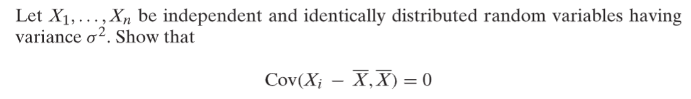
> 首先，我们可以根据西方差的线性性质:
> $Cov(X_i-\bar{X},\bar{X})= Cov(X_i,\bar{X})-Cov(\bar{X},\bar{X})\newline=Cov(X_i,\frac{1}{n}\sum_{j=1}^nX_j)-Var(\bar{X})\newline=\frac{1}{n}\sum_{j=1}^n Cov(X_i,X_j)-\frac{\sigma^2}{n}\newline=\frac{\sigma^2}{n}-\frac{\sigma^2}{n}=0$
> 其中最后一个等式成立的原因是：
> 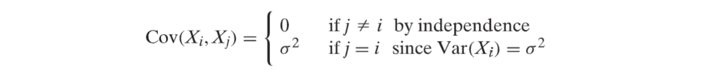
> 我们知道对于两个随机变量$X,Y$, 如果我们计算出了$Cov(X,Y)=0$, 这意味着$X,Y$是`uncorrelated`的，但这并不意味着$X,Y$就一定是互相独立的。
> 同样的道理，样本均值$\bar{X}$和`Deviation`$X_i-\bar{X}$我们通过上面的计算得到他们是`uncorrelated`的，但是我们不能说他们就一定是独立的。我们在后续的例子中会进一步探讨。

## 1.3 Indep. Sample Mean&Variance
> 假设我们有$X_1,X_2,\cdots,X_n$互相独立且服从$N(\mu,\sigma^2)$高斯分布，我们用$\bar{X}=\sum_{i=1}^n\frac{X_i}{n}$表示这些数据的样本均值。因为高斯分布满足线性变换性质，所以$\bar{X}$也是一个高斯分布的随机变量。我们在前文知道$\bar{X} \sim N(\mu, \frac{\sigma^2}{n})$.
> 现在，因为我们在`1.2`中已经建立了$Cov(\bar{X},X_i-\bar{X})=0, i=1,2,\cdots,n$的关系。
> 另外，因为对于任意两个服从联合高斯分布的变量$\begin{bmatrix} X\\Y\end{bmatrix}\sim N(\vec{\mu},\Sigma)$, 如果$Cov(X,Y)=0$, 则$X\perp Y$。
> 假设随机变量$\mathbf{Z}=\begin{bmatrix} Z_1\\Z_2\\\vdots\\Z_n\end{bmatrix}\sim N(0,I_n)$, 且$X_i=\mathbf{a_i}^T\mathbf{Z}+\mu_i$, 则
> $\begin{bmatrix} \overline{X}\\X_1-\overline{X}\\\vdots\\X_n-\overline{X}\end{bmatrix}=\begin{bmatrix}——\frac{1}{n}\sum_{i=1}^n\mathbf{a_i^T}——\\——\mathbf{a_1^T}-\frac{1}{n}\sum_{i=1}^n\mathbf{a_i^T}——\\\vdots\\——\mathbf{a_n^T}-\frac{1}{n}\sum_{i=1}^n\mathbf{a_i^T}——\end{bmatrix}\begin{bmatrix} Z_1\\Z_2\\\vdots\\Z_n\end{bmatrix}+\begin{bmatrix} \frac{1}{n}\sum_{i=1}^nu_i\\u_1-\frac{1}{n}\sum_{i=1}^nu_i\\\vdots\\u_n-\frac{1}{n}\sum_{i=1}^nu_i\end{bmatrix}$其实$\bar{X},X_1-\bar{X},\cdots, X_n-\bar{X}$都是是一系列独立的标准高斯分布的线性组合，所以:
> - $\begin{bmatrix} \overline{X}\\X_1-\overline{X}\\\vdots\\X_n-\overline{X}\end{bmatrix}$服从一个联合高斯分布，所以$Cov(X_i-\overline{X},\overline{X})=0\implies X_i-\overline{X}\perp \overline{X}$
> - 现在如果我们有一个随机变量$Y\sim N(\mu,\frac{\sigma^2}{n})$, 那么$Y, X_i-\bar{X},\cdots, X_n-\bar{X}$也满足多元高斯分布, 其实就相当于$Y$代替了$\bar{X}$的位置。进一步说$Y, X_i-\bar{X},\cdots, X_n-\bar{X}$组成的联合分布实际上和$\bar{X},X_1-\bar{X},\cdots, X_n-\bar{X}$组成的联合分布是一样的。
> - 因为$\bar{X}$和`Deviations`$X_i-\bar{X},i=1,\cdots,n$是独立的，所以根据变量独立性的性质: 如果$X,Y$独立，则$f(X)$和$g(Y)$。所以$\bar{X}$**和**`**sample variance**`$S^2=\sum_{i=1}^n\frac{(X_i-\bar{X})^2}{n-1}$**是独立的。**

**更详细的证明**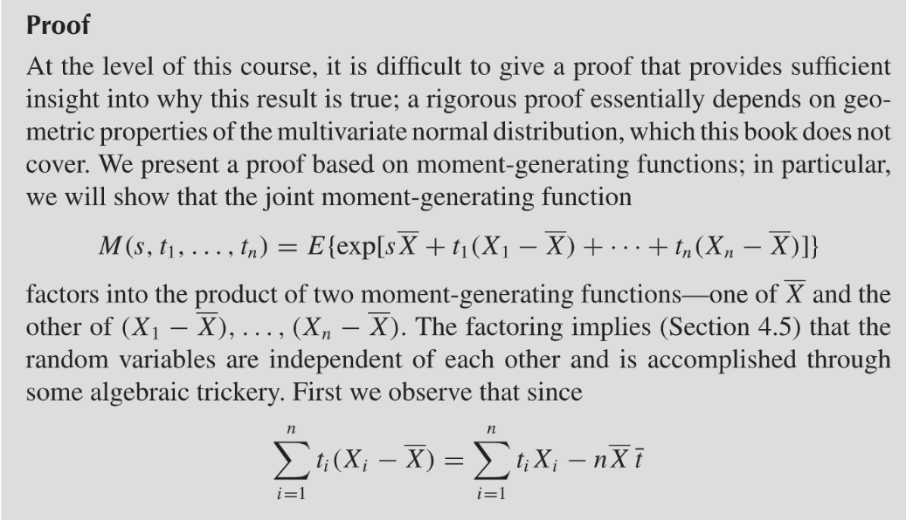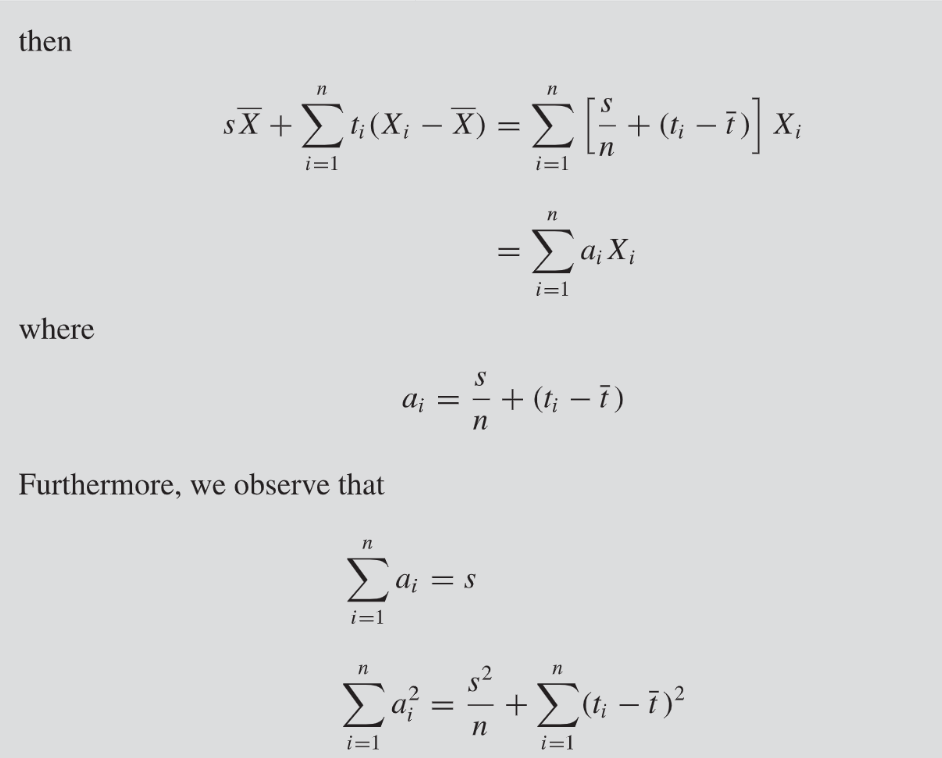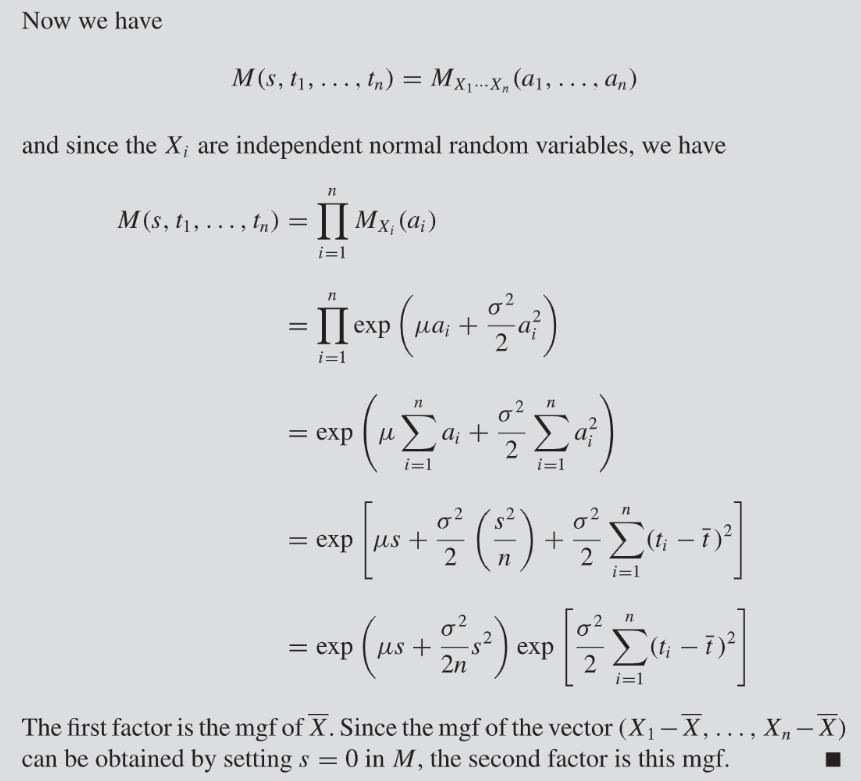

## 1.4 Chi-square dist&Sample Variance
> 我们考察下列两个对于总体方差的估计量, 并试图建立其与卡方分布的联系。
> $S_n^2=\frac{1}{n-1}\sum_{i=1}^n (X_i-\overline{X})^2, \mathbb{E}[S_n^2]=\sigma^2$
> $\hat{\sigma^2}=\frac{1}{n}\sum_{i=1}^n (X_i-\overline{X})^2$
> 我们先给出结论：假设$X_1,\cdots, X_n\stackrel{i.i.d}\sim N(\mu,\sigma^2)$, $\frac{(n-1)S_n^2}{\sigma^2}\sim \chi_{n-1}^2$, $\frac{n\hat{\sigma^2}}{\sigma^2}\sim \chi_{n-1}^2$
> 证明如下:
> **我们利用**`**Algebraic Identity**`**: **
> $\begin{aligned}(n-1)S^2&=\sum_{i=1}^n(X_i-\mu+\mu-\bar{X})^2\\&=\sum_{i=1}^n (X_i-\mu)^2+\sum_{i=1}^n(\bar{X}-\mu)^2-2(\bar{X}-\mu)\sum_{i=1}^n(X_i-\mu)\\&=\sum_{i=1}^n (X_i-\mu)^2+n(\bar{X}-\mu)^2-2(\bar{X}-\mu)n(\bar{X}-\mu)\\&=\sum_{i=1}^n(X_i-\mu)^2-n(\bar{X}-\mu)^2\end{aligned}$
> 所以$(n-1)S^2+n(\bar{X}-\mu)^2=\sum_{i=1}^n(X_i-\mu)^2$
> 我们对上式**两边同时除以**$\sigma^2$, 得到:
> $\frac{(n-1)S^2}{\sigma^2}+(\frac{\bar{X}-\mu}{\frac{\sigma}{\sqrt{n}}})^2=\sum_{i=1}^n(\frac{X_i-\mu}{\sigma})^2$
> - $\sum_{i=1}^n(\frac{X_i-\mu}{\sigma})^2$是一系列独立的`Chi-squared`随机变量(自由度为$n$，因为$X_1,\cdots, X_n$的值都可以动态地变化，有$n$个可以变化的值)的和。他的`MGF`是$M(t)=(1-2t)^{-\frac{n}{2}}$
> - $(\frac{\bar{X}-\mu}{\frac{\sigma}{\sqrt{n}}})^2$, 也是一个`Chi-squared`的随机变量(自由度为$1$的， 如果我们将$\bar{X}$看成一个整体的话)。他的`MGF`是$M(t)=(1-2t)^{-\frac{1}{2}}$
> 
由前文我们知道$\bar{X}$和$S_n^2$是独立的，所以$f(S_n)=\frac{(n-1)S_n^2}{\sigma^2}和g(\bar{X})=\frac{\bar{X}-\mu}{\frac{\sigma}{\sqrt{n}}}$是独立的。
> 于是$\frac{(n-1)S_n^2}{\sigma^2}和\frac{\bar{X}-\mu}{\frac{\sigma}{\sqrt{n}}}$的和$\sum_{i=1}^n(\frac{X_i-\mu}{\sigma})^2$的`MGF`就等于他们各自的`MGF`的乘积，用数学语言描述就是:
> $E[e^{t(n-1)\frac{S_n^2}{\sigma^2}}]\cdot (1-2t)^{-\frac{1}{2}}=(1-2t)^{-\frac{n}{2}}$
> 化简之后得到:
> $E[e^{t(n-1)\frac{S_n^2}{\sigma^2}}]=(1-2t)^{-\frac{n-1}{2}}$
> 但是$(1-2t)^{-\frac{n-1}{2}}$是一个自由度为$n-1$的`Chi-squared Distribution`的`MGF`。而`MGF`又能唯一确定一个随机变量的分布信息，所以:
> $\frac{(n-1)S_n^2}{\sigma^2}$**服从一个自由度为**$n-1$**的**`**Chi-squared Distribution**`**。**
> **由于**$\frac{n\hat{\sigma^2}}{\sigma^2}=\frac{(n-1)S_n^2}{\sigma^2}$**, 所以**$\frac{n\hat{\sigma^2}}{\sigma^2}\sim \chi_{n-1}^2$

## 1.5 Sample Variance&t-distribution
> 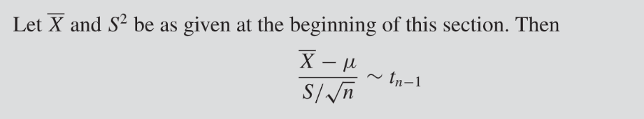

**Proof**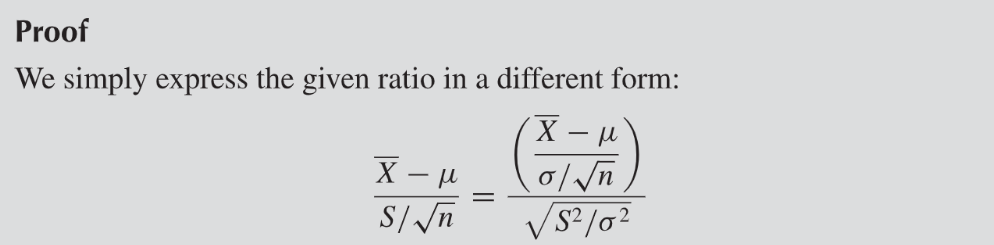
其中$\frac{\overline{X}-\mu}{\frac{\sigma}{\sqrt{n}}}\sim N(0,1)$, $\sqrt{\frac{S^2}{\sigma^2}}=\sqrt{\frac{\frac{(n-1)S^2}{\sigma^2}}{n-1}}$, 而$\frac{(n-1)S^2}{\sigma^2}\sim \chi_{n-1}^2$, 所以根据[t-distribution的构成](https://www.yuque.com/alexman/kziggo/gy7zbz#ESsIY), 我们知道这是一个$t_{n-1}$分布。

## 1.6 Conditional Normal Distribution
> 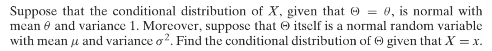

**Key**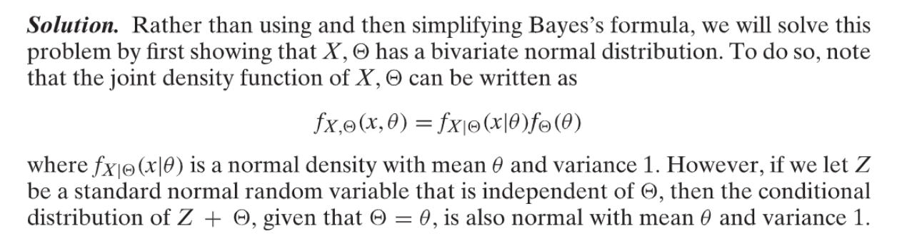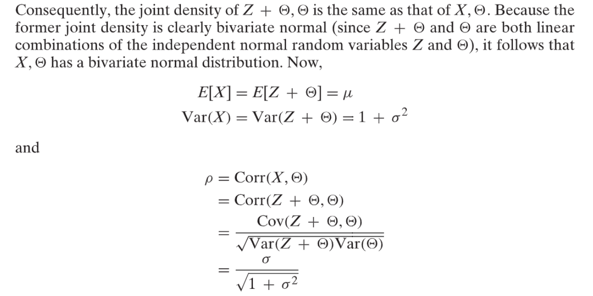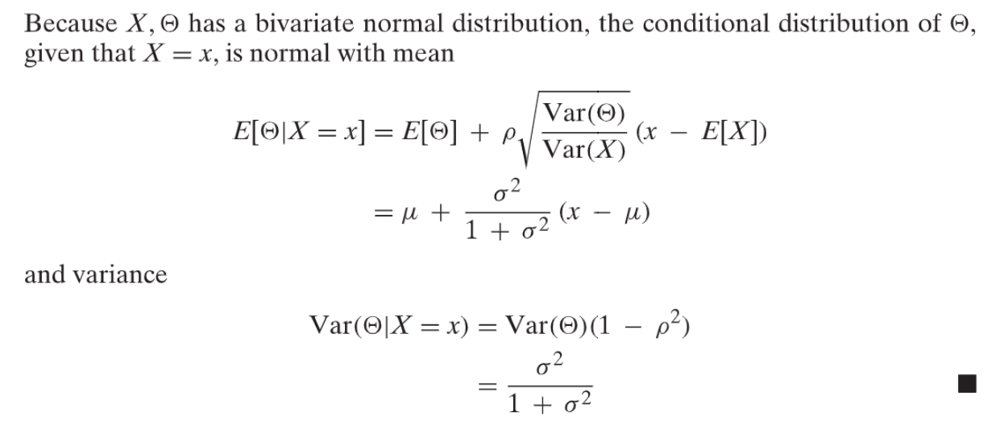

## Recitations
### Problems
[TA_session_5.pdf](https://www.yuque.com/attachments/yuque/0/2023/pdf/12393765/1676165636118-f21f5e7b-8281-48ea-812c-fb925b28f03a.pdf)

### Solutions
[TA_session_5_sn.pdf](https://www.yuque.com/attachments/yuque/0/2023/pdf/12393765/1676165636124-74d6a4c9-2060-4508-9179-790d73a127fa.pdf)

## Homework
### Problems
[hw4.pdf](https://www.yuque.com/attachments/yuque/0/2023/pdf/12393765/1676165636123-011d0914-f475-4876-aa9b-5ab230a7a720.pdf)

# 2 Bi-Sample
## 2.1 Sample Covariance
> The data sample is in the form of i.i.d random vectors, which is $\{(X_1,Y_1),(X_2,Y_2),\cdots, (X_n,Y_n)\}$
> 样本与样本之间是独立的，因此$X_i,Y_j$是独立的，即$E[X_iY_j]=E[X_i]E[Y_j]$。
> $Cov(X_i,Y_j)=\begin{cases}\sigma_{XY}&i=j\\0&i\neq j \end{cases}$  
> $E[XY]=\mu_{XY},E[X]=\mu_X,E[Y]=\mu_Y, E[X]E[Y]=\mu_X\mu_Y,\sigma_{XY}=\mu_{XY}-\mu_X\mu_Y$
> **总体样本协方差:**
> $\sigma_{XY}=Cov(X,Y)=\frac{E[(X-E[X])(Y-E[Y])]}{\sqrt{Var(X)Var(Y)}}=\mu_{XY}-\mu_x\mu_Y$
> **样本协方差:**
> $S_{XY}=\sum_{i=1}^N\frac{(X_i-\overline{X}_n)(Y_i-\overline{Y}_n)}{N-1}$

**证明无偏性和一致性****无偏性:**

所以这个估计量是无偏的。
**一致性:**

根据弱大数定律，。
根据`CMT`, 我们只要找到一个连续标量函数, 则因为 , 所以
于是
因为, 于是by CMT again.

