# 1 Permutation Test
## Testing Setup
> [!def]
> Suppose we have two groups of data. $D_A$ and $D_B$, and we want to compare the distribution(parametrized by mean) between them. A typical choice of null/alt hypothesis is:
> $$\mathcal{H}_0:\mu_{A}=\mu_{B}\quad \mathcal{H}_A:\mu_{A}\neq \mu_{B}$$
> 
> The idea of permutation test is that, **if we assume that the null hypothesis is true, then the labeling of the data should be meaningless since they have the same distribution.** So we could permute the data points so that the data points in each group is changing across different permutations and we can calculate a lot of $m(D_A)-m(D_B)$ and compare our test statistics with it to determine if the test statistic is too extreme for null hypothesis.

> [!example] 
> 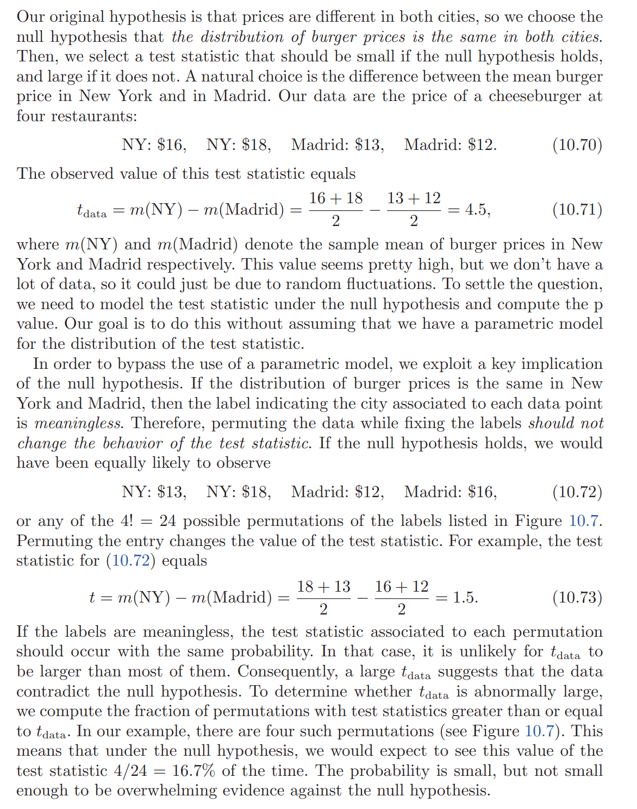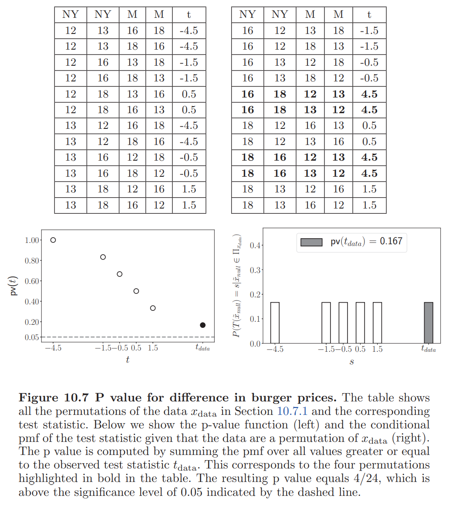

## P-Value of the Test
> [!def]
> 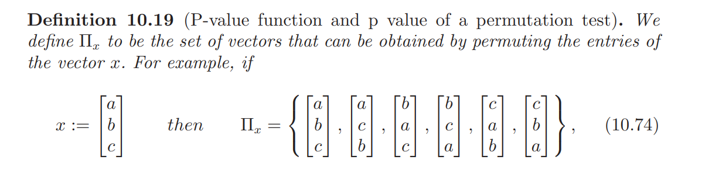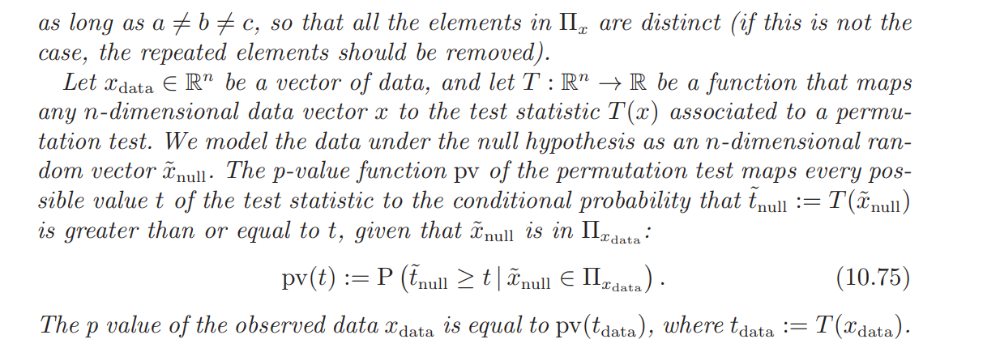

## Exchangeability
> [!property]
> 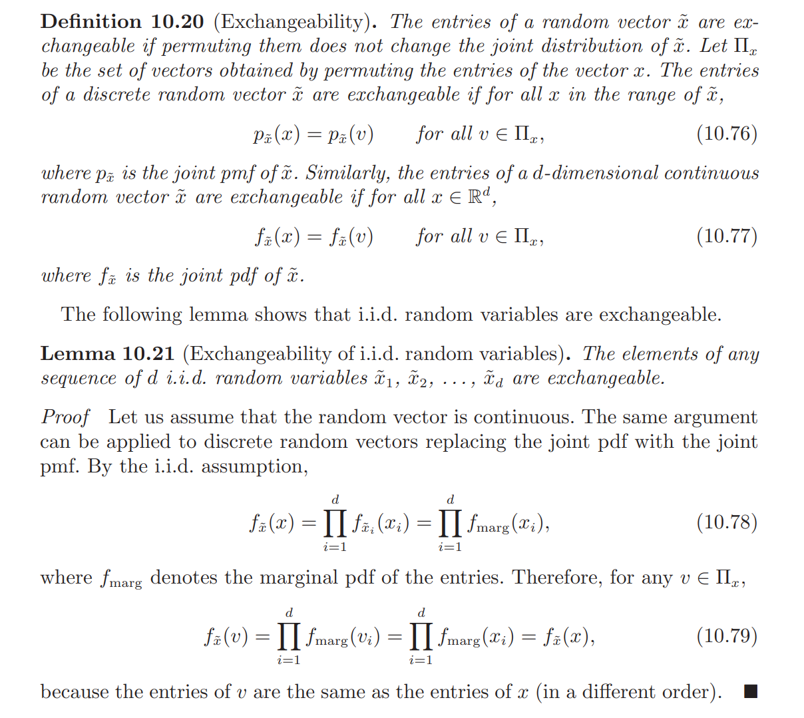

## P-Value under exchangeability
> [!def]
> 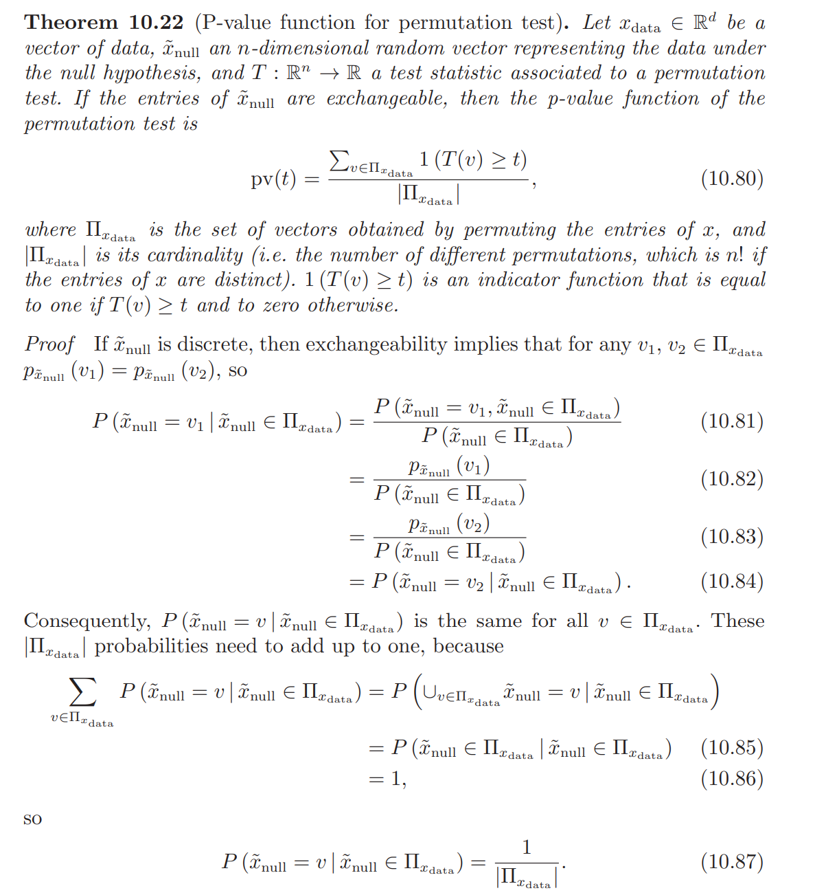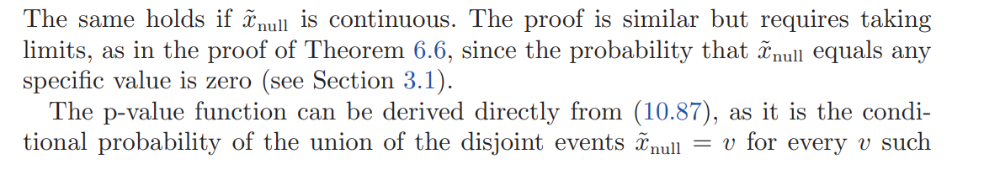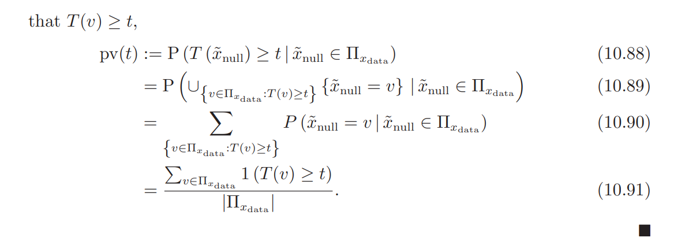

## Permutation Test via Monte Carlo Method
> [!def]
> 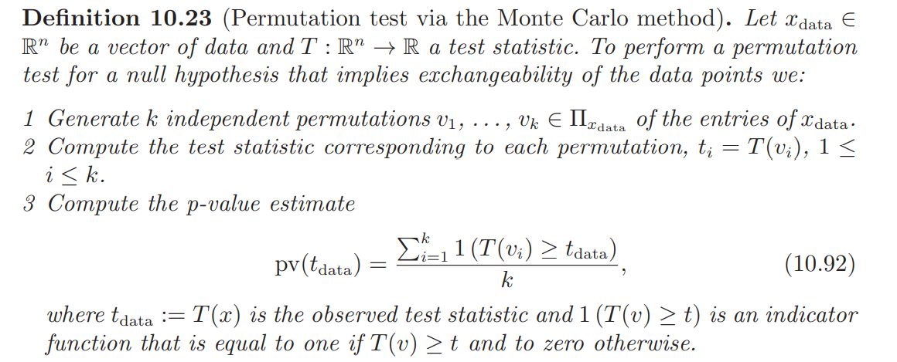

  

# 2 Kolmogorov-Smirnov Test
> 不用任何离散化和参数化的估计，而仅仅依赖于`Empirical Distirbution`就可以检验一个数据集的分布。

## Test Settings
> 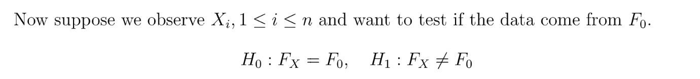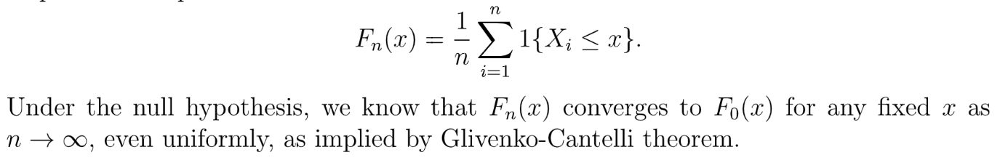

## Test Statistics
### Formula
> 
> 本质上是`Maximum Deviation of` $F_n(x)$from $F_0(x)$  

### Distribution
> 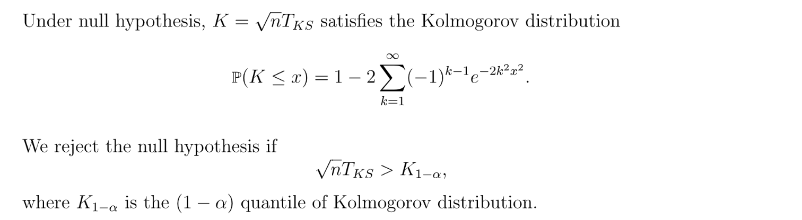

**Graphs**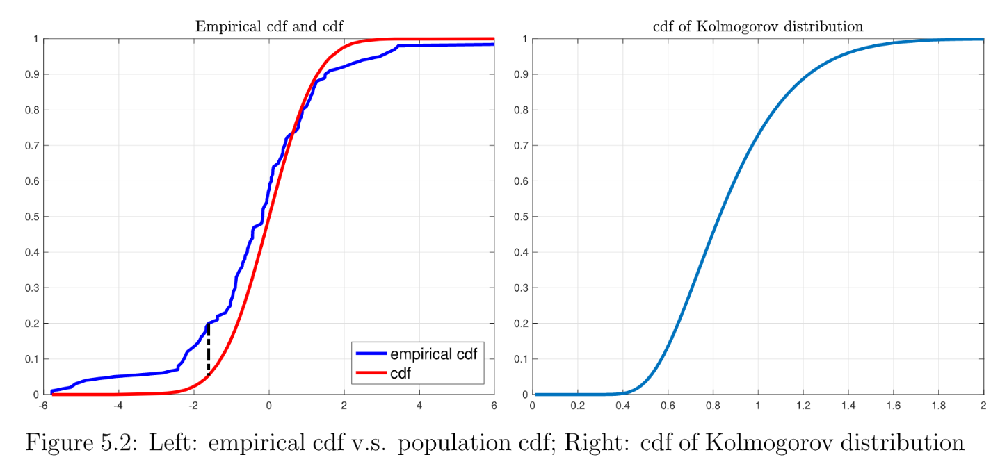

## Two-Sample Test
> 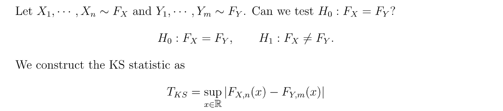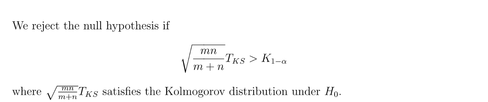

