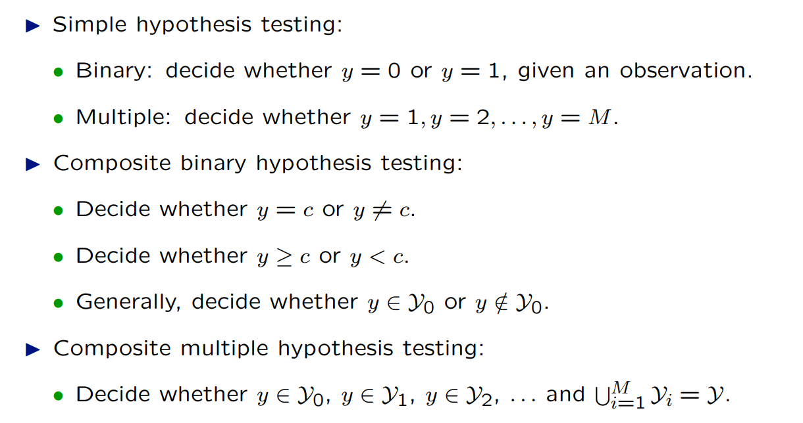
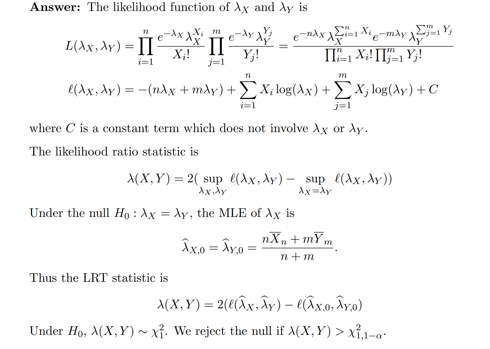
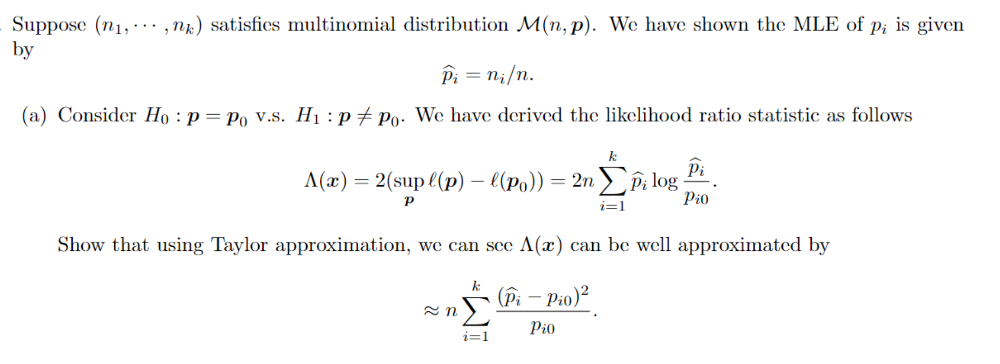
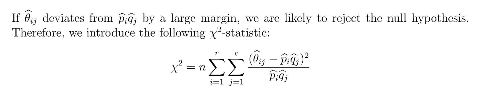

# 1 Basics
## 1.1 Null/Alternative Hypothesis
### Elements
:::info

:::
> 
> **Key Elements:**
> 

**Example**There is a salt paking machine, producing bags of salt, with average weight of 0.5 $kg$, std. 0.015 kg. Weight $X\sim N(\mu,\sigma^2)$, we want to check whether this machine is working properly.
Now we sample from the population and get the data of 9 bags: 0.497, 0.506, 0.518, 0.498, 0.511, 0.520, 0.515, 0.512. 

1. Data, $X_i,i=1,2,\cdots, 9$
2. Hypothesis: $X_i\sim N(\mu,\sigma^2)\sim N(\mu,0.015^2)$。$H_0=0.5kg$, $H_0:\mu=\mu_0=0.5$, $H_1:\mu\neq \mu_0$
3. Test: $\hat{\mu}=\overline{X}_n$, criteria to reject or not.

一种测试的方法是: 只要$\hat{\mu}= \mu_0$我们就`accept null hypothesis`, 否则就`Reject`, 但是这样就会导致基本上所有$\hat{\mu}$都被拒绝。
另一种更好的测试方法是: $|\hat{\mu}-\mu_0|>c,c>0$, 才reject.

4. How to determine $c$, we want $c$can provide certain level of accuracy of out test.

### Simple/Composite Hypothesis
> 
> `Simple hypothesis`的意思就是**在这个假设的前提**下，我们的数据的分布情况**可以用唯一的概率分布来完整描述**。
> 比如: $H_0:\theta=\theta_0$
> 
> `Composite hypothesis`的意思就是**在这个假设的前提**下，我们的数据的分布情况**不能用唯一的概率分布来完整描述**。
> 比如:$H_0:\theta\in \Theta_0$vd $H_1:\theta\in \Theta_A$,$\Theta_0$表示假设的参数集合(`Null Hypothesis`)，集合的`Cardinality`大于等于一。$\Theta_A$表示`Alternative Hypothesis`的参数集合。
> 比如$H_0:\theta\leq 0$
> **总结:**
> 

**More Examples**
- **Simple Hypotheses**

- **Composite Hypotheses**

- **Extra sensory Perception（ESP）**

## 1.2 Test Statistics&Rejection Region
### Test Statistics
> 假设$X_1,\cdots ,X_n\sim f(x;\theta)$, 且$T(X)$是一个统计量`Statistic`，这个概念我们很熟悉，就是`Sample Statistics`, 也就是我们通过样本数据计算出来的一个统计量，比如$\overline{X}_n$(样本均值)，或者$S_n^2=\frac{1}{n-1}\sum_{i=1}^n(X_i-\overline{X}_n)^2$，当然也可以是在$H_0$的假设下形如$T(X)=\frac{\sqrt{n}(\overline{X}_n-\mu_0)}{\sigma}$的`Statistic`。

### One-sided/Two-sided Test
> 

### Rejection Rules/Region
> 一般而言，我们对于`Rejection Region`的定义形如一个集合$R$, 所有落在$R$中的`Sample Statistic`$T(X)$都可以被看成拒绝$H_0$的证据。
> 比如我们有$H_0:\mu=0,H_1:\mu\neq 0$。$R=\{x:|x-\mu_0|\geq c\}$，也就是$\{x:|x-0|\geq c\}$, 如下图所示:
> 
> 一般我们的`Rejection Region`会定义成(以`Two-sided Test`为例):
> (Under null hypothesis)

### Acceptance Region
[Acceptance Region.pdf](https://www.yuque.com/attachments/yuque/0/2022/pdf/12393765/1671266911241-b06ed3fb-27e9-42ba-a34e-e813963105db.pdf)
> 一般我们的`Rejection Region`会定义成(以`Two-sided Test`为例):
> 
> `Acceptance Region`可以用来从`Test Statistics`推得`Confidence Interval`:
> 

## 1.3 Type I/II Error
> [!def]
> 
> `Type I/II Error` 取决于我们的`Rejection Region`的大小。
> `Hypothesis Testing`的目的本质上是使两种`Errors`发生的概率尽可能的小。但是同时控制两种误差都很小实际上是有些困难的。所以实际上，我们一般只会尽量使得`Type I Error`尽可能小, 然后才会去考虑使得`Type II Error`尽可能小。
> **换句话说:**
> 

> [!example]
> 

## 1.4 Significance&Power 
### Significance Level/Type I Error
> [!def]
> 
> 我们常常使用$\alpha$来表示`Significance Level`

### Power
> [!def]
> `The probability that the test statistics is in the rejection region of`$H_0$`when`$H_A$`is true`。
> 
> 

> [!example]
> 

### High/Low Power Test
> [!def]
> **High Power Test:**
> 一般而言是当$H_0$的条件概率分布和$H_A$的条件概率分布相差比较远的情况。我们来简单解释一下: 首先`Power`的定义就是我们在$H_A$是正确的情况下还能够正确`Reject`$H_0$的概率(能力)，而下图中的情况就是我们极有可能观测到$x_1$这个样本数据，而$x_1$在$H_0$的`Rejection Region`中，换句话说我们极有可能在$H_A$是正确的情况下观测到$x_1$, 且正确拒绝$H_0$。也就是我们极有可能做出正确的决策，这对应着`High Power Test`。
> 
> **Lower Power Test:**
> 一般而言是当$H_0$的条件概率分布和$H_A$的条件概率分布相差比较近的情况。下图中如果我们观测到$x_2$这个数据点，我们便做出了错误的决策，也就是在$H_A$是正确的情况下没有`Reject`$H_0$。即便我们也可能观测到$x_3$，但是和`High Power Test`相比，这样的概率已经很小了，所以这种情况下我们称之为`Low Power Test`。
> 

## 1.5 Power Function
> 本小节所有的讨论计算都是基于`Simple Hypothesis`的。

### Definition
> [!def]
> 有了上面的铺垫, 我们可以介绍一个新的概念，称为`Power Function`。
> 
> **我们对这个定义进行解读:**
> 1. $\theta$是`True Parameter`, 可以认为$\theta\in \mathbb{R}$。
> 2. $\beta(\theta)=\mathbb{P}_{\theta}(T(X)\in R)$是一个关于$\theta$的函数，$\mathbb{P}_{\theta}$是假设总体参数(真实参数)为$\theta$下的概率测度。表示的是假设$\theta$是正确的时候，我`Reject Null Hypothesis`的概率大小。
> 3. $0\leq \beta(\theta) \leq 1$
> 4. 当$\theta=\theta_0$的时候，$\beta(\theta)$的结果就是`Type I Error`$\alpha$。即`Type I Error`就是$\alpha=\beta(\theta_0)$。
> 5. 当$\theta\neq \theta_0$的时候，$\beta(\theta)$表示的就是这个`Hypothesis`的`Power`, 正如前文所提到的那样，一个假设检验的`Power`是$\theta$的函数。表示的是: 假设真实参数是$\theta$($\theta\neq \theta_0$, 就是说真实的参数不等于我们假设的参数$\theta_0$, 但是我们是不知道真实参数$\theta$的)。
> 6. 我们可以通过: $1-\beta(\theta)$($\theta\neq \theta_0$)来计算`Type II Error`, $\theta\in \Theta_A$
> 7. 综上，`Power of a test`+`Type II Error`=$1$

### Size of the test
> [!def]
> 
> 当我们的`Hypothesis`是`Simple`的时候, $\alpha=\beta(\theta_0)$
> 换句话说，我们有 $\beta(\theta)\leq \alpha$ when $\theta\in \mathbf{\Theta_0}$

### How to Calculate
> [!important]
> 如果我们的假设检验是: $H_0: \mu=\mu_0, H_1:\mu\neq \mu_0$, 我们的`Rejection Region`一般选取为$\{x:|x-\mu_0|\geq c\}$
> 

### Represent the Errors
> [!def]
> 1. When $\mu=\mu_0$, $\beta(\mu)$ is **Type I Error**
> $\mu_0$表示的就是`Null Hypothesis`（我们假定真正的参数是$\mu_0$）, 真实的参数是$\mu$, 令$\mu=\mu_0$代入`Power Function`中我们就可以计算出`Type I Error`的大小。
> 
> 2. When $\mu\neq \mu_0$, $\beta(\mu)$ is **Type II Error**
> $\mu_0$表示`Null Hypothesis`的假设, $\mu_A$表示`Alternative Hypothesis`的假设, 假设$\mu\in H_A$(即$H_A$是正确的且$\mu\neq \mu_0$)。
> 
> **Intuitions:**
> $\beta(\mu)=\mathbb{P}_{\mu}(|\overline{X}_n-\mu_0|>c)$, 就是假设`Alternative Hypothesis`是正确的前提下我拒绝了`Null Hypothesis`的概率，此时$1-\beta(\mu)$就表示我在$H_A$正确的前提下没有拒绝$H_0$, 也就是`Type II Error`的定义。
> 所以`Type II Error`就是$$1-\beta(\mu)=\Phi(\frac{\sqrt{n}(c-\mu+\mu_0)}{\sigma})-\Phi(\frac{\sqrt{n}(-c-\mu+\mu_0)}{\sigma})$$

### Minimizing the Errors
> [!important]
> 沿用之前的数据集$X_1,\cdots,X_n\sim N(\mu,\sigma^2)$
> 
> **最小化**`Type I Error`**:**
> 假设我们现在有个要求，就是想让`Type I Error`的`Level`小于等于$\alpha$。且$$H_0: \mu=\mu_0, H_1:\mu\neq \mu_0$$
> 首先我们求出这个假设检验的`Type I Error`: 
> 
> 
> 方法就是我们令$$2(1-\Phi(\frac{\sqrt{n}c}{\sigma}))=\alpha$$, 就可以得到: $$\Phi(\frac{\sqrt{n}c}{\sigma})=1-\frac{\alpha}{2}$$, 于是$c=\frac{(z_{1-\alpha/2})\sigma}{\sqrt{n}}$, 因为这样我们的$\beta(\mu_0)=\mathbb{P}_{\mu_0}(|\overline{X}_n-\mu_0|\geq c)\leq \alpha$, 满足条件
> 
> **最小化**`**Type II Error**`**:**
> 因为$$1-\beta(\mu)=\Phi(\frac{\sqrt{n}(c-\mu+\mu_0)}{\sigma})-\Phi(\frac{\sqrt{n}(-c-\mu+\mu_0)}{\sigma})$$, 通过一些代数运算我们知道当$\mu=\mu_0$时候，$1-\beta(\mu)$取到最大值$$\Phi(\frac{\sqrt{n}c}{\sigma})-\Phi(-\frac{\sqrt{n}c}{\sigma})=1-\beta(\mu_0)$$, 也就是说$sup_{\mu\neq \mu_0}(1-\beta(\mu))=1-\beta(\mu_0)$, 所以我们发现:
> 
> **如果`Type I Error`越小，似乎对应的`Type II Error`就会越大，于是我们不能同时控制两个`Errors`使他们同时都很小。但是我们更倾向于先让`Type I Error`尽可能小，然后再控制`Type II Error`的大小。**

### Calculating the Power Function
> [!def]
> 

> [!example]
> **HA: mu=108**
> **HA: mu=112**
> **HA: mu=116**
> **通过上面的例子我们可以发现:**
> - `Power`取决于$H_A$中的$\mu_A$，会随着$\mu_A$(其实就是真实的参数)的变化而变化，实际上后面我们会看到`Power`是$\mu$(`True Parameter`)的函数。
> - 当$H_A$中的$\mu_A$和$H_0$中的$\mu_0$相距越远，则`Power`的值就会越大。

> [!example]
> **Graphical Illustration**

### Summary
> [!summary]
> 上文我们得到了`Type I Error`的表达式:
> 
> 所以我们有如下结论:
> 1. 随着$c$增大，我们越来越倾向于保留`Null Hypothesis`而不拒绝，也就是`Rejection Region`变小了。于是`Type I Error`变小。但是此时`Type II Error`增大。
> 2. 随着$n$增大，`Type I Error`也会变小。
> 
所以如果我们想要控制`Type I Error`尽可能小，我们需要选取一个适当的`Rejection Region`。

### Exercises
> [!example]
> 同时限制Type I/II Errors**$H_0:\mu=0$, $H_1:\mu=1$。人为规定一个`Rejection Region` $\{\overline{X}_n:\overline{X}_n\geq c\},c>0$使得即便我观测到了$\overline{X}_n=0$我也仍然接受`Null Hypothesis`。
> 
> 于是我们计算这个`Hypothesis Test`的`Power Function`:$\begin{aligned}\beta(\mu)&=\mathbb{P}_{\mu}(\overline{X}_n\geq c)\\&=\mathbb{P}_{\mu}(\frac{\sqrt{n}(\overline{X}_n-\mu)}{\sigma}\geq \frac{\sqrt{n}(c-\mu)}{\sigma})\\&=1-\Phi(\sqrt{n}(c-\mu))\end{aligned}$$\mu$是真实的参数
> 
> **计算**`**Type I Error**`**令**$\mu=0$**:**
> $$\beta(0)=1-\Phi(\sqrt{n}c)$$
> 
> **计算**`**Type II Error**`**令**$\mu=1$**:**
> $$1-\beta(1)=\Phi(\sqrt{n}(c-1))$$
> 
> **最小化`Errors`:**
> 
> 此时如果我们增大$c$的值, `Type-I Error`是变小了，但是对应的`Type-II Error`变大了.
> 
> 于是我们希望$1-\Phi(\sqrt{n}c)\leq \alpha$和$\Phi(\sqrt{n}(c-1))\leq \alpha$同时成立。
> 
> 于是$c \geq \frac{z_{ 1-\alpha}}{\sqrt{n}}$, $c\leq \frac{z_{\alpha}}{\sqrt{n}}+1=-\frac{z_{1-\alpha}}{\sqrt{n}}+1$
> 
> 只要$\frac{z_{ 1-\alpha}}{\sqrt{n}}\leq 1-\frac{z_{1-\alpha}}{\sqrt{n}}$, 且$\exists c, \frac{z_{ 1-\alpha}}{\sqrt{n}}\leq c\leq 1-\frac{z_{1-\alpha}}{\sqrt{n}}$就可以。

## 1.6 Composite Hypotheses
### One-sided Testing
> **Question:** Find out $c$such that the size of the test is smaller than certain number $\alpha$?
> 方法还是计算`Power Function`:
> 
> **Question: **What about the size?
> 

### Two-sided Testing
> Let$X_1,\cdots, X_n\sim Possion(\lambda)$
> Let $\lambda_0>0$, **Find size **$\alpha$**z-test based on **$X_i$
> For $H_0:\lambda=\lambda_0$, $H_1:\lambda\neq \lambda_0$

**Key**
1. Estimator: We can use $\hat{\lambda}=\overline{X}_n$as our estimator for $\lambda$
2. Rejection Region: For some $c$, $\beta(\lambda_0)=\mathbb{P}_{\lambda_0}(|\overline{X}_n-\lambda_0|>c)=\alpha$在$\mathbb{P}_{\lambda_0}$这个概率测度之下，$X_1,\cdots, X_n\sim Possion(\lambda_0)$. Therefore $\begin{aligned}\beta(\lambda_0)&=\mathbb{P}(\hat{\lambda}-\lambda_0<-c)+\mathbb{P}(\hat{\lambda}-\lambda_0>c)\\&=\mathbb{P}(\frac{\hat{\lambda}-\lambda_0}{\sqrt{\frac{\lambda_0}{n}}}<\frac{-c}{\sqrt{\frac{\lambda_0}{n}}})+\mathbb{P}(\frac{\hat{\lambda}-\lambda_0}{\sqrt{\frac{\lambda_0}{n}}}>\frac{c}{\sqrt{\frac{\lambda_0}{n}}})\\&=2(1-\Phi(\frac{\sqrt{n}c}{\sqrt{\lambda_0}}))\\&=\alpha\end{aligned}$
3. 此时$\frac{\sqrt{n}c}{\sqrt{\lambda_0}}=z_{1-\alpha/2}$, 所以$c=\frac{z_{1-\alpha/2}\sqrt{\lambda_0}}{\sqrt{n}}$，于是$\frac{\sqrt{n}(\hat{\lambda}-\lambda_0)}{\sqrt{\lambda_0}}>z_{1-\alpha/2}$
4. $\begin{cases} T(X)=\frac{\sqrt{n}(\overline{X}_n-\lambda_0)}{\sqrt{\lambda_0}}\\R\{X|T(x)>z_{1-\alpha/2}\}\end{cases}$

## 1.7 Credible Region
> 

## 1.8 Highest Density Region(HDR)
> 

# 2 Choices of Statistics
## 2.1 Z-Test
> 
> 

## 2.1 T-statisitics
> 对于总体均值$\mu$($N(\mu,\sigma^2)$), 我们的`Sample Statistics`一般是`Sample Average`$\overline{X}_n$, $H_0$为$\mu=\mu_0$。
> 我们会有$\frac{\sqrt{n}(\overline{X}_n-\mu_0)}{\sigma}\sim N(0,1)$`under`$H_0:\mu=\mu_0$
> 当$\sigma$未知时，$T(X)=\frac{\sqrt{n}(\overline{X}_n-\mu_0)}{S_n}$, where $S_n=\frac{1}{n-1}\sum_{i=1}^n(X_i-\overline{X_n})^2$(which is unbiased and consistent)
> 根据`Sluskty Theorem`, $T(X)=\frac{\sqrt{n}(\overline{X}_n-\mu_0)}{S_n}\rightsquigarrow N(0,1)$这是`**Asymptotic Distribution**`**of **$T(X)$
> Rejection Region: Reject $H_0$if $|T(X)|\geq z_{1-\frac{\alpha}{2}}$, It works well when $n$is large.

## 2.2 Student T-Distribution
### Definition
> `T-distribution of degree n`:$T=\frac{Z}{\sqrt{\frac{Y}{n}}}$, $Z\sim N(0,1),Y\sim \chi_n^2$, 且$Y,Z$是独立的。

### PDF
> $f_T(t)=\frac{\Gamma(\frac{n+1}2{})}{\sqrt{n\pi}\Gamma(\frac{n}{2})}(1+\frac{x^2}{n})^{-\frac{n+1}{2}},x\in \mathbb{R}$, 其中$\Gamma(x)=\int_0^{\infty} y^{x-1}e^{-y}dy,\Gamma(\frac{1}{2})=\sqrt{\pi}$
> Properties:
> 1. When $n\to \infty$, we have $\frac{Y}{n}\stackrel{P}\to E[\chi_1^2]=1$, by `Sluskty Theorem`, $T\rightsquigarrow Z$, 而$(1+\frac{x^2}{n})^{-\frac{n+1}{2}}\to e^{-\frac{x^2}{2}}$($\lim_{n\to \infty}(1+\frac{1}{x})^x=e$)
> 2. When $n\to 0$, 
> 
所以`T-distribution` is and interpolation between Cauchy(Heavy Tailed)/Normal(Light-tailed)

## 2.3 Distribution of T(X) 
> **Question:** Can we derive the **exact distribution** of $T(X)$而不是`asymptotic distribution`?
> 假设样本量只有$n=2$, 此时$T(X)=\frac{\sqrt{2}(\frac{X_1+X_2}{2}-\mu_0)}{\sqrt{(X_1-\overline{X}_2)^2+(X_2-\overline{X}_2)^2}}$, where $\overline{X}_2=\frac{X_1+X_2}{2}$
> 此时分子上是一个$N(0,\sigma^2)$的高斯分布，分母:$\sqrt{(X_1-\overline{X}_2)^2+(X_2-\overline{X}_2)^2}=\sqrt{\frac{(X_1-X_2)^2}{2}}$
> 所以$T(X)=\frac{\sqrt{2}(\frac{X_1+X_2}{2}-\mu_0)}{|\frac{X_1-X_2}{\sqrt{2}}|}$, 分母是$N(0,\sigma^2)$的高斯分布。
> 且分子和分母是独立的，因为分子是$f(\overline{X}_n)$, 分母是$g(S_n)$
> 此时$T(X)=\frac{Z_1}{Z_2}, Z_1\sim N(0,\sigma^2), Z_2\sim N(0,\sigma^2)$, $T(X)$服从`Cauchy Distribution`。
> **Derivation:**
> Derive the exact distribution of $T(X)=\frac{\sqrt{n}(\overline{X}_n-\mu_0)}{S_n}$
> $(n-1)S_n^2=\sum_{i=1}^n (X_i-\overline{X}_n)^2\sim\chi_{n-1}^2 \cdot \sigma^2$, 所以$S_n=\sqrt{\frac{\chi_{n-1}^2\cdot \sigma^2}{n-1}}$
> $T(X)=\frac{\frac{\sqrt{n}(\overline{X}_n-\mu_0)}{\sigma}}{\sqrt{\frac{\chi_{n-1}^2}{n-1}}}\sim t_{n-1}$

## 2.4 Hypothesis Testing
> $H_0: \mu=\mu_0$$H_1:\mu\neq \mu_0$
> Reject the null if $|T(X)|\geq t_{n-1,1-\alpha/2}$, $1-\frac{\alpha}{2}$-quantile for t-distribution of degree of $n-1$
> **Power Function(Type I Error):** $\beta(\mu_0)=\mathbb{P}(|T(X)|\geq t_{n-1,1-\alpha/2})=\alpha$

**Remark 1 - Comparsion between T-dist and Normal Rejection Region**如果我们使用$T(X)$的`Asymptotic Distribution`来构建`Rejection Region`: The other rejection region is $|T(X)|\geq z_{1-\alpha/2}$
$R_1=\{x:|x|\geq t_{n-1,1-\alpha/2}\}$
$R_2=\{x:|x|\geq z_{1-\alpha/2}\}$
Which one is better as rejection region?

所以$R_1\leq R_2$, 因为$t_{n-1,1-\alpha/2}\geq z_{1-\alpha/2}$($t-dist$的`Bell Curve`更平)
**Remark 2 - T-Test works only for Guassian Data**How to test if data is Guassian?

## 2.5 Two-Sample T-Test
> 
> 
> In HW 7

# 3 Wald Test
## Two-sided
> 

**Example 1**$X_1\cdots, X_n\stackrel{i.i.d}\sim Bernoulli(\theta)$
$H_0:\theta=\theta_0,H_1:\theta\neq\theta_0$
$\hat{\theta_n}=\overline{X_n}$
此时`By CLT`: $\begin{cases} \frac{\sqrt{n}(\hat{\theta_n}-\theta_0)}{\sqrt{\theta_0(1-\theta_0)}}\rightsquigarrow N(0,1)\\ \frac{\sqrt{n}(\hat{\theta_n}-\theta_0)}{\sqrt{\overline{X}_n(1-\overline{X}_n)}}\rightsquigarrow N(0,1)\end{cases}$
Reject the null with $size-\alpha$if
$|\frac{\sqrt{n}(\hat{\theta_n}-\theta_0)}{\sqrt{\overline{X}_n(1-\overline{X}_n)}}|\geq z_{1-\alpha/2}$an approximation when $n$is large
**Example 2**$1000$coins, $560$H, $440$T
$H_0:\theta_0=\frac{1}{2}$, $H_1:\theta\neq \frac{1}{2}$
$\hat{\theta_n}=\overline{X}_n=0.56$
$\begin{cases}T_1(\overline{X}_n)= \frac{\sqrt{n}(\hat{\theta_n}-\theta_0)}{\sqrt{\theta_0(1-\theta_0)}}\approx3.79\\T_2(\overline{X}_n)= \frac{\sqrt{n}(\hat{\theta_n}-\theta_0)}{\sqrt{\overline{X}_n(1-\overline{X}_n)}}\approx 3.82\end{cases}$
如果$\alpha=0.05$, 则$z_{1-\alpha/2}=z_{0.975}\approx 1.96$
而我们算出的`Statistics`都大于$1.96$, 所以都需要拒绝$H_0$
Reject the $H_0$: `Type I Error is at most 0.5`

## One-sided 
> 

**Example**$H_0:\theta\geq \theta_0, H_1:\theta<\theta_0$
Reject $H_0$if $\hat{\theta_0}\leq c$for $c$is small
Goal: Choose $c$such that $sup_{\theta\geq \theta_0,\theta\in \Theta_0}\beta(\theta)\leq \alpha$
$\begin{aligned}\beta(\theta)&=\mathbb{P}(\hat{\theta_n}\leq c)\\&=\mathbb{P}(\frac{\hat{\theta_n}-\theta}{\hat{se}(\hat{\theta_n})}\leq \frac{c-\theta}{\hat{se}(\hat{\theta_n})})\\&\approx\Phi(\frac{c-\theta}{\hat{se}\hat{\theta_n}})\end{aligned}$
Since $\frac{\hat{\theta_n}-\theta}{\hat{se}(\hat{\theta_n})}\rightsquigarrow N(0,1)$
$sup_{\theta\geq \theta_0}\beta(\theta)=sup_{\theta\geq \theta_0}\Phi(\frac{c-\theta}{\hat{se}\hat{\theta_n}})$是$\theta$的单调递减函数, 在$\theta_0$处取到最大值
于是$\Phi(\frac{c-\theta_0}{\hat{se}\hat{\theta_n}})\leq \alpha$, 于是$\frac{c-\theta_0}{\hat{se}\hat{\theta_n}}\leq z_{\alpha}=-z_{1-\alpha}$
$c=\theta_0-z_{1-\alpha}\hat{se}(\hat{\theta_n})$
In other words, reject $H_0$if $\hat{\theta_n}\leq c$, $\frac{\hat{\theta_n}-\theta}{\hat{se}(\hat{\theta_n})}\leq -z_{1-\alpha}$

## Exercises
### Types of Error
> 

**Question 1**
**Question 2**

### Possion Wald Test
> 

**Question 1**
**Question 2**

### Gaussian Wald Test
> 

**Key**

# 4 P-Value
## 4.1 Definition
> [!def]
> For a size $\alpha$ test, we have a testing statistics $T(X)$ and $C_{\alpha}$, $\mathbb{P}(T(X)\in C_{\alpha})\leq \alpha$
> Suppose we observe $T(\overline{X})$, observed the sample of $T(X)$
> 
> It is the smallest size that you will reject the null hypothesis.

**Example**$X_1,\cdots, X_n\sim N(\mu,\sigma^2)$, $\sigma^2$is known.
$H_0:\mu=\mu_0, H_1:\mu\neq \mu_0$
$T(X)=\overline{X}_n$
$C_{\alpha}=\{\overline{X}_n||\overline{X}_n-\mu_0|\geq z_{1-\alpha/2}\cdot \sigma\}$, which is **a function of **$\alpha$, when $\alpha$gets smaller, $z_{1-\alpha/2}$becomes bigger.
Suppose that we observe $T(\overline{X})=\overline{X}_n$
p-value:=$inf_{\alpha}\{\overline{X}_n||\overline{X}_n-\mu_0|\geq z_{1-\alpha/2}\cdot \sigma\}$
Compute the $\alpha^*$
$\begin{aligned}|\overline{X}_n-\mu_0|&=z_{1-\alpha^*/2}\cdot \sigma\\1-\frac{\alpha^*}{2}&=\Phi(\frac{|\overline{X}_n-\mu_0|}{\sigma})\\\alpha^*&=2(1-\Phi(\frac{|\overline{X}_n-\mu_0|}{\sigma}))\end{aligned}$

## 4.2 Insight
> [!important]
> **What does p-value mean?**
> Suppose $H_0$ is true, then what is the probability of observing another sample that is more extreme or equally extreme than the observed one?
> 
> P-value is a measure of how extreme the observed data is under $H_0$
> Small p-value means more extreme occurency for the observed data, which means we are more likely to reject the null hypothesis $H_0$

> [!example] **Illustration**
> 

## 4.3 Summary
> [!summary]
> **P-value means:**
> 1. The smallest size that we reject the null hypothesis. The smaller the p value is, the more evidence we have to reject the null hypothesis, and thus it is easier to find such $\alpha$ as $\inf\{\alpha:T(X\in R_{\alpha})\}$(Starting from 0).
> 2. The probability of observing a more extreme sample than the observed sample.

## 4.4 Wald Statistics
> $1000$coins, $560$H, $440$T
> $H_0:\theta_0=\frac{1}{2}$, $H_1:\theta\neq \frac{1}{2}$
> $\hat{\theta_n}=\overline{X}_n=0.56$
> $\begin{cases}T_1(\overline{X}_n)= \frac{\sqrt{n}(\hat{\theta_n}-\theta_0)}{\sqrt{\theta_0(1-\theta_0)}}\approx3.79\\T_2(\overline{X}_n)= \frac{\sqrt{n}(\hat{\theta_n}-\theta_0)}{\sqrt{\overline{X}_n(1-\overline{X}_n)}}\approx 3.82\end{cases}$
> Reject  $|\frac{\sqrt{n}(\overline{X}_n-\theta)}{\sqrt{\theta(1-\theta)}}|\geq z_{1-\alpha/2}$
> Substitute $|\frac{\sqrt{n}(\overline{X}_n-\theta)}{\sqrt{\theta(1-\theta)}}|$by either $T_1$or $T_2$
> Compute the P-value
> $\alpha^*=2(1-\Phi(\frac{\sqrt{n}(\overline{X}_n-\theta)}{\sqrt{\theta(1-\theta)}}))=2(1-\Phi(\frac{\sqrt{1000}(0.56-0.5)}{0.5}))=2(1-0.378)<0.001$
> 
> Thus we have strong evidence against $H_0:\theta=\frac{1}{2}$。

**Remark**$X_1,\cdots X_n\sim N(\mu,\sigma^2)$, size-$\alpha=\{\overline{x}_n||\overline{x}_n-\mu_0|\geq z_{1-\alpha/2}\cdot \sigma\}$
Confidence Interval, size $\alpha$rejection, p-value
$\mu_0\notin 1-\alpha-CI$interval($\mu_0: \overline{x}_n\pm z_{1-\alpha/2}\cdot\sigma$)$\iff$reject the null of size $\alpha$
$\iff$p-value is smaller than $\alpha$

## 4.5 Compute P-value
> [!code]
> **Left-tailed test:** p-value = cdf(x)
> **Right-tailed test:** p-value = 1 - cdf(x)
> **Two-tailed test:** p-value = 2 * min{cdf(x) , 1 - cdf(x)}
> 
> $\{T(X)||T(X)|>|T(x)|\}$for two-sided test, 
> 本质上是$p-value=2*(1-\Phi(|T(x)|))$, $T(x)$是从数据集算出来的那个`t-statistic`

## 4.6 Distribution of P-Values

## 4.7 Exercises
### E1 Bernoulli 
> [!def]
> Calculate the p-value: 
> Test:$H_0:\theta\leq \frac{1}{2}, H_1:\theta>\frac{1}{2}$
> Data: $7$success out of 10 trials of Bernoulli trials $Ber(\theta)$

> [!important]
> **Key**
> P-value= $\alpha^*=\sup_{\theta\leq \frac{1}{2}}\mathbb{P}_{\theta}(\frac{\sqrt{n}(0.7-\theta)}{\sqrt{\theta(1-\theta)}}\geq\frac{\sqrt{n}(c-\theta)}{\sqrt{\theta(1-\theta)}})=1-\Phi(\frac{\sqrt{n}(c-\theta)}{\theta})$when $n$is large.
> 
> When $n$is small, we have $T(X)=\sum_{i=1}^{10} X_i \sim Binomial(10,\theta)$, p-value=$\alpha^*=\sup_{\theta\leq \frac{1}{2}}P_{\theta}(T(X)\geq 7)$, and we know that when $\theta=\frac{1}{2}$, $P_{\theta}(T(X)\leq 7)$is the largest, so $\alpha^*=\sum_{k=7}^{10}(_k^{10})(\frac{1}{2})^k(\frac{1}{2})^{10-k}=\sum_{i=7}^{10}(_k^{10})(\frac{1}{2})^{10}$

### E2 Poisson 1
> [!example]
> $H_0:\lambda\leq 1, H_1:\lambda>1$, $X=3$, $X\sim Poisson(\lambda)$
> Calculate the p-value.
> 
> **Key**
> Let $T(X)=X$
> p-value=$\alpha^*=\sup_{\lambda\leq 1}P_{\lambda}(T(X)\geq3)=\sup_{\lambda\leq 1}\sum_{k=3}^{\infty}\frac{\lambda^k e^{-\lambda}}{k!}=\sum_{k=3}^{\infty}\frac{e^{-\lambda}}{k!}$(obtained when $\lambda=1$)

### E3 Poisson 2
> [!example]
> $H_0:\lambda\leq 1, H_1:\lambda>1$, $X_1=5,X_2=3,X_3=1$, $X\sim Poisson(\lambda)$
> Calculate the p-value.
> 
> **Key**
> Let $T(X)=\sum_{i=1}^3X_i=5+3+1=9\sim Possion(3\lambda)$p-value=$\alpha^*=\sup_{\lambda\leq 1}P_{\lambda}(T(X)\geq 9)=\sup_{\lambda\leq 1}\sum_{k=9}^{\infty}\frac{(3\lambda)^k e^{-3\lambda}}{k!}=\sum_{k=9}^{\infty}\frac{e^{-3\lambda}}{k!}\approx 0.0038$(obtained when $\lambda=1$)

# 5 Likelihood-Ratio Test
## 5.1 Definition
> [!def]
> 
> $\Theta$ is the full parameter space
> $\Theta_0$ is all the value for null hypothesis parameter.
> 换句话说: $\hat{\theta}=argmax_{\theta\in \Theta}l(\theta)$, $\hat{\theta_0}=argmax_{\theta\in \Theta_0}l(\theta)$
> 
> 
> 第二点说的是，因为$\hat{\theta_n}\stackrel{P}\to \theta_{true}\in \Theta_0$, so $\lambda(X)$is small. Reject $H_0$ if $\lambda(x)$is too large.

## 5.2 Construct Rejection Region
> [!def]
> Claim: t-test, z-test, are children of LRT(Likelihood Ratio Test)
> 

> [!quiz] **Question 1**
> Question: $\lambda(\overline{X})$is observed, how to compute the p-value?
> 我们只需要求满足$\lambda(\overline{X})=\chi_{1,1-\alpha^*}^2$的$\alpha^*$作为`P-value`即可, 所以$\alpha^*=\mathbb{P}(\chi_1^2\geq \lambda(\overline{X}))$

> [!quiz] **Question 2**
> 

> [!quiz]
> **Question 3 Wald Test**
> $W(X)=\frac{\sqrt{n}(\overline{X}_n-\mu_0)}{\sigma}$, $R=\{X| |\frac{\sqrt{n}(\overline{X}_n-\mu_0)}{\sigma}|>C_{\alpha}\}$

> [!quiz] **Question 4 Gaussian Parameter - Likelihood Ratio Test**
> $l(\mu,\sigma^2)=-\frac{n}{2}log\sigma^2 -\frac{1}{2\sigma^2}\sum_{i=1}^n(X_i-\mu)^2$, $\hat{\mu}=\overline{X}_n$$l(\hat{\mu},\hat{\sigma^2})=$
> $l(\hat{\mu},\hat{\sigma_0^2})=$
> $\lambda(X)=log(\frac{\sigma_0^2}{\hat{\sigma^2}})+\frac{\hat{\sigma^2}}{\sigma_0^2}>c$
> $\frac{\sigma_0^2}{\hat{\sigma^2}}>\alpha$or $\frac{\hat{\sigma^2}}{\sigma_0^2}>b\implies b<\frac{\hat{\sigma^2}}{\sigma_0^2}<\frac{1}{\alpha}$
> Compare it with wald test.

## 5.3 Asymptoticity of LRT Statistics
> [!def]
> 这个结论只对`Simple Hypotheses`成立，对于`Composite Hypotheses`来说视情况而定。但是这种思想提供了一种构造`Rejection Region`$\{\lambda(X)\geq c\}$的方法。

> [!proof]
> 
> 因为$l''(\theta)=\sum_{i=1}^n\frac{d^2}{d\theta^2}logf(x;\theta)$, 所以$\frac{l''(\theta)}{n}=\frac{1}{n}\sum_{i=1}^n\frac{d^2}{d\theta^2}logf(x;\theta)\stackrel{P}\to I(\theta_0)$if $H_0$is true.
> 
> 因为$\hat{\theta_n}\stackrel{P}\to\theta_0$, then by CMT $I(\hat{\theta_n})\stackrel{P}\to I(\theta_0)$due to consistency
> 
> By asym of MLE:$\sqrt{n}(\hat{\theta_n}-\theta_0) \rightsquigarrow N(0,\frac{1}{I(\theta_0)})$
> 于是我们可以根据Delta Method构造CI

## 5.4 LRT in Multinomial 
> [!thm]
> 
> - $r$是degree of freedom in $\Theta$(dimension)
> - $q$是degree of freedom in $\Theta_0$
> 
> Then under $H_0$, $\lambda(X)\rightsquigarrow \chi_{r-q}^2$

> [!example]
> **Gaussian Data Examples**
> 1. $\Theta_0=\{(\mu,\sigma^2):\mu\in \mathbb{R}, \sigma^2=\sigma_0^2\}$. $\bf dim \Theta_0=1, dim \Theta=2, \lambda(X)\rightsquigarrow \chi_{1}^2$
> 2. $\Theta_0=\{(\mu,\sigma^2):\mu\in \mu_0, \sigma^2=\sigma_0^2\}$. $\bf dim \Theta_0=0, dim \Theta=2, \lambda(X)\rightsquigarrow \chi_{2}^2$
> 
> $H_0:\vec{\theta}=\vec{\theta_0}, H_1:\vec{\theta}\neq\vec{\theta_0}, \theta\in \mathbb{R}^d$
> The theorem implies $\lambda(X)\rightsquigarrow \chi_{d}^2$
> Asymptotic normality of MLE:
> $\sqrt{n}(\hat{\theta_n}-\theta_0)\rightsquigarrow N(0,I(\theta_0)^{-1})$
> $I_{ij}(\theta)=\mathbb{E}[\frac{\partial l^2(\theta)}{\partial \theta_i\partial \theta_j}], where~~ l(\theta)=logf(x;\theta)$
> $\lambda(X)=2(l(\hat{\theta_n}-l(\theta_0))\stackrel{Taylor ~~Expansion} \approx (\hat{\theta_n}-\theta_0)^Tl''(\theta_0)(\hat{\theta_n}-\theta_0)\approx \chi_d^2$ 

> [!example]
> **Mendal's Pea(Multinomial Example)**
> 
> 
> **MLE Derivation:**$L(\mathbf{p})=(_{n_1,\cdots, n_k}^n)p_1^{n_1}\cdots p_k^{n_k}$($\sum_{i=1}^k p_i=1, p_i\geq 0$)
> 
> Aim: $\sup_{p}L(\mathbf{p})$, $\mathbf{p}\in \mathbf{R^k}$ 而$\sup_{\mathbf{p}}L(p)=\sup_{\mathbf{p}}l(p)=n_1logp_1+\cdots+n_klogp_k$with constraint $\sum_{i=1}^k p_i=1, p_i\geq 0$ 
> 
> $n_1logp_1+\cdots+n_klogp_k=\sum_{l=1}^{k-1}n_llogp_l+n_klog(1-\sum_{l=1}^{k-1}p_l)=f(p_l)$
> 
> 所以$\frac{\partial f(p_l)}{\partial p_l}=\frac{n_l}{p_l}+n_l\cdot \frac{-1}{1-\sum_{l=1}^{k-1}p_l}=\frac{n_l}{p_l}-\frac{n_k}{p_k}=0$
> 
> 所以$\begin{cases}\frac{n_l}{p_l}&=\frac{n_k}{p_k}&1\leq l \leq k-1 \\\sum_l p_l&=1,\sum_l n_l=n\end{cases}$, 如果$\frac{a}{b}=\frac{c}{d}$, 则$\frac{a+c}{b+d}=\frac{a}{b}$
> 
> 所以$\frac{n_l}{p_l}=\frac{n_k}{p_k}=n$$p_l=\frac{n_l}{n}$(empirical frequency)
> 
> 
> 
> 实际上`General LRT`算的是KL Divergence between empirical distribution and null hypothesis distribution. Divergence过大就会拒绝$H_0$。
> 
> **总的来说:**
> 

## 5.6 How to test Composite Hypothesis
> [!important]
> 1. 当$\theta\in \mathbb{R}^1$:
> $H_0:\theta\in \{\theta_0,\theta_1\},H_1:\theta\notin \{\theta_0,\theta_1\}$,
> $H_0^0:\theta=\theta_0;H_0^1: \theta=\theta_1$, $\lambda^1(x), \lambda^0(x)$
> $H_0: \theta\leq \theta_0$
> 2. 当$\theta\in \mathbb{R}^2$:
> $H_0:\vec{\theta}=\vec{\theta_0}$, $H_1:\vec{\theta}\neq \vec{\theta_0}$
> $\vec{\theta_0}=(\theta_{0,1},\cdots, \theta_{0,k})\in \mathbb{R}^k$
> $\lambda(X)=2[l(\hat{\theta_n})-l(\vec{\theta_0})]$, $\lambda(X)\rightsquigarrow \chi_{r-q}^2$
> 3. $H_0:\vec{p}=\vec{p_0}, H_1:\vec{p}\neq \vec{p_0}$
> $\vec{p_0}=\{p_{0,1},\cdots, p_{0,k}\}$
> $\lambda(X)=2n\sum_{i=1}^n \hat{p_i}log\frac{\hat{p_i}}{p_{0,i}}$(KL-Divergence)

> [!example]
> **Example**$H_0;\sigma^2=\sigma_0^2$, $H_1:\sigma^2\neq \sigma_0^2$, $X_1,\cdots, X_n\sim N(\mu,\sigma^2)$
> 
> $\vec{\theta}:r=2$, $\vec{\theta_0}=(\mu,\sigma^2)$($\sigma^2$is fixed), $q=1$
> 
> 所以$\lambda(X)\rightsquigarrow \chi_{1}^2$

## 5.7 Construct Confidence Interval 
> [!def]
> 既然是一个`Sample Statistic`, 而且我们也知道其渐进分布，我们当然可以对原参数构造一个`Confidence Interval`出来，使用`Inverting LRT`的方法即可，我们用一个例子来说明。
> 
> 本质上`Confidence Interval`就是`Null Hypothesis`下的`Acceptance Region`, 所以我们首先需要找到在`Null Hypothesis`下的`Rejection Region`, 所以我们需要先求出`LRT`是什么:
> $$\lambda(X)=2*(\sup_{p\in \mathbb{R}}l(p)-\sup_{p\in H_0}(p))=2n*(\overline{X}_nlog\frac{\overline{X}_n}{p_0}+(1-\overline{X}_n)log\frac{1-\overline{X}_n}{1-p_0})\rightsquigarrow\chi^2_{1}$$
> 然后我们计算其`Rejection Region`():
> $$R(p_0)=\{X:2n*(\overline{X}_nlog\frac{\overline{X}_n}{p_0}+(1-\overline{X}_n)log\frac{1-\overline{X}_n}{1-p_0})>\chi^{2}_{1,1-\alpha}\}$$
> $$\mathbb{P}_{p_0}(\lambda(X)\in R(p_0))=\alpha$$
> 
> 所以其`Acceptance Region`就是:
> $$A(p_0)=\{X:2n*(\overline{X}_nlog\frac{\overline{X}_n}{p_0}+(1-\overline{X}_n)log\frac{1-\overline{X}_n}{1-p_0})<\chi^{2}_{1,1-\alpha}\}$$
> 
> 接下来我们只需要反解出即可:
> $$C(X)=\{p_0:2n*(\overline{X}_nlog\frac{\overline{X}_n}{p_0}+(1-\overline{X}_n)log\frac{1-\overline{X}_n}{1-p_0})<\chi_{1,1-\alpha}^2\}$$

## 5.8 Code Example

# 6 Goodness of Fit Test
[Goodness of Fit.pdf](https://www.yuque.com/attachments/yuque/0/2022/pdf/12393765/1668735440690-8fe28275-b0de-4837-b332-8427ffffcc2d.pdf)
[MIT-Assessing Goodness of Fit.pdf](https://www.yuque.com/attachments/yuque/0/2022/pdf/12393765/1668735609909-07d9d1c3-e2b3-4733-b2ae-57009994d025.pdf)
> 我们有`Goodness of Fit Test`, $\chi^2-test$(**transform ECDF into multinomial distribution**)
> `KS-Test`: $\sup_{X\in \mathbb{R}}|F_n(X)-F(X)|$(Under the whole space)

## 6.0 Motivation
> [!motiv] Motivation
> **Motivation:** Given $X_1,\cdots, X_n$, ask if the data are samples from a given distribution?
> 
> **Two-sample tests**
> - Sample1 :$X_1,\cdots, X_n$
> - Sample 2: $Y_1,\cdots, Y_n$
> 
> We want to know whether $X_i, Y_j$are from the same distribution?
> **Setup: **Suppose $X_1,\cdots, X_n\sim F_X$(We don't know $F_X$)
> $$H_0: F_X=F_0, H_1:F_X\neq F_0$$
> **Non-parametric Methods:**
> 1. Likelihood Ratio Test: 
> 2. $\chi^2-test$:
> 3. Kolmogorov-Smivnov Test(KS-Test)

## 6.1 Likelihood Ratio Test
### Multinomial Example
> [!example]
> 

> [!solution]
> **LRT-Statistics**
> 
> **Derive Chi-squared Test**

### Possion Example
> 

**(a)**
**(b)**

## 6.2 Chi-Squared Test
### Theorem
:::info
这是一个无参的方法: 假设$X_1,\cdots,X_n\in \mathbb{R}$, 我们打算将$\mathbb{R}$分割成$k$个`Intervals`$I_1,\cdots, I_k$: $(-\infty, a_1],(a_1,a_2],\cdots, (a_{k-2},a_{k-1}],(a_{k-1},\infty)$, 使得$\bigcup_{l=1}^k I_l$
**Suppose **$F_X=F_0$**:**
$P_l=\mathbb{P}(I_l)=\int_{I_l}dF_X=F_X(a_l)-F_X(a_{l-1})$, 令$a_k=+\infty, a_0=-\infty$
$P_{0,l}=\mathbb{P}_0(I_l)=\int_{I_l}dF_0$
$P_l=P_{0,l}, for ~~1\leq l\leq k$
**Hypothesis:**
$H_0: P_l=P_{l,0},1\leq l\leq k$ 
$H_1: \exists l, 1\leq l\leq k, ~~s.t.~~P_l\neq P_{l,0}$
Since $F_0$is known, $P_{l,0}$is also known.
**Strategy: **
Given the data, estimate $P_l$($\hat{P_l}$is an unbiased, consistent estimator for $P_l$), whether $\hat{P_l}$is close to $P_{0,l}$
**Question: How to estimate **$P_l$**for **$1\leq l\leq k$**? **
**Plug-in principle: **$\hat{P_{l}}=\frac{1}{n}\#\{i: a_{l-1}<x_i\leq a_l\}=\frac{1}{n}\#\{x_i\in I_l\}$
If $\hat{P_l}$is "close" to $P_{l,0}$for $l$, retain the null.
本质上我们是在比较$\mathbf{p}=(\hat{p_1}, \cdots, \hat{p_k})$和$\mathbf{p_0}=(p_{1,0},\cdots, p_{k,0})$之间的某种距离。
**我们可以使用：**

1. `**KL-Divergence**`**(可以从**`**Likelihood Ratio Test**`**中推导出来)计算距离：**

$\lambda(X)=2n\sum_{l=1}^k\hat{p_l}log\frac{\hat{p_l}}{p_{l,0}}$, what is the distribution of $\lambda(X)$under null hypothesis $H_0$?
**Theorem**: Under $H_0$, $\lambda(X)\rightsquigarrow \chi_{k-1}^2$
Relationship with Likelihood Ratio Test:
Let $N_l=\#\{i:x_i\in I_l\}$, $\bigcup_{l}I_l=\mathbb{R}$, $\sum_{l} N_l=n$, what is the distribution of $(N_1,\cdots, N_k)$, it is the multinomial distribution$M(n,\mathbf{p})$with parameter $\mathbf{p}=(p_1,\cdots, p_k)$, $\lambda(X)=2n\sum_{l=1}^k\hat{p_l}log\frac{\hat{p_l}}{p_{l,0}}=2(\sup_{p}l(p)-l(p_0))$, $l(p)=\sum_{l=1}^k N_l logP_l$
K-L Divergence: Def $p=(p_1,\cdots, p_k), q=(q_1,\cdots, q_k), \sum p_l=1, \sum q_l=1$, $KL(p||q)=\sum_{i=1}^kp_l log \frac{p_l}{q_l}$, 本质上，$MLE$最小化的就是`Empirical Distribution`和`Parametric Distribution`之间的`KL-Divergence`(Find $\theta$such as $KL(F_n||F_{\theta})$is minimized.

2. **使用weighted**$L^2$**distance(Pearson **$\chi^2-test$**)计算距离：**

Pearson $\chi^2$statistic: $\chi^2=n\sum_{i=1}^k \frac{(\hat{P_i}-P_{i,0})^2}{P_{i,0}}$(weighted by the reciprocal$\frac{1}{P_{i,0}}$)
Let 

   - $O_i=n\hat{P_i}$ be the number of observed samples in $i-th$category.
   - $E_i=nP_{i,0}$expected number of samples.

$\chi^2=n\sum_{i=1}^k \frac{(\hat{P_i}-P_{i,0})^2}{P_{i,0}}=\sum_{i=1}^k \frac{n^2(\hat{P_i}-P_{i,0})^2}{nP_{i,0}}=\sum_{i=1}^k \frac{(O_i-E_i)^2}{E_i}$
What is the distribution of $\chi^2$statistics under null $H_0(P_l=P_{l,0}),\forall l$? Ans: $\chi^2 \rightsquigarrow \chi^2_{k-1}$
**Proof: **Asymptotic Normality(By Multi-dimensional CLT) 
Multi-dimensional CLT: $(X,Y)$, having mean $(\mu_X,\mu_Y), \Sigma=\begin{bmatrix} 
\sigma_X^2&\rho \sigma_X\sigma_Y\\\rho\sigma_X\sigma_Y&\sigma_Y^2\end{bmatrix}$
$\begin{bmatrix} X_1\\Y_1\end{bmatrix}, \cdots, \begin{bmatrix} X_n\\Y_n\end{bmatrix}$(i.i.d)
$\sqrt{n}\begin{bmatrix} \overline{X}_n-\mu_X\\\overline{Y_n}-\mu_Y\end{bmatrix}\rightsquigarrow N(0,\Sigma)$
$Z_{s,t}=\sqrt{n}(s(\overline{X}_n-\mu_X)+t(\overline{Y}_n-\mu_Y))$is the sample average of $sX_i+tY_i$($E[sX_i+tY_i]=s\mu_X+t\mu_Y$)
$\hat{P_l}=\frac{N_l}{n}, \mathbb{E}[\hat{P_l}]=P_l$, $\hat{P}-P\rightsquigarrow$Multivariate Normal
$\sqrt{n}(\hat{P}-P)\rightsquigarrow N(0,\Sigma)$, $\Sigma$是covariance of$M(1,p)$
$\Sigma_{ij}=\begin{cases} p_i(1-p_i)&i=j\\-p_ip_j&i\neq j\end{cases}$, 假设有两个`boxes`, 球落入两个`box`的概率分别为$p_1,p_2$, 我们令$X_1$为小球是否落入`box 1`, $X_2$为小球是否落入`box 2`, 所以$X_1+X_2=1$, 则我们有:$Cov(X_1,X_2)=E[X_1X_2]-E[X_1]E[X_2]=E[X_1(1-X_1)]-p_1p_2=p_1-p_1-p_1p_2=-p_1p_2$
:::
**Full Proof(Asymptotic distribution of LRT)**

### Derive Chi-squared Test from LRT
> 
> 

**Proof(Derivation and its distribution)**

### Chi-sqaured Table
> 
> 

## 6.3 KS-Test
> $\begin{aligned}T_{ks}&=\sup_{X\in \mathbb{R}}|F_n(X)-F(X)|\\&=\max_{1\leq i\leq N}(F(X_i)-\frac{i-1}{N},\frac{i}{N}-F(X_i)) \end{aligned}$
> $\mathbb{P}(K\leq x)=1-2\sum_{k=1}^{\infty}(-1)^{k-1}e^{-2k^2x^2}$

**Exercise**$\sqrt{n}(F_n(X)-F_X(X))\rightsquigarrow \mathcal{N}(0,F_X(x)(1-F_X(x)))$, proved by CLT in the first assignment for MATH-234

# 7 Test of independence
[2way_chi-beamer-post.pdf](https://www.yuque.com/attachments/yuque/0/2022/pdf/12393765/1669339617379-2acc41a0-b596-4400-9427-5ba5f83fd1da.pdf)
## Definition
:::info
测试两个因子是否独立(是否不会互相干扰), 比如线性回归中的两个变量$X_1,X_2$, 我们要测试他们是否互相独立。
:::
 

## Two-demensional Discretization
> 本质上也是做一个`Discretization`（二维的一个`Discretization`, 将二维平面分割成一个个小方格，每个小方格内有$n_{ij}$个样本，且$\sum_{i=1}^r\sum_{j=1}^c n_{ij}=1$, $n_{ij}=\#\{k: X_k\in A_i, Y_k\in B_j\}$。
> **Distribution of **$n_{ij}$**(Multinomial Distribution):**
> 
> **Distirbution of **$n_i, n_j$**(Also Multinomial Distribution):**
> $n_i=\{k: X_k\in A_i\}=\sum_{j=1}^c n_{ij}$
> $n_j=\{k: Y_k\in B_j\}=\sum_{i=1}^r n_{ij}$
> **于是我们有:**
> $(n_i)_{1\leq i\leq r}\sim M(n, (p_i)_{i=1}^r)$
> $(n_j)_{1\leq j\leq c}\sim M(n, (q_i)_{i=1}^c)$
> 

## Hypothesis Testing
:::info
**Hypothesis Testing:**

**Test Statistics:**

:::
**Derivation of the LRT Statistics**
**LRT: **$\Theta:\{\theta_{ij}, \theta_{ij}, \sum \theta_{ij}=1\}$**，**$\Theta_0=\{\theta_{ij}=p_iq_j, for \forall i,j\}$
**推导过程:**
On $\Theta$: $\hat{\theta_{ij}}=\frac{n_{ij}}{n}$, 所以$l(\hat{\theta})=n\sum_{i,j} \hat{\theta_{ij}}log\hat{\theta_{ij}}$
On $\Theta_0$: $\theta_{ij}=p_iq_j$, 所以$l(p,q)=\sum_{i,j} n_{ij}(log(p_i)+log(q_j))=\sum_i n_ilogp_i+\sum_{j}n_jlogq_j$
于是我们对$\sum_i n_ilogp_i+\sum_{j}n_jlogq_j$求导(对$p_i,q_j$求导)获得`MLE`，于是$\hat{p_i}=\frac{n_i}{n}, \hat{q_j}=\frac{n_j}{n}$
于是$l(\hat{p},\hat{q})=n(\sum_i \hat{p_i}log\hat{p_i}+\sum_{j}\hat{q_j}log\hat{q_j})=n\sum_{ij}\hat{\theta_{ij}}log\hat{p_i}\hat{q_j}$, 因为且
$\lambda(X)=2(l(\hat{\theta})-l(\hat{p}\cdot \hat{q}))=2n\sum_{i,j}\hat{\theta_{ij}}log\frac{\hat{\theta_{ij}}}{\hat{p_i}\hat{q_j}}$($1\leq i\leq r, 1\leq j\leq c$)
> 这本质上是$KL-divergence$between $\hat{\Theta}$和$\hat{p}\times\hat{q}$, 
> 

**Proof Using Taylor Expansion**我们将$\lambda(X)$写成$2n\sum_{i,j}\hat{\theta_{ij}}log\frac{\hat{\theta_{ij}}}{\hat{p_i}\hat{q_j}}$
$\hat{\theta_{ij}}log\frac{\hat{\theta_{ij}}}{\hat{p_i}\hat{q_j}}=\hat{p_i}\hat{q_j}\cdot \frac{\hat{\theta_{ij}}}{\hat{p_i}\hat{q_j}} log\frac{\hat{\theta_{ij}}}{\hat{p_i}\hat{q_j}}$
我们对$\frac{\hat{\theta_{ij}}}{\hat{p_i}\hat{q_j}}log\frac{\hat{\theta_{ij}}}{\hat{p_i}\hat{q_j}}$在$1$附近进行泰勒展开:
因为$xlogx = 0+(x-1)+\frac{1}{2}(x-1)^2+o(\epsilon)$
于是$\begin{aligned}\hat{p_i}\hat{q_j}\frac{\hat{\theta_{ij}}}{\hat{p_i}\hat{q_j}}log\frac{\hat{\theta_{ij}}}{\hat{p_i}\hat{q_j}}&=\hat{p_i}\hat{q_j}[(\frac{\hat{\theta_{ij}}}{\hat{p_i}\hat{q_j}}-1)+\frac{1}{2}(\frac{\hat{\theta_{ij}}}{\hat{p_i}\hat{q_j}}-1)^2+o(\epsilon)]\\&=\hat{\theta_{ij}}-\hat{p_i}\hat{q_j}+\frac{1}{2}\frac{(\hat{\theta_{ij}}^2-\hat{p_i}\hat{q_j})^2}{\hat{p_i}\hat{q_j}}\end{aligned}$

于是$\begin{aligned}\lambda(X)&=2n\sum_{i,j}[\hat{\theta_{ij}}-\hat{p_i}\hat{q_j}+\frac{1}{2}\frac{(\hat{\theta_{ij}}^2-\hat{p_i}\hat{q_j})^2}{\hat{p_i}\hat{q_j}}]\\&=n\sum_{ij} \frac{(\hat{\theta_{ij}}^2-\hat{p_i}\hat{q_j})^2}{\hat{p_i}\hat{q_j}}\end{aligned}$, 证毕。

## Example
| Y\\X | 0 | A | B | AB |
| --- | --- | --- | --- | --- |
| Yes | 230 | 192 | 63 | 15 |
| No | 72 | 54 | 16 | 8 |

> $X\to p, Y\to q$:
> $\hat{p}=(\frac{500}{650},\frac{150}{650})$
> $\hat{q}=(\frac{302}{650},\frac{206}{650},\frac{29}{650},\frac{23}{650})$
> $\hat{\theta}=\begin{bmatrix}\frac{230}{650} &\frac{192}{650} &\frac{63}{650} &\frac{15}{650} \\\frac{72}{650} &\frac{54}{650} &\frac{16}{650} &\frac{8}{650} \end{bmatrix}$
> $H_0: \theta_{ij}=p_iq_j,H_1:\hat{\theta_{ij}}=\hat{p_i}\hat{q_j}$
> $\chi^2=650*\sum_{i,j}\frac{(\hat{\theta_{ij}}-\hat{p_i}\hat{q_j})^2}{\hat{p_i}\hat{q_j}}$, and use computer to caculate its p-value.

## Asymptotic Distribution
> 

**Proof of degree of freedom**

# Appendix 1 : Multi-Sample Test
> Ex: Suppose $X_1,\cdots, X_n\sim exp(\theta)$, $Y_1,\cdots, Y_n \sim exp(\mu)$
> $H_0:\mu=\theta$, $H_1;\mu\neq \theta$
> $f(x;\theta)=\frac{1}{\theta}e^{-x/\theta}$.($\theta>0$)
> Find LRT
> $L(\mu,\theta)=\prod_{i=1}^{n}(\frac{1}{\theta}e^{-X_i/\theta}\cdot \frac{1}{\mu}e^{-Y_i/\mu})$ 
> $\hat{\theta}=\overline{X}_n$, $\hat{\mu}=\overline{Y_n}$

 

# Appendix 2: Conpcept Gallery
> - Confidence Intervals and Two-sided Hypothesis Tests are equivalent. These means that if you decide to reject the null hypothesis if the 95% confidence interval does not contain the null value, then you'll reach the same decision as if you had performed a significance test with alpha = 100%-95% = 5%. And vice versa; if you reject the null hypothesis in your hypothesis test with significance level alpha, then the 100%-alpha confidence interval will not contain the null hypothesis value.
> - p-values are commonly misinterpreted. Please remember that they are conditional probabilities: they are conditioned on the null hypothesis being true. So if the p-value were, say, 0.04, it would be correct to say "The probability of getting a test statistic more extreme than the one we observed is,_ if the null hypothesis is true,_ 0.04." It is very wrong to say "The probability the null hypothesis is true is 0.04."
> - You'll hear people talk about a "significant result". They usually mean "statistically significant" and this means that the null hypothesis was rejected.
> - Statistical significance is not the same as practical significance.

