[Bootstrap CMU.pdf](https://www.yuque.com/attachments/yuque/0/2022/pdf/12393765/1664945656870-c52da945-fd5b-4381-927e-d59ce7b96b36.pdf)
[Bootstrap NTU.pdf](https://www.yuque.com/attachments/yuque/0/2022/pdf/12393765/1664945656722-33392071-1c80-4eb5-b12a-30016d797a58.pdf)
# 0 引言
## 0.1 Some Notations
:::info

- : 样本点(随机变量)
- : realization of ， 常数
- 总体分布CDF函数
- ，的`ECDF`
- ，作为的一个`Consistent Estimator`
- , is samples from 
:::

## 0.2 基本理解
> 我们在`Bootstrap`框架下考虑一个估算`Variability of location estimates`的问题。对于样本均值，我们使用`CLT`就可以为期创建一个`Confidence Interval`，而`Bootstrap`方法可以创建任何统计量的`Confidence Interval`, 只要我们有一台高性能计算机，并且使用`Simulation`算法即可。
> 如果我们观测到了一系列的数据样本作为随机变量序列的一个`Realization`，很自然地我们会想求(写作)的`Variance`或者`Sampling Distribution`。（因为是样本集的函数，所以也是一个随机变量，有自己的方差和样本分布）。而的`Sampling Distribution`是被和决定的。如果我们想要知道这个`Sampling Distribution`, 那么我们需要解决下面两个问题:
> 1. 我们不知道的底层分布。
> 2. 即便我们知道, 可能是一个关于的很复杂的函数表达式。
> 
我们有两种情况需要考虑：
> 1. **假设我们知道**:
> 
那么我们如何找到的概率分布情况且不用计算复杂的函数表达式呢? `Compute Simulation`可以帮助我们完成这个任务。我们可以**从已知的中生成**组大小为的样本数据，然后利用每一组样本计算。这样我们可以计算出来一系列的统计量，, 当很大的时候，他们构成的`**Empirical Distribution**`是对于**的**`**Distribution**`的一个很好的估计。
> 如果我们还想知道的`Standard Deviation`, 我们也可以通过计算的`Standard Deviation`得到一个不错的估计，只要足够大就行。
> 2. **实际情况是，很多情况下我们不知道:**
> 
在我们不知道时，我们可以转而使用来作为对的估计。而从之前的章节我们知道, 是一个离散的概率分布，它给每一个样本点分配了一个大小为的概率值。
> 于是我们可以**从的分布(这是我们从**`**Observed Data**`**中可以知道的)中生成**组大小为的样本数据。此时每份样本数据(大小为)都是通过从中进行**有放回**的抽样得到的。**这个过程被称为**`**Simulation**`**。**
> **然后:**
> 的`Standard Error`可以被: 是从中通过计算得来的。

> 如果我们有无限多的样本点，则是一个随机变量，且根据大数定律会无限接近于。我们找到和使得:
> 
> 但是实际上我们没有那么多样本数据:
> 1. In reality, is not known.
> 2. Even if is known, finding &is tricky.

## 0.3 简单示例
> 假设我们观测到两个样本点,  。我们想知道分布的均值是什么。
> 但是此时我们是不知道的，于是我们假设。同时我们知道, 于是取的概率均为。我们知道, 但是未知，所以我们只能使用`Bootstrap`方法从数据集抽样获得, 然后通过计算出, 我们如此重复次，得到一系列, 我们可以很快计算出他们的分布，称为`Bootstrap Distribution`。
> 但是我们也可以想见，如果过大的话，我们的计算就会变得非常的困难。在很多文献中，我们往往不会像上面那样简单的`Random Sampling with replacement`, 而是可能使用更加复杂高效的抽样方式。
> 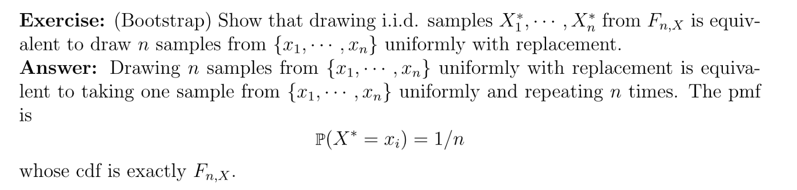

# 1 BootStrap Procedure
## 1.1 Simulation
:::info
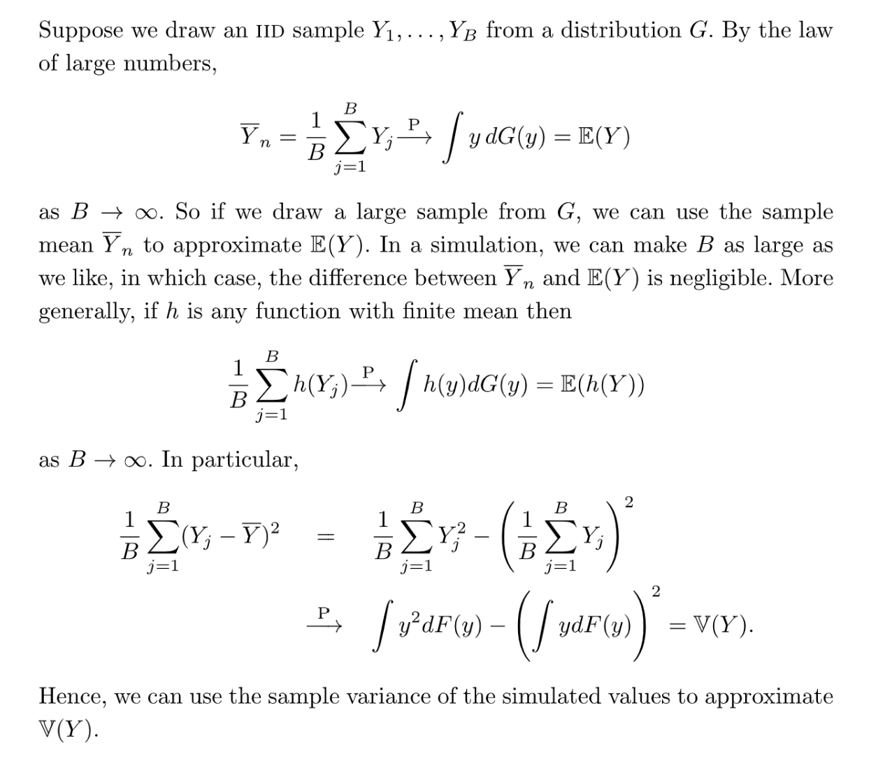
:::

## 1.2 Bootstrap详细步骤
> **我们假设观测到了的数据样本，且我们不知道这些数据的底层分布是什么。**
> **Step 1: Construct Empirical CDF**
> 我们使用来估计, 为每个数据点分配了一个大小为的概率值，我们可以称之为样本的经验分布函数。
> **Step 2: Resample**
> 从这个经验分布函数中有放回地抽取(可以重复)大小为的样本组。
> **Step 3: Caculate Statistics of Interest**
> 利用`Step 2`中的样本组计算统计量(`Statistic of Interest`, 比如`Mean`或者`Variance`) , 得到。
> **Step 4: Repeat Resample Process**
> 重复`Step 2`和`Step 3`次得到组`Resample`, 同时越大越好。一般而言，。最终我们得到。
> **Step 5: Construct Relative Frequency Histogram**
> 根据创建一个频率直方图，形成的分布就是一个对分布的一个较好的近似。

## 1.3 Algorithm
> 1. Input are given data.
> 2. Choose as batch的数量, 一般大于1000
> 3. Sample uniformly from (等价于从sample uniformly with replacement), 得到组
> 4. 计算
> 5. 找到的和quantile, 其中
> 6. ，最终, 其中的目的是在中找到一个使得

# 2 Bootstrap Estimation
## 2.1 思想
> 1. Real World, we have , , and 
> 2. Bootstrap World, we have , ,每个`Batch`一般来说是一个大小为的样本集。
> 3. **Replace by , by , where and are known.**
> 4. **Draw from , Resample from **
> 
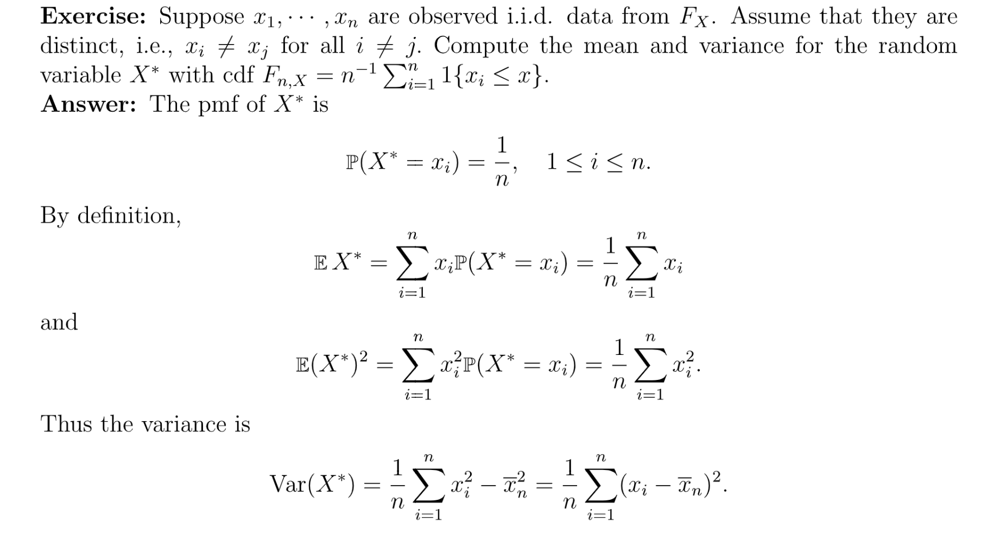

## 2.2 Bootstrap Variance Estimation
:::info
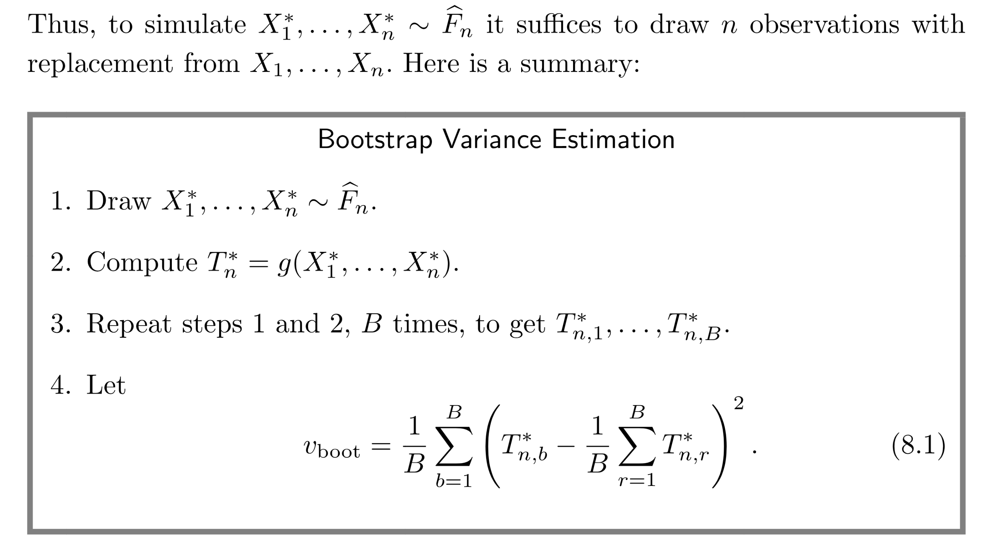
:::

## 2.3 Bootstrap Median Estimation
> 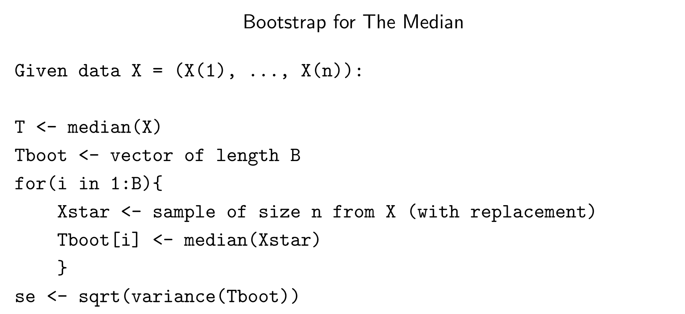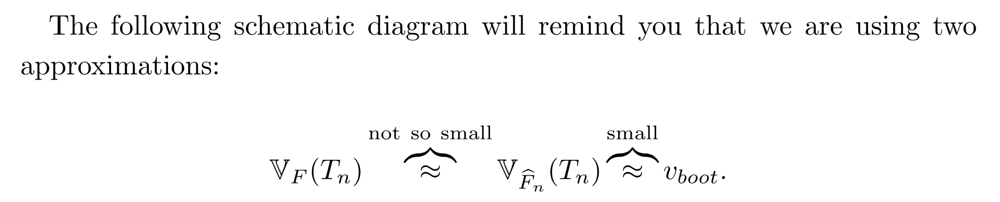

## 2.4 Bootstrap Skewness Estimation
> 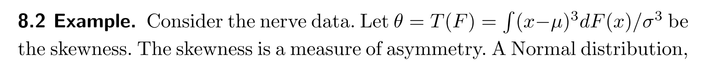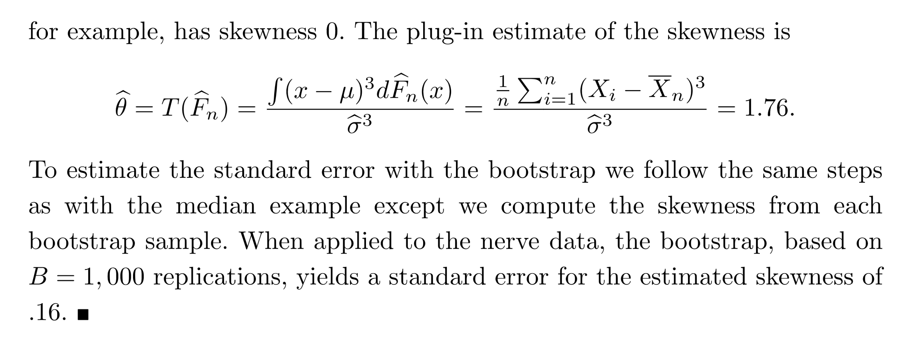

# 3 Bootstrap Confidence Interval
[Bootstrap NTU.pdf](https://www.yuque.com/attachments/yuque/0/2022/pdf/12393765/1666942018955-6051a6d9-a5be-410c-8ac1-34afdd240ea3.pdf)
## 3.0 导言
> 本单元开始时中我们已经介绍了三种构建的方法，包括`CLT`法和`Hoeffding's Inequality`。本小节我们在`Bootstrap`的框架下再介绍几种方法。
> **Motivation:** Can you obtain a confidence interval for $\theta$? We can use CLT for mean, since it's easy. But what about CI for variance, quantile, covariance, etc. 

## 3.1 思想
> 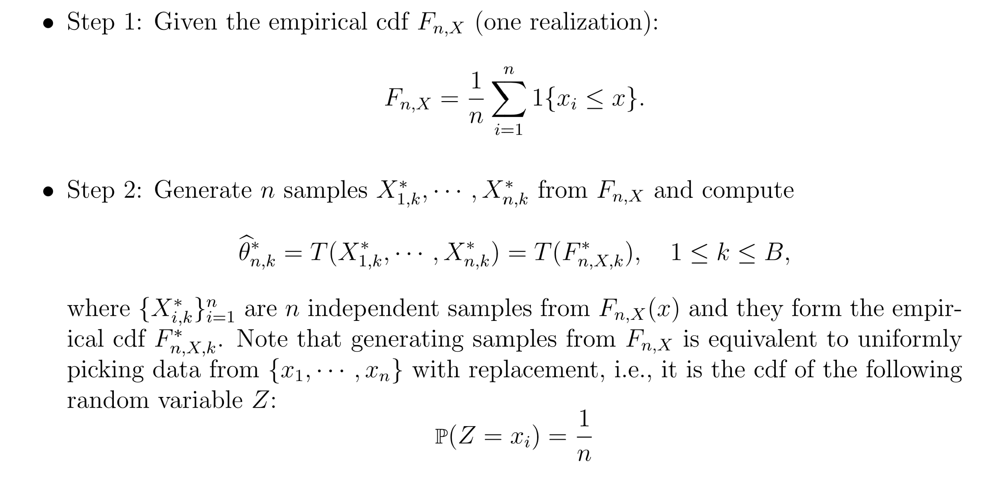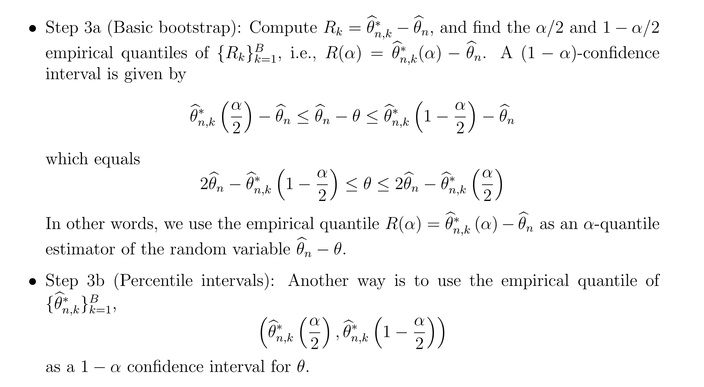

## 3.2 三种BootStrap构建方法
> 下面三种方法都是`Confidence Interval`的`Consistent Estimators`。 

### The Normal Interval
> 假设我们的统计量是, 用于估计总体均值, 则我们的`Confidence Interval`形如:
> , 其中是对于的`Bootstrap`估计。但是我们假设是服从正太分布的。

 
### Pivotal Intervals
> 假设我们要估计一个参数$\theta=T(F)$, 估计量是, 我们可以定义一个`Pivot`: 。让来表示我们通过次`Bootstrap`抽样获得的的复制。
> **我们令表示的**`**CDF**`**: **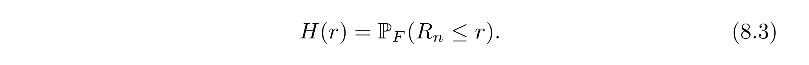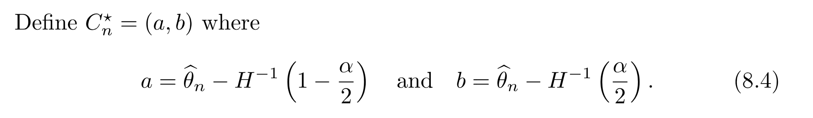
> **所以我们有:**
> 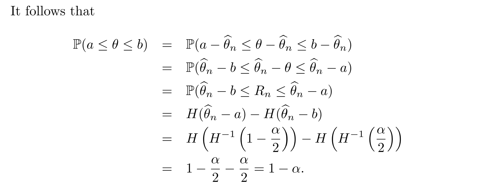
> 所以就是的`Confidence Interval`。不幸的是，和都取决于未知的分布函数和，我们考虑使用`Bootstrap`估计:
> 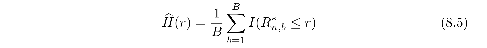
> 其中。让表示的sample quantile，让表示。注意。则的`Confidence Interval`是:
> 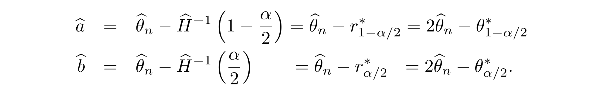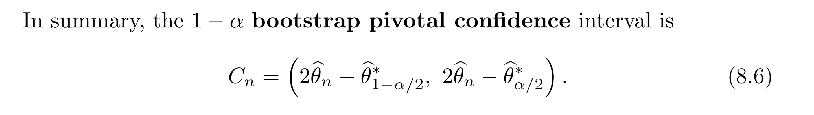
> 这里有几个注意点:
> 1. `Empirical Quantile`, 就是, 这个`Empirical Quantile`在足够大的时候是可以称为一个对`Quantile`准确估计。

> 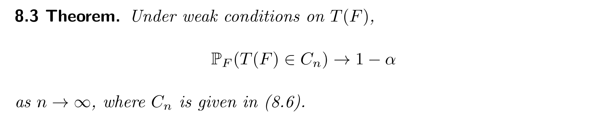

### Percentile Interval
> 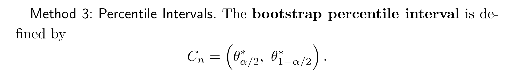

**Justification**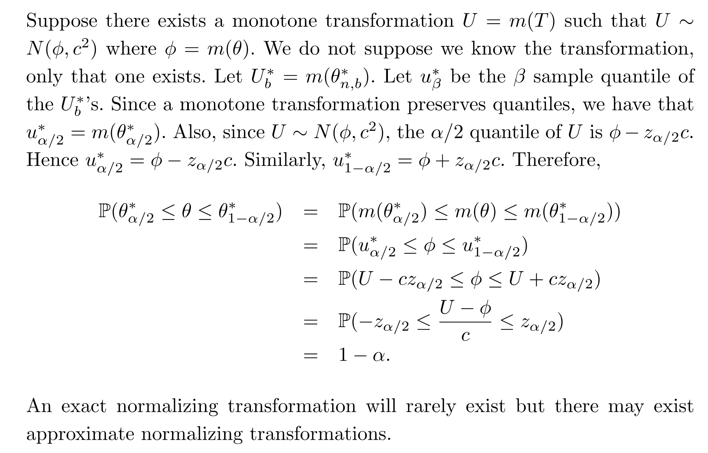

## 3.3 Bootstrap应用
### 3.3.1 One-dimensonal Data(Mean)
> 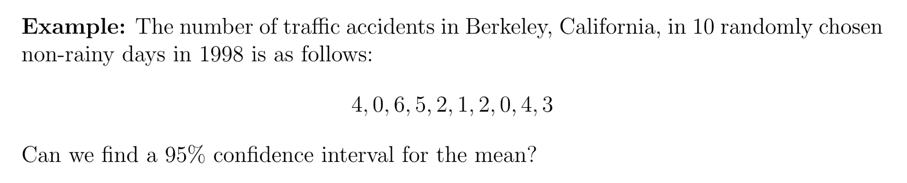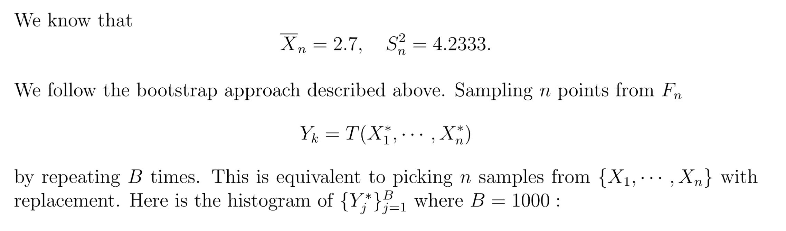

### 3.3.2 One-dimensional Difference Data(Median Difference)
> 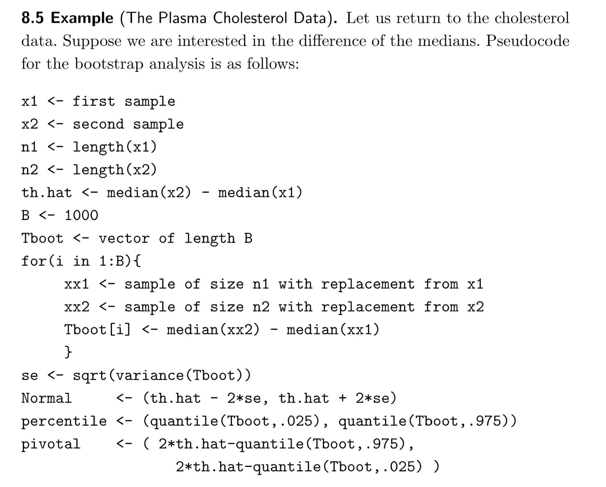

### 3.3.3 One-dimensional Data(Mean Difference)
> 

### 3.3.4 Two-dimensional Data (Correlation)
> 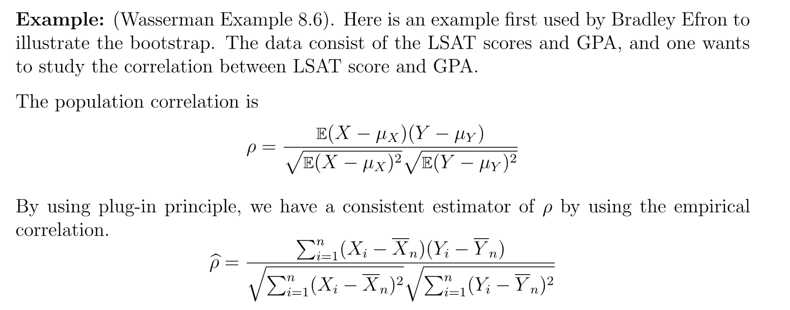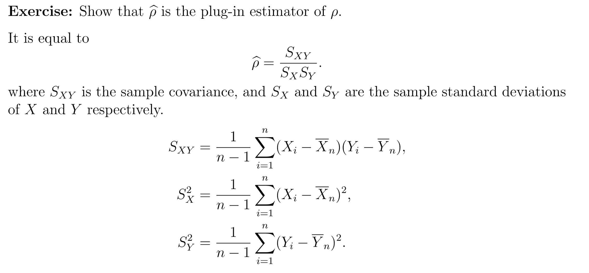

**Scatter Plot**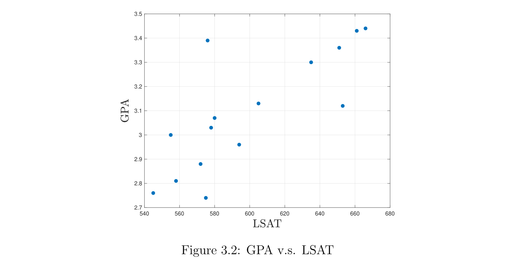
> 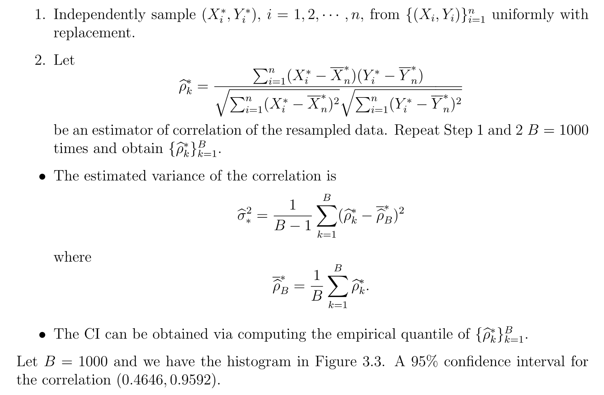

# 4 Proof/Remarks for Bootstrap*
[Bootstrap CMU.pdf](https://www.yuque.com/attachments/yuque/0/2022/pdf/12393765/1666942018877-6400ca7a-ffc7-4d98-84fe-812369267d98.pdf)

