> 本章节我们首先将介绍一个无参估计问题，也就是不会对总体的分布做任何假设的估计方法。目标是估计`CDF`函数$F$。然后，我们将估计`Statistical Functionals`(也就是`CDF`的函数，比如均值，方差和协方差)。无参估计`Functionals`也被称为`Plug-in Method`。


# 1 Empirical Cumulative Distribution Function
[EDF.pdf](https://www.yuque.com/attachments/yuque/0/2022/pdf/12393765/1664113288113-0aecfce3-e483-4dba-9ba3-c3b6212ccd0e.pdf)
## 1.1 ECDF Defintion
> 为了估计$F_X(x)$, 假设我们有$n$个数据点，我们只需要统计所有小于$x$的数据点的频率即可，也就是, 正如下面的定义:
> 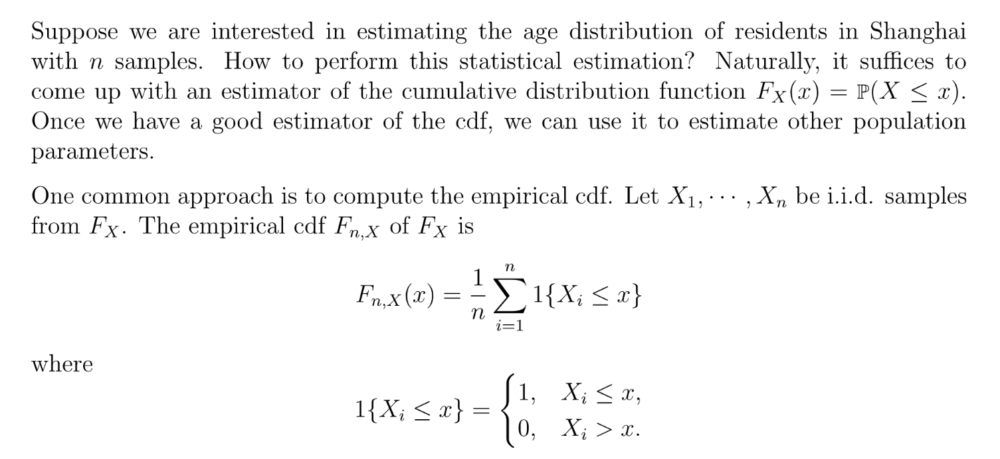
> $F_{n,X}$也经常作为$F_X(x)$的估计量。一般写作
> **下面是一些常用记号:**
> - , (注意和的区别)
> - 关于的理解，我们可以将看成是一系列伯努利随机变量的和，也可以将看成是一个`CDF`, 这个`CDF``puts mass`$\frac{1}{n}$`at each point`。
> - 关于$\hat{F_n}(x)$的理解，我们可以将$\hat{F_n}(x)$看成是一系列伯努利随机变量的和，也可以将$\hat{F_n}(x)$看成是一个`CDF`, 这个`CDF``puts mass`$\frac{1}{n}$`at each point`。

**Nerve Data**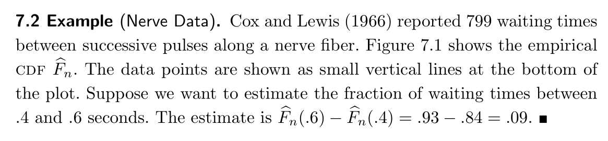


## 1.2 Python实现ECDF
:::info
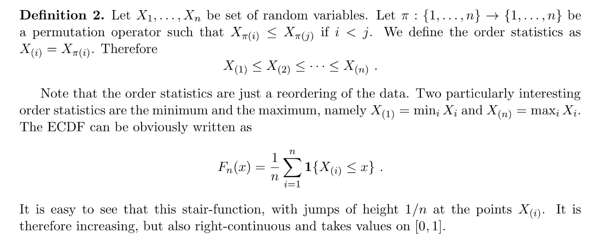
假定我们的数据是$2.1,1.3, 3.4,2.5,1.7$, 则我们一般会经过下列步骤:

1. 对数据进行从小到大排列, 得到$1.3,1.7,2.1,2.5,3.4$, 所以$\hat{F_n}(3)=\frac{4}{5}=0.8$
2. 分类讨论$x$的值得到`ECDF`:

$\hat{F_n}(x)=\begin{cases} 0&x<1.3\\0.2&1.3\leq x<1.7\\ 0.4& 1.7\leq x <2.1 \\ 0.6&2.1\leq x< 2.5\\ 0.8&2.5\leq x<3.4\\1&x\geq 3.4\end{cases}$， 这是一个`Step Function`, 使用Python代码可视化如下
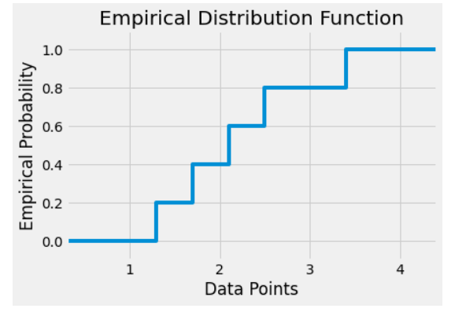
可以发现$\hat{F_n}(x)$确实是将$\frac{1}{n}$的概率分配到了每一个数据点$X_i$上。
:::
```r
# 封装
def ecdf(data):
    x=np.array([-10000,*np.sort(data),10000])
    y=np.array([0,*np.arange(1,len(data)+1)/len(data),1])
    plt.xlim(np.min(x[1:]-1),np.max(x[:-1]+1))
    plt.ylim(-0.1,1.1)
    plt.ylabel("Empirical Probability")
    plt.xlabel("Data Points")
    plt.title("Empirical Distribution Function")
    plt.step(x,y,marker=".", where="post")
ecdf(np.array([1.3,1.7,2.1,2.5,3.4]))
```

## 1.3 Graphical Interpretations
### 1.3.1 n=5
:::info
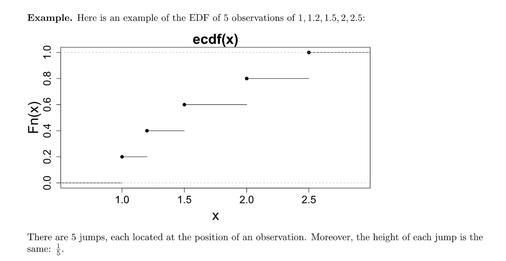
:::

### 1.3.2 n=100/1000
:::info
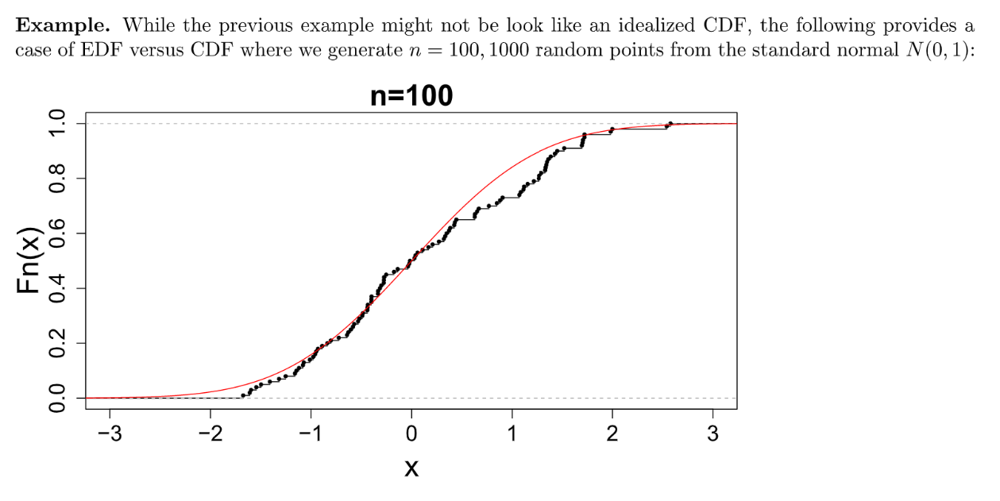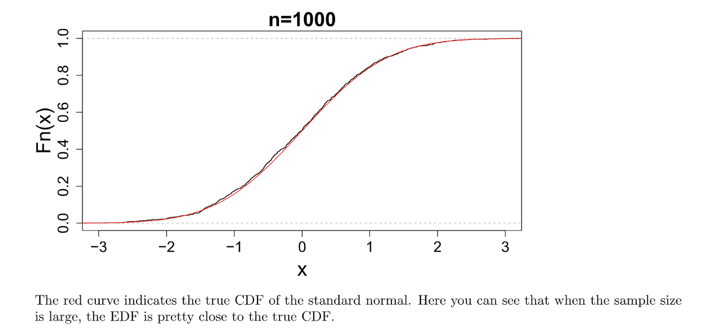
:::

### 1.3.3 Why EDF works?
:::info
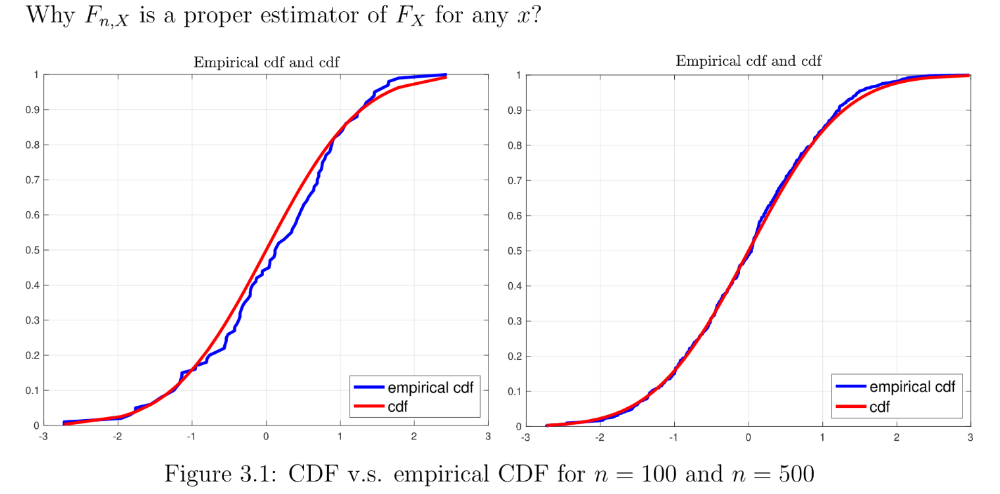
:::


## 1.4 ECDF的性质
### 1.4.1 均值方差
> 
> 
> **均值方差的由来(伯努利分布):**
> 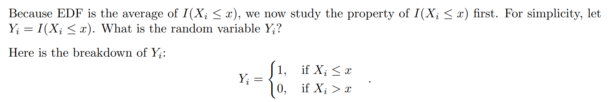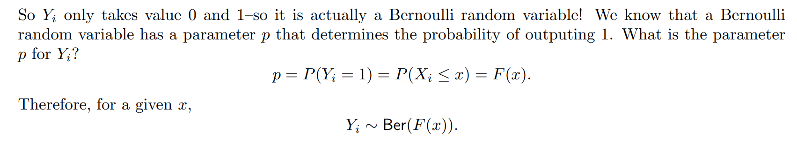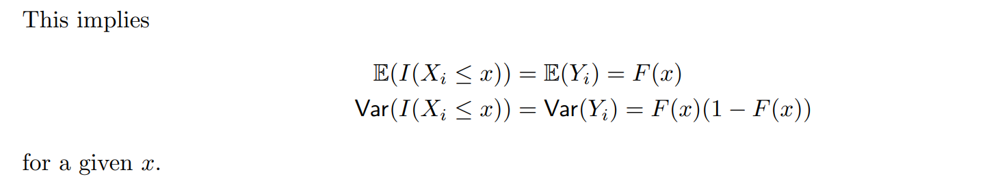
> Then:
> 
> 

**算例**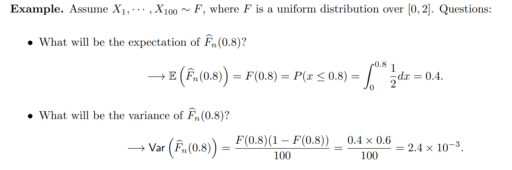

### 1.4.2 MSE/偏差/Consistency
> 由`1.4.1`中可知，是一个无偏估计量。
> 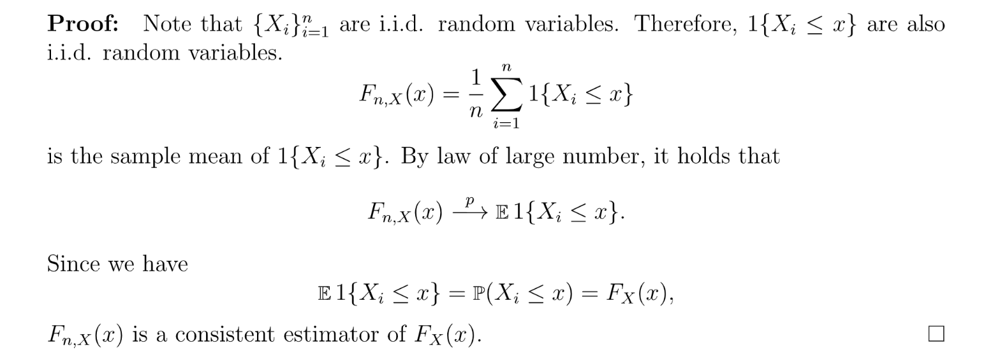


### 1.4.3 依概率收敛于标准高斯分布
:::info

:::
**Proof**By intuition, $\sqrt{n}(\hat{F_n}(x)-F_X(x))\rightsquigarrow N(0,F_X(x)(1-F_X(x)))$. Then we will use central limit theorem to show it.
We know that $\hat{F_n}(x)$ is the sum of $n$ independent Bernoulli R.V. with parameter $F_X(x)$ and also we have $\begin{cases} E[\hat{F_n}(x)]=E[1\{X_i\leq x\}]=F_X(x)\\Var(\hat{F_n}(x))=\frac{Var(Y_i)}{n^2}=\frac{F_X(x)(1-F_X(x))}{n} \end{cases}$. 
Thus by central limit theorem, we have $\frac{\sqrt{n}(\hat{F_n}(x)-F_X(x))}{\sqrt{F_X(x)(1-F_X(x))}}\rightsquigarrow N(0,1),n\to \infty$, which simply implies $\sqrt{n}(\hat{F_n}(x)-F_X(x))\rightsquigarrow N(0,F_X(x)(1-F_X(x)))$(By the property of variance), which ends our proof.


### 1.4.4 协方差
>  Let  and  be two distinct points. Find the covariance and correlation of  and .
> By definition, we have:
> 
> By definition of covariance, we have:
> 
> We know that when :
> 
> and that when :
> 
> By definition of correlation, we have:
> 


### 1.4.5 总结
> **定义：**
> 
> **性质:**
> - **无偏：**
> 
, 无偏。
> - **MSE收敛:**
> 
, 	
> - **依概率收敛：**
> 
> - **收敛于高斯分布(CLT):**
> 
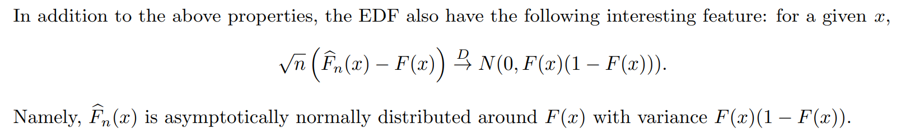
> **分布:**
> 
> **样本实现, 部署计算:**
> 


## 1.5 Multivariate ECDF
### 1.5.1 Definition
:::info

, 
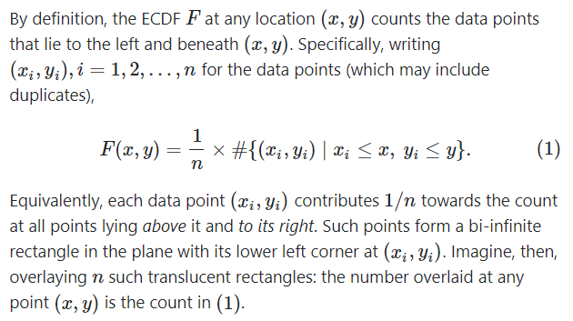[https://stats.stackexchange.com/questions/263877/how-to-compute-bivariate-empirical-distribution](https://stats.stackexchange.com/questions/263877/how-to-compute-bivariate-empirical-distribution)
:::

### 1.5.2 Unbiased/Consistent
> **证明**`**Unbiasedness**`**:**
> 我们令, 
> 
> , 于是是无偏的。
> **证明**`**Consistent**`**:**
> 我们知道是由一系列独立同分布地服从的变量的和的平均值构成的，于是根据大数定律, 我们知道, 于是实际上是一个`Consistent Estimator`。


### 1.5.3 MSE Convergence/Mean/Variance
> **类比Univariate ECDF中的推导，我们知道:**
> - , 对应其无偏性
> - , 可用于证明其`MSE Convergence`
> - 
> 
**其实我们可以利用的方差表达式证明其是**`**MSE Converge**`**的，证明如下:**


### 1.5.4 Marginal ECDF
> 我们知道对于一个`CDF`来说，, 那么对于`ECDF`是否也会有这个性质呢?
> 我们知道, 且
> 当时，
> 于是, 证毕。


## 1.6 Inverse ECDF


## 1.7 ECDF的置信区间
> 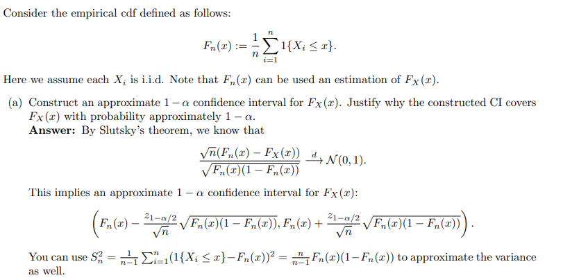


## 1.8 Glivenko-Cantellu定理
> 根据大数定理可知，当试验次数增大时，事件的频率稳定于概率。那么，当试验次数增大时，表示事件 出现概率的总体分布函数呢？这个问题可由格利文科定理来回答。(Uniform LLN)
> 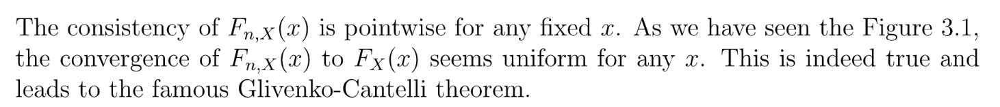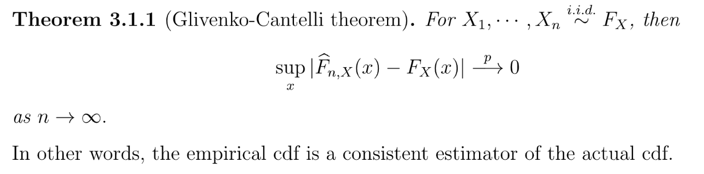
> 这个定理和`Statistical Learning Theory`有关，`Excess Risk(Bias and Variance)`, 会用到这个定理。
> **用于控制机器学习模型的**`**Generalization Error**`**。**


## 1.9 DKW Inequality*
> 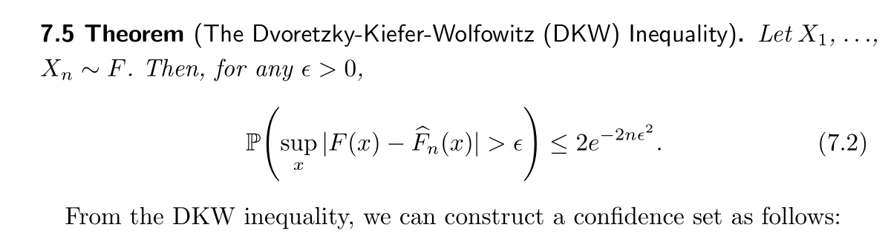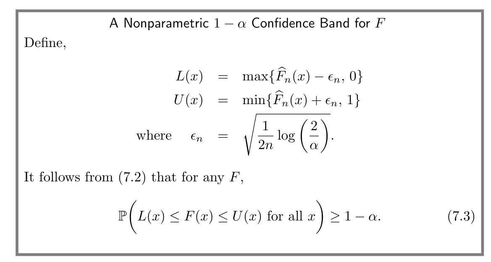

**算例**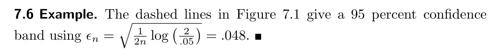

# 2 Plug-in Estimators and Statistical Functionals
> 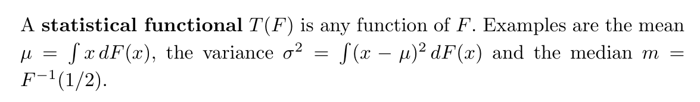
> 很多时候，我们可能不仅仅想估算$F$的表达式，而是一些$F$的函数，比如均值，方差，或者中位数。换句话说，如果要估计参数$\theta=T(F)$, 我们只需要计算$T(\hat{F_n})$即可，$\hat{\theta_n}=T(\hat{F_n})$也被称为`Plug-in Estimate`。
> `Plug-in Principle`是一种非常拥有的，用于构建`Consistent Estimator`的原则。 


## 2.1 Plug-in Principle
[ECDF-Histogram.pdf](https://www.yuque.com/attachments/yuque/0/2022/pdf/12393765/1664155312832-95d3b54b-b912-4246-9175-d0ff4eddc0c5.pdf)
:::info
前文我们已经介绍并证明了`ECDF`对于$F_X(x)$来说是一个`Consistent Estimator`, 由这个性质，我们有如下应用。
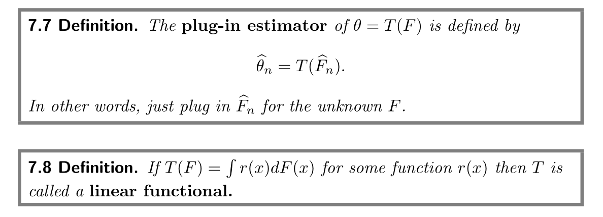
其中$dF(x)=f(x)dx$（其实就是连续型变量的`Probability Mass`）， 常见的$r(x)$包括:

- `Population mean`: $r(x)=x$
- `Higher Moment`: $r(x)=x^p$

而$T(F)$之所以被称为是`Linear Functional`如下：
**在**$f(x),g(x)$**是连续的概率密度函数的情况下：**
$\begin{aligned} T(aF+bG)&=\int r(x)d(aF(x)+bG(x))\\&=\int r(x)[af(x)+bg(x)]dx\\&=\int ar(x)f(x)dx+br(x)g(x)dx\\&=a\int  r(x)dF(x)+b\int r(x)dG(x)\\&=aT(F)+bT(G) \end{aligned}$
**在**$f(x),g(x)$**是离散的概率质量函数的情况下:**
$\begin{aligned} T(aF+bG)&=\sum_i r(x_i)[af(x_i)+bg(x_i)]\\&=\sum_iar(x_i)f(x_i)+br(x_i)g(x_i)\\&=a\sum_ir(x_i)f(x_i)+b\sum_Ir(x_i)g(x_i)\\&=aT(F)+bT(G)\end{aligned}$
这也印证了$T$具有线性性质，是一个线性函数。
:::


## 2.2 Plug-in Estimator's Understanding
> 假设我们要估计总体的某个参数$\theta$: $\theta=\mathbb{E}[r(X)]=\int_{\mathbb{R}}r(x)dF_X(x)$, 且我们手头有$X_1,X_2,\cdots, X_n\sim F$, 我们怎构建我们的`Estimator`$\hat{\theta}$呢? 其实思想很简单，根据`Plug-in Principle`我们只要把参数中的$F_X(x)$全部替换成$\hat{F_n}(x)$即可。
> 具体来说，于是我们会如下选择`Plug-in Estimator`:
> 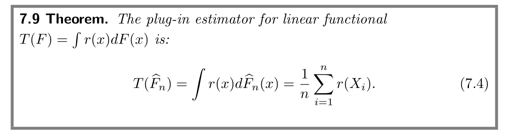
> **怎么理解这个积分**$\hat{\theta_n}=\int_{\mathbb{R}}r(x)d\hat{F_n}(x)$**呢?**
> 首先，从前文我们知道$\hat{F_n}(x)$是一个离散的函数，于是$\int_{\mathbb{R}}r(x)d\hat{F_n}(x)=\sum_{i=1}^{n} r(x_i)d\hat{F_n}(x_i)$
> 其次，$\hat{F_n}(x_i)$是一个`Step Function`, 我们从[Step and Delta](https://www.yuque.com/alexman/dydxis/lgbk8g#jlVTx)中知道，`Step Function`的一阶导数是`Delta Function`, 所以$d\hat{F_n}(X_i)=\hat{\delta_n}(X_i)$, 且$\hat{\delta_n}(X_i)=\frac{1}{n},X_i=x_i$
> 所以$\sum_{i=1}^n r(X_i)d\hat{F_n}(x_i)=\sum_{i=1}^nr(X_i)\hat{\delta_n}(x)=\frac{1}{n}\sum_{i=1}^n r(X_i)$, 证毕。
> **为什么**$\hat{F_n}(x)=\frac{1}{n}\sum_{i=1}^n \mathbf{1}\{X_i\leq x\}$**本身也是一个**`**CDF**`**?**
> 对于$\hat{F_n}(x)=\frac{1}{n}\sum_{i=1}^n \mathbf{1}\{X_i\leq x\}$来说，它本身也是一个`CDF`, 描述了一个离散随机变量的`CDF`, 且每一个数据点的概率都是$\frac{1}{n}$
> 假设$X_i$都是不同的， 那么$F_n(x)$is the CDF of a discrete R.V. $X^{*}$$\mathbb{P}(X*=x_i)=\frac{1}{n}$

**Remarks**以上所有的`Estimator`$\hat{\theta}=T(\hat{F_n}(x))$都是在$T$是`Linear Functional`的条件下才使用的。

## 2.3 Common Plug-in Estimators
### 2.3.1 Estimating Mean
:::info
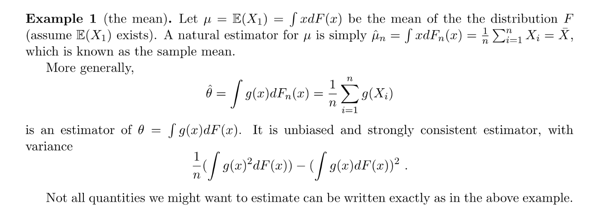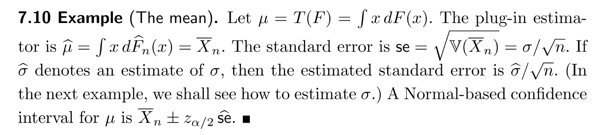
:::
**Proof of unbiasedness and consistency**， 所以是`Unbiased Estimator`
根据切比雪夫不等式：, 所以是`Consistent Estimator`


### 2.3.2 Estimating Variance
:::info
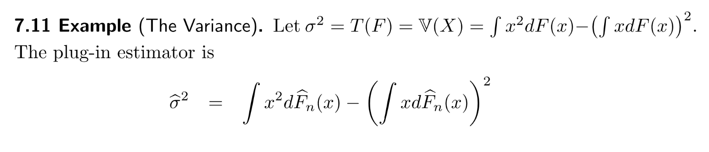
于是我们的`Plug-in Estimator`给出的方差估计量其实不是无偏的(详见[样本方差无偏性](https://www.yuque.com/alexman/kziggo/bxxml7#Pgv5M)), 同时是`Consistent`的，证明在下面给出。
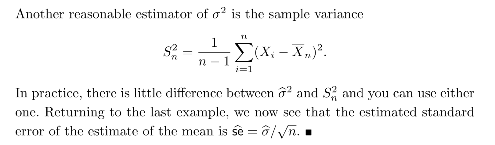
:::
**Proof of asymptotically unbiasedness and consistency****首先它是**`**Biased**`**的:**
因为， 所以
**但是它又是**`**Asymptotically unbiased**`**的:**
因为当, 
**它又一定是**`**Consistent**`**的:**
因为, 所以

### 2.3.3 Estimating quantiles
> 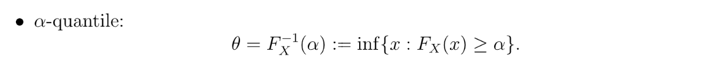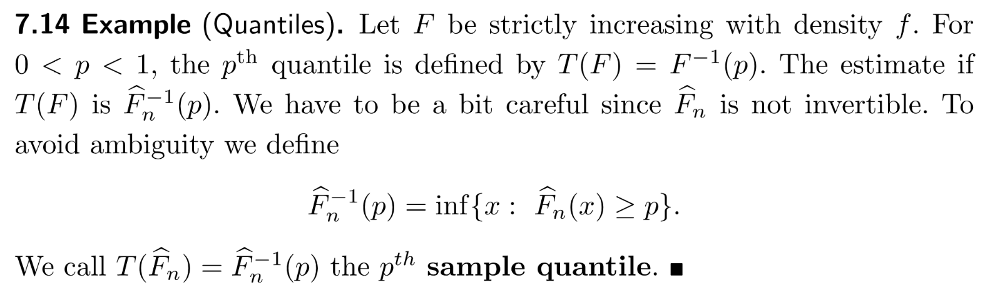
> 如果我们写得更清晰一些：
> 对于总体来说(`population quantile`):
> 对于样本，我们不知道， 所以只能使用`Plug-in Estimator`来估计: 
> $\hat{q_{\alpha}}\stackrel{P}{\longrightarrow} q_{\alpha}$, 下面我们将给出证明。

**Proof of biasedness but consistency**根据定义


### 2.3.4 Estimating Median
:::info
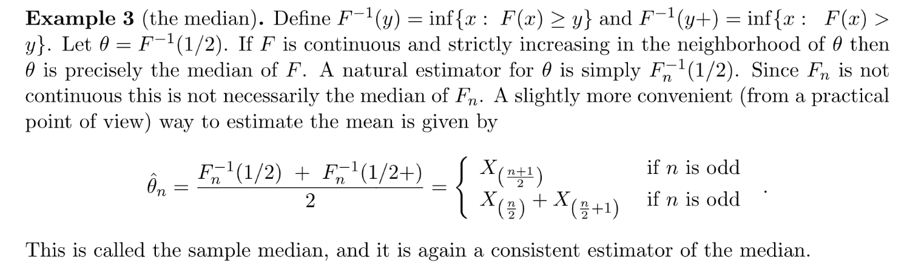
:::
**Proof of consistency**


### 2.3.5 Estimating Skewness
> 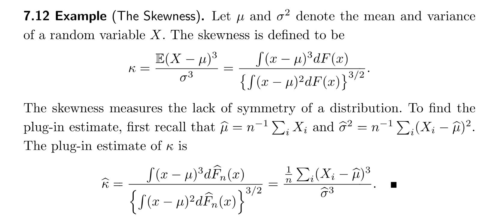

**Proof of Consistency**


### 2.3.6 Estimating Covariance/Correlation
> 现在假设我们收集到了`2D Samples`(`Random Vectors`) , 其中互相独立，换句话说:
> 。
> 
> , 如果$X=Y$, $\sigma_{XY}=Var(X)$。那么我们如何利用二维数据来估算$\sigma_{XY}$呢?
> **我们只需要使用**`**2D ECDF**`**即可，我们给出它的定义:**
> 给定数据样本:$\{(X_i, Y_i)\}_{i=1}^n$, 我们有定义$\hat{F_{n}}(x,y)=\frac{1}{n}\sum_{i=1}^n \mathbf{1}\{X_i\leq x,Y_i\leq y\}$(也是一个均值的概念, 可以想象一个$\frac{\#\space  in\space rectangle}{n}$), 这是一个对于$F_{X,Y}(x,y)=\mathbb{P}(X\leq x, Y\leq y)$的估计量。
> **所以, 我们有:**
> - $\sigma_{XY}=\int_{\mathbb{R^2}}xy\space dF(x,y)-\int_{\mathbb{R}}x\space dF(x,y)\int_{\mathbb{R}}y\space dF(x,y)$
> - $\hat{\sigma_{XY}}=\int_{\mathbb{R^2}}xy\space d\hat{F_n}(x,y)-\int_{\mathbb{R}}x\space d\hat{F_n}(x,y)\int_{\mathbb{R}}y\space d\hat{F_n}(x,y)=(\frac{1}{n}\sum_{i=1}^nX_iY_i)-\bar{X_n}\bar{Y_n}$
> 
和一维的例子类似，我们有$\mathbb{P}(X^*=x_i, Y^*=y_i)=\frac{1}{n}$, given that the random vectors $(X^*,Y^*)$are distinct.
> **Correlation: **$\rho_{XY}=\frac{\sigma_{XY}}{\sigma_X\sigma_Y}$
> **下面我们证明: **
> , 证毕。

**Proof of Biased But Consistency****我们有:**
**证明Biased:**

We know that . So the bias: , which isn't equal to zero. Thus  is biased.
**证明Consistency:**
We know by `WLLN` that , and . By continuous mapping theorem, we can construct a continuous function . Since we have , . Thus . Therefore, we are safe to conclude that  is a consistent estimator for the covariance.


# 3 Histogram in detail*
> 前文我们介绍了使用`ECDF`来估算一个随机变量$X$的`CDF`$F_X(x)$, 且我们证明了这是一个不错的估计。但是这种估计方式有局限性。
> 假设我们有一系列样本点$X_1,\cdots,X_n$，来自一个连续的概率密度函数$f(\cdot)$。如果我们仍然使用`ECDF`来估计`CDF`, 那么因为`ECDF`$\hat{F_n}(x)$是一个离散的函数，所以即便我们使用`ECDF`估算出了`CDF`$F_X(x)$, 我们在试图对其求导$f_X(x)=\frac{d}{dx}F_X(x)=F_X'(x)$时就会遇到一些困难，因为他不连续。
> 为了克服这个困难，我们有一系列的策略。因为$\hat{F_n}\stackrel{P}{\longrightarrow}F, n\to \infty$, 而且我们知道$F$是连续函数，所以其实$F$的导数存在，因此我们可以转而估计$F$的导数。


## 3.1 Definition
> 我们令$\cdots<r_{-1}<r_0<r_1<\cdots$满足$r_i\in \mathbb{R}\cup\{-\infty,\infty\}$且这些点$r_i$形成了对实数轴的划分。我们定义$\mathcal{V}_k=\mathcal{V}(r_k,r_{k+1})$为所有落在区间$(r_k,r_{k+1}]$内的样本点$\mathcal{V}_k=\sum_{i=1}^n \mathbf{1}\{X_i\in (r_k,r_{k+1})\}$
> 回想一下我们之前学过的`Histogram`的标准定义和画法，我们的$x$轴一般表示不同的`bins`，$y$轴是$\frac{频率}{组距}$。因此，我们可以很容易的得到直方图的数学表达式：
> 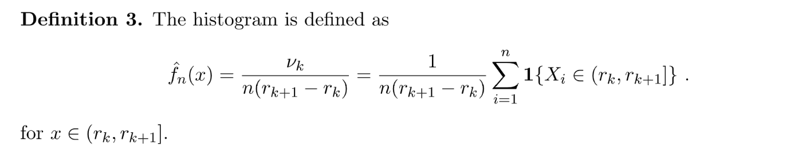
> 我们应该已经很熟悉这个定义了，首先这个函数$\hat{f_n}(x)$是一个`Stair Function`, 在$\{r_k\}$处是不连续的。直方图的每一个柱的宽度是$b_k=r_{k+1}-r_k$, 高度是$\frac{频率}{组距}=\frac{\mathcal{V_k}}{nb_k}$。
> 这个函数是非负的，且函数与$x$轴围成的面积是$1$。因此$\hat{f_n}(x)$是一个合法的概率函数。且我们会倾向于认为直方图在某种程度上是对$f$($X_i$的密度函数)的一个估计。
> 现在我们假设每一个`bin`的宽度都是一样的，即$r_{k+1}-r_k=h,\forall k\in \mathbb{N}$, 在这种假设下我们的直方图函数就可以化简为:
> 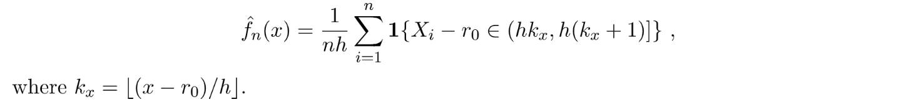
> 其中$\lfloor x\rfloor=sup\{k\in \mathbb{Z}:x>k\}$, 表示小于$x$的最大整数。
> 实际上我们可以将上述函数表达式改写为$\hat{f_n}(x)=\frac{\hat{F_n}(r_{k+1})-\hat{F_n}(r_k)}{h},\forall (r_k,r_{k+1}]$. 这看起来就像是$\hat{F_n}(x)$的导数。

 
## 3.2 MSE Evaluation Metrics
> 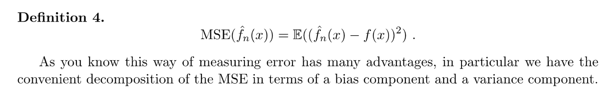

**Lemma 1: 均值方差分解**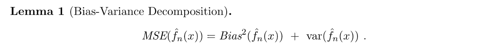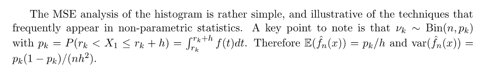


## 3.3 Lipschitz continuous
> 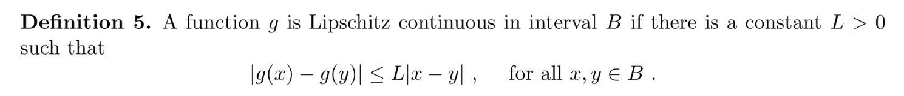

**Lemma 2**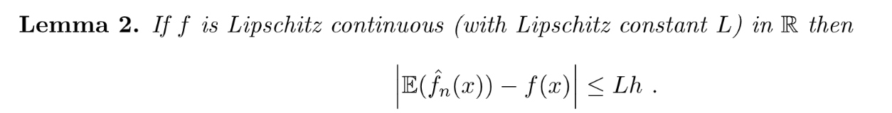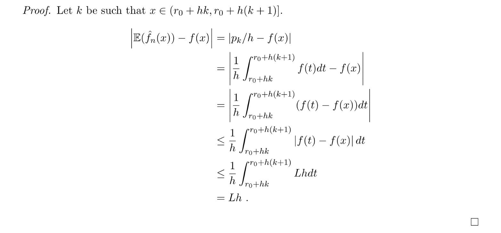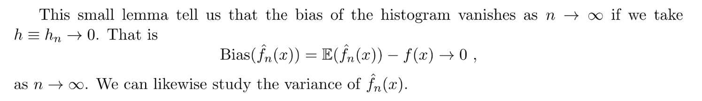
**Lemma 3**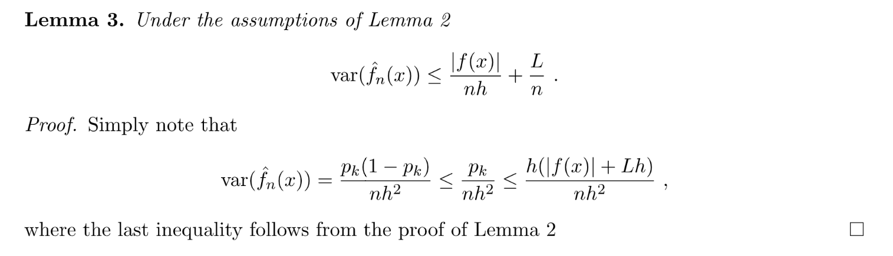


