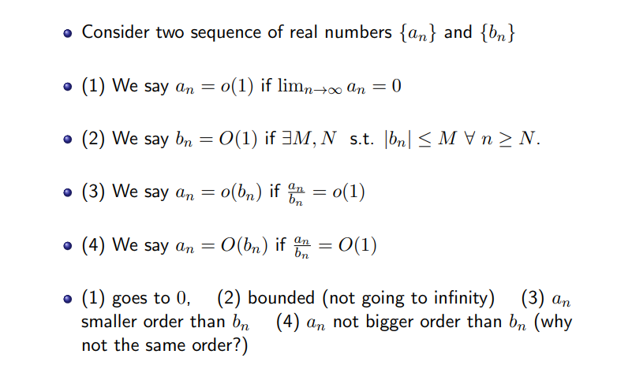
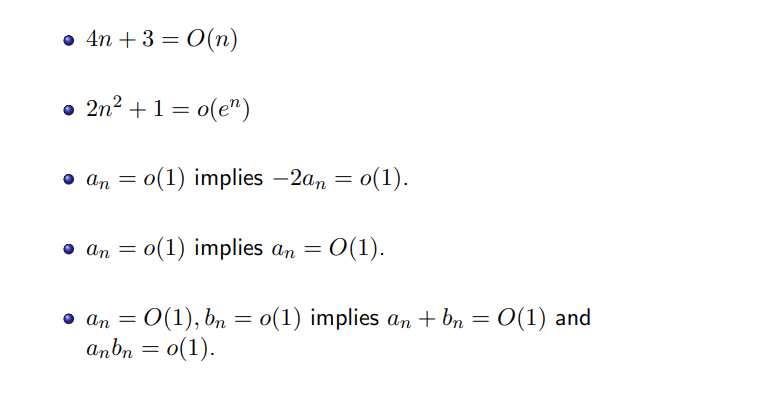

:::info
**Reference: **[https://bookdown.org/ts_robinson1994/10_fundamental_theorems_for_econometrics/big-op-and-little-op.html](https://bookdown.org/ts_robinson1994/10_fundamental_theorems_for_econometrics/big-op-and-little-op.html)
:::

# 0 Big O and Little o
> 

**Examples**

# 1 Basic Notations
## 1.1 Big Op: Stochastic boundedness
:::info
假设我们有随机变量和常数, 则:
表示, 其中都是有限的，是一个极小值。
换句话说:
意味着，对于一个足够大的(样本量)，存在一些使得随机变量的值比大的概率是零。我们称为`Stochastic Boundedness`。
:::

## 1.2 Little op: Convergence in Probability
> 假设我们有随机变量, 则:
> 表示
> 等价于, 表示
> 换句话说:
> 当且仅当
> 特别的, 当我们有两个数列和时，如果, 则 , 表示是的高阶无穷小量。

## 1.3 Big Op 和Little op
> 我们比较一下两个记号的数学意义，我们有如下标准定义:
> - 对于, 我们有, 说明对于任意的, 我们都能找到使得不等式成立。
> - 对于, 我们有，说明对于任意的, 我们总能找到使得不等式成立。
> 
所以综上，我们发现是一个更加一般化的结论，也就是说, 逆命题不成立。

# 2 代数性质
## 2.1 基本性质
:::info
我们在书写的时候， 虽然式子中有等号，但其实这个等号并没有任何全等关系。和仅仅是一种我们描述随机变量收敛方式的记号。下面我们给出以下常用代数性质和证明:

1. 

**证明: **假设, 则, 根据`CMT`, 我们可以找到一个连续函数, 所以, 于是, 证毕。

2. : **一个依概率有界的随机变量**+**一个收敛于零的随机变量**也是依概率有界的。
3. : **一个依概率有界的随机变量**x**一个收敛于零的随机变量**也是依概率有界的。
4. 

**证明: **假设, 则, 所以。这里出现了收敛速率, 我们对其进行一些解读。
:::
> 假设我们有两个速率, 和一个随机变量, 也就是。则根据上述的第四条规则:
> 如果, 则
> 如果, 则
> 对于当时, 。换句话说，会以更快的速度收敛到零。

## 2.2 一些常见分布的近似分析
### 2.2.1 高斯分布
> **命题1: **假设, 则我们有
> **证明: **
> - 因为, 所以(高斯分布的线性性质)。而如果，则对于任意的, 都存在使得成立。 
> - 所以对于任意，都存在使得成立，也就是
> 
**命题2: **假设, 则我们有
> **证明：**
> 根据高斯分布的线性性质，我们有, 且对于任意的, 都有不等式成立，于是
> **命题3:** 假设, 则
> **证明: **
> 因为是一个随机变量, 所以存在有限常数使得：
> 1. 在处是连续的
> 2. 
> 
因为, 所以对于足够大的, 我们有:
> 1. 
> 2. 
> 
于是对于足够大的来说，我们有

