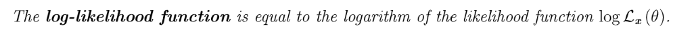
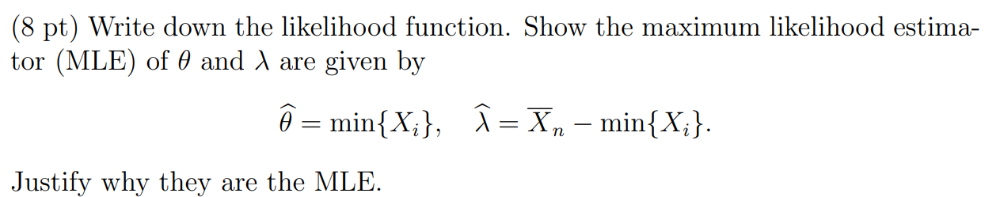
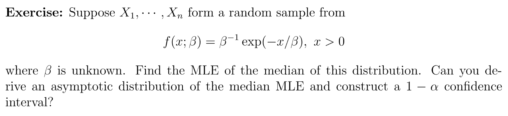

[statistics_2.pdf](https://www.yuque.com/attachments/yuque/0/2023/pdf/12393765/1676172618999-bc13a923-f19b-4410-9eea-016990fcbce4.pdf)
# 1 Basics
## 1.1 Settings
> 
> Find a parameter such that the corresponding distribution is most likely to observed data.

## 1.2 Likelihood Function
> Assume are a pdf or pmf.
> Suppose we have data points , so the likelihood function is a joint distribution function 
> **Remarks: **The likelihood function is a function of , exactly equal to the joint pdf/pmf.
> 

## 1.3 Log Likelihood function
> 
> $log\mathcal{L}(x_1,\cdots, x_n;\theta)=logf(x_1,\cdots, x_n|\theta)=\sum_{i=1}^nlogf(x_i|\theta)$

# 2 Max-likelihood Estimators
## 2.1 Definition
> 
> MLE: The MLE  is given by 
> 

## 2.2 使用MLE估计参数
### Bernoulli
> , ，PDF: 
> 注意，我们的样本点是可以取任何值， 不一定要在中取值，但是是互相独立的。
> 1. 求出`Log-likelihood Function`：
> 
>  
> 
> 2. 求出`Critical Point(s)`:
> 
> 3. 测试`Extremity`:
> 
, which implies that it is **a concave function, which means local max must be global maximum. **
> **在机器学习中, 形如上面的凹函数很像被称为**`**KL-Divergence/Cross Entropy**`**的函数,(**`**KL Divergence**`** 用于度量两个概率分布是否接近，如果结果为零，则说明两个概率分布一致).**
> **假设我们有两个概率函数, , , **
> - If P=Bernoulli(), Q=Bernoulli(), 
> - If , then 

**Neat Version**

### Possion
> 
> 
> **Critical Point：**
> 
> 
> **Extremity(Second derivative test):**
> , which means  is concave.

**Graph**

### Gamma 1
> 1. **求出**`**Log-Likelihood Function**`**:**
> 

> 2. **求出**`**Critical Point**`**:**
> 

> 
> 3. **验证**`**Extremity**`**:**
> 
, 于是就是全局最大值。

### Gamma 2
> 
> We don't have a closed-form MLE solution for 

**Key**我们知道`Gamma`()的PDF是:

所以Gamma()的PDF是:

我们可以写求出参数的`MLE`:

### Gaussian⭐⭐⭐⭐⭐
> 
> 本题的关键在于先使用一些代数不等式对`Log-likelihood function`进行放缩，比如对所有的$\mu$进行一个不等式放缩。这是一个非常重要的思想，因为往往我们通过计算`Hessian Matrix`并不能确定函数一定就是`Concave`的 。

**Solution**

### Uniform/Range Estimator
> , , 求出.
> 1. 求出`Likelihood Function`
> 
, 因为样本点完全有可能不在的范围内，所以这里我们用表示样本是否在中。
> 2. 求出`Global Maximizer`
> 
当 , then for , then , 其他情况都是。因为至少有一个(如果样本足够大的话)。
> - 被称为**Range Estimator.**

**Proof of Consistency**

**Proof of Asymptotic Unbiasedness**我们首先求出的分布, 有
于是, 于是, 所以是`Biased`的.
但是时，, 于是是`Asymptotically Unbiased`的。
 

### Uniform between a and b
> 假设数据服从
> 1. 求出`Log-Likelihood Function`:
> 
 
> 
> 2. 求`Critical Points`:
> 
  
> 我们发现找不到`critical points`。
> 3. 求全局最值
> 
= as large as a can be
> = as small as b can be 
> based on 。因为, 于是当, 时，取到最小值使得`Log-Likelihood Function`取到最大值。

### Complicated Distribution 1
> 
> 
> 在似然函数不是连续的情况下:

**Key**

### Complicated Distribution 2
> 仍然是一个没有临界点的情况:
> 
> 1. 求出对数似然函数:
> 
$log\mathcal{L}(\theta)=nlog(\theta)-2*\sum_{i=1}^nlog(X_i)$
> 2. 求出临界点:
> 

> 3. 求出$\hat{\theta}_{MLE}$：
> 

### Complicated Distribution 3⭐⭐⭐⭐⭐
> 

**Solution**
注意到$1\{min\{X_i\}\geq \theta\}=\begin{cases} 1&\theta\geq min{(X_i)}\\0&\theta<min(X_i)\end{cases}$, 于是如果要保证$L(\theta, \lambda)$尽可能大，于是首先$1\{min\{X_i\}\geq \theta\}$必须得取$1$才行，言下之意就是$\hat{\theta}\leq min\{X_i\}$, 同时因为$L(\theta,\lambda)$是一个关于$\theta$的增函数，于是我们取$\hat{\theta} = min\{X_i\}$就可以保证, $\forall \lambda~~, L(\theta, \lambda)\leq L(\hat{\theta},\lambda)$。

## 2.3 Range Estimator
> **Definition:**
> Range Estimator: $\hat{\theta_n}=max(X_i)$
> - Is it consistent/biased? **Consistent, biased but asymptotically unbiased.**
> - Is it asymptotically normal?** Not asymptotically normal.**
> - Construct Confidence Interval? Using Bootstrap? **No**
> - Always smaller than $\theta$

## 2.4 关于MLE的常见问题
> **Does MLE always exists? No**
> **Does it always have a closed form solution? No**
> - **If **$X_i\sim Unif[0,\theta)$**(注意左闭右开), **$\mathcal{L}(\theta)=\frac{1}{\theta^n}\mathbf{1}\{max X_i<\theta\}$
> - Gamma distribution doesn't have closed form MLE for $\alpha$, but we have for $\beta$. And closed form MoM exists. 
> 
**If we don't have a closed form solution?**
> Use Numerical Method(Newton, SGD, GD)

# 3 Fisher Information
[Fisher Information Duke.pdf](https://www.yuque.com/attachments/yuque/0/2022/pdf/12393765/1666108313620-51b7b655-9bfd-42a5-9c3f-898321bd3054.pdf)
[Fisher Information Intro.pdf](https://www.yuque.com/attachments/yuque/0/2022/pdf/12393765/1666108313647-c75ad9ec-d447-4c88-a83b-06d7ea63ceb3.pdf)
## 3.0 Intuition
> `Fisher information`提供了一种测量**随机变量含有多少关于假设的总体参数**$\theta$(比如均值)**的信息**。

## 3.1 Score Function
### 3.1.1 Definition
> 

### 3.1.2 Zero Expectation Property
#### Univariate Case
> **下面介绍**`**Score Function**`**的重要性质:**$E[s(X;\theta)]=0$**, 其中**$X$**是服从参数为**$\theta$**的分布函数：**
> 首先根据概率公理，$\int f(x;\theta)dx=1$（如果$X$是离散的随机变量，则替换成$\sum$即可）, 于是我们两边对$\theta$求偏导, 得到：
> $\begin{aligned} 0&=\frac{\partial}{\partial \theta}\int f(x;\theta)dx=\int\frac{\partial}{\partial \theta}f(x;\theta)dx\\&=\int\frac{\frac{\partial }{\partial \theta}f(x;\theta)}{f(x;\theta)}f(x;\theta)dx=\int \frac{\partial logf(x;\theta)}{\partial \theta}f(x;\theta)dx\\&=\int s(x;\theta)f(x;\theta)dx=E_{\theta}[s(X;\theta)]\end{aligned}$
> 这里我们使用了一些技巧，就是将$f'(x;\theta)$写成$\frac{f'(x;\theta)}{f(x;\theta)}f(x;\theta)$, 这样做的目的就是使得$\frac{f'(x;\theta)}{f(x;\theta)}=\frac{\partial }{\partial \theta}log f(x;\theta)$，继而能够表示成`Score Function`的一阶导的形态，方便后续运算。

#### Multivariate Cases
> 上面的定义仅仅在数据是一维的情况, 假设现在我们有一系列样本数据$\mathbf{x}=\{x_1,\cdots, x_n\}$($X_1,\cdots, X_n$是独立同分布的随机变量)，则联合概率分布为:
> $f_{n}(\mathbf{x};\theta)=\prod_{i=1}^nf(x_i;\theta)$
> 此时我们的`Score Function`为:
> $s_n(\mathbf{x};\theta)=\frac{\partial}{\partial \theta}logf_n(\mathbf{x};\theta)=\frac{\partial}{\partial \theta}log\prod_{i=1}^n f(x_i;\theta)=\sum_{i=1}^n \frac{\partial}{\partial \theta}logf(x_i;\theta)=\sum_{i=1}^ns(x_i;\theta)$
> 此时期望为零的性质仍然成立:
> $E_{\theta}[s_n(\mathbf{x};\theta)]=E_{\theta}[\sum_{i=1}^ns(x_i;\theta)]=\sum_{i=1}^nE_{\theta}[s(x_i;\theta)]=\sum_{i=1}^n 0=0$

## 3.2 Point Fisher Information
### 3.2.1 表示方差
> 假设$X$是我们观测到的一个数据点，我们定义`Fisher Information`为:
> $I_1(\theta)=E_{\theta}[(\frac{\partial }{\partial\theta}logf(x;\theta))^2]$
> 这表示`Fisher Information`描述了`Score Function`的二阶矩（`Log-likelihood Function`的一阶导数的二阶矩）。另外，根据前文我们得到的`Score Function`的性质$E[s(X;\theta)]=0$，我们有: 
> $I_1(\theta)=E_{\theta}[(\frac{\partial }{\partial\theta}logf(x;\theta))^2]-(E_{\theta}[\frac{\partial }{\partial\theta}logf(x;\theta)])^2=\mathbf{Var}(\frac{\partial }{\partial\theta}logf(X;\theta))$
> 因此`Fisher Information`实际上描述的是`Score Function`的方差。

### 3.2.2 表示二阶导的期望
> 从前文中我们已经知道，如下的等式成立:
> $\begin{aligned} 0=\int s(x;\theta)f(x;\theta)dx=E_{\theta}[s(X;\theta)]\end{aligned}$
> 此时等式两边对$\theta$求偏导，得到:
> $\begin{aligned} 0&=\frac{\partial }{\partial \theta}\int s(x;\theta)f(x;\theta)dx\\&=\int \frac{\partial }{\partial \theta}\{s(x;\theta)f(x;\theta)\}dx\\&=\int s'(x;\theta)f(x;\theta)dx+\int s(x;\theta)f'(x;\theta)dx\\&=E_{\theta}[s'(x;\theta)]+\int s(x;\theta)\frac{f'(x;\theta)}{f(x;\theta)}f(x;\theta)dx\\&=E_{\theta}[s'(x;\theta)]+\int s(x;\theta)\frac{\partial}{\partial \theta}logf(x;\theta)f(x;\theta)dx \\&=E_{\theta}[s'(x;\theta)]+\int s(x;\theta)^2f(x;\theta)dx\\&=  E_{\theta}[s'(x;\theta)]+E_{\theta}[(s(x;\theta))^2]\\&=E_{\theta}[s'(x;\theta)]+I(\theta)\end{aligned}$
> **于是我们可以得到:**
> $I(\theta)=-E_{\theta}[s'(x;\theta)]=-E_{\theta}[\frac{\partial^2 }{\partial \theta^2}logf(x;\theta)]$, 也就是`Log-Likelihood Function`的二阶导的负期望。
> 这个意义好像很抽象，但其实超级好懂。(**参考:** [https://www.zhihu.com/question/26561604](https://www.zhihu.com/question/26561604))
> 
> **对于上图中得到的一个**`**log likelihood function**`**(假设参数或自变量为**$p$**)：**
> - 它越平而宽，就代表我们对于参数估计的能力越差(甚至还可能出现有多个maximum的情况，这是我们不想看到的)。
> - 它高而窄，就代表我们对于参数估计的能力越好，也就是信息量越大。
> - 而这个`log likelihood`在参数真实值处的负二阶导数，就反应了这个`log likelihood`在顶点处的弯曲程度，弯曲程度越大，整个`log likelihood`的形状就越偏向于高而窄，也就代表掌握的信息越多。

## 3.3 Sample Fisher Information
> **Definition 4:** **当样本数据**$X_i$**是**`**i.i.d**`**的时候**，Fisher information in the entire sample is:
> $I_n(\theta)=nI_1(\theta)$
> 于是，定义在整个样本上的`Fisher Information`形式如下:
> 
> 当$n=1$时，$I_n(\theta)=I_1(\theta)$, 但我们为了方便起见经常把$I_1(\theta)$写成$I(\theta)$

## 3.4 Computing Fisher Information
### Univariate Normal Distribution
> 假设我们有一个随机变量$X$, 他服从$N(\theta, \sigma^2)$的高斯分布(假设$\sigma$已知)，则我们计算关于$\theta$的`Fisher Information`的步骤如下:
> 如果采用`Log-likelihood`的二阶导的负期望计算:
> $\begin{aligned} I(\theta) &= -E_{\theta}[\frac{\partial^2}{\partial \theta^2}logf(X;\theta)]\\&=-E_{\theta}[\frac{\partial^2}{\partial \theta^2}(-log\sqrt{2\pi}\sigma-\frac{(x-\theta)^2}{2\sigma^2})]\\&=-E_{\theta}[-\frac{1}{\sigma^2}]\\&=\frac{1}{\sigma^2}\end{aligned}$
> 如果采用`Log-likelihood`的一阶导的二阶矩计算:
> $\begin{aligned} I(\theta) &= E_{\theta}[(\frac{\partial}{\partial \theta}logf(X;\theta))^2]\\&=E_{\theta}[(\frac{\partial}{\partial \theta}(-log\sqrt{2\pi}\sigma-\frac{(x-\theta)^2}{2\sigma^2}))^2]\\&=E_{\theta}[(\frac{X-\theta}{\sigma^2})^2]\\&=\frac{1}{\sigma^4}E_{\theta}[X^2-2\theta X+\theta^2]\\&=\frac{1}{\sigma^4}(Var(X)+(E_{\theta}[X])^2)+\frac{\theta^2-2\theta E_{\theta}[X]}{\sigma^4}\\&=\frac{1}{\sigma^4}(\sigma^2+\theta^2)-\frac{\theta^2}{\sigma^4}\\&=\frac{1}{\sigma^2}\end{aligned}$
> 可以发现使用`Fisher Information`的两种定义算出的结果是一致的。
> 此时我们可以计算出`Sample Fisher Information of size n`:
> $I_n(\theta)=nI(\theta)=\frac{n}{\sigma^2}$
> 还记得我们之前得到的对于`Normal Distribution`的均值的`MLE`是$\hat{\mu}=\overline{X}_n$, 其方差(假设$\sigma^2$已知)是$\frac{\sigma^2}{n}$, 我们发现就是$\frac{1}{I_{n}(\theta)}$, 也就是$\mathbf{Var}(\hat{\theta})=\frac{1}{I_{n}(\theta)}$请记住这个规律，后续我们会证明这种相等关系。

### Possion Distribution
> 假设$logf(x;\theta)=\lambda(x|\theta)$:
> 

### Bernoulli Distribution
> 假设$logf(x;\theta)=\lambda(x|\theta)$:
> 
> 也就是$I(\theta)=\frac{1}{\theta(1-\theta)}$, $I_n(\theta)=nI_1(\theta)=\frac{n}{\theta(1-\theta)}$

### Exponential Distribution
> 假设$logf(x;\theta)=\lambda(x|\theta)$:
> 

## 3.5 Cramer-Rao Lower Bound
### 3.5.1 Defintion and Applications
:::info
CR Lower Bound主要解决了这样的问题: 
假设我们有数据样本$X_1,\cdots, X_n \sim N(\mu ,\sigma^2)$, 我们可以很轻松的获得$\mu$的一个无偏估计量$\hat{\mu}=\overline{X}_n$
因为$E[\hat{\mu}]=E[\overline{X}_n]$。当然我们也可以构建另一个可行的无偏估计量为$\hat{\mu_p}=\sum_{i=1}^p p_ix_i, \sum_ip_i=1$, $E[\hat{\mu_p}]=\mu$(读者可自行验证), 那么我们提出这样一个问题，**所有符合条件的无偏估计量中方差最小的无偏估计量是什么?**
:::
> 假设$X_1,\cdots, X_n\sim f(x;\theta)$,是独立同分布的样本点, 假设$\hat{\theta_n}=T(X_1,\cdots, X_n)$是一个无偏估计量，则其满足:
> $\mathbf{Var}(\hat{\theta_n})\geq \frac{1}{I_n(\theta)}=\frac{1}{nI_1(\theta)}$
> 也就是说，对于一个无偏估计量，它的方差不能无限小，是由一个明确的下界的，这个下界由`Fisher Information`给出。
> 这个定理对于任何分布(`Under certain regularity conditions`)都成立。

 
### 3.5.2 General Version
> 
> 对于任何$\hat{\theta}_n$(不一定得是无偏估计量)，我们有`General Version of Cramer-Rao Lower Bound`

**Proof**
 
## 3.6 Remarks*
**Remarks for Fisher Information**
1. When constructing CI for, , since 
2. The Hessian: **equals the negative Hessian of the log likelihood function.**

, 
, which is the population log-		likelihood and equals (Concave)

3. Why ? Namely ?

(By concavity)  , So 

4. In fact, , equals **the second moment of 1st derivative of the log-likelihood function**. Why is it true?

**Why is equal to zero?(这是对求了二阶导) **
Since is a constant function wrt 
So 

# 4 Properties of MLE
## 4.1 Consistency
### 4.2.1 Theorem
:::info

MLE has consistency in general. And we will show this under certain regularity conditions.
**Before showing, three assumptions:**

1. Identifiability:  $f(x;\theta_1)=f(x;\theta_2)\iff \theta_1=\theta_2$ , 分布的参数相同，分布相同，反之亦然。
2. $f(x;\theta)>0,\forall x\in \mathcal{X}$($\mathcal{X}$是样本空间)
3. $E_{\theta_0}[logf(x;\theta)]=\int (log(f(x;\theta)))f(x;\theta_0)dx<\infty$, `log-likelihood function`has a finite mean under the true parameter $\theta_0$。

**Informal proof of consistency **$\hat{\theta_n}\stackrel{P}\to \theta$**, **$x_i$**'s are i.i.d: **
$\hat{\theta_n}=\argmax_{\theta\in \Omega}l(\theta)$, $l(\theta)=\frac{1}{n}\sum_{i=1}^n logf(x_i;\theta)$(`Empirical Loss`)

1. As $n\to \infty$, $l(\theta)\stackrel{P}\to E[l(\theta)]=E_{\theta_0}[logf(x;\theta)], x_i\sim f(x_i;\theta_0)$
2. $g(\theta)=E_{\theta_0}[logf(x;\theta)]$is a function of $\theta$, then what is the global maximizer of the expectation.

**Claim **$\argmax_{\theta\in \Omega}g(\theta)=\theta_0$**, and we want to show that **$g(\theta)-g(\theta_0)\leq 0,\forall \theta$**:**
We will use this inequality: $log(t)\leq t-1$ for $t>0$。
$g(\theta)-g(\theta_0)=E_{\theta_0}[log\frac{f(x;\theta)}{f(x;\theta_0)}]\leq E_{\theta}[\frac{f(x;\theta)}{f(x;\theta_0)}-1]=\int_x(\frac{f(x;\theta)}{f(x;\theta_0)}-1)f(x;\theta_0)d\theta=\int_x(f(x;\theta)-f(x;\theta_0))dx=1-1=0$
This means $g(\theta)\leq g(\theta_0)$
$\theta_0$is the global maximum.

3. We have shown $\argmax_{\theta\in \Omega}E_{\theta_0}[logf(x;\theta)]=\theta_0$, We now have to show $\argmax_{\theta \in \Omega}l(\theta)= \hat{\theta_n}$, so that $\hat{\theta_n}\stackrel{P}\to \theta_0$, 要证明这个收敛关系，我们需要`Uniform Law of large number`。于是我们跳过。

**Basic Idea:**

:::
**Informal Proof**

### 4.2.2 Examples
#### 

## 4.2 Asymptotic Normality
### 4.2.1 Theorem
:::info
**在一些regularity conditions:**

- Identifiability:  $f(x;\theta_1)=f(x;\theta_2)\iff \theta_1=\theta_2$ , 分布的参数相同，分布相同，反之亦然。
- $f(x;\theta)>0,\forall x\in \mathcal{X}$($\mathcal{X}$是样本空间)
- $E_{\theta_0}[logf(x;\theta)]=\int (log(f(x;\theta)))f(x;\theta_0)dx<\infty$, `log-likelihood function`has a finite mean under the true parameter $\theta_0$。

**我们有如下分布收敛定理：**

**简单解释:**

1. $\hat{\theta_n}\rightsquigarrow N(\theta,se^2)$, 也可以写成$\sqrt{n}(\hat{\theta_n}-\theta)\rightsquigarrow N(0,I_1(\theta)^{-1})$** , **
2. $\hat{\theta_n}\rightsquigarrow N(\theta,\hat{se}^2)$$\sqrt{n}(\hat{\theta_n}-\theta)\rightsquigarrow N(0,I_1(\hat{\theta_n})^{-1})$

换句话说，我们可以使用$\sqrt{\frac{1}{I_n(\theta)}}$来估计$se(\hat{\theta_n})$, 也可以使用$\hat{se}(\hat{\theta})=\sqrt{\frac{1}{I_n(\hat{\theta_n)}}}$来估计$se(\hat{\theta_n})$
**这是一个比**`**Consistency**`**更强的条件:**
$\sqrt{n}(\hat{\theta_n}-\theta)\rightsquigarrow N(0,\sigma^2)$
$\hat{\theta_n}-\theta$的下降速率是$O(n^{-\frac{1}{2}})$, 最终收敛于零。
问题的关键在于我们其实不知道$\sigma^2$是什么, 于是我们需要使用`Fisher Information`来估算$\sigma^2$。
:::

### 4.2.3 Examples
#### Bernoulli MLE
:::info
假设$X_1,\cdots, X_n\sim Bernoulli(p)$, 且$f(x;\theta)=\theta^x(1-\theta)^{1-x},x\in \{0,1\}$
$logf(x;\theta)=xlog\theta+(1-x)log(1-\theta)$
$\frac{d}{d\theta}log f=\frac{x}{\theta}-\frac{1-x}{1-\theta}$
$\frac{d^2}{d\theta^2}log f=-\frac{x}{\theta^2}-\frac{1-x}{(1-\theta)^2}$
$E[\frac{d^2}{d\theta^2}log f]=-E[\frac{x}{\theta^2}]-E[\frac{1-x}{(1-\theta)^2}]=-\frac{1}{\theta}-\frac{1}{1-\theta}=-\frac{1}{\theta(1-\theta)}$
$I_1(\theta)=\frac{1}{\theta(1-\theta)}$, $se(\hat{\theta_n})=\sqrt{\frac{1}{nI_1(\theta)}}$, $\hat{se}(\hat{\theta_n})=\sqrt{\frac{1}{nI_1(\hat{\theta_n})}}$
**于是我们有下面的结论均成立:**
$\hat{\theta_n}\rightsquigarrow N(\theta,\frac{\theta(1-\theta)}{n})$
$\hat{\theta_n}\rightsquigarrow N(\theta,\frac{\hat{\theta_n}(1-\hat{\theta_n})}{n})$
$\sqrt{n}(\hat{\theta_n}-\theta)\rightsquigarrow N(0,\theta(1-\theta))$
$\sqrt{n}(\hat{\theta_n}-\theta)\rightsquigarrow N(0,\hat{\theta_n}(1-\hat{\theta_n}))$也成立
:::

#### Univariate Normal, known variance
> 
> **于是我们有如下结论均成立:**
> $\hat{\theta_n}\rightsquigarrow N(\theta,\frac{\sigma^2}{n})$
> $\sqrt{n}(\hat{\theta_n}-\theta)\rightsquigarrow N(0,\sigma^2)$

#### Possion
> 
> **于是我们有如下结论均成立:**
> $\hat{\lambda_n}\rightsquigarrow N(\lambda, \frac{\lambda}{n})$
> $\hat{\lambda_n}\rightsquigarrow N(\lambda, \frac{\hat{\lambda_n}}{n})$
> $\sqrt{n}(\hat{\lambda_n}-\lambda)\rightsquigarrow N(0,I_1(\lambda))=N(0,\frac{1}{\frac{1}{\lambda}})=N(0,\lambda)$
> $\sqrt{n}(\hat{\lambda_n}-\lambda)\rightsquigarrow N(0,I_1(\hat{\lambda_n}))=N(0,\frac{1}{\frac{1}{\hat{\lambda_n}}})=N(0,\hat{\lambda_n})$

### 4.2.3 证明(使用泰勒展开)
> 我们令$l(\theta) = log\mathcal{L}(\theta)$(真实参数为$\theta$), 则:
> $l'(\hat{\theta}_n)=l'(\theta)+l''(\theta)(\hat{\theta_n}-\theta)+Re(\hat{\theta_n})(\hat{\theta_n}-\theta)$, $Re(\hat{\theta_n})(\hat{\theta_n}-\theta)$可以忽略不计
> 也就是说我们可以写成: $l'(\hat{\theta}_n)\approx l'(\theta)+l''(\theta)(\hat{\theta_n}-\theta)..............................(1)$
> 而我们知道$\hat{\theta_n}=\argmax l(\theta)$, 于是:
> $l'(\hat{\theta_n})=0$, 这很关键
> 于是我们可以将$l'(\hat{\theta_n})=0$代入$(1)$式化简，得到:
> $\hat{\theta_n}-\theta=-\frac{l'(\theta)}{l''(\theta)}$
> 两边同乘以$\sqrt{n}$, 得到:
> $\sqrt{n}(\hat{\theta_n}-\theta)=-\sqrt{n}\frac{l'(\theta)}{l''(\theta)}=-\frac{\frac{1}{\sqrt{n}}l'(\theta)}{\frac{1}{n}l''(\theta)}$
> 因为我们有$l'(\theta)=\sum_i \frac{\partial }{\partial \theta}logf(x;\theta)$, $E[\frac{\partial }{\partial \theta}logf(x;\theta)]=0$， 所以:
> $E_{\theta}[l'(\theta)]=E_{\theta}[\sum_i \frac{\partial }{\partial \theta}logf(x;\theta)]=0$
> 所以对于**分子**$\frac{1}{\sqrt{n}}l'(\theta)$来说，我们可以使用中心极限定理:
> 因为$\frac{1}{n}\sum_i  \frac{\partial }{\partial \theta}logf(X_i;\theta)\rightsquigarrow N(E[logf(X_i;\theta)],\frac{E[(logf(X_i;\theta))^2]-(E[logf(X_i;\theta)])^2}{n})$
> 即 $\frac{1}{n}\sum_i  \frac{\partial }{\partial \theta}logf(X_i;\theta)\rightsquigarrow N(0,\frac{E[(logf(X_i;\theta))^2]}{n})$
> 所以:
> $\frac{1}{\sqrt{n}}\sum_i  \frac{\partial }{\partial \theta}logf(X_i;\theta)=\frac{\sqrt{n}}{n}\sum_i  \frac{\partial }{\partial \theta}logf(X_i;\theta)\rightsquigarrow N(0,E[(logf(X_i;\theta))^2])=N(0,I_1(\theta))$
> 对于**分母**$\frac{1}{n}l''(\theta)$来说, 我们使用大数定律:
> $\frac{1}{n}l''(\theta)\stackrel{P}\to E[\frac{d^2}{d\theta^2}logf(X;\theta)]=-I_1(\theta)$
> 于是，通过`Slutsky Theorem`, 我们有:
> $\sqrt{n}(\hat{\theta_n}-\theta)\rightsquigarrow N(0, I(\theta)^{-1})$
> 我们证明了第一部分。

> 对于第二部分:
> 假设是一个连续函数，则根据`Continuous Mapping Theorem`, $I(\hat{\theta_n})\stackrel{P}\to I(\theta)$:
> 所以$\frac{\hat{\theta_n}-\theta}{\hat{se}}=\frac{\hat{\theta}-\theta}{\sqrt{\frac{1}{nI_1(\hat{\theta_n})}}}=\sqrt{n}I^{1/2}(\hat{\theta_n})(\hat{\theta_n}-\theta)=\{\sqrt{n}I^{1/2}(\theta)(\hat{\theta_n}-\theta)\}\sqrt{\frac{I(\hat{\theta_n})}{I(\theta)}}$
> 对于第一项$\sqrt{n}I^{1/2}(\theta)(\hat{\theta_n}-\theta)$来说:
> 因为$\sqrt{n}(\hat{\theta_n}-\theta)\rightsquigarrow N(0,I(\theta)^{-1})$
> 所以使用`Slutsky Theorem`我们有: $\sqrt{n}I^{1/2}(\theta)(\hat{\theta_n}-\theta)\rightsquigarrow N(0,1)$
> 对于第二项$\sqrt{\frac{I(\hat{\theta_n})}{I(\theta)}}$, 我们有$\sqrt{\frac{I(\hat{\theta_n})}{I(\theta)}}\stackrel{P}\to1$，于是:
> 

## 4.3 Efficency/Optimality
### 4.3.0 Intuition
> 

### 4.3.1 Efficiency Definition
> 
> 那么一个无偏估计量什么时候能取到`CR Lower Bound`呢？
> `**Asymptotically**`**(Not necessarily exactly),** the `MLE` is unbiased and optimal asymptotically(achieve the CR lower bound). 换句话说，`MLE`都是`Efficient`的

### 4.3.2 Asymptotic Relative Efficiency
> 

### 4.3.3 Efficient MLE Examples
#### Possion
> 假设, 。我们要找到对于的无偏估计量是否取到了`CR Lower Bound`, 换句话说，我们想知道是否是`Efficient`的。
> **我们先得到**`**Log-likelihood Function**`**:**
> 
> **然后求临界点:**
> 
> 我们可以发现，他是`Unbiased`的并且。
> **求的**`**CR Lower Bound**`**。**
> 我们先求, 然后求
> 所以
> 所以的`CR Lower bound`是
> 比较和, 发现二者相等，所以是`Efficient`的。

**Remarks****Not every MLE ontains exactly the CR bound, but true asymptotically.**

#### Univariate Normal
> 假设我们有样本,  已知，且我们知道高斯分布参数的`MLE`
> 我们想要证明是`Efficient`的，其实就是证明
> 
> 我们采用两种方法求出。
> 1. **使用**`**Score Function**`**的二阶矩**
> 
> 2. **使用**`**Log-likelihood Function**`**的二阶导的负期望**
> 
> 3. **求出的**`**CR Lower Bound**`**和**`**Variance**`
> 
> 
> 所以，因此我们说是`Efficient`的。

#### Bernoulli/Binomial Proportion 
> 对于, 
> 我们首先求出的`MLE Estimator`:
> 1. **求出**`**Log-likelihood function**`**:**
> 
> 2. **求出**`**Critical Points**`**:**
> 
> 3. **验证其**`**Extremity**`**:**
> 
, 所以是`MLE`
> 4. **验证其是否**`**Efficient**`
> 
> 
> **最终我们有:**
> 于是
> 所以, 于是是`Efficient`的。

## 4.4 Constructing Confidence Interval
### 4.4.1 Theorem
> 

**Proof and Examples**

### 4.4.2 Examples
#### Bernoulli 
> 
> 这里

#### Possion
> 

## 4.5 Equivariance
> 
> , 
> Population Standard Deviation: 
> Population Variation: 
> **Question:** What is the MLE of and respectively?
> **Prop: If is the MLE of , then 是 continuous function的**`**MLE**`
> Exercise: , 

**Proof(Optional, for interested readers)**

## 4.6 Asymptotically unbiased
> 

## 4.7 Exercise
> 

**Key**

# 5 Delta Method
> **Question: **Is consistent and asymptotically normal?
> **Consistency:**
> If is continuous, then since , by **CMT, **we have , 实际上，不一定要处处连续，只要在处是连续的即可。（local continuity suffices）
> **Asymptotically Normal:**
> , 我们暂时不知道是什么.

## 5.1 Definition
> 
> 另一种表述是:
> 
> 特别注意**is differentiable at 

**Proof(泰勒展开)**让我们联想到`Taylor Expansion`:

**g'=0且g''存在的情况**

## 5.2 Applications to MLE Estimators
> 

:::info
**Class Notes:**
**Exercise:** 如果， 成立吗? 答案是成立的, 所以让我们可以使用泰勒展开获得一个对于的较为准确的近似:
, as 
两边同时乘以:

**Application to MLE:**

Delta methods implies that:

:::
**Remarks about Delta Method**`Delta Method`的使用条件是, 但是如果呢?
如果, 则根据泰勒展开，我们就会有
此时`Taylor Expansion`: 
Provided that , 我们在两侧同乘以, 得到：

**Why is it useful?**
See `5.3` for Likelihood Ratio Test.

## 5.2 使用MLE估计参数的函数
### Bernoulli/Odds
> 

> **Class Notes:**
> , Estimate odds 
> 1. Find and MLE for 。, 
> 2. Find for 。 By CLT, 
> 
, 

### Geometric
> is 
> **Question: **
> 1. **Find the MLE for **
> 
> (验证一下二阶导可知, 所以是`Concave Function`)
> 2. **Construct CI using CLT**
> 
> 
> 
> 
> 
> 
> 所以
> 3. **Construct CI By Delta Method(CLT):**
> 
就是我们知道, by CLT we have 
> 然后使用Delta Method, 取。, 
> Then 

 

### Possion 1
> 假设, 已知, 求其的`Confidence Interval`
> Hints: , , 
> 1. 计算`Point Fisher Information`:
> 
> 2. 求出的近似分布:
> 
> 3. 求出的置信区间:
> 
> 4. 代入的具体值得到最终的答案：
> 

### Possion 2
> 

**Key 1**
**Key 2**
**Key 3**
**Key 4**
**Key 5**

### 估计中位数
> 

**Key**先求出这个分布的中位数:
, 于是, 于是问题变为估计, 本质还是估计

1. 求出`Loglikehood Function`:

2. 求出导数并判断极值性：

, 我们将代入得到是`Local Minimum`。

3. 计算的方差，即计算`Fisher Information`:

4. 使用`Equivariance`性质:

所以`Median`的估计量就是

5. 使用`Delta Method`构建置信区间:

, , 所以
根据`Slutsky Theorem`:
所以置信区间是

## 5.3 Exercise
> 

**Key**

