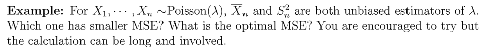
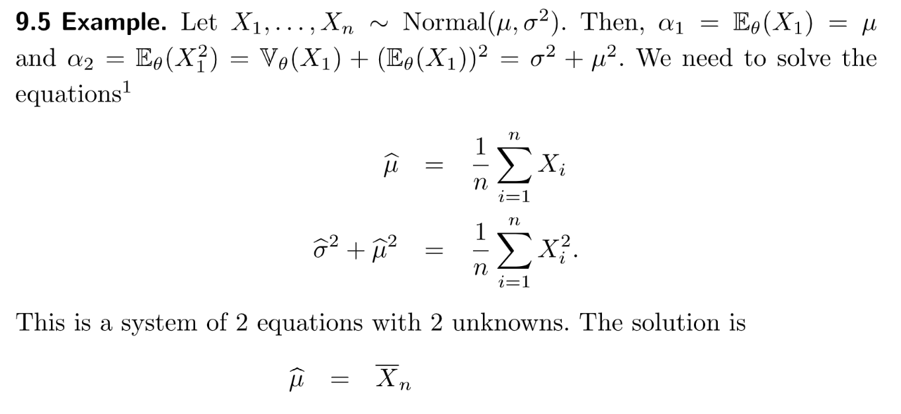

> **Reading:** John A. Rice-Mathematical Statistics and Data Analysis Ch8 & All of Statistics Ch9
> **Importance: **Cryo-EM Algorithm(2D projection in molecules, using MoM)

# 1 Basics of Parameteric Inference
> Suppose we have the parameter vector: 
> **Moment Matching:**
> 1. : Emprical first moment.
> - 
> - 
> 2. Find such that the correspondingpopulation moment matches the empirical moment.
> 
> 3. Find such that for , solving an equation.
> 
**MoM Estimator:** such that 

## 1.1 Sampling Distribution
> 本章节中我们将讨论如何将数据拟合到`Probability Laws`。之前我们见过的很多分布，比如:
> - 泊松分布，单参数，
> - 高斯分布，多参数，
> 
所以我们的任务就是利用手头的样本数据来找到最能拟合的参数值。
> 我们以一个放射性粒子(粒子)的释放过程为例。首先，放射性物质在单位时间内释放的放射性粒子的量不是一个常数，而是一个随机波动的数值。如果这个数值(`rate of emission`)在我们观测的时段内没有发生什变化(比如半衰期很长)，且如果放射性粒子来源于很多独立的源头(`atoms`), 则我们可以使用`Possion`过程来描述。因为这个原因，泊松分布经常用于为放射性物质衰变的过程建模。
> 
> Berkson 在美国国家标准研究所对放射性元素镅元素(Am 241)释放的粒子数量做了数据分析。Berkson在每段长为秒的时间区间内记录了观测到的粒子的数量，总共记录了个区间。另外，Berkson 挂测到粒子总共释放的次数是次，且粒子的平均释放次数是 , 数据记录在下表中:
> 
> 在这个区间中，有个区间内记录到了次粒子碰撞，有个区间记录到了次粒子碰撞。
> 我们试图用泊松过程来为之建模，我们可以将每一个秒的时间区间看成是一次泊松过程，可以使用一个泊松随机变量来描述，参数为, 根据泊松分布的`PMF`: 。这时的我们用标记，表示对于的拟合参数。
> **对于上述实验和参数估计的过程，我们有几个注意事项和问题:**
> 1. 如果我们重复这整个实验很多次的话，在个`10-sec intervals`上的总共的`emission`次数也会不同，不一定是次了，同时每秒的释放此次数也就是不一定是次了，这样我们对于参数的拟合值也就不一定是了。
> 2. 既然的值在不同实验条件下会不断变化，我们完全可以把(的拟合值，统计量)看成是一个随机变量，它服从一个`Sampling Distribution`。
> 3. 这个数值有多精确？

## 1.2 Goodness of Fit
> 考虑上表中的个`Cells`，代表个`Cells`, 每个记录了粒子的个数，如果我们做了一个泊松模型假设，则每个`Cell`内的粒子数量就可以通过泊松分布(参数为)的`PMF`计算出来。比如:
> - 第一行表示落入`10-sec interval`的粒子有个的情况，根据泊松分布我们知道，
> - 第二行表示落入`10-sec interval`的粒子恰有个的情况，根据泊松分布我们知道，
> - 第十六行表示落入`10-sec interval`的粒子有个的情况，根据泊松分布我们知道，
> 
根据泊松假设，是独立的参数为的泊松随机变量，表示每个`10-sec interval`内释放的粒子的数量。另一方面，对于每一个, 他有种结果（正如上面介绍的那样），每种结果的概率可由泊松分布形式计算得到。
> 所以实际上符合一个参数为的多项分布。
> 根据[多项分布的边缘概率](https://www.yuque.com/alexman/kziggo/ng8x7t#GYj9N)我们知道, 于是上表中第三列就是通过得到的。比如。

 
 
## 1.3 Parameter Estimation
### 1.3.1 Normal Distribution
> 

### 1.3.2 Gamma Distribution
> 

## 1.4 参数推断的方法
> 我们将使用如下的基本方法去学习`Parameter Estimation`。观测到的数据是的`realization`, 且假设他们底层的联合分布的未知参数是。注意可能是一个向量，比如`1.3`中的`Gamma`分布的。通常来说，会被建模成**独立同分布**的，服从的随机变量。对未知参数的估计量是的函数，即。这个估计量满足一个`Sampling Distribution`，有自己的`Standard Error`, 我们会利用这个信息来判断的估计有多好。

 

## 1.5 Parameter Models
> 

## 1.6 Parameters of Interest
> 

**Examples**

## 1.7 总结
> 之前我们对于样本的底层分布没有任何假设。
> 对于 #accidents, 我们会使用泊松分布
> 对于 #waiting time, 我们会使用指数分布或者几何分布。
> 1. Given , how to find an estimation of ?
> 2. Evaluate the quality of the estimators?
> 3. Any way to find the ? Consistent? Bias? Variance? MSE?
> 
Two ways: Method of Moment, Maximum Likelihood Estimation.

# 2 Method of Moments
[Method of Moments.pdf](https://www.yuque.com/attachments/yuque/0/2022/pdf/12393765/1667183989525-0805df23-e504-4ec6-8716-2aff8c8b7df4.pdf)
:::info

:::

## 2.1 方法概述
:::info

总的来说，`MoM`基于样本数据的不同阶矩建立了一个关于的线性方程组。
:::

## 2.2 How to choose k?
> 其实从上文我们知道我们是通过解一组线性方程组来获得我们的`MoM Estimator`的。所以一个很自然的问题是，我们的线性方程组需要有几个方程才能得到稳定的`MoM Estimator`。
> 
> 一般而言，我们只需要选择最小的使得唯一存在即可。

## 2.3 MoM Estimator Examples
### Bernoulli 
> 

### Binomial
> 

### Possion
> 
> **如果我们取, 则根据上述方法，我们只需要解这个方程即可:**
> 
> 得到: 
> , 所以我们得到一个`MoM Estimator`: , 也可以写成
> **如果我们取, 则根据上述方法，我们解方程组即可:**
> , 令
> 所以
> 所以
> **怎么比较不同的**`**MoM Estimator**`**呢?**
> 正如`2.2`中所说，我们倾向于使用`Lower Moment Estimators`, 因为`Higher Moment Estimators`会有更大的方差。也就是说如果我们就能唯一确定一个`MoM Estimator`就没有必要
> 如果
> , is the smallest number of equations to determine the solution of the linear equation.
> 

### Gamma Distribution
> 
> 我们首先获得的`First and Second Moment`: 
> 
> 然后计算`Sample Moment`:
> 
> 然后联立：
> 
> 解得：
> 

**证明 Consistency**根据大数定律(**WLLN**):
 , , 于是根据`CMT`, 我们可以构造一个函数, , 于是我们的函数可以设计成, 所以:

所以`MoMs For Gamma`是`Consistent Estimators`。

### Univariate Normal
> 
> **Biasedness and consistency:**
> - is unbiased and consistent
> - is biased(but asymtotically unbiased, which means , close to population variance) but consistent(A plug-in Estimator). Since the unbiased estimator should be . Consistency can be proved through **some theorem.**

### Bivariate Normal
> 

**Key**首先我们

### Uniform between 0 and theta
> 假设
> 于是
> 

**Unbiasedness and Consistency**,所以是`Biased`的。
, 所以, 所以是`Consistent`的。

### Uniform between a and b
> 

**Key**

### Moment DNE
> 
> 期望不存在的情况， 我们使用`Generalized MoM`:

**Key**我们可以选择来代替作为

可以使用`Inverse CDF`的方法通过均匀分布得到任何想要产生的随机变量。来验证我们求出的`MoM Estimator`是一个合适的估计量。

## 2.4 MoM 的缺点
### 2.4.1 Non-existent Moment
> **Problem:**
> 如果我们想使用`MoM`，前提就是`Moment`必须存在。但是一些分布（柯西分布没有`Moment Exists`。
> **Solutions:**
> `Generalized Method of Moment(GMM)`可以解决没有随机变量`Moment`的问题。(**Idea: Use general instead of **)
> 在, Instead of sticking to , we can transform the components of the equation into 。, 比如 exists for Cauchy. , solve for 

### 2.4.2 Non-existent Solution to Linear Equations
> **Problem:**
> Explicit Solution to linear equation DNE
> **Solution:**
> Use Numerical Methods like Newton Method, Gradient Descent are needed)

## 2.5 MoM Estimator 的性质
### 2.5.1 Theorem and Model
:::success

**我们需要**`**appropriate conditions on the model**`**才能有这些性质出现，这个假设在下面给出:**
首先我们定义, is empirical moment., 也就是我们要解的一个线性方程组模型使得是方程的唯一解(不是最小二乘解)。
由于, 我们会有
**我们对这个线性方程组模型的假设(regularity conditions)是:**

1.  : one to one function so that for , 
2. 是连续函数
3. 存在(存在且连续)，即可逆。

**Question: **

1. **Consistency: Do consistency hold in general, when sample size goes to infinity? ()**
2. **Confidence Interval: Can we construct a confidence Interval for by using the MoM estimator?**
3. **Asymptotic Normality: We hope so that we can construct the confidence interval for in the form of , is it true for MoM Estimators?**
:::

### 2.5.2 Consistency
> 如果**模型假设成立, 则:**
> 因为, （`Plug-in Estimator`） 所以根据大数定律，, 是真实的参数。
> 因为存在(存在且连续), 所以根据`CMT`定理(`Continuous Mapping Theorem`), 我们有:成立。
> 所以, 即

### 2.5.3 Asymptotically Normal
> 如果**模型假设成立, 我们有如下定理: **
> **Theorem: (这个使用后续的delta method也可以解释)**
> But and is unknown, we can use the consistent estimator to approximate these value.
> We can use to approximate (Since we can prove by Continuous Mapping Theorem that , so that )
> 有了我们就可以证明, Since 
> **Justify:**
> (is continuous)
> **Proof(一维，即的情况):**
>  , 
> , since is consistent, 
> As 
> 
> Divide and get:
> 
> Times :
> 
> 等式右侧：
> 
> 中间的表达式:
> 
> 所以使用`Slusky Theorem`: 

**Example**

### 2.5.4 Construct the Confidence Interval
> 

**Key**
