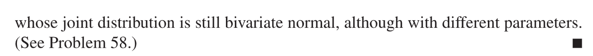

> **Reference:**
> - [http://prob140.org/sp17/textbook/ch24/Independence_and_Angles.html](http://prob140.org/sp17/textbook/ch24/Independence_and_Angles.html)
> - [http://prob140.org/textbook/content/Chapter_24/02_Bivariate_Normal_Distribution.html](http://prob140.org/textbook/content/Chapter_24/02_Bivariate_Normal_Distribution.html)
> - [http://prob140.org/prob140/install.html](http://prob140.org/prob140/install.html)

# 1 Bivariate Normal Distribution
## 1.1 PDF Definition
> 
> 其中$\mu_X=E[X],\mu_Y=E[Y],\sigma_X^2=Var(X),\sigma_Y^2=Var(Y),\rho=\frac{E[(X-E[X])([Y-E[Y])]}{\sigma_X\sigma_Y}$, 且$X\sim N(\mu_X, \sigma_X^2), Y\sim N(\mu_Y,\sigma_Y^2)$

**图解**

## 1.2 Correlation Properties
### Independence
> 
> 当$\rho=0$时, 关于联合高斯分布, 有一个非常重要的性质：
> **如果**$X,Y$**是联合高斯分布的，且他们的**`**Correlation**`**是零的话，则**$X,Y$**独立这是其他联合随机变量不具备的性质**，其他联合随机变量即便他们之间的`Correlation`是零，也不见得独立。
> 1. **当**$\mu_x=\mu_y=0,\sigma_x^2=\sigma_y^2=1,\rho=0$
> 
$f_{X,Y}(x,y)=\frac{1}{\sqrt{2\pi}}e^{-\frac{1}{2}(x^2+y^2)}=f_X(x)f_Y(y)$(Independence)
> 此时$X,Y$互相独立, 是$i.i.d$的标准高斯随机变量
> 2. **当**$\rho=0$**:**
> 
$f_{X,Y}(x,y)=\frac{1}{\sqrt{2\pi}\sigma_x\sigma_y}exp\{-\frac{1}{2}[\frac{(x-\mu_x)^2}{\sigma_x^2}+\frac{(y-\mu_y)^2}{\sigma_y^2}]\}=f_X(x)f_Y(y)$

**Correlation=0**
:::success
**下面我们探究在**$\rho=0$**且**$\sigma_X^2$**和**$\sigma_Y^2$**的大小关系的不同情况，总的来说，**`**pdf**`**的**`**contour lines**`**是椭圆:**

1.  $\sigma_X^2=\sigma_Y^2$


2. $\sigma_X^2>\sigma_Y^2$和$\sigma_X^2<\sigma_Y^2$的情况：


:::
**Proof of the statement**

### Correlation != 0
:::success
当协方差不等于零时，我们着重研究其图像的性质

:::
**Scatter Plots**


## 1.3 Correlation Analysis
### 1.3.1 Basic Properties
> 1. $\rho_{X,Y}$没有单位，只是一个纯数值
> 2. $\rho_{X,Y}=\rho_{Y,X}$
> 3. $-1\leq \rho_{X,Y}\leq 1$
> 4. 如果$\rho_{XY}=1$, 则$Y-\mu_Y=\alpha(X-\mu_X)$, 其中$\alpha=\frac{\sigma_Y}{\sigma_X}$。
> 5. 如果$Y=aX+b$, 则如果$a>0$则$\rho_{XY}=1$；如果$a<0$则$\rho_{XY}=-1$, 
> 
我们说$\rho_{XY}$度量了$X,Y$之间的`Linear Association`

**Proof of the third statement**
**Proof of the fourth statement****Concise Version：**

**A little twisted version:**
We can define a function 

Since  and it is a quadratic function, we have

When , the equality holds, which means  has a single root. However, ,  iff.

Thus, when :

Actually, since , thus, 0
This ends our derivations.


### 1.3.2 使用协方差表示二元正太分布
> 假设$(X,Y)$服从`Bivariate Normal Distribution`且$\rho_{XY}=\rho$, 则我们可以将$X,Y$之间的关系写成:
> $Y=\rho X+\sqrt{1-\rho^2}Z$
> 其中$X,Z\stackrel{i.i.d}\sim  \mathcal{N}(0,1)$。
> 首先我们注意到，由于$Y$是两个标准正太分布$X,Z$的线性组合，所以$Y$服从高斯分布，同时我们有:
> $E[Y]=E[\rho X+\sqrt{1-\rho^2}Z]=\rho E[X]+\sqrt{1-\rho^2}E[Z]=0$
> $Var[Y]=\rho^2Var(X)+(1-\rho^2)Var(Z)=1$
> 所以$Y\sim \mathcal{N}(0,1)$


## 1.4 Margin and Summation
### 1.4.1 Marginal Distribution
> 
> 总的来说，多元正太分布的边缘概率分布是标准正太分布。

**Informal Proof**假设, 则:

注意到 是服从分布的一个随机变量. 所以 
所以我们有:

这个结论可以推广到上

### 1.4.2 Sum of independent Normal
> 

**推导过程**


## 1.5 Constructing a Bivariate Normal
[Bivariate-Normal.pdf](https://www.yuque.com/attachments/yuque/0/2022/pdf/12393765/1666680125250-7ccd2297-41bc-4aa0-95a5-b040986abfc4.pdf)
> 
> 其中$U,V\sim N(0,1)$
> 性质:
> 1. 如果$X,Y$是`Bivariate Normal`, 则$X,Y$的任何线性组合$Z=s_1X+s_2Y,s_1,s_2\in \mathbb{R}$也是一个`Normal Random Variable`。
> 
$Z=s_1(aU+bV)+s_2(cU+dV)=(as_1+cs_2)U+(bs_1+ds_2)V$, 根据定义，这也是一个`Normal Random Variable`


## 1.6 Useful Codes
### 1.6.0 Environment Setting
> - pip install prob140
> - pip install prob140 --upgrade
> - pip install datascience

```python
import warnings
warnings.filterwarnings('ignore')
from datascience import *
from prob140 import *
import numpy as np
import matplotlib.pyplot as plt
plt.style.use('fivethirtyeight')
%matplotlib inline
from scipy import stats
```


### 1.6.1 Plot Bivariate Normal 
```python
def plot_bivariate_norm(rho, n):
    # Generate n normally distributed random variables.
    x = stats.norm.rvs(size=n)
    z = stats.norm.rvs(size=n)
    y = rho * x  +  (1 - rho**2)**0.5 * z
    plt.scatter(x, y)

    # Axes, labels, and titles
    plt.xlim(-4, 4)
    plt.ylim(-4, 4)
    plt.axes().set_aspect('equal')
    plt.xlabel('$X$')
    plt.ylabel('$Y$', rotation=0)
    plt.title('Standard Bivariate Normal, Correlation '+str(rho))

plot_bivariate_norm(0.6, 1000)
```
**Graph**
## 1.7 Matrix Representation
### 1.7.1 Covariance Matrix
> $\vec{\mu}=\begin{bmatrix} \mu_x\\ \mu_y\end{bmatrix}$, $\Sigma=\begin{bmatrix} \sigma_x^2& \rho\sigma_x\sigma_y\\ \rho\sigma_x\sigma_y&\sigma_y^2\end{bmatrix}$
> 性质:
> 1. 当$\rho\neq \pm1$时，$\Sigma$是正定的。
> 
我们只要验证各阶主子式的行列式都是大于零的
> 或者通过验证$\mathbf{tr}(\Sigma)>0$和$\mathbf{det}(\Sigma)>0$
> 2. 如果$\Sigma\geq 0(正定的) \iff \forall \mathbf{z}\neq0, \bf z^T\Sigma z>0$
> 
$\begin{align}Var(z_1X+z_2Y)&=z_1^2Var(X)+2z_1z_2Cov(X,Y)+z_2^2Var(Y)\\&=E[z_1(X-E[X])+z_2(Y-E[Y])]^2\\&=\begin{bmatrix} z_1&z_2\end{bmatrix}\begin{bmatrix} Var(X)&Cov(X,Y)\\Cov(X,Y)&Var(Y)\end{bmatrix}\begin{bmatrix} z_1\\z_2\end{bmatrix}\\ &\geq 0,\forall z_1,z_2\end{align}$
> 所以`Covariance Matrix`$\bf \Sigma$是半正定的


### 1.7.2 PDF in Matrix Form
> 


## 1.8 Bivariate Linear Invariance
> 对于$X\sim N(\mu_x,\sigma_x^2), Y\sim N(\mu_y,\sigma_y^2)$, 如果$X,Y$互相独立, 那么$\space aX+bY\sim N(a\mu_x+b\mu_y,a^2\sigma_x^2+b^2\sigma_y^2)$成立
> **我们可以使用**`**MGF**`**来证明这个结论:**
> 令$Z=aX+bY$, 因为:
> $\begin{aligned}
E[e^{tZ}]=E[e^{t(aX+bY)}]&=E[e^{atX}]E[e^{btY}]\\&=exp\{a\mu_X t+\frac{a^2\sigma_X^2}{2}t^2+b\mu_Yt+\frac{b^2\sigma_Y^2}{2}t^2\}\\
&=exp\{a\mu_X t+b\mu_Yt+\frac{a^2\sigma_X^2}{2}t^2+\frac{b^2\sigma_Y^2}{2}t^2\}\\
&=exp\{(a\mu_X+b\mu_Y)t+(\frac{a^2\sigma_X^2+b^2\sigma_Y^2}{2})t^2\}
\end{aligned}$
> 而$exp\{(a\mu_X+b\mu_Y)t+(\frac{a^2\sigma_X^2+b^2\sigma_Y^2}{2})t^2\}$就是$\mathcal{N}(a\mu_X+b\mu_Y, a^2\sigma_X^2+b^2\sigma_Y^2)$的`MGF`, 故得证。
> 现在问题来了，刚刚我们假定了$X,Y$互相独立的条件，那么对于任意的$\begin{bmatrix} X\\Y\end{bmatrix}\sim N(\vec{\mu},\vec{\Sigma})$,  $aX+bY\sim N(a\mu_x+b\mu_y,a^2\sigma_x^2+b^2\sigma_y^2)$是否还成立呢? 答案是不成立的，原因就是我们需要考虑协方差带来的影响，详见下面的引理:
> $aX+bY\sim N(a\mu_x+b\mu_y,a^2\sigma_x^2+2ab\sigma_{xy}+b^2\sigma_y^2)$, where $\sigma_{xy}=\rho \sigma_x\sigma_y$
> 将上述引理写成矩阵形式: $\lambda=\begin{bmatrix} a\\b\end{bmatrix}$, $\lambda^T \begin{bmatrix} X\\Y\end{bmatrix}\sim N(\lambda^T\begin{bmatrix}\mu_x\\\mu_y \end{bmatrix},\lambda^T\begin{bmatrix} \sigma_x^2&\sigma_{xy}\\\sigma_{xy}&\sigma_y^2\end{bmatrix}\lambda)$其中$\Sigma=\begin{bmatrix} \sigma_x^2&\sigma_{xy}\\\sigma_{xy}&\sigma_y^2\end{bmatrix}$

**算例1**> , marginal of X
> Mean: 
> Variance: 
> 

**算例2**

## 1.9 Some Important Concepts
> If  and  have Normal marginals but they are dependent, then it is not necessarily the case that they are jointly Normal.


# 2 Multivariate Normal Distribution
## 2.1 Random Vector
:::info
假设我们有一个随机向量$\mathbf{X}=\begin{bmatrix} X_1\\X_2\\\vdots \\X_n\end{bmatrix}$, 我们有两个参数:

- $\vec{\mu}=\mathbb{E}(\mathbf{X})\in \mathbb{R}^d$
-  $\bf \Sigma$是一个$d\times d$的半正定矩阵(所有特征值都是非负的), $\bf \Sigma_{ij}=Cov(X_i, X_j)=\mathbb{E}(X_i-\mathbb{E}(X_i))(X_j-\mathbb{E}(X_j))$

**特别的:**
$\bf \Sigma=\mathbb{E}(X-\mathbb{E}[X])(X-\mathbb{E}[X])^T$, 这表明$\bf \Sigma \geq 0$(半正定的), 我们通过其二次型验证:
$\bf t^T\Sigma t=\mathbb{E}[t^T(X-\mathbb{E}[X])(X-\mathbb{E}[X])^Tt]=\mathbb{E}[\mathbf{t}^T(X-\mathbb{E}[X])]^2\geq 0, \forall t$
:::

## 2.2 PDF
:::info
$f(\mathbf{ x};\mu,\mathbf{\Sigma})=\frac{1}{(2\pi)^{\frac{d}{2}}\sqrt{det(\mathbf{\Sigma})}}e^{-(\mathbf{x}-\mu)^T\mathbf{\Sigma}^{-1}(\mathbf{x}-\mu)}$
下面对于$\mu$和$\Sigma$的情况进行讨论:

1. 如果 $\mu=\mathbf{0}$, $\bf \Sigma=I_d$

$f(\mathbf{ x};\mu,\mathbf{\Sigma})=\frac{1}{(2\pi)^{\frac{d}{2}}}e^{-\mathbf{x}^T\mathbf{x}}=\prod_{i=1}^nf(x;0,1)$, 这表明$X_1,\cdots, X_n\stackrel{i.i.d}\sim N(0,1)$

2. 如果$\mu$任意，$\bf \Sigma=\begin{bmatrix}\sigma_1^2&\cdots&0\\ \vdots&\ddots&\vdots\\0&\cdots&\sigma_d^2 \end{bmatrix}$, $\sigma_i^2=Var(X_i)$

$\bf (x-\mu)^T\Sigma^{-1}(x-\mu)=\sum_{i=1}^d (X_i-\mu_i)(X_i-\mu_i)\Sigma^{-1}_{ii}=\sum_{i=1}^n \frac{1}{\sigma_i^2}(x_i-\mu_i)^2$
$f(\mathbf{ x};\mu,\mathbf{\Sigma})=\frac{1}{(2\pi)^{\frac{d}{2}}\sqrt{det(\mathbf{\Sigma})}}e^{-(\mathbf{x}-\mu)^T\mathbf{\Sigma}^{-1}(\mathbf{x}-\mu)}=\prod_{i=1}^d\frac{1}{(2\pi)^{\frac{1}{2}}\sigma_i^2}e^{-\frac{(x_i-\mu_i)^2}{2\sigma_i^2}}$
$X_1\,\cdots X_n\stackrel{i.i,d}\sim N(\mu_i,\sigma_i^2)$, $X_i\perp X_j, \forall i\neq j$
:::

## 2.3 Linear Invariance
:::info

上面的公式里面的加号写错了，应该是$\Sigma_X=E[XX^T]-E[X]E[X]^T$

**总的来说:**
$\bf Y=AX+b$, $\bf X\sim N(\mu,\Sigma)$, 则$\bf Y\sim N(A\mu +b, A\Sigma X^T)$

1. $\mathbf{A}=e_i^T\in \mathbb{R}^{1\times d}$, $\bf b=0$,$\mathbf{X_i}=\mathbf{Ae_i} \sim N(\mathbf{e_i^T\mu}, \mathbf{e_i^T\Sigma e_i})=N(\mu_i,\sigma_i^2)$
2. $\bf A=\Sigma^{-\frac{1}{2}}=(\Sigma^{\frac{1}{2}})^{-1}$, 我们对$\bf \Sigma$进行谱分解: $\mathbf{\Sigma}=\sum_{i=1}^d \lambda_i \mu_i\mu_i^T$， 于是$\bf \Sigma^{\frac{1}{2}}=\sum_{i=1}^d\sqrt{\lambda_i}u_iu_i^T$
3. 如果$\bf Y=\Sigma^{\frac{1}{2}}X$, $\bf Y$is a standard normal $N(0,\bf \Sigma^{\frac{1}{2}}\Sigma \Sigma^{\frac{1}{2}})=N(0,\Sigma^2)$, 当$d=1$时，$\bf Y=\sigma X\sim N(0,\sigma^2)$


:::


## 2.4 Multi-variate Normal MGF
:::info
对于$\bf X\in \mathbb{R}^n$, $\mathbf{X}=\begin{bmatrix} X_1\\X_2\\\vdots\\X_n\end{bmatrix}$, 且$\bf X\sim N(\mu,\Sigma)$来说，他的`Multi-variate MGF`是:
假设$\bf t\in \mathbb{R}^n$且$\bf t=\begin{bmatrix} t_1\\t_2\\ \vdots \\ t_n\end{bmatrix}$, 则$\begin{aligned}M_{\mathbf{X}}\mathbf{(t)}=E[e^{\mathbf{\langle t ,X\rangle}}]\end{aligned}$
而我们又可以将$\langle \mathbf{t,X}\rangle$看成是一个随机变量$Y$, 则$E[e^{\mathbf{\langle t ,X\rangle}}]=E[e^Y]=M_Y(1)$
而我们知道$Y=\mathbf{t^TX}$, 则根据`Normal Random Variable`的`Linear Invariance`, 我们有:
$Y\sim N(\mathbf{t^T\mu_X},\mathbf{t^T\Sigma_X t})$, 其中$\mathbf{t^T\mu_X},\mathbf{t^T\Sigma_X t}$都是常数。
于是$\mathbf{M_X(t)}=M_Y(1)=exp\{\mathbf{t^T\mu_X}+\frac{1}{2}\mathbf{t^T\Sigma_X t}\}$
:::


## 2.5 Construct Multivariate Normal
### 2.5.1 直观形式
> 
> **这本质上在说，如果一系列随机变量**$X_1,\cdots, X_m$**均是由标准正态分布组成的，则他们组成一个联合多元正态分布。**
> 现在我们对于$X_1,\cdots, X_m\sim N(\mu_i,\sigma_i^2)$（其中$Z_i\sim N(0,1)$）组成的联合分布进行一系列性质的研究：
> 首先注意到$X_i$是一系列标准正态分布的随机变量$Z_i$的组合，而我们知道，对于一个正太分布的随机变量进行加法和数乘的操作得到的新的随机变量$X_i$仍然是一个正太分布, 且$E[X_i]=\mu_i$, $Var[X_i]=\sum_{j=1}^n a_{ij}^2$
> **然后我们计算**$X_1,\cdots, X_m$**组成的**`**Joint MGF**`**：**
> $M(t_1,\cdots, t_m)=E[e^{t_1X_1+\cdots +t_mX_m}]$, 也就是我们之前定义的`Joint MGF`(自变量是$X_1,\cdots, X_m$)
> 我们首先需要注意的是$\sum_{i=1}^mt_iX_i$是一系列`independent`的正态分布随机变量$X_1,\cdots, X_n$的线性组合。而我们知道，加法和数乘(线性运算)是不会改变一个正态分布随机变量的正态分布性的，于是$\sum_{i=1}^mt_iX_i$也是一个正态分布，且:
> **他的期望是:**
> $E[\sum_{i=1}^mt_iX_i]=\sum_{i=1}^mt_iE[X_i]=\sum_{i=1}^m t_i\mu_i$
> **他的方差是:**
> $Var[\sum_{i=1}^mt_iX_i]=Cov(\sum_{i=1}^mt_iX_i, \sum_{j=1}^mt_jX_j)=\sum_{i=1}^m\sum_{j=1}^mt_it_jCov(X_i,X_j)$
> 其中第二个等式成立的原因是协方差的线性性质，这我们在[协方差性质](https://www.yuque.com/alexman/kziggo/ei1b29#EV4F3)的性质$2$中有提到过, 非常重要。
> 现在，假设$Y\sim N(\mu,\sigma^2)$, 那么$E[e^Y]=M_Y(t)\big|_{t=1}=e^{\mu+\frac{\sigma^2}{2}}$(原因详见`1.2.4`, $M_Y(t)=e^{\frac{\sigma^2t^2}{2}+\mu t}$)
> 所以$M(t_1\cdots, t_m)=e^{\sum_{i=1}^m t_i\mu_i+\frac{1}{2}\sum_{i=1}^m \sum_{j=1}^m t_it_jCov(X_i,X_j)}$, 当$m=2$时，这个多元正态分布化简成一个`Bivariate Normal`。


### 2.5.2 矩阵形式
:::info
怎么保证 $\begin{bmatrix} X_1\\\vdots \\X_n\end{bmatrix}$是多元正太分布呢?

1. $U_i\stackrel{i.i.d}\sim N(0,1)$, $\begin{bmatrix} U_1\\\vdots \\U_n\end{bmatrix}\sim N(0,I_n)$，如果能够找到一个线性变换矩阵$A$使得$Y=AU$, 则$Y=AU$的各个分量是`jointly normal`的。
2. If their marginals are $N(0,1)$, **不意味**着他们是`Jointly normal`的。
3. **Use moment generating function of a random vector**

$\vec{X}\sim N(\vec{\mu},\Sigma)$, $\sum_i t_iX_i\sim N(\vec{t}^T\vec{\mu},\vec{t}^T\Sigma\vec{t})$(二次型)
$t_1,\cdots, t_k,X_1,\cdots, X_k$, $E_{X}exp\{\sum t_iX_i\}=exp\{\vec{t}\vec{\mu}+\frac{1}{2}\vec{t}^T\Sigma\vec{t}\}$
如果$E_{X}exp\{\sum t_iX_i\}=exp\{\vec{t}\vec{\mu}+\frac{1}{2}\vec{t}^T\Sigma\vec{t}\}$对任意$t$都成立，则$\vec{X}\sim N(\vec{\mu},\Sigma)$
:::
> 假设我们现在想要构造一个$\bf X\sim \mathcal{N}(\mu,\Sigma)$
> Given vector$\mathbf{Z}\sim \mathcal{N}(0,I_d)$, how to create $\mathbf{X}$?
> $\bf \Sigma^{\frac{1}{2}}\mathbf{Z}+\mu\sim \mathcal{N}(\mu,\Sigma^{\frac{1}{2}}\Sigma^{\frac{1}{2}})=\mathcal{N}(\mu,\Sigma)$, $\Sigma^{\frac{1}{2}}$can be replaced by any $A$s.t. $AA^T=\Sigma$
> 本质是线性组合


### 2.5.3 Example
> 

**Key 1**因为是`Jointly Normal`的， 所以我们知道, 而根据题中给出的协方差和均值，我们知道, 于是
**Key 2**根据`Linear Invariance`我们知道, 所以:

**Key 3**根据协方差矩阵可知，, 

## 2.6 Matrix Example
> 

**Key**

# 3 More on this topic
## 3.1 Rayleigh Density
### 3.1.1 标准定义
:::info
瑞利密度函数由两个独立的标准高斯分布的随机变量的平方和的根。
$R=\sqrt{Z_1^2+Z_2^2}$, 其中$Z_1,Z_2\sim N(0,1)$且互相独立。
:::

### 3.1.2 推导过程
:::info

想象一下:
$X>0$, 相当于是$x$轴正方向的半平面，它对应的$\theta\in(-\frac{\pi}{2},\frac{\pi}{2})$, 这也正好是$arctan(\frac{Y}{X})$在$-\frac{\pi}{2}$到$\frac{\pi}{2}$这个`branch cut`上的值域。
$X<0$, 相当于是$x$轴负方向的半平面，它对应的$\theta\in(\frac{\pi}{2},\frac{3\pi}{2})$, 这也正好是$arctan(\frac{Y}{X})$在$\frac{\pi}{2}$到$\frac{3\pi}{2}$这个`branch cut`上的值域。
思路参考: [坐标变换下的概率密度函数推导](https://www.yuque.com/alexman/kziggo/ei1b29#X2V9K)
:::


## 3.2 Generalization
:::info

:::
**Example**
:::info

:::
**Example**


## 3.3 Bivariate Normal Example
> 

**Question 1**
**Question 2**


