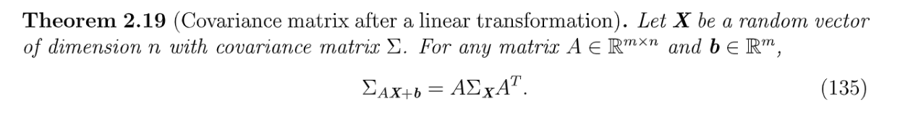

# Square-root Matrix
## Preliminaries
> 假设$\bf A$是一个$k\times k$的正定矩阵，则首先我们可以知道:
> 1. $\bf A$是一个对称矩阵，$\bf A^T=A$
> 2. $\bf A$可以正交对角化，也就是可以找到$k$个线性无关且正交的单位特征向量组成正交矩阵$\bf U$(满足$\bf U^{-1}=U^T$, )使得$\bf A=U\Lambda U^T$, 其中$\bf \Lambda$的对角线上是$\bf A$的所有特征值。
> 3. $\bf A$的所有特征值都大于零，即$\lambda_1,\lambda_2,\cdots, \lambda_n>0$
> 4. $\bf A$是一个可逆矩阵, 因为所有特征值大于零。
> 
所以$\bf A^{-1}$存在且$\bf A^{-1}=(U\Lambda U^T)^{-1}=(U^T)^{-1}\Lambda^{-1}U^{-1}=U\Lambda^{-1}U^T$, 我们可以看到矩阵$\bf A$的特征向量其实没有改变，只是所有特征值取了一个倒数。而我们知道对于任何可以正交对角化的矩阵来说，它都可以写成进行谱分解的形式:$\bf A=\sum_{i=1}^n \lambda_iu_iu_i^T$, where $\bf U=\begin{bmatrix} \bf u_1&\bf u_2&\cdots&\bf u_n\end{bmatrix}$，同时我们有$\bf A^{-1}=\sum_{i=1}^n \frac{1}{\lambda_i}u_iu_i^T$

## Definition
> 现在我们想对$\bf A_{k\times k}$这个正定矩阵做一个平方根的操作， 就是使得存在一个矩阵$\bf S$使得$\bf S^2=A$。
> 因为$\bf A=U\Lambda U^T$, 且$\bf U^TU=UU^T=I$, 所以我们可以构造一个$\bf S=U\Lambda^{\frac{1}{2}}U^T$, 其中$\bf \Lambda^{\frac{1}{2}}=\begin{bmatrix} \sqrt{\lambda_i}&\cdots&0\\\vdots&\ddots&\vdots\\0&\cdots&\sqrt{\lambda_k}\end{bmatrix}$。
> 于是我们可以将$\bf A^{\frac{1}{2}}=U\Lambda^{\frac{1}{2}}U^T$称为`Square Root Matrix`(特指正交矩阵开根后的矩阵):

## Properties
> 我们总结一下上述性质：
> 1. $\bf (A^{\frac{1}{2}})^T=A^{\frac{1}{2}}$
> 2. $\bf A^{\frac{1}{2}}A^{\frac{1}{2}}=A$
> 3. $\bf A^{\frac{1}{2}}$是可逆的，$(\bf A^{\frac{1}{2}})^{-1}=\sum_{i=1}^n\frac{1}{\sqrt{\lambda_i}}u_iu_i^T=U\Lambda^{-\frac{1}{2}}U^T$, 其中$\bf \Lambda^{-\frac{1}{2}}$是一个对角矩阵$\begin{bmatrix} \frac{1}{\sqrt{\lambda_i}}&\cdots&0\\\vdots&\ddots&\vdots\\0&\cdots&\frac{1}{\sqrt{\lambda_k}}\end{bmatrix}$
> 4. $\bf A^{\frac{1}{2}}A^{-\frac{1}{2}}=A^{-\frac{1}{2}}A^{\frac{1}{2}}=I$且$\bf A^{-\frac{1}{2}}A^{-\frac{1}{2}}=A^{-1}$, 其中$\bf A^{-\frac{1}{2}}=(A^{\frac{1}{2}})^{-1}$

# Random Vectors
[probability_3.pdf](https://www.yuque.com/attachments/yuque/0/2022/pdf/12393765/1668090316544-972e864d-725d-44f8-92a0-1e581ea4edc2.pdf)
## Defintion
> 

## Subvectors
### Definition
> 
> 举个例子: 假设我们有一个随机向量$\bf X=\begin{bmatrix} X_1\\X_2\\\vdots\\X_n\end{bmatrix}$, 他的一个`Subvector`就是$\bf X_{\mathcal{I}}=\begin{bmatrix} X_1\\X_3\\X_5\end{bmatrix}$, 换句话说就是取了$X_1,\cdots, X_n$中的$3$个元素出来。此时: $\mathcal{I}=\{1,3,5\}\subseteq \{1,2,\cdots,n\}$

### Summing/Integrating over vectors
> 下面定义的概念主要是为了方便后续阐述`Marginal Distribution of Random Vector` 做铺垫的。
> 
> 其实上述定义就是在表达我如果要求一个`Marginal Distribution`怎么用数学语言表达，其实没那么难。如果觉得抽象，可以看后面的`Integrating Example`来熟悉这一套数学语言。

## Joint/Marginal Distribution
### Discrete Case
> 假设$X_1,X_2,\cdots, X_n$都是离散的随机变量，则此时如果我们要求`Random Vector`$\bf X$取到$\bf x$的概率, 相当于要求$\mathbb{P}(\mathbf{X=x})=\mathbb{P}(X_1=x_1,X_2=x_2,\cdots, X_n=x_n)$。
> 
> 要注意: 我们不确定$X_1,\cdots X_n$是否是彼此独立的。于是不能将$\mathbb{P}(X_1=x_1,X_2=x_2,\cdots, X_n=x_n)$写成$\mathbb{P}(X_1=x_1)\mathbb{P}(X_2=x_2)\cdots \mathbb{P}(X_n=x_n)$的形式，我们需要依赖协方差矩阵判断。

### Continuous Case
> **CDF for Random Vector:**
> 由于$X_1,\cdots, X_n$都是连续的，换句话说就是$X_i$的样本空间就是一些`Intervals`的`Unions`或者`Intersections`, 而$X_1,\cdots, X_n$共同组成的高维样本空间就是所有$X_i$的一维样本空间的笛卡尔积。
> 
> **PDF for continuous Random Vector:**
> 求`PDF`按照国际惯例就是求导:
> 

### Axiom of Probability
> 

### Marginal Distribution
> 

**Proof**

## Conditional Distribution
### Definition
> 

### Chain Rule
> 

**Proof**

## Integrating Example
### Lemma
> 

**Proof**

### Problem Setting
> 

### Joint Distribution
> 

### Conditional Distribution
> 
> 首先我们求$X_1,X_3$的联合分布，也就是对所有的$X_2$求和，得到下面的式子：
> 之后我们可以求解边缘分布($X_2|X_1,X_3$): 

**Graph**

## Independence
### Jointly Independent
> 

### Conditionally Independent
> 

### Pairwise doesn't imply Joint
> 

# Random Matrices

## Mean and Variance 
### Expected Value of RV Function
> 

### Mean Vector
> 

## Random Matrix
> 

## Linear Transformation
> 

## Covariance Matrix
### Definition
> 
> 

### Theorem
> 

**Proof**

