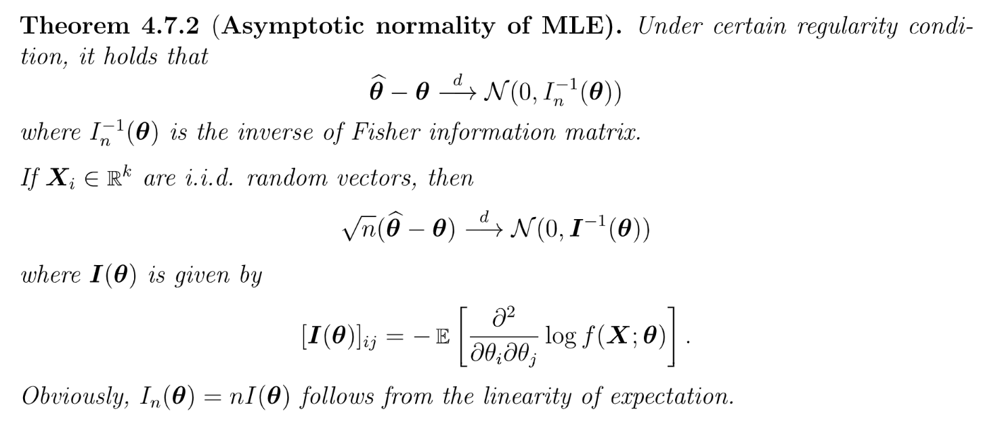
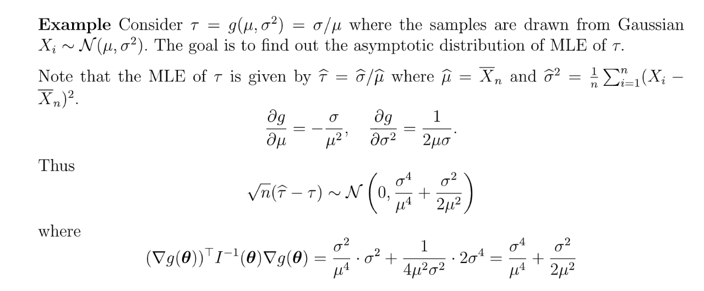

> In general, , 
> Log-likelihood : 

# 1 Multi-parameter MLE
## 1.1 Consistency
> **Consistency:**
> Under certain regularity condition, MLE is consistent.
> , where and are in 
> Each component where 

## 1.2 Asymptotic Normality 
:::info

equals the nagative Hessian Matrix of population log-likelihood. Hessian at the global maximizer of the population log-likelihood should be negative to ensure local concavity.
follows from that is the global max of 

:::
**Bivariate Guassian Example**

## 1.3 Multivariate Delta Method
:::info

这里是一个的函数，当然如果是也是成立的，这时候就是一个`Jacobian Matrix`。
对于的情况:
Let be a sequence of r.v. converges in distribution ,即:
 .
Then for a continuous function that has nonzero gradient at , then :

如果, 则, the variance is then 
**Application to MLE Estimators:**

:::
**Proof**
By the linear invariance property of multivariate gussian distribution, we have:
> , where 
> Matrix form of above , 

In the above case, we have , 
thus , 
**Example**

## 1.4 Multivariate MLE Example
### Bivariate Normal
> 假定数据的底层分布是高斯分布:
> 1. 求出`Log-likelihood Function`:
> 
> 
> 2. 求出Critical Points:
> 
> 
> 3. 验证`Global Extremity`，注意到这里我们有两个参数，属于多元函数极值分析, 所以需要借助`Hessian Matrix`：
> 
我们在多元微分中提到对于一个多元函数，令, 且是的一个临界点。
> 对应的矩阵形式就是, 如果:
>    - 且, 即, 则是`Local Minimum`,是正定的(各阶主子式都大于零)
>    - 且,  即则是`Local Maximum`,是负定的(奇数阶主子式小于零，偶数阶主子式大于零)
>    - , 则是`Saddle Point`。
> 
那么在本例中也是类似的道理:
> 
> 
> 由于且, 所以是`Log-likelihood Function`的局部最小值，为了证明全局最小值, 处`Hessian`的`PSD`条件还不够强，但是我们可以使用下列思路证明:
> 1. 固定参数，观察`Log-likelihood Function`, 这个函数是否是`Convex`的。
> 2. 对参数求偏导得到`Global Maximizer`
> 3. 对参数求偏导得到`Global Maximizer`

**Proof**

### Regression W.O Intercept
> 

**Key 1**
1. **求出**`**log-likelihood function**`

2. **找到**`**Global Maximizer**`

**Key 2**
**Key 3**这里我们其实利用了总体方差的估计量(比如)的分布性质来证明其`Consistent`的性质。

**对于橙色框中的结论:**
可以拆分来看:
实际上是一个常数，
**对于绿色框中的结论:**

而我们知道其实是一个投影矩阵，因为是一个投影矩阵(投影到方向上的投影矩阵)。而同时又是一系列独立标准高斯随机变量组成的向量。
所以首先我们令, 则, 于是根据投影矩阵的性质，我们知道, 其中是正交矩阵满足，且的对角线上有个以及一个, 于是
而我们又知道个标准正太分布平方的和是, 所以

## 1.5 Asymptotic Examples

## 1.6 Delta Examples
### Normal
> **Asymptotic normality and CI:**
> **, , Can we find CI for ?**
> 

### Gamma
[Gamma.pdf](https://www.yuque.com/attachments/yuque/0/2022/pdf/12393765/1667047570674-1a805520-1293-44a3-92a3-40c2acf9b32a.pdf)

## 1.5 样本均值和样本方差的独立性
> Are and  independent where and are the MLE of with unknown and 。 
> Why are independent?
> 我们只需要证明和是独立的
> 因为
> 令, 
> 则, where 
> 
> 所以
> 是一个对称矩阵, 且是一个半正定矩阵, 我们可以证明实际上是一个投影矩阵:
> **Question: What are the eigenvalues of ?**
> 
> - 的特征值只能是或者。
> - 同时也是一个投影矩阵。
> 
**假设是的特征值对， 则:**
> , 则，所以, 所以。然后我们需要知道和的重数来应用在谱分解中。
> 首先我们知道对于任意矩阵, (是的第个特征值，用谱分解可以证明)
>  , 所以特征值的代数重数是, 特征值的代数重数为
> 所以如果我们对应用谱分解, 则:
> , 是由的特征值按列组成的正交矩阵。 ，因为。
> 
> What is the distribution of the summation?
> , 
> 
> 为了证明, 可以证明
> 
> 令
> 
> 所以, 这表明`Sample mean`和`Sample variance`是独立的，于是证毕。

 
