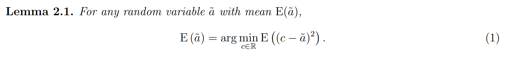
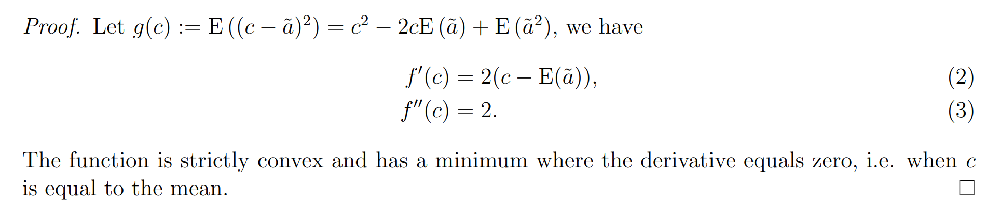
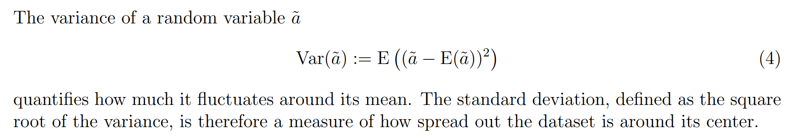
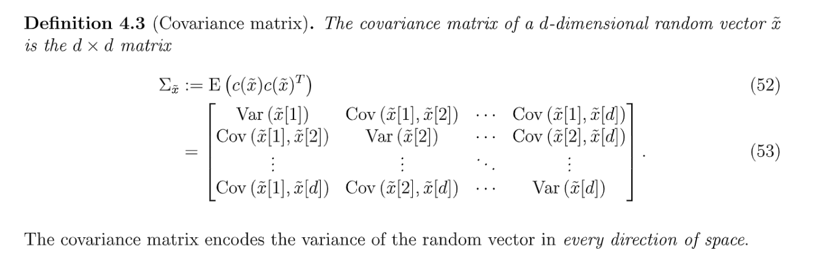
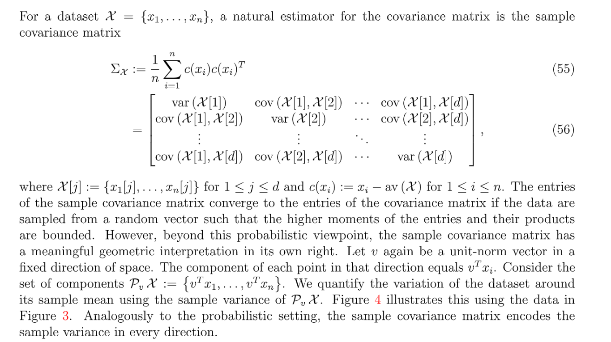
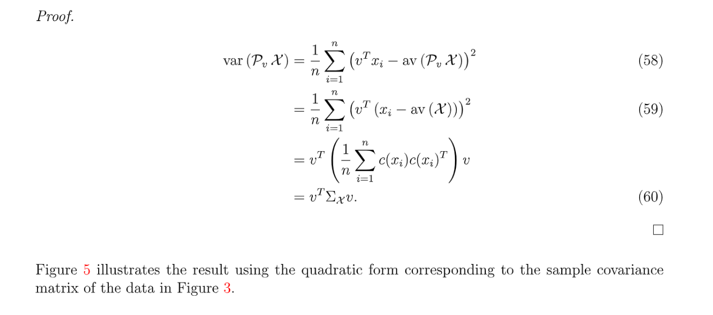
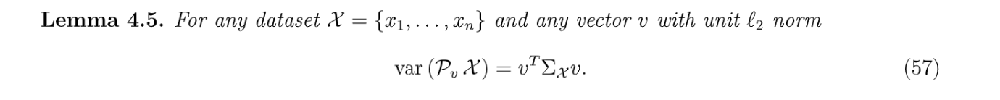
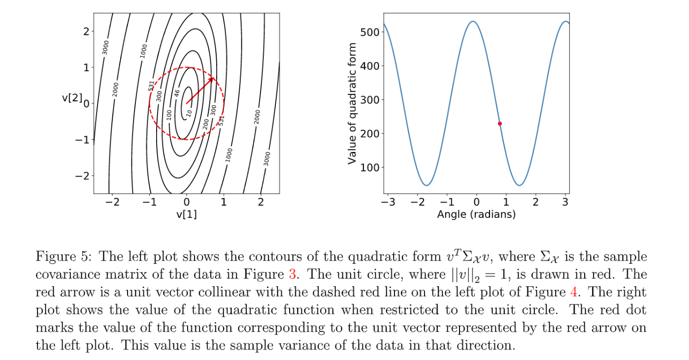
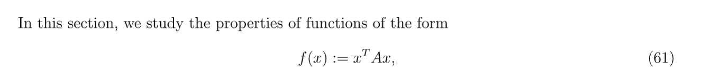
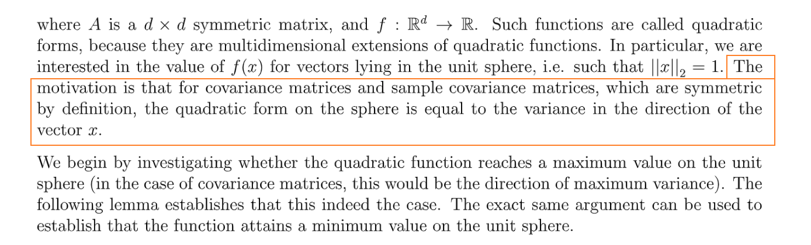

[PCA_NYU_MSDS.pdf](https://www.yuque.com/attachments/yuque/0/2022/pdf/12393765/1669518861566-3da7b8ac-b417-49fd-bd5d-bae14f8a14a2.pdf)
# 1 Mean, Variance and Correlation
## Population Mean
> 均值一方面可以解读为随机变量的值的加权平均，也可以从距离角度，定义为`The point that minimizes the expected distance to the random variable`, 写成关于$c$的函数形式如下：
> 

**Proof of the Lemma**

## Variance
> 

## Population Covariance Matrix
> 

## Sample Covariance Matrix
> 
> 这里, 而`Covariance Matrix`是针对特征来定义的，于是形状应该是的。
> 从左往右是样本，按列放置，从上到下是特征维数。

**Proof(Easy)**

## Graphical Interpretations
> 
> 其中:
> , 且
> 左图中的红色圆圈就是我们的`Constraint`可视化的结果，右图中就是我们的的变化情况，可以看到在某些方向上方差会变得特别大。

# 2 Spectrum Theorem
## Quadratic Form
> 

