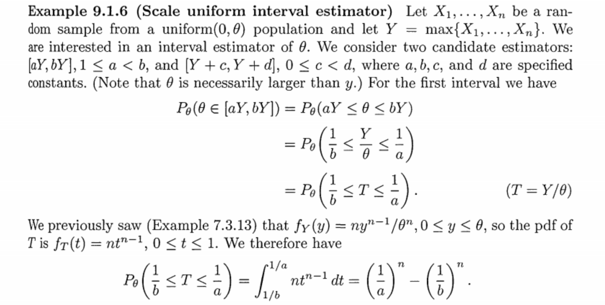

>  Statistical Inference Chapter 9

# 1 Baisc Concepts
## Interval Estimate
> 
> `Interval Estimate`可以看成是一个随机变量，而不是固定参数。所以，当我们写的时候，这个概率是对于来说的, 而不是对来说的。

## Coverage Probability
> 

## Confidence Coefficient
> 

## Confidence Interval
> 

## Example
> 

# 2 Methods of Finding Interval Estimators
## Inverting a Test Statistic
> 

**Inverting Normal Test**
**Graph**

## Acceptance Region
> 

**Proof**

## Invering an LRT
> 

**Solution**
