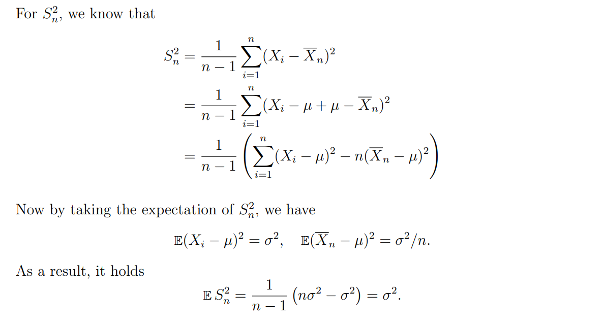
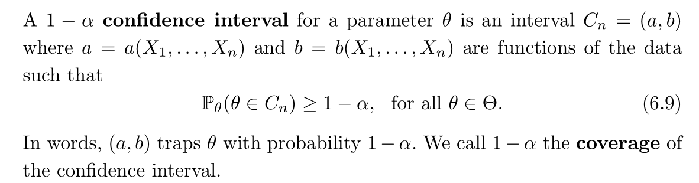
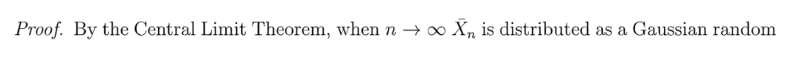
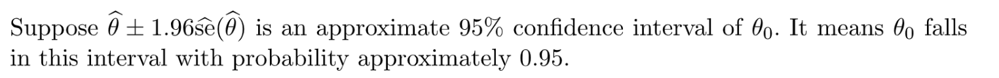

# 0 简介
## 0.1 概述
:::info
统计推断，也称为"学习"，是一个试图通过数据来推断其背后的概率分布的过程。一个概率推断的典型问题是:
给定一个样本$X_1,\cdots, X_n \sim F$, 我们怎么通过样本数据来推断$F$呢？大多数时候，我们仅仅想要知道关于$F$的部分信息，比如均值或者方差。
:::

## 0.2 有参模型和无参模型
:::info

:::
**One-dimensional Parametric Estimation**
**Two-dimensional Parametric Estimation**
**Nonparametric estimation of the CDF**
**Nonparametric density estimation**
**Nonparametric estimation of functionals**

## 0.3 Regression, prediction and classification
:::info

:::

## 0.4 频率派和贝叶斯派
:::info
在数理统计章节中，我们已经初步介绍了频率派和贝叶斯派在进行假设检验时的区别，以及贝叶斯派在参数估计方面的优势，以及频率派和贝叶斯派各自的优缺点和适用场景。本小节我们做一个复习。

:::

# 1 点估计和评判指标
> 我们假设总体有一个概率分布$F_X$并且每一个观测到的样本$x_i$都看成是一个随机变量$X_i$的实现, 且这个随机变量服从$F_X$。对于一系列样本数据$\{x_1,\cdots, x_n\}$, 他们被认为是随机变量序列$\{X_1,\cdots, X_n\}$。同时，我们做出一个重要的假设，就是$X_i$是独立同分布的$i.i.d$的。

## 1.1 基本定义
:::info

总的来说，点估计认为，我要估计的参数有一个最优的值$\hat{\theta_n}$(`A fixed value`)。
有了上述定义，几个很自然的问题便出现了：

1. $\hat{\theta_n}$估计$\theta$估计得有多好？
2. 怎么评估一个`Estimator`$\hat{\theta_n}$
:::

## 1.2 无偏性和一致性
> 
> 无偏差性曾经风靡一时，但是现在逐渐变得没有那么重要。因为很多`Estimator`都是有偏的。进一步的，有可能两个无偏估计量的方差是不同的。比如$T_1(X_1,X_2,\cdots,X_n)=X_1$和$T_2(X_1,X_2,\cdots,X_n)=\bar{X_n}$都是$\theta$的无偏估计量，但是后者显然是一个更好的估计量，因为他**考虑到了所有样本的信息**。

**样本均值和方差的无偏性和重要公式**
$\bar{X_n}$的无偏性是显然的，那么$S_n^2$（样本方差）呢？

这里可以延伸出一个**非常重要的公式**: $\sum_i (X_i-\bar{X_n})^2=\sum_{i=1}^n (X_i-a)^2-n(\bar{X_n}-a)^2,\forall a$
> 实际上，我们对于一个估计量的要求一般不仅仅是无偏那么简单，我们还希望这个估计量$\hat{\theta_n}$在我们收集到越来越多的数据之后会收敛于一个我们要估计的参数$\theta$, 这个性质由下面的定义描述：
> 
> 本质上来说，一个`Estimator`的`Consistency`就是我们的`Convergence in Probability`。
> 对于$T_2(X_1,X_2,\cdots,X_n)=\bar{X_n}$来说, 根据大数定律，它是`Consistent`的。但是$T_1(X_1, X_2,\cdots, X_n)=X_1$却不是。

**样本均值和方差的一致性 (会用到Continuous Mapping Theorem) **

## 1.3 Continuous Mapping Theorem
:::info

根据这个定理，我们就可以知道下列保收敛操作是如何推出的了:

还有：如果$X_n\stackrel{P}{\longrightarrow}X,Y_n\stackrel{P}{\longrightarrow}Y$, 则$\frac{X_n}{Y_n}\stackrel{P}{\longrightarrow}\frac{X}{Y}$
:::
**Notes**

## 1.4 MSE
### 1.4.1 Definition
> 在[QM收敛](https://www.yuque.com/alexman/kziggo/al5545#LPpJw)中我们已经介绍过了`Quadratic Convergence`的形式，现在我们在点估计的框架下重述:
> 

### 1.4.2 Bias and Variance Tradeoff
> 
> **其中**
> - $bias(\hat{\theta_n})$也称为`Estimation Error`
> - $Var(\hat{\theta_n})$也称为`Statistical Error`
> 

> - 如果我们的`bin size`设置的很大，则会导致`Small Variance and Large Bias`(一个`bin`里面有很多数据点)
> - 如果我们的`bin size`设置的很小，则会导致`Small Bias and Large Variance`
> 
**直方图一般用于无参估计概率密度函数。**

### 1.4.3 Convergence in MSE
> 
> `**Convergence in MSE**`**implies **`**Convergence in Probability**`**, which implies **`**Consistency**`**, and that the **`**bias**`** and **`**variance **`**both go to 0. **

## 1.5 Standard Error/Distribution
### 1.5.1 Definition
> 
> 我们可能会想，为什么这里不是除以$n-1$而是根据$Var$的定义除以$n$呢？
> 原因是`Standard Error`是和未知的$F$挂钩的:
> 比如我们有一些样本数据$X_1,\cdots, X_n\sim F$, $F$的均值是$\mu$, 方差是$\sigma$, 都是未知量。
> 我们试图从这些样本数据中计算出一些统计量，$\theta_n=T(F_n)$

### 1.5.2 Bias and SE Theorem
> 

**Proof**如果bias $\to$0 且se$\to$0, 那么根据MSE分解公式我们可以知道：
$MSE=bias^2+se^2\to 0$。而MSE $\to$0 意味着$E[(\hat{\theta_n}-\theta)^2]\to 0$, 这表明$\hat{\theta_n}\stackrel{qm}{\longrightarrow}\theta$, 这进一步表明$\hat{\theta_n}\stackrel{P}{\longrightarrow}\theta$，命题证明完毕。
**算例**

## 1.6 Asymptotic Unbiasedness
### 1.6.1 Definition
> Estimator $\hat{\theta_n}$ is said to asymptotically unbiased if $E(\hat{\theta_n}) − θ\to 0,as\space n\to \infty$ 。

### 1.6.2  Asymptotic Unbiasedness and Consistency
> [https://stats.stackexchange.com/questions/280684/intuitive-understanding-of-the-difference-between-consistent-and-asymptotically](https://stats.stackexchange.com/questions/280684/intuitive-understanding-of-the-difference-between-consistent-and-asymptotically)

> ### Asymptotic unbiasedness ⟸ consistency + bounded variance
> 假设我们有一个`Estimator` $\hat{\theta_n}$ 用于估计$θ$. `Asymptotic unbiasedness` 意味着`Estimator`在$n\to \infty$时候趋近于零。 换句话说，$E[\hat{\theta_n}]\to \theta, n\to \infty$。
> `Consistency`是一个更强的条件， 它要求我们的`Estimator` (不仅仅是期望，还要求本身收敛于真实参数）. 另一方面，我们知道一个`Estimator`总是有非零的方差，所以`Estimator`没有那么容易就达成`Consistency`的条件。 
> 假设`Estimator`的方差是有界的，则`consistency` 保证了`Asymptotic unbiasedness` ([proof](https://math.stackexchange.com/questions/239146/)),反之不成立。换句话说，under some mild conditions, `asymptotic unbiasedness` 是`consistency`的必要而不充分条件.
> ### Asymptotic unbiasedness + vanishing variance ⟹ consistency
> If you have an asymptotically unbiased estimator, and its variance converges to zero, this is sufficient to give weak consistency. (This follows from Markov's inequality, which ensures that convergence in mean-square implies convergence in probability). Intuitively, this reflects the fact that a vanishing variance means that the sequence of random variables is converging closer and closer to the expected value, and if the expected value converges to the true parameter (as it does under asymptotic unbiasedness) then the random variable is converging to the true parameter.
> 

## 1.7 总结
> 

# 2 Confidence Sets and Intervals
:::info
比起前面介绍的点估计，我们实际上会将点估计延伸扩展到一个区间上，这个区间包括了我们要估计的参数，这个区间被称为`Interval Estimator`
:::
## 2.0 Quantile Functions
### Z-Quantile
:::info
`Z-quantile`$Z_{\alpha}=inf\{t:\mathbb{P}(Z\leq t)\geq \alpha\}$, 这等价于$\frac{1}{\sqrt{2\pi}}\int_{0}^{z_{\alpha}}exp\{-\frac{t^2}{2}\}dt=\alpha$
性质:$z_{\alpha}=-z_{1-\alpha},\forall \alpha\in (0,1)$[Symmetry of $N(0,1)$]
:::

### Q Function
> 

**Table Interpretations**
> Since the cdf of the Gaussian does not have a closed-form solution, we will write the asymptotic confidence interval in terms of the $Q$ function, which is defined before as $Q(u) := P(U > u) ~for ~u > 0$, where $U$ is a Gaussian random variable with zero mean and unit variance. The following lemma, proved in Section E of the appendix, shows how to express probabilities concerning arbitrary Gaussian random variables using the Q
> function.
> 

**Proof **

## 2.1 Confidence Interval/Sets
### Definition
> 
> 几个注意点：
> - $a_n=a(X_1,\cdots,X_n)$和$b_n=b(X_1,\cdots,X_n)$是两个`Statistic`（也是随机变量），$C_n$是一个`**Random Interval**`。
> - $\theta$是一个固定值, 不是随机变量。
> - 我们说`The probability of` $C_n$`covering`$\theta$`is at least`$1-\alpha$
> - 一般而言，我们会使用$95\%$的`Confidence Intervals`，这对应了$\alpha=0.5$的情况。
> - 但如果$\theta$是一个向量, 我们就会启用`Confidence Sets`(比如一个**球体或者椭球体**)

### CI for Sample Mean
#### Conservative Interval
:::info
**How to find **$1-\alpha$**confidence Interval for **$\mu$

:::
**Proof**
> 

**Proof**

#### Precise Sample Interval
> 

**Proof**

#### Example
> 

### Construction of CI for Mean
#### By CLT Method
:::info
假设$\sigma$已知（实际上很多情况下都是未知的，需要使用样本方差来估计）
我们知道$\bar{X_n}$是样本均值，于是我们运用`CLT`法则：
$\frac{\sqrt{n}(\bar{X_n}-\mu)}{\sigma}\rightsquigarrow N(0,1)$, 我们想要找到$a_n=a(X_1,\cdots,X_n)$和$b_n=b(X_1,\cdots,X_n)$, 使得:
对于$\forall a,b$, $\mathbb{P}(a\leq \frac{\sqrt{n}(\bar{X_n}-\mu)}{\sigma}\leq b)\approx \mathbb{P}(a\leq Z\leq b)$
我们有`Z-quantile`$Z_{\alpha}=inf\{t:\mathbb{P}(Z\leq t)\geq \alpha\}$, 这等价于$\frac{1}{\sqrt{2\pi}}\int_{0}^{z_{\alpha}}exp\{-\frac{t^2}{2}\}dt=\alpha$
因为$z_{\alpha}=-z_{1-\alpha},\forall \alpha\in (0,1)$[Symmetry of $N(0,1)$]
所以我们可以选择$b=z_{1-\frac{\alpha}{2}}$, $a=z_{\frac{\alpha}{2}}=-z_{1-\frac{\alpha}{2}}=-b$
如果$n$很大的话，$\mathbb{P}(\frac{\sqrt{n}|(\bar{X_n}-\mu)|}{\sigma}\leq z_{1-\frac{\alpha}{2}})\approx 1-\alpha$, 这等价于：

这意味着$\bar{X_n}\pm\frac{\sigma z_{1-\frac{\alpha}{2}}}{\sqrt{n}}$有$1-\alpha$的概率包含$\mu$
**所以：**

通过`CLT`给出的`Confidence Interval`, 实际上就是最小的满足概率$1-\alpha$要求的`Confidence Interval`, 当然我们会在下面`2.1.3`中会给出证明: 为什么这个区间就是长度最小的。
:::
**Remarks**
- 当$n\to \infty$时，`Confidence Interval`的长度以$\frac{1}{\sqrt{n}}$的速度变小。
- 当我们减小$\alpha$时，$z_{1-\frac{\alpha}{2}}$会增加，最终$z_{1-\frac{\alpha}{2}}$会趋近于正无穷，这让`Converge Probability`变得困难。
- $(\bar{x_n}-\frac{\sigma z_{1-\frac{\alpha}{2}}}{\sqrt{n}},\bar{x_n}+\frac{\sigma z_{1-\frac{\alpha}{2}}}{\sqrt{n}})$是`Realization of confidence interval, it covers`$\theta$`with confidence`$1-\alpha$

**Examples**每天，报社都会公布民意选举的结果。比如，他们可能会说`83 percent of the population favor arming pilots with guns`。我们也会经常看见诸如`This poll is accurate to within 4 points 95 percent of the time`。换句话说，$83\pm 4$实际上就是`95 percent confidence interval for the true but unknown proportion p of people who favor arming pilots with guns`. 如果我们每天都创建一个类似的`Confidence Interval`, 那么$95\%$的概率我们的`Interval`会包含真正的`Parameter`。
`This is true even though you are estimating a different quantity (a different poll question) every day.`
> 

**Proof**
**Example**

#### By Hoeffding's Inequality
> 

#### Inverting a test statistics
> 我们在`Parametric Hypothesis Testing`中介绍

### Interpretations⭐⭐⭐⭐⭐
> 在解读`Confidence Interval`的时候，很多人都会犯一些含义不清的错误，要注意:
> `A confidence interval is not a probability statement about θ since θ is a fixed quantity, not a random variable.` 一些文章可能会这样解读: 如果我们重复试验足够多的次数，那么这个`interval`能够覆盖待估计参数$\theta$的频率会收敛于$95\%$。这么说固然没错，但很没有意义，因为我么实际上根本不会重复试验很多次。
> 观察下面的论述:
> 
> 这个就是典型的错误论述，因为他将$\theta_0$视作了一个随机变量来看。
> **一种更好的解读是:**
> 
> 总的来说，我们实际上是利用了$\hat{\theta_n}$的分布(中心极限定理给出)来构造了一个`Confidence Interval`。
> **Things to remember:**
> 

### Slutsky's Theorem
:::info

要注意，如果$X_n\rightsquigarrow X$, $Y_n\rightsquigarrow Y$, 不一定说明$X_n+Y_n\rightsquigarrow X+Y$
比如我们可以取$X_n\sim N(0,1), Y_n=-X_n\sim N(0,1)$作为一个这个反例。
$Z_n=\frac{\sigma}{S_n}\cdot \frac{\sqrt{n}(\bar{X_n}-\mu)}{\sigma}\stackrel{\mathcal{D}}{\longrightarrow}N(0,1)$

:::
**Proof**

### Properties
> When constructing a $1-\alpha$ confidence interval, we often use the following choice of $1-\alpha$ confidence interval for $\mu$:
>  $\left( \overline{X}_n + z_{\alpha/2} \frac{S_n}{\sqrt{n}}, \overline{X}_n + z_{1-\alpha/2} \frac{S_n}{\sqrt{n}}\right)$, since$\frac{\sqrt{n}(\overline{X}_n - \mu)}{S_n} \overset{d}{\longrightarrow}\mathcal{N}(0,1).$  
> We can show that $a = z_{\alpha/2}$ and $b = z_{1-\alpha/2}$ minimizes$\min_{a,b}~b-a$subject to
> $\frac{1}{\sqrt{2\pi}}\int_{a}^{b} e^{-t^2/2}d t = 1 - \alpha$ for $0 <\alpha<1.$ 
> In other words, $\left( \overline{X}_n + z_{\alpha/2} \frac{S_n}{\sqrt{n}}, \overline{X}_n + z_{1-\alpha/2} \frac{S_n}{\sqrt{n}}\right)$ is the confidence interval with the smallest width and $1-\alpha$ coverage. 

**Proof Using Symmetric Property of Guassian Distribution Function**We know from from the standard normal distribution function that  is symmetric with respect to  axis. We also know from the distribution function that if ,  holds, so we can actually prove that for any  and (or symmetrically for any  and ), .
Also we know from the property of proper integral that:

Then suppose we start the pair  from , moving rightwards together while keep the constraint  holds. Since  is decreasing over   and thus increasing over  by symmetry, if , , , which means $a$ has to move further to the right, which leads to . 
Thus we are safe to conclude that .
**Proof Using Optimization**The first part of the proof focuses on the relationship between  and , by using Lagrange Multiplier Optimization.
We let  and constraint function , then when  hits the local minimum, we have the following conditions:

However, we know that  and , so if $a=b$, then , which contradicts. Therefore, .
The second part of the proof focuses on why  and , we know that:
 is symmetric with  axis and that , , so :

Thus , combined with the fact that , we have  and 

## 2.2 Probability Statement
> 假设$\theta$是一个固定值，也是我们要估计的参数，假设$X_1,X_2$是独立的随机变量使得$\mathbb{P}(X_i=1)=\mathbb{P}(X_i=-1)=\frac{1}{2}$（`Symmetric Bermoulli R.V.`）。现在我们定义$Y_i=X_i+\theta$并且假设我们只观测到了$Y_1,Y_2$这两个数据。我们可以如下定义我们的`Confidence Interval`:
> $C=\begin{cases}\{Y_1-1\}&if\space Y_1=Y_2\\\{\frac{Y_1+Y_2}{2}\}&if\space Y_1\neq Y_2 \end{cases}$
> 我们可以验证，无论我们要估计的参数是什么，我们总有: $\mathbb{P}(\theta\in C)=\frac{3}{4}$，验证步骤如下:
> 首先我们知道$Y_i=\begin{cases} \theta-1& with\space probability\space \frac{1}{2}\\\theta+1&with\space probability\space \frac{1}{2} \end{cases}$, 且因为$X_1$和$X_2$互相独立，于是$Y_1$和$Y_2$也互相独立, 于是我们可以简单地使用全概率公式, 得到:
> $\begin{aligned}\mathbb{P}(\theta\in C)&=\mathbb{P}(\theta\in C|Y_1=Y_2=\theta-1)\mathbb{P}(Y_1=Y_2=\theta-1)\\&+\mathbb{P}(\theta\in C|Y_1=Y_2=\theta+1)\mathbb{P}(Y_1=Y_2=\theta+1)\\&+\mathbb{P}(\theta\in C|Y_1\neq Y_2)\mathbb{P}(Y_1\neq Y_2)\\&= \mathbb{P}(\theta\in C|C=\{\theta-2\})\cdot \frac{1}{4}+\mathbb{P}(\theta\in C|C=\{\theta\})\cdot \frac{1}{4}+\mathbb{P}(\theta\in C|C=\{\theta\})\cdot \frac{1}{2}\\&=0+\frac{1}{4}+\frac{1}{2}\\&=\frac{3}{4}\end{aligned}$
> 于是我们得到结论， $C$是一个$75\%$`Confidence Interval`
> 现在假设我们有$y_1=15,y_2=17$作为`realization of data point`, 则我们的$75\%$`confidence interval`就是$\{16\}$。
> `If you wanted to make a probability statement about θ you would probably say that`$P(θ ∈ C|Y_1,Y_2) = 1$. `There is nothing wrong with saying that` $\{16\}$` is a` $75\%$`confidence interval. But is it not a probability statement about`$θ$. 

## Example 2 - Noisy Channel
> [!example]
> 

> [!solution]
> 

