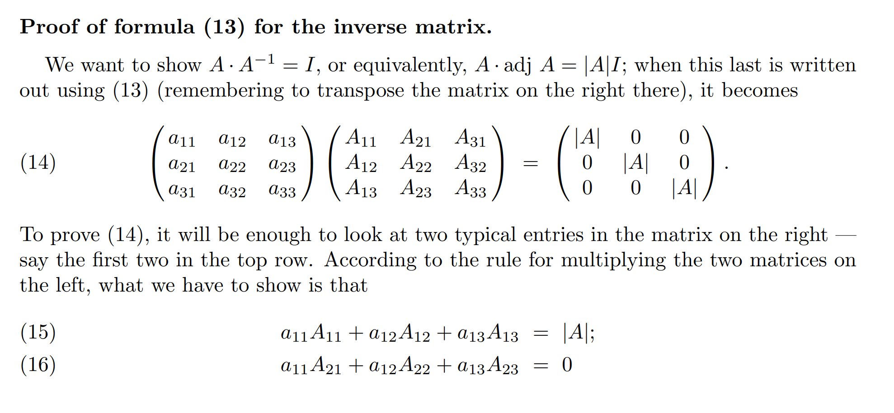
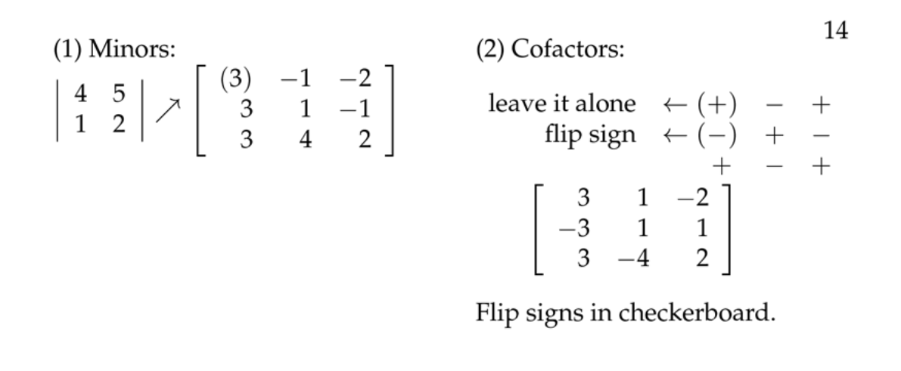
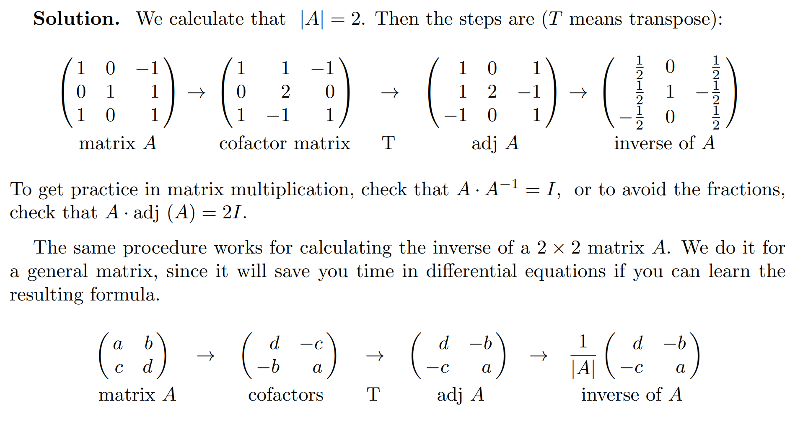

# 1 矩阵乘法
## 矩阵乘法的意义⭐⭐⭐
[Meaning of Matrix Multiplication.pdf](https://www.yuque.com/attachments/yuque/0/2022/pdf/12393765/1658720895189-c0fe16e0-41ef-4fba-9738-82b17e29fa71.pdf)
> 
> 是线性代数中的矩阵变换的含义

## 矩阵是一种线性变换
> 

## 
## 
## Identity Matrix 和旋转矩阵
> 
> **单位矩阵**$I$**，不做任何转换, 相当于输入即输出**
> 
> $R=\begin{bmatrix} 0 & -1 \\ 1 & 0 \end{bmatrix}$将坐标轴的单位向量旋转`90`度
> $R^2=\begin{bmatrix} -1 & 0 \\ 0 & -1 \end{bmatrix}$将坐标轴的单位向量旋转`180`度，也就是两次旋转`90`度

# 
## Problems
### P1: 正交矩阵不改变向量长度⭐⭐⭐
> 

Key

# 2 线性方程组⭐⭐⭐
[Solving Square Systems.pdf](https://www.yuque.com/attachments/yuque/0/2022/pdf/12393765/1658721843135-59274f37-985a-4ceb-9d0b-37be1a94847e.pdf)
## Square System
### 定义
> 
> 

### 怎么求解Square System
> 
> 我们要找到使得$MA=I$的$M$, $M$就是$A$的逆矩阵
> 
> 如果$A$的逆矩阵存在的话，我们的`Solutions to Square System`就可以写成$x=Mb$的形式，唯一解
> 也就是说对于线性方程组$Ax=b$来说，如果使得$MA=I$的逆矩阵$M$存在的话，则，$Ax=b$有唯一解$x=A^{-1}b$

### 例子⭐⭐
> 
> 这个例子说的是，如果我们的$x=Ay$系统中$A$可逆，则$y$可以唯一的表示成关于$x$ 的方程组, 也就是$y=A^{-1}x$

## Inverse  Matrix
### Recap
> 上面给定了$A$的逆矩阵$M$存在情况下的一些重要性质:
> - $Ax=b$有唯一解
> - $x=Ay$中$y$可以唯一地表示为$x$的线性方程组
> 
下面我们探究如何找到$M$, 也就是$A$的逆矩阵（**在**`**18.06SC**`**中有详细方法，用高斯消元即可得到**）
> 

### 怎么判断A有没有逆矩阵
> 

### 

### 逆矩阵的定义
> 

### Adj matrix求逆矩阵⭐⭐
> 
> 
> 性质$(16)$记一下，使用`Laplace`展开验证一下即可: 和展开第$i$行的代数余子式不一致的行系数，导致的结果都是`0`, **比如第一行的系数和按照第二或者第三行展开的代数余子式做一个线性组合得到的结果都是**`**0**`
> 

#### 
#### 简化步骤
> 
> 
> 

### 实例
#### 实例1: 找到矩阵的逆
> 

Key

#### 实例2: 找到矩阵的逆
> 

Key

#### 实例3 ⭐⭐
使用Adj 找到矩阵的逆
> 

Key
> 

Key

## Problems
### P1: 找到矩阵的逆
> 

Key

### P2: 找到矩阵的逆
> 

Key

# 3 平面方程进阶⭐⭐
## Reading Notes
[Equations of Plane.pdf](https://www.yuque.com/attachments/yuque/0/2022/pdf/12393765/1658547412932-9444d1d2-1bca-4f9b-8865-bf1ee53a8e1a.pdf)
### Definition of a Plane
> 

### How to Get the Equation ⭐⭐⭐
:::success

**获得一个平面的方程，我们只需要:**

1. 平面内的一个固定点$P_0=(x_0,y_0,z_0)$(这个平面将过这个点)
2. 这个平面的法向量$\vec{N}$, 用于确定这个平面的倾斜程度(**可以通过平面内的两个向量的叉乘获得**)
3. 平面内任意一点$P=(x,y,z)$, 作为自变量
4. 书写表达式$\vec{P_0 P} \cdot \vec{N}=0$即可
5. **含义就是，所有满足和**$\bf \hat{N}$**垂直的且和**$\vec{P_0P}$**同方向的店的集合，就是上面的向量点积表达式（不要死记硬背）**
:::

### Lines in the Plane
:::success
**两种直线方程的表达**: **斜截式**和**点法向式**

:::

### Examples
#### Example 1: 给定一个点和法向量
:::success

:::

#### Example 2: 给定三个点
:::success

:::

#### Example 3: 给定一个点和法向量
:::success

:::

#### Example 4: 给定三个点
:::success

:::

## Problems
### P1: Equations of the Plane
:::success

:::

### P2: Equation of the Plane
:::success

随便找一个法向量就行
:::

# 4 线性系统和平面⭐⭐
[Linear Systems and Planes.pdf](https://www.yuque.com/attachments/yuque/0/2022/pdf/12393765/1658727910305-7a3cbb86-9bef-4cc4-8aca-4eb343c0eff4.pdf)
## Lecture Notes
> 
> 

## 3 x 3 线性系统
> 
> **本质就是将线性方程组中的每一行抽象成一个平面的表达式，将方程组的解抽象成这个线性方程组的解**
> **系数就相当于法向量，决定了平面的方向**

## Problems
### P1: 画出线性系统
> 

Key

# 5 (In)homogeneous Systems⭐⭐⭐
[Matrix and Equation.pdf](https://www.yuque.com/attachments/yuque/0/2022/pdf/12393765/1658712658978-71d392d9-8ace-4a1e-8ebc-454da1bf3636.pdf)

## Lecture Notes
> 
> 
> 
> 

## 定义
> 

## 定理及证明⭐⭐
### Theorem 1
> 
> 

### Theorem 2
> 
> 
> 
> 
> 
> **这个**$(22)$**的证明非常有意思，将**$|A|$**和平行六面体的体积结合，得到**$\bf a,b,c$**在同一平面内的结论，进而得出有无数解的结论**
> 
> 也就是说如果$d_3=rd_1+sd_2$, 因为我们有$\bf c\cdot x=r(a\cdot x)+s (b\cdot x)$，所以系数对应之后我们有
> $\bf a\cdot x=d_1, b \cdot x=d_2, c \cdot x=d_3$同时成立，于是$Ax=d$有解
> **换句话说，只有当**$d$**在矩阵**$\begin{bmatrix} -a-\\-b-\\-c-\end{bmatrix}$**的列空间内才会有解, 这在**`**18.06SC**`**中会有详细介绍，这里只是采用了一种比较新颖的几何视角来解释线性方程组的解的性质。**

## 奇异与非奇异⭐⭐
> 
> 
> 这里说的是，因为我们在求$A^{-1}$的时候使用$\frac{adj\space A}{|A|}$公式，所以当$|A|\approx 0$的时候$A^{-1}$的值就会很明显地受到$A$中的系数的影响

## Problems
### P1: 解线性方程组
> 

Key
这里算叉乘就运用了方程组的几何意义，也就是三个平面的法向量，通过判断三个向量张成的平行六面体的体积判断可知，三个向量在同一平面内，又因为是`Homogeneous Equations`, 所以我们只要求所有的和这个平面垂直的向量即可。

