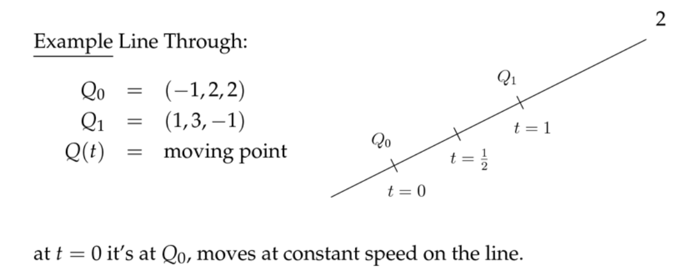
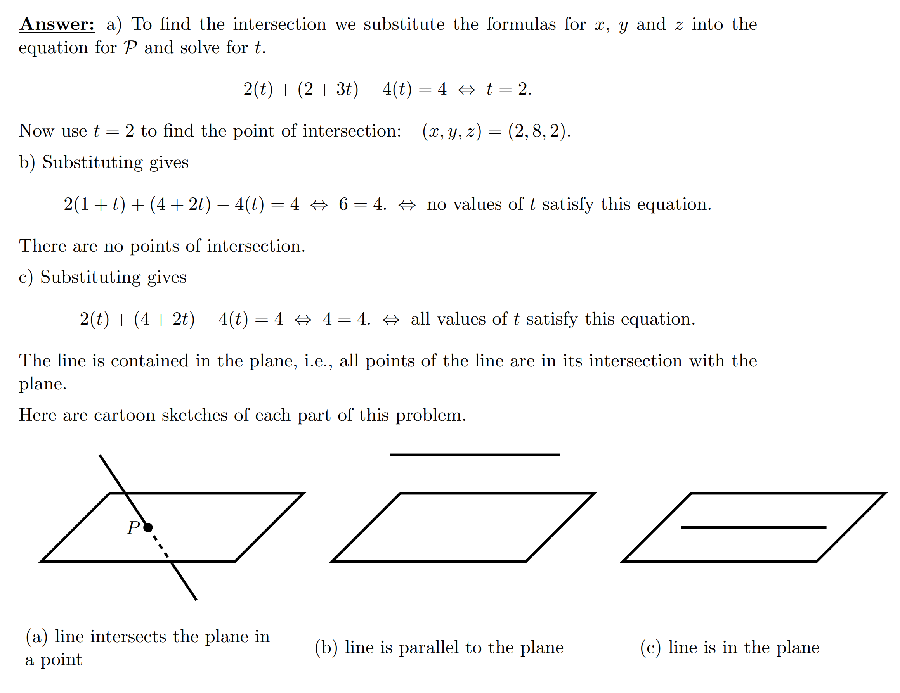
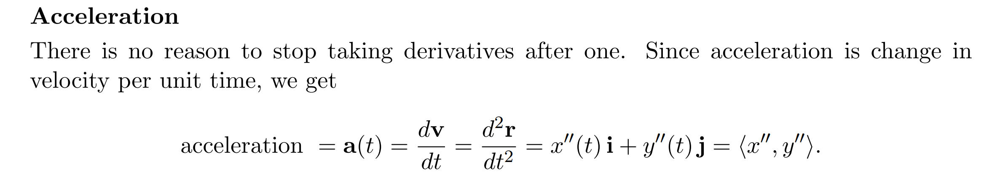
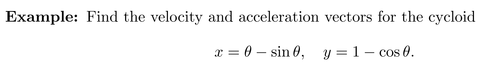
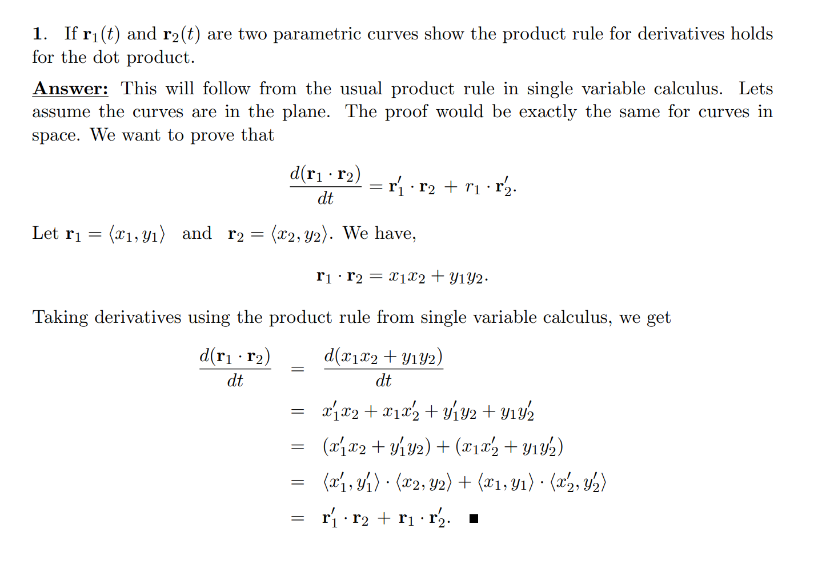
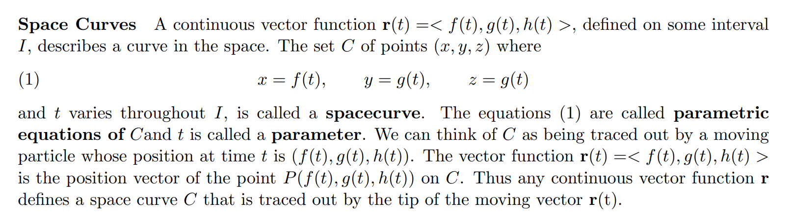
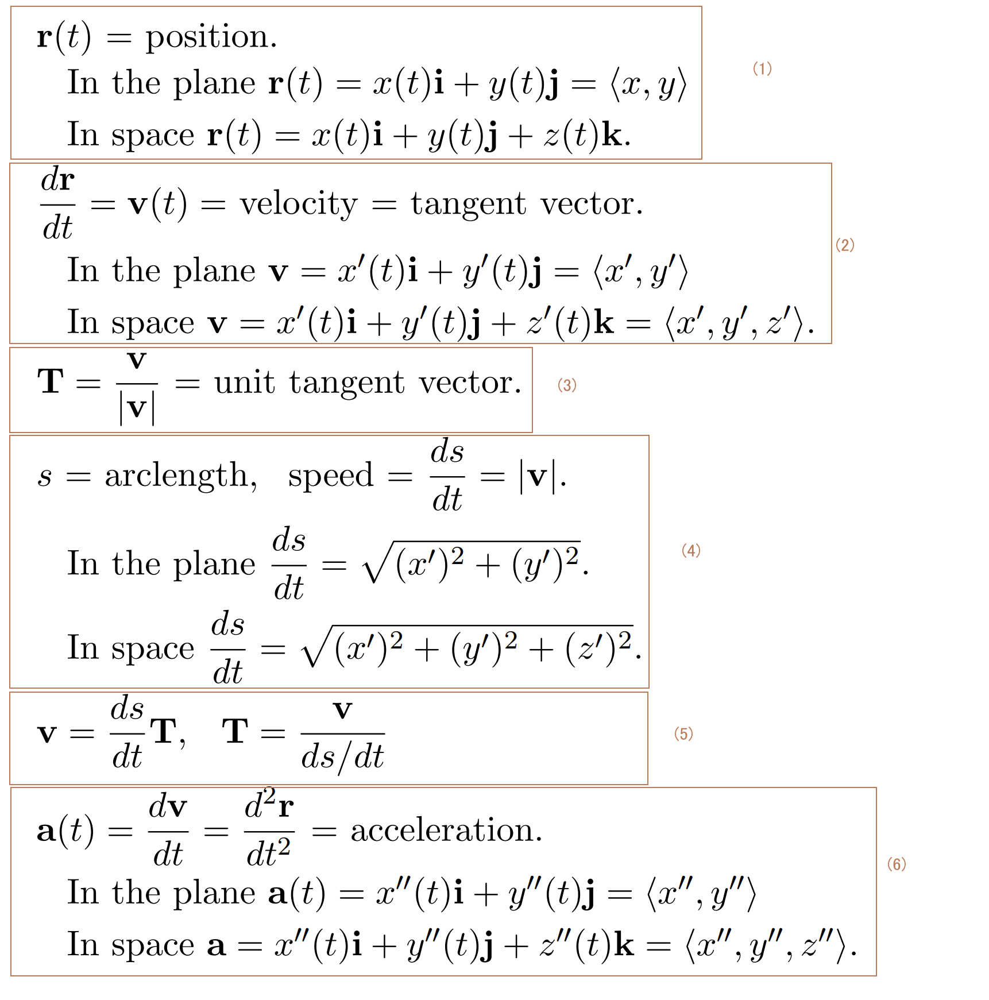
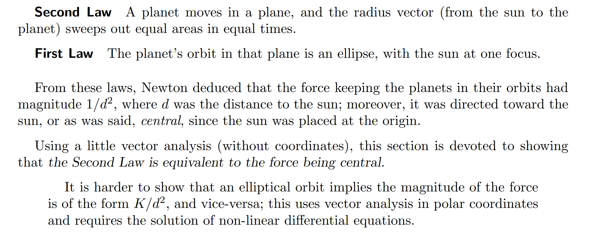
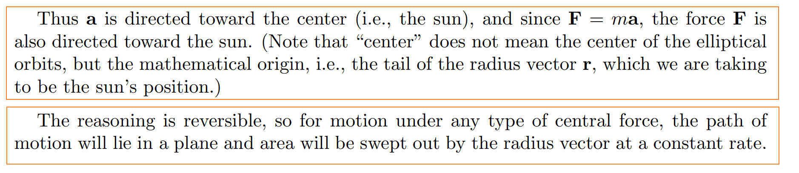

# 1 直线的参数方程
[Parametric Equations of Lines.pdf](https://www.yuque.com/attachments/yuque/0/2022/pdf/12393765/1658568593901-b848e283-269c-41b5-b13d-f44701333474.pdf)
## 参数方程概述
> `**Parametric Equations**`**描述了一个点在空间中运动留下的轨迹(**`**Trajectory of a moving point**`**)**
> - 对于三维空间中的运动，我们需要考虑四个变量，三个变量用于描述点的三维空间坐标$(x,y,z)$, 一个变量用于描述运动的某一时刻$t$
> - 如果点在一个平面内运动，则只需要两个变量$(x,y)$描述坐标，一个变量$t$用于描述时间
> - $x(t),y(t),y(t)$**表示这个点在空间中某一时刻的坐标**
> - **我们称**$t$**是参数，**$<x(t),y(t),z(t)>$**的系统成为**`**Parametric Equation**`
> 

> 
> 
> **但是究其根本，**$t$**在参数方程中不具有任何的物理意义，而只是作为一个参数存在，描述的是空间中的某个轨迹的表达式而已**

## 直线的参数方程[⭐⭐⭐](https://www.yuque.com/alexman/dydxis/wqkeen#rAKQ9)
> 描述一个直线，我们**需要一个点和一个方向向量**，方向指向点直线的某个方向
> 

### 示例1: 求直线的参数方程(一点和方向)
> 

### 示例2: 直线参数方程的泛化表示
> 

### 示例3: 求直线参数方程(给定两点)
> 

## Problems
### P1
> 

### P2
> 

Key

# 2 直线和平面的交点
## 直线与平面交点概述
[Intersection of a Line and a Plane.pdf](https://www.yuque.com/attachments/yuque/0/2022/pdf/12393765/1658622550885-d47ccd2b-5346-46cc-8ff6-2658146a64c2.pdf)
## 一个例子说明求解步骤
:::info

:::
> 本质就是将直线的参数方程代入平面中
> - 如果$t$无解， 则直线与平面无交点
> - 如果$t$有解，那一定是只有一个解，则直线和平面有一个交点
> - 如果$t$有无数解，那说明直线在平面内
> 

> 

## 点和平面的空间关系
> 
> 

## Problems
### P1: 综合题
> 

Keys

# 3 通用参数方程[⭐⭐⭐](https://www.yuque.com/alexman/dydxis/wqkeen#rAKQ9)
> 正如参数方程的定义，通用参数方程描述了一个点在空间中运动的轨迹

[General Parametic Equations, The Cycloid.pdf](https://www.yuque.com/attachments/yuque/0/2022/pdf/12393765/1658623084899-411f48b4-6b82-4ffc-828d-15ef197ec0fe.pdf)
> 

## Cycloid(圆桶)[⭐⭐⭐](https://www.yuque.com/alexman/dydxis/wqkeen#rAKQ9)
### Definition
> 
> 
> 

### 参数方程
> 本质可以看成是$PC$这根半径旋转了$\theta$之后的时刻的状态，我们对这个状态进行参数化分析
> 
> **关于**$(a\theta,a)$**中的**$a\theta$**的解释:**
> 就是点$P$最开始在原点$O$, 然后旋转了$\theta$角度之后，$P$点实际上运动(滚动)了$a\theta$弧长, 但是这段弧长和$x$轴的$0C_x$的长度一致，所以$C_x=a\theta$
> 
> 
> 

### Cusp on cycloid[⭐⭐⭐](https://www.yuque.com/alexman/dydxis/wqkeen#rAKQ9)
[Cusp on cycloid.pdf](https://www.yuque.com/attachments/yuque/0/2022/pdf/12393765/1658626364573-e99dde26-5699-4f2b-aa5f-69f3ffd82d30.pdf)
> 
> 
> 

Taylor ExpansionTake $a=1$, then the parametric equations for the cycloid is $<\theta-sin(\theta),1-cos(\theta)>$
Make Approximations: $sin(\theta)=\theta, cos(\theta)=1, \theta \to 0$, but this is not good in terms of the precision.
**We use Taylor Expansion for Approximation: **
$sin(\theta) \approx \theta-\frac{\theta^3}{6}$, $cos(\theta)=1-\frac{\theta^2}{2}$, for $\theta$close to zero
Then, $x(\theta)\approx \theta-(\theta-\frac{\theta^3}{6})\approx \frac{\theta^3}{6}$, $y(\theta)\approx 1-(1-\frac{\theta^2}{2})=\frac{\theta^2}{2}$
So, $\frac{y(\theta)}{x(\theta)}\approx \frac{3}{\theta}\to \infty,\theta\to 0^+$
So, the slope at the origin is $\infty$(right side of zero)
Left side slope is $-\infty$
所以在距离$origin$很近的地方，$P$实际上是在垂直运动的, 我们用`Mathlet`验证这一点

L'Hospital's Rule

## Circles
> 

## Ellipses 
> 

## Lines
> 

## Example**⭐⭐⭐**
> 

Keys
注意$3\space rev./sec=6\pi\space radians/sec$
 

# 4 速度和加速度
[Velocity and Acceleration.pdf](https://www.yuque.com/attachments/yuque/0/2022/pdf/12393765/1658627728239-57cf531d-1b18-4b24-8e48-d883e8bf7206.pdf)

## 4.1 Position Vector
> 
> 其实就是坐标, $(x(t),y(t))$,原点是$(0,0)$
> $x(t)$就是一个点在$x$轴上的位置随时间变化的函数， 求导之后就是$x$轴方向的运动速度
> $y(t)$就是一个点在$y$轴上的位置随时间变化的函数， 求导之后就是$y$轴方向的运动速度

## 4.2 关于r(t)的理解[⭐⭐⭐](https://www.yuque.com/alexman/dydxis/wqkeen#rAKQ9)
> $\bf{r}(t)$本身作为一个向量的存在, 表示的是空间中的某个运动的点在$t$时刻的坐标位置
> 起始点视$t=0$时候的空间坐标决定，比如一条过$P_0=<1,2,3>$,方向为$\vec{\bf{v}}=<3,5,7>$的直线的参数方程是: $\bf{r}(t)=<1+3t,2+5t,3+7t>$, 在$t=0$时就是在$P_0$处，所以$t=0$时刻的坐标含义完全是我们自己定义的
> 而关于$\bf{r}(t)$向量的意义，可以理解为$\bf\vec{OP}$的表达式, $O=(x_0,y_0,z_0)$, $P=<{x(t),y(t),z(t)}>$，也可以写成$\bf {r(t)}=x(t)\bf{i}+y(t)\bf{j}+z(t)\bf{k}$的`**Position Vector**`的形式, $t=0$时, $x(0)=x_0,y(0)=y_0,z(0)=z_0$, 常见的$O$就是原点， 也就是说$t=0$时刻的坐标含义完全是我们自己定义的
> **或者简单理解就是空间坐标, **$\vec{r}(0)$**的位置表示物体运动的起始位置，**$\vec{r}(t)$**表示物体从起始位置开始运动了**$t$**时间的空间位置**

## 4.3 速度
### 推导
> 
> **记住，速度是有方向的，所以是对向量求导，得到一个向量**
> **速度=**$\frac{位移}{时间}$**, 注意是位移（不是沿着曲线走的路程(Arc Length)）**

### 
### Unit Speed[⭐⭐⭐](https://www.yuque.com/alexman/dydxis/wqkeen#rAKQ9)
> **就是指一秒转动一个**`**radian**`
> - 体现在参数方程中的就是$cos(t),sin(t)$
> 
**如果说是一秒三转，说的就是我一秒转动了**$6\pi$
> - 体现在参数方程中的就是$cos(6\pi t),sin(6\pi t)$

### Cycloid Example
> `**Velocity**`**指的是速度，有方向有大小**
> 
> 
> `**Speed**`**指的是速率，有大小，无方向**
> 
> **加速度是速度的导数，有大小有方向**
> 
> **对于向量**$\vec{r}$**, 我们对它的导数不等于速度的大小, 也就是速率**

### 切向量
#### 直观描述
> 

#### 严格定义
> 

#### Examples
> 
> 

## 4.4 加速度
> 

## 4.5 速度与加速度示例[⭐⭐⭐](https://www.yuque.com/alexman/dydxis/wqkeen#rAKQ9)
### E1
> 

Keys

### E2
> 

Keys
这个应该求的是角速度和角速率

### E3[⭐⭐⭐](https://www.yuque.com/alexman/dydxis/wqkeen#rAKQ9)
> 

Keys
一秒三转就是说一秒转了$3\times2\pi$, 表达式就是$cos(6\pi t)$

## Vector Derivatives⭐⭐⭐
### 向量点乘求导
> 

### 向量叉乘求导
> 

Key
## 
## More Theorems
> 

## Problems[⭐⭐](https://www.yuque.com/alexman/dydxis/wqkeen#rAKQ9)
> 

**a)**从题目中我们知道$|\vec{r}(t)|$是一个常数，所以$\vec{r}(t)\cdot \vec{r}(t)=|\vec{r}(t)|^2=C$, $C$是常数
我们对$\vec{r}(t)\cdot \vec{r}(t)$关于$t$求导数:
$\frac{d}{dt}(\bf{r}\cdot\bf{r})=\bf{r'}\cdot r+r\cdot \bf{r'}=2r\cdot r'=2r\cdot v=0,so\space \vec{r}\cdot \vec{v}=0$
**b)****如果我们要证明一个结果是常数，我们可以对其求导，证明这个导数是**`**0**`**即可**
**我们可以证明: **$\frac{d}{dt}(\bf{r}\times\bf{v})=0$
证明如下:
根据题目条件我们有$\bf{r}\times\bf{a}=0$,(因为同方向的向量叉乘结果是$0$)
使用向量叉乘求导公式,我们有: $\frac{d}{dt}(\bf{r}\times\bf{v})=\bf{r'}\times \bf{v}+\bf{r}\times \bf{v'}=\bf{v}\times \bf{v}+\bf{r}\times \bf{a}=0+0=0$
证明完毕
**c)**这样的$\bf{r}$有很多，其中一个就是$\bf{r}=<cos(t),sin(t),0>$

## 

# 5 向量函数和空间曲线
## 5.1 向量函数
### 5.1.1 向量函数的定义
> 
> 就是一个$R\to R^d$的映射， **描述的是质点在空间中某一时刻的坐标位置**
> 

### 5.1.2 向量函数的极限
> 
> 

### 5.1.3 向量函数的连续性
> 

### 5.1.4 向量函数的积分
> 
> 

## 5.2 空间曲线
> 

# 6 速率和空间曲线长度
[Vector and Arc Length.pdf](https://www.yuque.com/attachments/yuque/0/2022/pdf/12393765/1658631446421-c7b9ef1a-ad50-4a74-b28c-1b22f8123159.pdf)
## 6.1 速率和空间曲线长度
### 6.1.1 单位切向量[⭐⭐](https://www.yuque.com/alexman/dydxis/wqkeen#rAKQ9)[⭐](https://www.yuque.com/alexman/dydxis/wqkeen#rAKQ9)
> 

### 6.1.2 速率
> 
> 也可以用$\frac{ds}{dt}$来表示速率
> 
> **注意，速率是一个常量, 没有方向，所以对**$\vec{r}$**求导之后要取长度**

### 6.1.3 曲线长度(Arc Length)
#### 定义
> 
> **相当于我们说的路程(和**`**位移**`**区分开)**
> 
> 因为我们要求的是一个标量(曲线长度)，所以我们不能对一个向量函数积分，比如，我们不能对$r'(t)$积分(正如我们在`5.1.4`中看到的那样)
> 我们必须对速率进行积分，也就是对$|\bf{r}'(t)|=|\bf{v}|$进行积分
> 具体请看下面的例子

### 6.1.4 Examples[⭐⭐](https://www.yuque.com/alexman/dydxis/wqkeen#rAKQ9)[⭐](https://www.yuque.com/alexman/dydxis/wqkeen#rAKQ9)
#### E1: 求速度(积分换元)
> 

Key**三角函数积分换元表详见第**`**7**`**小节**

#### E2:  综合(Wren's Theorem)
> 

Keys

### 6.1.5 速度与速率的辨析[⭐⭐](https://www.yuque.com/alexman/dydxis/wqkeen#rAKQ9)[⭐](https://www.yuque.com/alexman/dydxis/wqkeen#rAKQ9)
> 在下面的例子中，我们将看到速度和速率之间的联系: $\bf \vec{v}=\hat{T}|\vec{v}|$, $\bf \hat{T}=\frac{d\vec{r}}{ds},|\vec{v}|=\frac{ds}{dt}$

> 
> 
> 
> 
> 
> $\bf \vec{\Delta r}\approx \hat{T}\cdot \Delta 
 s$说的是在很短时间内($\bf \Delta t\to 0$)，位移大小等于路程。
> 

## 6.2 平均速度/平均速率[⭐⭐](https://www.yuque.com/alexman/dydxis/wqkeen#rAKQ9)[⭐](https://www.yuque.com/alexman/dydxis/wqkeen#rAKQ9)
> **平均速度=一段时间内的总位移/时间**
> **平均速率=一段时间内的总路程/时间**
> 

## 6.3 Notations Collections[⭐⭐](https://www.yuque.com/alexman/dydxis/wqkeen#rAKQ9)[⭐](https://www.yuque.com/alexman/dydxis/wqkeen#rAKQ9)
> 

## 6.4 Arc Length Function
### 由来
> 前面我们介绍了曲线的长度如何去求：本质上就是速率对时间的积分大小，相当于我们物理学中的路程的概念
> **之前定义曲线方程的时候，我们会使用参数**$t$**,**$\theta$**来描述一个点在空间中的位置**
> - 比如如果我们使用参数$t$,我们就在说: 在$t$时刻，三维坐标系中一个质点在沿着曲线$C$运动了$t$时间后空间中的位置是$(x(t),y(t),z(t))$
> - 比如我们使用参数$\theta$, 我们就说: 当质点沿着曲线$C$绕着某根轴旋转了$\theta$(`radians`)之后, 质点在空间中的位置是$(x(\theta),y(\theta),z(\theta))$
> - 
> 
**现在我们考虑使用一个新的参数**$s$**(表示质点运动的距离, 起始点由用户自定义): 质点在沿着曲线**$C$**运动了**$s$**的距离后，质点在空间中的位置是**$(x(s),y(s),z(s))$
> 

### 定义
> 
> 

### 例子: 重新参数化
> 
> **重新参数化的步骤:**
> - 首先，我们有在参数$t$条件下的曲线参数方程$\bf r(t)=cos(t){i}+sin(t)j+tk$
> - 然后我们求在$t$时刻质点运动的总路程，使用积分$S=\int_{0}^{t}|r'(u)|du=t\sqrt{2}$, 换句话说，我们要求$S$和$t$之间的关系，才能进行后续转换
> - 然后就是用$S$去表示$t$, 带入原来的参数方程即可，没什么难的

 

## 6.5 Problems
### P1: 综合
> 

Keys

### P2: 综合
> 

Keys

# 7 曲率, 法向平面, 密切圆, 密切面
[Arc Length Functions.pdf](https://www.yuque.com/attachments/yuque/0/2022/pdf/12393765/1658659612555-42ba9fa6-36d0-42fc-9a31-c60a0af41f2d.pdf)
## 曲率
### 定义
> 
> 

### 推论
#### 推论一
> 

#### 推论二
> 

## 法向平面

# 8 开普勒第二定律
[Kepler's Second Law.pdf](https://www.yuque.com/attachments/yuque/0/2022/pdf/12393765/1658659639954-c8aebb33-394c-4d2b-b91c-9727019fe919.pdf)
## 两大定律
> 
> **第一定律: 行星绕着太阳公转的轨道是椭圆的**
> **第二定律: 行星在轨道上运动相同时间扫过的面积相同**
> 

## 向量乘积的导数回顾
> 

## 开普勒第二定律和向心力
> 
> 

> 
> 
> 

## Problem
> 

Key

# 9 三角函数总结表
## 积分替换
[trig_subst.pdf](https://www.yuque.com/attachments/yuque/0/2022/pdf/12393765/1658652962722-3113e54e-f5bd-4018-9d1b-799966008023.pdf)

## 三角函数常用结论
[Trigonometric Table.pdf](https://www.yuque.com/attachments/yuque/0/2022/pdf/12393765/1658653303106-a88ad30e-4a71-4946-9aeb-58431f6c25b9.pdf)

# 10 MathLet

