# 1 多元函数: 图像
## Lecture Notes

## Reading Notes
### Graphing Multivariable Functions
[Graph Multivariable Functions.pdf](https://www.yuque.com/attachments/yuque/0/2022/pdf/12393765/1658543764333-420d131e-7e36-43a4-9e09-6651b90ed610.pdf)

#### 自变量与因变量
> 

#### 图像
> 

#### 示例
> 
> 

### Gallery of Quadratic Surfaces

Mathlet

## Problems
### P1: Saddle Plot
> 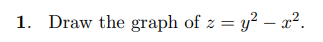

Key

# 2 等高线
## Lecture Notes

## Reading Notes
[Level Curves.pdf](https://www.yuque.com/attachments/yuque/0/2022/pdf/12393765/1658545568091-362fee38-801b-4d6b-a763-2db46f8873ae.pdf)

### Level Curves and Contour Lines
> 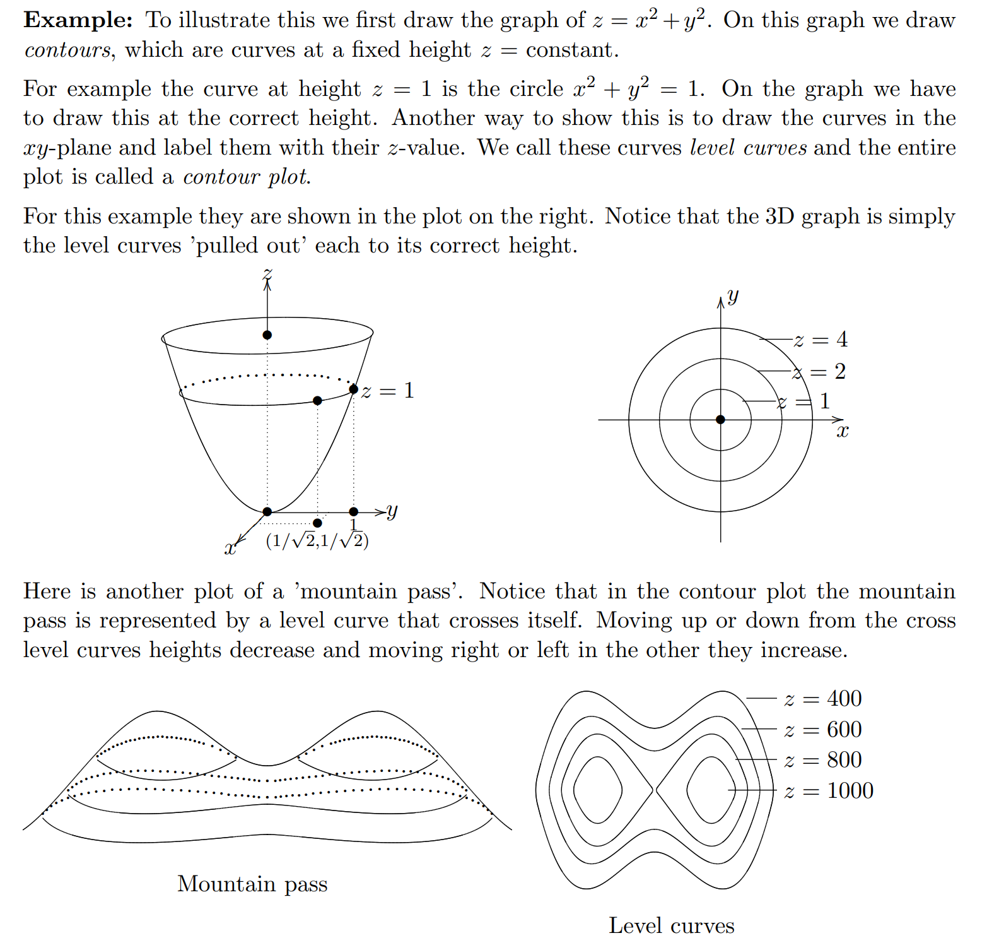
> 如果我们不对`Contour Plots`进行标注的话，我们有多种可能性构建`Mountain Pass`
> 

## Problems
### P1: Draw the Level Curves

Key

# 3 偏导数
## Lecture Notes

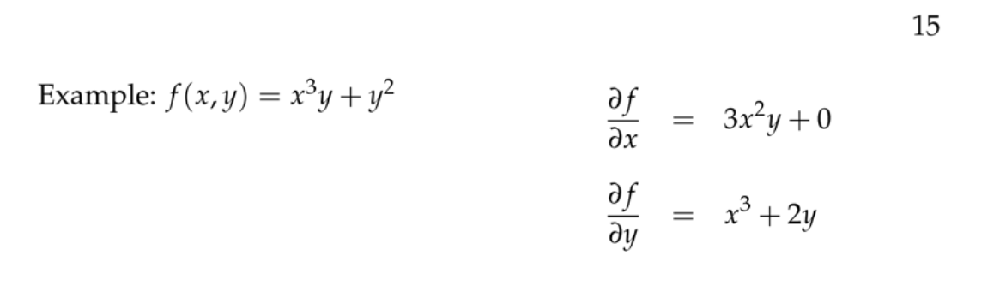

## Reading Notes
[Partial Derivative.pdf](https://www.yuque.com/attachments/yuque/0/2022/pdf/12393765/1658491313942-7f3f2ad3-a398-4742-8310-dfd41e5ca99f.pdf)
### Definition
:::info

:::

### Notations**⭐⭐**
:::info

:::

### General Cases
:::info

:::

## Problems
### P1: Calculate Partial Derivatives
:::info

:::
**Key**

# 4 切面近似公式
## Lecture Notes
### Definitions
:::info

:::

### Tangent Plane
:::info

:::

## Reading Notes
[Approximation Formula.pdf](https://www.yuque.com/attachments/yuque/0/2022/pdf/12393765/1658491985793-e00a7802-9bce-4aa2-90cf-cf71e0f97ddc.pdf)
[Approximation Formula 2.pdf](https://www.yuque.com/attachments/yuque/0/2022/pdf/12393765/1658492973811-48e11435-cac9-4dd7-8284-a200aac074ff.pdf)
### Tangent Plane
#### Definition
:::info

:::

#### Equation of Tangent Plane
:::info

:::

### The Approximation Formula**⭐⭐⭐**
#### Definition
:::info

:::

#### Linearization**⭐⭐**
:::info

对于三个变量及以上的切平面，我们不能使用几何的方法解释$(7)$了，代数的解释在下面
:::

#### 推广到Rn
:::info

:::

### Critique**⭐⭐⭐**
#### Drawback of the estimation
> 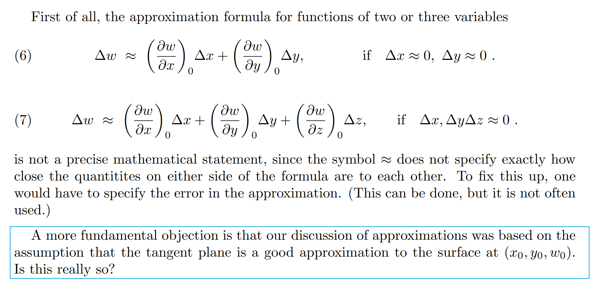

#### Smoothness hypothesis
> 
> 这个`Tangent Plane`在偏导数方向上都是合理的`Linearization`, 但是对于其他方向，我们**不能保证:**
> 1. 导数存在
> 2. `Surface`是`smooth`的

:::success

`**Smooth Function**`**就是各阶导数存在且连续的函数**
:::

##### 不光滑的例子
:::success

:::

### 代数解释**⭐⭐⭐**
:::success

上面的描述中，有一处较难理解的地方: $f_y(x_0+\Delta x,y_0)\Delta y\approx f_y(x_0,y_0)\Delta y$怎么取等号
这里使用`Mean-Value Theorem`的变体: $f(b)=f(a)+f'(c)(b-a)$, 如果$f$在$[a,b]$上连续
所以$f_y(x_0+\Delta x,y_0)\Delta y=f_y(x_0,y_0)\Delta y +\frac{df_y}{dx}\big|_{x=c,y=y_0}\Delta x$, $x_0< c <x_0+\Delta x$, 后一项实际上是`0`, 因为$f_y$是在$x$的值已经确定为一个常数的情况下得到的函数，所以对$x$(常数)求导结果就是`0`
于是我们可以使得等号成立: $f_y(x_0+\Delta x,y_0)\Delta y=f_y(x_0,y_0)\Delta y$
**Mean-Value Theorem: **
$minf'\leq f'(c)=\frac{f(b)-f(a)}{b-a}\leq maxf'\space on \space [a,b]$
:::

### Examples**⭐⭐**
#### Example 1
:::info

:::
:::success

:::

#### Example 2: Sensitivity Principle**⭐⭐**
:::info

:::
:::success

:::

## Problems
### P1: Tangent Plane Approximation
> 

**Key**

### P2: Sensitivity Principle
> 

**Key**$A(x,y) = A\big|_{2,3}+A_x\big|_{2,3}(x-2)+A_y\big|_{2,3}(y-3)$
$A\big|_{2,3}=6, A_x\big|_{2,3}=3, A_y\big|_{2,3}=2$
所以边长最短的$x$如果变化的话影响$A(x,y)$最明显

### P3: Tangent Approximation
> 

**Key**

### P4: Tangent Approximation
> 

**Key**

### P5: Linearization
> 

Key

# 5 二元最优化问题
## Lecture Notes

## 5.1 最大最小值问题概述
> 

## 5.2 临界点
[Optimization Problems.pdf](https://www.yuque.com/attachments/yuque/0/2022/pdf/12393765/1658546738747-689757a1-557c-46ad-8b69-de90667ae7ae.pdf)
### 定义
:::success

注意是$f_x=0,f_y=0$同时满足
:::

### 几何视角
:::success

:::

### Examples
#### Example 1: Minimum
:::success

:::
Key

#### Example 2: Maximum
:::success

:::
Key

#### Example 3: Saddle
:::success

:::
Key

#### Example 4: Application
:::success

:::
Key

## Problems
### P1: Find All the Critical Points
:::success

:::
Key

# 6 最小二乘
> 运用我们在`Optimization Problem`章节中的求`Critical Point`的经验，我们**有了**`**Least Square Problem**`**, 一个非常经典的模型**

## Lecture Notes
### Least Squares Interpolation

### Least Square Problems
#### Problem Description

#### Problem Solving
:::success

对每个样本$i$求偏导, 然后求和
:::
> 
> 

### Exponential Fitting
> 
> This is a numerical methods when fitting **non linear curves**

### Quadratic Laws
:::warning

:::

## Reading Notes
### Least Square Interpolation**⭐⭐⭐**
[Least Square Interpolation.pdf](https://www.yuque.com/attachments/yuque/0/2022/pdf/12393765/1658560004557-235c1572-e88e-49fa-a1e8-a052492b6f4a.pdf)
#### Problem Description
> 
> 

#### Deviations**⭐⭐**
> 

#### Numerical Methods**⭐⭐**
> 
> 
> **这里是比较新颖的点:**
> 

#### 拟合其他曲线
> 
> 

#### General Cases**⭐⭐**
> 

## Problems
### P1: Least Square Methods
> 

Key

# 7 极(最)大值和极(最)小值
## Lecture Notes

## 7.1 二阶测试与极值问题
[Second Derivative Test.pdf](https://www.yuque.com/attachments/yuque/0/2022/pdf/12393765/1658562831700-906479cb-75fd-44d6-b74e-6bf89bc10d62.pdf)
### 单变量函数的二阶测试
> 

### 多元函数的二阶测试
> 

> 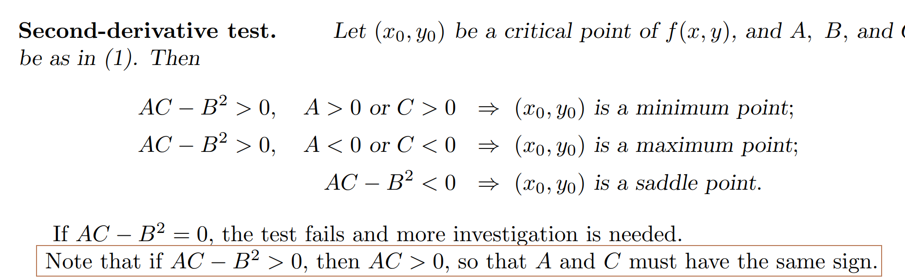
> 我们可以写成行列式的形式
> 

### 算例
#### 算例1 Find Critical Points
> 

Key

#### 算例2: Classify All the Critical Points
> 

Key

#### 算例3: Local Maximum and Minimum
> 
> 

**找到临界点**

**计算二阶偏导数**
**使用二阶测试**
> 

## 
## 7.2 证明二阶测试⭐⭐
### 我们要证明什么
> 
> 我们要证明函数$f(x,y)$的图像永远在临界点处的切平面之上

### Lemma
> 
> 

### 二阶多元函数
> **定义**`**Quadratic Functions**`**: **$w = w_0+ax+by+\frac{1}{2}(Ax^2+2Bxy+Cy^2)$
> **这个函数有几个性质:**
> 1. **函数**$w(x,y)$**过**$(0,0,w_0)$
> 2. **函数在**$(0,0)$**处，**$w_x=w_y=0$
> 3. **函数在**$(0,0)$**处，**$w_{xx}=A,w_{xy}=B,w_{yy}=C$
> 4. **函数在**$(0,0)$**处的切平面是**$w-w_0=a(x-x_0)+b(y-y_0)=ax+by=0$**, 也就是**$w=w_0$
> 

### 使用Lemma论证
> 

### 推广
> 
> 
> 这部分了解即可，本质上是做了一个线性变换, 从**原点作为**`**Critical Point**`**扩展到了任意一点作为**`**Critical Point**`**的情况， 而且涉及到了后续的**`**Part B**`**中关于**`**Chain Rule**`**的标准定义**

## 7.3 最值问题
> 极值往往探究的是在某一点附近函数的行为，而最值则放眼整个定义域

### 7.3.1 Closed Set
> 简单理解就是所有包含边界点的集合。
> 
> 
> 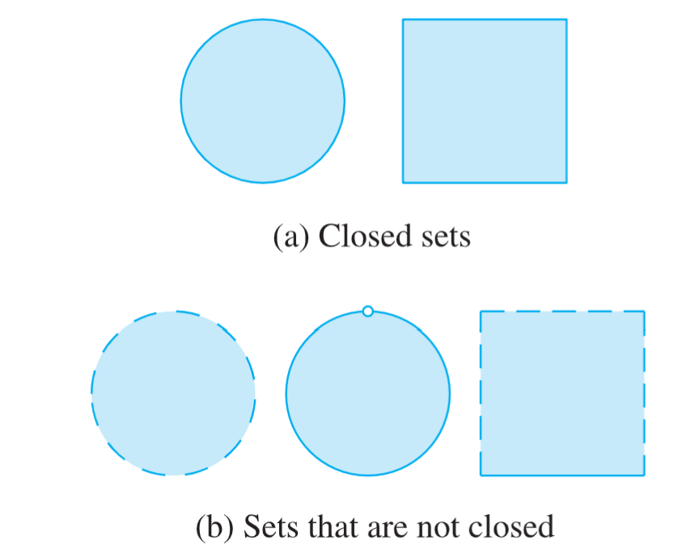

### 7.3.2 最值定理
> 

### 7.3.3 解决最值问题
> 

### 7.3.4 最值问题算例
#### 算例1
> 
> 

**找临界点**
**找边界点**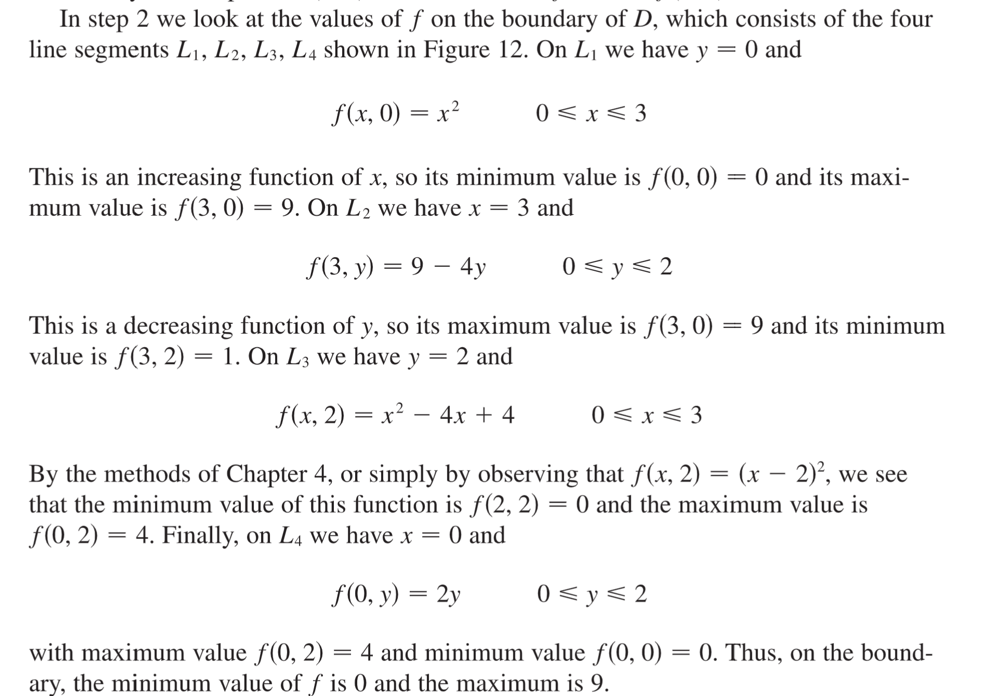
**比较最值**

#### 算例2: Global Max/Min

## Problems
### P1: Classify Critical Points
> 

Key

# 作业
[Question Pool.pdf](https://www.yuque.com/attachments/yuque/0/2022/pdf/12393765/1658568422130-444ef961-af4f-4c33-9874-739f065730f0.pdf)
## Section 1~4
### P1: Skech the Contour Plots
> 

Keys

### P2: 计算偏导数
> 

Keys

### P3: Verify Second Derivative
> 

Keys

### P4: Find Constant
> 

Keys
## 
### P5: Laplace Equation
> 

Keys

### P6: Equation of Plane
:::info

:::
Keys

### P7: Rays in the Cone
> 

Key
验证直线在平面内的方法在`Unit 1C.2`中介绍，就是通过将直线的参数方程代入平面中查看参数$t$的解的个数，如果有无数个解，则我们说直线在平面内

### P8: Hypotenuse Approximation
> 

Key

### P9: Ohm's Law
> 

Key

### P10: Linearization of Function
> 

Key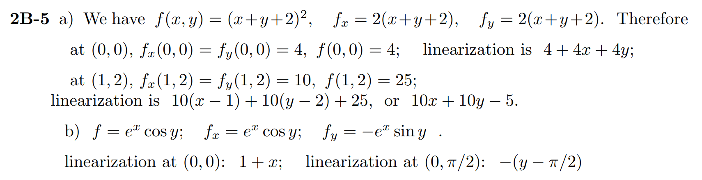

### P11: Volumn Approximation
> 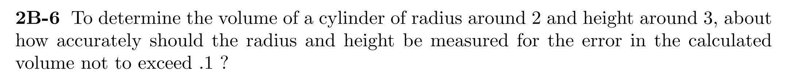

Key
总误差（绝对值）等于各个部分的误差（绝对值）相加

### P12: Sensitivity Principle
> 

Key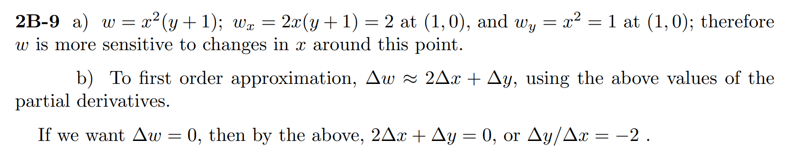

## Section 5~6
### P1: Distance to the Origin
> 

Key

### P2: 省材料⭐⭐
> 

Key

本课程中的最优化公式和理论只针对二阶函数，故需要化简函数为$w=f(x,y)$的形式载进行最优化条件的判断

### P3: 省成本
> 

Key

### P4: 最小二乘1
> 

Key

### P5: 最小二乘2
> 

Key

## Section 7
### P1: 二阶测试
> 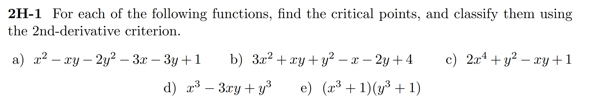

Key
此类题型就是先求一阶偏导，联立解方程得到`Critical Points`，然后逐个代入二阶偏导进行检验是`Minimum,maximum or Saddle`

### P2: 边界⭐⭐
> 

Key
此类题型就是先看看`Critical Points`是否在边界中

- 如果在的话，就继续进行二阶测试判断最值, 然后判断边界上的取值情况
- 如果不在，就对边界条件进行判断最值

### P3: 边界⭐⭐⭐
> 

Key
**既然我们没有找到**`**Minimum**`**或者**`**Maximum**`**点，那我们可以说在这个边界内没有切平面，也就是没有一个点使得: 这个点周围的所有点对应的函数值比这个点的都大或者都小，换句话说，我们只能在边界上判断最值**

### P4: 求边界⭐⭐
> 

Key

边界条件就是限制在自变量上的范围，本题中对于$x,y,z$本身的限制就是长度必须大于等于`0`, 其次，$z=4-x-y$, 使得$x+y\leq 4$，所以边界条件就是图中的三角区域

### P5: 边界⭐⭐
> 

Key

## Extra Exercises
[Problem Set 4_sn.pdf](https://www.yuque.com/attachments/yuque/0/2022/pdf/12393765/1658741424724-e927575c-4ef4-40e9-801f-6127b1db86a9.pdf)

