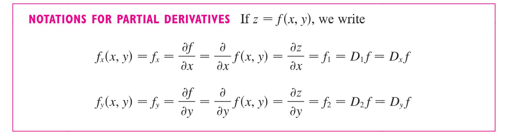
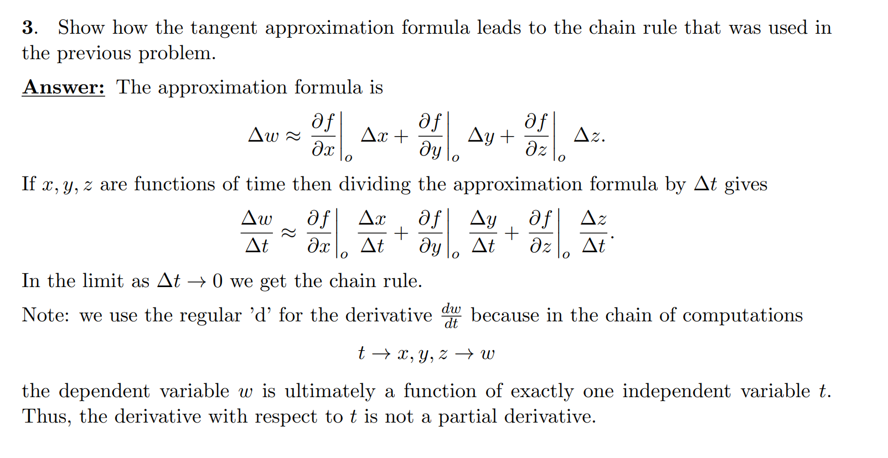
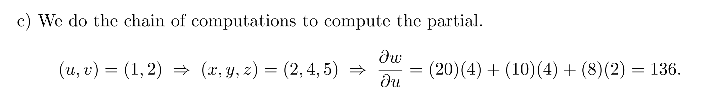
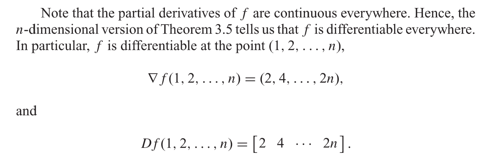
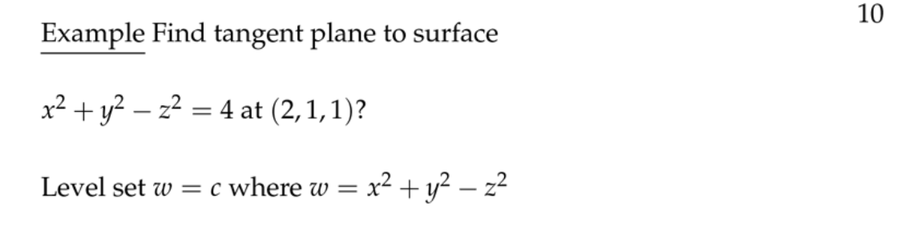
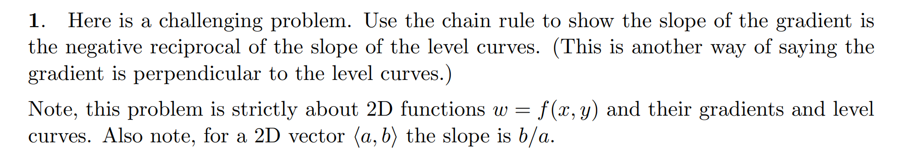

# 1 全微分和链式法则
[Chain Rule and Total Differentials.pdf](https://www.yuque.com/attachments/yuque/0/2022/pdf/12393765/1658757572717-d4657872-c4a3-4dfb-aad9-3ae864a5d7dc.pdf)

## 1.1 偏导数
### Definition
> 
> 
> 

## 1.2 全微分**⭐**
> 
> $dx,dy.dz$被称为`Differentials`, 微分, 那么如何理解他们呢?
> 
> 

## 1.3 链式法则初步**⭐⭐**
> 
> 
> 
> 
> 
> 
> 

## 1.4 偏微分方程
### 1.4.1 拉普拉斯方程
> 
> 

### 1.4.2 Wave Equation
> 
> 

## 1.5 练习
### 全微分
> 

### 链式法则
> 

### Approximation
> 

### 热力学应用
> 
> 

### 链式法则
> 

# 2 更多变量的链式法则
[Chain Rule.pdf](https://www.yuque.com/attachments/yuque/0/2022/pdf/12393765/1659357816260-e3e1ab19-d14b-48c1-9337-db0342cc5aa5.pdf)
## 2.1 定义
:::info

:::

### 算例1
> 
> 

### 算例2
> 
> 

### 算例3
> 
> 
> 

## 2.2 链式法则和全微分⭐⭐
:::info

1. **By Total Differentials**

2. **By Chain Rule**

3. **Example**

:::

### 算例1
:::info

:::
**Key**

### 算例2
:::info

:::
**(a)**
**(b)**
**(c)**

## 2.3 证明
:::info

:::

## 2.4 Ambiguous Notation
:::info

:::

## 2.5 隐函数求导法则
### 2.5.0 前言
> **对于单变量函数，我们有:**
> 
> 

### 2.5.1 定义
> **链式法则可以用于完善多变量隐函数求导法则。**
> 假设一个方程$F(x,y)=0$,其中$y=f(x)$, 则我们有$F(x,f(x))=0$, 我们对等式两侧同时使用链式法则对$x$求导可得：$\frac{\partial F}{\partial x}\frac{dx}{dx}+\frac{\partial F}{\partial y}\frac{dy}{dx}=0$，所以:
> 
> 

### 2.5.3 多元函数的推广
> 
> 

## 2.6 Problems
:::info

:::
### P1 链式法则
:::info

:::
**Key**

### P2 全微分
:::info

:::
**Key**

### P3 极坐标
:::info

:::
**Key**

### P4 Chain Rule vs Total differentials
:::info
**Suppose **$z=x^2+y^2,x=u^2-v^2,y=uv$
**a). Write the total differential **$dz$**in terms of **$dx, dy$
**b). Compute **$\frac{\partial z}{\partial u}$**in two ways, using chain rule and differentials**
:::
**(a)**$dz=z_xdx+z_ydy$
**(b)**
1. **首先我们使用**`**Chain Rule**`**:**

$\frac{\partial z}{\partial u}=\frac{\partial z}{\partial x}\frac{\partial x}{\partial u}+\frac{\partial z}{\partial y}\frac{\partial y}{\partial u}=4ux+2vy$

2. **接着我们使用**`**Total Differentials**`**:**

$dx=2udu-2vdv$,$dy=udv+vdu$,$dz=2xdx+2ydy$
我们联立上面三个式子: $dz=2x(2udu-2vdv)+2y(udv+vdu)=(4ux+2vy)du+(2uy-4xv)dv$
所以$\frac{\partial z}{\partial u}=4ux+2vy$和第一种方法一致

# 3 梯度与等高面⭐⭐⭐⭐⭐⭐
## 3.1 梯度
[Gradient.pdf](https://www.yuque.com/attachments/yuque/0/2022/pdf/12393765/1659360389410-9f1b496c-107a-491a-9b25-f40e945d282b.pdf)
### Basics
:::info

**此处需要特别留意梯度的定义，在二元函数**$f(x,y)$**，梯度向量**$\nabla f$**是一个水平向量, 垂直于任何等高曲线(面)**
如果我们从`Velocity Vector`的视角去理解的话, 会有如下定义。

:::
### 
### Matrix Notations
:::info

**我们可以使用矩阵的形式对多元函数的梯度进行改写:**

:::

## 3.2 等高面的切平面⭐⭐⭐
### 定义
> 假设$S$是$F(x,y,z)=k$代表的曲面，假设$P(x_0,y_0,z_0)$是这个曲面$S$上的一点。 
> 假设$C$是这个曲面$S$上的任意一条过点$P$的曲线，定义为$r(t)=\langle x(t),y(t),z(t)\rangle$。假设$P$是在$C$上运动的质点，且在$t_0$时刻处于$(x_0,y_0,z_0)$,则$r(t_0)=\langle x_0,y_0,z_0\rangle$
> 因为$C$在曲面$S$上，所以任何曲线$C$上的点$(x(t),y(t),z(t))$,都必须满足$F(x(t),y(t),z(t))=k$
> 我们可以对等式两边使用链式法则得到如下等式:
> 
> 结合梯度的定义，我们有:
> 
> 研究在$P$处的梯度，我们有:
> 
> **于是我们可以得到在**$P$**处的等高面的切平面表达式:**
> 
> 

### Matrix Notation
:::info

:::
**Example(n-dimensional paraboloid)**

### 算例
#### 算例1
> 

**Key**

#### 算例2
> 
> 
> 
> 

#### 算例3
> 

#### 算例4 ⭐⭐
> 

#### 算例5: 梯度垂直于等高线⭐⭐
:::info

:::
**Key**

#### 算例6: 转化成等高线问题
:::info
我们在求一元函数在某点的切线向量的时候，可以将其转化成一个多元函数的等高线问题

:::
**Key**

## 3.3 证明垂直性
[Proof of perpendicularity.pdf](https://www.yuque.com/attachments/yuque/0/2022/pdf/12393765/1660115390541-d8296742-cf32-4e44-b7f4-5b50c9888e07.pdf)
### 证明流程
> 
> 图中展示的是等高面， **证明的是某点的梯度垂直于等高面(线)上的所有切平面（切向量）**

### 课堂用例
:::info

三维情况下，梯度垂直于一个**等高面**
:::

#### 

## 3.4 Normal Line
### 3.4.1 定义
> 
> 

> 

### 3.4.2 椭球体
> 

**Key**

## 3.5 练习
### P1 计算梯度向量
> 

**Key**
### 
### P2 验证梯度向量垂直性
> 假设$w=x^2+5y^2$
> 

**Key**

### P3 验证二元函数的垂直性⭐⭐
> 

**Key**
这里相当于做了隐函数求导，对于$f(x,y(x))$来说，相当于左右两侧同时对$x$求微分，根据全微分公式可以得到答案。

### P4 计算切平面
> 

**Key**
### 

# 4 方向导数⭐⭐⭐⭐⭐
[Directional Derivatives.pdf](https://www.yuque.com/attachments/yuque/0/2022/pdf/12393765/1660121556546-b547c067-400b-4718-980a-97f02941889e.pdf)
## 4.0 前言
> 
> 我们通过求偏导得到的梯度只能描述多元函数在自变量方向的变化速率，所以方向导数存在的意义就是求得多元函数在任意方向的变化速率。

## 4.1 定义⭐⭐⭐⭐⭐
> 
> 用向量表示:
> 
> 
> **注意这里的几何含义**
> 
> 

## 4.2 梯度与方向向量⭐⭐⭐
> 
> **证明:**
> 
> 

## 4.3 算例
### 4.3.1 代数视角
> 

### 4.3.2 几何视角⭐⭐⭐⭐⭐
> 

## 4.4 最大方向导数的方向
> 
> 
> 其实，如果我们从投影的角度来理解这个式子就会非常清晰，因为$\bf u$是一个**方向可变的**单位向量，而$\bf \bigtriangledown w(P_0)$在某一点的梯度向量(梯度方向)是固定的，所以$\bf \bigtriangledown w(P_0)\cdot u$相当于是$P_0$处的梯度方向向量在$\bf u$方向上的投影，那么自然当$\bf \bigtriangledown w(P_0)=ku$的时候($\bf u$和梯度方向一致时)，乘积最大，这时候$\bf \bigtriangledown w$的变化量最大

## 4.5 练习⭐⭐⭐
> 

**(1)**
在点$(1,1,1)$处的梯度是向上增加的，且是增长最快的方向，那么如果我们取$\bf u$为和梯度相反的方向，就可以得到下降最快的速率了。
**(2)**

