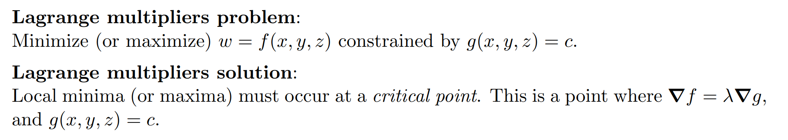
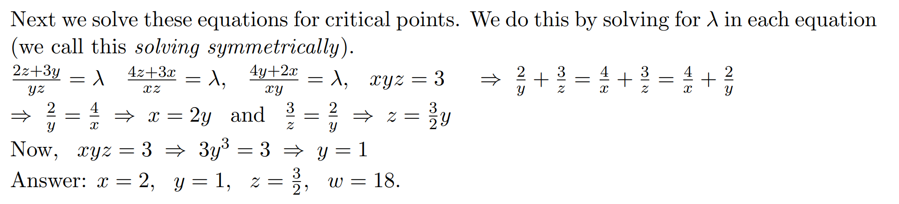
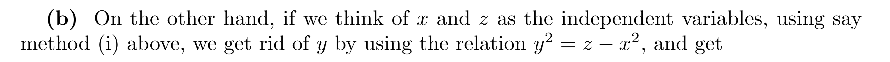
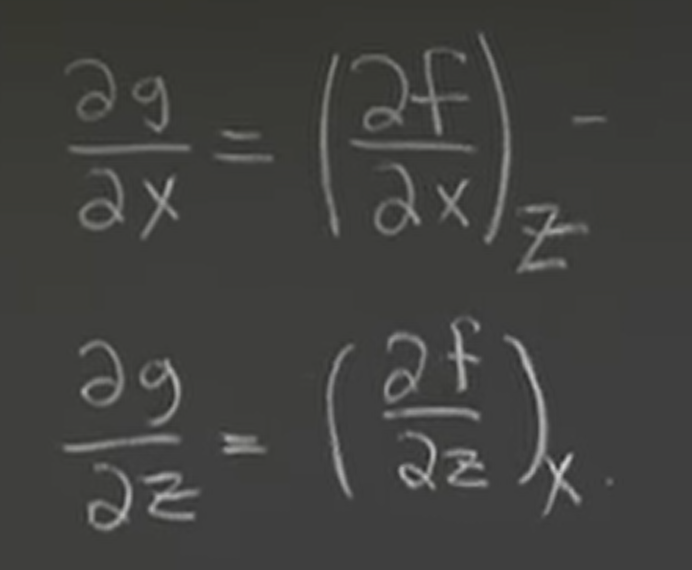

# 1 拉格朗日乘子
[Lagrange Multipliers.pdf](https://www.yuque.com/attachments/yuque/0/2022/pdf/12393765/1660174415464-29f5e595-89ac-44c9-b0b7-ebe177bb271f.pdf)
## 1.0 前言
> 拉格朗日乘子法用于解决带有约束的最优化问题。比如说一个多元函数$w=f(x,y)$, 我们的$(x,y)$取值被限制在某个二维区域内。

## 1.1 拉格朗日乘子问题
> 

## 1.2 省材料的例子
> 

**确定最优化函数**
**确定拉格朗日约束边界**
**求解约束优化问题**

## 1.3 三元函数的例子
> Minimize $w=y$constrained to $x^2+y^2+z^2=1$

**给出约束优化问题**Minimize $w=f(x,y,z)=y$constrained to $C=x^2+y^2+z^2,C=1$
**求解约束优化问题**$\nabla w=\langle \frac{\partial w}{\partial x},\frac{\partial w}{\partial y},\frac{\partial w}{\partial z}\rangle=\langle 0,1,0\rangle$,$\nabla C=\langle 2x,2y,2z\rangle,x^2+y^2+z^2=1$
$\begin{cases}  2\lambda x=0\\2\lambda y=1\\2\lambda z=0\\x^2+y^2+z^2=1\end{cases}$
得到$\begin{cases}  x=0\\y=\pm1\\z=0\\\lambda=\pm\frac{1}{2}\end{cases}$, 因为我们要最小化，所以$y=-1,w_{min}=-1$

## 1.4 边界规则的例子
> 
> 

**Key**
求解的过程就是要消去$\lambda$

## 1.5 边界不规则的例子**⭐⭐**
> 

**Key**

## 1.6 课堂用例
> 
> 
> 
> 
> 如果两个函数$f,g$在$P$处的等高线相切，则在点$P$处$\nabla f=k\nabla g$
> 
> 
> 
> 

## 1.7 练习
### E1 消去乘子**⭐⭐⭐**
> 

**Key**
我们的逻辑是这样: $\begin{cases} 2x+1=\lambda 2x\\4y=\lambda 2y \end{cases}$消去$\lambda$, 得到$\frac{2x+1}{2x}=\frac{4y}{2y}=\lambda$, 我们只关注左侧的等式，得到$\begin{cases}x=1/2\\y=\pm \frac{\sqrt{3}}{2} \end{cases}$ , 而我们这样消去$\lambda$会导致$y=0$的解被舍弃掉，在`18.03SC`中我们在进行`Separation of Variable`求微分方程的时候也会发生这种情况，所以需要找回丢失的解$y=0$(前提是$y=0$在题目允许的范围内)
在边界上的点无法进行二阶测试。

### E2 **⭐⭐⭐**
> 

**求出Critical Points(消去拉格朗日乘子)**

# 2 拉格朗日乘子证明**⭐⭐⭐**
[Proof of Language Multipliers.pdf](https://www.yuque.com/attachments/yuque/0/2022/pdf/12393765/1660189048023-2c69440e-224f-4b62-af3f-6e130857be50.pdf)
## 2.1 约束优化的临界点的定义
> 对于一个多元函数$w=f(x,y,z)$来说，其临界点为满足方程组$\begin{cases} f_x=0\\f_y=0\\f_z=0\end{cases}$的点$(x,y,z)$
> 而**对于一个约束优化问题: **$w=f(x,y,z)\space constained\space by\space g(x,y,z)=c$**, 其临界点为使得**$\nabla f(x,y,z) = \lambda \nabla g(x,y,z)\space and\space g(x,y,z)=c$**的点**
> **对于一个约束优化系统，其极小值和极大值在这些临界点取到**

## 2.2 代数视角证明
> 
> 
> **怎么理解呢？**
> 我们可以这样想，$\bf r(t)=\langle x(t),y(t),z(t)\rangle$是一个参数曲线$C$,位于通过点$P$的**约束面**$g(x(t),y(t),z(t))=c$**内(参考**[**等高面**](https://www.yuque.com/alexman/tn6ya7/kaomwu#aVBat)**), 就是图中蓝色的曲面**，我们可以通过消去$t$来得到一个关于$x,y,z$的表达式，描述的同样是这个参数曲线，只是丢失了质点运动的位置与时间的关系(也就是速度)，丢失了速度信息。我们令$h(t)=f(x(t),y(t),z(t))$其实就是把参数曲线上的$t$时刻的点的坐标代入了$f(x,y,z)$(一个三元函数，需要在四维空间中展示)中得到了一个输出$h(t)$, **代表的是函数**$f$**在曲线**$C$**代表的质点坐标处的值**。
> 我们假设了$f(x,y,z)$在参数曲线$C$上的$P$点处有最大值。并且假设我们在$t_0=0$时刻$\bf r(t_0)=\langle x(t_0),y(t_0),z(t_0)\rangle=\langle x(0),y(0),z(0)\rangle$, 所以当参数曲线上的质点处于$P: (x(0),y(0),z(0))$时，$h(t)=f(x(0),y(0),z(0))$有最大值。 
> 下面我们对$h$关于其自变量$t$求导。
> 由链式法则可知: $\frac{dh}{dt}=\frac{\partial h}{\partial x}\frac{dx}{dt}+\frac{\partial h}{\partial y}\frac{dy}{dt}+\frac{\partial h}{\partial z}\frac{dz}{dt}$
> 我们写成梯度的形式: $h'(t)=\nabla f|_{\bf r(t)}\cdot r'(t)$
> **因为**$t=0$**是我们规定的约束面上的极值点，也就是说**$h(t)$**在**$(x_0,y_0,z_0)$**处有极值，又因为极值点处的一阶导数为**$0$**, 所以:**$h'(0)=\nabla f|_{\bf P}\cdot r'(0)=0$**， 这是得到最终结论的关键点。(**$r'(0)$**实际上是在点**$\bf P$**处的速度向量，与约束曲面垂直，)**
> 于是我们看到$\nabla f|_{\bf P}$实际上是垂直于任何通过点$P$的约束曲线$C$，于是$\nabla f|_{\bf P}$通过点$P$的约束表面, 而因为约束面$g(x,y,z)=c$在$P$处的梯度$\nabla g|_{\bf P}$也垂直于任何通过$P$处的约束曲线$C$, 所以$\nabla f|_{\bf P}||\nabla g|_{\bf P}$
> 

 

  
## 2.3 几何视角证明
> 假设我有一个约束优化问题: $w=f(x,y), g(x,y)=c$
> 为了方便起见，我们将约束曲线定为一个圆,我们要寻找的就是在这个圆上的某一点，使得$w=f(x,y)$取得极大值和极小值，如图所示:
> 
> 我们从$w=17$这条等高线开始慢慢靠近这个约束圆，当我们逐步靠近圆时，$w$在逐渐减小，直到$w=14$, 我们的等高线和圆相切与点$P$, 此时取到局部最大值(极大值)
> 由于约束圆是函数$g$的等高线，所以在点$P$处$\nabla g \perp g(x,y)=14$。同时$\nabla f\perp f(x,y)=14$, 因为$(g(x,y)=14)\perp (f(x,y)=14)$, 所以$\nabla f$和$\nabla g$平行。
> 类比下图中的三维图(极值点处$\nabla f(\vec{CD})||\nabla g(\vec{AB})$)

## 2.4 为什么成立
> 
> 
> 这里的$\frac{df}{ds}|_\hat{u}$指的是[方向导数](https://www.yuque.com/alexman/tn6ya7/kaomwu#SiZRu)概念, 在这个二维的例子中，我们知道，目标函数是$h(t)=f(x(t),y(t))$, 约束曲线$C$是$g(x(t),y(t))=c$(位于$xy$平面内).
> $\frac{df}{ds}|_\hat{u}$表示$f$在$\hat{u}$方向上的方向导数，由于$\hat{u}$是约束曲线$C$的切线方向，所以，沿着这个方向$f(x,y)$的值不变(相当于在等高线上运动)，此时方向导数为零。
> 
> **拉格朗日乘子法不能告诉我们某个极值点(最值点)是极(最)大值还是极(最)小值, 二阶测试不管用，需要手动比较**
> 

## 2.5 拉格朗日函数**⭐⭐⭐**
参考: [https://zhuanlan.zhihu.com/p/67327634](https://zhuanlan.zhihu.com/p/67327634)
> **目的：**将有约束条件的函数最优化问题通过拉格朗日函数转化为无条件的函数最优化问题
> **对于无条件的函数最优化问题**，常用的有3种方式：
> - 梯度下降：求解一阶导数，其实就是使用[泰勒一阶展开](https://link.zhihu.com/?target=https%3A//www.shuxuele.com/algebra/taylor-series.html)逼近最优解
> - L-BFGS：求解二阶导数，其实是使用泰勒二阶展开逼近
> - IIS
> 
**对于有条件约束的函数最优化问题，该怎么求呢？**
> 数学上给出了两种求解的方式，下面以求解二元函数的条件极值为例：
> 例：求解二元函数 $f(x,y)$ 在$φ(x,y)=0$ 条件下的极值的方法与步骤：
> **方法一 化条件极值为无条件极值**
> 第一步：从条件 $φ(x,y)=0$ 中，求出$y$的显函数[[1]](https://zhuanlan.zhihu.com/p/67327634#ref_1)形式 $y=φ(x)$ .
> 第二步：将 $y=φ(x)$ 带入二元函数 $f(x,y)$ 中，化为一元函数 $f[x,φ(x)]$ 的无条件极值.
> 第三步：求出一元函数 $f[x,φ(x)]$ 的无条件极值极为所求.
> **方法二 拉格朗日乘数法**
> 第一步：构造拉格朗日函数 $L(x,y,λ)=f(x,y)+λφ(x,y)$
> 第二步：由一阶偏导数组成方程组
> $\begin{cases}L'x=0\\L'y=0\\L'λ=0  \end{cases}$ 解之即可
> 所以，拉格朗日乘数法是求条件极值的一种方法，具体过程就是将带条件的函数极值问题转化为无条件的极值问题
> **例**：求函数 $Z=x^2+y^2$ 在条件 $2x+3y=1$ 下的极值
> **解**： $L(x,y,λ)=x^2+y^2-λ(2x+3y−1)$
> $\begin{cases} L'x=2x+2y=0\\L'y=2x+3y=0 \\L'λ=2x+3y−1=0\end{cases}$ , 解得 $x=\frac{2}{13}，y=\frac{3}{13}$

:::success
而以上所有步骤的本质，其实就是我们在[2.2](https://www.yuque.com/alexman/tn6ya7/uvza47/edit#ZNEea)和[2.3](https://www.yuque.com/alexman/tn6ya7/uvza47/edit#k6Yq0)中证明的$\nabla f=\lambda \nabla g$(当$f$在$g$的约束上取到极值的时候， $f=f(x,y,z)$, $g=g(x,y,z)$)
因为$\nabla f-\lambda \nabla g=\begin{cases}f_x-\lambda g_x=0\\f_y-\lambda g_y=0\\f_z-\lambda g_z=0\end{cases}$, 就是上面我们要解的那个方程组。
:::

## 2.6 算例
### 算例1
> 

**找到拉格朗日临界点**
**找到函数最值**
**可视化**

### 算例2
> 

**Key**

# 3 自变量的选取**⭐⭐⭐⭐⭐**
[Non-Independent Variables Part 1.pdf](https://www.yuque.com/attachments/yuque/0/2022/pdf/12393765/1660191038170-edb12bfc-ebf2-4f0f-abe2-b8d5e3748aad.pdf)
[Non-Independent Variables Part 2.pdf](https://www.yuque.com/attachments/yuque/0/2022/pdf/12393765/1660191038196-5f1d389a-590f-4fb4-ba53-b21ec1adf577.pdf)

## Lecture Notes
### Insights
> 假设我们有$g(x,y,z)=x^2+yz+z^3=8\space at\space (2,3,1)$
> **我们想求**$\frac{\partial z}{\partial x}$**, **$\frac{\partial z}{\partial y}$**。**
> 我们对等式两侧进行全微分, 得到$f_xdx+f_ydy+f_zdz=2xdx+zdy+(y+3z^2)dz=0$, 其中$dz,dy,dx$分别表示$x,y,z$在$(2,3,1)$附近的微小变化量
> 我们代入$x=2,y=3,z=1$，得到$4dx+dy+6dz=0$
> 我们将$z=z(x,y)$($z$是$x,y$的函数), 所以我们将$dz$移到等式右侧，我们有$dz=-\frac{1}{6}(4dx+dy)=f_xdx+f_ydy$
> - $f_x$代表的是$\Delta x\to 0$时，$\Delta z$的值, $z$的变化量, 其实$f_x$就是$\frac{\partial z}{\partial x}$(在$y$固定不动的时候，也就是$dy=0$)
> - $f_y$代表的是$\Delta y\to 0$时，$\Delta z$的值, $z$的变化量, 其实$f_y$就是$\frac{\partial z}{\partial y}$(在$x$固定不动的时候，也就是$dx=0$)
> 
所以$\frac{\partial z}{\partial x}=-\frac{2}{3},\frac{\partial z}{\partial y}=-\frac{1}{6}$

:::info
一般而言:
对于$g(x,y,z)=c$, $dg=g_xdx+g_ydy+g_zdz$
如果我们想要求$\frac{\partial z}{\partial x}$, 我们会令$dy=0$, 所以$dz=-\frac{g_x}{g_z}dx, \space\frac{\partial z}{\partial x}=-\frac{g_x}{g_z}$
:::
> 假设$f(x,y)=x+y$,我们通过全微分得到$df=f_xdx+f_ydy$, 令$dy=0$, 我们很快得到$\frac{\partial f}{\partial x}=f_x=1$
> 
> 假设现在我们令$\begin{cases}  x=u\\y=u+v\end{cases}$, 则$f=x+y=2u+v$, 我们也可以很快得到$\frac{\partial f}{\partial u}=f_u=2$
> 
> 我们发现$\frac{\partial f}{\partial x}\neq \frac{\partial f}{\partial u}$, 所以这种记号没有显式的告诉我们我们将哪个自变量的微元设置为了$0$(也就是我们固定了哪个变量)
> 

:::info
所以我们需要更清晰的符号来告诉我们哪个自变量被固定了。

:::

### 算例
:::info

我们要研究$A$随着$\theta$的变化率，所以$\theta$一定是自变量, 不能被固定住。

:::

## 3.0 序言
> **自变量(Independent Variables):** 自变量是因，其值可以任意取，不受其他因素影响
> **因变量(Dependent Variables): **因变量是果，其值由自变量的取值决定，不可任意取值。
> 
> 在计算函数$w=f(x,y)$或者$w=f(x,y,z)$的偏微分的时候，我们之前的假定是$x,y,z$是自变量。但是在实际生活中，我们很少做这样的假设。
> 例如: 在热力学中，一个封闭气缸内的气体有三个性质：压力$p$, 体积$V$和温度$T$, 当然我们我们也可以得到其他性质，比如熵$S=f(p,v,T)$
> 在这个例子中，$p,v,T$不是自变量，可能其中的某个变量取决于其他两个变量。由力学模型可得，对于一个理想气体来说，我们有: $pv=nRT$($n,R$是常数)，就可以看出这种关系。
> **我们还可以这样理解: 在**`**Pytorch**`**的**`**Autograd**`**算法中，每一个自变量作为一个**`**Root Node**`**存在，而因变量作为一个**`**Inner Node**`**存在，二者在构建反向传播图的时候有不同的使用准则。**
> 我们通过一个简单的数学例子来说明这种变量之间的耦合。
> 假设我们有$w=x^2+y^2+z^2$,$z=x^2+y^2$, 要求计算$\frac{\partial w}{\partial x}$
> **(a): 我们认为**$x,y$**是自变量的，则我们可以采用将**$z$**代入**$w$**求解：**
> 
> 
> 或者使用链式法则直接求解:
> 
> 两种方法得到的解一致
> 
> **(b): 如果我们将**$x,z$**认为是自变量，**$y$**是因变量, 我们仍然使用上述方法，得到:**
> 
> 
> 
> 我们发现:
> 对于$w=x^2+y^2+z^2$,$z=x^2+y^2$, 要求计算$\frac{\partial w}{\partial x}$
> 1. 如果$x,y$是自变量，$\frac{\partial w}{\partial x}=2x+4x^3+4xy^2$
> 2. 如果$x,z$是自变量，$\frac{\partial w}{\partial x}=0$
> 
我们能说其中某个一定是正确的答案吗？不是的，因为这个问题本身就没有限制我们自变量的选取规则，所以两个答案都是合法的。
> 

## 3.1 自变量的选取
> 

### 3.1.1 x,y 是自变量
> 

### 3.1.2 x,z 是自变量
> 

## 3.2 带限制的偏微分**⭐⭐⭐**
### 3.2.1 Insights**⭐⭐⭐**
:::info
对于$w=f(x,y,z), z=z(x,y)$来说，我们如果直接写出$\frac{\partial w}{\partial x}$会产生歧义，因为我们有$z=z(x,y)$, 但这并不意味着$z$就一定是因变量。
沿用之前的例子，$w=x^2+y^2+z^2,z=x^2+y^2$

1. 如果我们要求$(\frac{\partial w}{\partial x})_y$由链式法则（`3.3`中会介绍），会得到$f_x+f_z(\frac{\partial z}{\partial x})_y=2x+2z\cdot 2x=2x+4xz$, 里面只含有$x,z$,这也符合逻辑，因为当$y$固定住的时候，自变量就是$x$, $x$有两条路径影响$w$, 一是通过**因变量**$z$影响$w$的值, 另外就是通过自身影响$w$, 所以我们看到$(\frac{\partial w}{\partial x})_y$有两项
2. 如果我们要求$(\frac{\partial w}{\partial x})_z$由链式法则，会得到$f_x+f_y(\frac{\partial y}{\partial x})_z=2y+2y\cdot (-\frac{x}{y})=2y-2x$, 里面只含有$x,y$,这也符合逻辑，因为当$z$固定住的时候，自变量就是$x$, $x$有两条路径影响$w$, 一是通过**因变量**$y$影响$w$的值, 另外就是通过自身影响$w$, 所以我们看到$(\frac{\partial w}{\partial x})_z$有两项
3. 如果我们要求$(\frac{\partial w}{\partial x})_{y,z}$，事情就变得非常简单，因为它就是$f_x$的含义(`3.3.3`中介绍, 就是让$y,z$都固定住), 所以$(\frac{\partial w}{\partial x})_{y,z}=2x$

综上，我们看到自变量的选取对于$\frac{\partial w}{\partial x}$的意义来说是非常重要的，但是一般而言，如果我们写出$\frac{\partial w}{\partial x}$， 一般意味着$z$就是因变量，因为$z=z(x,y)$， 然后$x,y$均为自变量，但是我们需要良好的书写习惯，所以最好还是加上这个`Notations`。
:::

### 3.2.2 一些Notations
> $\frac{\partial w}{\partial x}$取决于我们自变量的选取，因为我们要测量的是因变量随着某个自变量改变的改变。
> 所以当我们被问到$\frac{\partial w}{\partial x}$的时候，我们必须在同一时刻**规定自变量是谁, 同时哪些自变量需要被固定**，使用下列记号表示:
> 
> **他们读作: **
> 
> 
> 
> **如果我们有更多的变量, 我们可以使用类似的数学表达,比如:**
> 
> 
> 
> `Be held constant`的意思就是$dx=0,dy=0,dz=0$这样的，就是没有任何的微小变化的意思。

## 3.3 带限制的链式法则**⭐⭐⭐**
### 3.3.1 Insights**⭐⭐⭐**
> 我们在使用链式法则计算偏微分的时候，可以使用全微分的视角来计算。
> 比如: $w=f(x,y,z)$的全微分是$dw=f_xdx+f_ydy+f_zdz$, 这里$x,y,z$是自变量。
> **不同于使用链式法则，使用全微分计算偏导的好处就是整个推导过程我们不需要考虑谁是自变量，我们会将非自变量使用其全微分代替。详见下面的算例。**
> **全微分通常会涉及更多的计算，但他可以给出所有自变量的偏导数, 使用哪一个完全取决于我们的问题背景。**
> **下面给出一些微元的性质**

### 

### 3.3.2 微元的性质
> 
> 
> 注意: 性质$\bf D1$中我们没有定义微分的乘积，像$dudv$这样的，或者除法，像$\frac{du}{dv}$这样的, 这些在多重积分中使用较为频繁。

### 3.3.3 Formal/Actual 偏导数⭐⭐
> 在实际问题中，$w=f(x,y,z)$中的$w$一般不会直接给出，或者整个方程左右两侧的联系都不会给出, 此时我们需要对这类抽象函数或者方程进一步了解。
> 

> 
> 这里我们不知道自变量是谁，所以有好几种偏导数的情况，这里只选出其中三种（一共$3P_2=6$种）。

### 3.3.4 算例
#### 算例1⭐⭐⭐
> 

**使用链式法则**
**使用全微分**
这个例子中我们使用了微元的性质$\bf D1$: 可相加可相减可**倍乘**(所有线性操作)。在最后一步中我们使用了微元的性质$\bf D2$: 就是将链式求导法则得到的微分和使用全微分得到的微分进行系数匹配，最后得到自变量偏导数的表达式。
注意到在$(4)$中: $ydx+xdy=zdt+tdz$，由于$z$不是自变量，所以不能应用性质$\bf D2$
 

#### 算例2⭐⭐⭐
> 

**Key**

#### 算例3: 梯度分解
> 

**Key**

#### 算例4: 梯度分解2
:::info

:::
**Key**

#### 算例5: 梯度分解3
:::info

:::
**Key**

#### 算例5⭐⭐⭐
:::info
假设$w=x^3y-z^2t,xy=zt$
找到$(\frac{\partial w}{\partial z})_{x,y}$
:::
**使用全微分**$dw=3x^2ydx+x^3dy-2ztdz-z^2dt...(1)$, $dx=0,dy=0...(2)$
$ydx+xdy=zdt+tdz$, 所以$dt=-\frac{t}{z}dz...(3)$
将$(2),(3)$代入$(1)$, 得到$dw=-2ztdz+ztdz=-ztdz$
所以$(\frac{\partial w}{\partial z})_{x,y}=-zt$
**使用链式法则**$(\frac{\partial w}{\partial z})_{x,y}=w_z+w_t(\frac{\partial t}{\partial z})_{x,y}=-2zt-z^2(\frac{\partial t}{\partial z})_{x,y}...(1)$
$(\frac{\partial (xy)}{\partial z})_{x,y}=(\frac{\partial (zt)}{\partial z})_{x,y}\to 0=t+z(\frac{\partial t}{\partial z})_{x,y}\to(\frac{\partial t}{\partial z})_{x,y}=-\frac{t}{z}$(左侧的偏导为$0$是因为$x,y$都被固定住了)
带回$(1)$, 得到$(\frac{\partial w}{\partial z})_{x,y}=-2zt+zt=-zt$

## 3.5 偏微分连接规则
### 3.5.0 序言
> 
> 以热力学的视角，我们定义$t,u,v,w,x,y,z$这些变量，我们通过方程组合这些变量，假设组合后这些变量满足:
> 

### 3.5.1 变量连接规则
> 

### 3.5.2 变量连接规则的证明
> 

### 3.5.3 算例
> 

## 3.6 总结
:::info
对于一个多元函数$w=f(x,y,z),z=g(x,y)$, 我们要求$(\frac{\partial w}{\partial x})_{y}$, 这类问题称为带限制的偏导数。这个符号的意思是，我固定住$y$的值，于是在$x$的值改变的时候，$z$的值发生改变，进而导致$w$的值发生改变，所以我可以探究$w$在$y$固定的情况下，$x$对于$w$增长的贡献。因为$z=g(x,y)$, $z$作为一个因变量，我们计算偏导的时候应该将其看成是一个隐函数求导:
所以我们有带限制的链式法则: $(\frac{\partial w}{\partial x})_{y}=f_x+f_z(\frac{\partial z}{\partial x})_{y}$, 没有$f_y$的原因就是这里$y$是被固定住的，$w$在$y$方向上没有变化。

假设$w=x^3y-z^2t$且$xy=zt$, 求$(\frac{\partial w}{\partial t})_{x,z}$
**使用链式法则的解题步骤: **

1. 根据角标找到因变量$y$
2. 写出链式法则($(\frac{\partial w}{\partial t})_{x,z}=f_t+f_y(\frac{\partial y}{\partial t})_{x,z}$, 直属的$f_x$和通过因变量$y$的)
3. 利用$xy=zt$求$(\frac{\partial y}{\partial t})_{x,z}$, 可以利用全微分: $ydx+xdy=zdt+tdz$, 所以$dy=\frac{z}{x}dt+\frac{t}{x}dz-\frac{y}{x}dx$, 根据$\bf D2$，得到$(\frac{\partial y}{\partial t})_{x,z}=\frac{z}{x}$
4. 代入求解

**使用全微分解题步骤:**

1. 根据角标找到因变量$y$
2. 写出所有表达式的全微分，$dw=3x^2ydx+x^3dy-2ztdz-z^2dt...(1)$和$ydx+xdy=zdt+tdz$, 然后将$dy$(因变量)代入$(1)$, 求解
:::

## 3.7 练习
### E1 全微分
> 

**Key**

### E2 全微分
> $w=zxe^y+xe^z+ye^z$
> 

**Key**

### E3 偏导数与全微分**⭐⭐⭐⭐⭐**
> $w=zxe^y+xe^z+ye^z$
> 

**Key**

### E4 限制性微分
> 

**(1)**参考`3.4`中[链式法则](https://www.yuque.com/alexman/tn6ya7/uvza47/edit?toc_node_uuid=lK1h2Eo1V3SlF_z2#Ej3KE)中的做法:

**(2)**

### E5 限制性微分
> 

**(a)**
**(b)**
# 
## 

