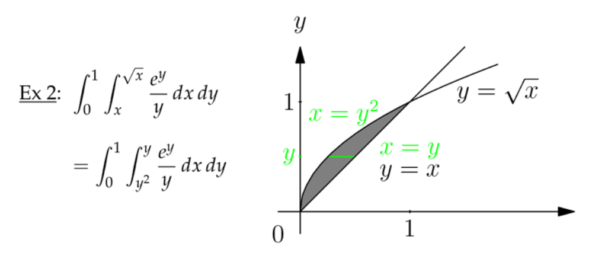
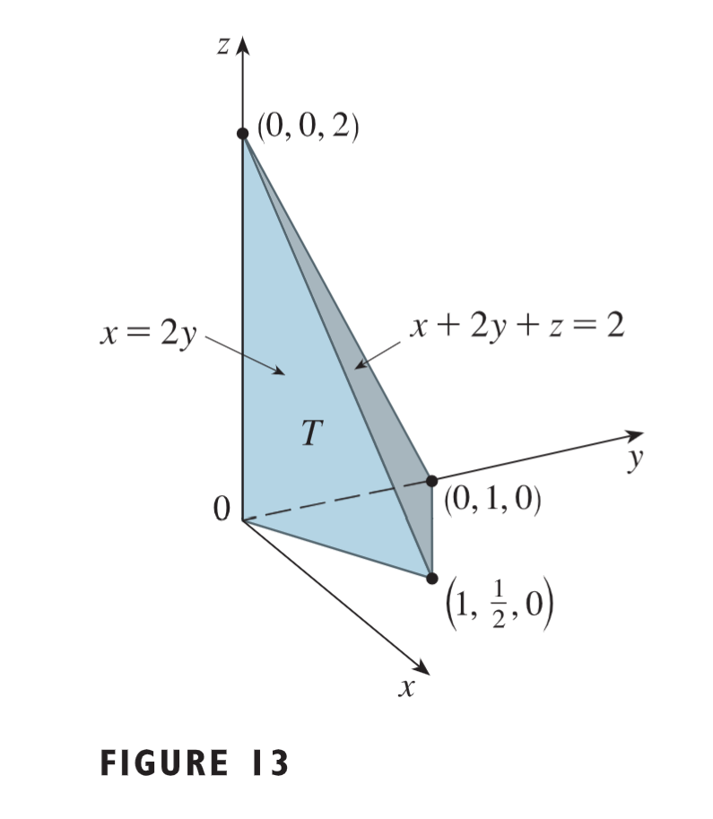
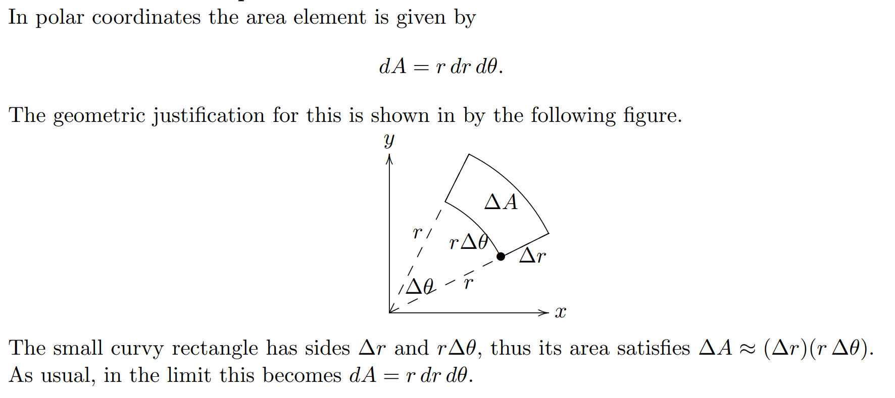
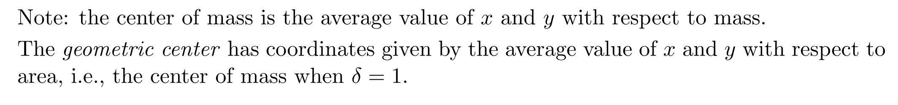
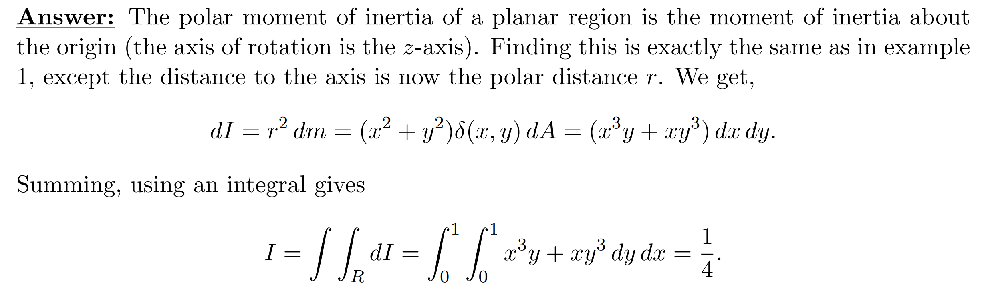
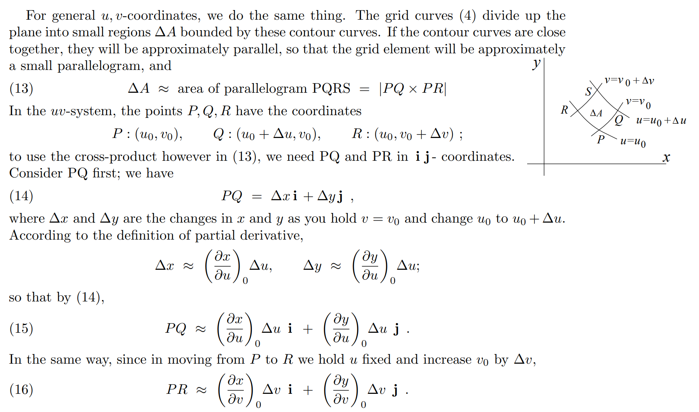
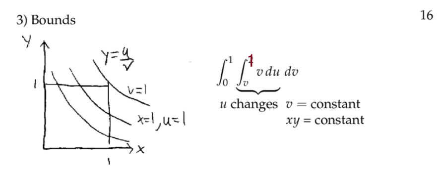
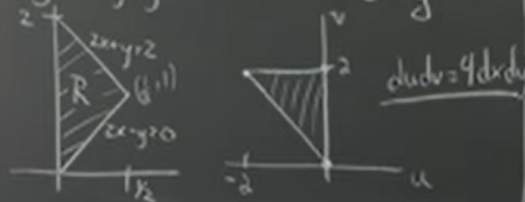

# 1 二重积分基础
## Lecture Notes
### Integral of one variable

### Integral of two variables

> For given $x$, $S(x)=\int_{ymin}^{ymax}f(x,y)dy$

## 1.1 定义
[Definitions.pdf](https://www.yuque.com/attachments/yuque/0/2022/pdf/12393765/1658467555001-084f50e9-3ea6-42f4-84e2-e0b204e5e553.pdf)
### 二重积分符号
:::info

:::

### 极限视角
:::info

本质就是求和然后对变化量取极限得到积分微元。
:::

## 1.2 迭代积分**⭐⭐⭐**
:::info
就是沿着$x,y$两个方向分步积分的规则, 我们有$\iint_Rf(x,y)dydx =\iint_Rf(x,y)dxdy$
:::
### 长方形积分区域
[Limits in Rectangular Coodrinates .pdf](https://www.yuque.com/attachments/yuque/0/2022/pdf/12393765/1658468816302-55b08fdf-9fb2-44d8-b8ad-3c5ce41cc55b.pdf)
> 假设我们有$\iint_Rf(x,y)dydx$, $R$是在$x^2+y^2=1,x+y=1$之间的面积，且$x\geq 0,y\geq 0$

#### 先对y积分
> 先对$y$方向积分的步骤
> 
> 再对$x$方向积分的步骤:
> 

#### 先对x积分
:::info
$\iint_Rf(x,y)dxdy$
先对$x$方向积分的步骤:

:::

### 准长方形积分区域
:::info

:::

## 1.3 性质
### 1.3.1 基本性质
:::info

:::

### 1.3.2 夹逼原则
:::info

:::

### 1.3.3 夹逼原理算例
:::info

:::

## 1.4 应用
:::info
本小节介绍一些二重积分的数学应用。
:::
### 计算体积

**Key**

### 计算质量
:::info

:::
**Key**
## 
### 计算质量**⭐**

**Key**
这里出现了$\delta(x)$的概念，在`MIT 18.03SC`的`3.4`中有非常详细的介绍

### 迭代积分
:::info

:::
**Key**

### 计算正四面体体积**⭐⭐⭐**

**Key**
这里的$\delta(x,y)$密度函数就是$z$轴的高度，也就是$z=1-x-y$

### 计算积分区域面积**⭐**
:::info
本质上就是让区域的密度函数是$\delta(x,y)=1$
积分$\iint_R dydx$, $R$是$y=0, y=x, x^2+y^2=2$围成的面积

使用两种方法验证计算结果
:::
**Key1: 使用Iterated Integrals**
**Key2: 使用分割法**这里竖着将积分面积分成左右两块，然后用`Iterated Integrals`求解

# 2 交换积分顺序
## Lecture Notes

## 2.1 完整算例
### 求抛物面体积
:::info

:::
**Key**
其实就是把在$xy$坐标系下画好的积分区域镜像反转$90\degree$

### 求正四面体体积
:::info

:::
**Key**

## 2.2 Problems
:::info

:::
**Key**有时候直接求如果反导数比较难求，可以采用交换积分顺序的方法顺利求解

# 3 在极坐标中积分**⭐⭐⭐**
## Lecture Notes

## 3.1 定义
[Polar Coordinates.pdf](https://www.yuque.com/attachments/yuque/0/2022/pdf/12393765/1658471389116-785c0790-aec6-4e62-99d0-0f3ada21ff28.pdf)

## 3.2 极坐标下的微元**⭐⭐**

## 3.3 使用极坐标积分
:::info
`The area element`: 用$dA$表示, 表示积分区域的单位面积
`The limits of integration`: 用$R$表示(`rectangular cases`), 表示积分区域的形状
:::

### 找到极坐标下的积分区域

:::info
大致步骤:

:::

### 常见极坐标转换**⭐**

## 3.4 算例
### 算例 1**⭐**

**Key**

### 算例 2**⭐⭐**

**Key**
这里要注意一点, $r$要表达成和$\theta$相关的表达式，我们知道$\theta$是和$x=0$的张角，而我们有一个关系: $r_{inner}cos(\theta)=1$, 于是$r_{inner}=\frac{1}{cos(\theta)}=sec(\theta)$, 以此类推， $r_{outer}=2sec(\theta)$
于是$r$的积分范围就可以被确定了，是$sec(\theta)<r<2\sec{\theta}$

### 算例 3

**Key**

### 算例 4

**Key**

## 3.5 练习
### P1: Circle Not Centered At Origin

**Key**

### P2: Cardioid(心形曲线)

**Key**

# 4 二重积分的工程应用
[Mass And Average Value.pdf](https://www.yuque.com/attachments/yuque/0/2022/pdf/12393765/1658477300987-02d384d5-35a1-4779-b3cc-5e99fde37bed.pdf)
[Moment of Inertia.pdf](https://www.yuque.com/attachments/yuque/0/2022/pdf/12393765/1658477350988-1facabea-8dbb-423d-b1a9-af58385f962a.pdf)
## 4.1 质心**⭐⭐⭐⭐⭐**
:::info

:::
### Lecture Notes

### 一维质心
:::info
本质就是如果一个物体不规则且不均匀的话，我们没法很清楚的给出它的位置信息，我们使用平均质心(`Center of Mass`)的概念来描述一个不规则物体的中心.
:::
#### 离散质点的质心
:::info
$x_i$表示质点所在的位置，$m_i$代表第$i$个的质点的质量
:::

#### 连续质点的质心
:::info
假设我们在$[a,b]$的区间内有$x_1=a，x_2,...,x_n=b$共$n$个质点, 于是$\Delta_x=\frac{b-a}{n-1}$，$\delta(x_i)$是第$i$个质点的密度，于是第$i$个质点的质量是$\delta(x_i)\Delta_x$
于是由`Discrete Cases`中的$x_{cm}=\frac{\sum_im_ix_i}{\sum_i m_i}$, 
对于`Continuous Cases`我们有$x_{cm}=\frac{\sum_1^n\delta(x_i)\Delta_x\times x_i}{\sum_1^n \delta(x_i)\Delta_x}$, 当$n \to \infty$时，$\Delta_x=dx$,$\sum \to \int$$\frac{\sum_i\delta(x_i)\Delta_x\times x_i}{\sum_i \delta(x_i)\Delta_x}=\frac{\int_a^b  \delta (x)dx\times x}{\int_a^b \delta(x)dx}=\frac{1}{M}\int_a^b x \delta (x)dx$

:::

### 二维质心
#### 二维质心公式
:::info

:::

#### 公式证明
:::info

:::

### 算例

**Key**
#### 

## 4.2 平均距离**⭐⭐⭐**
### 定义
:::info
就是将质量平摊到面积上去，也就是**单位面积的质量, 表示的含义是**`**Average Distance of a point in the limits of integral from the origin**`
:::

### 算例**⭐⭐**

## 4.3 惯性矩**⭐⭐⭐**
### Lecture Notes
#### 什么是惯性矩?
:::info

都是关于某个轴的惯性矩, 物理意义是**让某个指点关于某个轴稳定的转动起来有多难(需要具备的动能大小)**
:::

#### 动能
:::info

这里$v=wr$
:::

#### 极坐标下的惯性矩
:::info

**本质就是物体的每一小块质量的**`**Polar Moment of Inertia**`**相加，对于连续的来说就是积分**
:::

#### 转轴为x轴
:::info

:::

#### 算例
##### 圆心在原点
:::info
求解关于原点($z$轴)的惯性矩

:::

##### 圆心不在原点
:::info

:::

### 4.3.1 定义
:::info

- `**Moment of Inertia**`**: 惯性矩, 是关于某条直线的, 质点是关于这条直线旋转的**
- `**Polar Momenet of Inertia**`**: 惯性极矩，是关于原点的, 质点是关于**$z$**轴旋转的**
:::

### 4.3.2 算例
#### Example 1

**Key**根据题目条件, 我们要求的是关于$y$轴的惯性矩，所以$I=mx^2$ , 我们关于$m$求导，得到$dI=x^2 dm$
我们的被积函数就是$x^2\delta(x,y)=x^3y$ 

#### Example 2

**Key**

#### 总结
:::info

- 就是先找到我们距离轴的距离(关于某根直线，如果是`Polar Moment`就是关于原点，也就是$z$轴)，假设是$x$, 我们的`Moment of Inertia`的大小是$I=mx^2$
- 我们对$I$关于$m$求导，得到$dI=x^2d m$, $d m=\delta(x)dA, \space dI= x^2\delta(x)dA$
- 我们对$dI$求积分$\iint_R x^2\delta(x)dA$得到惯性矩（如果是极坐标形式$\iint_R r^2\delta(r,\theta)rdrd\theta$）
:::

## 4.4 算例
### P1: Mass of an area
:::info

:::
**Key**

### P2: Center of Mass**⭐⭐⭐**
:::info

:::
**Key**

### 

### P3: Average Distance**⭐**
:::info

:::
**Key**

### P4: Polar Moment of Inertia
:::info

:::
**Key**

# 5 积分换元
## Lecture Notes
### Example 1
:::info

**解题步骤:**

:::

### Example 2
:::info

:::

### Jacobian⭐⭐⭐
:::info

$u_x$表示$u$对$x$的偏导数, $u_y$表示$u$对$y$的偏导数 ,在`2.1` 小节中的`Tagent Approximation`中有提到这种`Notation`表示法

这里的$<\Delta x,0>$就表示向量$[\Delta x, 0]^T$, 带入到$8$中的矩阵转换就得到了这个结果, 表示:

- 如果我沿着$x$轴移动了$\Delta x$, $\Delta u$是$u_x\Delta x$, $\Delta v$是$v_x\Delta x$
- 如果我沿着$y$轴移动了$\Delta y$, $\Delta u$是$u_y\Delta y$, $\Delta v$是$v_y\Delta y$

$Jacobian$(**线性转换矩阵的行列式大小**)给出了我们的$dudv$ 和 $dxdy$之间的比例关系
:::

## 5.1 Jacobian行列式⭐⭐⭐
### Lecture Notes⭐⭐
#### Easier Computation⭐⭐
> 
> $\frac{\partial(u,v)}{\partial(x,y)}=\left|\begin{array}{ccc} u_x & u_y \\ v_x & v_y  \end{array}\right|$,$\frac{\partial(x,y)}{\partial(u,v)}=\left|\begin{array}{ccc} x_u & x_v \\ y_u & y_v  \end{array}\right|$, 记住这个公式这很重要， 我们可以计算较为简单的那个, **证明在**`**Finding Bounds for Integrals**`**中给出**

#### Polar Coordinates⭐⭐⭐
> 
> 

### 5.1.0 定义
:::info
本质上，`Jacobian`行列式是一个线性转换，将$uv$坐标下的微元面积$dS=dudv$转换成$xy$坐标下的微元面积$dA=dxdy$

:::

### 5.1.1 如何积分换元 ⭐⭐
[Change of Variables.pdf](https://www.yuque.com/attachments/yuque/0/2022/pdf/12393765/1658481680655-1ce1c0fe-a933-43f2-8d2d-f92cdf085360.pdf)
#### 定义
> 
> 
> 
> 

#### 算例
##### Example 1
> 

Key

##### Example 2
> 
> 

Key

### 5.1.2 Jacobian法的证明⭐⭐
[Proof of Jacobian.pdf](https://www.yuque.com/attachments/yuque/0/2022/pdf/12393765/1658487532396-fbb234a4-1a83-4a5c-8ee1-d565904c8767.pdf)
> 
> 这里要特别注意，我们的$PQ$是在$v$值固定的情况下得到的，于是$\Delta x = (\frac{\partial x}{\partial u})_0 \Delta u+(\frac{\partial x}{\partial v})_0\Delta v$,而此时 $\Delta v=0$,所以$\Delta x = (\frac{\partial x}{\partial u})_0 \Delta u$
> 之后使用叉乘公式求平行四边形微元的面积
> 
> 对于一个二维向量，我们要想计算叉乘，我们仍然可以使用`Unit 1A`中的行列式计算公式
> 比如这里的`k component of`$PQ\times PR$, 我们有$PQ\times PR_k=\left|\begin{array}{cccc} \bf{i} & \bf{j} & \bf{k} \\ x_u\Delta u & y_u\Delta u & 0 \\ x_v\Delta_v & y_v\Delta v & 0 \end{array}\right|=\left|\begin{array}{ccc}  x_u\Delta u & y_u\Delta u  \\ x_v\Delta_v & y_v\Delta v  \end{array}\right| \bf{k}$

### 5.1.3 简化Jacobian计算⭐⭐⭐
[Putting in limits.pdf](https://www.yuque.com/attachments/yuque/0/2022/pdf/12393765/1658541793749-ba2a7745-1e7d-4052-9e63-25de5db5e8c5.pdf)
> 
> 

### 5.1.4 Jacobian 视角下的极坐标转换
:::info

:::

## 5.2 寻找换元后的积分区域⭐⭐⭐
### Lecture Notes
> 我们将要探究当我们的`Jacobian`的结果不是常数的情况，如下例：

> 
> 
> 
> 对于内部积分，我们在对$u$积分，固定$v$不动； $u=x,v=xy,y=\frac{u}{v}$
> 
> 这里的理解非常重要

### 5.2.1 完整示例⭐⭐⭐⭐⭐
#### 规则积分区域
:::info
对于规则的积分区域我们往往着眼于被积函数的表达式进行变量替换

:::
**找到Jacobian的T映射, 通常根据积分区域表达式或者被积函数的形式决定**$\bf T$映射就是将$uv$的积分微元映射到$xy$的积分微元, 由$u=u(x,y),v=v(x,y)$推导出

**找到Jacobian的T^-1映射**$\bf T^{-1}$映射就是将$xy$的积分微元映射到$uv$的积分微元, 由$x=x(u,v),y=y(u,v)$推导出

**找到Jacobian行列式**
**确定新的积分区域**在$xy$坐标系下的积分区域是$\bf R$, 在$uv$坐标系下的积分区域是$\bf S$

**求出二重积分**
#### 不规则积分区域
:::info
遇到不规则的积分区域$\bf R$时，我们通常需要同时观察积分区域本身的表达式，比如下面的例子中，边界是$x^2-y^2=1,x^2-y^2=4,y=0,\frac{y}{x}=\frac{1}{2}$, 给人感觉就是要使得$u=x^2-y^2,v=\frac{y}{x}$,然后得到一个准矩形的积分区域$\bf S$
:::
> 
> 

Key

注意这里的转换后的积分区域应该是$\bf S$, 写错了。

## 5.3 练习
### P1: 规则积分区域换元⭐⭐

**Key**
1. 将原来的$(x,y)$坐标系下的面积$R$映射到$(u,v)$坐标系中的面积

2. 通过雅各比矩阵计算出$dudv$和$dxdy$的关系

3. 带入积分中，计算最终的结果

$\int_0^2\int_{-v}^0\frac{(uv)^4}{4}dudv$, 这里注意我们在选取$dudv$积分顺序的时候，一般遵循的是从左到右，从小到大的顺序, 比如对于$u$来说是从$-v$到$0$

### P2: 规则积分区域换元⭐⭐
:::info

:::
**Key**

### P3: Jacobian极坐标
> 

Key
注意$\frac{d}{dx}tan^{-1}(x)=\frac{1}{1+x^2}$

### P4: Jacobian矩阵
> 

**Key**

### P5: 指数分布⭐⭐
> Evaluate $I=\int_{-\infty}^{\infty}e^{-x^2}dx$

Key
1. 我们先对$\int_{-\infty}^{\infty}\int_{-\infty}^{\infty}e^{-x^2-y^2}dxdy$求积分, 原因如下

$\int_{-\infty}^{\infty}\int_{-\infty}^{\infty}e^{-x^2-y^2}dxdy = \int_{-\infty}^{\infty}e^{-y^2}\int_{-\infty}^{\infty}e^{-x^2}dxdy=I\int_{-\infty}^{\infty}e^{-y^2}dy=I^2$

2. 我们使用`Polar Coordinates`

$\int_{-\infty}^{\infty}\int_{-\infty}^{\infty}e^{-x^2-y^2}dxdy=\int_{0}^{\infty}\int_{0}^{2\pi}e^{-r^2}rd\theta dr=\int_{-\infty}^{\infty}d\theta \int_{0}^{2\pi}re^{-r^2}dr=2\pi \int_{0}^{2\pi}re^{-r^2}dr=2\pi \frac{e^{-r^2}}{2}\big|_0^\infty=0-2\pi(-\frac{1}{2})=\pi$

3. 得到最终结果$I=\sqrt{\pi}$

### P6: 不规则积分区域换元
> 

Key

# 
