# 1 向量场⭐⭐⭐
[Plane Vector Fields.pdf](https://www.yuque.com/attachments/yuque/0/2022/pdf/12393765/1660272519868-1b968a89-0fd7-4dff-a83b-e61bca6a302b.pdf)

## 1.1 什么是向量场
### 1.1.1 定义
:::info

我们称$\bf F$是二元向量函数(`Vector function of two variables`), 其中$\{(x,y)|x\in \mathbb{R},y\in \mathbb{R}\}$的集合就是函数$\bf F$的定义域
 
同样的，如果我们有一个二维平面向量场，在$xy$平面内，则他唯一决定了一个向量函数$\bf F$。很多时候我们不会去区分$\bf F$到底指的是向量函数还是一个向量场，我们经常混用他们。
所以我们会说: `The vector field`$\bf F$, 也可以说`The vector function`$\bf F$, 本质上没什么区别。
:::

### 1.1.2 一些向量场的图示
> 
> 
> 
> 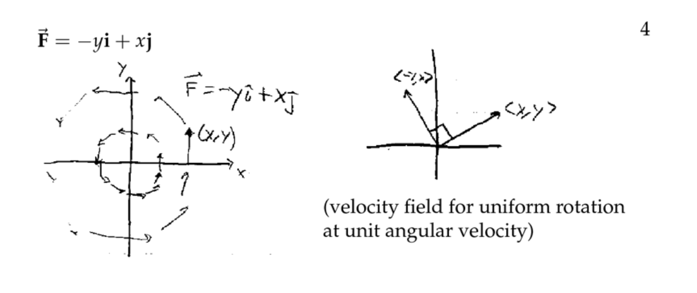

## 1.2 向量场的连续性
:::info
我们知道向量函数$\bf r(t)=\langle x(t),y(t),z(t)\rangle$的连续性条件是: 

下图给出了一个连续向量函数的例子，他描述了一个空间曲线。

:::
> 那么一个向量场的连续性的定义是什么呢？
> 因为向量场和向量函数是一个东西，上面我们也说过，所以向量场的连续性就是向量函数$\bf F(x,y)=\langle M(x,y),N(x,y)\rangle$的连续性，所以只要$\bf  M(x,y),N(x,y)$都是连续多元函数即可。
> **而对于一个多元函数**$w(x,y)$**, 其连续性的定义是:**
> 设多元函数$w(x,y)$在点$(x_0,y_0)$处有定义且该处函数值$w(x_0,y_0)$和极限值$\lim_{(x,y)\to (x_0,y_0)}w(x,y)$相等，就称函数$w$在$(x_0,y_0)$处连续，用$\epsilon-\delta$语言叙述是：
设多元函数$w(x,y)$在点$(x_0,y_0)$处有定义，如果$\forall \epsilon>0,\exist \delta>0$，当$0<||\langle x-x_0,y-y_0\rangle||<\delta$时有$0<|w(x,y)-w_(x_0,y_0)|<\epsilon$，我们就$w(x,y)$在$(x_0,y_0)$处连续。写作$\lim_{(x,y)\to x_0,y_0}w(x,y)=w(x_0,y_0)$
> 这意味着在某个点$(x_0,y_0)$附近的向量$\bf F(x,y)$,其大小和方向都应该很接近$\bf F(x_0,y_0)$, 换句话说，当我们在$\bf F$构成的连续向量场中自由移动时，向量在$(x_0,y_0)$附近的方向和模长变化都应该很平缓，而不是发生模长和方向的突变

## 1.3 向量场的可微性
> 如果一个向量函数$\bf F(x,y)=M(x,y)i+N(x,y)j$, 满足在某个区域内$\bf M(x,y)$和$\bf N(x,y)$都可微, 即$\frac{\partial M}{\partial x}$,$\frac{\partial M}{\partial y}$,$\frac{\partial N}{\partial x}$,$\frac{\partial N}{\partial y}$均存在，我们就说向量场$\bf F$是可微的。
> 进一步，如果$\frac{\partial M}{\partial x}$,$\frac{\partial M}{\partial y}$,$\frac{\partial N}{\partial x}$,$\frac{\partial N}{\partial y}$均在某个区域内连续，则向量场$\bf F$是连续可微的, 在后续的梯度场介绍中，我们会进一步利用向量场的可微性来判断其是否为保守场。一般而言，所有我们常用的向量场都是连续可微的，除了某些孤立点，或者沿着某条特定的曲线。

# 2 梯度场初步⭐⭐⭐⭐⭐
> 在深度学习和工程领域，梯度场是我们的常客，我们在此进行剖析

## 2.1 定义
> 对于一个可微的二元函数$w=f(x,y)$, 其在点$(x,y)$处的梯度向量$\nabla w=\frac{\partial w}{\partial x}\mathbf{i}+\frac{\partial w}{\partial y}\mathbf{j}$是一个向量场, 因为$\frac{\partial w}{\partial x}$和$\frac{\partial w}{\partial y}$都是是关于$x,y$的函数(假设$x,y$为自变量)。
> 回忆一下当初关于梯度的定义[梯度的定义](https://www.yuque.com/alexman/tn6ya7/kaomwu#Nh8ce)和[方向导数的定义](https://www.yuque.com/alexman/tn6ya7/kaomwu#KLw7B)，我们有如下的几何视角解读：
> 

## 2.2 梯度场和当等高线
> 
> 梯度场垂直于等高线。

## 2.3 算例
> 

# 3 力场和速度场⭐⭐⭐
## 3.1 力场
> 在物理中我们有静电场(由电荷激发)和引力场（由带质量的物体产生）,我们把这类向量场统称为力场

### 3.1.1 静电场
> 
> 如果我们要求向量场中任意一点处的向量$\bf F(x,y)=\langle M(x,y),N(x,y)\rangle$, 我们需要知道在$(x,y)$点处向量的大小和方向分别是什么
> 首先，题中已经告诉我们向量的大小是$\frac{c}{r^2}$, 方向比较隐晦，在电磁学中，我们知道，一个放在原点的正电荷会产生辐射向外的电场力，方向是原点和点$(x,y)$的连线方向。
> 有了向量方向之后，我们写出这个方向上的单位向量$\bf T=\langle \frac{x}{r},\frac{y}{r}\rangle$  ,因为$r=\sqrt{x^2+y^2}$
> 用模长乘以$\bf T$得到$\mathbf{F}=\frac{c}{r^2}\mathbf{T}=c\frac{x\mathbf{i}+y\mathbf{j}}{(x^2+y^2)^{\frac{3}{2}}}$

> 课本上还有一个静电场的例子, 说的是库仑定律:
> 

## 3.2 流场与速度场
### 定义
> 向量场的第二个应用是流场，我们有`**Steady-State Flow Field**`和`**Velocity Field**`**来描述一个流体不同位置的状态和状态变化趋势。**
> 
> 我们使用一个**速度场**$\mathbf{v}(x,y)$来代表流体中的某一点$(x,y)$所代表的的流动方向，其模长就是流速大小。
> 从速度场$\bf v$我们可以推导出**流量场**$\mathbf F=\delta(x,y)\mathbf v(x,y)$**，其中**$\delta (x,y)$**给出了流体在**$(x,y)$**位置的密度(**`**质量/体积**`**)**
> 
> 假设$\delta(x,y)$恒大于零，$\bf F(x,y)$由下面的推导过程给出:
> 
> 
> - $|\bf F|$**含义是单位时间单位横截面运输的流体的质量(流量)大小**
> - $\bf F$含义是流体运动方向
> 

> 下图展示了一个`Flow Field`的样子:
> 

> 课本上的例子:
> 
> 

## 3.3 将向量场解释为力场⭐
> 

**解释为流场**这个向量场被定义在除了$(0,0)$以外的任何地方，方向是过原点和$(x,y)$的直线的方向，假设$r=\sqrt{x^2+y^2}$, 表示$xy$平面内任意一点到原点的距离。他的模长$\bf |F|$为$\mathbf{|F|}=\sqrt{\frac{x^2}{(x^2+y^2)^2}+\frac{y^2}{(x^2+y^2)^2}}=\frac{r}{r^2}=\frac{1}{r}$, 这表示，在$(x,y)$点处的液体流量为$\frac{1}{r}$
于是我们考虑任意一点$\bf P$, $\bf P$距离原点的距离为$a$, 则在$\bf P$点处的流量大小为$\frac{1}{a}$，且$\bf P$在圆周$x^2+y^2=r^2$上, 所以流量方向就是半径方向。
于是单位时间流过圆周的流量为$\frac{1}{a}\cdot 2\pi a=2\pi$
我们可以想象一下，有一个水管在圆筒型水缸中央往外流水，单位时间以圆环的形式每秒往外输送$2\pi$质量的水。

而我们又知道$\bf |F|=\delta |v|=\frac{1}{r}$，这时候我们对不同性质的流体进行讨论：

1. 如果流体是不可压缩的，比如水，它的密度$\delta(x,y)$是恒定的，所以随着水距离原点的距离增加，其流速会变慢。
2. 如果流体是可以压缩的，比如气体，它的流速$v(x,y)$会是恒定的，所以他的密度$\delta (x,y)$就不是恒定的，而是会以$\frac{1}{r}$的速度减小
**解释为静电场**假设我们的$z$轴是一条无限长的导线，上面充斥着均匀分布的正电荷，它会在我们的三维空间中产生一个静电场。在$z$轴的不同高度上都有相同的电场。根据辐射对称性，所有向量场中的向量的$\bf k$分量都是$0$，且向量的大小只取决于其距离导线的辐射半径$r$。实际上通过一些物理学的推导，我们可以说这个静电力场就是$\bf F$的常数倍。
这样的向量场是二维的(因为向量场中的向量的$\bf k$分量都是$0$)。换句话说，一旦我们知道了$xy$平面中向量场的形式，我们就知道了三维空间中的向量场的形式。
同时，这个向量场中的向量模长以$\frac{1}{r}$的速度递减，就好像所有的电荷都在原点上一样。

**解释为引力场**场中向量的方向和静电场相反(因为是引力)

## 3.4 找到速度场
> 

**Key**

## 3.5 书上的例子
### 垂直场
> 

**Key**

#### 

### 引力场
> 
> 
> 

## 3.6 例子
### P1 画出向量场
> 

**Key**

### P2 梯度场
> 

**Key**

# 4 (曲)线积分⭐⭐
:::info
我们之前定义过一个曲线的长度公式`Arc Length Formula`, $\int_C|\mathbf{r'(t)}|dt$, 这里我们定义一个和曲线长公式类似的概念，称为曲线积分，用符号$\int_C\mathbf{\vec{F}}\cdot d\mathbf{\vec{r}}$表示
:::
[Work and Line Integrals.pdf](https://www.yuque.com/attachments/yuque/0/2022/pdf/12393765/1660288201038-b0c8180a-3679-4d25-9281-3f1f25d3792e.pdf)
## 4.1 功
### 4.1.1 从微元的角度理解
> 
> 我们从`Riemann Sum`的角度理解：
> 
> 

### 4.1.2 求沿曲线的做功
> 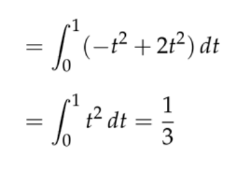

## 4.2 (曲)线积分(Line Integrals)
### 4.2.1 定义
> 

### 4.2.2 计算曲线积分完整流程
> 
> 
> 虽然我们将积分写成这种形式，但实际上，他还是$\bf \int_C\vec{F}\cdot d\vec{r}$, 只是这里$\frac{d\mathbf{\vec{r}}}{dt}=\langle \frac{dx}{dt},\frac{dy}{dt}\rangle,\mathbf{\vec{F}}=\langle x^2y,x-2y\rangle$, 所以$\int_C\vec{\mathbf{F}}\cdot \mathbf{d\vec{r}}=\langle x^2y,x-2y\rangle\cdot \langle dx,dy\rangle$
> 就有了上面的表达式。

**1. 求出曲线参数方程**
**2. 计算关于参数t的微分, 转换成关于dt的积分**
**3. 代入公式求解**

### 
### 4.2.3 曲线积分的性质和记号
#### 4.2.3.1 记号
> 

#### 4.2.3.2 重要性质
##### Path Dependence
> 假设向量场为$\vec{\mathbf{F}}=\langle xy,x^2+y^2\rangle$
> 在不同的参数曲线上计算$\bf \int_C\vec{F}\cdot d\vec{r}$
> 

**(a)**参数化曲线$C$:$\begin{cases} x=1+t\\y=1+3t \end{cases},0\leq t\leq 1$
关于$t$求微分: $\begin{cases} \frac{dx}{dt}=1\\\frac{dy}{dt}=3\end{cases}$
代入积分公式: $\int_C\mathbf{F}\cdot d\mathbf{\vec{r}}=\int_C\mathbf{F}\cdot \frac{d\mathbf{\vec{r}}}{dt}dt=\int_C\langle xy,x^2+y^2\rangle\cdot \langle \frac{dx}{dt},\frac{dy}{dt}\rangle dt=\int_C\langle xy,x^2+y^2\rangle\cdot \langle 1,3\rangle dt=\int_Cxy+3x^2+3y^2 dt=\int_0^133t^2+28t+7dt=32$
**(b)**这个曲线不是很好参数化，我们采用分段求积分
左半支:

上半支：

> 我们看到，不同路径的选取得到了不同的结果。这里要提一下，对于一个非梯度场(保守场)，我们是没有`Path Independence`的，这个后续会详细讲到。

##### Parametrization Independence
> 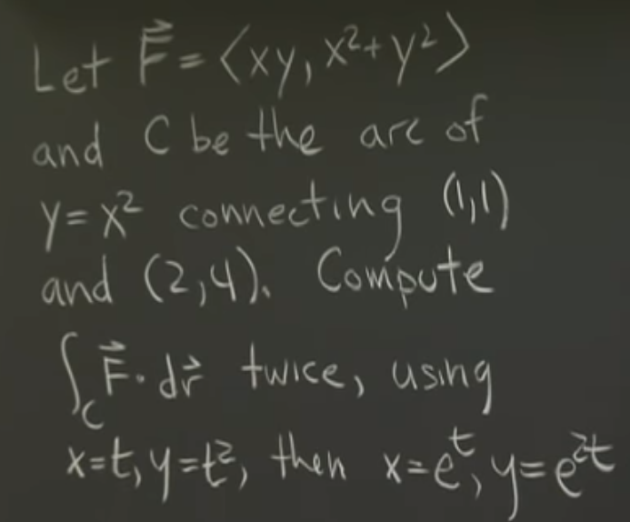

**第一种参数化**
**第二种参数化**
> 二者答案都是$\frac{129}{4}$, 体现了曲线积分和曲线参数化形式无关。所以我们倾向于选择较为简单的参数化方式。

### 4.2.4 几何法求曲线积分
[Geometric Approach to Line Integrals.pdf](https://www.yuque.com/attachments/yuque/0/2022/pdf/12393765/1660293816397-58e5f6e3-ef7c-4477-87b1-392f72b3dccc.pdf)
#### 4.2.4.1 Intrinsic Formula
> 

#### 4.2.4.2 两种方法比较
> 
> 

**使用常规代数方法**
**使用Intrinsic Formula**

#### 4.2.4.3 两个几何法算例
> 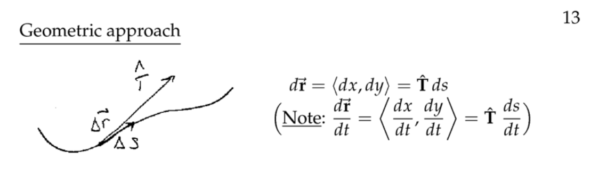
> 
> 
> 

### 4.2.5 算例
#### E1 不同的路径
> 
> 

#### E2 不同的参数化方式
> 

#### E3 分段曲线积分⭐⭐
> 

### 4.2.6 练习
#### E1 分段曲线积分
> 

**Key**

#### E2 画出向量场
> 

**Key**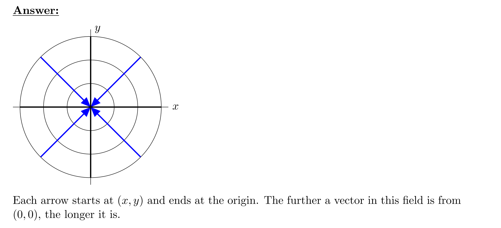
这就是一个引力场

#### E3 几何法求曲线积分
> 

**Key**

#### E4 几何法求曲线积分 2
> 

**Key**

## 4.3 曲线积分计算做功
:::success
本小节和`4.2.4`中一样，我们采用几何法简化曲线积分的运算。
:::
### 4.3.1 完整案例
:::success

:::

### 4.3.2 练习
> 

**(a)**
**(b)**

## 4.4 总结⭐⭐⭐⭐
:::info
**在这个版块中，我们主要探究了功的曲线积分的物理意义和四种视角的理解：**
假设质点处在一个向量场$\bf F$中，沿着曲线$C$运动

1. **理解为做功**: 此时$\bf \vec{F}$理解为力场，则曲线积分是$\int_C \mathbf{\vec{F}}\cdot d\mathbf{\vec{r}}$表示力场对质点做的功，此时积分微元是$d\mathbf{\vec{r}}$, $\mathbf{\vec{F}}\cdot d\mathbf{\vec{r}}$就是$|\mathbf{\vec{F}}||d\mathbf{\vec{r}}|cos\theta$, 表示力沿着位移方向的分量乘上唯一大小，就是功的定义。
2. **理解为一个关于**$t$**的积分: **此时$\mathbf{\vec r}$被看做是参数曲线$\langle x(t),y(t),z(t),...\rangle$, 曲线积分变为$\int_C \mathbf{\vec{F}}\cdot d\mathbf{\vec{r}}=\int_C \mathbf{\vec{F}}\cdot\frac{d\mathbf{\vec{r}}}{dt}dt=\int_C \mathbf{\vec{F}}\cdot \mathbf{r'(t)}dt$, 此方法面对较为复杂的参数曲线较为常用。使用此方法时要特别注意参数化之后$t$的取值变化必须和曲线$C$上的质点运动方向一致。因为线积分对方向是敏感的。
3. **理解为一个关于**$s$**的积分: **$\int_C \mathbf{\vec{F}}\cdot d\mathbf{\vec{r}}=\int_C \mathbf{\vec{F}}\cdot\frac{d\mathbf{\vec{r}}}{dt}dt=\int_C \mathbf{\vec{F}}\cdot \mathbf{\vec{v}}dt=\int_C \mathbf{\vec{F}}\cdot \mathbf{\hat{T}}\mathbf{|\vec{v}|}dt=\int_C \mathbf{\vec{F}}\cdot \mathbf{\hat{T}}ds$**，**此方法一般用于快速确定积分的有效性，可以省去一些不必要的计算
4. **理解为关于**$x,y$**的积分，梯度视角（**`**Component Notation**`**）**

这种理解是建立在$\bf \vec{F}$是一个**梯度场**的前提下的。因为$M=f_x, N=f_y$且$M_y=N_x$	, 其中$f$就是我们的梯度函数，也叫作势能函数
$\mathbf{\vec{F}}=\langle M(x,y),N(x,y)\rangle$,$d\mathbf{\vec{r}}=\langle dx,dy\rangle$, 所以$\int_C \mathbf{\vec{F}}\cdot d\mathbf{\vec{r}}=\int_CMdx+Ndy$
别看我们有$dx$和$dy$两个积分符号，由于保守场的路径无关性，对于任意两点之间的曲		线积分我们不需要关心$C$的具体路径，只需要关心端点处的势能函数值即可。马上在下		面就会介绍。
以上所有的积分都是方向敏感的，也就是说，我们在将曲线进行参数化的时候要注意我们的起点和终点，积分下限是起点，积分上限是终点。
:::

# 5 曲线积分基本定理⭐⭐⭐⭐⭐
[Fundamental Theorem for Line Integrals.pdf](https://www.yuque.com/attachments/yuque/0/2022/pdf/12393765/1660382772836-2bf239f8-95dd-4ae3-b1e0-3d466fd4f10a.pdf)
:::info
本章节我们将介绍曲线积分基本定理，包括梯度场的曲线积分路径无关性，和势能函数等，都是物理学中常见的概念。
:::

## 5.1 梯度场和势能函数
:::info

如果可行的话，我们可以从梯度场反推出其对应的势能函数，然后通过势能来求解曲线积分。这是本章将要介绍的另一个看曲线积分的视角。
:::

## 5.2 曲线积分基本定理⭐⭐⭐⭐
### 5.2.1 定义
:::info

这个定理告诉我们，对于一个梯度场(切记只能是梯度场)，在其中沿着两个固定点之间的任意一条曲线$C$运动的质点，其做的功和曲线$C$的形状无关，只和起点与终点有关
换句话说，如果我们面前有一个向量场$\bf F$,如果我们能够知道该向量场对应的势能函数$f$, 使得$\nabla f=\bf F$，就可以将曲线积分进行化简，只关心曲线的端点位置的势能值$f(x,y,z,...)$, 来求解曲线积分。
:::
**图例**

### 5.2.2 证明
:::info

公式的证明非常的重要，这几乎将我们之前所学的梯度，偏导数的相关概念做了一个汇总。
:::

## 5.3 路径无关性与保守性⭐⭐⭐
:::info
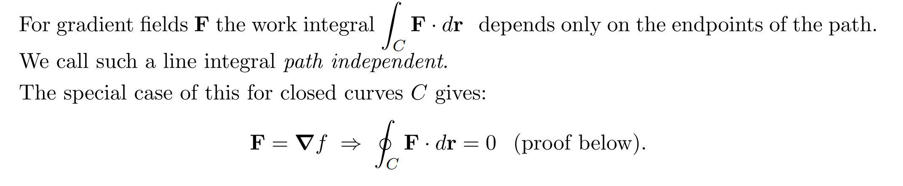
这里介绍了一个新的积分符号，针对于一个闭合的曲线的积分可以表示为$\oint_C\mathbf{F}\cdot d\mathbf{r}$
在经典力学中，我们知道保守力绕着闭合曲线运动的质点不做功。

这里说的是，在`Connected-Region`(`No holes`)上，任何一个梯度场都是保守场，此时梯度场和保守场是等价说法。

:::

## 5.4 微分视角重述基本定理
:::info

:::

## 5.5 证明路径无关性=保守场
:::info

这里要注意，由于我们的线积分对于方向是敏感的，所以我们在描述图$2$中的闭合曲线的时候应当使用$C_1-C_2$来描述。同时你可能会想$\oint_{C_1-C_2}\mathbf{F} \cdot d\mathbf{\vec{r}}=\int_{C_1}\mathbf{F}\cdot d\mathbf{r}-\int_{C_2}\mathbf{F}\cdot d\mathbf{r}$为什么成立?, 因为线积分的物理含义是向量场中沿着曲线运动的质点克服保守力做的功，而力的功和质点运动方向有直接关系，所以在描述$C_1$曲线上的功时前面要加上负号，因为我们在描述图$2$中的闭合曲线时，方向和图中的$C_1$曲线上的质点运动方向相反。
换句话说，如果一个向量场是保守的，他一定有路径无关性。反之，如果一个向量场有路径无关性，他一定是保守场，也就一定是一个梯度场(在`Connected Region`上)。
:::
> 如果我们面前有一个梯度场(在`Connected Region`上也是保守场)，我们对这个梯度场进行一些奇怪的变换，得到的新的向量场可能就不具有保守性了。

## 5.6 判断向量场是否保守
> 

:::info
**梯度场和保守场在**`**Connected-Region**`**上是等价说法。**

如果在某个向量场$\bf F$中我们对某个闭合曲线进行`Line Integral`之后发现积分结果不是零，则这个向量场不是保守场，也就不具有路径无关性和曲线积分基本定理。
:::

## 5.7 算例⭐⭐⭐
### 算例1
:::info

:::
**图例**

### 算例2⭐⭐⭐⭐⭐
:::info
假设$f(x,y)=x^5+3xy^3$, 曲线$C$是`Upper semi-circle from` $(1,0)$`to`$(-1,0)$

1. 计算$\mathbf{\vec{F}}=\nabla f$
2. 用三种方式计算$\int_C\mathbf{\vec{F}}\cdot d\mathbf{\vec{r}}$(参数曲线，路径无关性，曲线基本定理)
:::
**计算梯度场**$\nabla f=\langle f_x,f_y\rangle=\langle 5x^4+3y^3,9xy^2\rangle$
**利用参数曲线法**令$x=cost,y=sint,0\leq t\leq \pi$
代入$\int_C\mathbf{\vec{F}}\cdot d\mathbf{\vec{r}}$中我们有: $\int_0^{\pi}\langle 5cos^4t+3sin^3t,9costsin^2t\rangle\langle -sint,cost\rangle dt$, 计算过程省略，答案是:$-2$
**利用路径无关性**根据保守场的路径无关性，我们可以计算端点间任意一条曲线的积分，因为结果都一样。
所以我们计算$C_2$的`Line Integral`
我们写出表达式$\mathbf{\vec{r}}(t)=\langle -t,0\rangle,-1\leq t\leq 1$
$\int_{C_2}\mathbf{\vec{F}}\cdot d\mathbf{\vec{r}}=\int_{-1}^1\langle 5t^4,0\rangle\langle -1,0\rangle dt=\int_{-1}^1-5t^4 dt=-2$
**利用曲线基本定理**$\int_C\mathbf{\vec{F}}\cdot d\mathbf{\vec{r}}=\int_{C}\nabla f\cdot d\mathbf{\vec{r}}=f(-1,0)-f(1,0)=-2$

## 5.8 练习⭐⭐⭐⭐⭐
### E1 不同视角下的曲线积分
> 

**(a)**
**(b)**

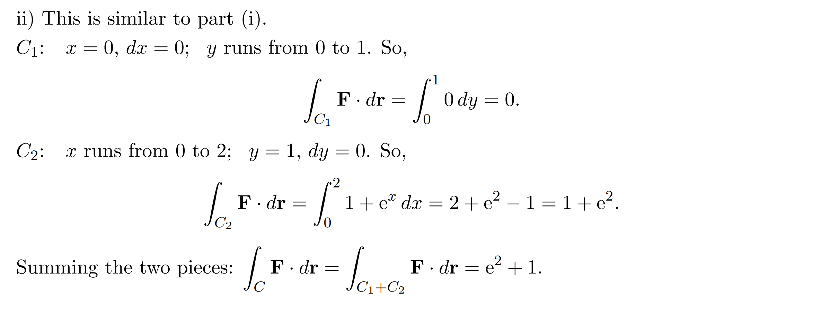

**(c)**

###  E2 非保守场
> 

**1. Compute the line integral along the path that goes from (0, 0) to (1, 1) by first going along the x-axis to (1, 0) and then going up one unit to (1, 1).  **
**2.** **Compute the line integral along the path from (0, 0) to (1, 1) that first goes up the y-axis to (0, 1).  **
**3. Should you expect your answers to the preceding problems to be the same? Why or why not?  **
**4. Compute the line integral of F along a path that runs counterclockwise around the unit circle.  **
**5. Should your answer to the previous problem be 0? Why or why not  **

### E3 判断保守性
> 

**1.  Compute the line integral along the path that goes from (0, 0) to (1, 1) by first going along the x-axis to (1, 0) and then going up one unit to (1, 1).  **
**2.  Compute the line integral along the path from (0, 0) to (1, 1) which first goes up the y-axis to (0, 1).  **
**3.  Compute the line integral of F along the line segment from (0, 0) to (1, 1).  **
**4.  Is the vector field F = (0, x) conservative? How do you know? ** 

# 6 代数视角的保守场⭐⭐⭐⭐⭐
[Gradient Fields and Exact Differentials Part 1.pdf](https://www.yuque.com/attachments/yuque/0/2022/pdf/12393765/1660401990595-f1eb8694-8262-45aa-9dd0-1bb918caa12f.pdf)
[Gradient Fields and Exact Differentials Part 2.pdf](https://www.yuque.com/attachments/yuque/0/2022/pdf/12393765/1660401990681-86d7a5c9-314c-4204-82ba-f2346841d5bb.pdf)
## 6.0 Plane Set Basics
### 6.0.1 Open Set and Connected Set
> We assume that a set$D$is open, which means that for every point $P$ in $D$there is
> a disk with center $P$that lies entirely in $D$. (So doesn't contain any of its boundary
> points.) In addition, we assume that $D$is connected. This means that any two points in 
> can be joined by a path that lies in $D$ .
> 
> 这属于实数分析的内容，我们在本课程笔记中不做展开介绍。

### 6.0.2 曲线类型
> `Simple Curve`: 一个不和自己相交的曲线(类比贪吃蛇)
> 

### 6.0.3 区域类型
> `**Simply-connected Region**`:  every simple closed curve $C$in $D$ encloses only points that are in $D$. 就是这个区域内没有洞或者割裂。
> 

## 6.1 如何判断向量场保守⭐⭐⭐
> 
> 在我们介绍格林定理之前，这个判断准则似乎非常的复杂，因为有时候闭合曲线的线积分非常的难求，更别说对所有的闭合曲线$C$都去验证一下线积分是否为零。所以我们需要一些更直觉的判断方法，从偏导数的视角出发，我们将会给出**两个判断向量场保守的准则。**

## 6.2 判断保守性的准则⭐⭐⭐⭐
### 6.2.1 准则⭐⭐⭐⭐⭐
> **保守场的性质：**
> 
> **判断保守场的准则:**
> 
> **对应简化定理及证明:**
> 
> 
> 这些准则告诉我们一个向量场在某个`Open,simple-connected Set`上是否是保守的，但没有告诉我们怎么具体求出这个向量场对应的势能函数是什么。
> 我们在运用准则的时候要特别注意$D$是否是`Open,simple-connected set`, 否则就不能使用这个判定准则$(2)$和$(4)$。一般我们会假设$D$是整个$xy$平面, 因此这两个准则都可以使用。

### 6.2.2 算例
#### 书上的例子
##### 例1
> 

##### 例2
> 

#### 讲义中的例子
##### 例1 判断保守场
> 给定保守场判定准则:
> 
> 
> 
> 由于$M_y,N_x$在$D$上都有定义，所以可以使用简化准则判断。

##### 例2 无法使用准则的情况
> 给定保守场判断准则:
> 
> 
> 
> **我们看到，尽管**$curl\space =0$**在**$\bf F$**和**$\bf G$**的定义域**$D=R^2-(0,0)$**上成立，但我们不能说**$\bf G$**就是保守场，原因就是我们在计算那些包含原点**$(0,0)$**(也就是**$\bf G$**没有被定义的地方) 的闭合曲线上的线积分时，一般情况下可能会出现非零的结果，导致**$\bf G$**的保守性无法判断，等我们学到格林定理时会有关于这个问题的更详细的说明。**

## 6.3 势能函数⭐⭐⭐⭐
> 本小节我们探究通过保守场的表达式如何逆向求出其势能函数

### 6.3.1 通过积分求解
> 
> $f(x,y)$在数学上被称为势能函数, 在物理学中如果该函数要被使用，则一般会在前面加上负号，用于表明势能差等于克服保守场做的功。
> 这个方法偏物理直觉，说的是克服保守场做功等于势能函数的变化量。这种方法利用了`Line Integrals`的最本质的意义，在高维空间同样直观清晰。

### 6.3.2 算例⭐⭐
> 给定保守场判断准则
> 
> 

**Key**$M=x+y^2,N=2xy+3y^2$
由于$\bf F$被假定是一个保守场，我们验证偏微分$M_y=N_x$
简单计算可得$M_y=N_x=2y$
然后我们使用积分求解$\bf F$对应的势能函数:

这里的$f(x_0,y_0)$可以任意选取，只要$f(x,y)$在$(x_0,y_0)$处有定义
然后关于这个积分的求法，由于$\bf F$是保守场，所以我们可以选取从$(0,0)$到$(x_1,y_1)$中间的任意曲线路径来求解积分，怎么简单怎么来:
我们不妨使用右图中的路径, 
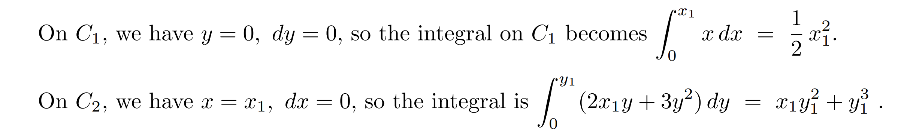
然后将两个路径上的积分数值加和并且加上常数$c=f(0,0)$得到:

### 6.3.3 通过反导数求解
> 
> 我们相当于要解$\begin{cases} f_x=M\\f_y=N\end{cases}$这个偏导数方程。我们仍然可以使用积分求解目标反导数。
> 这个方法不需要任何`Line Integrals`的知识背景，所以受到学生欢迎，但是在高于三维的情况下计算反梯度就会显得较为困难。

### 6.3.4 算例⭐⭐⭐
> 
> 该算例涉及到对偏导数求积分，比较重要

**Key**我们求解$\begin{cases} f_x=M=x+y^2\\f_y=N=2xy+3y^2\end{cases}$
首先是$f_x=M=x+y^2$

然后是联立$f_y=N=2xy+3y^2$和对上面得到的$f=\frac{1}{2}x^2+y^2x+g(y)$对$y$求偏导:

最后我们比较两个结果的系数, 对$y$求不定积分，得到最终的函数:

## 6.4 精确微分⭐⭐
### 6.4.0 前言
> 之前我们在`Line Integrals`的被积函数的表达式: 
> $M(x,y)dx+N(x,y)dy$, 被称为`**Differentials**`
> 在热力学的应用中，我们对于$\int_C \mathbf{\vec{F}}\cdot d\mathbf{\vec{r}}$这个积分往往不是从$\mathbf{\vec{F}}=M\mathbf{i}+N\mathbf{j}$的角度出发的，而更多的是将$\int_C \mathbf{\vec{F}}\cdot d\mathbf{\vec{r}}$转换成$\int_C \mathbf{\vec{F}}\cdot d\mathbf{\vec{r}}=\int_CMdx+Ndy$作为一个单纯的线积分的形式来求解的。
> 所以本小节我们将把向量场用微分的语言来描述，希望建立起一个联系。

### 6.4.1 定义
> 
> 
> **换句话说就是:**
> 

### 6.4.2 将判断保守场的准则改写
> **这是原来的向量场视角描述的准则:**
> 
> 
> **这是精确微分视角描述的准则:**
> 

## 6.5 二维卷曲(Curl)⭐⭐⭐⭐
> 
> **对于一个保守场来说，curl**$\mathbf{F}=0$**。但一般而言，如果**$curl \space \bf F=0$**, 不能说**$\bf F$**就是保守场，需要结合**$\bf F$**的线积分是否在**$D$**上均为零来判断。**
> 
> 
> 
> 

## 6.6 物理学应用⭐⭐
> 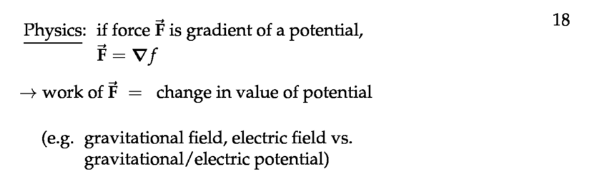
> 
> 
> 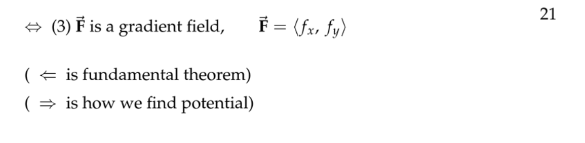
> 

## 6.7 练习
### E1 判断保守性
> 

**Key**

### E2 计算精确微分
> 

**Key**

### E3 计算curl
> 
> 

**(a)**
**(b)**
**(c)**

### E4 求势能函数
> 

**使用曲线积分**
**使用反导数**

### E5 求势能函数2
> 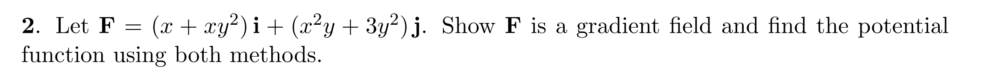
> 

**使用曲线积分**
**使用反导数**

### E6 二维卷曲与2倍角速度⭐
> 

**Key**

## 6.8 总结
> 本章主要介绍了向量场保守性的判断准则, 这里做一个小节。
> **首先如果一个连续可微的向量场**$\mathbf F=\langle M,N\rangle$** 定义在所有的**$R^2$**上, 那么我们可以使用:**
> 1. 如果$M_y=N_y$对所有$(x,y)\in R^2$都成立，则$\bf F$是保守场
> 2. 如果$curl\space F=N_x-M_y=0$对所有$(x,y)$都成立，则$\bf F$是保守场
> 
**如果一个连续的向量场**$\mathbf F=\langle M,N\rangle$**定义在**$D$**上(**$D$**不一定要是**$R^2$**), 则:**
> 1. 如果$\oint_C \mathbf{F}\cdot d\mathbf{\vec{r}}=0$对任何`Simply-connected Curve`都成立，则$\bf F$是保守场

 

