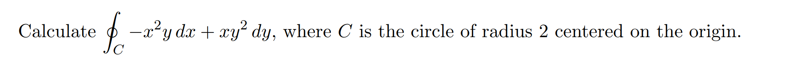
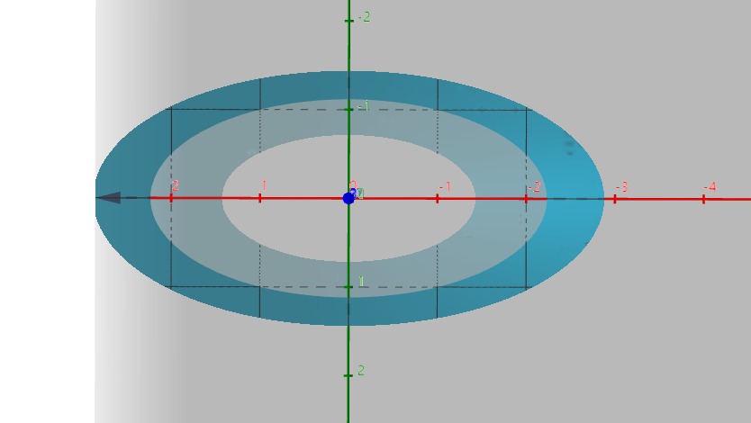
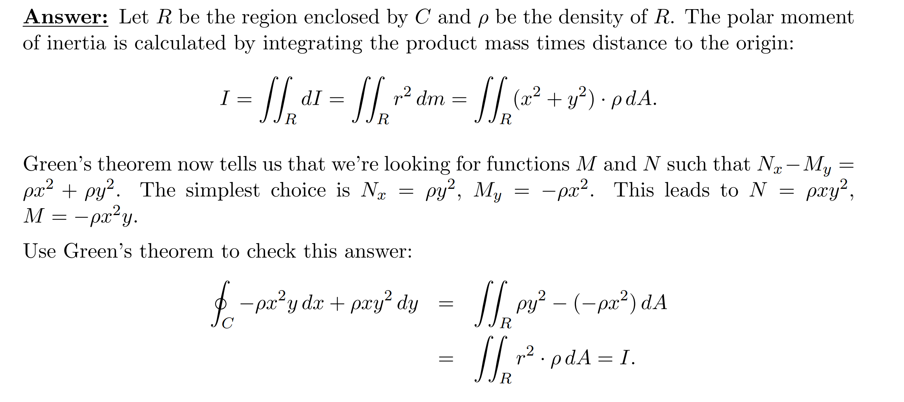
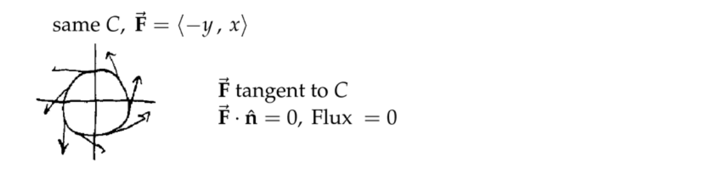
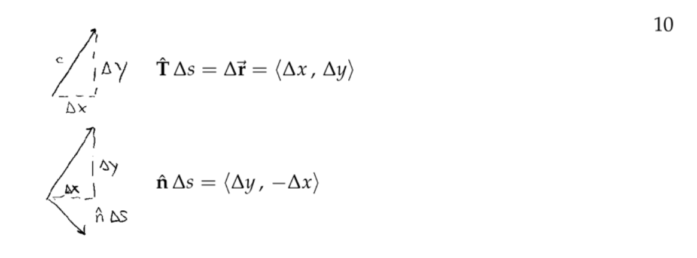
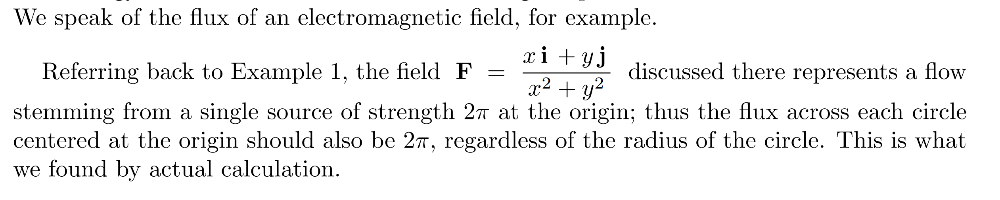
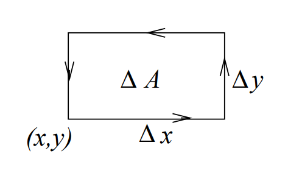
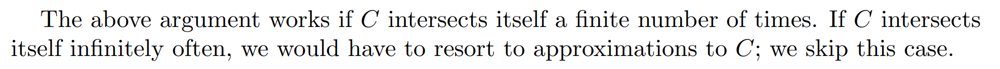
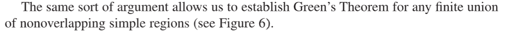

# 0 前言
> 前文我们学习过对于一个**封闭曲线**$C$来说，要求$\oint \mathbf{\vec{F}}\cdot d\mathbf{\vec{r}}$, 我们只能对其傻傻的求积分，如果正好碰到$\bf \vec F$是一个梯度场, 那么此积分数值为$0$。如果$\bf \vec{F}$不是梯度场呢？我们有没有更直观清晰的方法呢？
> 答案就是格林定理，他将一个**任意向量场**在**闭合曲线**上的**曲线积分**转化为关于该**向量场的卷曲**的**二重积分**。对于梯度场来说，其卷曲就是$0$, 故积分曲线积分为$0$.

# 1 Green Theorem(Line Integral)
[Green's Theorem and Conservative Field.pdf](https://www.yuque.com/attachments/yuque/0/2022/pdf/12393765/1660825799424-5160a04f-ac75-4a42-8796-96973ba1d890.pdf)
## 1.1 使用条件⭐⭐⭐⭐⭐
> 
> 注意，还有一个使用格林定理的前提条件，就是我们的**向量场**$\bf \vec{F}$**必须在闭合曲线内部处处有定义(**$\mathbf{F}$**最好在**$R$**上是**`**Continuously differentiable**`**的)**，下面的例子在$(0,0)$处没有定义，因为$(0,0)$正好在我们的闭合曲线$C$中，所以我们无法使用格林定理。但这并不意味着我们不能计算线积分了，因为线积分的定义和 **其内部区域有没有未定义的点** 没什么关系。
> 

> **总的来说，**`**Green Theorem**`**的使用条件:**
> 1. 曲线$C$是`Simple Curve`(`No self-interaction`的)
> 2. 曲线$C$围成的区域$R$是`Simply-connected`的，内部没有`holes`
> 3. 向量场$\mathbf{\vec{F}}$在$R$上处处有定义，且最好是`Continuously Differentiable`的。

## 1.2 格林定理⭐⭐⭐⭐
> 
> 可以看到，格林定理将一个向量场$\bf \vec{F}$在闭合曲线$C$上的线积分转化为一个二重积分，积分区域就是闭合曲线内部区域$\bf R$。
> 格林定理的意义在于，他将一个`Positively Oriented`的**有向**闭合曲线的**线积分**转换为了一个**无向**的闭合曲线内部的面积上的总卷曲(**二重积分**)。

## 1.3 使用格林定理求闭合线积分⭐⭐
### 1.3.1 思想⭐⭐⭐⭐⭐
:::info

总的来说，格林定理可以很快求出积分面积, 通过$\iint_{R}dA=\oint_{C}-ydx=\oint_C xdy$即可
:::

### 算例1 使用格林定理求面积⭐⭐⭐
> 

**图示**
**Key**我们使用格林定理，所以$I=\iint_R 6x^2y+4x-6x^2ydA=4\iint_R xdA$
回想一下[质心](https://www.yuque.com/alexman/tn6ya7/ge3z2i#kc234)的积分定义: 对于$\iint_R xdA$积分，对其变形为$\frac{1}{\iint_R dA}\iint_R xdA$, 我们可以将其看做是$\delta(x,y)=1$的圆的在质心在$x$轴上的坐标。而我们通过图示的几何形状可以得到$x_{cm}=\frac{1}{\iint_R dA}\iint_R xdA=a$, 因为$\iint_R dA=\pi a^2$（使用极坐标可验证）, 且$\iint_R xdA=\pi a^3$
所以$4\iint_R xdA=4\pi a^3$

### 算例2 求Cycloid和x轴面积⭐⭐⭐
> 

**图示**
**使用势能函数**$\iint_R dA=\iint_R N_x-M_y dA$, 其中$N_x-M_y=1$
于是我们有多种选取$M$和$N$的方式，下面介绍两种:
**第一种:**
$\begin{cases} N_x=1 \\M_y=0   \end{cases}$, 我们取$\begin{cases} M=0\\N=x\end{cases}$
所以$\iint_R N_x-M_y dA=\oint_C Mdx+Ndy=\oint_C xdy=\oint_{C_1}x\cdot 0-\oint_{C_2}xdy$
然后我们将$x,y$的参数形式代入，得到$-a^2\oint_C (sin\theta-\theta)sin\theta d\theta=3\pi a^2$
**第二种:**
$\begin{cases} N_x=0 \\M_y=-1   \end{cases}$, 我们取$\begin{cases} M=0\\N=x\end{cases}$

**使用格林定理的面积法**在一元函数的背景下, 积分区域的面积表示为$\int_{0}^{2\pi}ydx=-\int_{2\pi}^0ydx=-\int_{C_2}ydx$
而$\iint_{R}dA=\oint_{C_2}-ydx=-\oint_{C_2}ydx$
所以$\iint_{R}dA=\int_{0}^{2\pi}ydx=\int_{0}^{2\pi}a(1-sin\theta)a(1-cos\theta)d\theta=3\pi a^2$

### 算例3 结合极坐标
> 

**Key**

### 算例4 求线积分的最小值
> 对于这个线积分: $\oint_C -(x^2y+3x-2y)dx+(4y^2x-3x)dy$, 我们需要求出一个闭合曲线$C$使得这个线积分的值最小。

**Key**首先观察被积函数代表的向量场，可知它的定义域是所有的$(x,y)\in R^2$, 因此我们可以应用格林定理，所以$\iint_R 4y^2-3+x^2-2 dA=\iint_R x^2+4y^2-5 dA$, 所以我们其中$dA=dxdy=dydx$, 于是题目转化为求一个体积，$dA$为积分区域。所以本题的目标转化为了求在积分区域下体积的最小值，注意，如果被积函数为负数，则体积也为负数。

我们令$x^2+4y^2-5=0$找到被积函数在$xy-plane$上的形状，发现是个椭圆，于是我们只要令闭合曲线在$x^2+4y^2=5$这个椭圆之内就可以了。所以最小值在曲线$C$是$x^2+4y^2-5=0$的时候取到。

## 1.4 使用Green和Curl F判断保守⭐⭐
> 
> **想要使用这个定理，**$\bf F$**必须定义在**$R^2$**上，诸如**$\mathbf{F}=\langle \frac{x}{x^2+y^2},\frac{y}{x^2+y^2}\rangle$**的向量场由于在**$(0,0)$**处没有定义，就不能简单的使用**$curl\space F=0$**来判断保守性了，还是需要计算其定义域**$D=R^2-(0,0)$**上所有的闭合曲线**$C$**上的线积分是否均为零来判断保守性。**
> **下面我们用格林定理证明这个准则**

**Proof**
> 
> 注意是`Everywhere in R`, 因为**只要有一个微元**$dA$**对应的**`**Curl**`**不为零，那么积分**$\iint_R curl(\mathbf{\vec{F}})dA$**就不会为零。**
> **同时我们还有一个重要的结论:**
> 
> **这个结论说明了:** **如果我们想要使用**$curl \space \mathbf{\vec{F}}$**来判断向量场**$\bf \vec{F}$**是否保守，必须满足**$\bf \vec{F}$**必须定义在所有**$(x,y)\in R^2$**上，也就是说，对于每一个**$(x,y)$**,都有**$curl \bf \space {\vec {F}}$**被定义且等于零，才能判断向量场保守。 **
> **一般而言，我们希望**$\bf \vec{F}$**在一个**`**Connected Region**`**上均有定义。**

## 1.5 练习⭐⭐⭐
### E1 应用格林定理⭐⭐⭐
> 使用格林定理计算$\oint_C 3x^2y^2dx+2x^2(1+xy)dy$, $C$是如下曲线:
> 

我们发现积分区域面积更好求，所以正向使用格林定理，顺便使用质心的定义$\oint_C 3x^2y^2dx+2x^2(1+xy)dy=\iint_R 4xdA=4\iint xdA=4\pi a^3$

### E2 距离原点的加权距离⭐⭐⭐
> 

**Key****代数视角(利用积分上下限):**
$\oint_C -x^2ydx+xy^2dy=\iint_R y^2+x^2dA=\iint_R r^3drd\theta\newline=\frac{1}{4}(r_2^4-r_1^4)(\theta_2-\theta_1)$
因为$r_2>r_1,\theta_2>\theta_1$（假定$R$的面积不等于零）
则$\oint_C -x^2ydx+xy^2dy=\frac{1}{4}(r_2^4-r_1^4)(\theta_2-\theta_1)>0$
**几何视角(看做是一个密度为常数的区域内的点距离原点的加权平均平方距离):**

### E3 应用格林定理2⭐⭐⭐
> 
> 
> 注意这里的方向, 线积分是方向敏感的。

**Key**

### E4 计算Curl
> 

**Key**看到$r$要敏感。$r^2=x^2+y^2$

### E5 curl F=0 => 保守?⭐⭐⭐
> $\mathbf{F}=\langle -\frac{y}{r^2},\frac{x}{r^2}\rangle$
> 

**Key**因为$\bf F$在$(0,0)$处没有定义，且$(0,0)$恰好在$C$围城的曲线内，所以我们无法通过`Green Theorem`来计算这个曲线积分。
于是我们使用传统的线积分$\oint_C Mdx+Ndy=\oint_C -\frac{y}{x^2+y^2}dx+\frac{x}{x^2+y^2}dy$, 看起来还是很难求，所以我们使用参数曲线法: 

所以我们看到， 一个向量场的卷曲$curl \space \bf F=0$并不能说明该向量场就是保守的，原因就是计算我们在求卷曲的时候使用的$N_x-M_y$涉及到了$M$和$N$的偏导数, 而这个偏导数不一定在所有的$(x,y)\in R^2$中都有定义，比如在这个例子中偏导数$M_y$和$N_x$在$(0,0)$处是没有定义的。
**这也说明了我们不能过度依赖卷曲和格林定理来判断一个线积分是否为**$0$**, 在向量场不连续可微的情况下，还是要小心谨慎一些，从线积分本身的定义出发求值。**

### E6 Tangential Vector Field
> $\mathbf{F}=\langle -\frac{y}{r^2},\frac{x}{r^2}\rangle$
> 

**Key**

### E7 极坐标
> $\mathbf{F}=\langle -\frac{y}{r^2},\frac{x}{r^2}\rangle$
> 

**Key**
此处使用反三角函数导数公式: $\frac{d}{dx}arctan(x)=\frac{1}{1+x^2}$

### E8 找到单位圆的面积
> 

**Key**

### E9 绕着z轴的惯性矩⭐⭐⭐
> 

**Key**

# 2 Green Theorem 证明（Line Integral）
[Green's Theorem, Sketch of Proof.pdf](https://www.yuque.com/attachments/yuque/0/2022/pdf/12393765/1660825861688-f8182bce-8da8-4800-8050-0d560221a10b.pdf)
> 本小节我们将证明格林定理，探究为何一个线积分能够被转化成一个二重积分。

## 2.1 证明思想
> 首先我们得搞明白得证明什么: 我们要证明一个线积分能够表示成一个二重积分:
> 也就是我们要证明$\oint_C Mdx+Ndy=\iint_R (N_x-M_y)dA$等式成立

> 我们可以将这个证明分解成几个子部分:
> 1. 首先我们对被积函数可以进行分解:
> - 证明$\oint_C Mdx=\iint_R -M_ydA$, 其中$N=0.................................................(1)$
> - 证明$\oint_C Ndx=\iint_R N_xdA$, 其中$M=0....................................................(2)$
> 2. 我们也对积分区域可以进行分解:
> 
我们可以对任何形状的积分区域$R$将其切		分成很多比较简单的积分区域, 比如垂直的形态。
> 这样切分的话，两个曲线重叠的部分会被消去，因为方向相反，所		以我们在$C_1$曲线和$C_2$曲线上的线积分可以相加，得到$C$的线积分。
> 3. 所以如果我们能证明$\begin{cases} \oint_{C_1}Mdx=\iint_{R_1}-M_ydA\\ \oint_{C_2}Mdx=\iint_{R_2}-M_ydA\end{cases}$, 就能证明$\oint_{C}Mdx=\oint_{C_1}Mdx+\oint_{C_2}Mdx=\iint_{R_1}-M_ydA+\iint_{R_2}-M_ydA=\iint_{R}-M_ydA$

## 2.2 证明过程
:::info
有了以上铺垫，我们可以开始证明:
首先是对于$\oint_{C}Mdx=\iint_{R}-M_ydA$的证明
**等式左侧:** 如果积分区域$R$在$x=a$和$x=b$时是垂直于$x$轴的, 且$R$对应的曲线是`Positively Oriented`(逆时针方向)的话， 我们有

- $C_1$的线积分: $\int_{C_1}M(x,y)dx=\int_a^bM(x,f_1(x))dx$, 其中$y=f_1(x)$
- $C_3$的线积分:$\int_{C_2}M(x,y)dx=\int_b^aM(x,f_2(x))dx-\int_a^bM(x,f_2(x))dx$, 其中$y=f_2(x)$
- $C_2$的线积分:$\int_{C_2}M(x,y)dx=\int_{C_2}M(x,y)\cdot 0=0$
- $C_4$的线积分:$\int_{C_4}M(x,y)dx=\int_{C_4}M(x,y)\cdot 0=0$

所以$\oint_{C}M(x,y)dx=\int_a^bM(x,f_1(x))dx-\int_a^bM(x,f_2(x))dx$
**等式右侧: **
所以左侧右侧相等，证毕。
:::

# 3 Flux in 2D
[Two-dimensional Flux.pdf](https://www.yuque.com/attachments/yuque/0/2022/pdf/12393765/1660957476293-bb86cce9-a25c-4ab9-b2e1-556941abf1a3.pdf)
## 3.0 前言
:::info
本小节我们介绍一种全新的看待格林定理的视角。我们将展现格林定理在向量场中的重要应用，并且给予其物理意义。
:::

## 3.1 什么是Flux?
:::info
在高中物理中，我们都学过电磁场，或者电场，我们也一定接触过磁感线或者电场线。通常我们用向量表示在空间中某一点的场线方向和大小，此时一个自然而然的想法就是，我们想计算一定区域内有多少这样的向量(磁感线)，我们想把他们收集起来，计算磁场或电场的密度（磁场/电场强度），此时就要使用到`Flux`的概念。

我们首先介绍二维`Flux`, 它实质上是一个**曲线积分**，定义为$\int_C \mathbf{\vec{F}}\cdot \mathbf{\hat{n}}d\mathbf{s}$, 表示通过曲线$C$的场通量大小，其中 $C$是平面中的一个曲线, $\bf F$是我们的向量场， $\mathbf{\hat{n}}$是垂直于曲线$C$的单位向量。如下图所示:
**我们可以类比一下功的定义和**`**Flux**`**的定义:**

:::

## 3.2 Flux 的物理意义
:::info
假设$\bf \vec{F}$是一个速度场(假设是一个流体)，$C$是平面内的一个曲线, 则

:::
> 在[流场和速度场](https://www.yuque.com/alexman/tn6ya7/ppw38w#rnwhq)中，我们定义了`Flow Field`的概念，就是单位时间通过单位横截面的水流质量， 那么在曲线积分的背景下，我们的`Flow`就是单位时间通过曲线$C$的水流质量, 如图所示
> 
> 注意到我们在选取$\bf \hat{n}$（单位向量）的方向时是将曲线单位切向量$\bf T$的方向顺时针旋转$90\degree$得到的，如果向量场$\bf F$的方向和$\bf \hat{n}$的一致，则积分结果为正，这说明了:
> 
> 如果$\bf F$是一个不随时间变化的流场$\mathbf F=\langle C_1,C_2 \rangle$, $C_1,C_2$为常数, 且曲线$C$是一条长为$\bf L$的有向直线段，则单位时间单位横截面积流过的水的质量是：
> $m=(\mathbf F\cdot \mathbf{\hat{n}})L................................................................................................(6)$, 其中$\bf F\cdot \hat{n}$是$\bf F$在$\bf \hat{n}$方向的水平投影，表示在$\bf \hat{n}$方向上单位时间单位横截面积流过的水的质量, 如图所示:。

:::success
这里还有关于$(6)$式的另一种视角的解读, 本质就是计算了有效横截面积(因为垂直于$\bf F$方向没有液体流过。)

:::
 

## 3.3 Flux定义的推导
:::info
我们已经看到，如果$\bf F$是一个向量场，$C$是一个有向曲线，**则**$\bf F$**沿着**$C$**做的功**是$\int_C\mathbf F\cdot d\mathbf r=\int_C\mathbf{F\cdot T}ds$。也就是说我们在沿着$C$对$\bf F\cdot T$积分。
如果我们写成`Component Notations`, 有$\int_C Mdx+Ndy=\int_{t_0}^{t_1}(M\frac{dx}{dt}+N\frac{dy}{dt})dt$

在求功的式子中，我们沿着$C$对$\bf F\cdot T$积分, 那么求`Flux`的式子呢? 我们转而求$\bf F\cdot \hat{n}$沿着曲线$C$的积分，推导过程如下:
假设我们的参数曲线是$r(t)=\langle x(t),y(t)\rangle$, 我们对其重新参数化为关于$s$(`Arc Length`)的向量函数，得到$\mathbf r(s)=x(s)\mathbf i+y(s) \mathbf j$, $\mathbf t(s)=\frac{dx}{ds}\mathbf i+\frac{dy}{ds}
\mathbf j$, 其中$\bf t$是$\bf T$(`Tangent Vector/Velocity Vector`)的标准化形式(长度为$1$, 原因是$ds=\sqrt{(dx)^2+(dy)^2}$)。
有了沿着曲线$C$切线方向的单位向量$\bf t$, 我们很容易求出垂直于曲线切线方向的单位向量$\bf \hat{n}$, 只要把$\bf t$的方向顺时针旋转$90\degree$即可，如图所示:。
于是我们可以求出$\mathbf n(s)=\frac{dy}{ds} \mathbf i-\frac{dx}{ds}\mathbf{j}$, 最终我们通过曲线$C$的`Flux`的积分表达式：

:::

## 3.4 几何, 代数法求解Flux
### 算例1
:::info

:::
**更清晰的图例**

### 算例2
:::info

1. **当**$\bf F$**比较简单的时候，我们可以使用几何法解**`**Flux**`**大小。**

2. **如果**$C$**非常复杂，我们还是需要传统代数方法，方法如下：**

$\int_C \mathbf{\vec{F}}\cdot \mathbf{\hat{n}} ds=\int_C-Ndx+Mdy$这个公式需要记忆，因为我们可能会想，垂直于$\mathbf{\vec F}=\langle M,N\rangle$的选择可以有$\langle N,-M\rangle$和$\langle -N,M\rangle$，但是对于这个公式我们只接受后一种选择方法，原因不明，教授没提，就记住，如果要将`Flux`转换成以`dx`和`dy`为微元的积分，只能使用这个公式:$\int_C \mathbf{\vec{F}}\cdot \mathbf{\hat{n}} ds=\int_C-Ndx+Mdy$
:::

## 3.5 算例
:::info

:::
**图例**
**(a) 使用ds微元**
**(b) 使用参数化曲线**
**将F解读为电场**

## 3.6 练习
### 练习1
:::success

:::
**Key**
**清晰版**

### 练习2
:::success

:::
**Key**

# 4 Green Theorem(Flux for Closed Curves)
[Green's Theorem in Normal Form.pdf](https://www.yuque.com/attachments/yuque/0/2022/pdf/12393765/1660964067538-1d48fd14-07cf-45a1-ae29-0d17dfefd84c.pdf)
[Verify Green's Theorem in Normal Form.pdf](https://www.yuque.com/attachments/yuque/0/2022/pdf/12393765/1660965109558-9b99c054-d501-4253-bce5-647c56494d91.pdf)
## 4.0 前言
:::success
本小节我们介绍格林定理的另一种形式: `Normal Form`, 但是千万别认为这和我们之前介绍的格林定理是两种完全不同的定理，而可以说是完全相同，只是改变了一些数学记号，扩充了一些在计算`Flux`方面的应用而已。
:::
## 4.1 用格林定理计算Flux
> 上一小节我们介绍了如何计算$\int_C \mathbf{F}\cdot \mathbf{\hat{n}} ds$，也就是一个向量场在曲线$C$上的通量, 我们可以使用$\int_C -Ndx+Mdy$并通过参数化曲线来计算这个积分。 **如果这个曲线是闭合的且向量场在每一处都有定义的话，我们也可以使用格林定理来将这个曲线积分转化为面积来求。**
> 
> 假设$\mathbf F=M \mathbf i+N \mathbf j$代表了一个二维向量场，$C$是一个`Simple Closed Curve`(曲线类型在[曲线类型](https://www.yuque.com/alexman/tn6ya7/ppw38w#rTbLE)中有介绍), 并且是`Positively Oriented`, 积分曲线$C$围成的面积是$R$, 如下图所示:
> ，我们注意到在图中，我们的$\bf n$向量是向外的，**于是在向量场流入**$R$**时通量是负的，流出**$R$**时通量是正的。**
> 根据在第三部分的描述，我们要求$\bf F$沿着$C$的通量我们有:
> 
> 观察这个公式，为了套用之前的`Tangent Form`的格 林定理，我们可以对$(1)$进行重写:
> 
> 
> 就得到了$(2)$**式中的格林定理的标准化形式**
> 所以本质上`Norm Form`的格林定理和`Tangent Form`的格林定理没什么区别，就是需要调整一下$M,N$的正负号。
> 那么现在，数学意义我们已经探讨完了，本质上还是求一个二重积分，那么物理意义呢?
> 左侧很明显，根据我们的定义，这表示的就是向量场在闭合曲线$C$上的通量，那么右侧呢？尤其是被积函数，他是什么意思呢? 他是我们将要介绍的`Two-dimensional divergence`(**二维散度**)的概念。

## 4.2* 二维散度
### 4.2.1 定义
> 本小节我们将介绍二维散度的概念, 作为`Norm Form`的格林定理的被积函数。
> 令$\mathbf F=M\mathbf{i} + N\mathbf{j}$, 我们定义二维散度是: $div\space \mathbf{F}=\frac{\partial M}{\partial x}+\frac{\partial N}{\partial y}$, 称为$\bf F$的散度(`The Divergence of F`)

### 4.2.2 散度的推导
#### 4.2.2.1 引子
:::success
接下来我们将从物理视角来解读这个散度的由来，需要有一定的想象力。 

首先对于散度$div\space \mathbf{F}=\frac{\partial M}{\partial x}+\frac{\partial N}{\partial y}$ 这个函数， 这是一个二元常值函数$f:\bf R^2\to R$。如果$\bf F$是连续可微的(如果$\frac{\partial M}{\partial x}$,$\frac{\partial M}{\partial y}$,$\frac{\partial N}{\partial x}$,$\frac{\partial N}{\partial y}$均在某个区域$D$内对于所有的$(x,y)\in D$连续，则向量场$\bf F$是连续可微的)，那么$div\space \bf F$是一个连续函数, 那么一个连续函数在很小的一段上表现应该就好像常数一样。如果$\Delta x$和$\Delta y$足够小，那么$\frac{\partial M}{\partial x}+\frac{\partial N}{\partial y}$应该就是一个常数, 那么我们会期望有如下的关系成立:

但是我们需要给出证明为什么成立。
:::

#### 4.2.2.2 Flux推导
> 下面给出了几何视角的证明，我们可以看到上述关系确实成立
> 

#### 4.2.2.3 推广到整个积分区域
> 现在我们对开始从微元$\Delta A$的四条边上的`Flux`开始推广到对整个闭合曲线$C$上的`Flux`。还是从物理的视角切入，我们根据`4.1`中的标红字体知道对于一个闭合曲线$C$围成的区域来说，`**Flux**`**为正说明流出积分区域的通量大于流入的通量,** (也就是净流出)。
> 继续我们对散度的物理意义的探索，如果小矩形的边上的净通量在是正的，这意味着有一个`net flow out of the rectangle`。根据物料守恒定律，这种情况发生的唯一可能是有一个**源**直接向矩形添加流体。如果流动发生在均匀的单位深度的浅槽中，这样的源可以形象化为有人站在水箱上方，浇筑流体直接进入矩形。同样，流入矩形的净流量意味着有一个水槽从矩形中提取流体。最好把这样的碳汇看作是“负面来源”。将流体直接添加到矩形的净速率(正的或负的)上面可以称为矩形的“源速率”。因此，由于物质是守恒的（一个东西不会凭空出现或者凭空消失，他一定转化成了别的东西，比如转化成热能），于是我们有:
> 
> 然后我们就有了散度的定义：
> 

## 4.3 两种形式的格林定理比较
> 

## 4.4 练习
### E1 验证Norm Form 的格林定理 1
> 

**Key**

### E2 验证Norm Form 的格林定理 2
> 

**Key**

# 5 Extended Green's Theorem
[Extended Green's Theorem.pdf](https://www.yuque.com/attachments/yuque/0/2022/pdf/12393765/1661070783479-6e28643b-5573-4508-8eb5-d194149fbf8c.pdf)
[Simply-Connected Regions.pdf](https://www.yuque.com/attachments/yuque/0/2022/pdf/12393765/1661071255729-bbb3eb0e-b2b5-4afb-95d2-0c4d4aeb8f22.pdf)
## 5.0 Simply-Connected Region Recap
> 

:::info

:::
## 
## 5.1 Extended 格林定理的由来
> 尽管`Extended Green's Theorem`对积分区域中有洞的情况(`**Not Simply Connected Region**`)同样适用，但是$curl\space \mathbf{F}=0\Rightarrow \mathbf{F}=\nabla f$却不适用。原因如下:
> 我们知道如果$\mathbf{F}$是定义在一个`Simply-Connected Region`上的， 那么$curl\mathbf{F}=0\implies\mathbf{F}=\nabla f$。但是现在$\bf F$不是定义在`Simply-conneted Region`上，而是一个`Region with holes`, 如图所示:
> 我们希望能够证明: 对于任何在$R$中的曲线满足 $curl \mathbf{F}=0\implies\oint_C \mathbf{F}\cdot d\mathbf{r}=0$，于是很自然而然地，我们希望能够应用格林定理来计算右侧的线积分在$curl \mathbf{F}=0$的情况下是否成立。但是问题是，由于任意在$R$中的`Simple closed curve`都会包含内部的`Puctured`部分，于是我们就不能对曲线$C$应用普通的格林定理(因为普通的格林定理假定, 曲线$C$围成的内部区域$R$是`Sipmly-connected`的，且向量场$\mathbf{F}$在$R$上是`Continuously Differentiable`的，但是使用`Extended Green's Theorem`是可以的)。
> 为什么我们对$R$内部有没有`holes`那么敏感呢?
> 我们可以看下面这个向量场的例子，，我们知道这个向量场是一个`tangential field`, 且在$(0,0)$处没有定义，于是对于某些`Simple Closed Curve`来说，他们围成的内部区域$R$势必会包括$(0,0)$这个点，也就是说有`Holes`的存在，此时即便$curl \mathbf{F}$在$R$($\mathbb{R}^2-(0,0)$)上卷曲处处为零，但是对于任何一个包括$(0,0)$的`Unit Circle`来说，$\oint_C \mathbf{G}\cdot d\mathbf{r}=2\pi\neq 0$。

## 5.2 Extended 格林定理
> 之前我们的格林定理都是建立在曲线内部区域$R$是`Simply-connected`的(`No holes`)情况下的。
> 
> 本节我们将格林定理进行延伸，使得格林定理能够被使用在更复杂的曲线内部区域$R$上。
> 如下图所示, 曲线内部区域可以是被$C_1,C_2,C_3,C_4$包围的区域($C_1,C_2,...,C_m$必须在$F$的连续可微的定义域中)。 同时$C_1,C_2,...,C_m$的$\bf n$向量必须指向$C_j$自己内部。(`away from R`)
> 
> 

**证明**
> **总的来说，**`**Extended Green Theorem**`**的使用条件:**
> 1. 曲线$C$是`Simple Curve`(`No self-interaction`的)
> 2. 曲线$C$围成的区域$R$可以是被$C_1,C_2,C_3,C_4$包围的区域($C_1,C_2,...,C_m$必须在$F$的连续可微的定义域中)。 同时$C_1,C_2,...,C_m$的$\bf n$向量必须指向$C_j$自己内部。(`away from R`)
> 

> 3. 向量场$\mathbf{\vec{F}}$在$R$上处处有定义，且最好是`Continuously Differentiable`的。

## 5.3 保守性判断定理
### 5.3.1 定理
> 

**证明**

### 5.3.2 算例
#### 算例1
> 

**Key**我们计算, 所以保守性判断定理说明不是一个向量场。

#### 算例2
> 

**Key**[使用反导数求解势能函数](https://www.yuque.com/alexman/tn6ya7/ppw38w#WXm8f)

#### 算例3
> 

**Key****Method 1:** [使用曲线积分基本定理求解](https://www.yuque.com/alexman/tn6ya7/ppw38w#NTNtk)
**Method 2: **[使用反导数求解](https://www.yuque.com/alexman/tn6ya7/ppw38w#WXm8f)
**Section V1中的向量场:** [https://www.yuque.com/alexman/tn6ya7/ppw38w#LdxxQ](https://www.yuque.com/alexman/tn6ya7/ppw38w#LdxxQ)

:::info
**Recitation:**
假设$\bf \vec{F}=r^n(x\mathbf{i}+y\mathbf{j})$，其中$r=(x^2+y^2)^{\frac{1}{2}}$使用`Extended Green's Theorem`来证明$\bf F$实际上是保守场。
然后尝试找到$\bf F$的势能函数
:::
**思路**首先证明$\mathbf F=M\mathbf i+N\mathbf j$是一个保守场。
要证明$\bf F$是定义在$D=R^2-(0,0)$上一个保守场，我们可以通过判断$M_y=N_x$($M_y$和$N_x$均存在 ) 是否对于所有的$D$中的$(x,y)$都成立，但是这种方式往往会漏掉一些未在$(0,0)$处定义的，但是却是保守场的$\bf F$。详见[无法判断的保守性](https://www.yuque.com/alexman/tn6ya7/ppw38w#LSzVU)
**所以最好的方式是通过证明**$\bf F$**在**$D$**上的任意**`**Closed Curve**`**上的卷曲值为零来判断。**
**验证保守性**首先$\mathbf F=M\mathbf i+N\mathbf j$, 我们可以计算$N_x$和$M_y$, 都是$nr^{n-2}xy$, 于是$curl\space \mathbf{F}=0$对某些$(x,y)$成立, 但我们知道这不足以判断$\bf F$是否是保守场, 我们需要证明: 任何包括了$(0,0)$点的闭合曲线上的线积分也是零。
下面的判断说明了$\bf F$在任何的闭合曲线上的卷曲都是零，所以$\bf F$是保守的。

**求出势能函数**我们使用曲线积分基本定理求势能函数，由于$\bf F$在$(0,0)$处没有定义。所以我们的$(x_0,y_0)$选取在$(1,1)$处比较合理。
所以$f(x_1,y_1)=\int_C \mathbf{\vec{F}}\cdot d\mathbf{\vec{r}}=\int_CPdx+Qdy$,其中$\langle P,Q\rangle=\langle r^nx,r^ny\rangle$
于是$\int_CPdx+Qdy=\int_1^{y_1}(1+y^2)^{\frac{n}{2}}ydy+\int_1^{x_1}(x^2+y_1^2)^\frac{n}{2}xdx....................(1)$

1. 当$n\neq 2$时，$(1)$式变为$\frac{(1+y^2)^{\frac{n+2}{2}}}{n+2}\big|^{y_1}_1+\frac{(x^2+y_1^2)^{\frac{n+2}{2}}}{n+2}\big|^{x_1}_1=\frac{(x_1^2+y_1^2)^{\frac{n+2}{2}}}{n+2}-\frac{2^{\frac{n+2}{2}}}{n+2}=\frac{r^{n+2}}{n+2}+C$
2. 当$n=2$时，$(1)$式变为$\frac{ln(1+y^2)}{2}\big|^{y_1}_1+\frac{ln(x^2+y^2)}{2}\big|^{x_1}_1=\frac{ln(x_1^2+y_1^2)}{2}-\frac{ln(2)}{2}=ln(r)+C$

## 5.4 卷曲定理
> 

**注意事项**

## 5.5 使用在有限个简单区域的并集
### 5.5.1 思想
> 比如图中的这个闭合曲线$C_1+C_2$的内部区域$D=D_1\cup D_2$, 我们发现$D_1$和$D_2$都是`Simply-connected Region`, 并且假设向量场在$D$上均连续可微。我们就可以分别使用`Tangent Form`的格林定理求出$C_1$和$C_2$上的线积分, 然后将他们加起来(因为都是`Positively Oriented`且中间的`Boundary`反向抵消)。最终我们将问题转换为两个子问题:
> 
> 将两个子问题的结果相加得到原问题的结果:
> 

**更多例子**

### 5.5.2 算例
> 

**图示**
**Key**

## 5.6 Extended 格林定理的运用
### 5.6.1 思想
> 本小节我们研究格林定理在带有洞的积分区域(`Not simply connected`)上的使用。
> 我们先看一个例子:
> 
> 图$8$中，我们想求$C$上的线积分(包含$C_1$和$C_2$)。曲线$C$的内部区域是$D$($D$的边界就是$C_1\cup C_2$),** **$C_1$**和**$C_2$**反向  (如果**$C_1$**和**$C_2$**同向，我们需要将**$D$**的边界看成**$C_1\cup -C_2$**) **。我们可以做如下转换, 如图$9$所示:
> 
> 于是我们有:
> 
> 

### 5.6.2 算例
#### 算例1
> 

**图示**
**Key**

这里我们看到，包括$(0,0)$的闭合曲线的线积分不为零，所以$\bf F$一定不是保守场。总的来说，如果一个向量场$\bf F$不是定义在$R^2$上的连续可谓向量函数，那么判断保守场只有一种方法，就是利用格林定理计算所有在$\bf F$定义域中的闭合曲线$C$的线积分是否为零来判断。
 

## 5.7 Not Simple Curve
> 

## 5.8 练习
### E1 判断是否是Exact Differntials
> 

**Key**我们可以验证任何闭合曲线(甚至是包括$y=0$的闭合曲线), 其线积分也是等于零的。所以$\bf F$是保守场。

### E2 判断是是否是Simply-connected
> 

**Key**

### E3 判断是是否是Simply-connected
> 

**Key**
