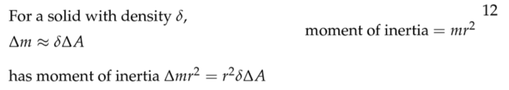
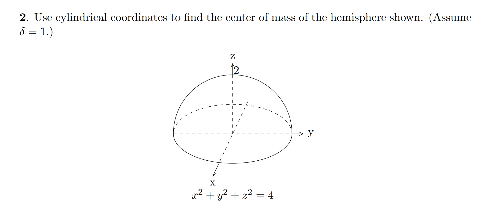
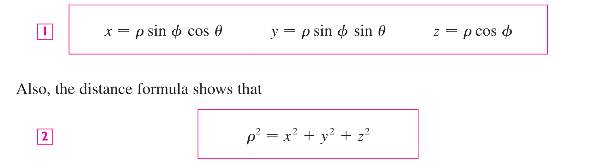

# 1 Rectangular Coordinates
:::info
本小节我们我们介绍三重积分，其实就是增加了一个积分微元。
:::

## 1.1 三重积分的定义
:::info
我们知道在二重积分中，积分区域是$xy$平面上的一个区域$R$。类似地，在三重积分中，积分区域是$xyz$空间中的一块体积。下面我们给出图示:

和二重积分中的可视化步骤类似，我们会将积分区域画成一个个微元，在上图中就是一个个微小的立方体，用$\Delta V=\Delta x\Delta y\Delta z$来标记，然后我们就可以定义三重黎曼和并取$\Delta V\to dV$, 得到三重积分的定义:

在三重黎曼和的表达式$\lim_{l,m,n\to \infty}\sum_{i=1}^l\sum_{j=1}^m\sum_{k=1}^nf(x_{ijk}^*,y_{ijk}^*z_{ijk}^*)\Delta V$中，$(x_{ijk}^*,y_{ijk}^*z_{ijk}^*)$是$\Delta V$中的任意一点。
:::

## 1.2 长方体积分区域
> 我们从最简单的积分区域形状：`Rectangular box`开始

:::info

:::
**Examples**

## 1.3 一般积分区域
### 1.3.1 Type 1 Region
> `**Type 1 Region**`表示的是一个区域$E$, 它位于两个**连续的二元函数**之间：
> 
> **其中**$D$**是**$E$**在**$xy$**平面上的投影**, 且积分区域上的点$(x,y)$可以写成一个关于$x$的表达式$(x,g(x))$。
> **我们在求解**`**Type 1**`**的积分区域的三重积分时，可以使用**`**Iterated Integral**`**实现:**
> 1. 首先我们聚焦最内层的关于$dz$的积分
> 

> 2. 然后我们关注定义在平面积分区域$D$上的二重积分, 假设三重积分区域$E$的表达式如下:
> 

> 我们可以对`Equation 6`进行化简:
> 

**Graphs**
> 当然，我们的积分区域$E$在$xy$平面上的投影$D$也可以写成和$y$相关的点表达式$(h(y),y)$:
> 

**Graphs**

### 1.3.2 Type 2 Region
> `**Type 2 Region**`表示的是一个区域$E$, 它位于两个**连续的二元函数**之间：
> 
> **其中**$D$**是**$E$**在**$yz$**平面上的投影**

**Graphs**

### 1.3.3 Type 3 Region
> `Type 1 Region`表示的是一个区域$E$, 它位于两个**连续的二元函数**之间：
> 
> **其中**$D$**是**$E$**在**$xz$**平面上的投影**

## 1.4 Exercises
[Limits In Iterated Integrals.pdf](https://www.yuque.com/attachments/yuque/0/2022/pdf/12393765/1664761257320-231018da-0f51-494e-ac4d-783e907a529d.pdf)

# 2 Cylindrical Coordinates
## 2.1 Definition
:::info

:::

## 2.2 Applications
### 2.2.1 Finding Mass of Volumne
:::info

:::

### 2.2.2 Average Value of Function/Density
:::info

:::
### 
### 2.2.3 Center of Mass
:::info

:::
**Examples**

### 2.2.3 Moment of Inertia
:::info

关于轴的惯性矩: 
关于轴的惯性矩: 
关于轴的惯性矩: 
:::

## 2.3 Exercises
### 使用圆柱坐标求体积
:::info
求出抛物面和二维平面围成的体积。

:::
**Key: Cylindrical Coordinate**我们将图像旋转成如下俯视图, 发现我们的积分区域在平面上的投影实际上应该是一个圆:

为了求得圆的表达式，我们可以想象一个与平面平行的横截面，也就是让固定的情况下，求:
联立之后的结果，得到`Cylindrical Base`的表达式, 这也和上图中的形状吻合。
**然后我们就可以在这个**`**Cylindrical Coordinate**`**下计算三重积分:**
(**注意的积分上下限不能搞错**)
对于来说，我们需要得到极坐标下和的积分范围:

如图所示，我们知道, 于是积分区域是
于是三重积分化简为
**Key: Rectangular Coordinate**

### 正四面体的惯性矩
:::info
在做这题之前最好复习一下: [转动惯量的计算](https://www.yuque.com/alexman/tn6ya7/ge3z2i#isD3D)
:::
:::info

:::
**Key(Iterated Integral)**

### 抛物面的惯性矩
:::info

:::
**Key**

### 圆柱体的惯性矩
:::info
Find the moment of inertia of a cylinder of **height h, radius b** with constant density around its central axis。

:::
**Key**

### Average Value of Function
:::info
找到`Average Distance of a point in the tetrahedron with vertices`$(0,0,0),(1,0,0),(0,1,0)$和$(0,0,1)$`to the`$xy-plane$:

:::
**Key**首先根据题意，我们要求平均值的函数是（其实求的是`Average Height`）

现在我们只需要求出这个正四面体的体积即可，我们直接使用体积公式(于平行六面体的体积)，于是我们得到, 于是

### Compute Mass 1
:::info

:::
**Key**

### Compute Mass 2
:::info

:::
**Key**
 

# 3  Spherical Coordinates
[Limits in Spherical Coordinates.pdf](https://www.yuque.com/attachments/yuque/0/2022/pdf/12393765/1664773115845-2748e0dc-8940-437b-9931-dca4e77c6c0e.pdf)
## 3.1 Definitions
:::info

类比我们在`Polar Coordinates`中是一个长度，一个角度构成的参数化坐标系, `Spherical Coordinates`也就是一个长度，两个角度构成的参数化坐标系。
:::
**Graphical Interpretations**
**Rectangular Coordinates to Spherical Coordinates**

## 3.2 Spherical Differentials
:::info
本小节我们推导一下微元在`Spherical Coordinates`下的推导:

:::
**Graphs**

## 3.3 在球面坐标中找到积分区域
:::info

:::
**Example**

## 3.4 Jacobian/Algebraic Interpretations
[Changing Variables in Multiple Integrals.pdf](https://www.yuque.com/attachments/yuque/0/2022/pdf/12393765/1664776040053-0fb664a9-f06f-4c2e-9b96-fe0db6823736.pdf)
:::info

:::
> 

## 3.5 Exercises
### Finding the Limits 1
:::info

:::
**Key**

### Finding the Limits 2
:::info

:::

### Finding the Limits 3
:::info

:::

### Finding the Limits 4
:::info

:::

### Limits and Average Value
:::info

:::
**(a)**
同时
**(b)**

### Compute the Triple Integrals 1
:::info

:::

### Compute the Triple Integrals 2
:::info

:::

# 4 Applications
[Gravitational Attraction.pdf](https://www.yuque.com/attachments/yuque/0/2022/pdf/12393765/1664776378592-2114455f-a85d-4640-8328-ac9b5ace8ab7.pdf)
## 4.1 Gravitational Attraction
> 我们可以使用三重积分计算一个质量为$M$的固体$V$对处于原点的单位质点施加的引力。
> **如果固体**$V$**也是一个质点，那么根据万有引力定律，我们有:**
> 
> **如果固体**$V$**不是质点，那么我们就必须使用三重积分来计算这个引力:**
> 假设原点的质量为$m$的质点，施加在质量为$\Delta M$的物体的$(x,y,z)$处的引力大小为:
> $|\vec{\mathbf{F}}|=\frac{G\cdot \Delta M\cdot m}{\rho^2}$, $dir \mathbf{\vec{F}}=\frac{\langle x,y,z\rangle}{\rho}$(`unit vector`)
> 于是$\mathbf{\vec{F}}=|\mathbf{\vec{F}}|\cdot dir\mathbf{\vec{F}}=\frac{G\cdot \Delta M\cdot m}{\rho^3}\langle x,y,z\rangle, \space \rho=(x^2+y^2+z^2)^{\frac{1}{2}}$
> 而我们知道$\Delta M=\delta \Delta V$($\delta$是物体的密度, $\delta=\delta(x,y,z)$)
> 于是$\mathbf{\vec{F}}=\iiint_V\frac{G\cdot m}{\rho^3}\langle x,y,z\rangle \cdot \delta dV$, $\rho=(x^2+y^2+z^2)^{\frac{1}{2}}$
> 这个积分看上去就很难求，于是我们可以将这个积分转化成`Spherical Coordinates`下坐标表示。为了简便起见，我们假设物体$V$被放置在关于$z$轴对称的位置上，这样我们就只需要考虑引力在$\mathbf{k}$方向($z$轴正方向)的分量, 即$\mathbf{\vec{F}}=\langle 0,0,\mathbf{F_z}\rangle$:
> 于是$z$轴上的分量是: $\mathbf{F_z}=Gm\iiint_V\frac{z}{\rho^3} \delta dV$。我们使用`Spherical Coordinates`得到: $\begin{aligned}Gm\iiint_V\frac{z}{\rho^3} \delta dV&=Gm\iiint_V\frac{\rho cos(\phi)}{\rho^3} \delta dV\\&= Gm\iiint_V\frac{\rho cos(\phi)}{\rho^3}\delta \rho^2sin\phi d\rho d\phi d\theta\\&=Gm\iiint_V  \delta cos(\phi) sin(\phi) d\rho d\phi d\theta\end{aligned}$

**Graph**

## 4.2 Exercises
### Gravitational Attraction 1
> 

**Key**这里, 也就是位于原点的质点质量为。
根据题意，这个固体关于轴是对称的，于是万有引力只有在轴方向上才有分量, 于是:

如果位于原点的质点质量不为, 则

### Gravitational Attraction 2
> 

**Graph**
**Key**

### Average Distance
> 

**(a)**
**(b)**
**(c)**由于一个过原点的平面总是将球体均分成两部分，于是:

1. 我们可以转而考虑将这个平面视为平面
2. 由于球体上半部分和下半部分到平面的平均距离应该相等（且等于整个球体上的点到平面的平均距离），所以我们只需要考虑球体上半部分到平面的距离即可，于是:

