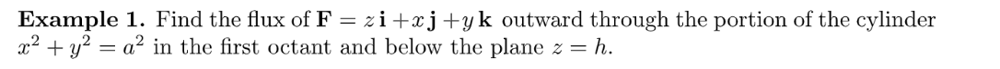
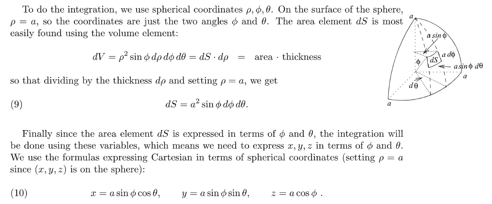
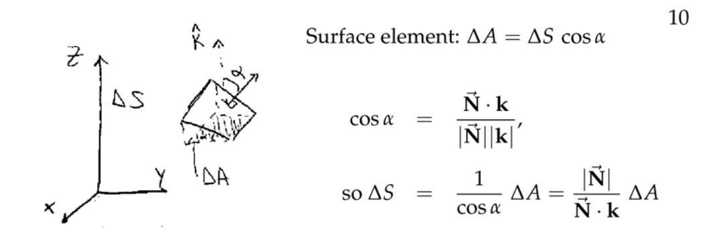
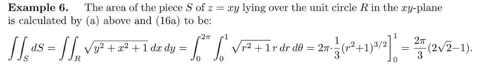
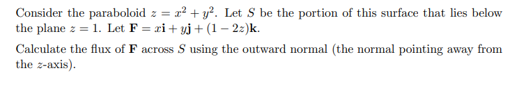
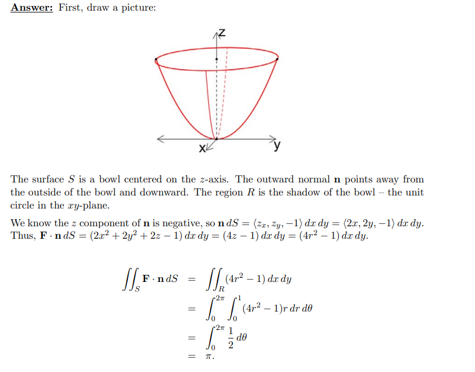
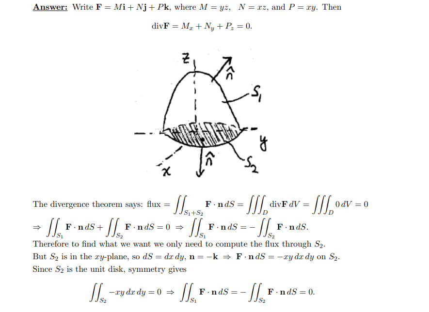
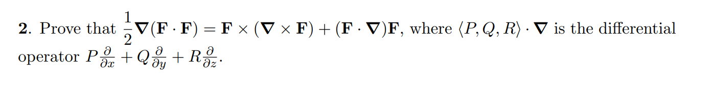
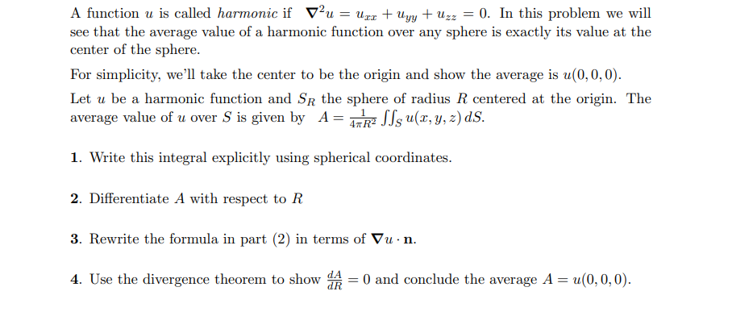

# 1 Vector Fields in Space
[Vector Field in Space.pdf](https://www.yuque.com/attachments/yuque/0/2022/pdf/12393765/1669640012519-ecd41c59-f01f-4b94-9ee1-e33317a096f5.pdf)
[Vector Field_18_022.pdf](https://www.yuque.com/attachments/yuque/0/2022/pdf/12393765/1669640144528-35fd5099-1a1f-4dff-b549-649d012863ff.pdf)
## Definition
:::info

本质上`Vector Field`就是对于空间中的某一点，到某个向量的函数, 我们可以给出几个简单的例子:

:::

## Some 3D Fields
### Force Field
> 

### Flow/Velocity Field
> 

## Some Examples
### E1 Electrostatic Force Field
> 

**Key**

### E2 Velocity Field
> 

**Key**

### E3 Flow Field**⭐⭐⭐**
> 
> 首先由于是气体流场，所以根据气体性质，气体的流速是不会随着距离原点的远近而变化的，于是只有气体的密度会变化。那么具体按照什么方式变化呢? 
> 本题中，我们知道气体是从三维空间中的原点被释放的，然后向外均匀扩散成一个半径为$\rho$的球体，那么在气体从距离原点为$0$到距离原点为$\rho$的过程中，气体的密度会怎么变呢?
> 我们知道球体的表面积公式是$S=4\pi \rho^2$, 而要想保持气体流速不变，就要使得单位时间通过横截面(球体表面)的气体质量相同，于是我们的气体密度会随着距离原点的距离$\rho$而成$\frac{1}{\rho^2}$的速率递减，于是我们有了下面的推导。

**Key**

### E4 Gravitational Force Field
> 

**Key**

# 2 Flux in 3D
[V9_1_Surface_Integrals.pdf](https://www.yuque.com/attachments/yuque/0/2022/pdf/12393765/1669647503197-fd03f510-e0c6-4c31-b00c-3b234297bdbb.pdf)
> 还记得之前我们在二维平面内定义了`Flux over a curve` $C$(有向曲线), 公式是$\int_C \mathbf{F}\cdot \mathbf{
\hat{n}} ds$, 其中$\mathbf{\hat{n}}$是通过将$\mathbf{\hat{T}}$顺时针旋转$90^{\degree}$得到的（如果我们选择曲线$C$下方作为正方向）。
> 而在三维空间中，我们的定义将会发生一些变化。我们将从研究一个有向曲线推广到研究一个有向曲面$S$，但是我们仍然需要决定: 从$S$的哪一侧通过的通量是正的，$S$哪一侧是负的。同时我们的积分定义也将发生变化。详见下文。
> 

## Definition
> 

**Interpretations**

## Surface Integrals
[V9.2 Surface Integrals.pdf](https://www.yuque.com/attachments/yuque/0/2022/pdf/12393765/1669652336617-39d5aa25-d092-44b8-9d2e-51d97d612191.pdf)
> 本小节我们将介绍如何求$dS$的积分，从几个简单的例子入手

### Cylinder Surface
> 
> 首先我们需要大致画出这个`Surface`长什么样，方便我们确定垂直于`Surface`的单位向量$\mathbf{\hat{n}}$, 当然我们也可以使用等高面上的点垂直于这一点的梯度的性质得到$\mathbf{\hat{n}}$的表达式。
> 1. **首先，我们确定**$\mathbf{\hat{n}}$**如下：**
> 

> 2. **然后我们确定**$dS$**如下：**
> 

> 3. **最后我们计算**$\iint_S\mathbf{F\cdot \hat{n}}dS$**:**
> 

> 所以我们看到其实`Flux in 3D`只是`Flux in 2D`的一个很自然的衍生，不是很难。

### Spherical Surface
> 
> 1. **大致构思**`**Surface**`**的形状，求出**$\mathbf{\hat{n}}$**的表达式：**
> 

> 2. **求出**$dS$**的表达式:**
> 

> 3. **计算**`**Flux in 3D**`**:**
> 

### General Surfaces(G.S.)
[V9_3_4 Surface Integrals.pdf](https://www.yuque.com/attachments/yuque/0/2022/pdf/12393765/1669701532183-d2843f17-1f35-4b87-b29a-795e8508c2ec.pdf)
> 假设这个`Surface`比较复杂，即我们不知道他的法向量$\mathbf{\hat{n}}$具体怎么求， 但是我们可以将这个问题转化成我们已知的问题, 我们先看下面的例子，为了计算一个比较复杂的`Surface`的$\mathbf{\hat{n}}$和$dS$, 我们其实不需要分别计算$\mathbf{\hat{n}}$和$dS$, 而是可以将他们的内积$\mathbf{\hat{n}}\cdot dS$看成一个整体，然后将这个整体转化成一个我们已经见过的问题，下面的图中给出了这种转化: 
> 
> 我们可以看到，这种转化使得我们其实只需要聚焦于$S$在$xy$平面上的投影来计算$\mathbf{\hat{n}}\cdot dS$。
> **为什么我们可以做这种转化呢，我们开始逐步分析:**
> 首先我们可以聚焦于$S$上的很小一部分曲面$\Delta S$, 这个曲面的面积可以近似地由两个空间向量$\mathbf{\vec{U}}$和$\mathbf{\vec{V}}$的叉乘取模$|\mathbf{\vec{U}\times \vec{V}}|$得到，而如果不取模, 则$\mathbf{\vec{U}\times \vec{V}}$表示与$\Delta S$的一个法向量，且模长为$\Delta S$，所以$\mathbf{\vec{U}\times \vec{V}}=\Delta S \cdot \mathbf{\hat{n}}$ 。
> 同时，我们可以假设这个曲面$\Delta S$在$xy$平面上的投影是$\Delta x$和$\Delta y$ , 然后构建$\Delta S$和$\Delta x$及$\Delta y$之间的关系。这等同于构建$\mathbf{\vec{U}}$, $\mathbf{\vec{V}}$和$\Delta x$,$\Delta y$之间的关系。
> 假设我们从$xy$平面上的某一点$(x,y,0)$出发，对应的从曲面上的点$(x,y,f(x,y))$出发。
> 
> 沿着$x$轴改变$\Delta x$, 则对应的曲面上的点变化为$(x+\Delta x,y,f(x+\Delta x,y))$, 而$f(x+\Delta x,y)\approx f(x,y)+f_x(x,y)\Delta x$(切平面公式), 所以我们有: 
> $\mathbf{\vec{U}}\approx \langle \Delta x,0,f_x(x,y)\Delta x\rangle$
> 沿着$y$轴改变$\Delta y$, 则对应的曲面上的点变化为$(x,y+\Delta y,f(x,y+\Delta y))$, 而$f(x,y+\Delta y)\approx f(x,y)+f_y(x,y)\Delta y$(切平面公式), 所以我们有: 
> $\mathbf{\vec{U}}\approx \langle 0,\Delta y,f_y(x,y)\Delta y\rangle$
> 于是我们可以计算$\mathbf{\vec{U}\times \vec{V}}$, 公式如下:
> 
> **如果**$\mathbf{\hat{n}}$**的**$z$**component 是**`**Point Downwards**`**的话，我们就会选择使用**$\langle f_x,f_y,-1\rangle\Delta x\Delta y$**来表示**$\mathbf{\hat{n}}\cdot dS$**。**
> **我们看一个例子加深理解:**
> 实际上，我们可以给出下面两个等价公式($11a$和$11b$):
> 
> 我们刚刚已经完成了$(11 a)$的推导，现在我们尝试从$(11a)$推导到$(11b)$:
> 

**Examples**

### Parametrization for G.S.
> 假设我们在求解$\mathbf{\hat{n}}\cdot dS$的时候不想将其转化成关于$dxdy$的积分，换句话说我们不想转换坐标系，而是就事论事，在$uv$坐标系中讨论，下面我们介绍一下主要思想: 
> 在之前的参数曲线中，我们使用$\mathbf{r}(t)=\langle x(t),y(t),z(t)\rangle$来描述一个质点在空间中的位置随时间的变化情况。如果我们对其关于$t$求导, 则可以得到$\mathbf{r}'(t)=\langle x'(t),y'(t),z'(t)\rangle$, 表示在$t$时刻质点运动的速度，对其做标准化得到$\mathbf{\hat{T}}$向量，表示单位速度，如果将这时候乘以一个$\Delta s$得到$\mathbf{\hat{T}}\Delta s$表示的是质点沿着$\mathbf{\hat{T}}$方向走了$\Delta s$的距离。
> 类似的思想可以使用到下面的参数曲面上，不同于参数曲线，仅仅和$t$这一个变量有关，由于曲面是二维的，就必然会有两个方向的变化量要考虑，不妨设为$u$和$v$这两个方向。于是我们的参数曲线可以写成$\mathbf{r}(u,v)=\langle x(u,v),y(u,v),z(u,v) \rangle$, 也就是说质点在空间中的位置会受到两个变量决定(可以理解成一个点有两个自由度，而不是像在一条曲线上自由一个自由度)，在这种情况下我们可以求出质点在$u,v$方向上的速度，可以通过求偏导实现。
> 换句话说，$\mathbf{r}_u(u,v)=\langle x_u(u,v),y_u(u,v),z_u(u,v)\rangle=\frac{\partial \mathbf{\vec{r}}}{\partial u}$,$\mathbf{r}_v(u,v)=\langle x_v(u,v),y_v(u,v),z_v(u,v)\rangle=\frac{\partial \mathbf{\vec{r}}}{\partial v}$, 分别对应两个方向的速度。
> 下面我们可以开始求$\mathbf{\hat{n}}\cdot dS$:
> - 对于$u$的方向的长度, $\frac{\partial \mathbf{\vec{r}}}{\partial u}$表示速度，则可以用$\frac{\partial \mathbf{\vec{r}}}{\partial u}\Delta u$表示$u$方向的边，是一个向量。
> - 对于$v$的方向， $\frac{\partial \mathbf{\vec{r}}}{\partial v}$表示速度，则可以用$\frac{\partial \mathbf{\vec{r}}}{\partial v}\Delta v$表示$v$方向的边，是一个向量
> - 我们使用叉乘得到面积$\frac{\partial \mathbf{\vec{r}}}{\partial u}\Delta u \times \frac{\partial \mathbf{\vec{r}}}{\partial v}\Delta v=(\frac{\partial \mathbf{\vec{r}}}{\partial u} \times \frac{\partial \mathbf{\vec{r}}}{\partial v})\Delta u\Delta v$
> 
**总结到下面的图中:**
> 

### Known Normal Vector 
:::info
在某些情况下，`Surface`的`Normal Vector`是很容易求得的, 这种情况下我们不需要明确的知道$z$和$x,y$的关系，我们开始推导:

我们可能会想继续去算$dS$, 但是其实大可不必，我们还是可以把$\mathbf{\hat{n}}\cdot dS$看成一个整体去看待：

**这里**$\mathbf{k}$**是单位向量，即**$|\mathbf{k}|=1$**, 于是我们有:**
$\begin{aligned} \mathbf{\hat{n}}\Delta S\end{aligned}=\frac{|\mathbf{\vec{N}}|\cdot \mathbf{\hat{n}}}{\mathbf{\vec{N}}\cdot \mathbf{k}}\Delta A=\pm\frac{\mathbf{\vec{N}}}{\mathbf{\vec{N}}\cdot \mathbf{k}}\Delta A=\pm\frac{\mathbf{\vec{N}}}{\mathbf{\vec{N}}\cdot \mathbf{k}} dxdy$
**我们看一个例子加深理解:**

:::
**Example**
这里$\mathbf{k}=\langle 0,0,1\rangle$

### Applications
> 

**Average distance from North Pole/Area of the piece S**

## Full Examples
### Example 1
> 假设$\mathbf{F}=\langle x,y,z\rangle$且$x^2+y^2+z^2=a^2$, 我们有:
> 

### Example 2
> 

## Exercises
### Calculate n and dS separately
#### Calculate Flux 1
> 

**Key**我们可以将$x^2+y^2+z^2$视为一个$h(x,y,z)=x^2+y^2+z^2$的等高面$h(x,y,z)=c$, 此处$c=1$, 于是$\nabla h\perp h(x,y,z)=c$, 于是我们可以求得$\nabla h=\langle 2x,2y,2z\rangle$, 并缩放长度得到$\mathbf{\hat{n}}=\langle x,y,z\rangle$(因为$x^2+y^2+z^2=1$于是$\mathbf{\hat{n}}$的确是单位向量)。
然后我们根据`Flux in 3D`的定义求积分:
 $\begin{aligned}\iint_S \mathbf{F}\cdot \mathbf{\hat{n}}dS&=\iint_Sx^2+y^2+z^2dS\\&=\iint_SdS\\&=2\pi\cdot 1\\&=2\pi\end{aligned}$

#### Calculate Flux 2
> 

**Key**我们可以得到$\mathbf{\hat{n}}=\frac{1}{\sqrt{x^2+z^2}}\langle x,0,z\rangle$, 则`Flux`可以表示为:
$\begin{aligned}\iint_S \mathbf{F}\cdot \mathbf{\hat{n}}dS &=\iint_S 0 dS \\&= 0\end{aligned}$

####  Calculate Flux 3
> **(a): **Find the flux of $\mathbf{k}$through $x^2+y^2=1$
> **(b): **Find the flux of $\mathbf{j}$through one square(with side length one) in the x-z plane

**(a)**我们可以得到$\mathbf{\hat{n}}=\langle x,y,0\rangle$, $\mathbf{F}=\langle 0,0,1\rangle$, 所以`Flux`是:
$\iint_S \mathbf{F}\cdot \mathbf{\hat{n}}dS=\iint_S 0dS=0$
**(b)**我们可以得到$\mathbf{\hat{n}}=\langle 0,1,0\rangle$, $\mathbf{F}=\langle 0,1,0\rangle$, 所以`Flux`是:
$\iint_S \mathbf{F}\cdot \mathbf{\hat{n}}dS=\iint_SdS=1$
当然我们需要规定一个正方向，所以结果是$\pm 1$

####  Calculate Flux 4
> 1. Find the outward flux of $\vec{\mathbf{F}}=\langle z,x,y \rangle$through the piece of the cylinder in the first octant:
> 

> $\mathbf{\hat{n}}=\frac{\langle x,y,0 \rangle}{a}$, $\mathbf{\vec{F}\cdot \hat{n}}=\frac{xz+xy}{a}$， where $x^2+y^2=a^2$
> 2. Find the flux (outward) of $\mathbf{\vec{F}}=\langle xz,yz,z^2\rangle$through the piece of the sphere of radius $a$in the first octant.

**(1) dS微元的确定**因为我们已经知道了$\mathbf{\vec{F}\cdot \hat{n}}$，于是我们可以直接计算`Flux`, 但是重点是这里的$dS$代表的面积应该怎么用积分微元来表示，我们知道题目实际上要我们求的是圆柱在第一象限的弧面。根据弧长公式，我们知道$dS = ad\theta \cdot dz$
$\begin{aligned}\iint_S\frac{xz+xy}{a}dS&=\int_{0}^{\frac{\pi}{2}}\int_0^h\frac{acos\theta z+a^2cos\theta sin \theta}{a}adzd\theta\\&=\int_0^{\frac{\pi}{2}}\int_0^h(cos\theta z+acos\theta sin\theta )adzd\theta \\&=\frac{ah^2}{2}+\frac{a^2h}{2} \end{aligned}$
**(2) Spherical Coordinate**首先确定$\mathbf{\hat{n}}=\frac{\langle x,y,z\rangle}{a}$, 且$x^2+y^2+z^2=a^2$
然后确定$dS$, 是$asin \phi d\theta \cdot ad\phi=a^2sin\phi d\phi d\theta$, 同时在`Spherical Coordinate`中我们有$\begin{cases} x=a sin\phi cos\theta \\ y=asin\phi sin\theta\\z=acos\phi\end{cases}$, 于是我们可以计算`Flux`如下：
$\begin{aligned}Flux&=\int_{0}^{\frac{\pi}{2}}\int_{0}^{\frac{\pi}{2}}(\frac{x^2z+y^2z+z^2z}{a})a^2sin\phi d\phi d\theta \\&=\int_{0}^{\frac{\pi}{2}}\int_{0}^{\frac{\pi}{2}}a^2cos\phi a^2sin\phi d\phi d\theta \\&=\frac{a^4}{4}\pi \end{aligned}$

#### Calculate Flux 5
> 

**(1) Upward Flux**
**(2) Upward Flux**
**(3) Radius Flux**

### Calculate ndS together
#### Flux over general surface 1
> Let $z=x^2+y$, Let $S$be the graph of $z$above the unit square in the $x-y$plane. Let $\vec{F}=z\vec{i}+x\vec{k}$. Find the upward flux of $\vec{F}$through $S$

**Key**
1. 首先给出$\mathbf{\hat{n}}\cdot dS$, 即$d\mathbf{S}=\langle -z_x,-z_y,1\rangle=\langle -2x,1,1\rangle$
2. 然后计算$\iint_S \mathbf{F}d\mathbf{S}$:

$\begin{aligned}\iint_S \mathbf{F}d\mathbf{S}=\iint_S \langle z,0,x \rangle \cdot\langle -2x,-1,1\rangle dxdy&=\int_{0}^1\int_0^1-2xz+xdydx \\&=\int_0^1\int_0^1-2x(x^2+y)+xdydx\\&=\int_0^1\int_0^1(-2x^3-2xy+x)dydx\\&=-\frac{1}{2}\end{aligned}$
 

#### Flux over general surface 2
> 

**(1)**令$z=f(x,y)=x^2+y^2$,则使用`General Surface`的计算公式，得到$\mathbf{\hat{n}}\cdot dS=\langle -f_x,-f_y,1\rangle dxdy=\langle -2x,-2y,1\rangle dxdy$
于是`Flux`的表达式是:
$\begin{aligned}Flux&=\int_{0}^{1}\int_{0}^{1}(2xy+x) dxdy \\&=1 \end{aligned}$
**(2)**令$z=f(x,y)=x^2+y$,则使用`General Surface`的计算公式，得到$\mathbf{\hat{n}}\cdot dS=\langle -f_x,-f_y,1\rangle dxdy=\langle -2x,-1,1\rangle dxdy$
于是`Flux`的表达式是:
$\begin{aligned}Flux&=\int_{0}^{2}\int_{0}^{2}(2xy+x) dxdy \\&=12 \end{aligned}$

#### 

### Calculate the Flux over Parabloid
> 

**Key**

# 3 Divergence Theorem(Closed Surface)
[V10.1_Divergence Theorem.pdf](https://www.yuque.com/attachments/yuque/0/2022/pdf/12393765/1669774592457-46a2e330-b197-45f2-ae65-ee7525e76cf6.pdf)
## Introduction
:::info
本质上，`Space`中的`Divergence Theorem`就是`Green Theorem`在三维空间中的`Generalization`
类比在`Green Theorem`中我们对于曲线的要求是闭合曲线，在`Divergence Theorem`中我们对于曲面$S$的要求也是闭合曲面, 类比在二维中的`Flux`格林定理，在三维中我们有:

**总的来说:**

:::

## Formal Definition
:::info

注意`Divergence Theorem`的使用条件和格林定理类似，都是说在`Region`内部，向量场必须处处有定义。(在`E3`中我们将会看到)
:::

## Understanding Div Theorem
:::info
我们在物理学的框架下来证明这个定理，会更好理解一些， 我们可以将$\mathbf{F}$想象成一个`Flow Field`:

等式的左边，表示的是流场$\mathbf{F}$通过曲面$S$的通量，也就是单位时间内通过曲面$S$的流体的质量。
等式的右边，$div(\mathbf{F})$表示的是可以理解为流场在某一点$(x,y,z)$处的`Source Rate`, 也就是在$(x,y,z)$处**流体被加入的速率**(单位时间的质量), 如果$div(\mathbf{F})<0$则表示在$(x,y,z)$处**流体被移除的速率。**
这个等式表示的是我的**流体通过曲面的单位时间的通量**应该**等于**这个**流体被加入到这个曲面围成的闭合体的速率, 即:**

**当然我们也可以给出代数上的推导如下：**

:::
**Examples**

这里我们规定了向上为正方向（从曲面下方穿过曲面为正），于是$S_2=-S_2'$需要注意

## Physics Applications& Del Notation
:::info

:::

## Proof of Divergence Theorem
[V10.2_Proof of Divergence Theorem.pdf](https://www.yuque.com/attachments/yuque/0/2022/pdf/12393765/1669796100640-f5e91132-3e38-4b1d-adcd-7130a2064b52.pdf)
:::info
主要的思路是，我们先考虑$\mathbf{\vec{F}}$比较简单的情形，比如比如只有一个分量的情况

同时我们也可以将积分区域进行简化，比如我们可以假定`Closed Surface`在水平方向没有`Flux`, 如下图所示:

然后我们推而广之，将之前分而治之的部分加起来就可以得到`Divergence Theorem`的完整证明过程。
:::

## Exercises
### E1 Finding Boundary
:::info
Use the divergence theorem to find the flux of $\mathbf{\vec{F}}=y\mathbf{j}$through the right half of the sphere of radius $R$centered at the origin.
:::
**Key**$\mathbf{\vec{F}}=M(x,y,z)\mathbf{\vec{i}}+N(x,y,z)\mathbf{\vec{j}}+P(x,y,z)\mathbf{\vec{k}}$
首先我们需要确定计算`Flux`所需要的等价的`Closed Surface Boundary`，注意到题目中要我们求关于球面(记为$S$)的右半部分在向量场$\mathbf{\vec{F}}$中的通量，但是这个球面并不是`Closed`的，于是为了使用`Div Theorem`, 我们需要将右半球面与$xz$平面相交所得的一个`Circle Disk`(也是`Positively Oriented`的)作为其`Boundary`, 记为$S_2$, 于是问题等价于求$\oiint_{S+S_2} \mathbf{\vec{F}}\cdot \mathbf{\hat{n}} dS$
$div(\mathbf{\vec{F}})=\frac{\partial M}{\partial x}+\frac{\partial N}{\partial y}+\frac{\partial P}{\partial z}=0+1+0$
所以根据`Div Theorem`, 我们有$\oiint_{S+S_2} \mathbf{\vec{F}}\cdot \mathbf{\hat{n}} dS=\iiint 0+1+0dV=\iiint dV=\frac{2}{3}\pi R^3$
而我们知道$\iint_{S_2} \mathbf{\vec{F}}\cdot \mathbf{\hat{n}} dS=0$(因为根据几何性质，所有的$\mathbf{\vec{F}}$都平行于`Disk`, 于是根本没有通量)，所以$\iint_{S} \mathbf{\vec{F}}\cdot \mathbf{\hat{n}} dS=\oiint_{S+S_2} \mathbf{\vec{F}}\cdot \mathbf{\hat{n}} dS=\frac{2}{3}\pi R^3$

### E2 Cylindrical Flux
:::info
Compute the flux of $\mathbf{\vec{F}}=\langle x^4y,-2x^3y^2,z^2\rangle$through the surface of the solid bounded by $z=0,z=h$and $x^2+y^2=R^2$
:::
**Key**记上下的`Disk` $x^2+y^2=R^2, z=0$和$x^2+y^2=R^2,z=h$分别为$S_1$和$S_2$, 中间的圆柱面为$S_3$, 则我们根据`Div Theorem`可以得到：
$\begin{aligned}\oiint_{S_1+S_2+S_3}\mathbf{\vec{F}}\cdot \mathbf{\hat{n}}dS&=\iiint (\frac{\partial M}{\partial x}+\frac{\partial N}{\partial x}+\frac{\partial P}{\partial z}) dV \\&=\iiint(4x^3y-4x^3y+2z)dV\\&=\int_{0}^{2\pi}\int_0^{R}\int_{0}^h  2rzdzdrd\theta \\&=\pi R^2h^2\end{aligned}$

### E3 Extended Gauss' Theorem
:::info
Let $\mathbf{\vec{F}}=\frac{\langle x,y,z\rangle}{\rho^3}$and let $S$be the surface of the box with vertices $(\pm 2,\pm 2,\pm 2)$and $\sqrt{x^2+y^2+z^2}=\rho$

1. Show $div(\mathbf{\vec{F}})=0$.
2. Can we conclude that flux through $S$is zero?
3. Use extended Gauss Theorem to compute the flux through $S$
:::
**(1) Proof **$\mathbf{\vec{F}}=\frac{\langle x,y,z\rangle}{(x^2+y^2+z^2)^{\frac{3}{2}}}$
于是$div(\mathbf{\vec{F}})=\frac{\rho^{3}-\frac{3}{2}\cdot x\cdot 2x\cdot \rho}{\rho^3}+\frac{\rho^{3}-\frac{3}{2}\cdot y\cdot 2y\cdot \rho}{\rho^3}+\frac{\rho^{3}-\frac{3}{2}\cdot z\cdot 2z\cdot \rho}{\rho^3}=0$, 证毕。
**(2) div(F)=0  => Flux is zero?**我们不能妄下这个结论，原因就是$\mathbf{\vec{F}}$在$(0,0,0)$处没有定义，换句话说，我们不知道$\mathbf{\vec{F}}$在$(0,0,0)$处具体的行为是什么，不知道在$(0,0,0)$处的`Source Rate`是什么，也就不能直接使用`Divergence Theorem`了。
**(3) Extended Gauss Theorem**我们可以类比在[Extended Green Theorem in 2D](https://www.yuque.com/alexman/tn6ya7/avbffg#CItJD)中的思路，我们在这个立方体，记为$S$。在这个立方体之外画一个`Big Sphere`将其围住，标记为$S_2$然后使用`Extended Green Theorem`, 假设位于$S$和$S_2$中间的区域是$R$, 因为向量场$\mathbf{F}$在$R$处处有定义，所以我们可以在$R$上运用`Divergence Theorem`，于是我们有:
$\oiint_{S_2} \mathbf{\vec{F}}\cdot \mathbf{\hat{n}}dS-\oiint_{S} \mathbf{\vec{F}}\cdot \mathbf{\hat{n}}dS=\iiint_R div(\mathbf{\vec{F}})dV$
我们来分析一下这个式子为什么成立，首先我们画出这个式子背后的图:

这里等式右侧算的是$R$的`Outward Flux`(辐射向外的)。所以:
对于$S_2$来说也是`Outward Flux`, 这和等式左侧的$\oiint_{S_2} \mathbf{\vec{F}}\cdot \mathbf{\hat{n}}dS$含义一致。
对于$S$来说则是`Inward Flux`, 这需要我们对$\oiint_{S} \mathbf{\vec{F}}\cdot \mathbf{\hat{n}}dS$（这里我们的$\mathbf{\hat{n}}$默认是向外辐射的）取负号，于是等式左侧就变成了$\oiint_{S_2} \mathbf{\vec{F}}\cdot \mathbf{\hat{n}}dS-\oiint_{S} \mathbf{\vec{F}}\cdot \mathbf{\hat{n}}dS$。
然后我们可以开始计算, 因为 $\mathbf{\hat{n_2}}=\frac{\langle x,y,z \rangle}{\rho}$, $div(\mathbf{\vec{F}})=0$
$\begin{aligned}\oiint_{S} \mathbf{\vec{F}}\cdot \mathbf{\hat{n}}dS&=\oiint_{S_2} \mathbf{\vec{F}}\cdot \mathbf{\hat{n_2}}dS-\iiint_R div(\mathbf{\vec{F}})dV  \\&=\oiint_{S}\frac{1}{\rho^2}dS\\&=4\pi\rho^2\cdot \frac{1}{\rho^2}\\&=4\pi\end{aligned}$

### E4 Flux over paraboloid
:::info

:::
**Key**

### E5 Del Notations 1
:::info
Let $\mathbf{\vec{F}}$be a vector field and $u$be a scalar function$u=u(x,y,z)$. Show the following "product rule" for the del operator: $\nabla \cdot (u\mathbf{\vec{F}})=\nabla u\cdot \mathbf{\vec{F}}+u\nabla\cdot \mathbf{\vec{F}}$
:::
**Key**首先根据定义我们有: $\nabla=\langle \frac{\partial }{\partial x},\frac{\partial }{\partial y},\frac{\partial }{\partial z}\rangle$, $\mathbf{\vec{F}}=\langle M,N,P\rangle$, $\nabla u=\langle u_x,u_y,u_z\rangle$
于是$\begin{aligned}\nabla\cdot u\mathbf{\vec{F}}= \frac{\partial }{\partial x},\frac{\partial }{\partial y},\frac{\partial }{\partial z}\cdot \langle uM,uN,uP\rangle &=u_xM+uM_x+u_yN+uN_y+u_zP+uP_z \\&=u_xM+u_yN+u_zP+uM_x+uN_y+uP_z \\&=\nabla u\cdot \mathbf{\vec{F}}+u \nabla \cdot\mathbf{\vec{F}} \end{aligned}$, 证毕。

### E6 Verify Divergence Theorem
:::info

:::
**Key**
**如果我们简单使用**`**Div Theorem**`**的话:**
因为$\mathbf{\vec{F}}$在立方体内处处有定义，于是我们可以直接使用`Div Theorem`:
$\begin{aligned}\oiint_S \mathbf{\vec{F}}\cdot \mathbf{\hat{n}}dS&=\iiint_R div(\mathbf{\vec{F}})dV \\&=\iiint_R (1+1+1)dV\\&=3 \end{aligned}$

### E7 Del Notations 2
:::info

:::
**Key**

# 4 Partial Differential Equations
[Partial Differential Equation.pdf](https://www.yuque.com/attachments/yuque/0/2022/pdf/12393765/1669797310362-8c375451-2e38-4114-bf5f-9b36692acf0f.pdf)

## Simplified Definitions
> 

## Some Important PDEs
### Laplace Equation
> 

### Possion Equation
> 

### Wave Equation
> 

## 
## Diffusion/Heat Equation
### Definition
> 

### Relation to Stoke's Theorem
> 

## Higher-Order PDEs
> 

## Exercises: Div Theorem& PDE
:::info

:::
**(1) Spherical Coordinate**$A=\frac{1}{4\pi R^2}\int_{\phi}\int_{\theta} u(Rsin\phi cos\theta, Rsin\phi sin\theta, Rcos\phi) R^2sin\phi d\theta d\phi$
**(2) Differentiate**$\begin{aligned}\frac{dA}{dR}&=\frac{1}{4\pi }\int_{\phi}\int_{\theta} u(Rsin\phi cos\theta, Rsin\phi sin\theta, Rcos\phi) sin\phi d\theta d\phi \\&=\frac{1}{4\pi}\int_{\phi}\int_{\theta} (u_xsin\phi cos\theta+u_ysin\phi sin\theta+u_zcos\phi)sin\phi d\theta  d\phi \\&=\frac{1}{4\pi}\int_{\phi}\int_{\theta}  
 (u_x sin^2\phi cos\theta +u_ysin^2\phi sin\theta+u_zcos\phi sin\phi)  d\theta  d\phi\end{aligned}$
**(3) Rewrite**$\begin{aligned}\frac{dA}{dR}&=\frac{1}{4\pi}\int_{\phi}\int_{\theta}  (u_x sin^2\phi cos\theta +u_ysin^2\phi sin\theta+u_zcos\phi sin\phi)  d\theta  d\phi \\&=\frac{1}{4\pi}\int_{\phi}\int_{\theta}  \langle u_x,u_y,u_z \rangle\cdot \langle sin^2\phi cos\theta,sin^2\phi sin\theta,cos\phi sin\phi \rangle  d\theta  d\phi\end{aligned}$
If we denote $\mathbf{\hat{n}}=\frac{\langle x,y,z\rangle}{R}$, we get $\mathbf{\hat{n}}=\langle sin\phi cos\theta,sin\phi sin\theta, cos\phi \rangle$, and denote$dS=R^2sin\phi d\phi d\theta$, we will have the following result:
$\begin{aligned}\frac{dA}{dR}&=\frac{1}{4\pi}\int_{\phi}\int_{\theta}  \langle u_x,u_y,u_z \rangle\cdot \langle sin^2\phi cos\theta,sin^2\phi sin\theta,cos\phi sin\phi \rangle  d\theta  d\phi \\&=\frac{1}{4\pi}\iint_S\nabla u\cdot \mathbf{\hat{n}}\frac{dS}{R^2}\\&=\frac{1}{4\pi R^2}\iint_S\nabla u\cdot \mathbf{\hat{n}}dS\end{aligned}$
**(4) Apply the Divergence Theorem**$\begin{aligned}\frac{dA}{dR}&=\frac{1}{4\pi R^2}\iint_S\nabla u\cdot \mathbf{\hat{n}}dS\\&=\frac{1}{4\pi R^2}\iiint_Vdiv(\mathbf{\vec{F}})dV\end{aligned}$
We know that $div(\mathbf{\vec{F}})=\nabla \cdot \mathbf{\vec{F}}=u_{xx}+u_{yy}+u_{zz}=0$
Thus we immediately know that $\frac{dA}{dR}=0$, and that:

