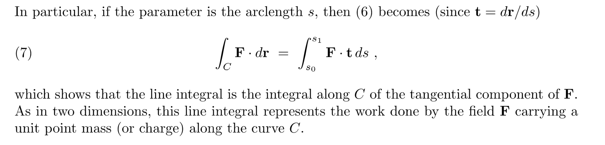
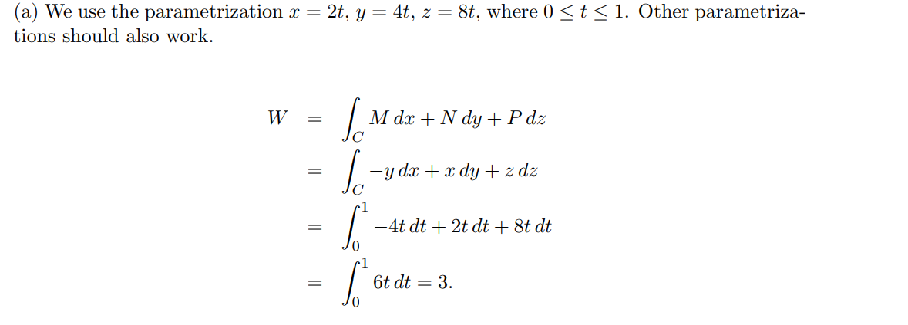
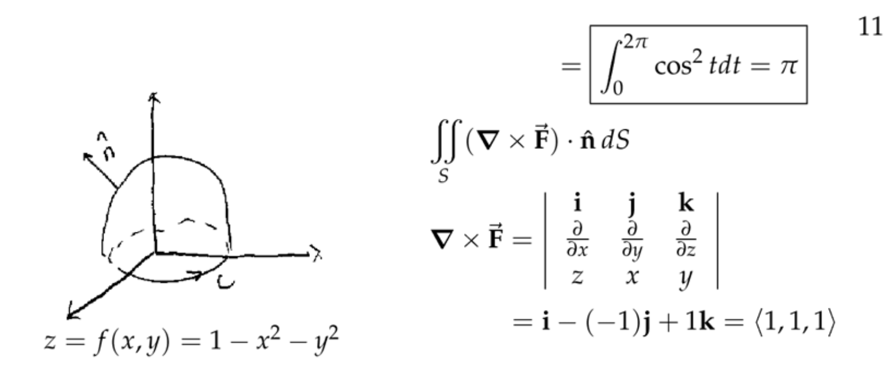

[V11_Line Integrals in Space.pdf](https://www.yuque.com/attachments/yuque/0/2022/pdf/12393765/1670051306791-475106e1-ab94-4e44-8e82-0d261bf2dd48.pdf)

# 1 Vector Field&Line Integrals in 3D
## Curve in 3D
:::info
类比在二维平面中的向量的定义，在三维空间中我们有类似的表达:

对于这些三维空间内的曲线，我们通常只关注那些`Finite, Connected`和`Piecewise Smooth`的曲线， 这意味着他们具有: 

1. 有限的长度
2. `Consist of one piece`
3. 能够被分成有限的小段
4. 每一小段被视为一个连续可导的`Position Vector`
5. `Oriented, Directed`(表明正方向)
6. 如果曲线上的质点最终会运动到原点，这个曲线被称为`Closed`
:::

## Derivative of 3D Curve(Velocity)
:::info

:::

## Line Integrals in space
### Definition
:::info

计算`Line Integral`的一般方法：

我们也可以将$d\mathbf{\vec{r}}$看成是$\mathbf{t}\cdot ds$($\mathbf{t}=\frac{d\mathbf{\vec{r}}}{ds}$):

:::

### Examples
#### E1 Along different curves
:::info

其实可以看到，沿着两条不同的`Parametrized Curve`得到的`Line Integrals`的结果不一样，这可以说明向量场$\mathbf{F}$一定不是一个`Conservative Field`
:::
**(a) Through a Line Segment**
**(b) Through a twisted curve**

#### E2 More Complicated Example
:::info

:::
## 
## Path Independence
:::info

:::
**Example**
Knowing this: fundamental theorem of calculus applies to calculate the line integrals.
$f(1,1,1)-f(0,0,0)=1-0=1$

## Line Integral Theorems
### First Theorem
:::info

:::
**Proof(Easy)**$\begin{aligned}\int_C \mathbf{F}\cdot d\mathbf{r}&=\int_C [f_x(x(t),y(t),z(t))\frac{dx}{dt}+f_y(x(t),y(t),z(t))\frac{dy}{dt}+f_z(x(t),y(t),z(t))\frac{dz}{dt}]dt\\&=\int_{t_0}^{t_1} \frac{df(x(t),y(y),z(t))}{dt}dt =f(x(t_1),y(t_1),z(t_1))-f(x(t_0),y(t_0),z(t_0))\end{aligned}$

### Second Theorem
:::info

:::

### Corollaries
:::info

:::

### Example
:::info

:::

## Exercises
### E1 Line Integral on a helix
:::info
Let $\mathbf{\vec{F}}=zx\mathbf{\vec{i}}+zy\mathbf{\vec{j}}+x\mathbf{\vec{k}}$, Let $C$be the helix $(cost, sint, t)$going from $(1,0,0)$to $(-1,0,\pi)$

1. Sketch the curve
2. Compute $\int_C \mathbf{\vec{F}}\cdot d\mathbf{\vec{r}}$
:::
**(1) Sketch the curve**
**(2) Compute Line Integrals **$\mathbf{\vec{F}}=\langle P,Q,R\rangle$
$d\mathbf{\vec{r}}=\langle dx,dy,dz\rangle=\langle -sint~dt,cost~~dt, dt\rangle$, $0\leq t\leq \pi$
$\int_{C}\mathbf{\vec{F}}\cdot d\mathbf{\vec{r}}=\int_0^{\pi}(tcost(-sint)+tsint~cost+cost)dt=sint\big|_0^{\pi}=0$

### E2 Evaluate Line Integrals
:::info

:::
**(a) Line segment**
**(b) Along a given path**

### E3 Fundamental Theorem of Calculus
:::info

:::
**Key**

# 2 Curl& Gradient Fields in 3D
[Testing for a Conservative Field.pdf](https://www.yuque.com/attachments/yuque/0/2022/pdf/12393765/1670058473090-d7485c5f-8c68-4cd0-9402-b93553f2fd75.pdf)

## Gradient/Conservative Fields
[V12_Gradient Field in Space.pdf](https://www.yuque.com/attachments/yuque/0/2022/pdf/12393765/1670055468111-dd8001cf-f85d-4644-b479-01dfe22122fd.pdf)
### Definition
:::info

:::

### Criterion(Informal)
:::info

:::
**Proof(Easy)**

## Del Operators*
[V15.1_Del Operator.pdf](https://www.yuque.com/attachments/yuque/0/2022/pdf/12393765/1670058434407-1a894881-23bb-40c8-8a69-a6e1a97c0910.pdf)
:::info

:::

## Curl Definition& Interpretation
[V4.3_Physical Meaning of Curl.pdf](https://www.yuque.com/attachments/yuque/0/2022/pdf/12393765/1670058434427-41a24695-90cb-43b2-93ca-8d558ab3116c.pdf)
### Definition
:::info

:::

### Physical Interpretation 2D
:::info
$curl \mathbf{F}$实际上描述了向量场$\mathbf{F}$产生转动的趋势。

更进一步:

:::
**Example**

### 3D Extension
:::info

:::

## Curl and Gradient Field
:::info
**回顾之前关于梯度场的性质如下:**

如果一个向量场$\mathbf{F}$是一个梯度场，则其满足上面的两个条件, 注意逆命题:
如果$curl \mathbf{F}=\mathbf{0}$, 那么$\mathbf{F}$是保守场
不一定成立。如果想让这个逆命题成立，我们需要对$\mathbf{F}$的定义域做出一些限制。但现在我们暂时假设这个定义域是所有三维空间$\mathbb{R}^3$, 在这个定义域下，上述逆命题成立，我们给出下面的定理:

:::

## Find Potential Function
:::info

:::
**Method 1 Fundamental Theorem of Calculus(Medium)**
**Method 2 Antiderivatives(Medium)**

## Exact Differentials
### Definition
:::info

:::

### Criterion(Informal)
:::info

:::

## Exercises
### E1 Conservative Field
:::info

1. **For what values of **$b$**is **$\mathbf{\vec{F}}=y\mathbf{\vec{i}}+(x+byz)\mathbf{\vec{j}}+(y^2+1)\mathbf{\vec{k}}$**conservative?**
2. **For each **$b$**value determined by **$(1)$**, find a potential function.**
3. **Explain why **$\mathbf{\vec{F}}\cdot d\mathbf{\vec{r}}$**is exact, for **$b$**values determined from **$(1)$**.**
:::
**(1) F defined on R^3 and Curl F= 0 => F is conservative**我们可以计算$\mathbf{\vec{F}}$的`Curl`
$\begin{aligned}\nabla \times \mathbf{\vec{F}}=\left|\begin{array}{cccc} 
    \mathbf{i} &    \mathbf{j}    & \mathbf{k} \\ 
    \frac{\partial }{\partial x} &   \frac{\partial }{\partial y}   & \frac{\partial }{\partial z}\\ 
    P & Q & R 
\end{array}\right| &=(R_y-Q_z)\mathbf{i}+(P_z-R_x)\mathbf{j}+(Q_x-P_y)\mathbf{k} \\&=(2y-by)\mathbf{i}\end{aligned}$
于是根据前面的判断准则，因为我们的$\mathbf{\vec{F}}$定义在$\mathbb{R}^3$上，所以只要$curl\mathbf{\vec{F}}=\mathbf{\vec{0}}$就可以证明$\mathbf{\vec{F}}$是保守场的结论。
于是令$(2y-by)=0$得到$b=2$
**(2) Find Potential Function**根据$(1)$中的结论，$\mathbf{F}=y\mathbf{i}+(x+2yz)\mathbf{j}+(y^2+1)\mathbf{k}$
我们可以使用两种方法求`Potential Function`
**方法1: 使用**`**Line Integral**`**:**
由于$\mathbf{F}$在$(1)$的条件下是`Conservative Field`, 于是我们选择任何在$(0,0,0)\to (x_1,y_1,z_1)$之间的曲线，得到的`Line Integral`的结果应该是一样的，于是我们选择曲线$C=C_1+C_2+C_3$$C_1:(0,0,0)\to (x_1,0,0), y=0,z=0,dy=0.dz=0$
$C_2: (x_1,0,0) \to (x_1,y_1,0), x=x_1,z=0,dx=0,dz=0$
$C_3: (x_1,y_1,0)\to (x_1,y_1,z_1),x=x_1,y=y_1,dx=0,dy=0$
此时我们有: $\begin{aligned}\int_C \mathbf{F}\cdot d\mathbf{r}&=\int_{C}ydx+(x+2yz)dy+(y^2+1)dz \\&=\int_0^{x_1}0dx+\int_{0}^{y_1}x_1dy+\int_0^{z_1}(y_1^2+1)dz\\&=x_1y_1+(y_1^2+1)z_1\end{aligned}$
于是我们有$f(x,y,z)=xy+(y^2+1)z$, 最后别忘了加上一个$C$，得到:
$f(x,y,z)=xy+(y^2+1)z+C$
**方法2: 使用**`**Antiderivative**`**:**
$f_x=y, f_y=x+2yz, f_z=y^2+1$
首先观察$f_x=y$,得到:
$f = xy+g(y,z) \tag{1}$
然后观察$f_y=x+2yz$, 利用$(1)$得到:
$f_y=x+g_y(y,z)$, 
于是$g_y(y,z)=2yz$, 于是$g(y,z)=y^2z+h(z)$, 于是$f=xy+y^2z+h(z) \tag{2}$
最后观察$f_z=y^2+1$, 利用$(2)$得到:
$f_z=y^2+h'(z)=y^2+1$, 于是$h'(z)=1$，所以$h(z)=z+C, \tag{3}$
综上我们有$f=xy+y^z+z+c=xy+(y^2+1)z+C$
**(3) Exact Differentials**因为$\mathbf{F}$is defined and differentiable on $\mathbb{R}^3$, 所以
$\begin{aligned}\nabla \times \mathbf{\vec{F}}=\left|\begin{array}{cccc} 
    \mathbf{i} &    \mathbf{j}    & \mathbf{k} \\ 
    \frac{\partial }{\partial x} &   \frac{\partial }{\partial y}   & \frac{\partial }{\partial z}\\ 
    P & Q & R 
\end{array}\right| &=(R_y-Q_z)\mathbf{i}+(P_z-R_x)\mathbf{j}+(Q_x-P_y)\mathbf{k} \\&=(2y-2y)\mathbf{i}\\&=0\mathbf{i}\end{aligned}$
于是$\mathbf{F}\cdot d\mathbf{r}$is exact.

### E2 Calculate and Interpret Curl
:::info

:::
**(1)** **Calculate and Interpret Curl**
**(2) Calculate and Interpret Curl**

### E3 Exact Differential&Potential Function
:::info

:::
**Key(By Line Integrals)**令$P=y^2z,Q=2xyz,R=xy^2$
我们检验发现$P_y=2yz=Q_x$, $Q_z=2xy=R_y$, $P_z=y^2=R_x$
于是这个微分是`Exact`的。
下面我们计算`Potential Function`, 就和求反导数一样通过沿着任意曲线的积分即可。

# 3 Stoke Theorem(3D Line Integral)
[V13.1_2 Stokes' Theorem.pdf](https://www.yuque.com/attachments/yuque/0/2022/pdf/12393765/1670060700102-61c4dd94-5926-4bf5-a952-fb5336b63650.pdf)

## Introduction
:::info
在上一章节我们介绍过`Green Theorem 2D`的两种形式，我们先做一个回顾, 假设$\mathbf{F}=Mdx+Ndy$, $C$是闭合曲线, 则我们有:

1. `Tangent Form(Line Integral)`:  $\oint_C \mathbf{F}\cdot d\mathbf{r}=\iint_Rcurl\mathbf{F}dA$, 在物理学上计算的就是$\mathbf{F}$沿着曲线$C$做的功。其中$curl \mathbf{F}=N_x-M_y$
2. `Normal Form(Flux)`:  $\oint_C \mathbf{F}\cdot \mathbf{\hat{n}}ds=\iint_R div\mathbf{F}dA$, 在物理学上计算的就是$\mathbf{F}$在曲线$C$上的通量。其中$div \mathbf{F}=M_x+N_y$

在`3D Space`中，$\oint_C \mathbf{F}\cdot d\mathbf{r}$代表的就是$\mathbf{F}$沿着一个闭合的`3D`曲线做的功， 而$\iint_Rcurl\mathbf{F}dA$会变成:

右侧的积分有下列性质:

1. 如果$curl\mathbf{F}=0$对$\forall x,y,z\in \mathbb{R}^3$都成立，则这个曲面积分为零，同时$\mathbf{F}$也将是一个`Conservative Field`
2. 如果$C$在$xy$平面内，$S$是闭合曲线$C$的内部区域， 且$\mathbf{F}$和$z$无关且只有$\mathbf{k}$方向的分量，则$\iint_S(something~~derived~~from~~\mathbf{F})dS=\iint_Scurl\mathbf{F}dS$, 具体请看下面的图例:

**Detailed Derivation:**

:::

## Theorem Statement
### Definition
:::info

**Remarks:**

:::

### Orientation of Boundaries
:::info

:::

### Del Notations
:::info

:::

## Full Examples&Discussions
### Example 1
:::info

:::

### Example 2
:::info

:::

### Example 3
:::info

:::

## Interpretation of 3D Curl With Stoke's Theorem
:::info

:::

## Proof of Stokes' Theorem*
[V13_3 Stokes' Theorem.pdf](https://www.yuque.com/attachments/yuque/0/2022/pdf/12393765/1670060795173-8fa2e8d3-d4c8-44e9-a9d7-c8bc4c93af95.pdf)
:::info

:::

## Extended Stokes' Theorem
:::info

:::

## Exercises
### E1 Use Stoke Theorem
:::info

:::
**Key**

### E2 Find the Boundary Curve
:::info

:::
**Key**

### E3 Verify Stoke's Theorem
:::info
Verify Stokes' Theorem for $\mathbf{\vec{F}}=\langle 2z,x,y\rangle$where $S$is the top half of the unit sphere.

:::
**Key**我们只需要验证$\oint_C \mathbf{F}\cdot d\mathbf{r}$是否等于$\iint_S curl\mathbf{F}\cdot \mathbf{\hat{n}}dS$，此时由于$S$是曲面，而曲面有两面，所以总有一面必须是`Positive Side`, 在本题中我们选取`Outward`作为$\mathbf{\hat{n}}$的方向，则我们的$C$的方向也必须能够使得$\mathbf{\hat{n}}$是`Outward`的，所以根据右手定则我们有$C$是逆时针旋转。

于是我们可以参数化的表示$C$: $x=cost, y=sint, z=0$
然后我们计算$\oint_C \mathbf{F}\cdot d\mathbf{r}=\oint_C xdy=\int_0^{2\pi}cos^2tdt=\int_0^{2\pi}\frac{1+cos(2t)}{2}tdt=\pi$
之后我们计算$\iint_S curl\mathbf{F}\cdot \mathbf{\hat{n}}dS$, 我们可以计算得到：
$curl\mathbf{F} =\langle 1,2,1\rangle, \mathbf{\hat{n}}=\langle x,y,z\rangle$
$\iint_S curl\mathbf{F}\cdot \mathbf{\hat{n}}dS=\iint_S x+2y+zdS$这个积分关于$(0,0,z)$是对称的, 所以:
$\iint_S x+2y+zdS=\iint_S zdS$
然后我们就可以使用`Spherical Coordinate`对$\iint_S zdS$进行参数化, 所以:
$\iint_S zdS=\int_0^{\frac{\pi}{2}}\int_0^{2\pi} cos\phi sin\phi d\theta d\phi=\pi$

### E4 Extended Stoke Theorem 1
:::info
Let $\mathbf{\vec{F}}=\langle 2xz-2y,2yz+2x,x^2+y^2+z^2\rangle$. Use Stokes' Theorem to compute $\oint_C \mathbf{\vec{F}}\cdot d\mathbf{\vec{r}}$where $C$is the curve shown on the cylinder of radius $b$.

:::
**Key**首先我们选取`Boundary Curve`如下:

根据`Extended Stoke Theorem`, 我们有:
$\begin{aligned}\iint_{S}curl\mathbf{\vec{F}}\cdot \mathbf{\hat{n}}dS=\oint_{C_1}\mathbf{F}\cdot d\mathbf{r}-\oint_{C}\mathbf{F}\cdot d\mathbf{r} \end{aligned}$
我们先算出$curl \mathbf{F}=(2y-2y)\mathbf{i}+(2x-2x)\mathbf{j}+(2+2)\mathbf{k}=4\mathbf{k}$
因为$\mathbf{\hat{n}}$不含有$\mathbf{k}$分量，于是$curl\mathbf{\vec{F}}\cdot \mathbf{\hat{n}}=0$。于是$\oint_{C_1}\mathbf{F}\cdot d\mathbf{r}=\oint_{C}\mathbf{F}\cdot d\mathbf{r}$
因为$\oint_{C_1}\mathbf{F}\cdot d\mathbf{r}=4\pi b^2$，所以$\oint_{C}\mathbf{F}\cdot d\mathbf{r} =4\pi b^2$

### E5 Extended Stoke Theorem 2
:::info

:::
**Key**

# 4 Stoke Theorem& Topology
[V14_Simply Connected Region.pdf](https://www.yuque.com/attachments/yuque/0/2022/pdf/12393765/1670152501548-288da51a-f2a1-4dcc-9594-24f5f8a68207.pdf)

## Introduction
:::info

:::

## Simply-connected Region
:::info

:::
**Examples**
这种`One-sided Surface`的一个典型例子就是莫比乌斯环。这种曲面称为`Non-orientable Surface/One-sided Surface`, 这种情况下我们无法计算其`Flux`(因为`Flux`依赖于曲面正反的选择)。

## Surface Independence
:::info

:::

## Proof of Surface Independence
:::info
假设我们的$\mathbf{F}$是一个`Gradient Field`, 现在我们证明为什么`Surface Independence`的性质成立。

:::

## Exercises
### E1 Simply-Connected Region
:::info
For each of the following, say whether or not the region is simply connected:

1. $\mathbb{R}^3$, Yes
2. $\mathbb{R}^3$minus z-axis , No
3. $\mathbb{R}^3-\{0\}$**, No in **`**2D**`**, Yes in **`**3D**`
4. $\mathbb{R}^3$minus a circle, No

5. $\mathbb{R}^2$minus a line segment, ** No in **`**2D**`**, Yes in **`**3D**`

6. A solid torus.

:::

### E2 More Stokes' Theorem
:::info
Show that $\mathbf{F}=\rho^n (x\mathbf{i}+y\mathbf{j}+z\mathbf{k})$is a gradient field.
:::
**Key**因为$\mathbf{F}$定义在$\mathbb{R}^3-\{0\}$, 这在三维空间中是一个`Simply Connected Region`, 所以我们可以使用`Stoke Theorem`得到:
$\forall C\in \mathbb{R}^3$,$\int_C\mathbf{F}\cdot d\mathbf{r}=\iint_S curl\mathbf{F}\cdot \mathbf{\hat{n}}dS$, 我们可以计算$curl \mathbf{F}=\mathbf{0}$(计算过程省略)
所以$\mathbf{F}$是`Gradient Field`

### E3 Mobius Strip
:::info

:::
**(1)**
**(2)**

### E4 Use Stoke Theorem 1
:::info
Let $\mathbf{F} =\langle x,y,z\rangle$. Show there is no $\mathbf{G}$such that $\mathbf{F}=\mathbf{\nabla}\times \mathbf{G}$.
:::
**Proof by Contradiction** Suppose such $\mathbf{G}$exists. Then let $S$be a sphere of radius $b$centered at the origin. 

Let $C$be a simple closed curve on$S$($S_1+S_2$), then:
 $\begin{aligned}\oint_C\mathbf{G}\cdot d\mathbf{r}&=\iint_{S_1}(\mathbf{\nabla\times G})\cdot \mathbf{\hat{n}}dS\\&=\iint_{S_1}\mathbf{F}\cdot\mathbf{\hat{n}}dS\\&=\iint_{S_1}bdS=b\cdot Area(S_1)>0\end{aligned}$($\mathbf{\hat{n}}=\frac{\langle x,y,z\rangle}{b}$)
 $\begin{aligned}-\oint_C\mathbf{G}\cdot d\mathbf{r}&=\iint_{S_2}(\mathbf{\nabla\times G})\cdot \mathbf{\hat{n}}dS\\&=\iint_{S_2}\mathbf{F}\cdot\mathbf{\hat{n}}dS\\&=\iint_{S_2}bdS=b\cdot Area(S_1)>0\end{aligned}$($\mathbf{\hat{n}}=\frac{\langle x,y,z\rangle}{b}$)
所以$\begin{cases}\oint_C\mathbf{G}\cdot d\mathbf{r}>0\\\oint_C\mathbf{G}\cdot d\mathbf{r}<0 \end{cases}$我们推出了矛盾，于是这样的$\mathbf{G}$不存在。

### E5 Use Stoke Theorem 2
:::info

:::
**Proof(Easy)**
首先我们有:
$\iint_S \mathbf{F}\cdot \mathbf{\hat{n}}dS=\iint_{S_1} \mathbf{F}\cdot \mathbf{\hat{n}}dS+\iint_{S_2} \mathbf{F}\cdot \mathbf{\hat{n}}dS$
然后根据`Stoke Theorem`, 我们有:
$\oint_C \mathbf{G}\cdot d\mathbf{r}=\iint_{S_1}curl\mathbf{G}\cdot\mathbf{\hat{n}}dS=\iint_{S_1} \mathbf{F}\cdot \mathbf{\hat{n}}dS$
$-\oint_C \mathbf{G}\cdot d\mathbf{r}=\iint_{S_2}curl\mathbf{G}\cdot\mathbf{\hat{n}}dS=\iint_{S_2} \mathbf{F}\cdot \mathbf{\hat{n}}dS$
于是$\iint_S \mathbf{F}\cdot \mathbf{\hat{n}}dS=\iint_{S_1} \mathbf{F}\cdot \mathbf{\hat{n}}dS+\iint_{S_2} \mathbf{F}\cdot \mathbf{\hat{n}}dS=\oint_C \mathbf{G}\cdot d\mathbf{r}-\oint_C \mathbf{G}\cdot d\mathbf{r}=0$,证毕。

# 5 Summary of Multiple Integration
:::info

:::

# 6 Physic Applications*
[V15.2to3 Relation to Physics.pdf](https://www.yuque.com/attachments/yuque/0/2022/pdf/12393765/1670158680667-774ac5f6-a847-4111-8871-56614b4ab740.pdf)
## Curl Physics
:::info

:::

## Maxwell Equation
:::info

:::

