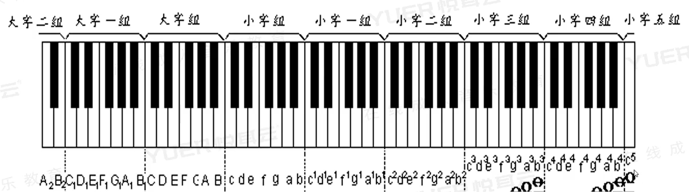

[第一节 音.pptx](https://www.yuque.com/attachments/yuque/0/2022/pptx/12393765/1660914830087-fb73cb2b-680d-45c4-8a4e-430e39eafd6d.pptx)
# 1 小字组和大字组
:::info

- 大字组用大写音名, 小字组用小写。
- 大字组的数字写在右下方，小字组的数字写在右上方。
- 小子组的组别越大，音越高。
- 大字组的组别越大，音越低。
:::

2 
