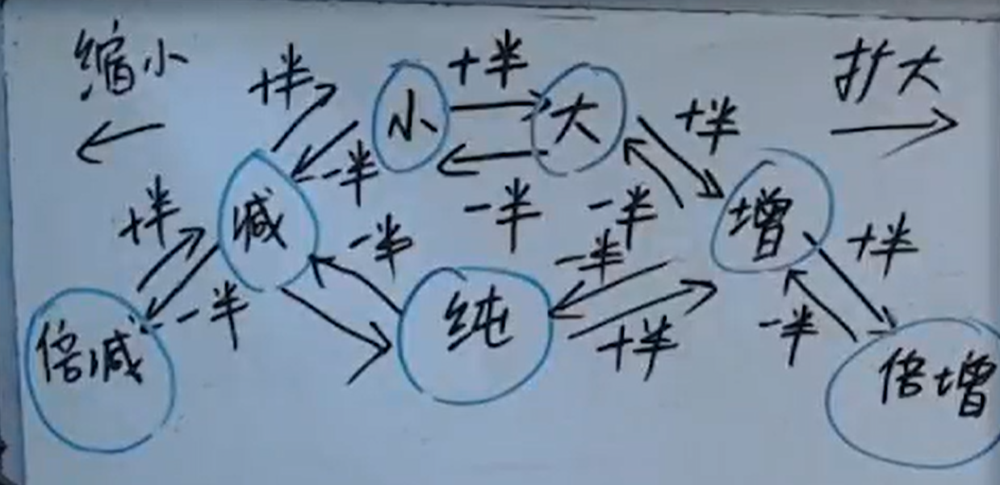
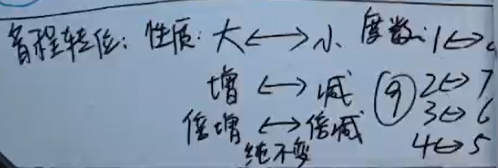
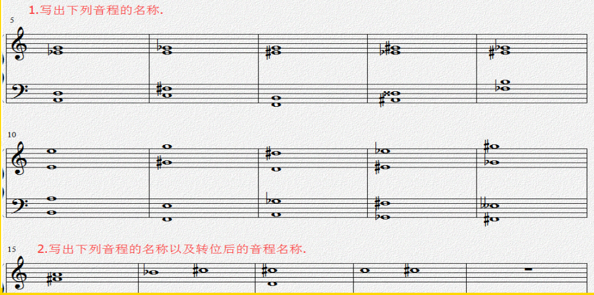

[第九节 音程的种类.pptx](https://www.yuque.com/attachments/yuque/0/2022/pptx/12393765/1662725000960-ed346a93-7867-4e77-892c-fdc0cbba36a4.pptx)

# 作业
> 

> 1. **高音区:**  大三度，减三度，减三度，倍减三度，倍减三度， 纯八度，减八度，增八度，倍减八度，倍减八度。
> 
**低音区: ** 纯四度，增四度，减五度，增四度，纯四度，小七度，大七度，减七度，纯八度，小六度。
> 2. 小三/大六，增二/减七，大七/小二, 增一/减八。

