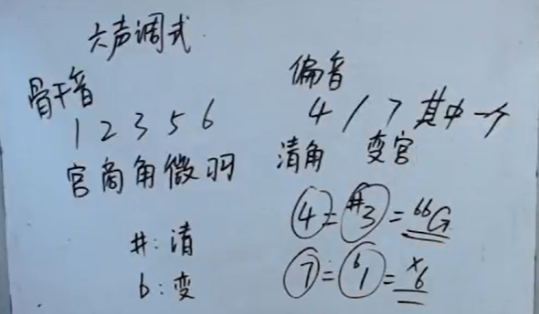
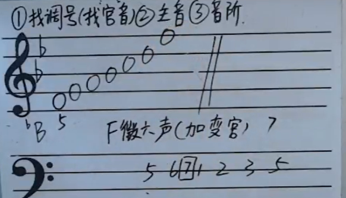
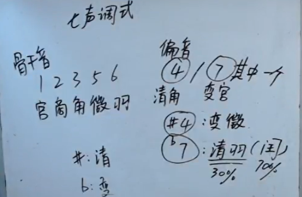
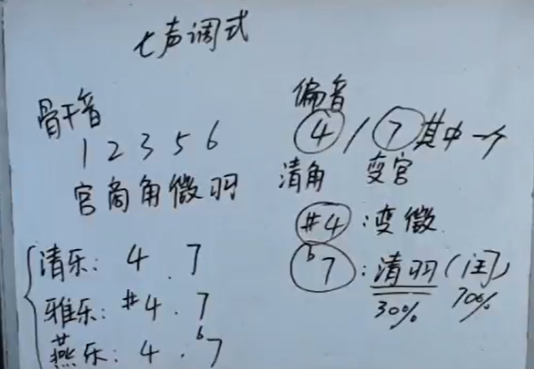
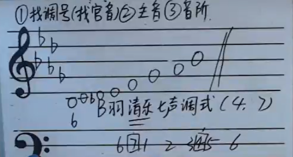
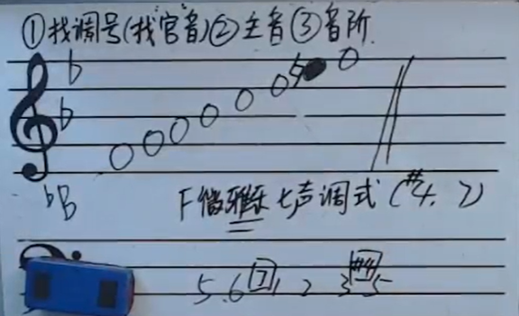
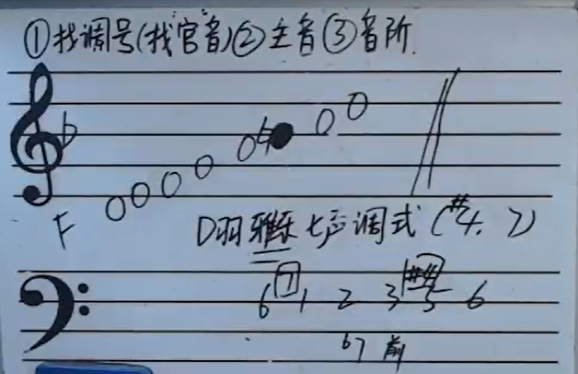
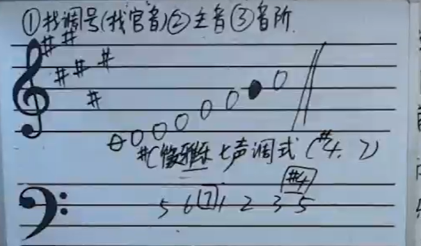

[第二十一节 六声七声调式.pptx](https://www.yuque.com/attachments/yuque/0/2022/pptx/12393765/1665677730906-26f301ba-1599-47e1-ad12-3d397381d65c.pptx)
# 1 六声调式/骨干音/偏音
> 
> **练习：**
> 
> 加变宫加在和之间，清角加在和之间
> 清角, 变宫

# 2 七声调式 
> 
> 清羽就是, 变徵就是
> 清乐的偏音是: 
> 雅乐的偏音是：
> 燕乐的偏音是: 
> **清乐：**
> 
> 清月七声调式找到根音和调号之后就可以直接从根音开始网上构音阶即可。
> **雅乐:**
> 

