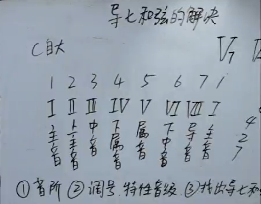
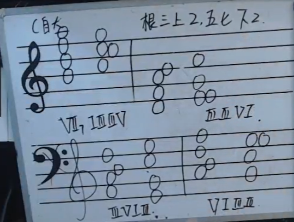
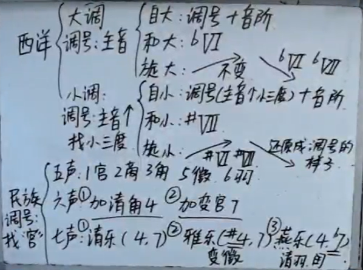

[第二十三节 导七和弦的解决.pptx](https://www.yuque.com/attachments/yuque/0/2022/pptx/12393765/1665677652396-ddadcda5-6278-45f7-8cd1-592ff39d7643.pptx)
# 1 导七和弦及其解决
:::info

导七和弦是7246
属七和弦是1357

:::

# 2 三和弦及其转位
:::info

:::

# 3 民族调
:::info

:::
