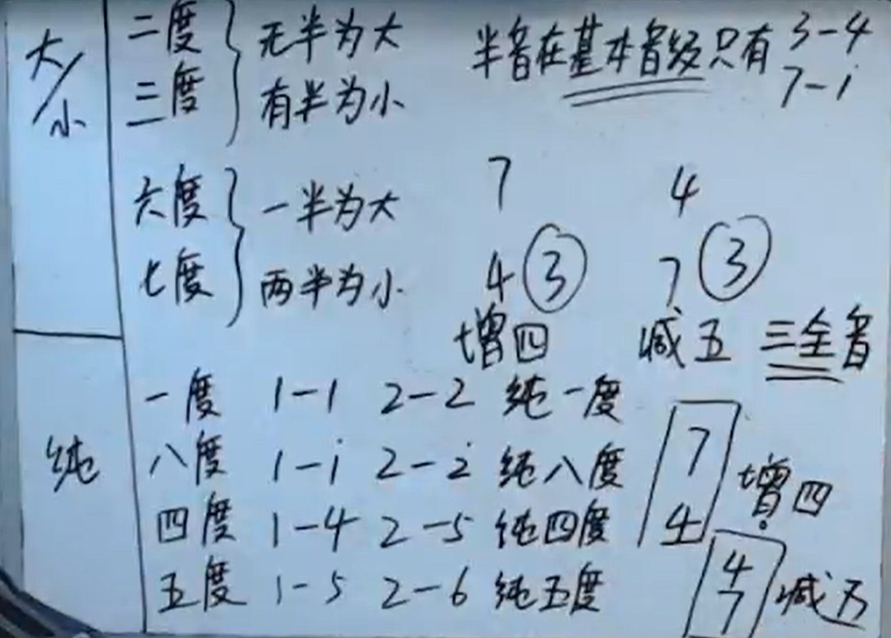
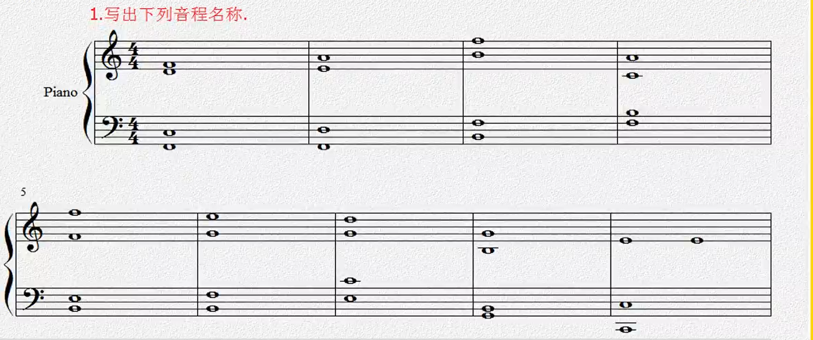

[第八节 音程.pptx](https://www.yuque.com/attachments/yuque/0/2022/pptx/12393765/1662384059731-4b181b01-58e8-489b-84a2-0f346c326022.pptx)

# 1 判断音程
> 

# 2 作业

> **高音区：**小三度, 纯四度, 减五度, 大六度, 纯八度，大六度，纯五度，纯一度。
> **低音区：**纯五度，大六度，减五度，增四度，纯四度，减五度，小六度，大三度，纯八度。

